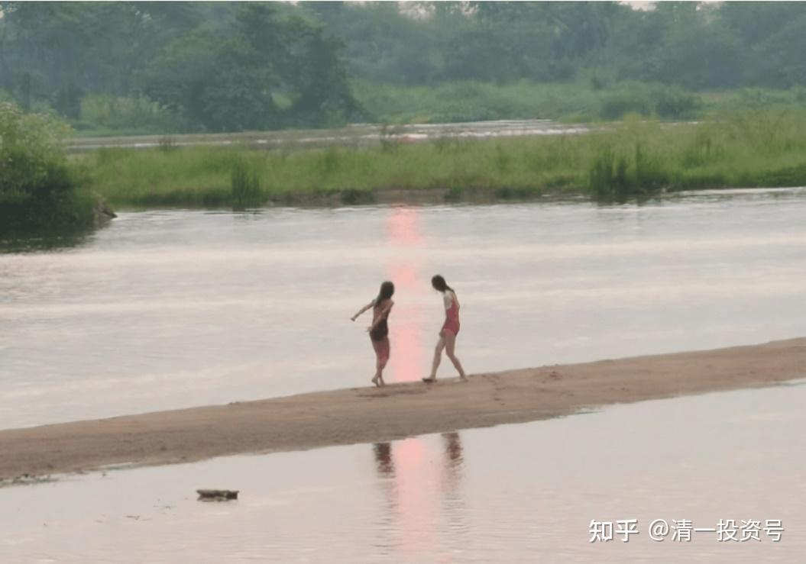

[原雪球专栏](https://zhuanlan.zhihu.com/p/573549252/edit)165篇.公主班的学生学什么？要做什么？

清一山长 2021年5月24日

这是公主班——**[新明德女塾的班级视频博客](http://link.zhihu.com/?target=https%3A//www.bilibili.com/video/BV1pA411L75T)**[网页链接](http://link.zhihu.com/?target=https%3A//www.bilibili.com/video/BV1pA411L75T)

哔哩哔哩网页链接：

[https://www.bilibili.com/video/BV1pA411L75T](http://link.zhihu.com/?target=https%3A//www.bilibili.com/video/BV1pA411L75T)

[仅学一年的霸气全英文演讲！（由明仪老师的学生自拍自编自导）](http://link.zhihu.com/?target=https%3A//www.bilibili.com/video/BV1pA411L75T/)

想看看这是一群什么样的人？可以去了解一下。目前只有一个班——泰国班。未来要去泰国的一流大学，认识并与泰国的上流社会人士成为朋友。

未来每年一个新的语种班，法国班、西班牙班、意大利班、日本班等，美国班吗？我们最后再去。宣告新一代中国人的存在——颠覆以美国为标准的教育格局的人，就是她们！这种人，我称为3.0版本的教育人！未来20年，我将培养20个这样的班级出来，组建**“新教育联合国跨国教育系统”[笑]**。

来上课的学员们，每天与她们一起生活，近距离了解公主班的学生是怎样生活和学习的，了解她们的信念和思维方式有何不同。

许红 南宁2021年5月23日22:55

今天在课堂上有幸聆听山长介绍公主班的成立机缘、办学目标，了解到公主班是目前培养未来清一新教育教师的最佳摇篮。课堂上，其中一个环节，公主班三个孩子落落大方地站在大家面前，笑盈盈地、机警地回答着山长提出的满是“坑”的问题，大厅里不时传来一阵阵会心的笑声和掌声。虽然展示的只是她们的部分状态，我已经看到了我想要的女孩的模样。

下午小组讨论时，大家都对小公主们上午的表现赞不绝口。忍不住讨论起如何才能把自家女儿送进公主班的问题。对照《公主经》，我分析着公主学生们的真实身份，我尝试着运用读心术——心智模式的反推，判断公主班学生未来的模样：

**第六层：呈现。**我看到的是初具高贵气质，性格积极阳光的女孩。

**第五层：行动。**透过孩子们坚毅的眼神，我判断她们经受过大运动量的磨练；从她们的笑容，我感受到她们正享受着周围老师和伙伴们满满的爱，她们享受过一次次突破自己的胜利、喜悦。

第四层：知识与能力系统。她们立志要掌握当公主需要的一切知识，学会中、英、泰三语，还要学会一切别的女孩学不会，学不好的知识和能力，只要能让她们超越的知识她们都想学。

**第三层：身份、角色定位。**她们是中国公主。

**第二层：信念、方法路径系统。**她们要在身体、心理、思维、能力上，均全面超越对手！她们相信别人能做的事情，自己都能做。别人不能做的，自己也能做！

**第一层：愿景、人生目标系统。**她们要成为中国公主，成为中国女性的榜样，成为新教育的3.0。

主意已定，我要用公主经的七大信念来对照自己，要想自家孩子成为公主，我必须得先做得像个公主。

周旻璐惠州2021年5月24日 08:23 心理行为第八天日记

弱者模式&强者模式

道家智慧用“事不过三”将世间的万物做分类，比如人的分类从性别来说，可以分为男人、女人、不男不女的；如果从生命状态来分，是：活人、死人、半死不活的植物人；如果按照人的行为方式来分，可以是经营者、消费者......而西方科学是复杂的。

我上过山长不少课程，财富、齐家、清心、江湖，加上这次的心理行为，每个课程，都没有任何重复的内容，课程的每一天都能帮我见到未曾见过的世界或思维模式，越上课就越能感受到山长的智慧深不见底、宽不见岸，感受到什么是中华真正传统文化的博大精深。唯有用心跟随与学习，踏实践行和用出来。

今天我们延续昨天课程内容，读心术，两性关系中的信念系统。两性关系上女人的信念分为两种。

弱者信念：嫁人，就是我是不完美的，我想找到一个完美的人。我需要一个人来照顾我！宠我，给我钱花！

强者信念：嫁人，就是找到一个我愿意为他服务的人！把我拥有的一切都献给他！

山长用了刘老师的案例：我想找一个读书人，让他不用操心钱，好好做学问！

做我们助教的三位公主班的小女生，与我们西语班的孩子一年前是同班同学，大家彼此没什么差别，但是在这次课堂上，大家看到了两个班级完全不同的状态：一个是挺拔、自律，开放的，一个是东倒西歪、茫然、松散的。让我们有了直观的比较，而造成这种巨大差异的就是这两个班级一年来所上的课程内容不一样，西语班在学习语言，公主班在调整信念系统和学习思维。完全没有想到仅仅一个信念的改变能给孩子带来如此天壤之别的差距。

今天课堂上，山长将三个小公主请上来，做了一个关于婚姻的对话，与昨天那三位喜欢帅、喜欢钱、还不知道自己追求这些是为什么的女生，这三位淡定、从容，毫不动摇的态度，让我们感受的强者信念：**我知道我的目标，我捍卫我的理想，所有不符合我目标的事物一概不予考虑，多少钱都不考虑**，（为了实现卓越的目标）需要吃苦，吃大粪也可以，甚至如果硬逼着（必须像别的女人一样度过一生），她们居然就不想活了，觉得这样的人生没意义。

孩子的变化是信念系统的模式置换，而最核心的是7大信念的第一条：明志。

同在今日学堂，也会出来不同的学生，公主班孩子有理想、有目标，每个灵魂都追求卓越，所以西语班孩子想要钱，想要帅，是通过拥有这些东西体现自我价值，希望通过外在的弥补自己内在的匮乏。**强者模式是我奉献我拥有的。**不同信念导致不同的行为，最终造就了高雅、自尊的高贵气质和市井俗气。喜欢什么样的生命状态，选择哪种，只有我们自己能决定。

被作为公主班对照版的家长，对小西语班的教学结果已经很满意了。

转发：南宁 覃英

在孩子的教育问题上，先生与我想法不一致，虽然我们家女儿进入新教育后变化很大，可以很确定地说，如果不是进入新教育，我女儿一定是废人一个，因为在体制教育她已经出现严重的厌学，身体也非常的差，心理问题也很严重，不尊重父母，对弟弟也非常排斥，这些都是3年前出现在我家的真实情况。而今天女儿不仅能在今日西语班上学，并且现在的学习态度，身体状况和心理与她当年的体制的同学相比，是完全不同的。这是事实——眼睛可以看到的事实。

参考链接：

[46篇.新教育送给中国人的礼物——中国公主](https://zhuanlan.zhihu.com/p/553173076)

[56篇.创造历史的清一大学：首届学生集体合影](https://zhuanlan.zhihu.com/p/551968023)

[58篇.明天,清一大学将演出莎士比亚戏剧,迎接新年！](https://zhuanlan.zhihu.com/p/551974574)

[64篇.世界的新未来大学，是怎样的存在？](https://zhuanlan.zhihu.com/p/559554811)

[【清一大学少年班】走进我们的日常生活](http://link.zhihu.com/?target=https%3A//www.bilibili.com/video/BV1Fi4y1F7uK/)

[敬请查阅：比欧三语首届毕业生成绩单](http://link.zhihu.com/?target=https%3A//mp.weixin.qq.com/s/RoyjFZVfB4ybK6NL2-PYjQ)

[这就是今日学堂](http://link.zhihu.com/?target=https%3A//space.bilibili.com/487498588/channel/series)

[2012年今日学堂](http://link.zhihu.com/?target=https%3A//www.bilibili.com/video/BV193411178W)
