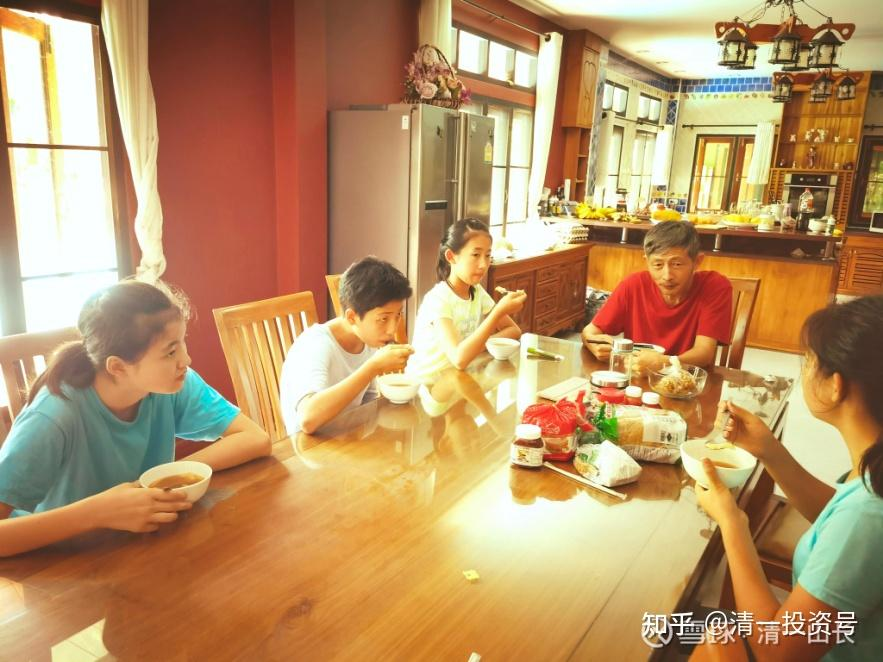

[原雪球专栏](https://zhuanlan.zhihu.com/p/577640175/edit)[175篇.千万大礼，送给穷人会是啥结果？](http://link.zhihu.com/?target=https%3A//xueqiu.com/9310099567/182731174)

清一山长 2021年6月12日

**穷人为什么穷？是因为穷人德行不够，不配富裕。**古人所谓的德不配位。让他们有钱，反而会伤身害命，所以，上帝慈悲，只能不给他们钱，只能勉强让他们活着，还能让他们做一个正常的好人。我这话，可能会得罪穷人，一定会挨骂的，但这是我多年经历发现的真理，不是我鄙视穷人。其实我很关心穷人，总想帮忙让穷人改变命运。却常发现我根本就帮不上穷人忙——他们要你用他们的方式，来帮他们发大财，不愿意接受我的方式。这怎么可能做到呢？

国内一些撤迁户，一下子就得了上千万补偿金。这些家庭的小孩，马上以“富二代”自居。天天吃喝玩乐，嫖赌成风，不求上进。这样下去，没几年，别说钱没了，首先恐怕命都没了。所以，真不如没钱好。这种家庭的孩子，没钱就不得不好好学习，天天进步，对社会还能做点贡献。现在有钱了，全成了废物，甚至坏蛋。

穷人，不直接给钱，给上千万最宝贵的升级家族命运的机会，会不会珍惜？从此改变命运？

我发现，此路也不通，穷人就是穷命，别想改他们的命。白给千万的好处和机会，他们也居然会拒绝的。

比如，我想送这样一个好处给人，您看值多少钱？

我跟一个下岗职工，家庭经济很困难的父母说：您的孩子七岁，我看小孩还不错，挺上进的，但上体制学校，将来恐怕不会有出息。不如交给我，跟我的孩子一起吃，一起住，所有的生活费我负责，将来上大学的费用我也全包了，我保证这孩子这样走下来，至少当个大学教授没问题，去大企业求职做个中层干部没问题，拿高薪也没问题。

您认为：我送出这份礼物给您的话，如果要花钱，您认为值多少钱？你们可以跟帖说说，你认为值多少？

我认为：您花一千万，能得这个好处，您都是大赚了。这价钱其实便宜得要命。一个国际学校的学费一年20多万，连读12年，就是多少钱了？加上18岁考上大学，我还帮你出钱四年，我带你跟我的女儿一起玩，一起改变底层信念。这钱值多少？这样，您十六年下来，要花多少钱？何况跟我的孩子一起吃住学玩，天天与上层社会交往、实践，认识高级圈子的人脉，跟我身边的高层人起码混个脸熟。这不比一般的国际学校好太多了吗？

关键还不是出钱多少的经济利益的问题，而是穷人家，根本就没有啥阶级上升的机会，家中很难得出现这个级别和档次的人物。一旦出现，这家人的命运，就不再是下岗工人，就成了中产阶级了。甚至个人再努力一点，难说就成了资产阶级的一员了。比如，我的学堂，一些从小接受我供养，免费读了十年的普通家庭的学生，现在是今日学堂的2.0教师，成为很多亿万富豪家庭的家长，鼓励儿子们努力追求的婚姻对象，一旦双方家庭联姻，这个工薪阶级的家庭，就直接跳过中产阶级，成了资产阶级了。这是穷人家改命的最好机会，花钱都买不来的

这照片里面，四个小女生中，有三个是在我家免费蹭学的孩子。因为她们是我女儿喜欢的小伙伴，我给了她们机会一起跟学。其中坐姿最端正的是我女儿，也许是从小要求的结果。

我们家的孩子，是不折不扣的富二代，生下来就含着金钥匙的。但在泰国人看来，她可能是民工级的孩子吧？[大笑]天天要干活，为家庭服务。今天我和小女的中餐，是**每人一份5泰铢的糯米饭，外加8泰铢一公斤的芒果**，我们拿来当菜吃，其他就没了。比泰国的民工生活费还低！

我们吃得很简单，但生活，也可以说是豪华级的，只是出外别人就看不出来罢了。比如孩子们居住的房子，是在泰国上亿泰铢才能购置的豪华大房和大花园里面。因此，除非泰国的亿万富豪，否则是不可能拥有这样的房子的。这种房子、大宅，还是警察重点保护的专户，每天巡逻的警察都要来报道一次的。有来泰国移民居住了30多年的华人朋友，第一次来家里，还吓了一大跳：她说自己来泰国几十年了，从来没进过这么大的房子，有这么大的院子。其实我已经见过多所这样的房子，甚至比我的房子的院子更大，更幽深，更神秘。她没见过，说明她的层级不够，见不到这个层级的人是怎样生活的。我住的房子，总面积有1200平方，每个房间都很大，连卫生间都比别人的一整套的公寓面积大。小女的房间一间就有上百平方，也是前房主女儿的闺房。现在她跟伙伴一起住在里面。这种房子一个月的电费，都是两、三个泰国人的工资总额。因为有游泳池要供电保养，净化水质等，特别耗电。所以，就算是我们吃最简单的饭菜，但女孩们的心态，绝对是亿万富二代的心态。将来去贵族大学上学，不会被别人的豪宅吓着的。反而自己从小住的地方，可能会吓着很多泰国的同学。

这两天跟艾拉说：国内缺教师，让她回国去拿两万元一个月的工资，居然拒绝不干。因为在她的价值判断系统中，在我身边，跟随我女儿一起学习的机会价值，远大于两万元一个月的收入。实际上，我如果要拍卖这种陪读机会的话，一年的学费，很多家长愿意给一百万的。中国家长，还是很愿意为孩子花钱的。但我让女儿来选择她的朋友来清迈，她选上了伙伴，我就免费供养，大家一起吃住和学习。我不想赚这种钱，我认为孩子们的友谊，比金钱贵重得多。我不想出卖孩子的纯洁感情来拿钱。虽然很多家长很期待我开放这种机会。

不过，人总要做贡献的，不能太自私。所以，我前段时间，跟女儿商量了一下，认为我可以给泰国的工人孩子。也给这种机会，跟她们几个一起学习。由于孩子们的泰语水平，已经达到了母语水平，跟泰国孩子一起，交流是没障碍的，所以泰国孩子来后，会进步很快的。孩子同意了，我就去找泰国工人，说明了我愿意帮助她的孩子，将来成为大学的教授，跟我的女儿一样。所有的费用我全部负责，将来出国的费用我包干。他们家什么都不用管。工人表示感谢，说要回家一家人商量，改天告诉我。这个家庭，一家子人，只有一个人有全职的工作，是做我的园丁，一份只有6000泰铢的工作。我接手后，觉得太低，就给加到了7000泰铢。他们很珍惜这份工作，生怕丢了。家里另外一个劳动力，到处找点零工，挣不到啥钱。所以，可以说这份工资，要养五口人（好几个孩子）。我以为：我给这个机会，给泰国这种家庭，简直就是“上帝之手”，帮他们从底层挣扎的命运中解救出来的，他们一定感激涕零的。

没想到，我得到的回复是：她们家的大人，都觉得孩子离开家生活不太好，还是希望住在家里生活。另外孩子也不能不上泰国的学校，因为要学泰语[捂脸]。想将来学好泰语再来找我们（这理由——泰国人教泰语比中国人强？我的学校教的泰语水平，外国人达到泰国母语水平，结果就在眼前，她们家居然都看不见？）。所以，泰国人希望孩子，只是假期来我们这里补习一下功课，以后再说。我晕——这种事情，就算了吧！千万礼物被脚踢了。好像我要抢他们家的孩子一样。

不过，这种事情，其实已经发生过一次了。18年前，我儿子身上就发生过一次。当年一个下岗职工家庭的孩子，跟我的孩子有点亲戚关系，但学习能力不错，孩子也想跟我学习，比我儿子大一岁。我就给了包一切，跟我儿子一个待遇，一起上我的私学。这是今日学堂除了我儿子之外的第一个学生。他6岁，我儿子5岁。上了一年学，成果斐然。两个孩子都像神童一样“至少武汉当年的报纸上是这样报道的”。家长领情吧？不领情。认为他们家孩子本来就很优秀，来我家是陪太子攻书，亏了。认为我们家孩子是“问题孩子”，不配跟他们家孩子一起读书。所以，第二年，别人就转学，要去华师附小上名校了。实在是瞧不起我的学堂和教育[捂脸]。

结果怎么样了？很令人意外：我家的“问题孩子”，今天上了今日学堂的明师荟当讲师。他讲的财富课程，我看是点击最多的几个讲座之一。现在到了婚龄，他被带班的女生们说成是“男神”，他的眼里还瞧不上一般的女生，眼睛里只瞧得起学堂里最优秀的小女生。而当年的“别人家的孩子”，今天恐怕连社会上最普通的女生都难以追上了。出啥事情了？当年，我发现这孩子学习能力超强，很聪明，比我儿子强得多。所以才给他机会来学习，我认为就算去体制上学，要考上985应该说很容易的。

据说，这孩子却最终连普通的大学都没考上，去当兵混碗饭吃去了。原因：望子成龙的下岗夫妻，估计小学时候加码压孩子学习，成绩倒是一直很优秀。但到了青春期，突然出问题，开始逆反，结果，就是连大学都考不上。来我身边，至于出这种问题吗？今天，我儿子是掌管数千万资产的资本管理人。另一个，社会地位跟当年的下岗父母也差不多，依然是底层阶级，苦苦熬日子。所以，**阶层跨越，不是给穷人机会就行了，送钱就行了。啥好东西，白送都不行的，得靠自己努力去拼搏才行的。天道不虚**呀！

各位，今天这故事，就是讲的“**德不配位**”。各位**千万不要骂老天不给机会，骂富人抢走了你的机会，骂别人不给你机会。而是你德行不够，谁给了你，也接不住的。**国际今日已经把我们的核心课程都分享出来了，我看穷人也不想跟着学，还是富人在跟着学。所以，穷人的穷命，就是天生的，我们改不掉，就别去管了。

国际今日学堂，将来还是要招泰国人入学的。但我已经不指望做啥好事了（前年也做过，请了一群泰国的穷学生，来我的庄园里面过了一个多月，结果把我的产业破坏太多，连好好的桌球桌子，都给他们打坏了。所以我再也不想帮穷人了，后来再也不请穷人来庄园里面长居，他们真的不配。考查半天，觉得工人的泰国孩子看着挺乖巧的，给机会别人还不要[捂脸]）。将来我给公主班的学生，任务就是直接打入泰国顶级阶层，只跟顶级阶层交朋友，做好最优秀的示范表率。然后——办学，收高价，让泰国的上层社会入读今日学堂，形成强强联合的局面。跟穷人混，赔钱还没个好话，我就不玩了！想要我给你机会的，请拿出你的诚意来——15岁，成绩考上SAT 1400分，我送你一份免费的学习机会。别的就别跟我谈了。

（以下内容为编者收录）

**评论回复：**

[ellhll李华丽](http://link.zhihu.com/?target=http%3A//xueqiu.com/n/ellhll%25E6%259D%258E%25E5%258D%258E%25E4%25B8%25BD)回复[清一山长](http://link.zhihu.com/?target=http%3A//xueqiu.com/n/%25E6%25B8%2585%25E4%25B8%2580%25E5%25B1%25B1%25E9%2595%25BF)：

谢谢山长分享。

看到山长的园丁6000泰铢每月，即使山长主动升到7000泰铢，一年也才8.4万泰铢，养活5口之家。

上个作业我是根据山长提到的盒饭5泰铢一人，度假村450泰铢一晚算出的29万泰铢吃住费用，加上30万泰铢预备款作为出行和出国旅游用，一共59万泰铢，相当于7个园丁家庭的收入了。

如果100万人民币（500万泰铢）买入的中国建筑，分红25万泰铢，如果算收益是75万泰铢，相当于9个园丁家庭的收入。上次山长提过拦着园丁不拿花园里的蚂蚁回去吃，那园丁应该是肉食，清粉是素食的简单饮食习惯，可能开支比园丁还要少。就是清粉的生活方式，5口之家一年的消费在泰国居然不用8万泰铢。每年75万的收益，还能有67万多继续买入中国建筑。

第1年的67万泰铢乘于1.15的9次方是2356977
第2年的67万泰铢乘于1.15的8次方是2049545
第3年的67万泰铢乘于1.15的7次方是1782200
第4年的67万泰铢乘于1.15的6次方是1549710
第5年的67万泰铢乘于1.15的5次方是1347605
第6年的67万泰铢乘于1.15的4次方是1171830
第7年的67万泰铢乘于1.15的3次方是1018986
第8年的67万泰铢乘于1.15的2次方是886075
第9年的67万泰铢乘于1.15的2次方是770500
9年之后合计有12933428泰铢（1293万）
原来的500万泰铢加上1293万泰铢合计1793万泰铢（385万人民）

9年时间从100万本金到385万人民币结果，额外还——
提供生活费；
提供自由时间；
提供教出职场赢家孩子的可能；
做自己热爱的事情；
基础只是100万人民币，居住泰国，践行新教育理念
不是谁都有园丁的运气得到山长的邀请教其孩子改变阶层
所以大家会旁观可惜园丁不懂珍惜。

但是100万人民币的财产，居住泰国，践行新教育理念，应该是很多人可以做到的。没有100万，50万也绰绰有余，无非总数小些，其它收获是不变的。

我们很清醒地看到园丁的可惜，我们可能会清醒地做出自己的选择吗？

**[清一山长](http://link.zhihu.com/?target=https%3A//xueqiu.com/9310099567)**[2021-06-13 18:15](http://link.zhihu.com/?target=https%3A//xueqiu.com/9310099567/182832112)回复[ellhll李华丽](http://link.zhihu.com/?target=http%3A//xueqiu.com/n/ellhll%25E6%259D%258E%25E5%258D%258E%25E4%25B8%25BD):

算的挺仔细的，学霸[献花花]。

“9年时间从100万本金到385万人民币结果”，你算的是股价这九年永远不涨的情况。如果万一风口来了，股价随便涨一涨，就更多了。

所以，有一百万资产，足够财富自由。在云南昆明这样的城市，都能生活下去了。其实中国人来泰国的生活成本比泰国人高得多。光签证费用，就要花掉一大笔。泰国政府会让我们每三个月签证一次，这是让我不选在清迈办学的最大困扰。而且如果家长的年龄不到50岁的话，取得长期签证费用更高。泰国人拥有的很多免费的基础生活条件，我们不能拥有的。一个月几千泰铢还真的活得比较穷困。不过今日国际学校所在地免除了签证费用（很低，可以忽略），这个地方生活水准与清迈差不多，可以实现你的这种海外生活财务计划。

你一路上有你回复清一山长：

清一山长：你就是个自恋狂，好像高人一等似的，穷人怎么了，每个人都有自己的生活，应该互相尊重。

**[清一山长](http://link.zhihu.com/?target=https%3A//xueqiu.com/9310099567)**[2021-06-13 19:34](http://link.zhihu.com/?target=https%3A//xueqiu.com/9310099567/182835966)回复你一路上有你:

我非常，非常地尊重您的生活和您的选择，并且非常地感恩您或你们的存在和努力。不过，很明显，我们并不是一路人，你也自动这样认为。由于担心我的不良言论恶心到您，影响您的心情，就太对不起您了！我就替您拉黑我自己吧！祝福您心想事成！[俏皮]

**[清一山长](http://link.zhihu.com/?target=https%3A//xueqiu.com/9310099567)**[2021-06-13 19:55](http://link.zhihu.com/?target=https%3A//xueqiu.com/9310099567/182836765)回复你一路上有你:

如果您认为的自恋狂，就是**“很喜欢、很享受我现在的样子和社会层级”**的人，我必须承认：您说的自恋就是对的。不过，我看您自己，也很喜欢您现在您自己所在的层级和生活状态，并不想改变什么，您只是希望我们不要来改变您，甚至不要让你们知道你们跟我们不一样。所以，其实骨子里面，我们俩是一样的人，对自己的身份都很满足。所以，我们俩，就不用互相攻击，到底谁更自恋了吧？[俏皮]

另外，虽然我喜欢我现在的样子，但并不意味着我要否定与我做出了相反选择的人的生活和行为。实际上，我非常，非常地尊重您的生活和您的选择，并且非常地感恩您，或你们的存在和努力。因为，**我今天得到的一切，其实都来自于你们的赐予和放弃。**狮子怎么可能仇恨羊群呢？**羊群效应，就是狮子选择生活的存在前提。**假如世界上，你们都选择做狮子去了，我看，我就会选择做一颗草去了。我会永远选择与您不同的路径的。

当然，我知道：虽然你们亲手送给了富人一切。但你们却表现得并不很情愿的样子，有点分裂。您们会假想，似乎是别人夺走了您们的一切好处。其实，真的，一切都是您们自己放弃的。比如，我在股票下跌的时候买入，我相信没有人用枪逼您们低位割肉卖给我。我在惠泉啤酒13元以上的时候卖出股票，我看到的成交单，有很多是一手，几手的买入小单。但显然，当时并没有人在用枪逼您花钱来买。是您们愚蠢，但却自以为聪明的脑袋，让您自动买进的。所以，我的富裕，的确来自于您们的恩赐，但绝非您们的期待。您的期待，其实是相反的，您更想抢走我们的钱。只是因为你们过于贪婪没有做到罢了。所以，我对此最终的结局，并无任何的愧疚之心，对你们只有满满的感恩之心。毕竟这就是一场游戏，您只不过由于太没头脑，输掉了您本来跟我一样多的筹码和资源。我愿意把这些财富，替您们用在更有价值的地方去[笑]。

通过您的发言，很明显，我们并不是一路人，您也不想成为跟我们一样的人。您对我充满了仇恨和厌毒之心。基于您所说的“互相尊重”（其实我猜你根本不知道这个词的意思），我决定替缺乏践行尊重原则行动力的您，做一点小小的亲自一对一服务：由于担心我的不良言论恶心到您，影响您的心情，这就太对不起您了！我就替您拉黑我自己吧！让您高兴地活在你喜欢的世界里面。祝福您心想事成！[俏皮]

**[一点点智慧](http://link.zhihu.com/?target=http%3A//xueqiu.com/n/%25E4%25B8%2580%25E7%2582%25B9%25E7%2582%25B9%25E6%2599%25BA%25E6%2585%25A7)回复[清一山长](http://link.zhihu.com/?target=http%3A//xueqiu.com/n/%25E6%25B8%2585%25E4%25B8%2580%25E5%25B1%25B1%25E9%2595%25BF)：**

他们的孩子如果按照你这种养法，孩子就不是他们的了，孩子成了你的。价值观念和你一致，想法和你一样，血亲是他们的孩子，观念和意识里，是你的孩子。这可能是他们不同意的根源。孩子是心头肉，他们也不放心，不能排除将来会发生什么不好的事情。

这些孩子是陪读，中国以前的大户人家请先生教书的时候，会给自己家孩子找陪读。
人过一辈子，不过是过热乎乎的日子，跟孩子思想各方面都格格不入了，生活便少了意义。

**[清一山长](http://link.zhihu.com/?target=https%3A//xueqiu.com/9310099567)[2021-06-13 20:04](http://link.zhihu.com/?target=https%3A//xueqiu.com/9310099567/182837214)回复[一点点智慧](http://link.zhihu.com/?target=http%3A//xueqiu.com/n/%25E4%25B8%2580%25E7%2582%25B9%25E7%2582%25B9%25E6%2599%25BA%25E6%2585%25A7):**

您说得对。孩子来上学之后，思想会变得和原来的圈子不一样。

但，当教授，必须和园丁的思想不一样。也只有教授能教出教授吧？我父母如果是园丁，估计我也差不多就只会种花了。我父母当特级教师，所以我就当不特级的教师，有样学样。我女儿也学父亲以当教师为目标，所以当不上商人。如果我想让孩子当商人，我会送到我的商人朋友家去的。所以，园丁想让孩子当教授，就必须让孩子和自己不一样。

**[周倩姣静心](http://link.zhihu.com/?target=http%3A//xueqiu.com/n/%25E5%2591%25A8%25E5%2580%25A9%25E5%25A7%25A3%25E9%259D%2599%25E5%25BF%2583)回复[清一山长](http://link.zhihu.com/?target=http%3A//xueqiu.com/n/%25E6%25B8%2585%25E4%25B8%2580%25E5%25B1%25B1%25E9%2595%25BF)：**

读懂山长文章的人绝对知道这样说不是不尊重穷人，而是尊重事实。穷人大都很“善良”，安于本分，但普遍眼界不高是真的。山长这里讲的，应该是思维之别，没有人之高低贵贱之别。

就像我跟一个青梅竹马的朋友聊天，让她这次捐点款修路，很难得公益事业，只可惜我各方面跟她都分析得明明白白，她口上也很认可这是好事应该捐，还佩服我，但最后都没有拿钱，这时我就清楚了，她的大气没出来，还是家乡喜欢贪便宜的小家子气。而集资完，组织者发红包时，她就赶快出来抢了，而这些喜欢抢红包的，大都在集资过程中甚至一句言都不发，也不捐款。真是一到做事情就掉链子，一旦有好处比谁都手快。[捂脸]

**[清一山长](http://link.zhihu.com/?target=https%3A//xueqiu.com/9310099567)[2021-06-13 20:18](http://link.zhihu.com/?target=https%3A//xueqiu.com/9310099567/182837789)回复[周倩姣静心](http://link.zhihu.com/?target=http%3A//xueqiu.com/n/%25E5%2591%25A8%25E5%2580%25A9%25E5%25A7%25A3%25E9%259D%2599%25E5%25BF%2583)：**

**富人喜欢付出，穷人喜欢白占便宜。由于心不一样，最终的结果就是不一样。**

DLJb2o回复[清一山长](http://link.zhihu.com/?target=http%3A//xueqiu.com/n/%25E6%25B8%2585%25E4%25B8%2580%25E5%25B1%25B1%25E9%2595%25BF)：

山长您好，从是否有金钱这个角度来定义穷人和富人的话，我认为我是一个穷人。穷人之所以穷，是因为德行不够，那日常生活中我怎样去做来提高我的德行？谢谢山长。

**[清一山长](http://link.zhihu.com/?target=https%3A//xueqiu.com/9310099567)[2021-06-14 08:37](http://link.zhihu.com/?target=https%3A//xueqiu.com/9310099567/182898155)回复DLJb2o:**

**修十善业。**

**[清一山长](http://link.zhihu.com/?target=https%3A//xueqiu.com/9310099567)**[2021-06-14 08:38](http://link.zhihu.com/?target=https%3A//xueqiu.com/9310099567/182898194)回复DLJb2o：

**修布施法门**。你们无非就是缺钱而已。**布施就是付出，帮助他人，不一定用钱。**

范小兵kal回复[清一山长](http://link.zhihu.com/?target=http%3A//xueqiu.com/n/%25E6%25B8%2585%25E4%25B8%2580%25E5%25B1%25B1%25E9%2595%25BF)：

通篇就是傲慢。没有谁天生就是富人，没有谁天生就是穷人。您就算有再多的钱，境界也不过如此。没有国家的强大，您什么都不是！100多年前，中国最富的人，在外国人眼里连人都不配。您又有什么资格鄙视穷人呢？！

**[清一山长](http://link.zhihu.com/?target=https%3A//xueqiu.com/9310099567)**[2021-06-14 08:46](http://link.zhihu.com/?target=https%3A//xueqiu.com/9310099567/182899240)回复[范小兵kal](http://link.zhihu.com/?target=http%3A//xueqiu.com/n/%25E8%258C%2583%25E5%25B0%258F%25E5%2585%25B5kal):

**骂别人傲慢的人**，是不是**自己的偏见很严重**呢？替您拉黑我了！因为您真没有必要来看一个境界不如您高明的人的文字[俏皮]。

[多多YS](http://link.zhihu.com/?target=http%3A//xueqiu.com/n/%25E5%25A4%259A%25E5%25A4%259AYS)回复[清一山长](http://link.zhihu.com/?target=http%3A//xueqiu.com/n/%25E6%25B8%2585%25E4%25B8%2580%25E5%25B1%25B1%25E9%2595%25BF)：

不知为什么，看了山长的文章感觉很有道理，但是总有点不舒服。不知是山长讲话风格的原因，还是自己穷人心态和认知不到位的原因[为什么]？

**[清一山长](http://link.zhihu.com/?target=https%3A//xueqiu.com/9310099567)[2021-06-14 08:56](http://link.zhihu.com/?target=https%3A//xueqiu.com/9310099567/182899580)回复[多多YS](http://link.zhihu.com/?target=http%3A//xueqiu.com/n/%25E5%25A4%259A%25E5%25A4%259AYS)：**

您不舒服，无非是认为您的身份被冒犯了而已。当您认为我代表富人鄙视了您，您的情感受伤。您给宇宙发出的身份信号就是“我是穷人”“我是被人鄙视的”。宇宙将把这个结果送给您，喜欢不喜欢就不好说了。

**我不抬举富人，我也不踩踏穷人。我只说事实，只讲我看到的东西。我就算是愿意帮助穷人，穷人还不要我的帮助。我说话来帮助穷人，穷人也不爱听我说，认为我废话。可是富人却愿意拿钱来听我说话，自然，他们只会越来越富裕**。好像为听我说话给钱越多的人，就越富裕。这就是真实身份的问题：由于富人更愿意付出，穷人更愿意求取。即使他们干一点活，也要相应的经济计较才愿意做。没有金钱的回报，甚至是短期内没有经济回报的事情，再好他们也不会去做的。

**我说话给你们听，这也是我的劳动，而且是非常高级的劳动，很多人没有这个能力来做这种服务的。**但我计较过你们必须打赏给我才能听了吗？**我根本不在意任何回报，甚至收获了一些人的恶言恶语，我也不在意这个结果**。所以，我是富人一点也不奇怪。因为这是**我展示的身份——我的心灵富足，不以外物穷达而转！**

完善资料很好回复[清一山长](file:///E:/%5C%E6%B8%85%E4%B8%80%E6%96%B0%E6%95%99%E8%82%B2%5C%E6%B8%85%E4%B8%80%E5%B1%B1%E9%95%BF%5C%E8%B0%88%E6%8A%95%E8%B5%84%5C%E9%9B%AA%E7%90%83%E4%B8%93%E6%A0%8F%E6%96%87%E9%9B%86%5C%E6%B8%85%E4%B8%80%E5%B1%B1%E9%95%BF)：无耻之人。

**[清一山长](http://link.zhihu.com/?target=https%3A//xueqiu.com/9310099567)**[2021-06-14 12:21](http://link.zhihu.com/?target=https%3A//xueqiu.com/9310099567/182911742)回复完善资料很好：

您自己留着用吧[大笑]！

**周倩姣静心回复礼敬：**

这是自然法则，也是宇宙的一个规律吧！整个宇宙就是一个能量场，您的心想的是好的，那吸引来的也是好的，就像如果心是富足的，无求无欲的心去做事，那结果自然是好报。

以前学生时代的我，也一直想不通这件事——那就是为什么要做好事？做好事到底对我有什么好处？为什么天生善良，天生喜欢帮助别人的我，确实偶尔还处处碰壁，不开心？后来才慢慢找到原因，原来是心上得了病，做了好事就想让别人看见，让别人回报，就想要得到点什么，完全违背了古人讲的“只问耕耘，不问收获”的宇宙法则。就是如果你做一丁点好事就让别人夸赞你，不然就觉得没有价值，那你做的那点好事也就没什么福气了。

反之如果我们能学习老子的智慧——道法自然，跟着大自然界的规律学，那就完全不一样！一条蚯蚓在土里爬来爬去，它肯定不会想说：它在为地球做着呼吸的作用；一只蜜蜂它每天辛勤采食花蜜，它肯定也不会想到：原来它在做一件非常伟大的事，帮助植物授粉、结果。

所以天道就是做了好事不居功，是最高境界。我们如果能放下做好事这个心，而把它当做一件自然而然的事情，哪里有需要，在能力范围之内就帮助点。且这个帮助不要求回报，那你的福气就真的很大，这样下辈子才能加倍有收获。如果做点好事就得到了回报，那也就两清没什么福报了，划不来。还不如说，等到下辈子多收点利息，福气多点，你就真的赚大发了。所以老天从来就是最公平的，只是我们看不透。当我这样想时，个人感觉世界于我没有任何的纷争，每每感觉到的都是善意。对别人的付出充满感激，对自己的付出，在能力范围之内视为理所应当，不足挂齿。因为世间最大的天道，就是付出才是本性，才是快乐之道，索取只是迷失真我，背后的恐惧、焦虑在作怪。如果您能做到这一点，知足常乐，无偿付出，那恭喜您，您这辈子将生活在幸福喜乐之中。这也是山长教给我们的智慧，感恩[鼓鼓掌]。

**[清一山长](http://link.zhihu.com/?target=https%3A//xueqiu.com/9310099567)**[2021-06-16 12:35](http://link.zhihu.com/?target=https%3A//xueqiu.com/9310099567/183172081)回复[周倩姣静心](http://link.zhihu.com/?target=http%3A//xueqiu.com/n/%25E5%2591%25A8%25E5%2580%25A9%25E5%25A7%25A3%25E9%259D%2599%25E5%25BF%2583)：

[献花花]。说得很好。**但做好事，不问前程。如果我是好人，做好事，就是我的本性，并不期待别人来理解我，来支持我，也不期待别人回报我。如果做了啥好事，就期待别人的回报，这就不是啥好人之心了，只是做生意之心罢了**。想做生意，当然可以，把生意做好也是一门学问。就别想吹嘘和让别人承认自己是好人。这样想，就没啥好怨念的了。我只做我认为对的事情。

改写命运回复清一山长：

这个清一山长，我见一次举报一次，把自己搞得高高在上的感觉，总是觉得自己是高贵血统，在时代里的汪洋大海里，只是一粒沙子而已，别太狂妄，做人低调点好。

**清一山长2021-06-1616:29回复改写命运：**

您想用骂我来改变您自己的命运，恐怕不够现实。如果您真想改变您的命运，您需要首先改变您的想法。如果您只是想要通过骂我，来改变我的命运，恐怕也只能是痴心妄想。除非我跟您持有一样的想法，否则我的命运依然不会改变。

您关注我，却又恨我，您太原谅您自己了。您还没学会与自己相处呢！当然，您更没有学会如何与别人相处。对我这样的人，至少您应该感谢我：您因为在我这儿留言，比您自己写帖子会获得更多的流量。其实我还有更多您值得感谢的地方，我就不一一列举了。因为你可怜的智力，恐怕永远也无法理解您需要感谢他人，而您是指控他人。

我非常地感谢您，以及你们的存在。我真诚地认为：是你们，成就了我的现在！没有黑，哪儿来的白？没有绿叶，哪来来的鲜花？

我也欢迎您举报我：我只是很好奇：您想用啥理由来举报我？我难道骗了您的色？还是骗了您的财？让我来猜测的话，您的财，实在不足以自恰，哪有多余的让人觊觎？至于您的色，就算您貌比潘安，但您是这样说话的，脸上一定是很难看的。不如您先照照镜子，整整容，再出来。免得吓死别人了！

也许您就是故意装厉鬼，故意出来吓人的吧？好吧！我要承认：您真的吓到我了。您的举报其实是威力无穷的。也许您可以召唤人民警察为您服务？还是让鬼魂来拷问我的灵魂？

看您恨我居然恨成这样子，我很诧异。似乎我抢走了您的女朋友一样。可您居然管不住您的手，居然同时要关注我。基于对您心灵所受伤害的万分同情，以及缺乏自我管控的能力，我就替您拉黑我自己了。

感谢您出来的这场表演和演说：您的存在，让我觉知到，国内您这样的人，也许就是大多数，只是他们沉默不语罢了。您也许只是他们的代言人，提醒我注意到你们的存在，以及内心满满的恶意。我真的很畏惧你们的存在，所以我更愿意远离你们，我的子孙后代，也愿意离你们远一点。**我只愿意跟文明、友好和善良的人，在一起共居。**老子云：“居善地”，我正在实践他老人家的教诲。

祝福您以及你们的同类，愿你们过着你们选择的生活。我也感谢上帝，没有让你们掌握权柄，掌握司杀之权。不然，我哪里还有活路！[捂脸]

**[集中投资](http://link.zhihu.com/?target=http%3A//xueqiu.com/n/%25E9%259B%2586%25E4%25B8%25AD%25E6%258A%2595%25E8%25B5%2584)回复[清一山长](http://link.zhihu.com/?target=http%3A//xueqiu.com/n/%25E6%25B8%2585%25E4%25B8%2580%25E5%25B1%25B1%25E9%2595%25BF)：**

你的这篇文章我是很认可的，你的修为水平非常高。我认为这来源于你的儒释道的国学水平扎实。估计你佛道双修。但，“居高者，形逸而神劳；处下者，形劳而神逸。”所以你知道的越多，心忧就越多，看问题就越深入，可大多数人还为五斗米折腰，还没有这种境界去感悟人生，所以很难接受现实世界的残酷，基本上就是鸡同鸭讲。这个世界，“仓廪实而知礼节，衣食足而知荣辱”是不会改变的。这个话题只适合私聊，看破点破公开在论坛，效果不会很好。期望拜读你更多大作[献花花][献花花][献花花]。

**[清一山长](http://link.zhihu.com/?target=https%3A//xueqiu.com/9310099567)[2021-06-16 19:14](http://link.zhihu.com/?target=https%3A//xueqiu.com/9310099567/183220479)回复[集中投资](http://link.zhihu.com/?target=http%3A//xueqiu.com/n/%25E9%259B%2586%25E4%25B8%25AD%25E6%258A%2595%25E8%25B5%2584)：**

感谢您的提醒，您的善意心领了。**我虽明知鸡同鸭讲，有时候也不得不讲。特别是居住在异国他乡，看到的国民素质，对比过于明显和令人难堪，身为华夏子孙，对此情况实在让人难以心安，无法满足于只是过自己家庭“福寿安康”的生活。所以我明知讲出来，会让人想要骂我致死，也不得不说这些不好听的话，期待也许会有些人，被我的言语刺痛后，能痛加改变。虽然说“仓廪实而知礼节，衣食足而知荣辱”。如果生存都有威胁，自然谁都无法来论道谈佛。也许我没有经济支撑的话，也只是贩夫走卒之一员，忙于生计罢了。只是我居于泰国，虽然国民的生活水平、经济能力，远低于国内。但国民的素质、心态，却远高于国内。**我只能痛心：中国虽然现在已经富裕了，但国民精神依然穷困不堪，WG（文革）对于传统文化的全面否定和打击，已经断掉了华夏善文化的根。国民负面意识非常的严重，一方面，我们举国在追求物质丰富的路上狂奔；一方面，国民的内在精神世界却在裸奔。这样持续下去，天知道何种惩罚，就会降临到这些无知愚蠢的国人的头上[哭泣]。毕竟造作恶业、不善之业，必然有恶报。邪恶之心，必引邪恶之报。但华夏人之共业，必有共报。覆巢之下，安有完卵乎？[哭泣][哭泣][哭泣]

**李宇萌回复清一山长：**

山长我想请问一下，您说了很多中国人的劣根性，那为什么中国现在发展得越来越好，甚至可能成为世界强国呢？是因为近一两百年积攒的福和受的苦？苦受够了，福没享到，所以时来运转了？如果福消耗了，又造作，就会没落和受恶报？[为什么]

**[清一山长](http://link.zhihu.com/?target=https%3A//xueqiu.com/9310099567)[2021-06-16 22:17](http://link.zhihu.com/?target=https%3A//xueqiu.com/9310099567/183233856)回复[李宇萌](http://link.zhihu.com/?target=http%3A//xueqiu.com/n/%25E6%259D%258E%25E5%25AE%2587%25E8%2590%258C)：**

大清、大明、大宋、大唐、大汉时代，中国都是世界第一的经济强国。甚至是世界第一的军事强国。

但是，您认为：这些朝代为何悲惨地灭亡呢？清亡于民国，亡于西方势力的兴起。但您别忘了，大清换政，是人口死亡最少的朝代，几乎就是相对和平换政的。更强大的大宋、大明，乃至汉唐，繁荣的王朝灭亡的时候，暴力杀戮非常的严峻，甚至90%的人口被灭杀。

论军事实力，宋明时代，中国的科技水平，以及中国的火器、火炮技术，居然是世界第一的，您知道这些历史真实的一面吗？大明与日本最强的丰成秀吉交战，战胜的秘诀是火器营。别说大清用大刀长矛对付西方火器才输掉了。大清输给西方，是观念的落后，不是武器的落后。大清其实当年买了很多德国的克虏伯大炮，但根本没用过，一直放在库房里面。八国联军进京，赫然发现：大清武库里面的武器，枪支比他们手上使用的更先进。所以，大清不是被西方的火器击败的，是被腐败的思想，自己击败自己的。

您认为：中国只要军事能力强，您手上有钱，您的生活，后代子孙，就有保障了？您太天真了[哭泣]。起码历史不是这样写的。

还有，东南亚的华人怎么这么多？他们怎样去的南洋？历史上，就是各种战乱时期，貌似下海逃过来的。没逃走的家人，可能留下来的就死了[捂脸]。

**参考链接：**

[明仪：我用一千万元，为我的教育信仰买单！](https://zhuanlan.zhihu.com/p/359080322)

[明颖：不做嘴炮，实锤筹千万对赌大学真假](https://zhuanlan.zhihu.com/p/358474498)

[明颖：千万大奖 教育擂台赛 比赛项目和内容细节介绍](https://zhuanlan.zhihu.com/p/358477821)

[明仪：美国大学破产潮 与未来教育原型车：清一大学](https://zhuanlan.zhihu.com/p/355549755)

[61篇.一元钱一碗的米粉是啥样的？善良不需要表演](https://zhuanlan.zhihu.com/p/552628201)

[67篇.一生的教育规划：用稀缺性原理成为人生赢家！](https://zhuanlan.zhihu.com/p/555240782)

[68篇.我以为考上了985，就不愁找工作！](https://zhuanlan.zhihu.com/p/555244021)

[敬请查阅：比欧三语首届毕业生成绩单](http://link.zhihu.com/?target=https%3A//mp.weixin.qq.com/s/RoyjFZVfB4ybK6NL2-PYjQ)

[85篇.未来世界需要跨国际，跨文化，跨专业的综合人才](https://zhuanlan.zhihu.com/p/563658774)

[104篇.踩着别人的尸骨入坑，还是踩着自己的血泪前进？](https://zhuanlan.zhihu.com/p/570447582)
