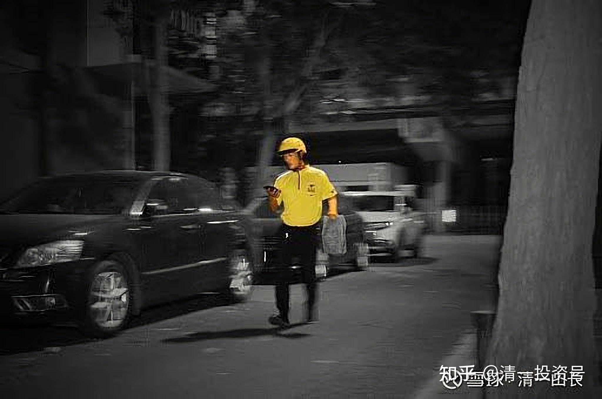

原雪球专栏177篇.美团外卖的小哥，花钱订我一万元小时的咨询！

清一山长 2021年6月19日

最近我的私人咨询任务不断，今天还刚刚结束了一对夫妻，以及他们青春期儿子的三人咨询，是南方发达地区的家庭，结果他们家庭都很满意。

我的私人助理，通知了安排好的明天的咨询任务。我一看咨询者的来信和问题就懵了——找我咨询的大多数是老板、富裕家庭。今天来要求咨询的，居然是一个美团送外卖的小哥，其实是老哥了，年龄已经快40了，拖家带口的。人生一直不成功，做过很多的职业；拜过很多的大师，花过很多的冤枉钱。现在居然只能送外卖养活一家四口，的确很不容易。但这伙计，居然拿几个月跑外卖才能得到的辛劳钱，找我要咨询回答三个问题。我觉得：他太大方了，太喜欢花钱了，以为花钱就能得到好命，得到财富吗？信中还说，前几年他花三万多元，找大师帮夫妻俩改名字，每个名字花了16800元。认为花钱越多改名字，命就越好。来信中有很多他花钱的故事，我看每一个，都是他上当受骗的故事。轻易地把自己命运的决定权，交给了一群江湖骗子（这些人可能会假装老师、大师，假装可以帮你改变人生，可以背着你去实现成功。其实，**真正的老师，只会指点你方向。路，还是需要自己去走的**）。

看样子，他赚钱是很不容易的。干嘛花起钱来，却如此随意？跟钱有仇吗？这人如果把他前半生中各种被骗掉的钱，都攒起来买中国建筑这样的高分红股票，恐怕早就可以不再送外卖了吧？现在的他，年龄快40了，还能送多少年的外卖？估计也是急了，让我帮他出个财务自由的主意。

这种钱，虽然很轻松如意（其实提供一小时一万元的服务，虽然比送外卖轻松，但还是比装大师，帮人改个名字要难得多，也更考验人的智慧和能力。一般人根本没法来承担我的咨询工作）。但我可不赚这种轻松钱，不接这种单。财不入急门，首先看他这样急乎乎的样子，到处求财，已经犯了穷命。不如守住自己的本分，想清楚自己要什么。首先的要点，就是不要乱花钱；首要的事情，就是安抚好身边人，满足身边人的要求，而不是花钱去满足“大师们”的要求。

不过，钱不收，但答案我还是给他回复了。至于我的答案他信不信，就自己决定了。为了帮助大家，我把回复他的问题和答案都发上来，让有心人都看看。说实话：一个愿意拿自己一两个月的全部收入来找我问这些问题的人，可能相当于一个王健林的一个小目标，相当于很多富人给我100万呢！所以，这种问题，估计也是大家感兴趣的，我就发上来供你们参考和学习吧！我这个人一点都不保守，不会假装自己的咨询多么的神秘，都是大白话。

咨询信的前面个人情况部分省略掉，不涉及个人的隐私了！

三、咨询问题：

1、我的信念系统哪儿出问题了，如何矫正？

你**有很强的求取之心，必然带来穷命。**你想投机取巧，想通过一些简单的骗人的法门就大富大贵（如花大钱改名），证明你是没脑子的傻子，自然也不会有智慧。

**如果你对钱不珍惜，钱也不会珍惜你**。你其实能赚钱的，但每次你都会把辛苦钱拿来被最弱智的骗局骗走。很奇怪！

如何改正？

**想要富裕，就去帮助别人富裕。别人得到越多，你也得到越多；想要赚钱，就去设法帮助别人赚钱。帮得越多，赚钱越多。**

2、我的天赋使命是什么？

“天生我材必有用”。想办法找到你自己通过什么方式来帮助世界，做事情，自己才最开心。这就是你的天赋使命。而不是到处找大师乱问答案。你的命运，是要你来做主的，不是别人给你的答案。你找了七个大师，给了你七个不同的答案，难道你现在希望我给你第八个答案吗？

3、我该选择什么样的事业，才能实现财富自由和人生自由？

**你能够帮助别人获得自由，你就能得到自由！你送给别人什么样的礼物，你就能得到什么样的礼物。**这是天道。**起心动念，以及行为，都是要帮助别人，满足别人的需求，你就能得到你要的自由**——财富和人生的自由。你应该从你的身边人做起，首先去满足你身边人的要求。有了钱，首先让家人开心和满足。而不是送给玄学大师们，让他们满足。

说明：这些答案免费给你，我不赚送外卖人的钱。**我的私人咨询服务，是给富人们玩的游戏，**不收你们打工赚钱的穷人的汗水钱。虽然咨询费，都是捐给清一武道馆的，我自己并不要。但武道馆也不接受普通打工人的捐助。请你从我今天的示范中，学会珍惜你来之不易的打工钱。每一份外卖，你能赚几元钱？你要积累送多少份外卖的钱，才够找我咨询一次？你这样的行为，跟原来被玄学大师们骗花几万块钱，改个名字求好运一样，是不珍惜自己创造的财富的表现。我也没有能力让你短期之内改变命运。所以，原来已经安排好的你的咨询邀约，我已经取消了。你把钱，好好用于给家人改善生活，或者找到更好的用钱渠道，保值增值去吧！

**穷人要学会自我学习，别指望高人、圣人来帮助你发财。**建议你修习富足之心，自己去好好地读《与神对话》，关于你的“身份”的部分认真研读。如果你真的读懂了，你就会富裕了。尼尔原来是流浪汉，连住的地方都没有，比你的情况要差很多。他可以靠“与神对话”，最终理解和践行“神”的智慧，获得财富和自由，你也可以！你最好连续两三年，认真的阅读和理解，践行《与神对话》，别到处乱找高人了，都是一群神经病！

（以下内容为编者收录）

**评论回复：**

爱花的牛费迪南回复清一山长：

请问在哪里能买到《与神对话》？

清一山长2021-06-19 08:09 回复爱花的牛费迪南：

如果您居然需要问我这个问题，我对您最良好的建议就是：啥？《与神对话》？去他妈的，千万别买！

因为，就算我买了书，白送给你，你也肯定看不懂的！还是别浪费时间了，也别浪费钱。我发现：您很善于让您的大脑，保持在全新的状况，基本上没用过。您可以将来用新货的价格，重新卖回给上帝。

另外给您一个最宝贵的建议：您最好第一时间离开雪球，离开股市。因为你来A股买股票，除了赔钱之外，基本上不可能有第二条道路了。委托别人帮您理财，可能比您自己买股票更靠谱。不过，考虑到您有一个全新的脑袋，可能您选的“理财人”，是一个骗子的可能性更大。

所以，对您来说，答案几乎就是无解的。[捂脸]还有，我主动替您拉黑我自己了。核心原因就是：我这里写出来的任何文字和表达，都极其容易被您的全新脑袋所误解。每一句话的真实含义，都要比找到买《与神对话》这本畅销书这件事要艰难得多。我很怕误导您，所以，就帮您拉黑我自己了。这个随手人情小礼物，您拿走不谢[笑]。

刘黄叔回复[清一山长](http://link.zhihu.com/?target=http%3A//xueqiu.com/n/%25E6%25B8%2585%25E4%25B8%2580%25E5%25B1%25B1%25E9%2595%25BF)：

说了跟没说一样。骗子现在这么肆无忌惮了。

**[清一山长](http://link.zhihu.com/?target=https%3A//xueqiu.com/9310099567)[2021-06-19 12:53](http://link.zhihu.com/?target=https%3A//xueqiu.com/9310099567/184351677)回复刘黄叔：**

1：既然知道我是骗子，你偏要关注我，难道您是傻子吗？
2：你已经骂我是骗子，你又偏偏不肯拉黑我，自己拉一堆屎，提提裤子就走。居然连个门都不关。您是啥东西？只有疯狗，才会这样乱咬的吧？做人，能一点自尊都没有吗？[为什么]

替您拉黑我了！祝福你去享受与我相反的生活和身份吧[大笑]！

**[卢嘉仪](http://link.zhihu.com/?target=http%3A//xueqiu.com/n/%25E5%258D%25A2%25E5%2598%2589%25E4%25BB%25AA)回复[@清一山长](http://link.zhihu.com/?target=http%3A//xueqiu.com/n/%25E6%25B8%2585%25E4%25B8%2580%25E5%25B1%25B1%25E9%2595%25BF)：**

没有觉悟能力的人，再好的东西摆在他面前都只是心灵鸡汤，除了真金白银，其他都不叫财富或好东西。格局太小，命运不好。祝福他多栽几个跟头，可能可以早点开启智慧。

**[清一山长](http://link.zhihu.com/?target=https%3A//xueqiu.com/9310099567)[2021-06-19 14:03](http://link.zhihu.com/?target=https%3A//xueqiu.com/9310099567/184356081)回复[卢嘉仪](http://link.zhihu.com/?target=http%3A//xueqiu.com/n/%25E5%258D%25A2%25E5%2598%2589%25E4%25BB%25AA)：**

你不能“祝福他多栽几个跟头”。宇宙会认为：你是不是“喜欢栽跟斗”的。就会送给你这个礼物的[捂脸]。这就悲剧了。
所以，你只能祝福他：既然你看不起我们，不喜欢我们走路的样子，就祝福你跟我们不一样，允许他用跟我们不一样的方式来走路。然后——你就认真的、稳稳的走路。他就只能爬着、滚着的走路了，因为——他要用跟你不一样的方式走路。你允许他自由选择，宇宙就会给你，你现在走的路和方式。他的宇宙，会给他选择的方式。他选了“跟我们不一样”，宇宙就会给他“不一样”。
所以，你们**千万别出恶语，别发恶愿。别人再坏，也别希望别人倒霉。但可以祝福别人跟我们不一样，这就叫尊重。**我们自己呢！**既然知道有人看我们不顺眼，就更要小心一点走路，要走得更稳、更长。**

投资即生活-少洪回复明镜无台：

1、自己不说“污蔑、攻击”人的话；
2、远离说这类话的人；
3、说能成就人的话 (否则，保持沉默) 。

**[清一山长](http://link.zhihu.com/?target=https%3A//xueqiu.com/9310099567)[2021-06-21 13:30](http://link.zhihu.com/?target=https%3A//xueqiu.com/9310099567/186448949)回复投资即生活-少洪：**

我的名言是：**我绝对不会骂你是猪，我只证明你是猪！**
前者是情绪，是非理性，是负能量。
后者是理性，是思辨，类比。不是负能量。

如果后者采用“证明你是猪”的方式，目标是帮助你提升、改变，不是为了攻击你。结果就是正能量！所以，不要拘泥于某些词汇，而要观“心”之所在。当然，如果你们“没心”的话，不建议模仿我。就只说好话，别说坏话！别惹祸上身。[俏皮]

参考链接：

[62篇.海归富二代患抑郁症，赴死前来上我的“最后一课”！](https://zhuanlan.zhihu.com/p/553825718)

[101篇.人生转轨，只需要一场对话搞定](https://zhuanlan.zhihu.com/p/570236186)

[106篇.借用外脑，是最低成本的改错方式！](https://zhuanlan.zhihu.com/p/571033703)

[110篇.心理行为课程：寻找您的真实身份](https://zhuanlan.zhihu.com/p/571054205)
