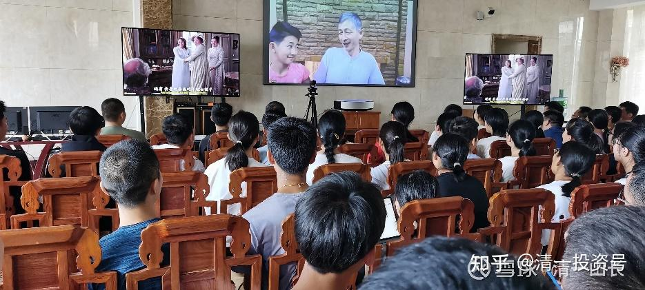

原雪球专栏[178篇.12岁小女生，可以拥抱老德鲁克吗？](http://link.zhihu.com/?target=https%3A//xueqiu.com/9310099567/184339542)

清一山长2021年6月19日

您能相信：12岁的公主夏令营，她们将要开启的课程，居然是德鲁克的人生管理智慧吗？居然是高端的【**心理行为学课程**】吗？是不是太“不儿童”了？难道我们不能**给孩子更多一点成熟的教育，让她们的人生更早就开始有序规划**吗？

彼得·德鲁克，号称现代管理学之父。他是很多CEO的导师，也是很多做出重大决策人，需要去专门请教的高级思想库、咨询师。他是第一个创立“**知识工作者**”概念的文化人，用自己的管理知识来服务世界，并创造了**“知识付费”**的概念，成为新时代的弄潮人。我的咨询付费，一万元一小时，其实就是来自他的指导：作为管理专家的德鲁克，认为**不应该给不愿意为你的知识付费的人，提供免费的咨询服务。**不是因为自己缺钱用，而是因为：如果他们不愿意为您的知识付费，就说明他们不认为您的知识和咨询是有价值的。持有这种认识的话，你的咨询和建议就不会有作用。但如果他付出了一笔合理的费用，他的态度就会认真很多，你的咨询服务也才会真正的帮助到他自己。所以，几年前，我就对要来拜访我的一位老板，要求他为我的接待按时间付费。因为我原来曾经免费接待过他，他总是说一些礼貌客气的话，绕很多圈子来说话，还要坚持请我吃饭等。我觉得这样太浪费时间了，双方都很累，特别是他专门坐飞机大老远来看我。后来有一次，他又说想来见我，我就直接要求他：可以见我，按小时计算收费。但我希望双方见面，我可以帮助他解决实际的问题，如果只是礼节性的拜访，就算了。结果，他认真地写了要咨询的三个问题，花了我五个小时的时间。然后，找我要了账号。我是这样说的：如果您认为我的咨询和建议有价值、有帮助，就给我随意打一点您觉得合适的咨询费。如果觉得我的咨询没价值，就不用给我钱。因为我其实根本不在意别人给我多少钱。我也不知道该怎样开价更合适。我想：这些都是老板，他们可能更善于评估我的服务价值吧？

结果，第二天，我的银行卡上多了50万元[为什么]。每小时十万元。这老板还一再地说：这钱花的太值了，解决了他很重要的企业和家庭的问题，甚至还解决了他资产保值、增值的问题。老板说：采用我的方法后一年，他就用我教的方式额外的多赚了数千万。所以说我的咨询很有价值，他太划算了。

不过，我不认为是我帮他额外多赚了数千万，是他自己的福报大，**我只是助缘罢了**。但我也觉得自己的随意打赏模式，让别人为难了。为了避免老板们找我，为应该给我多少咨询费而费脑子，我就干脆规定：每小时一万元。就此开启了我的**“知识付费服务”**。不过，有时候会遇到阔太太们，找我咨询，其实是想聊天、倾诉。恐怕她们实在是闲得无聊了，钱也用不完，花钱找我说话。跟她们买个包一样，是一种身份的标志。我发现后，又干了一件事情：先提前写好咨询内容。如果内容没啥重要的事情，或者不认真提交咨询内容的，我就拒绝服务。估计我这样的咨询人很稀有，居然有钱都不赚。其实是我认为：我的每一小时的时间价值，是远远高于一万元的。只是用来陪阔太太们聊天，实在太浪费生命了。用来帮助人，倒是可以，自利利他！我没事可以跟我的小女儿聊天，帮助她成长，何必跟别人去聊。

我拿到的第一笔咨询费，变成了下面图片中的红木家具！

也是大家在【[清一大学生活视频](http://link.zhihu.com/?target=https%3A//www.bilibili.com/video/BV1Hr4y1K769/)】（哔哩哔哩网页链接[https://www.bilibili.com/video/BV1Hr4y1K769](http://link.zhihu.com/?target=https%3A//www.bilibili.com/video/BV1Hr4y1K769)）中看到的很多高档家具，让人以为是在高端会所专门去拍的影片。其实真的就是我给学生们提供的学习基地。书桌、餐厅的桌椅等，都是采用了中式的红木家具。我在国内的时候，也居住在这里的。总面积超过2000平方的大平层套房。最大的房间如图中，有150个平方，这样的房间有两个，超过100平方的房间有五个。

**以上就是介绍德鲁克对我的帮助：他提供的自我时间管理，以及知识付费的概念，对我的指导价值。**

他对于人生的管理，还有更多的智慧，帮助了很多的企业界人士。这些智慧CEO们可以用，难道12岁的小女孩就不能学吗？这就是我今年暑假的尝试：我要把德鲁克的人生管理智慧，用来教孩子们，从小就学会管理自己的人生。学了德鲁克的人，绝对不会是盲目无知的度过一生，不会是混日子的一生。它将为小女孩们，开启一个“自我掌控管理的高级人生”。

这就是7月1日要开启的小公主夏令营。据说，每一个女孩子，都是小公主。我们就像对待小公主一样，好好地对待她们，教育她们，让她们将来，有机会成为大公主吧！[大笑]

本届公主夏令营，今年7月1日，公主班夏令营就开始了。这个营，由我亲自设计和安排课程（今天我就在写第一天开营的课程设计安排），刘灿和明仪老师，以及高中部的两个高中女生做助教，以及十个今日学堂公主班的小公主们，做小组长的夏令营，与新来的孩子们同吃同住同玩同学。这注定是**今日学堂历史上阵容最“豪华”的夏令营**。但收取的营费，却只收极为普通的正常学费。与欧美国家夏令营费比正常学费超高数倍完全不一样。所以，可以说是今日历史上性价比超高的一次夏令营。实际上，这是一次**小女孩版的“心理和行为培训课程营”**，价格只是我正常培训课的几分之一。相信结营后，家长们会收获完全不一样的**“新女儿”**的。正因为本次公主夏令营的价值超常，所以引来了大批的家长报名参加，已经超过了我们所能接待的最大容纳量（200人）。所以，只能把年龄超过以及不足的数十名申请者，都拒之门外了。

不过，放弃的名单中有11位体制学校学生，不是因为年龄，而是因为没有清粉做推荐人，所以很遗憾，这些女孩就没有被录取参与公主夏令营的机会了。因为我的内部课程，只接待我们的清粉，不接待**“外人”**。其实，这些外人怎么知道我们的招生信息的，我都有点奇怪，因为我们的内部夏令营计划，除了清粉们，是不公开宣布的。但居然有11个根本没有清粉推荐人的申请入营者，就只能遗憾地被拒了。

所以——维持清粉的资格，得到清粉的推荐，还是很重要的。我们已经是一家只对**“圈内人”**开放的教育平台了，我们的教育资源，自己人都不够用，更不会开放给普通的非清粉了。外面人，看着热闹，却无缘进来。无法和清粉做朋友的人，孤独的散沙人，我们基本是不接纳的。祝福大家，共同进步！

**公主夏令营，第一课：弄清楚你是谁？**

**德鲁克 人生智慧 十条思考**

**（思考一下作业，第一题，是第一天、第二天两天的学习内容，会通过经典电影等作品来帮助学生们理解抽象深奥的身份、信念等心理学定义）。**

**1、弄清楚你是谁**

“无论何时，在通往成功的道路上，人们在遇到失败的时候往往会重新定位。但是我要说的是，你在成功的时候就应该重新定位，因为只有那时你才有这个资本。

如果一个人不先弄清楚自己是谁、属于哪里，就不可能为了有意义的人生而重新定位。”

**问题：婚姻关系中，你是谁？你是什么样的男人或者女人？你属于谁？服从于谁？**

**你认为用男女关系来看的话，男人是什么身份和角色？女人是什么身份和角色？**

**公主夏令营 电影版 思考问题：**

**（1）根据影片中出现的人物，请选择你最喜欢的人物和身份，如果回到这个时代，你愿意成为谁？愿意嫁给哪一种男人？**

**（2）通过影片，你发现了这个时代，女人唯一的人生使命是什么？高级女人和低级女人区分的唯一标准是什么？这与现代社会有什么一样的？有什么不一样的？**

**（3）如果你要嫁人，你出嫁的理由核心是什么？你为什么要走入婚姻？**

**（4）在电影中，女主角因为家世卑微，不被身为贵族的男方家庭所接受。她就改变了自己原来的活法。你认为：她改变了什么？没有改变什么？如果你是女主角，你会怎么办，才符合你的心意？**

**（5）每一个时代，都有“好女人、坏女人”、“高档女人、低档女人”。您认为，影片中，做一个好女人，意味着什么？做一个坏女人，意味着什么？为什么男主角的妹妹，嫁给了贵族。但她却希望自己去做一个坏女人？**

**（6）试着讲故事，女主角的妈妈：在她当红之前，她有过什么样的经历？在她当红之时，她做了什么样的选择？后来她又做了什么样的事情，来避免自己流落街头？她拥有的聪明才智，如果放到现代社会，很可能会做什么事情？这个时代，她不得不做什么事情？**

**（7）电影中，出现了各种女性角色，你认为对于男性来说，她们是什么身份？男人的娱乐品？玩物？宠物？人生的伙伴？繁殖的工具？还是值得尊重的女神？沦为工具的女仆？**

**2、为自我实现而重新定位自己**

“在职业生涯的早期，人们看问题通常只能看到很有限的时间范围，差不多只能看到4年，他们无法想象4年之后的事。

但是，当他们取得了一定的成就之后，时间范围就扩大了。他们突然开始思考往后20年、30年，甚至更长时间范围的各种选择。

这样长远的眼光会带来以前从来没有过的清晰思路。”

**问题：四年之后你在做什么？40年之后你在做什么？100年之后，你希望你的子孙后代如何提起你？评价你？**

**（电影版：如果你像电影中你选择的角色一样生活，你推测你四年之后你在做什么？）**

**3、找到你存在的核心理由**

**“巨大的成功与回答人生根本问题的能力之间，有很强的相关性**，我认为最成功的人士都有很坚定的信仰：宗教信仰、持守敬虔与社区中的成功人士有巨大的相关性。**”**

**问题：你来人间，拥有一个生命，但你活着的目的和意义是什么？你存在的核心理由是什么？**

**（电影版：当你像电影中你选择的人物一样生活的时候，你活着的目的和意义是什么？你为何选择这种生活？）**

**4、要有人生的紧迫感**

把你的人生当成你的最后阶段，唯一值得努力的目的，是把平凡的一生变成有意义的一生。

**问题：如果你的生命，现在只剩下五年的时间可以活了。你想怎样来安排你的生命，让它发挥更大的价值？好好过完你剩下的五年生命时光？**

**5、计划不起作用**

“机遇往往不期而至。太多的计划会让你对机遇充耳不闻——机遇会来敲门，但只敲一次。你必须为这个机遇做好准备。”

**问题1：人生的机会，其实是很有限的。有时候错过了就不再回头。你们只有一次11岁，你们也只有一次初恋。即使你也许可以拥有多段感情、多段婚姻，但也只会有一次铭心刻骨的爱。这些都是错过了就不再来的人生体验。你怎样才能不浪费你人生中的“每一次机遇”？**

**问题2：最近五年，你最想得到的人生机遇是什么？如果这种机遇只有一次，你怎样才能为这个机遇做好准备？**

**6、了解自己的价值观**

“如果你不尊重自己的工作，你不仅做不好这份工作，而且还会使你消沉下去，最终甚至可能杀死你，比如，99%的医生不应该成为医院的管理者。为什么？因为他们看不起那份工作。他们是医生，他们觉得医院管理是办事员的工作。”

**问题：你认为什么样的职业，才是最好的职业？你怎样才能得到这样的工作机会？你需要付出什么样的努力和代价？**

**（电影版：你认为在这个影片中，在这个过去的时代，你选择什么样的职业和身份，才是最好的职业和身份？你为此需要付出什么样的努力和代价？）**

**7、定义善始善终对你意味着什么？**

“我对成功的定义在很久以前就改变了，我热爱咨询工作和写作——做这些事的时候我经常忘记了时间。要善始善终，要想让人们记住我什么，这些事情现在就很重要。对一些人的人生产生影响，是一个很值得为之奋斗的目标。帮助一些人去做他们想做的事——我的确想要人们因此而记住我。”

**问题：据说，人能够一生只做一件事情，把这件事情做好了就很了不起。你希望你的人生，能够坚持不懈做的一件事情是什么？你怎样才能让人们，因为你做了这件事情来记住你的存在？**

**8、了解播种和收获之间的差别**

“有很多年的时间，我用产量（output）来衡量自己的工作——主要是书籍和其他写作，好多年中我的工作效率都很高。今天我的工作效率没有那么高了，因为现在是收获之年，不是播种之年。”

**问题：你认为播种和收获之间有什么差别？德鲁克此话，意味着什么？身边的人们，你认为他们在耕种什么？收获什么？**

**9、只有良好的意愿是不够的**

**“**非营利机构通常成果不够，因为“它们不要求成果，根本就不知道它们想要什么成果。它们是好意，具有最良好的意愿，但是（如格言所说）**良好的意愿只会铺下通往地狱之路。”**

**问题：为什么会说：良好的愿望只会铺下通往地狱之路？你怎样避免你自己成为一个“非盈利机构”一样的人？**

**10、认识到“不学习、不成长”的代价**

“我看到越来越多的40多岁的人，他们一直很成功，他们在工作和职业生涯中做得很好。但以我的经验，他们最终会成为这三种人之一。

第一种，是退休，他们一般不会很长寿。

第二种，他们继续做原来的工作，但是已经失去了热情，感到活力减退了。

第三种，他们还在继续做原来的工作，但是想方设法寻找有所贡献的途径。

他们感觉自己得到了很多，因此寻找回馈的机会。他们不满足于只是给人以金钱上的资助，他们想参与进去，更积极正面地去帮助他人。”

**问题：你认为，你的父母是以上三种人中的哪一种人？你喜欢这种生活吗？你自己想做哪一种人？你怎样才能做到？**

**参考电影：**

**《**红颜祸水Dangerous Beauty（1998）》

《神秘巨星Secret Superstar（2017）》
