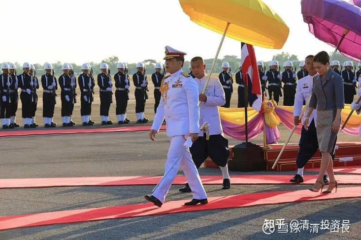
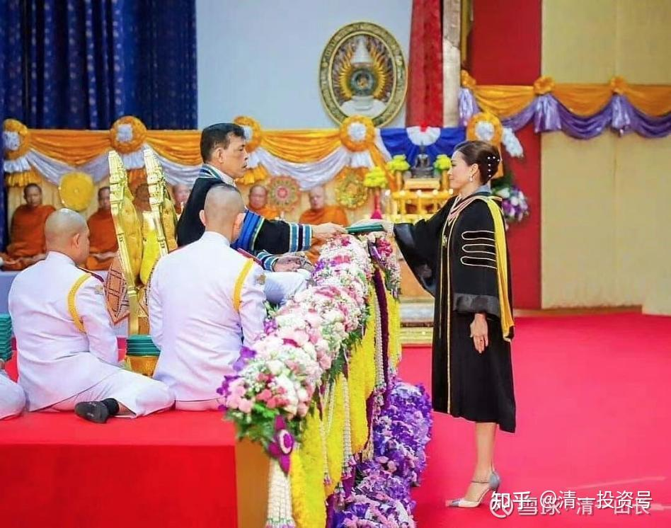

[原雪球专栏](https://zhuanlan.zhihu.com/p/580123623/edit)[179篇.高考游戏——现在还有加入的价值吗？](http://link.zhihu.com/?target=https%3A//xueqiu.com/9310099567/187090937)

清一山长 2021年6月24日

最近看到清粉转发的高考录取信息：有些省的大学本科录取线，已经降到280分了，专科才160分，而总分是750分。我相信：一头猪，只要教会它填写标准答案的答题卡，啥都不用学，凭答题卡瞎蒙，概率上也能拿个差不多200分的。恐怕猪八戒先生，想要考个大学，也不是难事吧？起码能上个八戒专科大学。

还有比280分更低的门槛吗？还真有的。海外的一些大学，甚至开出了零门槛的条件——只要您有一个高中毕业证，无论成绩如何，就可以去海外上大学了。考虑到中国这些学渣，数理化不好可以理解，外语水平肯定也稀烂，所以这些大学还提供了非常好的条件，就是提供双语授课服务，就是——你不懂外语也没关系，他们配个翻译，让你上课。而且学费还不高，泰国的普通的公立大学，大约每学期3～4万泰铢就够了，私立大学高一些。

这差不多就是告诉你：就算是一头不会填写答题卡的**“**猪**”**，只要家里肯出钱，就能出国留学，而且还不是野鸡大学，是很体面的泰国国立大学，中国教育部认可的知名大学，国王还亲自给你发文凭。所以，无论中外，大学文凭这含金量，实在是低得可以。

上图是前不久，泰国国王来清迈皇家大学颁发文凭的照片。

上图中的这所**“**清迈皇家大学**”**，是与三语高中签订了合作协议的泰国公立正规大学。给我们的入学要求中，有一条特别吸引中国学生：只要拿到了高中毕业证，就算是没有雅思的成绩，也能入读这所泰国还算不错的大学。学费也不高，国际学院的学生，每学期3万泰铢。

简单地说：只要你满了18岁，有个高中文凭，就能上大学。干嘛费劲参加高考？找抽不是？

简单地说：现代再谈什么考大学，拿文凭，已经变成了一个苦差事——是一场**“赢了没好处，输了输不起”**的学习比赛。大学文凭，现在已经贬值到无以复加的地步了。哪里像我年轻的时候，别说重点大学毕业了，当时只要有一个中专毕业的文凭，就算你根本就没啥真本事，也可以稳稳的有一份国家保障的好工作可以干的。

现在，家长们面临的局面真的很难堪：由于现在，连一头**“**猪**”**，只要家里有钱，都可以上大学了。就算你们全家奋斗12年，帮孩子考上大学，大概率，大学毕业后，一样的找不到工作(随着企业的内卷化，未来一个体面的就业职位，是很难获取了）。

但是如果放弃考大学，社会评价你为：连大学都考不上，不是连猪都不如吗？真的没法活了。

所以，家长们现在真的很盲目：要不就不得不跟大批的“猪”一起参加比赛。不参加比赛，将来孩子连猪都不如。难道就没有其他选择了吗？

其实还是有的：**就是别再参加这种游戏了。**参加进去，输赢都没有好结果，不参加，您赢的可能性更大。

**其实家长，除了参加中国的高考，还有四条路可以走，都比走高考这条路更靠谱。**

**第一条路：**您家孩子，既然读书不成，干嘛逼孩子读书？干脆就**每天运动、搬砖、跑步、练体能**。只要身体好，吃苦耐劳，未来需要体力的地方多的是，社会上，总有一些活要人来干的。现在家长们都去拼读书了，身体素质好的人越来越少，其实还算是一个蓝海市场，需求旺盛。没见到现在的农民工，比大学生收入更高吗？您千万别为了上一个烂大学，不仅学东西没学到啥有价值的知识，把孩子的身体健康还摧毁了，把孩子的脾气还养坏了，您不是一辈子得养这爷吗？很多啃老族，不就是这样出来的吗？

**第二条路：趁早学点有用的技术和服务**。孩子15岁一看不是读书的料，就送她去学一门手艺活、技术活。凭手艺吃饭，啥按摩呀，保健啦，护工啦。未来的**消费行业、养老市场**，还是很需要人的。

**第三条路：伪装精英。咋伪装？**就是找到冷门学科，突破冷门，假装世界级的学霸。比如：全世界的人，都学不好外语。因为全世界的学校和教师，全都不懂得外语学习的门道。就只有新教育的学校才懂如何快速、轻松、有效地突破一门外语。所以，你赶快**送孩子进入新教育，越早越好，突破了一门外语，再突破一门三语，只要是智力基本正常的人，都可以实现这个目标**。然后你摇身一变，就变成了“世界级精英学生”。因为过去时代，只有最聪明的学生才能掌握三语能力。你凭借这个能力，不仅仅可以考上世界一流大学，甚至去华为这样的世界顶尖企业，去混个职位，都是很受欢迎的。你用这个曲线救国的方式，就轻易击败了985大学的精英应聘者。我们在泰国，中国一些世界五百强的企业，就特别想要我们的三语学生去工作。因为他们根本找不到真正的三语毕业生，有两语就很不错了。

**第四条路：弄假成真当真精英。**其实呢，所有的孩子，起点都是差不多的。如果你越早让孩子**“**假装精英**”**，让这孩子真正体验到了精英学生的身份和地位，他觉得自己就是比周围的同学更牛，更精英，将来他成为真正的精英的概率，是超高的。你就把孩子从普通人，变成了“伪精英”，再三级跳，变成了真正的精英学生。

今日学堂的学生，就是在走这条路：示范班的成功学生，从突破班时代的**“**伪精英**”**，三年后，就变成了真正的精英。他们将用**“三年学完十二年美国课程”**的豪杰举动来证明这一点，证明他们不仅仅懂语言学习，其他所有的学科都不差。不仅仅是一门语言，而是全方位跨越K12教育的所有学科。这就成为了真正的精英。15岁就达到美国18岁高中毕业的水平，达到了美国前50名大学的录取标准，这些学生，不是精英学生是什么？

**至于新教育的失败者，无法实现上述宏伟目标的，也是“伪精英”**。因为他们起码突破两门外语没有问题。（我们将在示范班的第四年，示范零基础突破第三语言的公开直播）。这些学生，去海外的一流大学读书、上学，学一个不错的专业，将来在世界范围内，甚至世界五百强企业，找到一个体面的工作，还是不难的。

如果您还是要犟嘴，非说：我送新教育学习，孩子太笨，就是学不出来咋办？——不是还有前面的第一、二条吗？新教育特别强调运动和体育，起码您的孩子有个好身体，将来去打工也有底气，绝对不会成为废物。这不是**“**下跌有保底，上升无天花板，无压力位**”**的世界最佳教育赛道吗？

转发一个信息：[美篇网页链接](http://link.zhihu.com/?target=https%3A//www.meipian.cn/3o6ywoag)

[https://www.meipian.cn/3o6ywoag](http://link.zhihu.com/?target=https%3A//www.meipian.cn/3o6ywoag)

这个链接，就是家长们对孩子进行全面培养的案例：今日新教育的突破班，半个月前，为期一年的突破学习任务结束了。但只有一半的学生，考上了挑战班（示范班）。剩下来没有考上的这批学生，基本上都是学习有点不太积极用功的，有点不珍惜学习机会的学生。所以，家长们就别出心裁地弄了一个“长征，走路回家”的活动，表示：**不想吃读书的苦，就要学会吃生活的苦。**学生们已经连续走了16天。我相信：这些孩子，每天想的就是：“我真傻，真的，当初干嘛不好好读书？弄得现在天天走路。我要痛改前非，我要努力学习。”这种学生，最好的可能，是经过磨练，真正地成为了精英。最差的结果，是成为“伪精英”（其实这批就算是被分流的孩子，最差的也比体制的学生强，特别英语都已经过关了，很多大学生都比不过他们的）。所以，将来也许他们比不过示范班的优等生们，这些是真正的精英学生，但超过一般人，他们是很容易的。

我们这种分流刺激法，有没有效果呢？当然有的，而且有真实的案例。4年前，首届突破班的一个学生，11岁就被分流了。当年，他没有考上挑战班，极度的失落，很不甘心。他决心重新考回来重新证明自己的精英身份。最近凭借一份SAT官方考试超过1400分的成绩，以及一张半马不超过2小时的**“**跑马证明书**”**，成功地得到了今年9月份三语高中的免费入读资格。比他当年的同学，更早地锁定了高中入学资格（他的同学计划明年才考高中）。

所以，新教育的好处就是：**你永远有属于你自己的机会，甚至允许你失败，你依然可以用各种方式回归**。跟体制学校的区别可大了，体制学校，就是华山一条路。你成功的机会太少了，失败后复活的概率也太低了。唯一聪明的选择，就是别玩这种游戏了！实在划不来！伤神、费力，还花钱。新教育，你在家跟随[示范班](http://link.zhihu.com/?target=https%3A//space.bilibili.com/487498588)一起学习，就可以轻松，零成本，实现**“精英教育逆袭”**。就算是**“**伪精英**”**，也总比“真蠢货”要好吧？

另外，告诉各位一个好消息：你们在家**跟随示范班学习的家庭，我们保障送你一个合法的高中学籍和文凭。如果您15岁SAT考到了1400分以上，你可以申请免费入读三语高中。**就算成绩差一些，只要您能够达到1200分以上，您就可以找我们申请三语高中挂学籍，还可以得到我们免费的网络教学服务。三年后，我们颁发正式的高中毕业文凭给你，让你可以去全世界上大学。就算你孩子太笨了，连笨蛋都可以考过的1200分，就是达不到，您15岁，也可以找我们申请挂学籍——无论成绩如何都可以帮你挂学籍。当然，三语高中的文凭就不能给你了，我们必须保障三语高中学生的毕业品质。但我们可以帮您挂泰国的国际学校学籍，将来可以发泰国的高中毕业文凭给您。所以，家长们别瞎操心啥文凭问题，别胡乱攻击新教育没有学籍，没有文凭，我们全都有。这根本就不是问题！**我们可以帮您完美解决学籍和文凭的问题。**

如果您嫌中国的文凭不好，泰国的文凭也不好，想要更加高大上的欧美文凭。我们还可以帮您挂美国的国际高中文凭。当然，您的英语就必须过关了。这世界，本事不好学。文凭吗？你想要就有，没啥难度的。我们都可以帮你们配备齐全的。

**评论回复：**

良友定投回复清一山长：

这是大部分人都该走的路，不是吗？？高考改变命运是中国正在发生的奇迹不是吗？？外国的教育就没有弊端？？

[清一山长](http://link.zhihu.com/?target=https%3A//xueqiu.com/9310099567)[2021-06-2417:39](http://link.zhihu.com/?target=https%3A//xueqiu.com/9310099567/187095140)回复良友定投：

估计您买股的逻辑，就是“赛道股有啥不好？这不就是大多数人都买的股吗？不是吗？投资改变命运，这些买热门股的人，不是已经得到了好处吗？难道你说的冷门股，就没有弊端？”

呵呵！既然您的投资逻辑，就是这样的绝妙，您就这样投资吧！我不反对您！

本人是武汉大学教书匠出身，大学怎么样，我恐怕比大多数人更了解吧？但我的两个儿女是不上大学的。但你拿个大学博士来PK，都会败在他们手下。上个大学有啥用？

没敢让你们的孩子学我家孩子不上大学，只是劝你们要上也上个精英大学，看不懂就别乱说话了。

另外，我家小女，将来要在四年内，要读四个不同国家，四个不同大学，四个不同专业的大学，并都拿到毕业文凭。把她哥哥姐姐没读的大学都读回来[俏皮]。

我家孩子，读大学，不读大学，都有自己的道理。至于没脑子的跟风族，读和不读，都是找抽的！[大笑]
