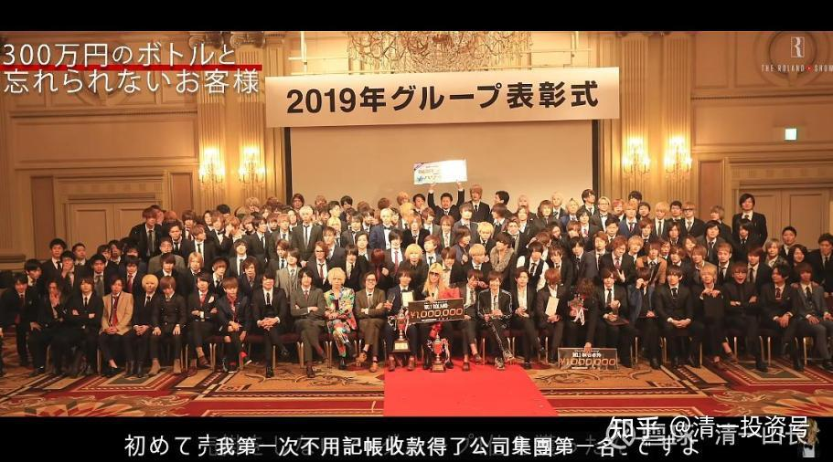

原雪球专栏[181篇.你内心最渴望的欲望，就是你人生最大的机会和陷阱！](http://link.zhihu.com/?target=https%3A//xueqiu.com/9310099567/187292568)

清一山长 2021年6月26日

首届“婚恋心理行为学课程”，正在顺利进行中。这是实战型课程，课堂示范，以及学员演练集于一身。现在，学员们开始进入佳境。本周末，是“约会课程实践”，这两天他们都在开展自己的一对一陌生约会活动。每天四个人，男生主动，被邀约的女生不能拒绝约会，只能拒绝求婚[俏皮]。不过，学员们也需要用空余时间准备下周一的课程。这个周一课程很有意思，就是去探讨人生最大的欲望，试图帮助学员去破解这个最大的欲望。这个题目，也提供出来供你们参考吧！我很自信地说：**我的婚恋课，带给你的收益，远远不是“婚恋”这么简单。它将带给你更成熟、更成功、更受欢迎的人生和事业。**

周末作业：婚恋课课前思考

“神”的许诺，就是：你可以成为任何你想成为的人；你可以实现任何你想实现的愿望；你可以挑战任何你想挑战的目标。所以，你是你自己命运的掌控者！请珍惜上帝送给你的机会，去发现你最大的潜力，去找到你最大的疯狂，去实现你最美好的梦想。

有一个成功学的秘密，就是：无论你去做什么，你要想获得成功，所需要的资源和努力都是差不多的。成为一个最专业的寿司大师，所需要的知识和经验，以及努力，并不比成为一个博士所需要的努力更少；去守住一家街头小吃店，想要成为百年老店，也不比守住一个大企业更省心。

你费时间来说话，同样的时间，你赚不到一分钱，甚至还要赔钱。但是，别人的说话，是很值钱的。时间一样，精力一样，但两者的结果是不同的。

前几天，有一个人找我咨询，一小时一万元的这种。但这人絮絮叨叨地说了很多话，一个小时，她自己说了超过40分钟。小女儿在旁听，都笑翻了。她说：“这人居然花钱找人废话，好傻（其实这种人很多的）。”我只是笑眯眯地听她说，然后插一句嘴，提醒和告诉客户：“你说话给我听是要付钱的，因为是你花钱买的时间。”她还是急急忙忙地说：“等一下，快说完了。”她知道一个小时不够，可以多加钟[笑]。其实她的问题并不难，我就算只说了十几分钟，也解决掉了她的问题。告诉她不必再多订时间了，一两年后有疑问再订咨询。后来客户回访，她很满意我的咨询结果。所以——说明你的方式相同，但选择不同，代价就是天差地别的。

所以，**一个人，如果不努力的话，注定是失败者。但一个人，努力的方向错了，也只能在底层徘徊。**因此——让你们**去找到人类的最大欲望，去满足别人的最大欲望，去做能够满足最大欲望的行业，就是你最成功的职业选择方向。**盲目的跟随，再努力也必然是平庸的结局，甚至是失败的结局。所以，发现你自己和他人的最大欲望，也才是你能够寻找到的最大的人生机会。这是很重要的事情。

本次课程，就是帮助你去找到人生的最大欲望。请找到你的最大的欲望，这里孕育着最大的机会，这里也隐藏着最大的风险。

1、你内心最渴望的事情是什么？

2、如果不受条件限制，你最想做的事情是什么？

（比如：我想让我的生日，明年成为全国的法定假日、纪念日）

3、如果可以不计代价，你想做的最疯狂的事情是什么？

（比如：我想一个人就去占领日本，把日本变成中国的一个省[大笑]）

4、你认为，阻止你实现你内心最大渴望的事情是什么？

5、如果你想成为最赚钱的人，你最应该去学习和掌握的本领是什么？

6、仅仅考虑赚钱的话，金钱会限制你的想象力。请想象你已经有足够的金钱，你最想去买到的东西是什么？

7、观察力、判断力测试

下面这个人，陪人聊天，一个晚上，就可以赚到200万人民币（3000万日元）。他是怎样实现这个目标的？他利用了人性的什么样的弱点？你想成为这种人吗？还是希望这种人为你服务？你怎样才能得到他的终身服务？

[微信网页链接](http://link.zhihu.com/?target=https%3A//mp.weixin.qq.com/s/e8Cs1xSRVwPmP2Rznw1Byw)：[https://mp.weixin.qq.com/s/e8Cs1xSRVwPmP2Rznw1Byw](http://link.zhihu.com/?target=https%3A//mp.weixin.qq.com/s/e8Cs1xSRVwPmP2Rznw1Byw)

[“日本第一牛郎”疫情被逼休业，宅家日常曝光：你以为的杀马特，其实是自律狂魔](http://link.zhihu.com/?target=https%3A//mp.weixin.qq.com/s/e8Cs1xSRVwPmP2Rznw1Byw)

8、思考力测试，这位罗兰，是可以用金钱来买下他的时间段的。只要出钱就行。假如一个女人有足够的钱，可以包下他的“全程服务”吗？他愿意用自己的才华，只为一个女人服务吗？这个思考，说明了什么道理？

本课题，请你们认真思考和回答。周一上午正式开课，是我跟你们一起聊以上几个问题。请注意，是一起聊，不是我讲课。所以，你们要推举出最有代表性的学员，最愿意一起聊的学员，一起来聊这个话题，请你们推选三人代表出来。

我不希望你们小组推选出一个根本就不会说话的呆瓜出来，上次选的人就有点呆瓜，而是要推选出最有思考力的人，以及最愿意表达的人出来聊。本人的身价和能力，绝对在罗兰之上。睡一晚上就赚到数百万的事情，对我来说也是丝毫不奇怪的。所以，希望你们跟我聊的时候，珍惜一点机会，不要推傻瓜上来聊。这是浪费给你们的时间。
