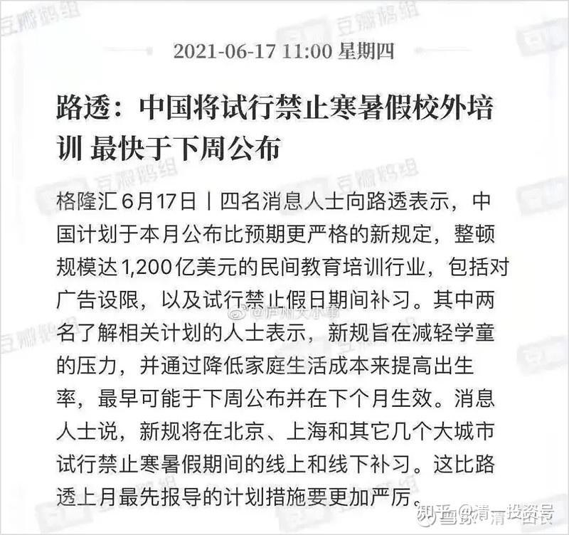
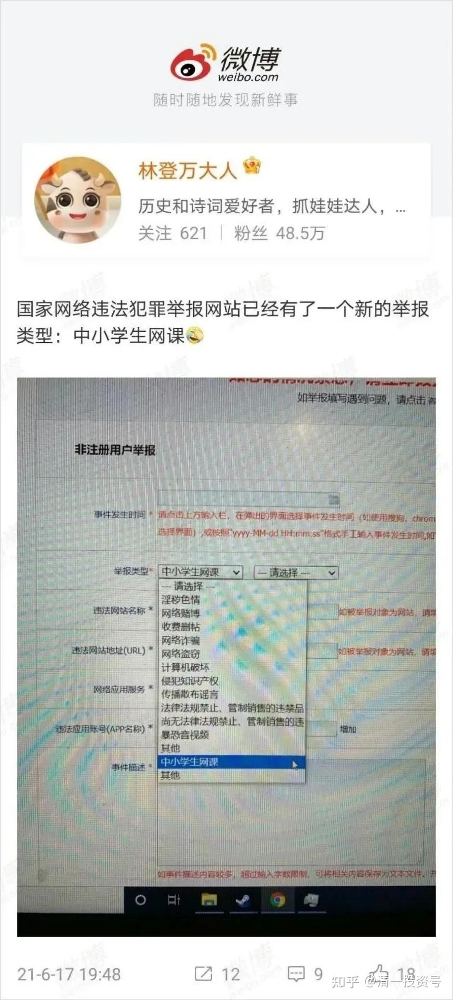
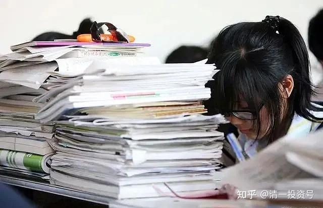
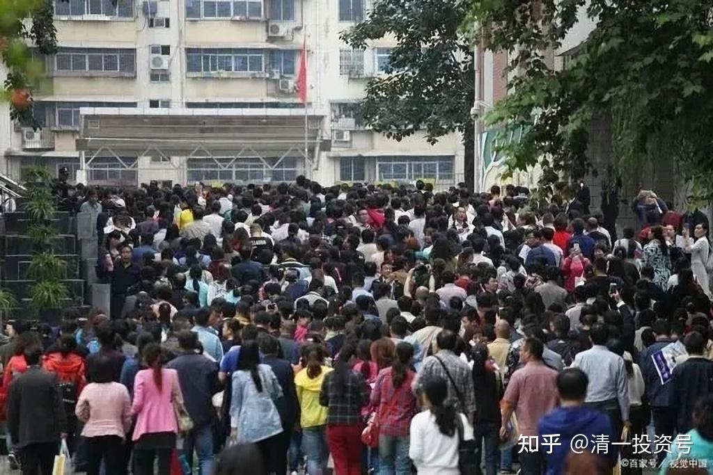

原雪球专栏[182篇.全面禁止补习班，会带来什么样的教育后果？](http://link.zhihu.com/?target=https%3A//xueqiu.com/9310099567/187366468)

清一山长 2021年6月27日

我对补习班、培训机构的作用，倒没啥好感。其实呢，我认为现在大多数的培训班、培优班，都是忽悠人的。中小学这点知识性的东西，实在是太简单了。一个正常智力的学生，只要树立了自主学习的习惯，培养好思维能力，只需要用个三、四年时间，就可以学完全部的12年课程。所以，不管是名校的12年，还是补习班的12年，我认为都是忽悠人的。

**减负，其实是个伪命题。真正的要点是：学生的学习动力问题。只有良好的心理和行为教育，才能解决这个问题。体制学校的教师，谁懂这一套？**

**所以呢，今日学堂才公开的示范：三年学完12年的体制课程内容**。但为了不刺激国内的体制教育，尊重我们的教育大员们的教学大纲规定，我们选择的对标对象，是**美国的体制教育，K12教学体制**。我们以外国人的身份，第一年学通基础英语；第二年学通学术英语；第三年，我们将示范我们的学生们，仅用一年的时间，就学完美国学校12年的课程内容，并达到美国前100名大学的录取标准。今年，示范班马上就要进入**“学术英语**”的学习了。这是很多中国大学生学了十几年外语，终其一生也没有达到的水平。我就是这样的，虽然是第一批通过英语六级的学生，但现在根本就看不懂学术英语。根本无法用英语来进行流畅的学术交流和阅读活动。而我们学堂的孩子，只需要认真的学习两年，就可以达到这个水平。英语应用能力，早就超过了我这个985优等生了。这个从侧面，可以说明：教育的重点是教育思维和教育方法，不是教育的内容，更不是“拼命”能够解决问题的。

**【[三年学完美国十二年示范班](http://link.zhihu.com/?target=https%3A//space.bilibili.com/487498588)】**

哔哩哔哩网页链接：[https://space.bilibili.com/487498588](http://link.zhihu.com/?target=https%3A//space.bilibili.com/487498588)

不过，国家一刀切的砍掉培训班，我认为：可能对家长是一个好事。由于腾出了很多没有意义的浪费大脑的课外学习活动，聪明的家长，反而完全放心大胆地在网上让孩子一起跟学示范班课程，帮助学生以超越的成绩，考上名校。但如果家长啥都不做，恐怕将来倒霉的就是你了。我是第一次知道居然有一对一每小时1200元的课外辅导教师的。虽然我的一万元咨询，也有家长专门请我辅导13岁的孩子的。不过我辅导的是思维和心理矫正，如果辅导知识内容，我认为根本就不值钱。当然，如果孩子不吃饭，高价请个人喂饭，倒也是富人的做派。只是成绩是提高了，但孩子的自助吃饭能力依然没有培养出来。

全面禁止辅导班之后，会出现什么样的情况呢？北大教授**渠敬东教授，发表了以下观点，供大家参考。比我的要权威一些[大笑]**。

**[禁止课外补习,真的能禁得住吗?](http://link.zhihu.com/?target=https%3A//view.inews.qq.com/k/20210622A00S5500)**

**1、外面的新闻说，中国即将禁止课外班。**

又有消息说：在线课程也都会被禁止。更有谣传说：中小学生网课已经列入国家网络犯罪违法举报内容。

据说这举措的目的是减轻学童压力，并且降低家庭教育成本，以促进生育率。

学童压力大的原因并不在补课班，而是在高考。家庭为课外班支付大量开支，原因也不在补课班，而是在高考。需要整改的是高考，而不是补课班。禁补课班是本末倒置。

高考怎么改？中华人民共和国历史上有过一些实践。

第一种实践叫上山下乡。1968年，老三届的初中生、高中生，六个年级同时毕业，都不再升学，而是下乡种地。

如果爹妈知道孩子中学毕业以后注定要下乡种地一辈子，大概不会逼他天天做考题了。

第二种实践，叫工农兵大学。1970年开始，从普通劳动者中筛选大学生，群众筛选、领导批准、学校复核。

如果为了解决学童压力大、教育支出多的问题，重新启用上山下乡和工农兵大学，如何？想必父母和孩子都不愿意吧。

还有别的办法吗？当然还有。比如大学彻底产业化，名校学费每年一百万，烂校学费每年1万。有钱的上名校，没钱的上烂校。金钱面前一律平等，跟考试成绩无关。但是，民众是不会满意这种做法的。

还有一种办法叫大学平等。清华大学每年从国家拿到300亿资金，远高于哈佛、剑桥、耶鲁。但是无锡职业技术学院基本上没拿到钱。不妨平均一下，全国2800所高校，每个学校每年2亿。大学也不分什么985、211、二本、二级学院、高职了，所有人的文凭都是“中国大学”。

这办法绝对有效，但是不符合国家利益，也不符合民众愿望。大多数人还是指望孩子上名校的，一平均就没名校了，全是烂校，不符合中国人积极上进的文化。

各种方案对比之下，可能还是现在的高考制度比较迎合大众的偏好。这种高考方式可能会继续下去，100年都不会有大变。民众对名校竞争，也会持续百年或更久。

**2、听说要禁止补课班。**

富人听说了，淡淡一笑：好呀！

他们的孩子本来就是在家里接受一对一的补课的。我有位好友叫smy，她专门教写作，她的在线一对一补习费是一节课1200元。是不是很贵？那是对你很贵，富人觉得很便宜。一大堆家长把定金扔给她，排队等档期，要等很久才会等到舒老师有空档。

更有一些权贵，会有很多人自愿为他们家的孩子补课，分文不收。

中产阶级听到禁止课外补课班的新闻，或许骂一句“操”。然后计划给孩子请老师。每小时1200有点贵，可以四个孩子一起，每人分摊300。也可以找个收费低一点的老师，一个小时只要300元。算下来一年给孩子的补课费大约12万。

至于那些全家年收入还不到12万的90％以上的中国人，他们听说补课班不让办了，赶紧看有没有网课，发现网课也被禁止了，顿时觉得浑身发冷。他们很清楚：自己的孩子要考上名校的机会已经接近于零。

更糟糕的是：一旦他们的孩子某个知识点不懂，可能就跟不上进度，步步落后，过早被淘汰出局，连后续机会都没有。

中产阶级或者因为请家教耗费大量余钱，或者为了在家辅导孩子而放弃事业，阶级会下降一大截，有些会很快沦为底层。

富人和权贵会很开心。**因为禁止课外补课班，实际上为他们的孩子淘汰了90％的竞争对手。又让很多人阶级下跌，相当于他们的相对阶级地位又上升了。**

**3、家教奇缺。**

名校毕业生的第一职业选择，不再是B站和[阿里巴巴](http://link.zhihu.com/?target=https%3A//xueqiu.com/S/09988%3Ffrom%3Dstatus_stock_match)，而是专职家教。

家长相信只有名校生才精通考试，所以只有名校生才会有人出高价。

富人和权贵家族出来的名校生不需要做家教挣钱，甚至不会去做应聘普通的职业。而中产阶级和偶尔漏网的底层阶级名校生会去当家教。

企业在招聘会上招不到985、211大学毕业生（大多数当家教去了）。招得到的都是二本、高职。企业主表示人才奇缺，制造业更是青黄不接，老一代工程师一退休，就后继无人。

指望公立学校老师给孩子开免费补课班，这是做梦。有几个高水平的老师会放着一小时1200元的家教费不挣，却免费教几十个孩子？

有人认为政府要严厉禁止学校老师当家教，学校老师上课就会更尽心。但是，公立学校老师月薪只有几千元，即便被学校开除了又咋的，当个专职家教可以收入增加好几倍。

很多高水平的老师会辞职当一对一的家教，而那些水平差的老师留下来继续撑着——**因为他们当家教的收入也不是太高，不如继续捧铁饭碗。**课堂上，每个老师要带的学生更多，课堂纪律很难控制，学生没有发言机会，老师根本没法照顾这么多学生，结果就是大家的学业都下跌。

但是有些孩子例外——他们在家里请家教补课。

**4、韩国在三十年前就遭遇今天中国这种困境。**

为了给孩子减负，以及减轻底层家庭的教育开支，减少内卷，韩国政府在全斗焕的领导下，决定全面禁止课外补课。

结果底层民众并不领情。他们认识到一旦禁止课外班，穷人的孩子更无出头之日，反而是把名校机会拱手让给富人、权贵的孩子。

**韩国是前车之鉴。以韩国的方式去禁止课外班，结果也会以韩国的失败告终。**

韩国的高考内卷还带来了“聪明药”的流行。这些“聪明药”，其实是一些有兴奋作用的精神类药物。最常见的是利他林和莫达菲尼。

莫达菲尼风靡韩国，那时候大家都知道，每天吃一粒“聪明药”，一天只需要睡四小时，可以天天熬夜奋战还不会太疲倦。至于这类药的严重后遗症——心理和精神疾病、容易导致器官衰竭，却被人忽视。

或者说，为了高考上名校，实现阶级跃迁，他们愿意付出这种代价。**毕竟药很便宜，比补课班更省钱，穷人也买得起，何况黑市能买廉价印度药。**

如果中国禁止课外班，甚至连线上的补习都禁止，可以预料会有更多学生服用各种“聪明药”每天只睡四小时长期拼搏。毕竟这也是穷人搏命的一种奋斗手段，而且对提高成绩真的很有效。

**5、与韩国截然不同的是新加坡。**

新加坡不仅不禁止补课，还大力鼓励。

新加坡的小学一天只上半天课。一个教室二个班级公用，上午是一个班，下午是另一个班，所以老师想拖堂都根本不可能。

剩余的半天怎么办？孩子自己找补课的地方。你哪门科不好，就补哪门。

新加坡这种“只上学半天”的做法，形成一个极大的职业补课老师群体，很多人一辈子就是做补课老师。补课教师不再是业余兼职，而是专业人士。这些补课教师一辈子紧跟考试潮流，研究各校试卷和评分标准，熟悉针对各种学生的教学方式，水平远高于那些业余兼职的家教，对特定的知识点，都有自己独门教学技巧，或者有自己编写的题目（有知识版权）。有时候学校教师也会去做家教。

新加坡补习教师竞争激烈，收费也不像京沪那么昂贵，属于普通中产阶级可以接受的地步。

除了这种专职补习教师，还有一些业余兼职的补课老师，通常是大学生、高年级中学生、满18岁当兵的现役军人（有些军人周末放假当补课老师，为自己挣大学学费）。业余补习教师收费较低。

收入较低的人，会送孩子上各种补习班。补习班分为几种：

第一种是学校为某门课的差生补习的。专门为差生免费补习。如果你是好学生，为了考上名校去混补习班，抱歉，不行。补习的内容也简单，不是为学霸准备的。

第二种是社会上各种商业补习中心。收费属于新加坡的普通工薪阶层都能接受的。针对不同水平学生，老师会提供针对性的指导。

第三种是各种宗教教会、慈善机构、社会义工举办，免费为孩子补习。一般都是同一个教会的家庭。当然，大多数孩子其实并不信教。

**由于新加坡有大量的多种类型的补习机构，无论是富人，还是赤贫家庭的孩子，都有机会得到补习。**

新加坡学生无论数学、科学，还是英语阅读，水平都远超英国和美国学生。参加美国和英国的各种考试，成绩更是遥遥领先。**新加坡孩子的成绩，很大程度得益于强大的补习体系和专业的补习教师，以及家长愿意花大钱培养孩子。**

新加坡家长基本上不检查孩子的家庭作业，因为这是学校老师的事。也不管孩子的课外提高练习题，这是补课老师的事。家长的教育水平，通常都不如专业的老师。

**6、很难想象会有人提出禁止课外班这种建议。**

稍有条件的人，会毫不犹豫给孩子找补课老师。

**没钱的人会更加焦虑。他们知道，那些职业技术学院、职业技术大学，职业高中，就是为他们的孩子准备的。**

最好的老师所在的学校需要购买昂贵的学区房。最好的补课家教需要昂贵的学费。穷人永远无法跟富人竞争这些资源。

新加坡为什么没有这种焦虑？因为新加坡有一个学校均衡规定，全国所有的学校的硬件设施都是同等的，教师水准也是同等的，教师还得每五年轮换一次，以保证孩子无论在哪个学校读书，硬件和师资都差不多，这样任何学区房都没有优势，穷人不会吃亏。

新加坡小学升初中，任何人可以报考任何一所中学，绝没有地理位置分区的限制。

新加坡全国一张卷，任何地区的人没有高考特权。

在新加坡，虽然贫富差距巨大，虽然富人比穷人有更多的钱请顶级的家教，但是穷人的孩子只要有天赋，绝不会因为贫穷而失去出人头地的机会。新加坡各种层次的补习班，大大缩小了富人和穷人的教育资源差距。

（以下内容为编者收录）

**评论回复：**

**[清一山长](http://link.zhihu.com/?target=https%3A//xueqiu.com/9310099567)**[2021-06-27 09:09](http://link.zhihu.com/?target=https%3A//xueqiu.com/9310099567/187367200)

“至于那些全家年收入还不到12万的90％以上的中国人，他们听说补课班不让办了，赶紧看有没有网课，发现网课也被禁止了，顿时觉得浑身发冷。他们很清楚：自己的孩子要考上名校的机会已经接近于零。”

我认为这个接近事实——除非少数上衡水高中这样的重点学校的，不用去操心补习的问题了。

其他**放羊的家庭，将来考大学，跟985、211基本就没关系。如果只能上个普通大学，将来想找个像样的工作基本没戏**。所以——**新教育的网上示范班，可以拯救这些无助的家庭。**

可惜的是：穷人其实最需要今日学堂。最需要今日学堂是**因为只有今日学堂提供了穷人逆袭的机会。可是，偏偏是穷人最看不起今日学堂。年年的免费班，学生素质，一直比不过有钱人的收费班水平。很多人给了名额还不来上学。**所以——看起来**今日学堂就是富人追捧的学堂，其实是因为穷人太没眼光了！[哭泣]**

随你们吧！爱跟就跟，想学就学。我们连富人申请者都招不完，你不想学关我啥事。别以为我们缺学生。有心人自己跟学示范班，学到15岁，通过考试标准后，直接找我申请免费入读今日国际高中，我出钱给你上今日高中。如果通不过SAT 1400分，就自己奔前程去。又不给钱，自己还不努力，要我背着你孩子走，谁理睬你！就别私信给我唧唧歪歪了。这些求学私信，我一概不回复[俏皮]。

[星辰大吉](http://link.zhihu.com/?target=http%3A//xueqiu.com/n/%25E6%2598%259F%25E8%25BE%25B0%25E5%25A4%25A7%25E5%2590%2589)回复[清一山长](http://link.zhihu.com/?target=http%3A//xueqiu.com/n/%25E6%25B8%2585%25E4%25B8%2580%25E5%25B1%25B1%25E9%2595%25BF)：

格局小了，国家禁止补习班，是在为广大家长减负，减少家长负担，鼓励多生育，让中国未来后续有人。

**[清一山长](http://link.zhihu.com/?target=https%3A//xueqiu.com/9310099567)[2021-06-27 09:25](http://link.zhihu.com/?target=https%3A//xueqiu.com/9310099567/187367780)回复[星辰大吉](http://link.zhihu.com/?target=http%3A//xueqiu.com/n/%25E6%2598%259F%25E8%25BE%25B0%25E5%25A4%25A7%25E5%2590%2589)：**

您的格局才不够呢[大笑]！未来国家比较缺的人才，主要是低端的劳动力。中高层位置有限，抢都抢不过来。所以，这个政策，就是“大家别闹了，乖乖地当工人去”。别都去抢中高管的饭碗，我们将来没这么多位置的，发展红利已经结束了[俏皮]。

**[清一山长](http://link.zhihu.com/?target=https%3A//xueqiu.com/9310099567)**[2021-06-28 08:02](http://link.zhihu.com/?target=https%3A//xueqiu.com/9310099567/187567087)

“更糟糕的是：一旦他们的孩子某个知识点不懂，可能就跟不上进度，步步落后，过早被淘汰出局，连后续机会都没有。中产阶级或者因为请家教耗费大量余钱，或者为了在家辅导孩子而放弃事业，阶级会下降一大截，有些会很快沦为底层”

最近我和刘老师，都连续接到专门给13岁～15岁的孩子一对一辅导的单子。我们的辅导费都是一万元一小时。本来我们的规划，都是给成人辅导的，哪里想到会有家长专门为孩子定咨询时间？辅导完，家长还感恩不尽。比如一个本来想要退学的学生，经过我辅导后班级上积极进取了，老师和同学反馈像是换了一个人一样。因为这种孩子就是卡在一个点上了，你要帮她度过这个卡点，这孩子到了青春期，家长不懂怎样处理，孩子状态步步下滑。我出手帮助后，孩子就恢复正常了。家长当然觉得很值。

甚至刘老师这边，还有家长因为孩子胆小，就预定她咨询的，弄得她哭笑不得。当然她也帮忙处理了，说明现在富裕的家长，对孩子花钱真的很大方。不过，我这种辅导一小时，孩子就完全改变，孩子算是理解力还比较强的，也因此，我不接受年龄更小的孩子的咨询。我在想：我是不是以后培养两个助手，以后对孩子推出1+10的辅导计划。我辅导一小时，我的助教跟进10周，每周一小时辅导。这种孩子，就算是理解力差一点，也可以在助教的后续辅导下，成长得很健康。现在的家长和学校的教师，都太不懂孩子的心了。导致种种弊端，孩子一卡住，甚至十年，几十年转不过弯来的。

巴韭特在中国回复[清一山长](http://link.zhihu.com/?target=http%3A//xueqiu.com/n/%25E6%25B8%2585%25E4%25B8%2580%25E5%25B1%25B1%25E9%2595%25BF)：

人口红利等于廉价劳动力，中国这种被廉价劳动力给惯坏了的企业市场应该要早点有觉悟，未来的市场就是一个劳动力资源越来越稀缺，越来越尊重人的市场，我倒乐于看到人力资源短缺，然后充分尊重人的市场，让那些垃圾企业，无良老板趁早滚蛋。还有很多人担心人口红利，我就呵呵了。人口红利换个说法就是人力内卷。早点结束不好吗？屁民就少来点格局吧！这些不是屁民能解决的，把自己的日子过好打工多挣一点，自己的劳动权益多有点保障，过上更好的生活，比什么多重要。

**[清一山长](http://link.zhihu.com/?target=https%3A//xueqiu.com/9310099567)**[2021-06-28 15:06](http://link.zhihu.com/?target=https%3A//xueqiu.com/9310099567/187567087)回复巴韭特在中国：

同意您的观点：原来读了一点书，就可以过得比农民工好得多。**未来只会读书的傻子，会比不过民工的生活的。未来社会，只有两种人能够活得好：一种是真正的精英，管理阶层；一种是体力劳动者，技术工人，都很体面**。但，废物们，就不再有机会，留家里自己养吧！

所以，**新教育重点是培养两种人。一种是素质全面的领导者，学习力强，自控力好，脑子好用；一种是书呆子，就只鼓励去读理工科，当技术员了。另外一种不善于读书的，就锻炼身体，养好脾气，将来做技术工人也不错。这都是社会的人才。**

至于身体不好，心理情绪都有问题，只会读书，还读不好，厌学的孩子咋办？家长自个人养着，别指望国家会替您养人。

可我担忧的是：似乎体制学校，正在批量培养这种废物，厌学还自大。国家已经意识到了，正在改进“快乐教育”，起码让孩子身体、心灵正常一点。
