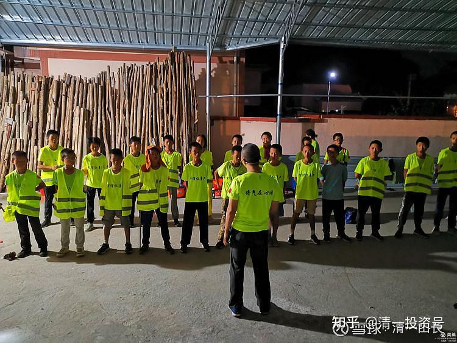

原雪球专栏[183篇.不读书，也是教育，甚至是更重要的教育！](http://link.zhihu.com/?target=https%3A//xueqiu.com/9310099567/187622593)

清一山长 2021年6月28日

下面这张照片中，你能想象：站在前面的这位家长，是一位中国行业排名第一的企业的董事长，是实实在在的亿万富豪吗？而对面长征徒步的孩子中，有一位是他的女儿——妥妥的富二代？也在这穷乡僻壤受苦受罪？

这一次的长征，国际今日的孩子们，20天完成了1100公里的徒步。大多数家庭，都是富裕人家。因为国际今日挑战班，每年只招一个班的学生。但今年毕业的突破班，却有两个班的学生。这些“多出来”的学生，就是没有考上挑战班的学生。家长们认为：孩子其实智力都差不多，他们**没有考上的唯一原因，就是心态上还不够踏实，不够进取，不够珍惜机会**。简单地说，**就是偷懒了。**他们相对考上的学生，不够自律。所以，这些落选的考生，就被家长们自己组织和安排，进行了这一次的千里长征，来磨练孩子们的意志：让他们懂得，**不想吃读书的苦，就只能去体验生活的苦。**

有没有效果？当然有。今年就有四年前没有考上中级班（相当于现在挑战班）的突破班学生，分流去了外围学堂，今年就自己考了官方的SAT考试，成绩超过了1400分，跑了半马，重新回到了今日高中的学生，还享受学费、生活费全免的待遇，比国外的全奖待遇还高。所以，**好的教育，不是给孩子教材和教师，而是激发孩子的心气，才是第一位的教育**。孩子被教育成心气强的孩子，在哪里都能成功。心气弱，你给他再好的学习条件，也不懂得珍惜的。家长只会照顾孩子吃喝玩乐，这种温室里面的花朵，是经不起风雨的。

图片中的李总，就是不太满意自己的女儿心气弱了。虽然成绩不错，也考上了直通车班。但家长为了磨练孩子的心气，还是要求孩子参加了这次长征（其实我不鼓励家长这样做，造成孩子考上、考不上一个样，这次长征的意义，就被淡化了）。他要参加徒步长征，还需要“走后门”。

外围吃瓜群众，我建议你们在嘲笑这些老板们，还没有你“会生活”的时候，你就要想想了：别人有钱、有才、有社会地位，别人已经挣到了你一辈子也不敢想象的财富，可以给孩子一辈子也花不完的钱，但他们却还要把孩子送来今日学堂受罪、吃苦。这是不是说明：富人家的脑子，都被马踢了？他们是找抽吗？就你的脑子正常一些？

一个真实的笑话就是：我的学员，暑假在校区培训，有时候会出去逛逛街、吃吃饭。镇上的当地群众，见到他们就问：“是不是来参观这个学校的？”学员们很多还不是家长，但很想把孩子送过来，就说：“来看看，有没有机会把孩子送来上学。”当地吃瓜群众，就热心提供绝密内幕信息，告诉他们说：“千万别把孩子送这学校来，太苦了。食堂连肉都不做，天天就没啥好吃的（我们的厨师是当地请的，肯定把我们的伙食情况告诉了当地人），孩子们很早就要起床，成天跑步、训练，苦得不得了。”他们看了，都觉得遭罪。我们自家的孩子，才舍不得送到这地方受苦呢！也想不通城里面的家长，怎么对孩子这么狠。

学员们听后，都觉得挺搞笑的。这就是“穷人富养”。对比下我们的富人穷养？我家的女儿，就是典型。泰国人看了我们的家庭条件，吃饭的内容，都觉得比穷人还可怜（最搞笑的一次，是我们外出旅游，住在湄公河边的一个小镇。晚饭我们一家去集市上买了一点简单的晚餐吃。结果一个泰国的摊主，居然包了一份炸鸡腿送给我们。说他今天生意做完了，要回家了，所以送给我们。估计就是看我们太穷了，吃得太简单了，猜我们没钱，所以照顾我们。我们只能表示感谢，泰国的善心人很多。当然，我们没法吃，就带回宾馆，送给看门的人吃了。这样大家都高兴！

我现在提醒各位：您如何评价我们这群疯子，我不在意。我只是提醒您：10年、20年后，我们的孩子20岁、30岁了。您的孩子年龄一样。您认为：20岁的时候，您的孩子与我们的孩子同时进入职场，面对招聘官，您认为您的孩子，很容易击败我们的孩子吗？工作十年，30岁的时候，要提升主管了，您的孩子，有可能当我们孩子的领导？当管理阶层？还是我们的孩子更有可能领导您的孩子？

我相信：我女儿身边的泰国人，现在会觉得自己的生活才是最好的。今天，我让孩子又去送礼物给周围的泰国工人了。**这些泰国工人，都只认为她是一个不懂享受生活的傻女孩**。但只需10年之后，不用20年，他们就会清晰地发现，我女儿才是他们的主人。这就是我们对孩子的培养目标：先学会控制自己，再学会领导他人。

未来的领导者，不是看你有多高学历来决定的。博士，大多数情况下，依然只是一个打工仔。但未来，能够自我掌控的人，才会是未来的领导者。也许，他们就是上面照片中，一个今天脚掌被磨破的小孩子。但将来，他会知道：自我掌控，将比被人愚弄要好得多！

强大的心灵，来自于严格的训练。请有心人看今日学堂的家长们，自己记录的孩子的长征进程：

**[美篇网页链接](http://link.zhihu.com/?target=https%3A//www.meipian.cn/3oh648ki)：[https://www.meipian.cn/3oh648ki](http://link.zhihu.com/?target=https%3A//www.meipian.cn/3oh648ki)**

**[2021届国际今日突破班长征行徒步大圆满](http://link.zhihu.com/?target=https%3A//www.meipian.cn/3oh648ki)**
