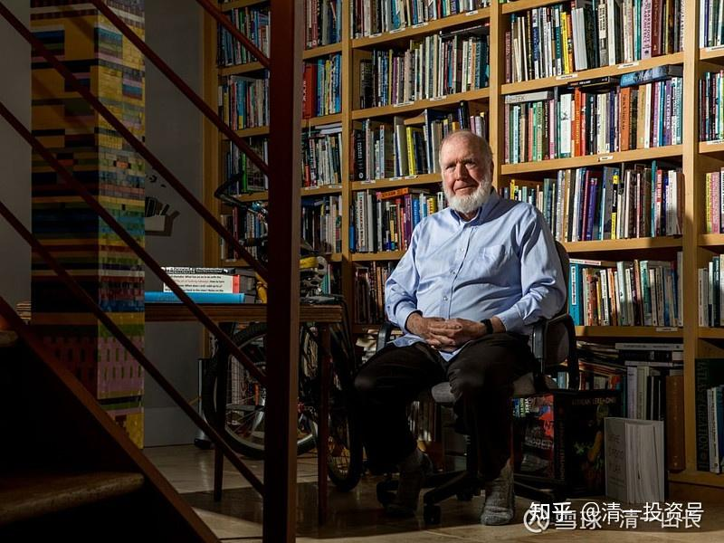

原雪球专栏[184篇.凯利的生日礼物：你给别人的越多，你得到的也就越多](http://link.zhihu.com/?target=https%3A//xueqiu.com/9310099567/187846988)

清一山长 2021年6月30日

**今日学堂的学生表现很卓越，是因为我们不断学习行业内最顶尖的思想。**而不是去学习所有人都学习的弱智课本。我们会用最短的时间来覆盖弱智的课本，2022～2023年，我们的学生，就要公开的示范——从美国一年级的课本开始，一年内学到12年级。避免我们与世界的知识脱节。

剩下的时间，我们用来干嘛？我们用来学习世界上最顶尖的思想。我们用来改进世界上最有价值的行为。这就是**今日学堂的核心教育理念——思维和行为教育。知识教育，用最短的时间内完成。**

最近我看到这个[凯文·凯利的68条建议](http://link.zhihu.com/?target=https%3A//kk.org/thetechnium/68-bits-of-unsolicited-advice/)，我认为挺好的，正在想如何让学堂的学生去学习和落地呢！**一旦得到这个礼物，你绝对是世界的精英阶层。**

可惜的是：这个礼物，**不是你读一遍，甚至读一百遍，就能学会的，你要内化到自己的信念系统中去。**目前没有学校会做这个事情，而我们会，而且正在做。目前做的是公主、王子信念，与这个凯文·凯利的建议，有异曲同工之妙。就是啰嗦一点，但也更加容易实施。本质上跟《公主经》是一样的。

**[凯文·凯利的68条建议：你给别人的越多，你得到的也就越多](http://link.zhihu.com/?target=https%3A//baijiahao.baidu.com/s%3Fid%3D1703441995369557785%26wfr)**

**[https://www.mbachina.com/html/CKGSB_MBA/202106/323848.html](http://link.zhihu.com/?target=https%3A//www.mbachina.com/html/CKGSB_MBA/202106/323848.html)**

**[https://kk.org/thetechnium/68-bits-of-unsolicited-advice/](http://link.zhihu.com/?target=https%3A//kk.org/thetechnium/68-bits-of-unsolicited-advice/)**

凯文·凯利，一位畅销书作家，也是《连线（Wired）》杂志创始主编。尽管他不曾创立价值万亿的互联网公司，却丝毫不影响他在世界互联网圈的显著地位。

他的著作《失控》被誉为“互联网圣经”。在微信团队研发中心，几乎每一个产品经理手上都有一本《失控》，尤其是微信之父张小龙那句：“不读《失控》的产品经理，知识结构是不完整的。”

除了张小龙以外，凯文·凯利也受到马化腾、王小川、罗振宇等人的追捧，被人们亲昵地称为“KK”。

去年，凯文·凯利在他的68岁生日时，准备了68条简短的建议，作为礼物送给年轻人，希望能对你有所启发。

作者 凯文·凯利

*上面照片是作者在他的工作室Kevin Kelly at his studio in Pacifica.*

原文刊载于**[http://kk.org](http://link.zhihu.com/?target=http%3A//kk.org)**，标题为：**68 Bits of Unsolicited Advice**

本文由36氪旗下神译局编译，译者蒂克伟

1、学会从那些你不同意、甚至冒犯你的人身上学习。看看你能否发现他们背后的真相是什么。

2、充满激情可以提高25点智商。

3、永远要有一个deadline（最后期限）。deadline能够排除不相关的东西。**避免追求完美，你必须追求与众不同，与众不同比完美更好。**

4、不要害怕问愚蠢的问题。因为99%的情况下，其他人也想问同样的问题，只是因为怕尴尬而羞于提问。

5、**善于倾听是一种超能力**。倾听你所爱之人的时候，多问问“还有什么？”，直到他们倾诉了所有。

6、一个值得追求的年度目标：充分学习一个领域，以至于你无法相信一年前有多么无知。

7、感恩能带来其他的美德，感恩是一件你可以练习的事情。

8、没有什么是美食不能解决的事情。一起吃顿好的对于巩固老朋友和结交新朋友都很有用。

9、不要相信“万能”胶。

10、经常给你的孩子朗读书籍，能够加深你们之间的关系，激发孩子的想象力。

11、不要借贷消费，唯一值得借贷只有一种情况，购买房产这种交换价值极有可能增加的东西。**大多数东西的交换价值从你购买的那一刻就会开始减少或消失，不要因债致贫。**

12、专业人士和新手的区别在于，他们知道如何从错误中优雅地走出来。

13、非凡的主张需要非凡的证据才能让人信服。

14、不要当房间里最聪明的那个人，与比自己更聪明的人交往，并向他们学习。更好的是找到那些与你意见不同的聪明人。

15、交流的“三”原则，要找到真相，让别人比他们之前说的更深一些，一次、两次、三次的重复这个过程，第三次你就接近真相了。

16、别做最好的，要做唯一的。

17、所有人都很害羞。别人在等着你介绍自己，等着你给他们发邮件，等着你邀请他们约会。大胆去做。

18、当别人拒绝你的时候，不要在意。假设他们和你一样：忙碌、没时间、注意力分散。稍后再试一次，很神奇，第二次尝试往往会成功。

19、建立习惯的目的，是不用自我谈判，不在决定做一件事上花费精力，你直接就做了。好的习惯包括讲真话、用牙线。

20、及时回应是尊重的表现。

21、当你年轻的时候，至少花6个月到1年的时间，尽可能地过贫穷的生活，尽可能少地拥有东西，在一个小房间或帐篷里只吃豆子和米饭，以体验你 “最坏”的生活方式可能是什么。这样一来，当你将来要冒什么风险时，你就不会害怕最坏的情况了。

22、相信我，这世上没有“他们”。（编者注：出自爱尔兰摇滚乐队 U2 的一首歌 Invisible，“There's no them/only us”）

23、你对别人越感兴趣，别人就越觉得你有趣。要想变得有趣，先有兴趣。

24、尽量慷慨。没有人在临终前会后悔自己给予了太多。

25、要做出不错的东西，要大胆去做它。要想做出好的东西，需要一次又一次去做。做好东西的秘诀在于重新去做。

26、黄金法则永远不会过时，它是所有其他美德的基础。（黄金法则：想要别人怎么对待你，你就要怎么对待别人）

27、如果你在家里找东西，最后找到了，用完之后，不要把它放回你最终找到它的地方。把它放回你最先去找的地方。

28、存钱和投资都是好习惯。几十年来不加思索地定期投资少量资金是通往财富自由的一条道路。

29、犯错是人之常情。承担你的错误是神圣的。没有什么比迅速承认你所犯的错误，并承担个人责任，然后公平地纠正错位更能提升一个人的地位。如果你搞砸了，大胆承认错误吧！这种力量非常强大。

30、永远不要在亚洲陷入地面战争。

31、你可以痴迷于服务你的客户、读者、客户；你也可以痴迷于击败竞争对手。两者都有效，但前者会让你走得更远。

32、保持在场，持续保持在场。成功人士说过：99％的成功就是因为保持在场赢得的。

33、把创作和改进的过程分开。你不能同时进行写作和编辑，不能同时雕刻和抛光，不能同时制作和分析。如果你这样做，编辑会阻止创造。当你发明时，不要选择；当你画草图时，不要检查；当你写第一稿时，不要反思。**在开始的时候，创造者的头脑必须从评判中解放出来。**

34、如果你从未跌倒过，那么你也就从未努力过。

35、也许宇宙中最反直觉的真理是，**你给别人的越多，你得到的也越多，了解这一点是智慧的开始。**

36、朋友比钱更好。几乎所有金钱能做的事情，朋友都能做得更好。在许多方面，有一个有船的朋友比自己有一艘船要好。

37、这是真的：要欺骗一个诚实的人是很难的。

38、一个东西丢了，95%的情况，它都在你最后一次见到它的地方的咫尺范围内。在这个半径内所有可能的位置进行搜索，你就会找到它。

39、**你做什么，你就是什么**。不是你说什么，不是你相信什么，不是你如何投票，**而是你把时间花在什么地方**。

40、如果你丢失或忘记带充电线、适配器或充电器，请问问酒店前台。现在大多数酒店都有一个抽屉，里面装满了别人留下的充电线、适配器和充电器，可能就有你丢失的那个，你通常可以借来用用。

41、仇恨是一种诅咒，它不会影响被仇恨的人，只会毒害仇恨别人的那个人。把仇恨当作一种毒药吧！

42、**没有最好，只有更好。**人才的分配是不公平的，但**我们改善自己的道路是没有终点的。**

43、做好准备。当你完成任何大型项目（房子、电影、活动、App）的90%时，其余无数的细节将需要第二个90%来完成。

44、人死之后，除了名声，什么也带不走。

45、在你年老之前，尽可能多地参加你能承受的葬礼，并仔细倾听。没有人会谈论逝者的成就。人们唯一会记得的是你在取得成就时是个什么样的人。

46、每花一块钱购买一些实质性的东西，预计在其寿命结束时要支付一块钱的维修、保养或处理费用。

47、任何真实的东西都始于对可能发生的事情的虚构。因此，想象力是宇宙中最强大的力量，也是一种你可以变得更好的技能。它是生活中的一种技能，帮助你从其他人忽视的事情中获益。

48、不要浪费危机和灾难。没有问题，就没有进步。

49、度假时先去行程中最偏远的地方，绕开城市。在偏远地区，你会最大限度地感受到另类的冲击，然后在回来的路上，你会回到城市中熟悉的舒适。

50、当你收到在未来做某事的邀请时，问问自己：如果这件事安排在明天，你会接受吗？这可以筛选掉大部分事情。

51、不要在电子邮件中说任何你不愿意直接对某人说的关于某人的事情，因为最终他们会知道。

52、如果你迫切需要一份工作，你只是老板的又一个问题。如果你能解决老板现在的许多问题，你就稳定了。想找到工作，就要像你的老板那样思考。

53、艺术藏身于你所遗漏之处。

54、获得的东西很少会给你带来深刻的满足，但获得体验可以。

55、研究中的七法则。如果你愿意进入七个层次，你就能找到任何东西。如果你问的第一个信源不知道答案，就问他们你应该问谁，以此类推。如果你愿意问到第七个，你几乎总是能得到答案。

56、如何道歉：快速、具体、真诚。

57、永远不要在电话中回应恳求或求婚。迫切性是一种伪装。

58、当有人对你讨厌、粗鲁、憎恨或刻薄时，假设他们是病人。这使你更容易对他们产生共情，从而缓和冲突。

59、消除杂乱，为你真正的宝藏提供空间。

60、你不会想要想成名，不信去读读任何一本名人传记。

61、经验被高估了。在招聘的时候，要为能力而招聘，为技能而培训。大多数真正惊人或伟大的事情都是由第一次做这些事情的人完成的。

62、一个假期+一场灾难=一次冒险。

63、购买工具。从购买你能找到的最便宜的工具开始。升级你经常使用的工具。如果你在某项工作中最终选择使用了某种工具，就买你能负担得起的最好的。

64、学会进行20分钟的小憩而不感到不自然。

65、如果你不知道自己对什么有热情，也要知道单纯追求快乐会让人麻痹。对大多数年轻人来说，一个更好的座右铭是 “掌握一些东西，无论什么东西”。通过掌握某种技能，你可以朝着能给你带来更多快乐的方向延伸发展，并最终发现你的幸福所在。

66、我很肯定，100年后，我们今天认为是正确无误的事情，很多都会被证明是错误的，甚至可能是令人尴尬的错误，我非常努力地去寻找我今天错在哪里。

67、从长远来看，未来是由乐观主义者决定的。**成为一个乐观主义者，不是要忽视现有的许多问题，而是想象怎么才能改善我们解决问题的能力。**

68、冥冥之中，宇宙在帮助你，如果你接受这一前提，将更容易成功。

**英语原文：**

1. Learn how to learn from those you disagree with, or who even offend you. See if you can find the truth in what they believe.

2. Being enthusiastic is worth 25 IQ points.

3. Always demand a deadline. A deadline weeds out the extraneous and the ordinary. It prevents you from trying to make it perfect, so you have to make it different. Different is better.

4. Don’t be afraid to ask a question that may sound stupid, because 99 percent of the time everyone else is thinking of the same question and is too embarrassed to ask it.

5. Being able to listen well is a superpower. While listening to someone you love, keep asking them “Is there more?” until there is no more.

6. A worthy goal for a year is to learn enough about a subject so that you can’t believe how ignorant you were a year earlier.

7. Gratitude will unlock all other virtues and is something you can get better at.

8. Treating a person to a meal never fails and is so easy to do. It’s powerful with old friends and a great way to make new friends.

9. Don’t trust all-purpose glue.

10. Reading to your children regularly will bond you together and kick-start their imaginations.

11. Never use a credit card for credit. The only kind of credit, or debt, that is acceptable is debt to acquire something whose exchange value is extremely likely to increase, like a home. The exchange value of most things diminishes or vanishes the moment you purchase them. Don’t be in debt to losers.

ADVERTISEMENT - CONTINUE READING BELOW

12. Pros are just amateurs who know how to gracefully recover from their mistakes.

13. Extraordinary claims should require extraordinary evidence to be believed.

14. Don’t be the smartest person in the room. Hang out with, and learn from, people smarter than yourself. Even better, find smart people who will disagree with you.

15. Rule of three in conversation. To get to the real reason, ask a person to go deeper than what they just said. Then again, and once more. The third time’s answer is close to the truth.

16. Don’t be the best. Be the only.

17. Everyone is shy. Other people are waiting for you to introduce yourself to them; they are waiting for you to send them an email; they are waiting for you to ask them on a date. Go ahead.

18. Don’t take it personally when someone turns you down. Assume they are like you: busy, occupied, distracted. Try again later. It’s amazing how often a second try works.

19. The purpose of a habit is to remove that action from self-negotiation. You no longer expend energy deciding whether to do it. You just do it. Good habits can range from telling the truth to flossing.

20. Promptness is a sign of respect.

21. When you are young, spend at least six months to one year living as poor as you can, owning as little as you possibly can, eating beans and rice in a tiny room or tent, to experience what your “worst” lifestyle might be. That way, anytime you have to risk something in the future, you won’t be afraid of the worst-case scenario.

ADVERTISEMENT - CONTINUE READING BELOW

22. Trust me: there is no “them.”

23. The more you are interested in others, the more interesting they find you. To be interesting, be interested.

24. Optimize your generosity. No one on their deathbed has ever regretted giving too much away.

25. To make something good, just do it. To make something great, just redo it, redo it, redo it. The secret to making fine things is in remaking them.

26. The Golden Rule will never fail you. It is the foundation of all other virtues.

27. If you are looking for something in your house, and you finally find it, when you’re done with it, don’t put it back where you found it. Put it back where you first looked for it.

28. Saving money and investing money are both good habits. Small amounts of money invested regularly for many decades without deliberation is one path to wealth.

29. To make mistakes is human. To own your mistakes is divine. Nothing elevates a person higher than quickly admitting and taking personal responsibility for the mistakes you make and then fixing them fairly. If you mess up, fess up. It’s astounding how powerful this ownership is.

30. Never get involved in a land war in Asia.

31. You can obsess about serving your customers/audience/clients, or you can obsess about beating the competition. Both work, but of the two, obsessing about your customers will take you further.

ADVERTISEMENT - CONTINUE READING BELOW

32. Show up. Keep showing up. Somebody successful said: 99 percent of success is just showing up.

33. Separate the processes of creation from improving. You can’t write and edit, or sculpt and polish, or make and analyze at the same time. If you do, the editor stops the creator. While you invent, don’t select. While you sketch, don’t inspect. While you write the first draft, don’t reflect. At the start, the creator mind must be unleashed from judgment.

34. If you are not falling down occasionally, you are just coasting.

35. Perhaps the most counterintuitive truth of the universe is that the more you give to others, the more you’ll get. Understanding this is the beginning of wisdom.

36. Friends are better than money. Almost anything money can do, friends can do better. In so many ways, a friend with a boat is better than owning a boat.

37. This is true: it’s hard to cheat an honest man.

38. When an object is lost, 95 percent of the time it is hiding within arm’s reach of where it was last seen. Search in all possible locations in that radius and you’ll find it.

39. You are what you do. Not what you say, not what you believe, not how you vote, but what you spend your time on.

40. If you lose or forget to bring a cable, adapter, or charger, check with your hotel. Most hotels now have a drawer full of cables, adapters, and chargers others have left behind, and probably have the one you are missing. You can often claim it after borrowing it.

ADVERTISEMENT - CONTINUE READING BELOW

41. Hatred is a curse that does not affect the hated. It only poisons the hater. Release a grudge as if it was a poison.

42. There is no limit on better. Talent is distributed unfairly, but there is no limit on how much we can improve what we start with.

43. Be prepared: when you are 90 percent done with any large project (a house, a film, an event, an app), the rest of the myriad details will take a second 90 percent to complete.

44. When you die, you take absolutely nothing with you except your reputation.

45. Before you are old, attend as many funerals as you can bear, and listen. Nobody talks about the departed’s achievements. The only thing people will remember is what kind of person you were while you were achieving.

46. For every dollar you spend purchasing something substantial, expect to pay a dollar in repairs, maintenance, or disposal by the end of its life.

47. Anything real begins with the fiction of what could be. Imagination is therefore the most potent force in the universe, and a skill you can get better at. It’s the one skill in life that benefits from ignoring what everyone else knows.

48. When crisis and disaster strike, don’t waste them. No problems, no progress.

49. On vacation, go to the most remote place on your itinerary first, bypassing the cities. You’ll maximize the shock of otherness in the remote, and then later you’ll welcome the familiar comforts of a city on the way back.

ADVERTISEMENT - CONTINUE READING BELOW

50. When you get an invitation to do something in the future, ask yourself: Would you accept this if it was scheduled for tomorrow? Not too many promises will pass that immediacy filter.

51. Don’t say anything about someone in email you would not be comfortable saying to them directly, because eventually they will read it.

52. If you desperately need a job, you are just another problem for a boss; if you can solve many of the problems the boss has right now, you are hired. To be hired, think like your boss.

53. Art is in what you leave out.

54. Acquiring things will rarely bring you deep satisfaction. But acquiring experiences will.

55. Rule of seven in research. You can find out anything if you are willing to go seven levels. If the first source you ask doesn’t know, ask them whom you should ask next, and so on down the line. If you are willing to go to the seventh source, you’ll almost always get your answer.

56. How to apologize: quickly, specifically, sincerely.

57. Don’t ever respond to a solicitation or a proposal on the phone. The urgency is a disguise.

58. When someone is nasty, rude, hateful, or mean with you, pretend they have a disease. That makes it easier to have empathy toward them, which can soften the conflict.

59. Eliminating clutter makes room for your true treasures.

ADVERTISEMENT - CONTINUE READING BELOW

60. You really don’t want to be famous. Read the biography of any famous person.

61. Experience is overrated. When hiring, hire for aptitude, train for skills. Most really amazing or great things are done by people doing them for the first time.

62. A vacation + a disaster = an adventure.

63. Buying tools: Start by buying the absolute cheapest tools you can find. Upgrade the ones you use a lot. If you wind up using some tool for a job, buy the very best you can afford.

64. Learn how to take a 20-minute power nap without embarrassment.

65. Following your bliss is a recipe for paralysis if you don’t know what you are passionate about. A better motto for most youth is “Master something, anything.” Through mastery of one thing, you can drift toward extensions of that mastery that bring you more joy and eventually discover where your bliss is.

66. I’m positive that in 100 years much of what I take to be true today will be proved wrong, maybe even embarrassingly wrong, and I try really hard to identify what it is that I am wrong about today.

67. Over the long term, the future is decided by optimists. To be an optimist, you don’t have to ignore all the many problems we create; you just have to imagine improving our capacity to solve problems.

68. The universe is conspiring behind your back to make you a success. This will be much easier to do if you embrace this pronoia.

This post originally appeared on KK.org. Republished by permission of the author.

参考链接：

凯文·凯利（Kevin Kelly）[68 岁](http://link.zhihu.com/?target=https%3A//kk.org/thetechnium/68-bits-of-unsolicited-advice/)、[69 岁](http://link.zhihu.com/?target=https%3A//kk.org/thetechnium/99-additional-bits-of-unsolicited-advice/)、[70 岁](http://link.zhihu.com/?target=https%3A//kk.org/thetechnium/103-bits-of-advice-i-wish-i-had-known/)生日时写的文章

**[68岁](http://link.zhihu.com/?target=https%3A//kk.org/thetechnium/68-bits-of-unsolicited-advice/):[68 Bits of Unsolicited Advice](http://link.zhihu.com/?target=https%3A//kk.org/thetechnium/68-bits-of-unsolicited-advice/)** 68条不请自来的建议

**[69岁](http://link.zhihu.com/?target=https%3A//kk.org/thetechnium/99-additional-bits-of-unsolicited-advice/):[99 Additional Bits of Unsolicited Advice](http://link.zhihu.com/?target=https%3A//kk.org/thetechnium/99-additional-bits-of-unsolicited-advice/)** 99条不请自来的建议

**[70岁](http://link.zhihu.com/?target=https%3A//kk.org/thetechnium/103-bits-of-advice-i-wish-i-had-known/):[103 Bits of Advice I Wish I Had Known](http://link.zhihu.com/?target=https%3A//kk.org/thetechnium/103-bits-of-advice-i-wish-i-had-known/)** 我希望我早已知道的103条建议
