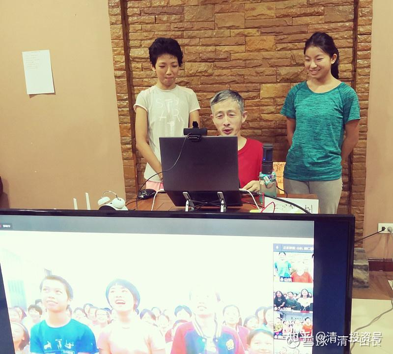
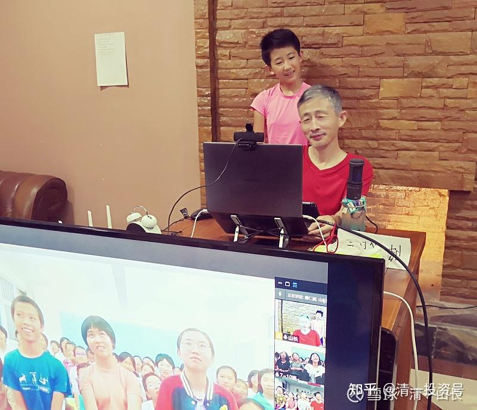

[原雪球专栏](https://zhuanlan.zhihu.com/p/580530679/edit)[188篇.同样年龄：人跟人差距怎么会这么大？](http://link.zhihu.com/?target=https%3A//xueqiu.com/9310099567/189081866)

清一山长 2021年7月6日

下面发一个公主班的13岁孩子，是她第一次正式来上我的培训课后，她写的当天的课程总结日记。

她的日记后面，我再附上三个与她同样年龄的体制学校的孩子，这次来上公主体验夏令营，同样是听我的课后，写的课后记录，你们可以比较一下两者的差距：同样的年龄，同样的小女生，同样的上课经历。上完课程后的思考的深度和方向，**这两种孩子，似乎完全生活在不同的世界。**

未来这两种人，您认为命运会相同吗？现在13岁，未来23岁？33岁、53岁，她们会有什么样的不同的人生？您自己去推导一下吧！这就是现实社会，没有啥幻想的。**什么叫输在起点线上？这就是！**

几个小公主，是来上我的成人课，我没有把讲课的内容，刻意地降低难度，使用简单词汇和概念，而是完全的成人概念，因为我的对象是成人。我发现她们完全能懂，完全能够吸收课程，甚至比大人们吸收得更好。

但公主夏令营。我用了更通俗易懂的语言，更耐心地教孩子们。但我看一些孩子的课后思考总结日记，却没有看到多少我上课的影子，甚至可以说完全没有影子。这些孩子的脑袋，几乎完全不受我的影响。完美地保持在他们原来的状态！

**我不禁惊叹：中国家长和体制教育，实在太有本事了，居然可以把孩子教成这个样子？似乎脑袋生下来就没有用过，全新大脑一样：完全没有理解力，思考力。将来长大后，这种脑子真的是骗子最爱！怪不得国内的骗子业务特别发达**[哭泣]。

**第一个学员日记案例Linda徐逸凡6月4日7:14今天的课程收获总结：**

**（1）找感觉**

家长经常会问孩子：**“好玩吗？”“好看吗？”“好吃吗？**”……这些问题都是在**培养感觉型的人**。所有的衣服都是漂亮的，否则就不会生产它，“很丑”只是个人的价值判断，并不代表这件衣服真的很丑；所有的食物都是能吃的，否则就不会被造出来，其实大便也是可以吃的，食物并不是好吃的问题，而是健康的问题；所有的人都认为自己是最棒的，每个人都很好，不用觉得自己好差劲，也不用去找感觉，不需要证明自己。

之前我也有这三个问题。首先从衣服来看，之前我喜欢好看的衣服，逛个商场就要花好长时间挑衣服，妈妈说我的眼光真高，我还为此小得意，现在看来真是愚蠢至极，什么样的衣服穿着都很舒服，看起来大方得体就够了，我所追求的“好看”真是太飘渺了，还很浪费时间。现在我不追求“好看”了，我追求“大方得体”，穿着舒服就行，这样就节约了很多开销，还节省了很多时间，并且我的“满足感”会提升，只要有衣服穿我就很幸福了。

第二点是对食物的态度。之前我也会追求“好吃”，如果家里没有我喜欢的饭菜，我就会很不高兴，干脆一点都不吃了，爸妈也会被我搞得心情郁闷，那个时候我就像不懂事的小孩，就知道“好吃、好吃、好吃”，但食物的本质不是“好吃”，而是“健康、有营养”，食物是用来补充能量的，而不是用来“品尝舌尖上的美味”。现在学堂里的饭菜就很健康，对我来说也很“好吃”，能吃到馒头、红薯就很幸福了，虽然现在吃的没以前那么花哨、多样，但我内心更加满足了！

第三点是对自己的态度。之前我觉得自己不够棒、不够优秀，想要证明自己，通过排名、成绩等等，在追求的过程中很不开心，永远活在别人的看法中，就想“全能神狗”一样。不过现在我发现自己本来就很优秀，我本来就很棒，根本不需要向别人证明自己，不管别人怎么说，我都对自己很有自信，因为我知道我就是很优秀，这是改变不了的事实。所以我的内心更加富足、轻松了，我知道我本来就很好，而不用证明自己，不需要把自己搞得那么累。

现在我按照上面那三条想问题，果然发现找不到感觉了！我这样想的话，还能找什么感觉呢？唯一想的就是去实现我的目标，所有的衣食住行都是围绕着我的目标进行的！

**（2）“中庸之人”**

**真正学到山长智慧的人是“中庸之人”，平平淡淡的，不骄不躁**。我发现了平淡、冷静是多么重要，小时候我见到有些同学热情、开朗，嘴巴很会说话，经常眉飞色舞，而且别人会经常关注他们，而我就在自己的座位上看书，平时也很安静，不清楚怎样与人打交道，那个时候我很羡慕她们，希望我也能像她们一样外向，所以我尝试变得热情外向，但是当我那么做的时候很奇怪，就不像我自己了。

我发现我不需要向那些同学学习，她们是她们，我是我，我喜欢安静、喜欢独处也不是坏事，我只要真实的做我自己就好了。现在我知道了，人不一定非要外向才好，这只是价值判断，其实我更喜欢做山长所说的“中庸之人”，我喜欢平平淡淡、不卑不亢，现在我的身心合一了，我不需要强迫自己去做“热情、外向的人”，我喜欢做徐逸凡，做我自己！

**（3）性能量**

今天山长又讲了两性方面，“青春期”听起来有点恐怖，好像只要女生进入青春期就忘记目标了，整个人生就被毁了……我现在对“青春期”越来越保持清醒了，我要在青春期之前看透两性，这样青春期的时候就顺利通过了。两性的本质就是交配、繁衍后代，比如泰国小男孩给小明惠写情书，山长告诉小明慧：**“男孩给你写情书，代表他想让你给他生孩子”**，这就是性的本质，我知道后和小明慧的反应差不多，我才不干呢！想让我生孩子没门！我发现男生好自私呀！吸引异性就是为了让自己有孩子[滴汗]。现在的两性关系真是太可悲了，目的就是繁衍、满足性渴望，而没有更高的追求（比如像山[长和](http://link.zhihu.com/?target=https%3A//xueqiu.com/S/00001%3Ffrom%3Dstatus_stock_match)刘老师）简直连动物都不如。而且如果结婚的话，就要给男生洗臭袜子、臭内裤，我现在还不愿意做这事，我还没准备好为一个男生付出这些。结婚还有个坏处，就是会导致机体衰弱，身体和大脑都会变差。如果我结婚了，我还怎么做公主？简直会毁掉我的事业。

预防青春期有两个方法，第一个是赛马的方法，发梦的时候扎自己一下，这样自己就没空想其他东西，比如让自己忙起来，忙得没心思想男生，这样就会度过青春期了；第二个就是朋友圈，要待在好的群体里（比如公主班）公主班是个纯女生的环境，而且青春期时还能告诉老师和同学，而不是自己瞎搞。山长有很有效的方法度过青春期，如果未来我有青春期的话，我觉得我会很顺利的度过青春期，因为我的理想很坚定，而且还有很好的老师和伙伴，**我肯定不会去做小母鸡的！**

完结：

**以下是来三个参加夏令营的体制学校的学生，今天的课后总结，**实在不咋的。为了保护孩子和家长的面子，我把名字就抹掉了。真遗憾，我的流量，可以引流让你更受别人尊重，也可以成为圈内的笑话，彰显家长的教育失败。所以，一样的环境：真的是送你礼物你都接不住！还要人特别的保护起来，避免你们脆弱的小小心灵受伤。

18学员、###

今天是夏令营的第五天。早上起来我们跑了十圈，又做了帕梅拉。我们上午吃完早饭，就到大量工房打扫，然后就去听山长的课，山长说：“男生比女生更理性。”我听完后我就想做一个更理性的人。休息一会儿后我们就去做运动。中午，我们休息了一会儿。下午，我们做了帕梅拉、腿步拉伸和“美丽天鹅”，做完后我们朱迪一组的同学一起拍了张照就继续到教室学习。我今天真开心。

**点评：我讲了啥？我咋基本不知道？除了一句“男人比女人理性”，我这个结论要说明啥？你理解了啥？全没有！**[哭泣]**。**“到大量工房打扫”，啥意思？我们学校肯定没有工房，更没有**“大量工房”**？难道是走错了地方[大笑]

19学员、###

今天是我在公主夏令营的第五天，今天山长给我们上了互动课，山长问我们的问题就是，你去做什么职业，才能活出像是公主一样的自尊自强？才能实现女权社会的要求？才能做最优秀的自己？而不是服务男人，娱乐男人？“不准选做教育老师”。我们有人说要做舞蹈老师，还有人说做演讲家，可以改变世界……但是山长都辩解了，这不可能实现女权社会。

20学员、###

今天上午老师和小助教给我们讲了一下这里的一些事情，学生也会好好遵守规则，感恩老师！

**点评：我讲了一上午，你就一句话总结完了？是您惜墨如金？还是您“挥金如土”？上来夏令营，上学，根本就不把爹妈交的学费珍惜一点点？**

**个人认为：13～14岁了，初二年龄了，写出这种水平的文字，连小学生都不如。这绝对不应该推锅给体制教育。我认为是当妈的人，一直把孩子当猪养，家里平时绝对缺乏理性平等的交流和互动关系，家长根本谈不上任何理性和思考引导的家庭教育，才会出现这种莫名其妙的“课程总结”。小学生这样子，勉强可以理解。这里全都是中学生呢！这样的孩子，无论给多好的课程，都无法吸收的。太遗憾了！**

参考链接：

[【清一大学少年班】走进我们的日常生活](http://link.zhihu.com/?target=https%3A//www.bilibili.com/video/BV1Hr4y1K769)

[这就是今日学堂](http://link.zhihu.com/?target=https%3A//space.bilibili.com/487498588/channel/detail%3Fcid%3D149241)

[今日明师荟](http://link.zhihu.com/?target=https%3A//space.bilibili.com/487498588/channel/collectiondetail%3Fsid%3D55359)

[清一大学武医学院](https://www.zhihu.com/people/mkaga)

[清一投资号：5篇.即将到来的“社会分层”如何面对和解决？](https://zhuanlan.zhihu.com/p/535106255)

[清一投资号：36篇.15岁上名牌大学 VS 99%的大学都不值得上！](https://zhuanlan.zhihu.com/p/545439129)

[清一投资号：39篇.值得所有家长看的纪录片：反省吧，家长们！](https://zhuanlan.zhihu.com/p/545526875)

[清一投资号：68篇.我以为考上了985，就不愁找工作！](https://zhuanlan.zhihu.com/p/555244021)

[清一投资号：99篇.你家孩子，是第几等人？要用几等的教育适配？](https://zhuanlan.zhihu.com/p/569930721)

[清一投资号：106篇.借用外脑，是最低成本的改错方式！](https://zhuanlan.zhihu.com/p/571033703)

[清一投资号：111篇.做事一定要有规划：嫁女也一样！](https://zhuanlan.zhihu.com/p/573549252)

[清一投资号：130篇.凯利的生日礼物：你给别人的越多，你得到的也就越多](https://zhuanlan.zhihu.com/p/580335132)

[清一投资号：133篇.你在同龄人中的竞争力，将自动与社会层级和收入匹配！](https://zhuanlan.zhihu.com/p/580521227)

[清一投资号：134篇.37岁博士回家养老，会是你家孩子的未来吗？](https://zhuanlan.zhihu.com/p/580530679)
