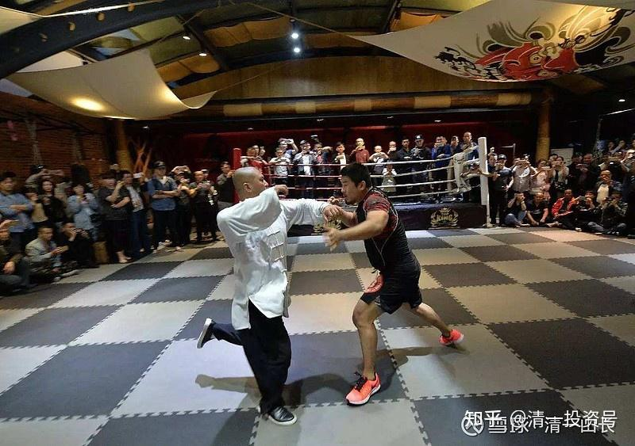

[原雪球专栏](https://zhuanlan.zhihu.com/p/581920937/edit)[190篇.清一太极实战与现代职业拳击的第一次碰撞！](http://link.zhihu.com/?target=https%3A//xueqiu.com/9310099567/190206246)

清一山长 2021年7月13日

以下视频，是我的弟子明琪在清一武道馆，经过两年的太极格斗训练后，首次出山，去职业拳馆，与职业拳手们首次实战交流的视频。这是一次有趣的格斗视频。因为双方的技术显然很不一样，对手显然很不适应这种打法，完全打乱了，一着急，技术动作变形，更打不上了。（视频中白衣者是明琪，知乎链接[网页链接](https://zhuanlan.zhihu.com/p/389072935)[https://zhuanlan.zhihu.com/p/389072935](https://zhuanlan.zhihu.com/p/389072935)）

由于我的弟子，也是第一次出战职业拳手，对自己也没啥信心，所以也比较紧张，就打出了你们看到的这种水平。双方都没有真正发挥出自己的实力。为了让大家了解职业拳手之间的打法区别，我还传了另外一个职业拳手之间的实战视频上来供你们比较差异。你们看看其实技术动作是明显不同的。但如果不懂武术的人，看起来可能觉得都是拳击。（因为用拳击规则对战）。但在技术上，其实差别很大。

视频：[https://video.zhihu.com/video/1398044975184011264](https://video.zhihu.com/video/1398044975184011264)

太极格斗VS职业拳击（按拳击规则）

这个拳馆是个职业拳馆，有多名洲际冠军在里面，他们还是拿了个世界拳击冠军的队友——邹市明是这些拳手的朋友和师兄。

为了避免“踢馆”之嫌，我们是报学习的态度，交培训费，去拳馆正式训练的。申明了自己是学传武的，想去拳馆练练，上现代格斗擂台打，因为觉得传武都没比赛。拳馆也友好的接待了，天下拳友是一家，大家就一起练。我们也需要拳手熟悉现代格斗的打法，不要闭门造车，根本就不研究现代格斗，一见面就跳上去打，这完全是自杀行为。就**像雷雷一样，也不去量量自己的重量就上台了**，实在是一大笑话。**这些都是传武骗子，不是真正的传武人，是传武高级黑！**

明琪的报告说：他刚一去，开始练拳，就被教练说他练拳有三大毛病，**这三大“毛病”，其实是太极实战格斗的精髓。**

明琪汇报的情况：在拳馆练下来这段时间，我经常被教练指出“三大毛病”

**一是出拳不把手完全伸直，也不转身。**他们要求我一只手出拳，该手臂必须“发力充分”，把手打直，然后另一侧的肩膀必须转到后面去。因为他们看到我出拳时，手臂都是曲着的，手臂幅度很小，不像他们从最开始抱架完全收着，到出拳时完全展开。而且我转身幅度也不大，他们就要求必须把身体转到位。

**二是步伐上**，在出后手时，前脚一定要站稳不动，再拧转后脚配合转身，把拳打完。我则是**出一拳双脚都会动**，他们说这样不够稳，一拳只动一只脚，然后左右不停转换，才有组合拳。

**三是抱架**，说我的抱架太开，虽然头部护得还可以，反应也不错，但肋部空挡很大，被爆肝就很危险。要求我双臂要紧贴自己，前手也不要一直放得太开，出拳前后都要收回下巴。

实话实说：这教练还是很有水平的，对拳击技术的要领把握得很准确。拳击就得这样练。不然无法发力。但太极也这样练，就不是太极了。**太极的练法，跟拳击完全相反。**不然咋能克制现代拳击？**他们认为是问题的部分，恰好是我们的优势打法。但他们如果自己用我们的方法来，就会吃亏。因为两者拳法的底层训练体系基础不一样，发力方式不一样**。我们用他们的拳击方法来打，我们很难取得啥优势。如果他们用明琪的招数来打拳击，就会惨败。所以，**太极真的不能学外形的，必须要知道这个外形，动作招数下面的底层逻辑——就是武道原则不一样。**拳击的道，与太极的道不一样。我们认为对的，他们认为错了。不过，外行看不出这些来，以为都是抡拳头，都差不多。说这些，让大家长长见识。了解真正的太极格斗是啥。肯定不是雷雷、马保国的摆架子，跟拳击太不同了（专业教练一看，就知道明琪的“问题很大”，练歪了[笑]）。我知道这种差别，所以一直不让明琪出来打。怕他过早接触拳击，如果打不赢的话，会对自己的训练体系没信心，反而障碍了他认真练我们的功法。所以，现在他已经练出样子来了，才让他“下山”，去试试现代格斗。第一战打成这样，已经很不错了。他也更有信心坚持我们的特殊练法了。以后只会越来越好，让练拳击的专业拳手全蒙掉——明明是错的，为啥就是对付不了？（就因为他们认为是错的，所以他们更防不住）。

实战中，大家可以看到：这位职业拳击的队员，显然一时还无法适应明琪的打法。

第一是失去了距离判断感，很轻易就被击中头部。这是因为太极拳的出击方位是不收手的，正常拳手不会防范这种伸出去的前手拳。

第二是太极的打法，是一接手就让对方站不稳，自己步伐灵活多变，用动桩取胜。并不是你们想象的，电影上用某种慢悠悠的招数，奇怪的动作去击倒对方。而是用水一样的拳法和步伐，快速有力的攻击，让对方的实力无法发挥。你们可以看到明琪常常把对方打得站不稳，而对手的头部经常被打到位移。而对方对明琪的拳法和站位都很不适应（抱架和攻防都不一样），出击常常落空。而明琪的连续攻击很有效，但没有发全力（如果全力发出抖劲，对手会受伤的）。

以下是拳馆自己的拳手对战的视频，大家看看差异如何？

视频：[https://video.zhihu.com/video/1398053336814333953](https://video.zhihu.com/video/1398053336814333953)

比较图：雷雷的抱架，连门都没入。完全是一个公园业余玩家的架子[哭泣]

雷雷的抱架很开，本质是攻防合一的。如果要打人，他的拳头离徐晓冬的脸更近，更容易击中对方。这就是太极大抱架的用意——可以后发先至。但雷雷有架子，无功夫，用这种架子就是讨打了。因为他就是没功夫的假架子。他用这个架子，是无法发出有力量的拳的，只是吓唬对方。一看他的身子就知道是假货——身形不对，是僵死的。真练过的人，会用寸拳（身拳）就把对方击退，不需要手臂发力的距离，就能发出常人不能发的巨大拳力（李小龙示范过这种拳的杀伤力，一拳就把人打得退后几米远）。另外，从他的脚上动作就看出来了。他面对徐某的攻击，想后退躲开，但他的方法错误，太极是身子退，手不收回，脚步自己会跟随移动。他这个伙计，是脚抬起来退，身子不动。这证明他根本就不会真太极。这种移动方式，是普通人的移动方式，不是太极拳手的移动方式。你们比较一下我教出来的弟子在实战中的移动方式，面对对手重击时的身子移动方式。你都没看出他是咋动的，身子一晃就换了步子，让对手重击的拳落空，甚至短暂失去重心，这样子，才是真正的太极移动身法，快速、灵动。雷雷哪里懂。

（以下内容为编者收录）

**评论回复：**

LYUB回复@清一山长：

这个黑衣服还是职业拳手？太菜鸟了吧！有气无力只会抱头。

清一山长2021-07-13 13:15回复@LYUB：

别笑话别人，您上场的话，面对对手的攻击，难说也跟雷雷一样：连抱头都不会[大笑]。

昶盈信-王浩宇回复清一山长：

背景没交代一下吗？双方选手各自练习时间？如果一个修炼太极十几年，一个修炼了两个月的职业拳击新手。这种视频参考意义不大。

清一山长2021-07-13 14:47回复昶盈信-王浩宇：

最讨厌这种人——连第一句话都不认真读完，就冒出来大口大气地指点江山，装高大上的人。好像自己多有见解一样。真是超级自恋！走你吧！我的东西，你就别读了，你是没法读懂的，就别在这浪费时间了！

清一山长2021-07-13 16:22

我很惊讶地发现。绰号嘴炮的UFC最强格斗手，居然在练习蜥蜴爬？这是我让武道馆的学员必须练习的一个基本功，让他们练“地上的太极野马分鬃”。[网页链接](http://link.zhihu.com/?target=https%3A//v.qq.com/x/page/c05158pwhh5.html)：[https://v.qq.com/x/page/c05158pwhh5.html](http://link.zhihu.com/?target=https%3A//v.qq.com/x/page/c05158pwhh5.html)。

当然练法跟他不一样，但目标是一样的，练身体的支撑力。

我还发现他的老师是形意、太极、八卦的练习者。他跟这老师学习受益良多。他不止一次的在博客中讲述，中国武术的移动方式是最完美的，可以爆发出人体最协调的力量。而他恰巧也是UFC嘴炮的移动、步伐教练。将中国形意拳的武学精髓，教授给麦克·勒戈，在世界最高竞技舞台上展现，他可以说是目前来说传武擂台的最高手了。

我猜想；将来清一太极打出来了，别人会不会说是跟嘴炮学的招[大笑]。

**中国人，总是自己的东西不好好学，只拿来骗人。外国人倒是认真学了，去用了。我无非是用外国人的思维方式来训练太极拳手，就轻松击败了职业拳击手。**虽然离冠军尚有距离（男选手大约还要三年时间才有机会）。但已经实现了零的突破（如果你们翻阅原来我的发言，徐冬瓜大闹传武的时候，两三年前，我公开说过，看不得中国武术被人这样侮辱。说真太极不是雷雷这样的。等两年我带弟子出来，你们看视频。当时很多人出来黑我，骂我骗子。今天这些人在何处？[为什么]

难道外国人学了，我们才去追捧外国人吗？真没出息！**我为中国武术界上千万人，这些拿着国家钱粮却不干活，或者在民间到处骗人的民间武师们，这些丢人现眼的“中华武术代表”感到羞耻：你们真的是丢祖宗的脸。白吃饭不干活的一群混蛋！**

国学中医黎天焕回复清一山长：

终于见到真功夫了，我反复看了6次太极与拳击手以及2次职业拳击手的对抗。第二场是完全相同的技术在场上拼体力和反应能力，躲闪技术也是很典型的职业拳击手风格，说明拳馆的实力和水平是很强的。

我对第一场的对抗看到几点情况：

1.双方开始都很紧张，但白衣拳手很快调整过来，慢慢掌握节奏，而黑衣者未能发挥自己的技术，越到后面越被动。

2.白衣拳手进退都能自如，看步法明显比职业拳击或其它现代格斗更灵活，看赛事第一次见到直插中线的进攻，如果是真搏斗，黑衣拳手应在开场之后不久的一个对抗时,被插入中线的进攻中倒下。

3.能看到白衣拳手进攻途中可改变方向，出拳方式上发力伸手时没有像职业拳击的直拳完全伸尽，没有多余的左右晃动身体。

4.黑衣职业拳手消耗体力很大，所有的进攻在刚出手时即被截住，所以不停的在改变进攻意图，越到后面越被压制，所以普通人看到会认为是初学者，其实能不断改变战术的拳手就是有沙场经验的，只不过他的所有意图都被对手识破。

5.能看到太极拳手发力速度很快，动作很小，但有些出手的力量来自腰以下，所以一旦全力击中，对手会受伤，明显在后半段时间白衣拳手是没有尽全力。

谢谢山长。

清一山长2021-07-13 17:05回复国学中医黎天焕：

你看的蛮细致的[赞]。刚开始，的确明琪很紧张。但对手刚开始并不紧张（因为他们是老拳手，不是新来的）。只是他越来越焦躁，因为他实在不适应这种奇怪的打法，老是莫名其妙的挨打，还手都不知道怎么还。后来打急了，有几个拼命出手重击的摆拳，还导致自己失去了重心。明显有点生气！可还是没有打上。

“如果是真搏斗，黑衣拳手应在开场之后不久的一个对抗时,被插入中线的进攻中倒下。”

全力相博，就是这种局面。这是后手拳的重击技术，是孩子们正在重点强化练习的攻击方式。女生也正在练。我要求她们练成后手重击技术后，才能出去跟专业拳手实战。女生大约三个月后会出山。

现在你看到的，只是练习赛，犯不着出狠手。我们的拳手只是点到为止，不许他们KO人。明琪在我们馆内练习对抗的时候，两次有不小心把对手击晕的历史。外面看起来只是轻轻一击。所以，我才让他外出，去面对职业选手的。有这种实力才能出山。

**参考链接：**

[清一投资号：26篇.解答大家对真太极的误解](https://zhuanlan.zhihu.com/p/527851327)（整理文）

[山长 清一：实战太极与现代格斗之谜1：发力技术！](https://zhuanlan.zhihu.com/p/362455647)（专栏文）

[清一武道馆：传武杀人技？太极不出门？](https://zhuanlan.zhihu.com/p/354643954)（专栏文）

[清一武道馆：真被“武术界，国术界”给恶心到了！](https://zhuanlan.zhihu.com/p/357918131)（专栏文）

[清一武道馆：实战太极与传武高级黑！是实话，可真相是这样吗？](https://zhuanlan.zhihu.com/p/355026610)（专栏文）

[清一投资号：第18篇.武道论之六：武功无秘密唯有苦练](https://zhuanlan.zhihu.com/p/522789501)（整理文）

[138篇 实战太极与现代格斗之谜1：发力技术!](http://link.zhihu.com/?target=https%3A//www.ximalaya.com/sound/488865125)（音频）

[哔哩哔哩：实战太极与现代格斗之谜1：发力技术!](http://link.zhihu.com/?target=https%3A//www.bilibili.com/audio/au2820089)（音频）
