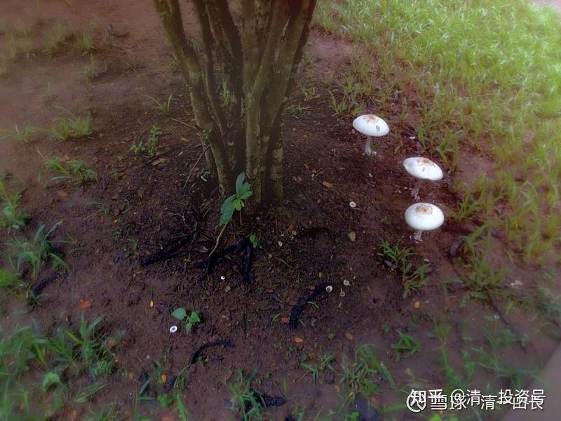
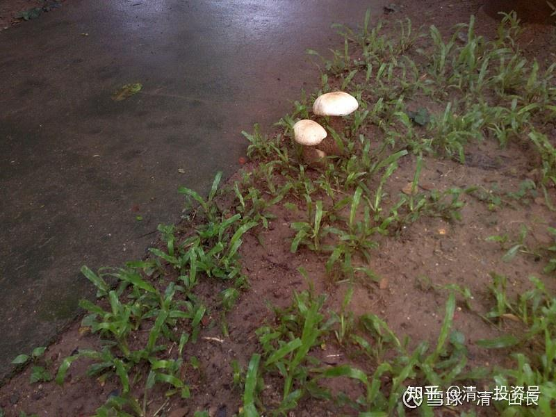

原雪球专栏[192篇.世界上最好的工作是什么？](http://link.zhihu.com/?target=https%3A//xueqiu.com/9310099567/190420598)

清一山长 2021年7月14日

我搜索了“世界上最好的十大工作”，结果令人失望，居然是“在大堡礁喂鱼”之类的工作。我承认，如果只是让我喂几天的鱼，我会蛮开心的。但如果让我只能喂一辈子的鱼，天天喂鱼，我认为，这跟关我牢房，判个无期徒刑，也差不多！[哭泣]美好人生，拿来做这件事情，天天做鱼的仆人，也太亏了。

世界上最好的工作是什么？

如果您认为最好的工作，就是挣钱多的工作，那贩毒、制毒，就是最符合您要求的工作。中国曾有一个制作冰毒的[刘招华](https://zhuanlan.zhihu.com/p/32868036)，赚取几个亿，甚至十几亿都很容易。因为他能够制造出世界上纯度最高的冰毒，号称“超级钻石级别”。

如果您认为最轻松的工作，就是世界上最好的工作。您就去当宾馆试睡员好了。天天睡觉，躺赚！[大笑]

如果您认为，连试睡这种工作都太辛苦了，还想找更轻松的工作。我也帮您找到了——就是啃老工作。不过，由于这种工作只有一个雇主。您最好在雇主死亡之前先死，不然就会失业了[大笑]。

每个人，心中都有“世界上最好工作”的判断。那么——我认为世界上最好的工作是什么？

**第一个条件是：受人尊重。**如果我从事的工作，能够让我同时得到底层、中层，以及上层阶级的尊重，无论黑白两道，江湖庙堂，高官和百姓，都能够发自内心的尊重我，喜欢我，支持我。我觉得这就是世界上最好的工作！

**第二个条件是：如果因为我的工作，能够让我的子孙后代受益，获得比其他职业工作者的后代更多的机会，让我的后代更有竞争力。**我认为就是世界上最好的工作！

**第三个条件是：能够不断自我提升的工作。**如果我的工作和职业，能够让我的思维和心理、行为都不断提高，让我退休的时候，比我开始工作的时候更有智慧，更有能力，更受尊重，我认为就是世界上最好的工作！

**第四个条件：伙伴和团队。**如果我能够和世界上一群我最喜欢的人一起工作，和一群相对最友善，最和睦，最亲近，最聪明，最有智慧，身体最健康的人一起工作和生活，成为他们的其中一员，成为他们的伙伴和朋友，我认为这就是世界上最好的工作。

**第五个条件：**我认为最好的工作，**是生活和工作合一的工作。**我上班跟下班一样快乐的工作。这样的工作，是一辈子也不会厌倦的工作。我不需要为了工作而牺牲生活，也不需要为了生活而牺牲工作。我的工作和职业永远不会淘汰，我不用不断面对我不熟悉的工作和世界。我的工资还不受行业不景气和倒闭的影响，可以穿越经济周期和萧条。这种工作，当然是最好的工作了。

**第六个条件：**我认为最好的工作，就**是能够认识很多人的工作。**这样会增加我活在世上的乐趣，我将有很多故事可以讲给后代听。当然，不是地铁检票员。我说的认识，不是认识一张脸，而是**有深度的人际关系，彼此关心和爱护的人**。我可以因为工作而不断地认识各种各样的新人，甚至是跨国的人。他们对我都很友好，我可以和这些人一起笑，一起玩，不至于年年看着一堆老人，老脸，老同事，让我厌烦不己，却无处可逃。

**第七个条件：**我认为最好的工作，不仅仅是可以赚钱。如果我因此得到了报酬就“跪谢大爷打赏”，这样的话，做餐馆服务员，做网红，也可以符合要求了。而是我的工作，**虽然是客户要拿钱给我，出了钱以后，他们还会发自内心的感谢我的工作和服务，甚至一生都感恩我的工作**。这要求——是有点过分了。但——万一有呢？干嘛不做？[俏皮]

**第八个条件：**我读书是为了自己的提升，我运动是为了我的身体健康。如果有一个工作，**可以为我的读书而买单，**我读书的时间不算我旷工，甚至可以**因为我运动的时间也算我的工作时间**，我就太高兴了。我认为这种工作就是世界上最好的工作。也许——图书管理员有点接近这个工作。

**第九个条件：**都说“生不带来，死不带去”。死亡会把我们的一生所做所为都带走。一般的工作，能够带给我们的回报无非就是金钱。无论金钱有多少，我们都无法带走。但我希望我能够得到一个工作，**不仅仅让我生前尽享尊荣，还能够让我死后带走我创造的一些好处**——比如换成“宇宙币”，给我带去其他宇宙空间里面使用。至少我死后会有很多人怀念我，纪念我。这个——可能有点贪心了，但，万一有这种工作，我干嘛不去做呢？这就是实现了老子的教诲——“死而不亡者寿”。

**第十个条件：**我认为，上面的九个工作条件，实现每一个都很不容易了。但我想：最好、最好的工作，就是能够全部实现以上九条要求的工作和职业。

您能帮我找到一份这样的工作吗？难道我太贪心了吗？[大笑]您心中最好的工作是什么？请你们分享一下？看你们谁能找到更理想的工作。

最近是雨季，我的院子里面长了蘑菇。离我的房门才三米远

秘密就是：我已经找到了我的最佳工作。你给我当国王，我都不换给你的工作[大笑][大笑][大笑]

（以下内容为编者收录）

**评论回复：**

宇丶不聽的墜回复[清一山长](http://link.zhihu.com/?target=http%3A//xueqiu.com/n/%25E6%25B8%2585%25E4%25B8%2580%25E5%25B1%25B1%25E9%2595%25BF)：

世界上最好的工作就是不用工作。

[清一山长](http://link.zhihu.com/?target=https%3A//xueqiu.com/9310099567)[2021-07-14 16:09](http://link.zhihu.com/?target=https%3A//xueqiu.com/9310099567/190426592)回复宇丶不聽的墜：

您想要的这个工作的名字叫【**啃老**】。**入职要求：脸皮厚，必须要厚到无视周围一切人的鄙视，包括来自父母的鄙视就够了。**[大笑]

[清一山长](http://link.zhihu.com/?target=https%3A//xueqiu.com/9310099567)2021-07-14 16:12回复宇丶不聽的墜：

拉黑您了。因为我不喜欢啃老族。我也不喜欢好逸恶劳的人，更不愿意为你们服务。再见！

尘世游回复所有梦想都开花HTS：

一花一世界，一沙一天国，没有所谓最好的工作。如果能力强大到能在所从事的领域里游刃有余就是舒心的工作。其实问题的本质是一个关于能力的问题。如果教师因为五斗米被某些莫名其妙的条条框框缠住手足，还会是“最好的工作”吗？

[清一山长](http://link.zhihu.com/?target=https%3A//xueqiu.com/9310099567)[2021-07-14 17:04](http://link.zhihu.com/?target=https%3A//xueqiu.com/9310099567/190434347)回复尘世游：

您以为是普通的教师吗？体制教师，我看活得就像流水线上的工人一样，可怜至极，也没有尊重，像个乞丐，找家长和学生要钱，要补课费。别人虽然给面子，但大多数心里都是鄙视的，瞧不起的。哪有我说的十条荣耀？连一条都对不上号的！

我公开说：**体制教师可能是中国知识面最缺乏的一个群体。因为他们不断重复一点简单的课程知识点，跟工厂流水线上的打工妹没啥区别。**只要是教知识的教师，都这样德行。对社会的了解其实很无知，满脑子的自以为是。如果不教书了，出去谋生，很多人活不下去的（当然，少数人例外，比如我）。

我这样说，是因为我是教师世家。我身边全是这样的教师，我太了解这个群体了。所以，我小时候的志向，就是，长大了我绝对不做教师[大笑]。

现在好了，我只好做武师，开武道馆去了。总算逃过了体制教师一劫。假如我的太极弟子拿到了现代格斗的冠军，我就创造了中国百年以来的奇迹。上面的十条，我就一条不少，全都实现了。我相信冠军就在眼前，不止一个。就是什么时候拿到手的问题。

就像中国建筑一样，涨是肯定的，就是什么时候涨的问题。[大笑]

侯德坤回复[清一山长](http://link.zhihu.com/?target=http%3A//xueqiu.com/n/%25E6%25B8%2585%25E4%25B8%2580%25E5%25B1%25B1%25E9%2595%25BF)：

最理想的工作是医生，最好是善长身心灵的医生，这个可能和自身从小体弱多病有关。当然，现实的工作，在社会伦理、道德、法治的允许范围内，能够自利利他，解决最基本的问题就行。山长的十个参考标，能达其一二，在世俗中已经是非常牛掰了。

[清一山长](http://link.zhihu.com/?target=https%3A//xueqiu.com/9310099567)[2021-07-14 17:06](http://link.zhihu.com/?target=https%3A//xueqiu.com/9310099567/190434730)回复侯德坤：

同意：真正的医生，就可以实现以上十条。可惜现在的医生，很多也只是流水线上的医疗工人罢了。
