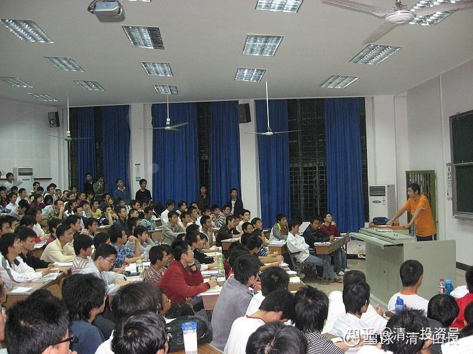

原雪球专栏[194篇.怎样才能为女儿创造一个比我们生活的世界更好的世界？](http://link.zhihu.com/?target=https%3A//xueqiu.com/3931532042/204322344)

清一山长 2021年7月16日

今天我在泰国警察局的经历，颇能说明问题！**生活的世界不同，人也很不同，要求的素质可能完全相反**。我不用生活在灯塔国这样天天都有杀人枪声的国家很幸福，比扎克伯格这样的大富豪可能更幸福。下文转发的学员说的扎克伯格的故事，我原来还不知道，只知道他很年轻就捐款出来了，而且自己生活很简朴。但他的这个目的，真的很令人感动。**为了女儿，尽我们所能，把我们的世界改造得更美好一点。**

今天，是我在泰国生活的第五年，终于第一次被泰国警察局“逮住”了，只能去警察局交罚款。原因是我带小女去每周一次的“云南市场”，买一些国内的调料、食物等。回来的时候，发现停在路边的车，被上了一个车轮锁。车窗上贴出一个附有三国语言的说明书，中、英、泰。说明我的车停的地方是禁停区域，我需要去派出所交罚款，交完后就可以走了。还有一张泰文的罚单，附有地图标明我要去的地方，挺贴心的。让我这个外国人也知道该去哪里。其实不远，两个街区的样子，就只好由小女陪我一起慢慢走去了。

基于中国的经验，跟警察打交道是一件非常不友好的事情。我在国内也被警察罚过款、拖过车，真的麻烦透了。不仅仅是罚款的问题，还有很多繁琐的手续，以及毫不尊重人的气氛。我当时有些担心：因为我的驾驶证正好几天前为小女买电脑要登记驾驶证，放在家里没有带在车上，会不会节外生枝？护照也没带，完全没有身份证明。

结果到了警察局，很意外：首先是没啥人，只有一个人在等着办事。刚进门，就有一个女警热心地问我们来干啥。说了来交罚单，就指给我们办事的地方，让我们坐下等了一会儿。去办事的时候，接待的警察笑嘻嘻的，说明要交400泰铢罚款。很耐心地跟小女解释、说明，不厌其烦。最后交钱需要换钱，自己跑去找同事换钱，给了一张罚单，让小女签了字（由于对小女的名字不会写，我看就说了好几遍，小女还纠正了他的英文发音。）最后打了一个对讲机，就让我们直接走了，根本没有要我的驾驶证。我还想：怎么没有警察跟我们去开锁？结果回去一看，锁已经消失了。就像它怎么来的一样，毫无踪迹。

我问小女：“有没有觉得中国的警察比泰国警察凶一些？”小女说：“是的，中国警察态度要凶很多。：她说：“是不是中国的警察都很生气？”两年前她回国，到了国内的机场，到处看人，然后说：“这里的人怎么都这么生气？”的确，一个个的人，不管是公务人员还是旅客，看上去都很严肃，很不耐烦的样子。

我说，我认为**不是警察有问题，应该是中国的百姓都很不讲理。**如果警察像是泰国警察一样很友好，笑嘻嘻的，友好礼貌地接待对象，就没法执法了。我记得几年前，一次在河南住宾馆，早上看到一个开宝马轿车的，据说是老板，听说住宿宾馆还要交5元的停车费，就大吵了起来。说不合理，要找人、找经理、找警察一样的大闹。大约吵了一个小时，打110，结果别人不出警。他就威胁要告警察不作为，警察说这是内部事务，让他跟宾馆方协商解决。最后，看门人自动让开了，让他想走就走。惹不起这种人，他给你造成的伤害，要比跟他交往的收益要大得多。虽然他自己也遭受了更大的损失。

我也觉得：宾馆收客人的停车费，有点因小失大。这是一家市政府招待所改制的对外接待的宾馆，估计有点官气。但几元钱不是啥事，合理不合理，也没必要去吵一个小时的。这很不尊重人，也不尊重自己。但**中国这样的“刁民”其实很多，都以自己的标准作为标准，要求别人必须服从他的个性化定制。**所以，警察见这种人多了，哪有好脾气，当然就越来越板脸了。态度友好一点的话，刁民认为你软弱，更猖狂了。根本就无法执法下去！下面的**小民，只服从威权，不服从文明。**所以造成了中国警察办事，强调威权，而不是体谅和关爱。特别是涉嫌有点违法的事情，都特别的严肃，以及紧张，随时准备大战一场。因为**小民总有证明自己无辜的冲动。**就像我可能会找理由说：我是外国人，看不懂你们的标志和说明，要求免于执法（我没有找任何借口，只是知道国内的中国人被抓，比如明明酒驾，还大叫大嚷我没喝酒啥的！装出特别无辜的样子来）根本就没有一点廉耻，公民责任感特别差，结果**导致了政府只能强制执法，习惯强制执法的局面。恶性循环了。中国的威权政治，毫无人情考虑的政策，一刀切的执法，其实是不得不出现的一种结果。**

澳洲李华丽说的：**“社会上我们经常看到官场的深不见底，商业的勾心斗角，职场的尔虞我诈，社会的人心不古，世道的道德沦丧。一个无私助人的人，反被讹诈；一个救助他人的人，反被指责；一个用心待人的人，处处受挫；一个热心付出的人，被极度消费；一个积极进取的人，被嘲笑傻瓜。许多本性善良的人被社会和现实狠狠地打击，最后在染缸中也成为这样的社会和现实中的一员，由白成灰、成黑。”。**

没错，我原来在中国的学界、商界一路打拼过来，这样的环境，太熟悉了。我都担心——小女跟我在国外呆久了，回国会很不适应。中国的这种非常不正常的、古怪的，对任何人都没好处的社会环境，我闯荡过来了。但我的孩子，真的很难适应——因为她从小所受到的善良、正直和礼貌，以及理性的教育，反而成了她最大的弱点。就算我们把她教成跟国内人一样的疯子，其实也并不是她就能过上好日子----**为了避免地狱的危害，就让自己先进入地狱，这种方式是不可能上天堂的。让自己进入到狼群中，你输了当然很倒霉，但赢了也没啥真正的好处。**最终，中国这种社会没有赢家。所以我觉得特别的没有意思，我也特别的不愿意在中国办啥实业，不愿意继续投资实业。政府表示要划地给我办学都不敢要，我只愿意买股票。国内做啥事，要维护真心，太不容易了。**有时候，在中国，你就必须像狼一样凶狠，才能生存在狼的世界里。你想优雅一些、文明一些、礼貌一些，就只能是被人欺负致死的结局。**

包括一些“清黑”，明明帮他们孩子提高了很多，刚开始感恩不尽，很快又翻脸成仇，就像是疯子一样。你去辩解，是你“心胸狭小”，你不辩解“证明你就是理亏，你已经自承其罪”。在这样不尊重人的地方，怎样才有文明和优雅的存在？所以，我终于离开了。呆在泰国几年，感觉挺好的。没发现有人有意地欺负我。有些泰国人的确会想占便宜，有时会设一些陷阱给我也很正常的。但真没有遇到死乞白赖的人，无理也辩三分的人。起码背后有啥心思，但见面的时候，脸面上是过得去的。不会一个个仇人相见一样的。

我一直在想：**我们这代人，怎样才能给后代留一个正常的生活环境？一直想建立一个有共同理想的清粉社区，相对文明系数高一些。**国内原来一直在努力，但显然越来越没有希望。你投资再多，最终可能都是一窝端，私有财产权根本就不受尊重，所以只能建在国外了。第一期100套学期房，已经分送完毕。但可能还有一些清粉，并不是想来上学，只是想生活在一起，能否也有机会，得到清粉社区居住的房子？我真的准备了的，**明年就会专门的开发一些，专门供清粉们居住的房子，对外出售。**价格——只有主流城市的十分之一，甚至二十分之一，甚至更低。只收一个五级小县城的小员工都买得起的价格，勉强高于成本就行了。我猜：这是将来大家都愿意居住的地方吧？起码**可以做一个第二家园，养老圣地**。具体位置，我就不说了。等到时候房子都盖出来了，你们自己来看。建筑商——是中国基建狂魔之一：[中国电建](http://link.zhihu.com/?target=https%3A//xueqiu.com/S/SH601669%3Ffrom%3Dstatus_stock_match)的海外公司——盖的房子，我相信质量是可靠的。

最近有个故事很好笑。清一大学少年班的学生，这个暑假我让他们不要学习了，去外出打工去，去上上社会大学去。了解社会，了解各种职业，别当书呆子。这些孩子，有不少原来都很想去海外大学镀镀金，将来去世界五百强企业当个技术官员啥的。我也没有计划培养他们当教师。**我培养未来教师的班级是“公主班”和“武道馆”**。结果最近这些家长纷纷跟我联系，说孩子们去打工几个月后，纷纷要求今后要当新教育教师，不想再去上大学了。因为见过了北上广，见过了外面的花花世界，真的发现：**清粉圈才是他们最想要的地方**。我说：“学生们年纪小，还是先去上大学，了解更广阔的世界，不要急于做决定。新教育正在发展中，晚几年，想清楚再设法回来，也不迟的。”

传一张当年我在武汉大学教室201讲课的照片。差不多15年前的“历史照片”。我教的是选修课“人生十二讲”，很多学生其实不是选了我课的学生，而是外来的各种年级、不同专业的学生，不是为了学分而来的学生。当年过于风光，导致党委开会，讨论我已经成为“新一代武汉大学学生的精神领袖”，要严肃对待，严防死守——于是——校方用莫须有的理由，取消了我的代课资格。大大减少了我对大学的“不良”影响。所以，后来我就辞职走了，彻底自由了。不然，我还放不下这些其实很努力上进的武大学生，不忍背离。虽然武大的老师我很有些瞧不起，但我很惋惜这些优秀的学生，进校后根本得不到真正的指导和教育。

转发：澳洲李华丽：原贴：

几年前新教育还未有三语高中，有些家长还是放不下文凭。朋友是办新教育学堂的，想着如何帮助家长接轨，所以托我整理接轨的问题。当时澳洲靠前面的大学都去问了，答复是一定要有这个高中或相等文凭。想能不能有其他办法，折腾了很久，被大学推给考取维多利亚高考证的机构，又推给他们各自属下的附属机构，弄了好几回，总的结果就是：交钱，过来读1年～1.5年，给你相当于高中的资格认证。我一听就知道行不通的，真学新教育的人，谁愿意浪费这一年多的时间+几万澳币学费+几万生活费来拿这样一个无用的证书啊！

对我来说，**新教育根本就不是为了让我的孩子拿证书，甚至我要的不单只是教育这一块，我是要孩子成长、生活于这样一个圈子里**，这个“桃花源”。

社会上我们经常看到官场的深不见底，商业的勾心斗角，职场的尔虞我诈，社会的人心不古，世道的道德沦丧。一个无私助人的人，反被讹诈；一个救助他人的人，反被指责；一个用心待人的人，处处受挫；一个热心付出的人，被极度消费；一个[积极进取](http://link.zhihu.com/?target=https%3A//xueqiu.com/S/CSI1032%3Ffrom%3Dstatus_stock_match)的人，被嘲笑傻瓜。许多本性善良的人被社会和现实狠狠地打击，最后在染缸中也成为这样的社会和现实中的一员，由白成灰、成黑。

但是在真正的新教育圈里，我运动，别人运动得更多；我乐学，别人学得更用心；我创造，别人比我更勤于思考；我向善，别人比我更多善言善行；我付出，别人无私给予的更多；我分享，别人的分享更勤更多更有深度。在这里，所有善的、正向的，都得到肯定、得到强化，我不再怀疑是不是自己出问题了，怎么和别人不同；我很自信，人生的价值就该是这样。

以前我以为，最单纯的、最美好的人与人的关系在步入社会之前，在高中、初中、小学，在两小无猜。现在我明白，不是因为年龄的问题，不是踏入社会了关系就不再单纯美好，而是因为我们没有处在对的圈子里。在新教育的核心圈子中，人心和人心之间的坦诚、靠近、简单，就如小时候那样，没有太多的杂质，只是想着成全更多。在这里，关系也如《道德经》中说的：复归于婴儿。

脸书的创始人马克·扎克伯格，在第一个孩子出生的时候，把自己99%的股份，价值450多亿美金捐赠给慈善基金会，致力于为女儿，“打造一个我们希望你在当中生活的世界”。这99%的股份2021年已经接近1000亿美金。这么大的数额，目的无非是为了女儿，“在比我们更美好的世界里成长”。但是美国白人、黑人的历史冲突矛盾、种族歧视、社会暴力，这些问题岂是千亿万亿美金可以解决的，甚至可以说，岂是钱可以解决的。即使马克·扎克伯格+比尔·盖茨+巴菲特的资产联手打造出来的社会，未必有新教育圈现在这样的美好、正能量。我没有千亿、万亿美金，但我却有机会让孩子在一个比马克·扎克伯格设想的更好的世界里成长。这样对比之后，我还只是关注新教育里知识、技能、文凭、学历这些小点上，那是买椟还珠，有眼无珠了。

《与神回家》P175有句话

“所有灵魂在每一刻相互作用，共同创造。交织一直在持续，它创造了激动人心的生命锦绣。”

生命里的所有呈现，都是选择的结果。每个人都是独立的丝线，志趣相投、价值观相近的人，选择了相遇与此，一起创造生命的体验。

感谢山长让一切有了开始，新教育这块锦绣将会很美。

**评论回复：**

君子小苗回复清一山长：

我国的公职人员对待外国人也是非常热情善良的。很多人看到外国人都热心，看看网上那些中国人去外国旅游，当地人都会热心，这大概是人类的通病，在外族人面前表现自己的热心，在自己人面前，巴不得过得比自己差好。

清一山长2021-07-16 23:46 回复@君子小苗：

1：别人刚开始根本不知道我们是外国人。车是在泰国拍照，看不出是谁的。小女泰语基本相当与母语。

2：**全世界最给洋人面子的国家是中国**，不是泰国。泰国的外国人没有啥特权的，只有多花钱的特权。真正的保护，是给泰国人的。有很多外国人没有的特权。但中国是相反的。

3：案例一，泰国人上公立大学，学费几千泰铢一个学期。外国人来上同样的大学，几万泰铢一个学期。泰国人上中国的大学——每年倒贴几万元（免学费，还给相当于一个人工资的生活费）。

4：医疗。外国人去泰国的医院，费用很高。泰国人去，费用很低。

5：管理上，每三月都要报道一次（90天报道），交一次**“居住费”**。

外国人在泰国，只有生活上，是基本跟泰国过国民待遇的。其他都是低于国民待遇的，很多好机会是不给外国人参与的。让我们很眼热泰国人的机会。这跟中国的情况基本相反。所以，自己没出来其他国家，没比较，就别乱猜，别瞎想象！

陈盈奾回复清一山长：

在照片上看到了我先生，感谢山长的培养！[笑]

清一山长2021-7-18 23:46 回复陈盈奾：

这么小的照片都找得到人，情人的眼睛精度真高[笑]。不过，你先生不是我培养的，他是自己培养的。祝福你们幸福吉祥。

参考链接：

[【清一大学少年班】走进我们的日常生活](http://link.zhihu.com/?target=https%3A//www.bilibili.com/video/BV1Hr4y1K769)

[这就是今日学堂](http://link.zhihu.com/?target=https%3A//space.bilibili.com/487498588/channel/detail%3Fcid%3D149241)

[今日明师荟](http://link.zhihu.com/?target=https%3A//space.bilibili.com/487498588/channel/collectiondetail%3Fsid%3D55359)

[清一大学武医学院](https://www.zhihu.com/people/mkaga)

[清一投资号：5篇.即将到来的“社会分层”如何面对和解决？](https://zhuanlan.zhihu.com/p/535106255)

[清一投资号：36篇.15岁上名牌大学 VS 99%的大学都不值得上！](https://zhuanlan.zhihu.com/p/545439129)

[清一投资号：39篇.值得所有家长看的纪录片：反省吧，家长们！](https://zhuanlan.zhihu.com/p/545526875)

[清一投资号：68篇.我以为考上了985，就不愁找工作！](https://zhuanlan.zhihu.com/p/555244021)

[清一投资号：99篇.你家孩子，是第几等人？要用几等的教育适配？](https://zhuanlan.zhihu.com/p/569930721)

[清一投资号：106篇.借用外脑，是最低成本的改错方式！](https://zhuanlan.zhihu.com/p/571033703)

[清一投资号：111篇.做事一定要有规划：嫁女也一样！](https://zhuanlan.zhihu.com/p/573549252)

[清一投资号：130篇.凯利的生日礼物：你给别人的越多，你得到的也就越多](https://zhuanlan.zhihu.com/p/580335132)

[清一投资号：133篇.你在同龄人中的竞争力，将自动与社会层级和收入匹配！](https://zhuanlan.zhihu.com/p/580521227)

[清一投资号：134篇.37岁博士回家养老，会是你家孩子的未来吗？](https://zhuanlan.zhihu.com/p/580530679)

[清一投资号：135篇.同样年龄：人跟人差距怎么会这么大？](https://zhuanlan.zhihu.com/p/580535422)
