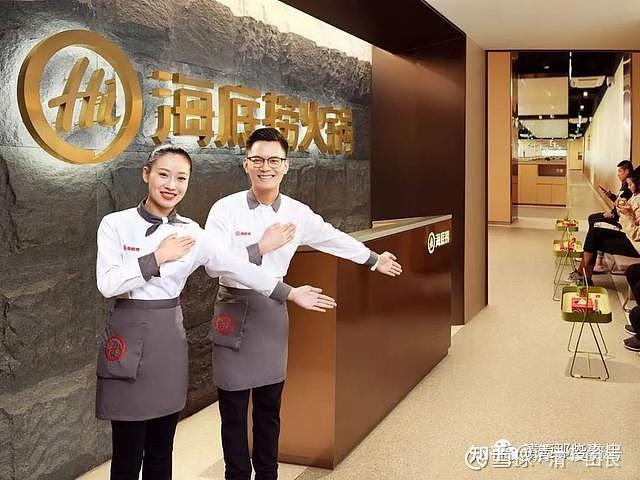
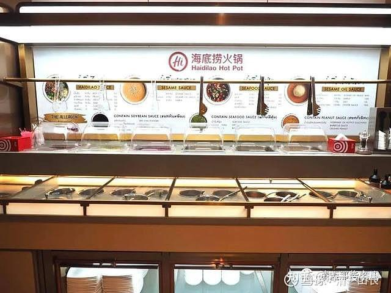
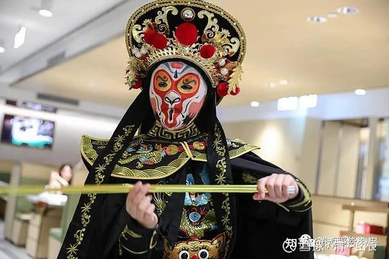

[原雪球专栏](https://zhuanlan.zhihu.com/p/584764784/edit)[197-2篇.“海底捞打工仔”用一周备考雅思，拿到两项满分！](http://link.zhihu.com/?target=https%3A//xueqiu.com/9310099567/196972979)

清一山长 2021年9月7日

我搜索了一下网络：雅思8分到底有多难？答案是：这个考试直接让英语母语的人来考，都不一定是8分，对外国人就更难了。很多专业培训师说：达到这个分数，需要特别的应试准备，必须有一些考试技巧。还说，实际上很多培训机构的雅思考试的英语教师，自己也都只能考7.5分，很少有能拿8.0以上的。

想知道这个雅思分数意味着什么？据我查看到的泰国排名第一的大学，录取要求是雅思6.5就过关了。泰国排名前三的清迈大学，雅思考试成绩只要求5.5就可以了。雅思8分，已经超过了牛津、剑桥一级大学的录取分数要求（这种世界顶尖学校要求7.5的成绩也就可以进去了），的确不简单。当然，英美的顶尖名校，除了7.5以上的雅思成绩，对其他科目，以及综合能力的考评，尚有要求，不是有7.5分就能入读的。因为名校的非成绩要求更高。但泰国前三的大学，只要有一个雅思成绩，一个高中毕业证，就能轻松入读了，别的没啥要求。其他很多海外大学都是这样的，所以，这就是一个大学的入学标准，英联邦大学以及很多现代大学的入学标准，就这么简单。不像中国，考个大学，几乎要脱几层皮！还要从小脱皮!

不过，如果让体制内的高中生来考雅思，估计要考脱的皮，就更多了。因为体制学校根本就不会教英语，只会把学生教疯掉。原来家长们依靠校外培训来维持一下英语成绩。现在校外培训取消了，家长们彻底熄火了。以后再来考外语，真要脱几层皮了。

所以，好心一点，为了让孩子心理健康一点，少受点罪，你们还是读新教育吧！起码考大学特别的容易，还都是名牌。而且，还不要钱，跟随示范班就可以了。

雅思8分，意味着听力8.5，阅读8.5，口语7.0，写作7.0才有可能实现总分8分。

一个从来没有参加过正规考试的学生，也没有经过培训机构传授考试技巧的学生，而且考前只有一周应试准备，能考过8分吗？

结果，还真过了。居然还拿了两项满分，这是一个不可思议的高分。这两个孩子，四项单项的成绩是：听力9.0分，阅读9.0分（两项满分），口语7分，写作7分。总分8分。如果口语、写作这个弱项，多去适应一下技巧，每项提高0.5分，总分就是8.5了。

阅读和听力9分，虽然也有人能拿到，但已经极其稀有了。业内都说，英语专八考90分或者翻译专业硕士，才有希望考到单项满分，——仅仅是一句话——有希望。总分满分，只是听说过，基本上见不到这种大神。今日学堂暑期多个孩子，考雅思都拿了高分。只拿了7.5的学生，都有点不好意思。其实也是很不错的高分了。

两个从未参加过正式考试的小毛孩，第一次参加考试居然就轻松过关，拿到了这样的成绩。说明中国家长真的不用太“内卷”了，别再用传统方式去应试了，孩子苦，家长也苦，真的犯不着。全家一起瞎忙，到处找中介，找培训机构，都是自己找抽的。花钱不少还白费功夫。不如就像这两孩子一样，从小快乐、轻松地学习，甚至从来不考试，也能拿高分，上名校。

为啥这两孩子能轻松应对这种高端的国际考试？很简单，因为他们从小就在今日学堂学习，现在高中快毕业了，要准备去海外大学，所以需要假期去考个证书拿着，准备申请海外大学用。肯定是海外名校无疑的——这两孩子几年前退学离开的同班同学，雅思只考了个6.5分，还考上了排名世界前100名的某英国知名大学（我都疑惑——原来海外名校这么容易上？比我们国内的985竞争难度低多了）。今日学堂多名手上拿着几乎接近满分的成绩单，这种优胜者，难道会进不了世界前100名大学吗？就看他们想不想去了。优秀大学生，也是各大学争抢的宝贵资源。

更神的是：这两孩子，暑假主要时间，是在海底捞打工。并没有“好好学习、努力”。实际上，打工两个月，可能还降低了他们放假前的语言实际水平，有点划不来。打工，是给高中部学生的暑期作业。由于今日学堂一向不在乎考试，我**更重视孩子们融入社会的能力。**所以孩子们也没把考试当回事，没想到第一次出手，就拿到了高分。假如真要努力一下刷分去，我相信刷到8.5是没啥难度的。

明年我们第一届正式的高中生，就要毕业了。大批的世界名校邀请书在等着他们，你们也等着看吧！看看榜单，也能了解今日的竞争力。保证是100%录取的，连我们最差的学生，也可以轻松考取不低于美国大学前100名的名牌大学。我知道：有人一直想看我们的笑话，不知道还笑不笑得出来？

下面转发家长的暑期记录和情况反馈：这是一个多年前就从加拿大反向留学，回国上今日学堂的家庭。今年也有多个海外家庭，放弃国外的留学优越条件，来我们土土的今日学堂上学。今年澳洲转学来的学生就有两个了，其他国家也有。有些家长自己是移民身份，也没有说明，所以我们的统计不全。我们也不在乎是哪个国家的学生。这说明今日的教学效果，肯定是远远优胜于海外的名校。不然这些高端家长，犯不着花费千万，好不容易取得移民资格后，又辛辛苦苦的把孩子送回中国来上学。不知道这对于一门心思就想出国的家长来说，是不是您该补充一点新信息了？

图片上是清迈的海底捞火锅店。我没进去吃过，只是看看。我觉得泰国的食物就很好，犯不着在泰国去追求**“中国情怀”。**

转发：

**通过体验“不好”，知道了什么是“好”**

乃中、乃天假期反馈

孩子还在学堂的时候，在电话中与他们沟通自己对于假期的规划时，孩子并没有说太多，后来发现其实是新教育浸泡过的孩子没有一般成年人那么多废的、虚的话，他们想好了决定了的事就是决定了，不动摇，也不会说太多，条理清晰，想法坚定，简简单单几句话，就是全部。

整个假期孩子主要做了三个方面的事情，一是到海底捞打工，体验做社会人；二是备考雅思；三是在家馆上课、搞活动以及各种分享答疑等。

**一、海底捞打工，体验做社会人**

**1、工作的辛苦劳累**

山长经常说，**如果孩子不愿意拥抱理想，就让他拥抱生活，不愿吃学习的苦，就让他去吃生活的苦**。这段海底捞打工，孩子们都着实体验了一把生活的苦。

刚开始前两天还好，半天培训半天岗位实习，转入正式工作后，很快迎来周末和五一假期，人流量相当大，一天脚不沾地工作15个小时，除了中途吃饭时稍作调整半个小时。尚未适应的孩子发来的信息用“累疯了”+一大堆感叹号来形容，打烊后整个人就如同被抽了筋、扒了皮，再无半点力气动弹。

当我问是打工辛苦还是做8个小时凤凰涅槃辛苦，孩子斩钉截铁地回答：当然是打工，做运动的累与这种累完全没法比。那神情，似乎这个问题很可笑。

**2、麻木，底层生活的代名词**

这次的打工经历，不仅让乃中、乃天从身体上体验到底层工作的辛苦与累，更从心理上有了对底层生活的更多认识与感悟。

当初为什么选择去上海打工，其中一个考虑是上海外国人多，有可能可以发挥他们的英文优势，但后来发现这个想法太天真，这种底层工作几乎可以用暗无天日来形容，整天呆在分不出白天黑夜的餐厅里，我去广州海底捞看过，孩子们忙得头都抬不起来，且不说压根没见到外国人来，估计就算真有外国人来，说英语或不说英语都已经不重要了，因为人已麻木了。

乃天说，海底捞工作时间长，晚上12点才下班也是正常，挣钱也是不容易，但这些人半夜下班后不休息，还经常花不少钱出去吃宵夜，太不划算。乃中、乃天他们只是来体验，对这种生活并不认可，而对于一直在底层的人生活的压力山大，出去吃个火锅、喝个啤酒是他们重要的解压方式。

麻木，是底层生活的代名词。乃中在那里打工了一段时间，发现他们之前订的计划，如到大学参观、休息时学习《与神对话》，周末小组讨论……诸如此类不知不觉泡了汤，反倒是在店长的威逼利诱之下参加了一次店里组织的春游，傻傻地在公园里坐过山车、划小船。

同事除了有时深更半夜放工后吃宵夜，剩下的生活就是玩手机了，不停地打、不停地打，同宿舍的人几乎不交流，只是埋头打游戏。乃天说，他看到他们除了工作、打游戏之外什么也不做、什么也不说，觉得很可怕，他们似乎一心要把自己变成一个什么想法、头脑都没有的机器人，而且现在也真的如愿以偿了，没有任何念想和打算，就这样活下去。

身体上的劳累尚可以随着适应力的增加而逐步减弱，但倘若心理上也逐步“适应”麻木，那就温水煮青蛙，悲剧了。

**二、裸考托福、雅思**

孩子在家进行了托福和雅思的备考，备考前，我问孩子是否需要什么支持，都第一时间谢绝了，明确表示不需要。在疫情期间，他们曾经网络试听过一次一个非常大牌的名师讲课，费用不菲，但还没有听完他们就听不下去了，第一太多废话，第二号称美国藤校毕业，但老师的英语水平不敢恭维，发音不标准不说，单词量低，教学生的单词自己有些不会说，上课用中文讲课，孩子推测这个老师之所以牛，可能是因为他所有的心思都放在怎样帮学生考试提分上了。

每个考试大约准备了一个星期，都是他们自己找资料、自己准备，熟悉题型，做一些真题，大致心里有了一个底，就去参加考试了。

先考的是托福。出发的路上，孩子微笑着说，好像第一次参加正规考试，我才猛然意识到孩子上学这么多年，除了在今日参加过SAT模拟考试之外，的确是从来没有参加过任何考试。

考试并非一帆风顺。考试分两节，上午考听力、阅读、写作，考完他们已经知道了听力分数，很不理想，一个扣了4分，一个扣了6分，问原因，是因为速度太快，而他们之前的策略是听力有优势，想听清楚每一个细节，争取不丢分，结果只专注在听上，没有做记录，做题时发现信息点太多不记得了，只能硬着头皮瞎选。弄清楚问题所在，下午继续口语考试。最后两人托福分数105、107。

后面考的雅思，基本与预期差不多，听力和阅读满分9分，口语和写作主观性更强，他们并没有花时间摸这些套路，都是7分，平均分8分。

在这里写这些细节不是想说两个孩子的考分高，清一大学少年班类似成绩以及更好成绩的同学有很多，只是真实展现孩子的考试情况，让家长们更多地看到新教育对于学习以及方方面面求真务实的严谨态度，在现在这种浮躁功利的社会中，能够坚持这样做教育多么难得。

我观察两个孩子的学习，发现他们已经培养了主动反思、不断总结优化学习方法的习惯，更注重提高英语真实水平和能力。为什么孩子能主动拒绝名师、大腕帮助提分的诱惑，不掉坑？这得益于今日对于孩子们一贯的培养，**凡事围绕其本质目的而展开，而非急功近利**。这样的教育不会破坏孩子对于学习的态度，孩子会将心放在琢磨、提升学习本身上，这样的教育在孩子身上沉淀下来的才是真本事。

很多教育机构靠刷题把成绩拉上去，孩子考进清华、北大或者美国名校，结果因空心病、不适应而自杀的、杀人的，太多了。正如山长所说，家长抱着让孩子读海外大学的目标来读新教育，是肯定没问题的，是正选。

**三、在家馆上课、分享交流**

这次回来最大的感受是孩子的思想比一年前明显独立和成熟了。他们其实很长时间在思维和表达上偏弱，老师曾与我反馈两个孩子中文表达速度慢，但随着在今日思维训练的长期累积，他们说话的速度偏慢的情况不再突出，不疾不徐，更像是带着觉知或思考。在与家长交流的时候，不少问题都是非常尖锐的，乃中、乃天会从自己切身感受来回答，既表达出新教育的宗旨，也能体现出独立思考和个人特色。

孩子近两年学习思维后，有了明显的不同，然而，对于新教育最宝贵的思维和心性教育，很多家长却视若无睹，尤其是已经搭乘上直通车，却因为急功近利、短视，入宝山却空手而归，甚至闹出买椟还珠的笑话。

**四、迈向成年的教育刚需：吃苦受累、自我负责的真实体验与实践**

2021年的暑假时间不短，对比孩子在家馆给学生上课、在海底捞打工和在家学习三种情况，孩子收获最大的一定是海底捞打工。作为家长整个过程中观察也好、与孩子相处也好、交流也好，最大的感受就是：山长的方向太对了，孩子太需要这种吃苦受累、自我负责的社会体验与实践了！

乃中、乃天去上海之前带着对未知和社会的好奇与兴奋，有点跃跃欲试的感觉，而回来后，明显踏实了很多，宁可老老实实呆在家里学习。为什么？就是因为亲身体验过了，通过体验不好，知道了什么是好。

乃中、乃天说，之前一直是在象牙塔中，很有安全感地被保护、呵护着，这次出去突然发现自己的角色不再是学生，而是社会中的一分子，没有人关心你、在乎你，你得为自己的一切负责任。孩子自己切身感受是截然不同的，是直接入心的，好过我们家长讲一千说一万。

清迈海底捞的员工表演川剧变脸——伺候好食客，真的很不容易。

**评论回复：**

[左右逢源的源源](http://link.zhihu.com/?target=http%3A//xueqiu.com/n/%25E5%25B7%25A6%25E5%258F%25B3%25E9%2580%25A2%25E6%25BA%2590%25E7%259A%2584%25E6%25BA%2590%25E6%25BA%2590)回复[清一山长](http://link.zhihu.com/?target=http%3A//xueqiu.com/n/%25E6%25B8%2585%25E4%25B8%2580%25E5%25B1%25B1%25E9%2595%25BF)：

体制内教师深感惭愧，三年小学、三年初中、三年高中，九年的英语学习孩子不能用英语流利的交流[哭泣]。

[清一山长](http://link.zhihu.com/?target=https%3A//xueqiu.com/9310099567)[2021-09-07 17:48](http://link.zhihu.com/?target=https%3A//xueqiu.com/9310099567/196982366)回复[左右逢源的源源](http://link.zhihu.com/?target=http%3A//xueqiu.com/n/%25E5%25B7%25A6%25E5%258F%25B3%25E9%2580%25A2%25E6%25BA%2590%25E7%259A%2584%25E6%25BA%2590%25E6%25BA%2590)：

所以，国家教育部门正在取消体制内学校英语的地位，是很明智的。学不好的科目还学啥？原来的外语，学校是教不出来的。家长们主要靠校外培训。现在校外培训也没了，将来想要学好英语，就只能“拼爹”了，要考爹妈的家庭教育了（我就在家教小女）。以后要出国留学，就更难了。支持国家的政策，全民学外语，真没啥好处[鼓鼓掌]。

[周河川](http://link.zhihu.com/?target=http%3A//xueqiu.com/n/%25E5%2591%25A8%25E6%25B2%25B3%25E5%25B7%259D)回复[@清一山长](http://link.zhihu.com/?target=http%3A//xueqiu.com/n/%25E6%25B8%2585%25E4%25B8%2580%25E5%25B1%25B1%25E9%2595%25BF)：

假期和孩子待在一起将近三个月，孩子的英语发音非常纯正，虽然我听不太懂，但是在孩子看纪录片（BBC海洋生物类）过程中，我随机抓取仅能听清楚的尽量模仿解说员的一些单词想考察孩子是否能听懂，基本上孩子都能知道单词意思，并且每个单词发音都要重新给我纠正一下[捂脸]，所以一年的国际今日新教育英语突破班学习，让我们家庭更加确信，新教育的英语学习效果非常给力，现在孩子今年9月份进入挑战班就读，将根据学校的规划进行阅读、思维与演讲学习训练，相信一年后又将会在思维等方面有新的突破，新教育体系价值无限[牛][牛][牛]

[清一山长](http://link.zhihu.com/?target=https%3A//xueqiu.com/9310099567)[2021-09-07 18:56](http://link.zhihu.com/?target=https%3A//xueqiu.com/9310099567/196989479)回复[周河川](http://link.zhihu.com/?target=http%3A//xueqiu.com/n/%25E5%2591%25A8%25E6%25B2%25B3%25E5%25B7%259D)：

今日家长[赞成]。

你儿子今年进入的国际今日挑战班，就是今日学堂的【**二年级示范班**】，明莉校长亲自带班的。你以后每周都可以在B站的视频上看到儿子了。

明年的课程更有意思：是要用一年来学完美国12年级的全部课程，数理化全科！学完一年之后，马上就参加美国高考，不做考前训练，熟悉一下题型就开考，当做他们示范班的毕业考试。要求学生的成绩必须全部达到美国高中毕业的大学入学基准线。这样才算实现了【**三年学完美国十二年课程**】的任务。听起来就不像真的，是吧？你是家长，要骗你马上就得到验证的，没谁这样傻的。

我们说的三年学完十二年，前两年根本不学任何课本，任何课程，只是打语言和思维的基础。第三年才开始，从头学习美国原版教材，一年就可以学完12年的教材。如果第一年，我们就用美国一年级的课本来学，学生会学得很吃力的（毕竟是母语课本，外国小孩哪里懂？）。但全世界的国际学校，就都是这样瞎搞的。巨大的浪费了孩子们的学习天赋。

我们等第三年才开始正式学习课本，小孩子就会觉得：这些美国课本，怎么这么弱智？一天就学完一个年级了。我估计学完小学六年的教材，最多两三周就结束了，而且成绩还很优秀。中学部分开始慢一点，估计三个月？高中最慢，需要9个月。但最终一年就可以达到美国大学入学基准线。最差的学生，也必须达到入学基准线，这就算是很好的成绩了。（当然，要得到高分，比如SAT 1400～1500分，就要继续再用一年的时间，来开始提高深度了），就算在美国，也只有1%的学生能够达到1400分以上。

其实，我也可以用一样的方式，来学中国的K12。我也可以让学生三年就学完体制的12年，不过这样宣传出来，有点打脸教育局，所以，我们还是打脸美国算了。以外国人的身份，来学母语的课程，这绝对是创造了世界奇迹。你作为示范班的家长，可以见证这个奇迹，发生在你儿子身上！[加油]

[周河川](http://link.zhihu.com/?target=http%3A//xueqiu.com/n/%25E5%2591%25A8%25E6%25B2%25B3%25E5%25B7%259D)回复[清一山长](http://link.zhihu.com/?target=http%3A//xueqiu.com/n/%25E6%25B8%2585%25E4%25B8%2580%25E5%25B1%25B1%25E9%2595%25BF)：

从经历孩子用新教育的“婴儿学习法”一年可以学习完七部电影、《新概念英语》一、二（跟读、理解、表演）达到非常好的纯正的英文口语交流结果看，等今年学完思维、演讲等课程，明年的K12课程我完全相信这个规划将在我孩子身上得到验证，打败美国人绝对不是骗人的噱头[加油]，同时也非常荣幸可以在今年示范班的直播展示中继续看到以明莉校长带队的“明师荟”新教育的高价值课程，并且哔哩哔哩直播及视频中还会有我的儿子的身影[大笑]，听明莉校长说今年的开学第一课还是由山长您亲自授课的，真的是惊喜不断啊![鼓鼓掌][鼓鼓掌][鼓鼓掌]

[清一山长](http://link.zhihu.com/?target=https%3A//xueqiu.com/9310099567)[2021-09-07 21:47](http://link.zhihu.com/?target=https%3A//xueqiu.com/9310099567/197004199)回复[周河川](http://link.zhihu.com/?target=http%3A//xueqiu.com/n/%25E5%2591%25A8%25E6%25B2%25B3%25E5%25B7%259D)：

昨天我给国际今日讲了开学第一课，晚上给清一大学讲第一课。今天给清一塾讲开学第一课。忙坏了。不过，我讲的第一课，不对外公示。明莉校长的第一课，才对外。我讲的技术细节，内部管理，学生的心理调整等内容较多，不适合对外[笑]。你们就只能等明莉老师的，公开出来的【示范班第一课】吧！会很有价值的[献花花]。

[船长Dion](http://link.zhihu.com/?target=http%3A//xueqiu.com/n/%25E8%2588%25B9%25E9%2595%25BFDion)回复[清一山长](http://link.zhihu.com/?target=http%3A//xueqiu.com/n/%25E6%25B8%2585%25E4%25B8%2580%25E5%25B1%25B1%25E9%2595%25BF)：

教育不是为了赚钱，不应该是纯粹的商业行为！道长何不把您教学理念最精华的部分分享给大家，利益天下众生！

[清一山长](http://link.zhihu.com/?target=https%3A//xueqiu.com/9310099567)[2021-09-07 22:44](http://link.zhihu.com/?target=https%3A//xueqiu.com/9310099567/197010064)回复[船长Dion](http://link.zhihu.com/?target=http%3A//xueqiu.com/n/%25E8%2588%25B9%25E9%2595%25BFDion)：

1、免费，公开分享了这么多，你还嫌不够？[为什么]

2、内部课程都公开直播了，还嫌不够精华？我藏着生子吗？[为什么]。“最精华”的是啥？一头猪，奉献出自己身上的全部肉出来给人吃。你说：猪身上的肉，哪一块不是好肉？你到底喜欢吃哪一块呢？猪蹄不好，还是猪头不好？还是猪肚子不好？反正“猪”已经倾情奉献给您了[大笑]。

[安全边际k](http://link.zhihu.com/?target=http%3A//xueqiu.com/n/%25E5%25AE%2589%25E5%2585%25A8%25E8%25BE%25B9%25E9%2599%2585k)回复[@宋建广](http://link.zhihu.com/?target=http%3A//xueqiu.com/n/%25E5%25AE%258B%25E5%25BB%25BA%25E5%25B9%25BF)：

我没看文章内容，观看这个标题就已经吹是标题党。清一山长[2021-09-07 23:48](http://link.zhihu.com/?target=https%3A//xueqiu.com/9310099567/197015017)

清一山长回复[安全边际k](http://link.zhihu.com/?target=http%3A//xueqiu.com/n/%25E5%25AE%2589%25E5%2585%25A8%25E8%25BE%25B9%25E9%2599%2585k)：

只看一眼题目，你就敢直接下结论，你这人也太高级了，崇拜！神人，难道你就是？你才是传说中的标题党人？[大笑]既然你如此神机妙算，敢跟我对赌一把吗？我文章所说，无一不是事实，无一不有人证、物证。连两孩子的人名都是真名。如果你认为不是，给你一个发财的机会。就跟我对赌好了，找公证人现场验证。赌一赔二，想赌多少，我都奉陪。你真有本事，就让我赔光吧？如何？[大笑][大笑][大笑]

[知而行dyp](http://link.zhihu.com/?target=http%3A//xueqiu.com/n/%25E7%259F%25A5%25E8%2580%258C%25E8%25A1%258Cdyp)回复[@卢嘉仪](http://link.zhihu.com/?target=http%3A//xueqiu.com/n/%25E5%258D%25A2%25E5%2598%2589%25E4%25BB%25AA)：

是啊！今日免费的、公开的示范班，有多少人会珍惜！能拿走一点，价值就无可估量。我家俩儿子，跟学示范班一年，学完七部电影，基本达到了六七八九级的标准。一个小时左右，就能写出一两千字很像样的电影观后感或者学习心得体会。老大第一档进入清一塾，老二第三档进入今日。

当年花高价买了省会城市985大学附属小学的学区房，儿子回报了我一个年级倒数第一。跟学免费的示范班，取得上述的成绩。山长呕心沥血创办的新教育，改变了这个“学渣”孩子的命运，也改变了我们家庭的命运！价值，该如何衡量？

清一山长[2021-09-08 13:35](http://link.zhihu.com/?target=https%3A//xueqiu.com/9310099567/197077190)回复[知而行dyp](http://link.zhihu.com/?target=http%3A//xueqiu.com/n/%25E7%259F%25A5%25E8%2580%258C%25E8%25A1%258Cdyp)：

又是我们的家长。[赞成][笑]。还两孩子都送进来了？还一边一个？你要把别的家长羡慕死的，今年300多人申请，大多数都落选了，你家还两个都上了，别的家长怎么想[俏皮]。不过——你存心在家里制造内战呀！一边一个。不知道今日塾和清一塾互相PK，两边打得不可开交吗？[大笑]。很高兴免费的示范班，让你的孩子也获得了比花钱上学更好的收益，从倒数第一到正数第一档。就是有一点不解：免费示范班你们家跟学效果这么好，而且还将继续下去，我们继续提供新的一年的免费示范。继续跟学不就得了？干嘛不继续场外跟学免费的示范班？非要花钱送进去？难道真是钱多了，没地方花吗？钱多，家长就可以偷懒请老师代管。钱少，家长努力一点跟课就行了，效果也不差的，更适合普通家庭。看来你们家“不普通”，到底是买学位房的[加油]。

[国学中医黎天焕](http://link.zhihu.com/?target=http%3A//xueqiu.com/n/%25E5%259B%25BD%25E5%25AD%25A6%25E4%25B8%25AD%25E5%258C%25BB%25E9%25BB%258E%25E5%25A4%25A9%25E7%2584%2595)回复[清一山长](http://link.zhihu.com/?target=http%3A//xueqiu.com/n/%25E6%25B8%2585%25E4%25B8%2580%25E5%25B1%25B1%25E9%2595%25BF)：

山长的“家长为啥非要花钱送孩子进今日/清一”这个问题，其实很多家长也不一定讲得清楚。我家孩子的经历可以说明其中的一个原因，就是孩子的心理行为怎样调整，这方面很多家长是不懂的，懂的也是把握得不好。今年初孩子进入行知学堂，十一岁半才进入新教育有点晚，一开始就经历了两次试读和两次分流淘汰，然后到了行知预备班经过老师对心理行为的调整，经过运动和做事的训练，两个星期以后就唤醒了孩子的初心和梦想，就这样，一个冬令营排名末尾的学生一步一步的快速突破自己，在后面备考今日的冲刺阶段，孩子用6天时间完成了第三部英语电影，然后踏上了清一塾的征程，四周的试读营让孩子成长更大，最后以第三档录取了。如果当初孩子在行知分流我们就放弃了或者带回家自己跟学，这情况就肯定不同了。

清一山长[2021-09-08 16:09](http://link.zhihu.com/?target=https%3A//xueqiu.com/9310099567/197101211)回复[国学中医黎天焕](http://link.zhihu.com/?target=http%3A//xueqiu.com/n/%25E5%259B%25BD%25E5%25AD%25A6%25E4%25B8%25AD%25E5%258C%25BB%25E9%25BB%258E%25E5%25A4%25A9%25E7%2584%2595)：

你也做了新家长[加油]。“孩子用6天时间完成了第三部英语电影”——这速度够惊人的[献花花]。真不敢相信。孩子们其实潜力很强，家长不引导，只是逼孩子学习的话，一年也学不完一部的。**学堂的教师的价值，就是引导。但家长的价值也必不可少。孩子没退路，就往前冲，速度就很快。孩子有退路，就会装死狗！你们家孩子最后一名就是装死狗。孩子很懂得如何对付家长**[大笑]。

参考链接：

[【清一大学少年班】走进我们的日常生活](http://link.zhihu.com/?target=https%3A//www.bilibili.com/video/BV1Hr4y1K769)

[这就是今日学堂](http://link.zhihu.com/?target=https%3A//space.bilibili.com/487498588/channel/detail%3Fcid%3D149241)

[今日明师荟](http://link.zhihu.com/?target=https%3A//space.bilibili.com/487498588/channel/collectiondetail%3Fsid%3D55359)

[清一大学武医学院](https://www.zhihu.com/people/mkaga)

[清一投资号：86篇.知识权力时代，教育战决定胜负!](https://zhuanlan.zhihu.com/p/566819841)

[清一投资号：46篇.新教育送给中国人的礼物——中国公主](https://zhuanlan.zhihu.com/p/553173076)

[清一投资号：47篇.如何用三年学完十二年的课程？](https://zhuanlan.zhihu.com/p/547313287)

[清一投资号：56篇.创造历史的清一大学：首届学生集体合影](https://zhuanlan.zhihu.com/p/551968023)

[清一投资号：65篇.在泰国过春节：请300个大学生吃饭](https://zhuanlan.zhihu.com/p/554009396)

[清一投资号：66篇.如何鉴别优质教育](https://zhuanlan.zhihu.com/p/560659119)

[清一投资号：136篇.转美国教育的⼋宗罪！中国学校会不会更甚之？](https://zhuanlan.zhihu.com/p/581920937)

[清一投资号：143篇.建立中国人自己的平台，才能真正获得尊重和地位](https://zhuanlan.zhihu.com/p/584741008)

[清一投资号：144篇.教育投资也需要算账：别血本无归！](https://zhuanlan.zhihu.com/p/584742375)
