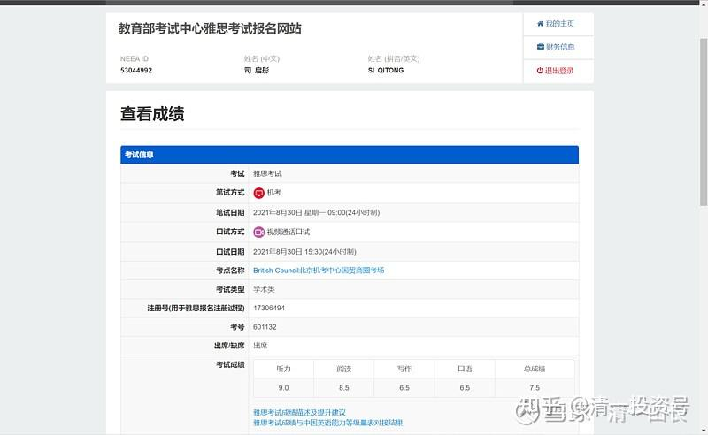
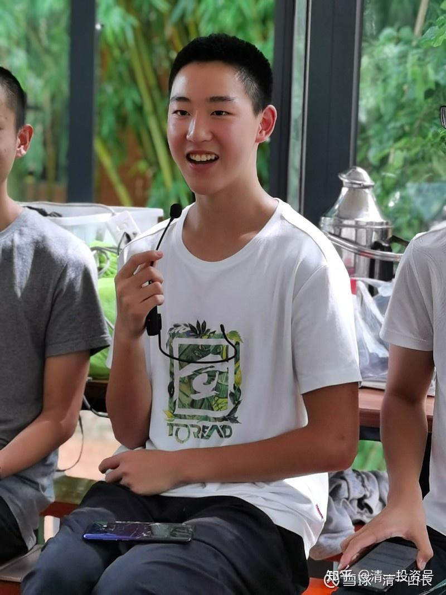

[原雪球专栏](https://zhuanlan.zhihu.com/p/584764784/edit)[198篇.北京年轻打工仔，一周备考拿到雅思单项满分](http://link.zhihu.com/?target=https%3A//xueqiu.com/9310099567/197134494)

清一山长2021年9月9日

雅思考试成绩单是这样的：

以上的成绩单，是一个北京籍的今日学生，暑假在北京[海底捞](http://link.zhihu.com/?target=https%3A//xueqiu.com/S/06862%3Ffrom%3Dstatus_stock_match)等打工，打工完后，开学之前花了一周时间备考雅思，就拿到的成绩单。你们可以看到，其中拿了一项满分——听力9分，阅读是8.5分，接近满分。总分7.5分。可惜他的口语和作文都亏分严重，只要这两项，有一项多半分的成绩，他就是8分的总分了。也就是说，多准备一下题型，刷刷题，写写作文，准备一些对话的话术，就够刷高分了。只是这些小孩，都不愿意在备考上花时间，也不愿意去培训站咨询专业的备考指导。就是自己找资料，简单学习一个星期，就上去考试了。而且是在他们辛苦打工三个多月，这段时间根本就没学外语，整体的学习状态肯定有所下滑。这个北京考生，除了在海底捞的工作之外，还去一家高级白领单位——一家北京律师行工作了一段时间。对职场的了解，比一般人更深入。北京的家长能量高，很容易给孩子安排各种实习机会。

这孩子是大概7～8年前，放弃了北京名校入读的机会来今日的。学生很特别的一个地方，就是这孩子的家长，跟人大附中的校长是私交好友。这孩子要上人大附中，这个北京人挤破了头都进不去的地方，是很容易的。北京的国际名校也很多，家长的经济条件也很好。想上什么学校都很容易。但家长为什么要把儿子和女儿，都送来偏远的今日学堂学习？远离“文化教育之都”，远离温馨的家？这个自己也是名校毕业的家长，是不是疯了？家长的脑子不正常吗？

更令人纳闷的是，家长朋友的孩子，看了他们家孩子的变化，也要离开北京来今日上学了。原来是一个很高级的国际学校的优等生，来今日夏令营一个月之后，就坚决要求转学离开北京，来上今日学堂。校长亲自出面挽留，表示愿意为他改变原有的学习模式，开小灶学习今日的方式，居然都没有效果。这孩子，今年也开始进入今日高中学习了。他的离开，对他原来的学校是一个很大的震荡——居然有从这么高级的北京国际学校，去一个遥远的边城上学的傻瓜？

这些首善之都的家长，难道都没有见识吗？他们见到了什么在北京见不到的东西？非要来遥远的今日学堂上学？

下面的文章，就是这个学生的家长，写的假期观察记录。你们可以研究一下，看家长像是一个不会思考，不会判断的人吗？家长的文章后面，是孩子自己写的假期记录。我觉得有趣的是：他居然根本就不提去如何准备，如何去参加雅思考试，并取得好成绩的事情。似乎假期就没发生这件事情。暑假记录中，相反写了大量不这么高大上的，[海底捞](http://link.zhihu.com/?target=https%3A//xueqiu.com/S/06862%3Ffrom%3Dstatus_stock_match)当打工仔的工作细节和思考。可见这帮孩子对考试以及成绩，实在是“太不重视”了。

**转发：家长记录学习是世界上最棒的事！**

——司启彤社会实践花絮（本文是家长写的暑假记录，后面有本人自己的暑假记录报告）

照片是文中的学生司启彤，暑假后跟同学一起，与家长交流暑期心得。

2021年夏天，司启彤第一次走上社会，像所有成年人一样，找工作、挣工资、养活自己。

他选择了[海底捞](http://link.zhihu.com/?target=https%3A//xueqiu.com/S/06862%3Ffrom%3Dstatus_stock_match)，以“服务好”和“服务员累”著称的连锁火锅店。去之前，我担心司启彤毛手毛脚被火锅烫着，司启彤说不会的，海底捞每个岗位就只干这个岗位的事情，火锅是由锅底师傅端的，上菜就是传菜员，洗碗都是洗碗机，所有菜品是清晨从外面切好了统一配送。我问他，那厨师干什么？说厨师只做员工餐，并且要求极高。有人盯着摄像头，摄像头盯着厨房，如果炒完一个菜没有刷锅，就要扣钱。我听着，管理得真不错。

[海底捞](http://link.zhihu.com/?target=https%3A//xueqiu.com/S/06862%3Ffrom%3Dstatus_stock_match)在北京有70多家店，因为用人量巨大，有自己的员工培训中心。司启彤和另三位同学相约汇合在培训公司时，司启彤爸爸担心孩子们被骗，还陪着过去了。后来发现，海底捞真的很靠谱。没有坑，不代表和孩子们想象中一样，当孩子们吐槽体检过于草率与昂贵时，我们觉得这都是常态，没啥可抱怨的。可再一想，**我们活在脏水里，已经习惯了！**哪脏？不脏啊！

司启彤和同学们三天培训后，[海底捞](http://link.zhihu.com/?target=https%3A//xueqiu.com/S/06862%3Ffrom%3Dstatus_stock_match)各个店长来培训的地方挑人，司启彤因为只能打短期工，年龄又小，在用人市场上根本没有优势。第一天竟然没有被挑走，这让我们非常意外。我还很天真地问他，你的英语特长对找工作有帮助吗？他毫不犹豫说：“一点儿都没有”“端盘子不需要英语，也不需要任何本领，只要是女生就行了”。原来如此。当天晚上，司启彤的伙伴接到了另一家海底捞店长的电话，问他们愿不愿意来他们店，说他们店很好，在清华大学旁边。我查了一下，这个旁边要十多公里。当然这并不影响孩子们听到有人要他们后的欢欣鼓舞，马上决定过去上班。三天后，他们又介绍了两位他们的同学到店。就这样，四位北京组的同学成功扎堆儿在北京海底捞。另外几位同学，分布在北京的各个商圈，相距甚远。之前他们约定的：同时休息、逛大北京城的想法，一次都没有实现过。当所有同学在海底捞实习结束时，他们一起扎堆儿在了某一家海底捞，作为海底捞的前员工，用员工的半价吃了一顿海底捞，享受了一次海底捞的服务，作为对这段经历的告别。

司启彤、林子煦是整个店里有史以来唯二的两个北京人。他们和所有人说，家里不给零花钱，来[海底捞](http://link.zhihu.com/?target=https%3A//xueqiu.com/S/06862%3Ffrom%3Dstatus_stock_match)是来挣钱的。大家都很理解他们，虽是北京人，估计也是没房子没背景，一样也要做体力活、打工赚自己的零用。海底捞对员工很好，管吃管住。住的地方自己什么都不用管，有阿姨打扫房间。自从司启彤从家里搬去了集体宿舍，我与他交流的话题也从过去的不食人间烟火，到接地气的“一天工作多长时间”、“都干什么”、“累不累”到“一天工资多少钱？”俗不可耐不说，过去我们秉承的价值观也灰飞烟灭了。

过去我们说要做经营者，付出者。既是付出者，哪有什么高低贵贱，记得以前，想到今日学堂做饭的人，都是排着队的。更是从没听说谁会瞧不起在学堂做饭多年的大姨、二姨。

“活着就要多做事，怎能闲着？”这样种了十年当经营者、建设者的价值观，仅在司启彤在[海底捞](http://link.zhihu.com/?target=https%3A//xueqiu.com/S/06862%3Ffrom%3Dstatus_stock_match)打工的第一周，就破灭了。

每个新人进到[海底捞](http://link.zhihu.com/?target=https%3A//xueqiu.com/S/06862%3Ffrom%3Dstatus_stock_match)，第一周都需要轮岗，各个岗位都要干一遍，领导也知道该怎么把这些不同的人分到最适合的岗位。司启彤第一天上岗，做传菜员，每次传一个大盘子，上面放着10来个小盘子，传菜员把一个大盘子的菜从后厨传到餐桌旁，放下每一个小盘子，然后把空的大盘子传回到厨房，这算一个工作流程，传一个大盘子的计件工资是4毛钱。如果一天想赚到100元钱，要传250个大盘子。哦，我的天，算完我的眼泪就下来了。我儿子那细胳膊，原是该打太极的胳膊，现在却在端盘子。任谁还能对娃说：“不怕苦，不怕累，多干点儿”。反正我是没说出口。

问他怎么计件，说每端出一大盘菜时，要刷一下工卡，证明你干活了，每天汇总，即时反馈你传了多少次菜。我和孩子都会发现，我们恪守的价值准则，是有适用范围的，你没法跟拿计件工资的人说，你要建设，你在经营。被生存境况压倒的人，多劳多得已是最大的公平。

传菜员的工作属于后堂，因为不用和客人打交道，适合能吃苦的老实人，但不符合司启彤他们打工的目标。他们之所以选[海底捞](http://link.zhihu.com/?target=https%3A//xueqiu.com/S/06862%3Ffrom%3Dstatus_stock_match)打工，就是因为能见到不同的人，能锻炼他们的沟通能力、服务能力、识人能力。所以司启彤把自己的岗位目标定在了前堂，服务员、迎宾都属于前堂，可以学习怎么和人（顾客）打交道的。

[海底捞](http://link.zhihu.com/?target=https%3A//xueqiu.com/S/06862%3Ffrom%3Dstatus_stock_match)正常的工作时长是12小时，这12小时里，基本只有一两个小时休息，其他时间都是紧捯着腿，还要保持高度警觉，在前堂工作的人，还要时刻保持笑容，对顾客亲的呀，见谁都是喜相逢。第一周，基本上可以想象，司启彤作为新人的狼狈。用他的话说：“不出错是不可能的。”海底捞服务手册中，客人进店后，有27道流程，包括热情的说“你好”，给装口罩、手机的塑料袋，戴眼镜的客人要送上眼镜布，给孕妇送靠垫，给小朋友送玩具等，规定非常细致。如果你忘了哪道流程，你的“担当”（主管，一个“担当”可以负责十张餐桌。）会马上过来给你补位，送上的热情和做事的麻利程度，你一下就能分辨出来，为你服务的是小弟，“担当”才是大哥。司启彤和另三位同学们，就在大哥们的照应带领下，慢慢进入了状态。

第一周还没过完，司启彤就被分到了夜班组。我问他为什么会分到上夜班，他说夜班轻松一些，虽然一样是工作12小时，但晚上客人少，走路的压力小一些。呵呵，他是平足，每天站12个小时，确实挑战。但我不满意他给的理由。我们好歹在今日呆了快10年，做经营者的信念咋能这么快就坍塌呢？还哪个容易挑哪个？我不高兴了。可我也没啥办法，司启彤一周回家一次，进了家门就是上楼睡觉，窗帘都不拉，也能进入沉沉的梦乡，真的是：太累太累了，累到话懒得说，饭懒得吃；赚钱那么辛苦，却要在休息那天早上花170元打车回家，就为了能早一个小时到家睡觉。后来我也弄明白了，并不是他自己选的夜班，而是被夜班主管挑了去，新来的、男的、年轻的、做事也认真踏实的，话说这主管还挺有眼光的。司启彤说他知道没人喜欢上夜班，但是夜班很缺人，反正白天还是晚上，在店里也没什么区别，被安排了就服从。这点我点了赞，也知道他说夜班轻松也是安慰自己、安慰我们罢了。真实的情况是：夜班人太少了，司启彤每天从凌晨4点客人走光后，开始善后，他的工作是：清理饮料机、收碗碟、擦锅圈（锅圈嵌在桌子里，是放火锅的地方），其他还好，这个擦锅圈，绝对给他造成了阴影，据说每天清晨，他都是强忍着睡意，用右手猛力擦锅圈当中过来的，全店的锅圈，他一个人，要擦4、5个小时。我在心疼他手的同时，也升起了敬意。

这个夏天，在[海底捞](http://link.zhihu.com/?target=https%3A//xueqiu.com/S/06862%3Ffrom%3Dstatus_stock_match)打工期间，司启彤常说：“真是很奇怪，学习怎么还会累呢？学习真的是太轻松了，全程可以坐着，还有书可以读，还有比这更好的事情吗？”

他还常说：“说得容易，你去试试就知道了”。

我才不要试！但我试着更多的理解他。

我知道他没办法做到：如此辛苦，还爱上工作；黑白颠倒，还要陪伴家人；我知道他有情绪，天天低声下气甚至谄媚逢迎，一不小心就犯错挨骂。我也知道他懊恼自己，想读的书，都没有读，想做的事，也没有做，以为自己是与众不同的人，但真到了真实社会中，自己啥都不是。

还好这只是个社会实践，并不是真的。但提前体会一下所谓理想和那个理想的自己的破灭，也是好事。司启彤在[海底捞](http://link.zhihu.com/?target=https%3A//xueqiu.com/S/06862%3Ffrom%3Dstatus_stock_match)工作一个月的时候，已经能独立看三张桌子了，他说也开始要用脑子统筹规划了，他还曾经得到了店里50元的现金奖励，还得到了顾客在公众号里的感谢，说下次还要找司启彤小哥哥为他们服务，这些，他会发截屏给我们，也会觉得获得了奖励和认可。我看到，虽然海底捞服务员，与他的志向和理想相去甚远，但即使只能是海底捞服务员，他也能本分踏实的把事情做好。

最好的是：这只是个体验，而不是一辈子。

假期的最后，司启彤和几位同学与恒大的邻居清粉们交流了一次，其中有位家长问：“你有没想过，如果今日学堂取消了哪些活动，你会离开学堂？”司启彤脱口而出：“如果学堂没有了运动、读书、学习和伙伴，我会离开学堂。因为这些是我在学堂收获最大的事情，都没有了的话，学堂也就不是学堂了。”

原以为这是很难回答的问题，今日的孩子，不是都很怕离开学堂的吗？但是司启彤那么迅速而自然的回答，我知道，他不是爱学堂的“名”，未来最好的学校；他爱的是今日的“实”，老师、伙伴、阅读、运动，这是他每天实实在在在做的事情，他爱的是这样的生活。

以上，作为这个夏天的——纪念。

胡迎莹

2021年9月3日

**司启彤**

我的假期一共打工了接近三个月。前一个半月在北京的[海底捞](http://link.zhihu.com/?target=https%3A//xueqiu.com/S/06862%3Ffrom%3Dstatus_stock_match)做服务员，后一个半月在我爸朋友的软件公司做运营。剩下一个月的假期有一周在备考，剩下三周就是宅在家里或者旅游。

在这个总结中，主要是很主观地总结我在[海底捞](http://link.zhihu.com/?target=https%3A//xueqiu.com/S/06862%3Ffrom%3Dstatus_stock_match)及公司工作的经历和收获。

**一、海底捞打工**

**1.个人工作情况**

我在[海底捞](http://link.zhihu.com/?target=https%3A//xueqiu.com/S/06862%3Ffrom%3Dstatus_stock_match)的经历跟别人并没有太大的不同，但待遇情况会好一些。首先是我被分配到了夜班，而夜班工作量比白班要低很多，所以没有白班那么忙和累。其次就是夜班的休假是休两个白天一个晚上（跟白班的两个晚上一个白天正好相反），所以除睡觉之外的休息时间会更多。最后还有一个非常重要的原因，就是我比较讨我们值班经理喜欢，所以收尾工作相对简单。

夜班晚上9点集合，正常情况下在11点之前是高峰期，在12点到2点也是高峰期。2点吃完饭后，基本只需要1到2个人负责简单的看台，其他人立刻进行大收尾，一直到8点左右，然后我们的值班经理就会过来开会、做培训，或者批评，最后早上9点左右下班。

下班之后，所有的同事都会赶紧走回宿舍，躺在床上玩王者或者看电视剧，一直到下午2点左右再睡觉，一直睡到晚上八点干活。我一般会骑车去周边的公园逛逛，10点半回去，然后刷刷手机看看电影，12点左右就睡了。

在休假日，大部分员工就是躺在床上睡觉，把白天晚上连在一起睡，第二天白天再去见见女朋友，见见朋友等。

虽然整体并不是很累，尤其是我们店的夜班当时有一段时间人手非常的充裕，但干了一个月后就天天盼着辞职那一天的到来，因为工作越来越无聊，身体也越来越差了。特别是在前一个月，因为休假的时候白天都不会去睡觉，导致生物钟一会白天想睡觉，一会晚上想睡觉。在守位的时候，只要蹲下来，就基本上会睡着，然后被值班经理逮到。还有一次去办公室给iPad充电，刚坐下来就睡着了，也不知道睡了多久，结果被质检员撞见了，极为尴尬。

**2.同事之间的关系**

总体来讲，[海底捞](http://link.zhihu.com/?target=https%3A//xueqiu.com/S/06862%3Ffrom%3Dstatus_stock_match)的同事关系比我去之前想象的要好很多。大部分人都比较友善，少数人对另一部分人很不友善。所以只要尽量讨同事的喜欢，干活卖力一些，不要在看台时出问题，就不会得到太多不友善的待遇。另外还有个别同事对所有人都很友善，比如我们店的客户经理见到每个员工都会说辛苦了，另一个“担当”也经常会在我们加班的时候给我们买水，出错了对我们的态度也很好。

但即使同事对你很友善，这种友善也会完全在离职的时刻清空。我经历了一个夜班后堂员工的离职。他干了半个月，但好像要去重新考大学所以离职。当时我们夜班举办了一个很[盛大](http://link.zhihu.com/?target=https%3A//xueqiu.com/S/SNDA%3Ffrom%3Dstatus_stock_match)的欢送仪式，还有个别人眼泪都下来了。但除了他以外，其他夜班员工的离职都是悄无声息的，直到第二天集合才发现有个人走了。

（1）经理

我们的夜班经理（夜班最大的领导）比较实事求是。你干的不好一定会被骂得很惨，但如果干的好就不会被骂。由于跟我一起去的新员工干得非常的差（入职一个月后，说巴沙鱼要涮煮10分钟），而我相对做的好很多，所以被骂的比较少。

但整体来说，我们的经理就是把我们当工具人使用的。比如叫收台，顾客走了3秒钟，就开始对讲机喊收台，但此时收台组还在收另一个台，没法过去。10秒过后经理就会在对讲机里骂人等，然后收台组只好放下手中的台，去收这个新台。还比如有一个跟我一起进的新员工，特别的内向，但干活干得也不好，所以基本都没接过台。领导就天天把他安排到保洁，收尾的时候就去擦锅圈和拖地，就是把最苦最累的活扔给他。

而且最关键的，就是经理对员工的态度完全是由心情决定的。比如如果今天跑了个单，接了个投诉，或者只是台太少，经理整一个晚上就会见什么骂什么，早上还有开一个多小时的会进行批评。但如果上客上得特别猛，经理就乐开了花，说对讲机的时候都是笑着说的。

所以，员工跟领导的关系，基本就是听使唤，而且还特别需要盼着上客多，这样经理才不会骂人。领导在时对领导的指令是言听计从，但私下里对领导的吐槽是非常多的。

（2）夜班同事

在夜班很难从小徒弟升级成中徒弟和二徒弟，因为夜班是整个店的桌数按照级别分给全夜班的员工，也包括后堂，所以把一个小徒弟变成中徒弟，并不能让台数变多，但分给他的钱还变多了，相当于其他人的钱都少了。所以，夜班从小徒弟升上去非常的难。我的师傅在小徒弟呆了4个月，当时我们夜班也没有中徒弟，但是经理、担当，以及大徒弟都不管你的。

从这件事情就可以看出来，同事之间都不是真心互相帮助的，因为蛋糕就那么大，你吃多点我就吃少点。而所有对你的帮助，其实就是让你干活更快，这样所有人就可以早点下班。而当发现这个员工教不出来的时候，其他同事尤其是担当就会经常批评他，也不会帮助他了。

**3.员工与顾客之间的关系**

从小徒弟到经理，所有人对几乎所有顾客的态度都是表面上阿谀奉承，态度非常的好。但私下里经常会互相吐槽客户，也不会满足客户的要求。最经典的就是送玩具。客人要求每人一个仙女棒，而这是不被允许的，所以我们就要先非常诚恳地说我找找，过段时间说，帮你找了所有的柜子，就只有几个了，真的是没有了，所以只能给你这个小汽车玩具了。

上述情况是客人的无理要求。但只要[海底捞](http://link.zhihu.com/?target=https%3A//xueqiu.com/S/06862%3Ffrom%3Dstatus_stock_match)有一点错，顾客要求什么都可以。比如有一次晚上一个女士在卫生间滑倒了，原因是卫生间拖得不是很干净。然后我们的经理首先陪着女士去医院。医院检测说没什么问题，但女士说会影响到她上班，而在家里她也不能做饭，因此就要求我们派人去照顾她，给她做一天的饭。后面真的派了一个白班后堂的老奶奶去那人家里做了一天的保姆。

而只要顾客态度强硬，领导就需要在维持基本底线的情况下，尽量卑躬屈膝，安抚客户的情绪。比如有一次，一个人在锅里找到了一只苍蝇，然后就叫经理过来了。客人一直说要赔偿，并还说要拍照发到网上。然后我们的经理第一步把苍蝇迅速收起来，然后客户说拍照就一言不语，顾客骂就一直道歉。大概半小时后，顾客才终于妥协了。

不过在部分情况下，顾客可以和服务员有比较好的关系。比如我们店的夜班总是会有两个女大学生过来吃饭。因为他们玩得太晚，大学宿舍关门了，就会睡在后区的椅子上。他们经常和我们员工一起吃2点的饭，看我们收尾，甚至还会蹭蹭早饭。另一个非常稀有的就是有一个女顾客喜欢上了我师傅，然后还经常做饭，叫人给我师傅送过来。我师傅休假的时候也经常会去约会。不过这种情况非常少见。

**4.顾客本身**

我们店在夜班的时候大概就是两种顾客：

第一种是一大群大学生。因为我们店在很多大学的附近，而[海底捞](http://link.zhihu.com/?target=https%3A//xueqiu.com/S/06862%3Ffrom%3Dstatus_stock_match)12点之后会给在校大学生69折，所以经常到晚上，很多大学生就会一起过来，边吃饭边玩谁是卧底。这种顾客是我们比较喜欢的，因为他们来吃的不是服务，所以对服务的要求也不是很高，对服务员也比较友善。

第二种就是在隔壁KTV唱完歌喝完酒来吃夜宵的，一般就是几个男生与几个女生一起凑一个桌子，或者一男一女。这些人大部分非常没有素养，因为本身已经有点醉了，还会在这里点很多的啤酒，然后把桌子吃得非常的乱。有一次一起来了15个人，吃了两个小时后，地上就全是呕吐物。当时我的担当说干了[海底捞](http://link.zhihu.com/?target=https%3A//xueqiu.com/S/06862%3Ffrom%3Dstatus_stock_match)两年，都没见过这么乱的桌子。最后花了半个多小时才清理干净，端走了7、8个转移箱。

这些人对服务的要求就比较高，经常一行好几个人都是“黑海”，甚至一个人两个“黑海”的号。所以他们本身就得到了很好的服务，也希望自己能在众多朋友中有面子，所以对服务的要求很严格。

**5.个人收获**

第一就是伙伴的重要性。即使我们店一共有四个人一起，但因为我是夜班，除了每天只能见上几面其实没有任何的伙伴环境。在下班了之后，因为没有伙伴，就没有学习环境，所以很快就放弃学习了。在很多习惯上，也越来越被其他同事同化，比如睡得越来越晚。所以伙伴非常的重要。

第二就是学习真的很轻松，至少学习的时候是坐着的，而在[海底捞](http://link.zhihu.com/?target=https%3A//xueqiu.com/S/06862%3Ffrom%3Dstatus_stock_match)一直都要走来走去。当时的感觉就是能坐下来，甚至靠一下墙，都已经非常享受了。

第三就是在[海底捞](http://link.zhihu.com/?target=https%3A//xueqiu.com/S/06862%3Ffrom%3Dstatus_stock_match)，除了最顶层的管理层，所有在店里的人都需要对客户卑躬屈膝，言听计从，也非常的累。这是因为他们都是靠体力去劳动，在服务上并不需要动特别多的脑子，因为都有模板和流程。所以我将来一定不能去做体力劳动。

第四就是在性格上的改善。之前就比较的社恐，看台的时候只会走流程，不会制造一些案例式的服务。但到后面，跟顾客玩牙签游戏，跟顾客聊天，夸奖客户也都越来越熟悉，放开了很多。

**二、软件公司工作**

**1.个人工作情况**

[海底捞](http://link.zhihu.com/?target=https%3A//xueqiu.com/S/06862%3Ffrom%3Dstatus_stock_match)打工后，我又去了我爸爸朋友的公司工作。他的公司是给律师事务所做OA办公系统的，比如管理客户、管理利冲、管理案件、管理预算与决算等。而我因为不会写代码，也不怎么会做产品，就做运营去了。由于是企业端的软件，所以我主要的工作就是挑产品的问题和写产品使用说明。

这个工作看起来很简单，但有几个难点。

第一就是要写说明书，就要对整个系统非常的了解。正常来讲，只要去问别人就可以了。但恰好这家公司的产品刚离职，所以我刚了解一点就啥都不知道了。开发（写代码的）也不知道产品是怎么设计的，所以我只好问测试（测试系统bug的）。但测试也刚入职3个月，所以我基本就是一边写一边摸索。而他们律师所的很多流程非常的长，比如要招聘一个员工，就要由4个人来来回回处理3次。还比如要制作一个预算表，基本就得横跨薪资、财产、人力、预算与决算四个板块，还有各种管理层的填写和审批。这就导致写完了经常发现前面写错了或写漏了，就需要一遍遍地改，最后是改到了第四搞，光字数就5万字以上了，更别说所有的插图。总之最后做了一个半月，其实还差一个大板块没有改完。但到后面，我基本上是除了老板最了解产品的人了，甚至很多时候老板不知道的功能我都知道，所以也负责给新员工讲解产品。

第二就是要挑产品的问题，也需要非常了解产品，而且还需要了解律所合伙人的需求是什么。最开始因为什么都不懂，所以提交的都是一些系统Bug之类的问题。但后面越来越熟悉之后，也能提一些产品设计上的问题了。

**2.上班环境**

在公司上班与在[海底捞](http://link.zhihu.com/?target=https%3A//xueqiu.com/S/06862%3Ffrom%3Dstatus_stock_match)上班的差别非常的大。首先上班时间，理论上9点到岗，但其实9点10分也没人管，因为老板11点才来上班。而且不止这家小公司，因为我旁边的测试之前在联想工作，他们也会搞虚拟定位定时打卡。只要没碰到主管，晚到公司也没有关系。我们的下班时间一般6点10分就都走了，但会有3、4个人留下来加班到7点，不是一家996的公司。公司还有免费的零食和冰棍，也允许你工作的时间吃，所以与海底捞相比非常的舒服。

在上班时，摸鱼的人非常多。闲聊非常的常见，一聊就是一堆人聊30分钟。上班用电脑看新闻、微信聊天这些也比较常见，因为老板也看不见。不过最嚣张的还是人事。她干的就是杂事，所以每天大部分时间都在电脑上刷朋友圈，而且可能连着好几个小时摸鱼。而有些时候，全公司会一起摸鱼。比如当时奥运会的时候，快下班了，很多人就开始看比赛的直播，一直看到下班。

**3.同事关系**

与[海底捞](http://link.zhihu.com/?target=https%3A//xueqiu.com/S/06862%3Ffrom%3Dstatus_stock_match)相比，在公司里的同事关系看起来要比海底捞好很多，因为并不会产生利益纠纷。但是要说多友善，其实也没有。在海底捞中午吃午饭大家还会聊天，但在这家公司，每个人都是低着头刷剧，每次都是老板开始聊天，个别人跟着老板聊。而上班的时候，开发经常会跟产品闹矛盾。因为产品想要的功能开发说做不出来，或者太麻烦。因此我认为在本质上，海底捞和这家公司的同事关系没有什么太大的区别。

但是对于实习生，或者新入职的员工，老板以及老员工就会把最难的工作留给他们。比如当时有一个板块代码特别乱，基本是要重写的地步，我们就一直放着不动，一直去招聘新员工，等新员工进来后把那个板块给她。这还算技术比较好的新员工。如果只是普通的实习生，没什么能力，就会安排到最边上的位置，平时也没有太多人去关心，因为跟自己没什么关系。而且，给大学毕业的实习生的工资非常的少，只有2500。租个房子600，再加上交通和吃饭，基本就不剩什么钱了。个人感觉老板还是把实习生当工具人使用。

所以，我个人认为，这家公司的同事关系和[海底捞](http://link.zhihu.com/?target=https%3A//xueqiu.com/S/06862%3Ffrom%3Dstatus_stock_match)的同事关系，以及上下级的关系本质上还是差不多的。

**4.个人体悟**

在这家公司干，最大的体悟就是我不想做个上班族，世俗真的没什么意思。

首先说员工。当时，只要想想如果每天就是写代码，或者做产品，一直到退休，自己的人生好像就是能看到头的，极其的无聊。摸鱼摸到自己老，也极其没有价值。

其次，如果当上老板了呢？其他公司我不知道，但我们的老板虽然11点才上班，但很多时候要加班到凌晨4点。比如客户晚上提了一个bug，老板也不能剥削员工的睡觉时间，所以只好自己去改。还比如当时为了把代码简化，就需要将代码分组，然后找软件也找到凌晨4点。平时，每个月跟客户有例会，客户就会提出各种要求，而很多都是极其为难人的，做不出来的，这时还是得服从客户的要求，一直去想产品的方案。

那如果做的更高呢？其他行业我不太清楚，但律师行业就是非常的累。他们分为实习律师、正式律师、律师合伙人，以及由合伙人组成的管委会。律师有他们计算工作时间的方式，叫做计时。而在接项目的时候，很多人周六周日的计时跟平时没太大的区别，也就是说都没有周末。在平时，每天基本都是12点回家，也没什么自己的时间。而如果做到了最高的等级，其实也是一样很累的。比如我们的客户的律师事务所的老板，他的工作被压得非常的紧。虽然赚的钱很多，跑车都是随便买的，但天天都是办公。有一次跟他线下开会，他基本一边开会，一边打电话，一边回消息，因为工作太多了。

由此可以发现，不管是做员工，做老板——还是做大老板，赚的钱不同，但相同的就是很累。而这就更坚定了我做老师的愿望，因为做老师是我真的喜欢的事情，虽然也需要熬夜，但其实每天也是在学习。

**【我的点评：今日的老师不许熬夜，为了防止作弊，每天早上教师必须参加晨跑。这个记录不准确，估计原来有老师可能示范得不够好】**

**评论回复：**

[ellhll李华丽](http://link.zhihu.com/?target=https%3A//xueqiu.com/3931532042)[2021-09-09 09:36](http://link.zhihu.com/?target=https%3A//xueqiu.com/2440564151/197252942)回复清一山长：

谢谢山长分享，谢谢胡迎莹老师和司启彤同学的分享。

山长的点评、妈妈的观察记录、司同学的假期记录，让我看到了同一个司启彤身上四个不同的维度。

1、打工者，受社会欢迎的职员类型，能本分踏实地把事情做好，能适应不同的工作需要，能和同事良好相处，受上级的喜欢。这个细节在他的记录中可以观察到，山长之前分享过的、其他到社会上体验的学生记录也有体现。

2、学霸及体面的职场人士“暑假在北京海底捞打工，开学之前花了一周时间备考雅思，成绩单是：一项满分，听力9分，阅读是8.5分，接近满分。总分7.5分”，这样学习成绩和学习能力的学霸，可以没有悬念地读世界名校，会有闪亮的学历，成为有体面工作的职场人士。

3、富足者，成长过程中的富足者，只是想着把事情做得更漂亮，只考虑能否为我的伙伴提供价值。这篇专栏的描述，和上一篇乃中、乃天的分享中，三位学生假期的时间，多数给了假期打工，但赚钱不是他们的目的，充分体验并把体验记录下来分享给他人才是他们的初衷；另一个留意到的就是他们都参加了分享交流，让人更了解新教育，以及从中感受到新教育究竟传递给学生最有价值的是什么。他们的时间给雅思备考分得最少，但结果出来，几近裸考的成绩是让人咂舌的好。

记得山长在元旦佛山分享会上一个答疑里是这样说的：

【**富人跟穷人不一样，穷人思维，劳动创造价值，然后努力就能挣钱，都是要挣钱、要挣钱。谁想去挣钱？穷人才去挣钱啊！**

**富人哪里想要挣钱，富人会怎么做？我把事情做漂亮了，做漂亮了，自动会有人给我钱。不给钱也没关系，我就喜欢把事情做漂亮。这种人就是富人，这种人他就是自由的。为什么？不为钱不去考虑钱的那个人，他就是自由的。**】

在今日的学习中，司启彤、乃中、乃天以及他们的同学，一定也是这样的富人心态。我只管把事情做漂亮了。英语突破，SAT突破，极限运动、思维训练课，我只管尽全力了去做，去超越自己，把每一个挑战都做漂亮了。10年之后，他们能成就现在的自己。他们的意识不在英语、不在SAT、不在思维表达，这些却在不知不觉中成为了他们能力的一部分。有这样能力和富足的心态，大概率上，他们要比同龄人更有机会成为世俗眼中的成功人士。

4、参与者，立足于共同价值观团队中的参与者、建设者。一个火把，它烧得再好再旺，如果它的周围是冰冷的石头，这个火把会慢慢变弱，即使它竭尽全力地去维持原状，最终还是免不了熄灭的结局，因为它是有限的。如果这个火把和其他的众多火把放在一起，它会烧得更旺，它的力量会被加强；它们形成的大火焰，会吸引更多的火把源源不断地加入，它的生命会被延长，超越它本有的生命长度。

司启彤同学，他很优秀，非常优秀，就像一个熊熊燃烧的火把，去到社会，在大染缸中，很难独善其身（在海底捞打工他无法保持阅读、运动，无法用经营者的方式生存其中等描述），即使他能一直保留他在今日得到的优秀品质，他的力量、影响、生命终究是有限的；和价值观相同的伙伴、老师、家长在一起，去建设，去创造，他的力量、影响、生命将会是绵绵不断。他的燃烧是建立在1.0老师的火把基础上，他的火焰会是未来3.0、4.0老师的基础。这样的能量不绝，生命不绝，是我的目标，也是我希望孩子未来能走的路。

**打工者、学霸兼体面的职场人士、富足者、参与者建设者，这四种身份维度**，不知道看到这篇文章的人，真心想要哪一种？只要你是真心想要的，什么都阻止不了你得到它；只要你不是真心想要的，你无论如何都得不到它的。

参考链接：

[【清一大学少年班】走进我们的日常生活](http://link.zhihu.com/?target=https%3A//www.bilibili.com/video/BV1Hr4y1K769)

[这就是今日学堂](http://link.zhihu.com/?target=https%3A//space.bilibili.com/487498588/channel/detail%3Fcid%3D149241)

[今日明师荟](http://link.zhihu.com/?target=https%3A//space.bilibili.com/487498588/channel/collectiondetail%3Fsid%3D55359)

[清一大学武医学院](https://www.zhihu.com/people/mkaga)

[清一投资号：86篇.知识权力时代，教育战决定胜负!](https://zhuanlan.zhihu.com/p/566819841)

[清一投资号：46篇.新教育送给中国人的礼物——中国公主](https://zhuanlan.zhihu.com/p/553173076)

[清一投资号：47篇.如何用三年学完十二年的课程？](https://zhuanlan.zhihu.com/p/547313287)

[清一投资号：56篇.创造历史的清一大学：首届学生集体合影](https://zhuanlan.zhihu.com/p/551968023)

[清一投资号：65篇.在泰国过春节：请300个大学生吃饭](https://zhuanlan.zhihu.com/p/554009396)

[清一投资号：66篇.如何鉴别优质教育](https://zhuanlan.zhihu.com/p/560659119)

[清一投资号：136篇.转美国教育的⼋宗罪！中国学校会不会更甚之？](https://zhuanlan.zhihu.com/p/581920937)

[清一投资号：143篇.建立中国人自己的平台，才能真正获得尊重和地位](https://zhuanlan.zhihu.com/p/584741008)

[清一投资号：144篇.教育投资也需要算账：别血本无归！](https://zhuanlan.zhihu.com/p/584742375)

[清一投资号：145篇.“海底捞打工仔”用一周备考雅思，拿到两项满分！](https://zhuanlan.zhihu.com/p/584941229)
