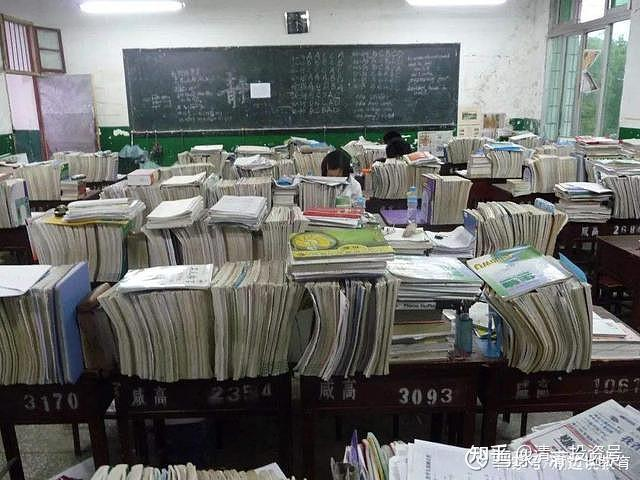
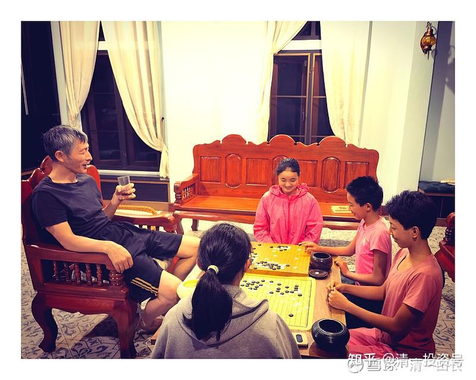

[原雪球专栏](https://zhuanlan.zhihu.com/p/584764784/edit)[202篇.不读书，只刷题的“教育”能成就孩子未来吗？](http://link.zhihu.com/?target=https%3A//xueqiu.com/9310099567/198210597)

清一山长 2021年9月18日

今日学堂几个从来没有考过试的学生，今年去参加SAT 官考拿到高分后，你似乎应该对“刷题”的价值，有清晰的了解了。**教育不是从小一次一次的考试比赛，而是要打好基础。**基础好了，怎么考都行；基础不好，考好了也容易忘掉，是最浪费生命的学习方法。投机取巧，最终害自己，十几年学下来，几乎就是个小白，啥也不知道。

来我这里培训的学员，深感耻辱的就是：同样是一起听我的课，一起写作业，一起学习和讨论，他们这些上过大学、研究生的大人，还比不过我这里学习了三年的小朋友。原因倒不是我们的学生是天才，而是他们**在体制内只学了考试，根本就没学啥实在的东西**，他们学十几年自然比不过我们实实在在学了三年的学生。有啥奇怪的？

英语学习就很典型：我们体制的学生，一直在强行记忆、考试和刷题中，与遗忘作斗争。学生很辛苦，老师也很辛苦。最终，十几年下来，就没几个人真学会了英语。这就是教育的一个大笑话！其他学科也一样，只是更隐蔽一些，你们看不出罢了。比如：中国的语文教育，一样是大笑话。你不教语文，恐怕学生的语文会更好。

我的语文就不是老师教的，是自己读书读出来的。老师如果认真教了，我认真学了，认真考试了，我的语文肯定跟别人一样差——不会写，也不会说。我从小上课不听语文课。因为我父母是学校的领导，我上课自己看书，老师也不管我，期末考试成绩也很好，自然更不管我，所以我才有今天的水平。你们要想知道国人语文好不好？很简单，看看雪球上的网友发言，大多数根本就说不出有啥价值的话。甚至不知所云，说啥都说不清楚。这就是语文没有学好的基本表现。

在小女现在正在为“一天读完一本书”而努力挑战的时候，在她和她的同伴，每天安然地阅读各种有趣的书籍的时候，她们现在的生活，将成为明年公主班的学生模仿对象的时候，以及：在今日的高中学生们，现在已经开始认真阅读《与神对话》的时候。与此同时：中国的一些语文教师，却在为他的学生“三年也读不完一本《三国演义》”而抓狂。您觉得：20年后，谁才是真正的社会精英阶层？谁才能更加轻松自如地面对未来的生活和变化？难道是一群不读书，只会刷题，只会考试的呆子吗？

这几乎就是不用比较，你内心的感觉也一定知道：未来在谁的手里。参考链接百度网页链接：

[三年的教学时间,让学生熟读一部名著都很困难,原因何在?](http://link.zhihu.com/?target=https%3A//www.baidu.com/link%3Furl%3D2wIHrL_elqX22aVuIwbIT6v4tFXRb5rLBvQAooAn-fMAwTP6TSbUnjzNw_P3jGq8DwCfFsMcl5kWL0WBrunAzK%26wd%3D%26eqid%3Dabd61006000d87250000000363905462)

[https://baijiahao.baidu.com/s?id=1710882929252502757](http://link.zhihu.com/?target=https%3A//baijiahao.baidu.com/s%3Fid%3D1710882929252502757)

【将心比心：您愿意您的孩子，在这种环境下成长吗？】

这几个清迈小公主们，在我的【**陪伴式成长**】教育理念下，只读书，不考试。每天快乐地学习和生活，有一整个书库供她们读书。每周，还要我陪她们下一次围棋，四个人一起对付我。还要当她们的司机，每周带她们外出旅行游玩一次。你说：这难道就不是教育？上面图片中的堆满教辅教材的教室场景，才是学校，才是教育吗？

真这么自信，你们的孩子，愿意来跟这几个小女孩，比一比综合成绩吗？赢了，您可以拿一千万呢？她们还是文武全才，男生也未必是她们的对手。现在你看到的温柔场景，只是表象。上擂台要打我的时候，她们也是很凶猛的“动物”，出手一点也不温柔。

（以下内容为编者收录）

**评论回复：**
[leonlai2000](http://link.zhihu.com/?target=http%3A//xueqiu.com/n/leonlai2000)回复@清一山长：

一直想求一个小明慧所读书的书单。

清一山长[2021-09-19 07:53](http://link.zhihu.com/?target=https%3A//xueqiu.com/9310099567/198229439)回复[leonlai2000](http://link.zhihu.com/?target=http%3A//xueqiu.com/n/leonlai2000)：

体制思维[大笑]你以为有个书单，你一样读了这些书，就能成为一样的人？体制内的教材都一样，读完了大家都一样吗？[大笑]假如她真的每天读一本，一年读了300本书，您说该全给您都写出来一遍吗？说实话：连我都懒得知道她具体读了啥书。**只规定她不许读弱智的、大众的书。**

参考链接：

[【清一大学少年班】走进我们的日常生活](http://link.zhihu.com/?target=https%3A//www.bilibili.com/video/BV1Hr4y1K769)

[这就是今日学堂](http://link.zhihu.com/?target=https%3A//space.bilibili.com/487498588/channel/detail%3Fcid%3D149241)

[今日明师荟](http://link.zhihu.com/?target=https%3A//space.bilibili.com/487498588/channel/collectiondetail%3Fsid%3D55359)

[清一大学武医学院](https://www.zhihu.com/people/mkaga)（原清一武道馆）

[清一投资号：86篇.知识权力时代，教育战决定胜负!](https://zhuanlan.zhihu.com/p/566819841)

[清一投资号：46篇.新教育送给中国人的礼物——中国公主](https://zhuanlan.zhihu.com/p/553173076)

[清一投资号：47篇.如何用三年学完十二年的课程？](https://zhuanlan.zhihu.com/p/547313287)

[清一投资号：56篇.创造历史的清一大学：首届学生集体合影](https://zhuanlan.zhihu.com/p/551968023)

[清一投资号：65篇.在泰国过春节：请300个大学生吃饭](https://zhuanlan.zhihu.com/p/554009396)

[清一投资号：66篇.如何鉴别优质教育](https://zhuanlan.zhihu.com/p/560659119)

[清一投资号：136篇.转美国教育的⼋宗罪！中国学校会不会更甚之？](https://zhuanlan.zhihu.com/p/581920937)

[清一投资号：143篇.建立中国人自己的平台，才能真正获得尊重和地位](https://zhuanlan.zhihu.com/p/584741008)

[清一投资号：144篇.教育投资也需要算账：别血本无归！](https://zhuanlan.zhihu.com/p/584742375)

[清一投资号：145篇.“海底捞打工仔”用一周备考雅思，拿到两项满分！](https://zhuanlan.zhihu.com/p/584941229)

[清一投资号：147篇.北京年轻打工仔，一周备考拿到雅思单项满分](https://zhuanlan.zhihu.com/p/584960177)
