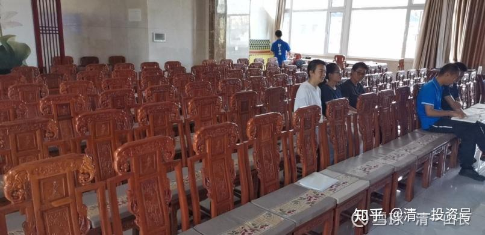

[原雪球专栏](https://zhuanlan.zhihu.com/p/584764784/edit)203篇.清一大学哲学课：学生作业及课后总结

清一山长 2021年9月20日

上次我公布哲学课程的课前作业时，说过：过几天会公布学生的作业，以及学生的听课记录，以及思考总结。我原话是：“你们想看当然可以，如果你们看得懂的话！”[网页链接](http://link.zhihu.com/?target=https%3A//xueqiu.com/9310099567/197889854)。

今天这些作业和听课总结，我都发上来了，你们想看就看吧！[大笑]

第一部分，是课前作业，在我看来水平很低。我上课之后，学生们知道他们写的作业几乎就是儿戏了。

第二部分，是学生们的课后总结反省。你可以看到一点我上课的风格、内容，以及学生们吸收的程度。这些总结是学生吸收理解的程度，跟我的原版讲课相比依然有不小的距离。不过跟他们自己的作业相比，已经是有天壤之别了。有兴趣就好好读读他们的课程总结吧！她们无法用英文来翻译的词汇，直接保留我讲课的原话：比如“圣母婊”。他们只是知道“圣母婊”不是圣母，但英文的确没有对应的词汇。还有一些词汇也是一样的。

学生把慈悲的英文翻译，我认为弄错了。“悲”、“慈”

that is kindness. But for God, the war of so many people is, frankly speaking, no different from ants fighting over a can of fish. So it's funny, and it's sad. For a little interest, a small problem may develop into murder, and even more into war, and that is ‘悲’, “sorrow”.

“悲”，不是sorrow。而是理解和同情心、同理心，是不能翻译为“sorrow”的，不过，估计很多专家都翻译不来的。[大笑]

各位有兴趣了解清一大学的学生水平吗？通过这些作业就能了解。我相信，中国的大学，能够达到我的一个私人创办的清一大学的学生水平的大学生，是很少的。不说普通专业的大学生了，即使是中国大学外语专业的学生，很多人也无法写出全英文的作业，而且是深度的哲学思考。不信你们就来比比。[大笑]

就算不比赛外语的能力，仅仅就只谈中文水平，您用中文来写作业、听课、写总结，你们认为，有多少人能够超越我的学生呢？我的成人培训学生，全都是大学生，甚至研究生等。正在与我的清一大学的学生一起同堂上课。他们难道有信心击败我的学生吗？实际上目前还没有案例出现。就是我说的：学生一上课，就发现自己体制大学十几年的学是白上了。

【照片是我的恒大金碧社区的清一大学现校址。恒大已经陷入了风雨中，我的房子交付十年了，我使用五年了，还安然无恙。感谢恒大】

2021年9月14日《与神对话第二课 作业》

——刘雨辰

**五：最高级的思维，永远是包括了最欢乐的思维——这就是我今天说的“喜欢”和“讨厌”。最高级就是最喜欢——我们都喜欢成为最杰出的人。因此，我们就去追求最卓越的事情和表现。**

**请找出你内心深处，你认为能够让你“最欢乐”的五件事情。你最喜欢去做的五件事情！**

①Help others, no matter what.
what is happen now is manage our class.Being the monitor means to decide most of the rules and regulations of the class. How these rules and regulations are formulated will determine the state of the class. If i can make these rules reasonably ,i will help the whole class students improve.
In addition to being the class monitor and helping the class improve, there are many situations where i can help others. Such as helping small animals that no one takes care of , helping old people crossing the road, helping lost children find there home... I also feel very happy while doing these things. Although it is a very easy thing for me, for them, it may be a great help.

② Focus on my goal and get into a flow state.
No matter what I am doing, when I am fully engaged and not disturbed by the outside world, I will enter a very focused flow state. Whenever I enter this state, my heart is peaceful and joyful, and I will feel very happy after finishing what I am doing.

③ Break through myself ,or make any progress in all aspect.
Whether it's learning a new skill, setting a new athletic record, or improving my mental homework, I'm happy.

④ Be able to be independent, and do things that 'grown-ups' can do.
If I can do more things on my own, it means I can make my parents feel more assured. If I can earn money, I don't need my parents give me pocket money. If I learn to drive, I won't need my parents to drive me around... This can let them have more time to do their own things.And It also means that I have grown up and have the ability to take responsibility for myself.

⑤

Accompany my relatives , friends ,and let them feel happy.

I am also very happy when I accompany my relatives and friends, chat with them and help them solve some troubles in their life. Because they are very important people in my life, they help me a lot in my life. If I can help them or just accompany them and make them happy, I'll be happy, too.
In summary, doing things that make me and others better.

**六：“我的绝大多数信息，并没有引起注意。”请列出五项：你认为神发出了非常明显的信号，但却没有引起人注意的信息。**

Phenomenon 1: traditional education
① Most children who graduate from traditional education school cannot live on their own or find a job.
② Students are very depressed when they in the school ,and they have no interest in learning.There even have some students jump off the building.
③ Although students study at school, they still need a lot of remedial classes.
④After graduation, students who find jobs still need reprocessing.Explanation: The traditional education is defective, can not meet our educational needs.

However, most parents in China still choose to send their children to study in traditional schools.

Phenomenon 2: Chronic diseases
① The proportion of death caused by chronic diseases has risen to over 85% in China.
② There are nearly 90 million obese adults in China, ranking first in the world.
③ The number of people suffering from “three highs”in China is on the rise.

Explanation: Chinese people generally lack exercise.
However, most schools in China have less than three hours of exercise a week, and most students have no time to exercise during holidays.

Phenomenon 3: Short video software
① On average, Chinese people spend two hours a day on short video apps.
②Short videos will bring short-term stimulation, which will make people lose the consciousness and ability to think deeply.
③ Short videos cause serious irregular work and rest for adults and children.
④ After using short video software for a long time, they will feel seriously empty.

Explanation: Short video software caused a very big impact on us.

However,most People in China have short video apps on their phones.

Phenomenon 4: Study abroad in America
① Most of the children who study abroad in America can't find a job in China or abroad.
② Students do not study ,but fall in love, spend a lot of money and take drugs during their study time.
③ Students are severely discriminated against abroad.

④Students can't even speak good English after they come back to China.

Explanation: Study abroad is defective, can not meet our educational needs.

However, most Chinese parents choose to send their children to study in United States .
Phenomenon 5: used to stay up late
① Stay up late lead to lack of sleep time and irregular sleep cycle.
②Staying up late leads to cognitive decline ，sluggishness and difficulty in concentrating during the day,.
③ Chronic late nights can lead to Parkinson's disease or Alzheimer's disease.
④90% of sudden death among young people is related to staying up late.
Explanation: Staying up late is very bad for our health.
However, 70% of young people in China have the habit of staying up late.

**七：神说：“不聆听经验导致的结果是：你不断地重复体验到它。一次又一次。因为我的质疑不可被忽略”**

**（1）请列举身边你看到的一个例子，说明这种情况:**

My cousin, because of her childhood experience,when she grew up ,she really want to feel loved. She has very similar situation with all her boyfriends, and although she tries very hard to manage their relationship, she has never found a boyfriend who she thinks really loves her.

When she started dating this guy, she was very happy , and happiness every day.

Then , she's feared of losing, she fear that she's not good enough and this guy will likes another girl, or she fear that his parents don't like him...

After a period of time, because she know this boy deeper, she will find that this boy has some disadvantages, there are some issues may cause great influence in the future. So , she will start to struggle, struggle waiting for him to change, or split up with this boys. During this period, her mood will fluctuate greatly. When she is with that guy, she will be happy, but when she is alone, she will be [http://anxious.In](http://link.zhihu.com/?target=http%3A//anxious.In) this state, she was not as happy as when she was not with this boy.
Even though the story was so similar every time, and ended in tragedy every time, she didn't realize what the problem was. She always expected to find a 'perfect boyfriend' who was competent, kind to her and loved her very much. But there is no such 'perfect boyfriend', because loving her is a very subjective judgment . If she wants to look outside for love, she can never be satisfied.

**（2）请列举自己的一个例子，说明神说的这种情况:**

I often miss opportunities because I'm afraid of the outcome, and i will certainly regret after that. For example, I wanted to be the monitor last semester, but I was afraid that I could not do well, so I did not dare to run for president. Another example is that there were many debates in last semester, but i worried that my performance is not good enough, So i did not dare to raise my hands to do it; and what is the most common thing that happens is do not dare to answer or ask questions when we have class, because I am afraid that I will answer wrong or ask stupid questions. But after class, I will regret . Although I regret every time after i doing such things , I often do it because I am afraid and i want to save my face.

**（3）请找到你如何解决这种死循环的方式:**

I think there are three ways to solve this problem:
① Feeling from soul. - Listen to your heart and follow the sound of feeling.
② Feeling from mind. - Do rational judgment, looking for advice, or reading to find the answer.
③ Feeling from body. - Getting bad feelings over and over , creating painful links, and finally learning them .

For those two examples, there are some specific solutions :
Example 1: cousin's difficulty
① Feeling from soul. - Listen to your heart and follow the sound of feeling.
- Stop when she realize that she's not feeling right, she's struggling and in pain .
- Try to feel what is happiest thing, and do what make her soul happy.
② Feeling from mind. - Do rational judgment, looking for advice, or reading to find the answer.
-list of the pros and cons of dating this guy and make a rational decision about whether or not dating with this guy.
- Take a dating class.
-Read books by successful, happy women like Michelle Obama.
- Consult an adult with experience in this area, like my mom.
③ Feeling from body. - Getting bad feelings over and over , creating painful links, and finally learning them .
- Dating with more guys, constantly experiencing pain and struggle, reaching the limit and realizing that she were looking for love in the wrong way.

Example 2: My difficulty
① Feeling from soul. - Listen to your heart and follow the sound of feeling.
-Try a different approach when i feel regret .
- Do what make my soul happy.
- Try to see how i feel after i done it.
② Feeling from mind. - Do rational judgment, looking for advice, or reading to find the answer.
- Rationally determine what is the consequences of my actions and whether i is unacceptable .
- Consult my teacher.
③ Feeling from body. - Getting bad feelings over and over , creating painful links, and finally learning them .
-Keep doing it, and often feel regret. When i reach the limit, i will change it.
**八：你们都想知道你们的感受来自何处，如何鉴定你们的感受级别：今天谈到：喜欢和不喜欢，就是你的灵魂语言。请看下面的这个锦鲤咖啡馆的介绍，相信大多数人都会“喜欢”，但这种喜欢，有来自最高的灵魂的感受——爱和真实、快乐，也有来自低级的杂音。请自我检测一下，自己是什么级别？很简单——说出你对这家咖啡馆的感受来。让我们通过你的感受，来判断你的感受来自何处？高级的灵魂？还是低级的被植入，被洗脑？**

①My Feeling:The environment is pretty beautiful, and i am very yearning to visit such natural environment.

From my soul feeling: i like lively scenes, like nature.

Way to Test: I will be really happy if i can live in this environment every day.

conclusion:I love lively scenes and nature.

② My Feeling:I can watch fish and drink coffe at the same time.

From my body feeling: it will be really fun.

Way to Test:If i can eat every meal here, after a few days I will doubtlessly forget the fish and stop paying attention to them.

conclusion:I don't need to watch fish while I eat, it's just my curiosity.

③ My Feeling:This place is very unique,I have never seen it, I can post it on my Wechat friend circle.

From my body feeling: I think if i can go to such a unique place indicates that i have a very good taste and i am keep up with fashion trends.

Way to Test: if i can not say anything about it after i go ,i'm not willing to go there .

conclusion: I was brainwashed into thinking that going to a unique place meant that I was unique, and i had a unique mind.

**九：古人说：食，色性也。我们的眼睛要看，我们的嘴巴要吃。请你继续看后面的链接，假如你在泰国，你看到这家清迈的店的介绍，你想来吗？请说出你看这篇文章之后的感受。看你的感受级别！**

**（1）假如你在泰国，你看到这家清迈的店的介绍，你想来吗？**

The first reaction is‘yes’, because the price is not expensive, and the food is very attractive.
But after reading the menu, I found out that there was nothing I could eat, so I didn't want to go.

**（2）请说出你看这篇文章之后的感受。看你的感受级别！**

①Behavior: How much is 339 baht converted into RMB? 78, that's not bad，if it's a buffet.
Feeling of thought: look at the price, judge whether is appropriate.
Level of feeling: brain perception

②Behavior: Look back and see what's on offer. Wow, it's beautiful. It looks delicious!
Body feeling: i did not eat at all, but because the color is rich, i think it's delicious.
Analysis: The rich colors stimulate my brain and make it look delicious, but i haven't taste at all.
Level of feeling: Physical feeling

③Behavior: Look at the menu.
Body feeling:They all look great, but what are they? Curious to find out more about the restaurant's dishes.
Level of feeling:Physical feeling

④Behavior: It's all meat, there's nothing I can eat. As expected,good food always belong to someone else.
Physical feelings: some frustration, found that looks very delicious food oneself can not eat.
Analysis: Because the restaurant looks good and I have the desire to go there, but suddenly I find out there is no food I can eat, I feel a little uncomfortable and have a feeling of loss.
Level of feeling:Physical feeling

⑤Behavior: what am I doing.....
Body feeling:Suddenly realize that i have a funny emotions. Frustrated by a seemingly nice restaurant with nothing i can eat.
Analysis: It's not the only restaurant in the world. It's not the whole world doesn't have something for me . Why i am upset only because this restaurant doesn't have something for me ?
Level of feeling: brain perception

⑥Behavior - Supplement: If I could eat, I might think 'I'll eat more' to get the most reasonable cost performance ratio.
Body feeling:desire, want to take advantage.
Analysis: Do not eat for my need, but eat for satisfy my mouth desire and the desire of my heart to take advantage .
Level of feeling:Physical feeling

summary: When I read this article, my feelings mainly stay in the body feelings. Most of my behaviors are driven by desire, and different emotions are generated by the information I read. A few behaviors are driven by my mind, such as observing the cost performance and finally realizing my own emotions.
Conclusion: I'm stayed in body feeling level,but i have some mind feeling or thinking judgment.

**十：“神”会与谁交流呢？会与什么特别的人吗？（尼尔问这句话，他当时在想什么？“神”的回答，代表了什么？“神”回答之后，尼尔继续问：基督为啥能够更多地聆听到与“神”的交流？又代表他的什么心理呢？你感受到这些细微的地方没有？**

**（1）尼尔问这句话，他当时在想什么？**

Psychology: He wondered if only he could communicate with God, or if only some very strong people (such as Christ) could communicate with God, and if so, why God selected him and what was his own special point.
Explanation: To sum up, it is a kind of confusion, with a little proud(want to know whether there is something special about himself )

**（2）“神”的回答，代表了什么？**

The literal meaning god trying to express in each sentence:
①All people are special, and all moments are golden. There is no person and there is no time one more special than another.
1. God does not selectively talk to people. He talks to everyone.
2. Someone is not talking with God because he is not listening.
②Many people chose to believe that God communicates in special ways and only with special people. This post the mass of the people from responsibility for hearing My message, much less receiving it (which is another matter), And allows them to take someone else's word for everything.
1. God wanted Neil know that it's not that many people can't hear God speak . Instead, they choose to believe that God only speaks to special people. (Because once people believe this, they can convince themselves that some people are successful because of God's guidance, and their own bad because God's haven't direct them. therefore ,they can blame god for all the fault.)
2. Because of ↑, many people do not need to responsible for hearing God's voice. (because it's not god's voice), do not need to received, do not need to transmitted.
3. So they can ignore God's guidance and just do what other people (parents, teachers, partners) say and blame it on them.
②You don't have to listen to Me, for You've already decided that others have heard from Me on every subject, and you have them to listen to. By listening to what other people think they heard Me say, You don't have to think at all.This is the biggest reason for most people turning from My messages on a personal level. If you acknowledge that you are receiving My messages directly, then you are responsible for interpreting them.
1. If you listen to other people who have spoken to God, you don't need to listen to God (after all, they are saying the same thing what God wants to say) (Another guess is that God believed that once you listened to these people, you would be almost impossible to communicate with God because you would believe that God could only communicate with these people).
2. Listen to what these people are saying ， you don't need to think anymore (because the language of God is hard to feel and understand, and is much easier to understand if someone can directly paraphrase it)
3. Because people cannot understand what God is communicating with them, they assume that only those who can explain it are communicating with God and that others are not.
4. Some people may have communicated with God, but because they do not understand it themselves， or can not explain it to others, they do not show that they have communicated with God.
④ It is far safer and much easier to accept the interpretation of others (even others who have lived 2,000 years ago) than seek to interpret the message you may very well be receiving in this moment now.
There are reasons and benefits to listening to those peoples explanations. First of all, they really easier to understood than what God say , and if many people followed them, what they said must be right. Secondly, it is much more difficult to be calm and listen to god's voice than to find an actual person or an actual book.
⑤Yet I invite you to a new form of communication with God. A two-way communication. In truth, it is you who have invited Me. For I have come to you, in this form, right now, in answer to your call.
1. Before, God could only communicate unilaterally with others, but they opened an two-way communication. Neal can ask god questions and god can explain to him.
2. In fact, it should be considered that Neil invited god to carry out such two-way communication. (god can only communicate with you if you want to communicate with him; god communicate with other people, but they don't communicate with him, so he don't have two-way communication with them.)

In addition, we can also see god's position, or god's thinking, through this passage:
1. God is not selfish, he do not choose to communicate with who he wants to communicate with, but communicate with all people.
2. God doesn't care if we want to communicate with him or receive his message. He hope he can help us, but he doesn't care if he can help us or not.

**下面先从每句话分析一下“神”想要表达的字面意思：**

①All people are special, and all moments are golden. There is no person and there is no time one more special than another.

②Many people choose to believe that God communicates in special ways and only with special people. This removes the mass of the people from responsibility for hearing My message, much less receiving it (which is another matter), and allows them to take someone else’s word for everything.

③You don’t have to listen to Me, for you’ve already decided that others have heard from Me on every subject, and you have them to listen to. By listening to what other people think they heard Me say, you don’t have to think at all.This is the biggest reason for most people turning from My messages on a personal level. If you acknowledge that you are receiving My messages directly, then you are responsible for interpreting them.

④

It is far safer and much easier to accept the interpretation of others (even others who have lived 2,000 years ago) than seek to interpret the message you may very well be receiving in this moment now.

⑤Yet I invite you to a new form of communication with God. A two-way communication. In truth, it is you who have invited Me. For I have come to you, in this form, right now, in answer to your call.

**（3）“神”回答之后，尼尔继续问：基督为啥能够更多地聆听到与“神”的交流？又代表他的什么心理呢？你感受到这些细微的地方没有？**

① If God can communicate with anyone at any time, why is everyone on a different level and why is Christ so successful? Was it because he had heard more, that God had spoken to him more?
② I am also communicating with God ，why I cannot be Christ.

In summary, it is a kind of disbelieving , and he want to confirm it.

**第二部分：学生的课后总结和反省。**

**蔡依君《与神对话》第二讲课程总结**

Since the lesson was mostly talked by topics, I'll mention my two harvests.

1/God, saint, devil

In this lesson, Principal Zhang talks about three kinds of people: god, saint, and demon.

Let's start with demon, which is very simple to understand. Demon, who enjoys destroying others, even destroy themselves unconsciously. To take an example, seeing a bird's nest fall, what a demon might do is to take those nestlings and roast them for dinner. What they do is to earn profit by destroying others. If you can't be a saint, or a god, at least don't be a devil.

The opposite of the above, is saint, or an absolute good person, who does everything for the sake of others. I once heard a story about a nazarite who saw a hungry beast on the way, to my surprise, this man cut off his own flesh and threw it to the beast. That's an good man absolutely, who are able to put their own needs behind the needs of others. Characters like Mother Teresa would be what we would call saint, because she was all about people and spent her whole life helping others.

But a saint is not a ‘圣母婊’.

A saint is selfless, simply giving without expecting anything in return. However all the ‘圣母婊’

does it to satisfy their delusional inner-self, wanting to be recognized by others and make them feel how great they are. For example, there is a book about a person who suffered enough her ‘圣母情节’.

For example, she was on her way to a party when she accidentally had a car accident and broke her arm, later on hurt her leg for some other reason, but because of a stupid promise, she insisted on attending the party without telling anyone about the injury. Just to reflect her saintly motherhood and her greatness, yet no one noticed, so it was painful. Differs from saint, who won’t because they don't even do it to give back.

What is the last kind of God, as opposed to good and bad, how does God think? God, representing our highest thought, which is joy, truth and love.

For example, 山长

once did a “bad thing”by putting a can of fish on the grass, and the next day thousands of ants died on the grass because the ants had been at war in the area. What does God think of all this? If it was the devil, he probably thought it would be fun to have so many ants that he could get a lot of them killed, one nest at a time. The saint might have just kept stopping it, standing in the middle, saying: stop fighting, please stop, don’t hurt yourself and you relatives, we are all family, we have to live in peace. However what God does is stand by and smile.

Staying out of the way, first and foremost because of love, I don't stand for factions because I know all of you ants are fighting for your people, grabbing food, and all of you are sacrificing for your country, even you might die at war, is admirable and really brave. But I won't join you, because it's actually stupid to do so, and kind of funny. You were probably once a family, but now you are all fighting because you don't know each other no more. Not to mention joining the ant's entanglement, wouldn't I be just like the ants? This is the truth, seeing it all for what it is. So whichever side wins, I watch with a smile on my face, with a pleasant mood, just like the fighting of two kids.

Actually, those ants are in fact like human beings, two sides are at war. For example, the Islamists say, you join us in Islam, fight against capitalism and fight for the interests of our poor children. The other side tells you that these Islamists are simply infidels, they are destroying the world, and you must join us in order to save the world. Which side to join? As God, looking behind this, all the people here are really brave. I would never dare to go to war, they are willing to fight to defend what they believe to be the truth, this is a very respectable action. This is love, look everything to the good side. In other word, you can say it is the “mercy”, the ‘慈悲’, ‘慈’

that is kindness. But for God, the war of so many people is, frankly speaking, no different from ants fighting over a can of fish. So it's funny, and it's sad. For a little interest, a small problem may develop into murder, and even more into war, and that is ‘悲’, “sorrow”.

It's like those cases often told before, where you can get into a fight with others, even cut someone's head off, for a 50-cent phone bill, or 50-cent of price difference. These things are tragic to say, but they are the truth, and souls like to be true. Things of human don't really mean anything to God, so he doesn't get involved.

Just like **‘山长’**

will not do technology, not that it can't be done, but not interested. Technology, no matter how high-tech and mighty it is said to be, is frankly about satisfying people's desires. Apple phone is built, it is advanced, but if there was no Apple phone, would people still stare at their phones, watch short videos, read novels and read mindless stuffy nowadays? Building a rocket to put a man on the moon is great, and it's really fine to do it, but what's the point of doing so? Sending people to the moon, then what? Isn't it still about satisfying desires, how great we humans are, how technologically advanced we are, that we can all be stationed on other planets.

But with all of these things, God doesn't have any subjective judgments like what is good and what is bad. If you want to do it, then do it, God will always support you, that is his attitude, whatever is right to do. And no matter what you do, God will always watch you with a pleasant mood. It's like when ‘山长’ took her daughter to the supermarket, they were watching people from the sidelines. For example, when he saw a cafe and a man inside was very perky, he was playing the role of a very powerful man who had a lot of money and was able to come to such a fancy place to drink coffee and look very elegant, while the two people outside the window were looking around quietly, they must not have any money. What he paid for was not coffee, but a feeling. At the same time the waiter is playing the role of someone with a good attitude, very committed to give the customer what he needs for the benefit of the company. Everyone is playing their part, and how interesting it is to watch.

We can be grateful and look at all things with love, like those employees of customers of Haidilao, the scientists who make rockets, the manufacturers of Apple phones, the designers who create ‘锦鲤咖啡厅’,

the chefs who make authentic Cantonese dim sum in Thailand, they are all admirable, all of them. But we also need to see the truth, the sadness of these people. Once you are inside the matter, there is really no difference between yourself and them.

However, we are all human, we have been in them already, so all we can do is try to think in God's way and look at the world with love, truth and joy.

Let's say it with an interesting question, a kidnapper comes to rob you, should you fight him or run away or just give the money? It doesn't really matter what the act is, what matters is your thought, you can give him the money because you know he needs it; or you can choose to run away because you know that giving him the money may lead to more tragic events and it's better to let him suffer; or you can fight him and show an identity that you would rather die than give up. The point is what kind of role you want to show, and what kind of mode you are thinking.

Instead of playing the clown of the story, jump out and become the observer.

2/Listen to God’s messages

The second harvest has to do with God's mercy as well.

God is merciful, he watches us quietly but gives us signals when we are doing wrong, after all, God is actually everything around us, it is us, we are God. Aren't our feelings one of them? When we do something that our soul doesn't like, we feel depressed, and that remind us to correct it. It's just that these signals are often ignored.

For example, one of the most obvious recent examples, the Coronavirus, to say where does it came from, even scientists had no conclusion. in fact, 山长 looked at it, and found that it was actually some demigods who realized that the human world was just about to be done by us, so they used this virus to make us lock ourselves up, only when each country block themselves up, they will start to think about the loopholes of what they've done.

Why do you say that the earth is heading for destruction? It's simple, as human’s desires grow, we create more and more things to satisfy their desires. Those precious resources of earth are constantly being exploited to make things we don't even need, such as cell phones, airplanes, and rockets. How many coal mines are wasted when we are willing to fly from Beijing to Guangdong for a meal, or from the US to China for some cherries? Just to satisfy our selfish desires.

While such signals are always ignored, at least the Coronavirus influenced the course of human development for a decade, but without awareness, it would eventually lead to destruction, which could not be stopped.

In addition to these types of signals, each of us is actually receiving signals from God. Getting sick, for example, may be God's way of reminding us that there is something wrong with what we are doing right now, that we are doing it wrongly, that maybe you have been eating unhealthily lately, or that there is something wrong with your habits.

In other case, when we have cancer, it might also be signals from God. However, many patients that are born with serious illnesses are still living their unhealthy lifestyles.

Then there is depression, the cause of which is that we are extremely dissatisfied with our current lives, our souls are extremely dissatisfied, and if we could be aware of it, we could go and change. However, many people in this society do not have the means to realize it, or if they realize it, they use other methods to escape, such as drinking, playing games, reading novels, watching short videos and other ways to numb themselves. It seems to be useful, but in fact it is just a vicious circle, experiencing pain over and over again. Why are there so many people suffering now, especially workers, when clearly everyone was the most alive and lovable as a child, because we all failed to do things according to God's instructions.

What it takes to fix this vicious circle is to embrace the failure and embrace these bad feelings. The more uncomfortable you feel, the more you have to deal with it, you can't run away from it, because running away doesn't solve the problem. When you really listen to the feelings and feel what the soul is trying to tell you, that's how you know what you really want and really need.

参考链接：

[【清一大学少年班】走进我们的日常生活](http://link.zhihu.com/?target=https%3A//www.bilibili.com/video/BV1Hr4y1K769)

[这就是今日学堂](http://link.zhihu.com/?target=https%3A//space.bilibili.com/487498588/channel/detail%3Fcid%3D149241)

[今日明师荟](http://link.zhihu.com/?target=https%3A//space.bilibili.com/487498588/channel/collectiondetail%3Fsid%3D55359)

[清一大学武医学院](https://www.zhihu.com/people/mkaga)（原清一武道馆）

[清一投资号：86篇.知识权力时代，教育战决定胜负!](https://zhuanlan.zhihu.com/p/566819841)

[清一投资号：46篇.新教育送给中国人的礼物——中国公主](https://zhuanlan.zhihu.com/p/553173076)

[清一投资号：47篇.如何用三年学完十二年的课程？](https://zhuanlan.zhihu.com/p/547313287)

[清一投资号：56篇.创造历史的清一大学：首届学生集体合影](https://zhuanlan.zhihu.com/p/551968023)

[清一投资号：65篇.在泰国过春节：请300个大学生吃饭](https://zhuanlan.zhihu.com/p/554009396)

[清一投资号：66篇.如何鉴别优质教育](https://zhuanlan.zhihu.com/p/560659119)

[清一投资号：136篇.转美国教育的⼋宗罪！中国学校会不会更甚之？](https://zhuanlan.zhihu.com/p/581920937)

[清一投资号：143篇.建立中国人自己的平台，才能真正获得尊重和地位](https://zhuanlan.zhihu.com/p/584741008)

[清一投资号：144篇.教育投资也需要算账：别血本无归！](https://zhuanlan.zhihu.com/p/584742375)

[清一投资号：145篇.“海底捞打工仔”用一周备考雅思，拿到两项满分！](https://zhuanlan.zhihu.com/p/584941229)

[清一投资号：147篇.北京年轻打工仔，一周备考拿到雅思单项满分](https://zhuanlan.zhihu.com/p/584960177)

[清一投资号：149篇.清一大学哲学课：作业思考题](https://zhuanlan.zhihu.com/p/589957958)
