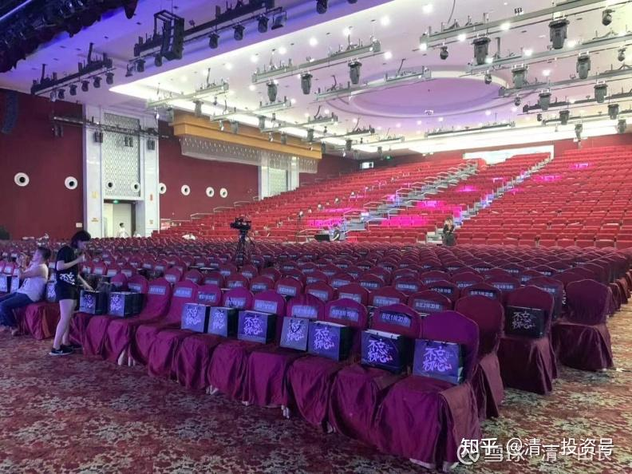

原雪球专栏[205篇.教育和财富的国策思考：大变局与大转弯](http://link.zhihu.com/?target=https%3A//xueqiu.com/9310099567/198335756)

**清一山长** **2021年9月21日**

今年，有很多想不到的事情，正在不断的发生，这些事情，可能会永远改变我们的未来规划，也许，你今年更需要换一副新的眼光来看待世界了！

**一：教育大变迁：**谁也想不到，今年推出的教育新政，会让新东方等民办教育机构，各种培训机构，彻底失去生存空间，市值狂垮90%。而且政策的执行力度空前严厉，不是教育局在执行，而是政法系统在主要执行。说明：这肯定不是一个简单的教育问题，这是一个“重大国策”，**未来教育大转向，教育目标大改变，是必然的趋势。**问题是——我们要转向何处？现在，在严格限制民办招生比例的规定下，很多成功的民校，都只能直接“赠送给国家”，转为公办。民办教育不仅失去了发展空间，其实连生存空间都几乎没有了。为啥会发生这种巨变？背后的核心逻辑是什么？这种教育格局的更改，对我们的下一代教育将产生什么样的深远影响？国庆三天，我将与参会者研讨这个问题。**我们的孩子的未来，就决定于你能够看清未来的变动方向。看不清，也许你重金投资的“教育股权”，也会像新东方等一样狂亏90%。**

**二：财富大变迁：**钢铁、水泥、电力，双碳限制等严厉的企业管制措施的出台，造成了国内传统企业市场巨大的变迁。各种产品价格剧烈的变化，产能严重的压缩，一夜之间就只能面临破产命运的企业，全国到处都是。这种大变局，会导致什么样的经济结果出现？未来的经济走向，如何观察和定义？你怎样才能抓住未来的财富空间？

**三：职业大变迁**：未来的职业选择，在教育大变局，财富大变局的双重压制下，未来的职业选择，肯定会发生极其巨大的改变。原来行之有效的职业设计，将来不会再有用。过去根本就不受重视的领域，可以成为未来的热点。你未来会失业吗？还是有望得到更好的工作机会？大量的职位快速丧失，会带来什么样的变化？

四：世界第一的霸主地位，与世界第二的竞争者，矛盾是不可调和的。老牌帝国已经用各种手段，干掉了前面的四个挑战者。这一次会例外吗？**我们怎样才能置身其中，而不至于造成“城门失火，殃及池鱼”？ **

实话实说：我对我现在观察和研究的结果，是非常的不乐观。**未来的教育、职业、财富的投资逻辑，从现在看，都已经发生了本质上的变化，我们必须面对和改变。不然，我们只能出局！ **

今天是中秋节，我没啥可做的，我也不过节，照样跟学员上课、看书等。但我祝福大家节日快乐！圆满中秋，圆满人生！

【图片说明：以上是我的国庆演讲会场，我有三天的演讲任务。各位对这些问题感兴趣的人，可以申请参加。纯公益性质，非商业演讲】

[中美博弈的趋势与应对——2021年建设新教育行知团队联谊会公告](http://link.zhihu.com/?target=https%3A//mp.weixin.qq.com/s/ukHKBemrFBqaJMokRT4X7w)

[网页链接](http://link.zhihu.com/?target=https%3A//mp.weixin.qq.com/s/ukHKBemrFBqaJMokRT4X7w)：

[https://mp.weixin.qq.com/s/ukHKBemrFBqaJMokRT4X7w](http://link.zhihu.com/?target=https%3A//mp.weixin.qq.com/s/ukHKBemrFBqaJMokRT4X7w)

参考链接：

[【清一大学少年班】走进我们的日常生活](http://link.zhihu.com/?target=https%3A//www.bilibili.com/video/BV1Hr4y1K769)

[这就是今日学堂](http://link.zhihu.com/?target=https%3A//space.bilibili.com/487498588/channel/detail%3Fcid%3D149241)

[今日明师荟](http://link.zhihu.com/?target=https%3A//space.bilibili.com/487498588/channel/collectiondetail%3Fsid%3D55359)

[清一大学武医学院](https://www.zhihu.com/people/mkaga)（原清一武道馆）

[清一投资号：86篇.知识权力时代，教育战决定胜负!](https://zhuanlan.zhihu.com/p/566819841)

[清一投资号：46篇.新教育送给中国人的礼物——中国公主](https://zhuanlan.zhihu.com/p/553173076)

[清一投资号：47篇.如何用三年学完十二年的课程？](https://zhuanlan.zhihu.com/p/547313287)

[清一投资号：56篇.创造历史的清一大学：首届学生集体合影](https://zhuanlan.zhihu.com/p/551968023)

[清一投资号：65篇.在泰国过春节：请300个大学生吃饭](https://zhuanlan.zhihu.com/p/554009396)

[清一投资号：66篇.如何鉴别优质教育](https://zhuanlan.zhihu.com/p/560659119)

[清一投资号：136篇.转美国教育的⼋宗罪！中国学校会不会更甚之？](https://zhuanlan.zhihu.com/p/581920937)

[清一投资号：143篇.建立中国人自己的平台，才能真正获得尊重和地位](https://zhuanlan.zhihu.com/p/584741008)

[清一投资号：144篇.教育投资也需要算账：别血本无归！](https://zhuanlan.zhihu.com/p/584742375)

[清一投资号：145篇.“海底捞打工仔”用一周备考雅思，拿到两项满分！](https://zhuanlan.zhihu.com/p/584941229)

[清一投资号：147篇.北京年轻打工仔，一周备考拿到雅思单项满分](https://zhuanlan.zhihu.com/p/584960177)

[清一投资号：149篇.清一大学哲学课：作业思考题](https://zhuanlan.zhihu.com/p/589957958)

[清一投资号：152篇.清一大学哲学课：学生作业及课后总结](https://zhuanlan.zhihu.com/p/591013955)
