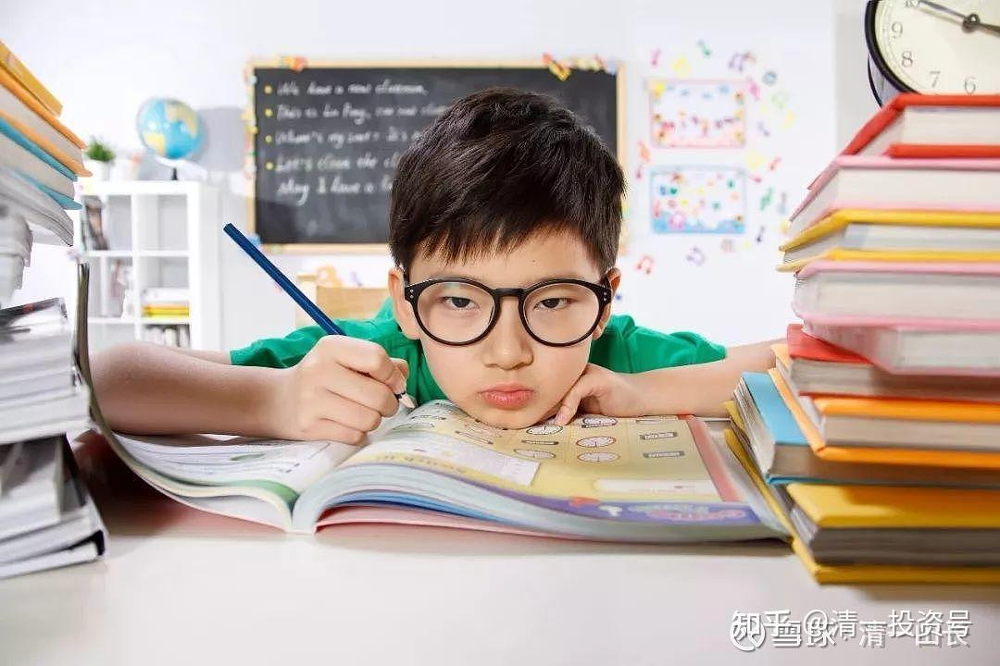

[原雪球专栏](https://zhuanlan.zhihu.com/p/589960785/edit)**[206篇.10年换了8个学堂的家长：重视教育还是漠视教育？](http://link.zhihu.com/?target=https%3A//xueqiu.com/9310099567/198590629)**

清一山长 2021年9月23日

今天的课程，讲解教育目标解析，结果把家长们全讲郁闷了：因为全做错了。而且我用心理学，以及教育学，以及现实结果的反馈，证明了这个错误。这是没法反驳的全国性的教育错误。对于我10岁才教女儿学汉字，家长们也理解，同时也纠结：难道就不能早一点学汉字吗？当然也可以了，但必须讲究方法，不然错误用传统的汉字学习方法教孩子，就把孩子教呆了。这些内容，就明天上课再告诉学员吧！给大家看今年上课学员的课后思考反馈。关键点是：一个家长讲述了她看见的小学和中学，实在不想孩子去上这样的学校，但是送读经学堂也不是办法，也一样造成不少问题。所以——真的为中国教育感到绝望。“家长们和老师们，都在不遗余力的残害孩子（南怀瑾先生语）”。你们还要多久才能醒悟过来呢？

这两天的私人咨询，都在辅导一个17岁女孩的重度抑郁症问题。家长还在操心一年后的高考，但孩子已经没法上学了。继续下去，一定出人命。为了一张换一种方法，很容易就能拿到的大学文凭，而且文凭有没有用还不知道。但家长们从幼儿园开始，就逼孩子不断地学习，到17岁才出状况，也算这孩子能忍了。以生命和健康以及快乐作为代价，你们的“教育之路”，付出的代价，是不是太大了？

最终，我劝说家长放弃让孩子继续学业，逼孩子继续参加高考的计划，让家长们给孩子一条生路！至少让孩子休学一年，恢复一下被残害的身心。等孩子的健康状况好一些，再找我去指导后续的人生规划问题。我再帮他们出主意。

黄姓家长：今天课程收获：

今天山长讲的孩子年龄小就识字、背诗、写字、读经对孩子身心全方位的残害，让我更清晰自己对小儿子的教育规划方向对了。之前我刚了解新教育的时候，坚持了43天时间每天用5个小时读山长的博客，当时自己读懂了不能残害小儿子，小儿子当年6岁就上了新教育学堂。小儿子在学堂调整了2年，才有点儿恢复了孩子本来的样子。今天再次聆听山长的细致解析，我的收获是：我能分享讲出来给更多的家长听，山长一个人的力量很小，需要我们把学到的教育孩子的真相本质分享给更多的家长，拯救更多的孩子，我们的未来才有希望啊！今天听课心情很沉重。

其余略——

广州家长：第四天总结日记：

我家对面有一间小学和中学，放学时间校门口各种卖垃圾食品的小推车前挤满了孩子，小学生居多，体型比较两极分化，或是胖子，或是豆芽。脸色苍白或发青。个头稍大的应该是中学生，大庭广众之下男女勾肩搭背，毫无忌讳。儿子那位读五年级的小表姐说班上的同学都有男女朋友，单身的会被嘲笑。我看着快到入学年龄的儿子，脑袋就浮现出垃圾食品、男女关系……我不想要这样的教育和环境，我不想儿子每天放学吃垃圾食品、早恋。我观察世人的反应，发现没有任何人对这样的状态有半点质疑。是我多思多虑不正常吗？我开始着急焦虑。我可以改变吗？可以不上学吗？儿子五岁半那年，听说广州有读经学堂，我像看见了救命稻草，没有告知长辈，没有了解学堂，就把儿子和钱交给朋友，我本人连学堂都没有去。因为我怕稍作商量就会遭遇阻碍。多年以后来我才发现自己为了避开一个坑，又跳进了另一个坑。儿子有个性，不想读经，我认为是学堂不适合他，没有半点质疑读经方式有问题，就像大众不会质疑体制教育一样。平均一年多换一家学堂，后来实在不肯读经，也不进体制学校，换各种传统文化学校。算下来，十年换了8间学校。直到接触新教育。

为什么别人习以为常的现象，我会产生本能排斥？如果儿子成为他们的一员，会有什么结果？为什么我随便把儿子交给并不了解的学堂和教育？为什么读经学堂又是一个坑？为什么换了8间学校却仍然深信这种教育是正确的？这些疑惑在当年并没有答案。今天用山长教的课程自我剖析当年的信念：

1、为什么身边的人对学生和教育现象习以为常？因为这是中国的变态思维，大家做的就是对的，你不跟随大众就是另类。

2、我为什么会产生本能抗拒？小学一、二年级我的数学老师是个老太婆，不会普通话，用方言讲课，听不懂。三年级换了数学老师，脾气暴躁，三天两头挨打，从此失去学习兴趣，对老师产生畏惧。因此种下了一个信念：老师都很差劲。学校是恐怖的地方。

3、如果儿子加入体制大军，结果很肯定：一定是打击的对象，因为他调皮有个性，老师最不喜欢这样的“坏孩子”，打击下要么判逆，要么被磨去个性，变成呆头呆脑的笨蛋，加上垃圾食品的残害，身心受损。

4、为什么我会把儿子随便交出去？答案是我虽然不爱学习，但依然是体制的产物，没有独立思考能力和判断力，思维受限，无法预测行为所带来的后果。

5、为什么读经学堂又是一个坑？山长今天分析读经和过早写字认字的危害，在我孩子身上全部验证了。稍有一点庆幸的是读经学堂不写字。但是孩子在被迫点字读经的过程中依然受到了极大的损害。儿子会反抗，损害稍微小一些，我那乖顺的女儿在大量读经后，原本敏捷的思维开始变得迟钝，开朗活泼的性格越来越沉闷，脸越来越长，变成了冬瓜脸，眼神越来越暗淡。对什么都没有兴趣，喜欢一个人呆在房间。情绪化，有自残倾向。这难道不是一个坑吗？这个坑一点不比体制那个坑小。

6、为什么儿子换了8间学校，我依然坚持读经？以为读经高雅，与众不同，读经可以成圣成贤。我幻想女儿读经后变成高雅卓越的女孩，以此证明我的眼光是超前的，我是一个智慧的妈妈。我就是山长例举的**那个母亲：没有朋友，没有事业，没有生活，很孤独，只关心孩子，毁自己，毁别人**。结果孩子听到经典就厌恶，不喜欢阅读，冷漠，消极抵抗。

我一直在错误信念系统的推动下作出种种荒诞行为。**人生没有方向，做事没有目的，生活中凭本能作反应，更不会知道自己是谁，在做什么事，有什么后果，胡作非为，**自然感得痛苦烦恼的生活。

可想而知，没有新教育，我无法想象女儿的未来会走上一条什么道路，按性格和上述症状推断，大概会自杀，不死也会严重抑郁，一生悲惨！感恩各种因缘，接触并认识了新教育，如今女儿在突破班，短短时间内眼睛重现光亮，自信、开朗，热爱学习，成长愿心强烈。感恩山长，感恩新教育！

（以下内容为编者收录）

**评论回复：**

[黄红珍](http://link.zhihu.com/?target=http%3A//xueqiu.com/n/%25E9%25BB%2584%25E7%25BA%25A2%25E7%258F%258D)回复[清一山长](http://link.zhihu.com/?target=http%3A//xueqiu.com/n/%25E6%25B8%2585%25E4%25B8%2580%25E5%25B1%25B1%25E9%2595%25BF)：

感恩老师慈悲大爱！引领唤醒我这已经绝望、冰冻、麻木不仁的灵魂！我是文中的黄姓家长！

说说我自己的经历：我2000年在北京五道口小区开小超市创业，小区住的都是北京名牌大学的家庭（北京本地家庭学区房，孩子从上幼儿园就能选择：上清华还是北大，当然我家族亲戚的孩子也有这待遇），还有租房住陪读的名校家长、海外留学人士。这群享受着中国最高、最好教育资源的人们，以简单轻松的生活方式相处了6年，可能是我人随和，爱管闲事帮助大家，北京海淀区的家长也不嫌弃我读书少，经常有家长到我的超市跟我拉家常聊天。还有家长很信任我，孩子没有人接时，请我帮忙接到超市写作业学习，我就有了近距离感受名校孩子们的精神状态、学习状态、为人处事的态度……。几年时间，让我大开眼界，细节不再赘述。

当年21岁的我，有了一个思考：我将来除非不结婚，不生孩子。如果我结婚生了孩子，我的孩子怎么教育呢？后来我生了孩子，就瞎摸索教育。幸运的是：我不是全职妈妈，我也有自己的事业，我还乐意接受不同教育方法，但是我有点聪明，所有教育理念，我自己先体验感受以后，我才会相信能不能让孩子去那里。

最大的孩子5岁那年，我考察读经学堂，我自己交费7800元体验了7天，我就决定不能让孩子去，我害怕看到读经学堂孩子那苍白无力的声音，真话不好听，我说得真实点儿：有的孩子读经的声音是无病呻吟的那种反抗，有的孩子是人要断气时那种绝望声音……孩子目光呆滞，冷漠……看人、看书、看物，眼珠都不转动的……看到那些孩子们样子，我心痛死了，那是我无力帮助的家长。但是我种下了必须要寻找真教育的想法。

后来孩子们上学，我只关注孩子的身心健康，我从来不关注孩子的分数，不逼孩子们学习，任何培训班我都没有给孩子们上过。孩子们的作业我从来不关心，我经常被老师点名批评说：我不知道给孩子啥啥的签字，我的孩子自己签我的姓名。我跟孩子界限清晰：学习是孩子自己的事情，我能接受孩子不上学在家里教育。我周末时间带孩子做家务、做饭，去敬老院、孤儿院做义工。孩子大了，我组织企业家周末演讲锻炼孩子们策划能力……上学、放学我们家庭成员接送，不给孩子带零花钱，避免了学校门口垃圾食品的残害。

在我没有遇到新教育之前，我是这样带孩子的，应该是不用心的家长。我的大孩子2018年9月份自己考上的当地一所排名前三名的高中，这三所学校为了抢优质生源，给我家奖学金让孩子去上学。最后考虑到孩子身体健康，选择家门口高中，从家到教室10分钟。孩子一日三餐，午休都在家里。高中上了56天以后，我发现孩子的眼神不对，有点呆滞，回家也不说，一脸的茫然……我洞察到孩子心里有事儿，孩子跟我说了很多很多以她年龄认知范围内的看法，也就是她看到的老师和同学们的事情真相。我给孩子说，你可以退学，咱们上社会大学，我就是上大学泡出来的糟脑子人。咱们不是只有上学一条路。

真正关心孩子心灵的人福气好啊！2019年春节家族聚会，亲戚就给我分享了清一山长的博客电子版本4000多页，亲戚说自己8岁儿子从南京最贵、最好的小学退学，去上新教育学堂了。我跟她们有很多关于教育的话题，我也很信任她们。我问她怎么学习新教育？她说先读清一老师的博客，4月份南京有几场新教育分享会，我可以带着老三一起过去南京了解，见新教育学堂堂主、老师、孩子们自己了解。我就是那个傻人傻福的人儿，我说干就干，从读山长第一篇博文我就被吸引，对《为什么自办学堂》的十几篇博文读了11遍，每天最少5个小时时间读博文，先自己理解搞明白。我43天把清一山长写的4000多页PDF版本的博文认真读了7遍。到南京参加新教育分享会学习，还需要家长提前写作业才能到现场学习，感恩老师严厉要求，我用了9天时间阅读理解作业的文章，学习成长也是付出越多收获越大嘛！2019年4月份我带着老三到南京近距离跟新教育学堂的堂主、老师、学生交流学习一个多月，我的小儿子说：很喜欢学堂的伙伴儿，问我能不能送他到那里上学。我相信孩子的真实表达，我已经清晰，我遇到了真教育，孩子喜欢的教育。回家就跟家人商量孩子们到学堂学习。

2019年9月份：老大是女儿从高一退学进入新教育学堂，学习已经2年了，18岁她可以养活自己了。老二是儿子，不相信姐姐的体验，说女生跟男生的体验不一样的，他目前还要体验重点高中的生活学习，今年刚考上高中正在新鲜着呢！我尊重孩子的选择，让他体验。老三进入学堂学习了2年多了，孩子开心喜悦的生命状态，我很满意！

清一山长[2021-09-24 07:36](http://link.zhihu.com/?target=https%3A//xueqiu.com/9310099567/198608184)回复[黄红珍](http://link.zhihu.com/?target=http%3A//xueqiu.com/n/%25E9%25BB%2584%25E7%25BA%25A2%25E7%258F%258D)：

还有你这种家长？很稀少，但很聪明。你比这些北京的大教授，大专家们聪明多了。你懂真正的学问——**学会问，学会观察和思考。你也活得很真，把生活当做最重要的教育，把社会当做课堂。这种人才是真实的活着。其他人活在概念里**。这种观念，导致你的孩子也热爱学习，自己学习，不是你逼的。家长总以为自己是太后，天天逼孩子学习。**能逼出来的，就是一堆没用的奴才，或者是起义者，都不是自由人！**

北京也有很聪明的家长，很早就送孩子来今日学堂上学了，马上就高中毕业，可以考上世界前50名的大学。可家长要求：能否来清迈上混个大学文凭（泰国第三的大学），但希望我继续辅导他们学习传统文化？家长知道**大学啥文化都没有，只有一个文凭可能有点用。**
