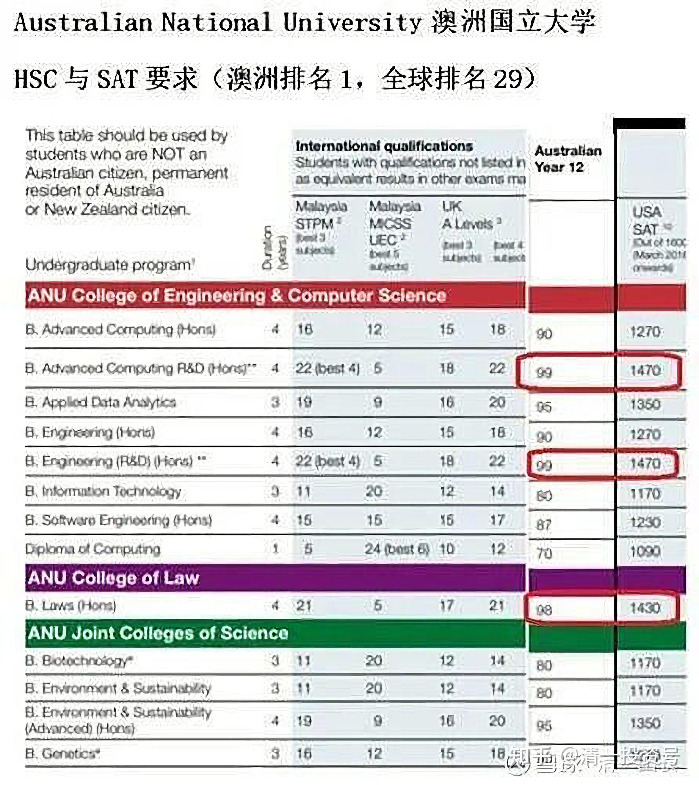
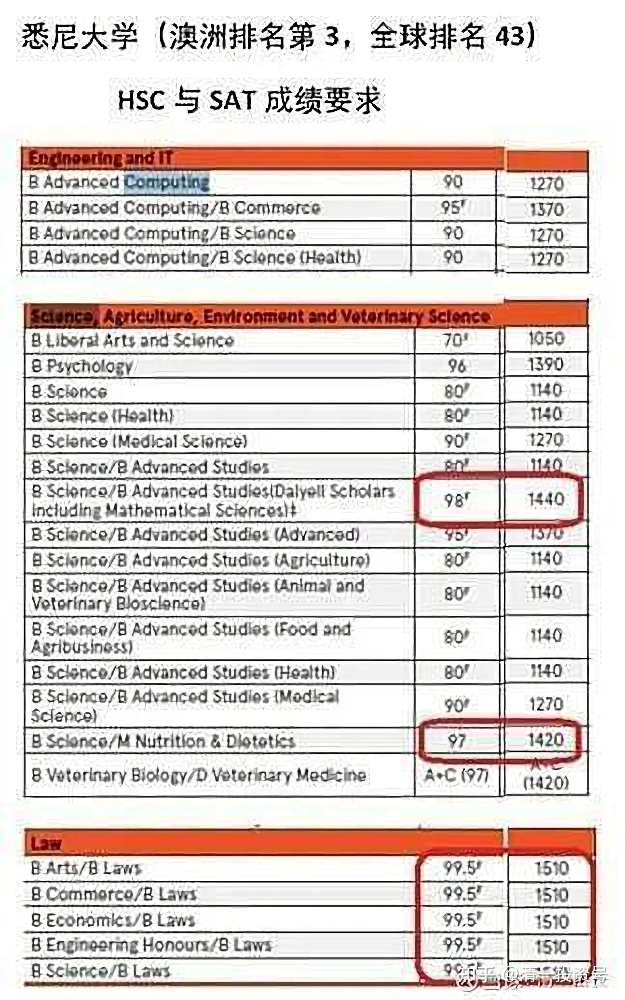
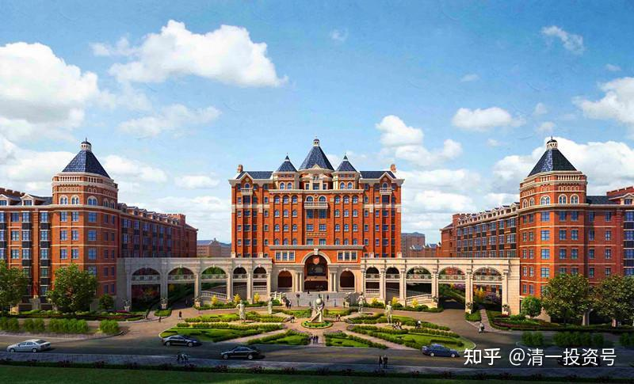
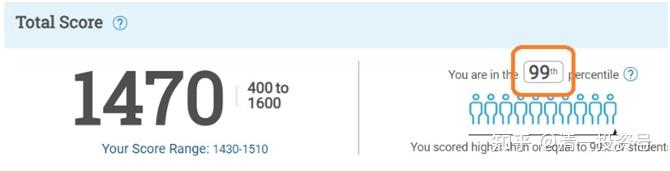
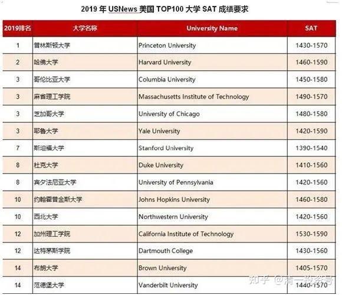
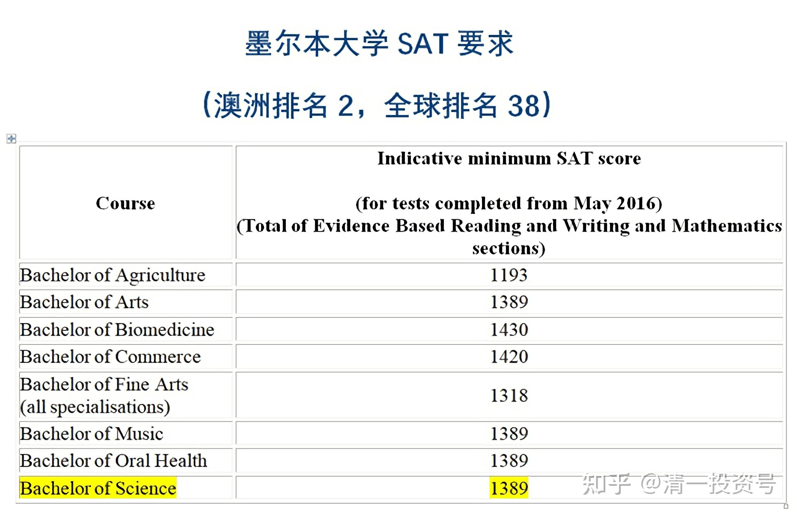
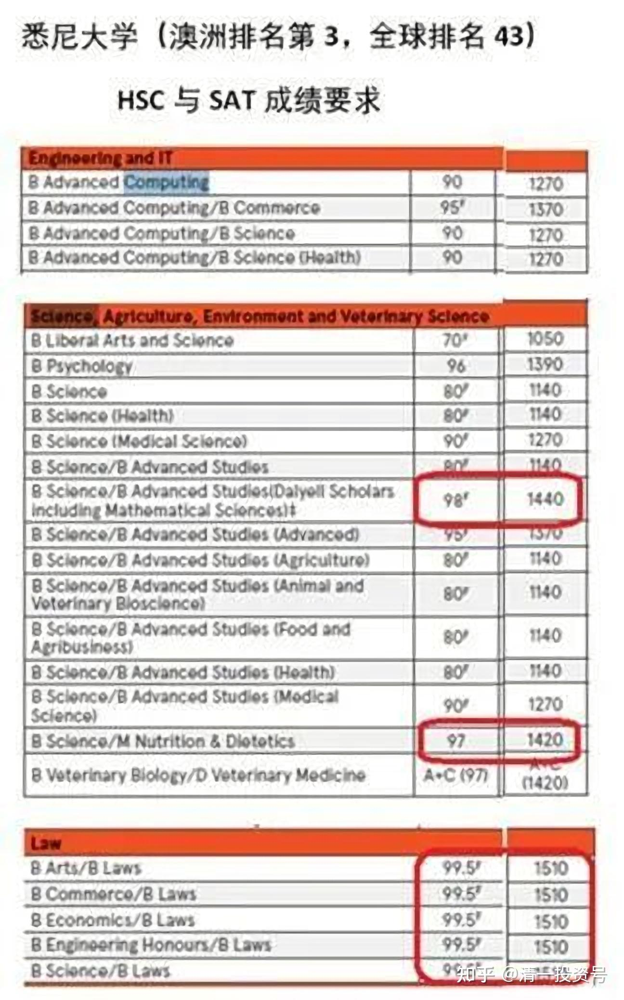
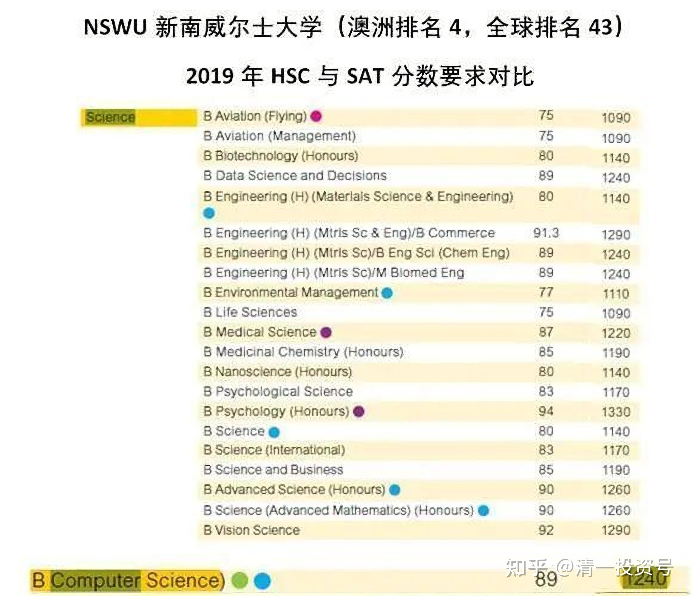

原雪球专栏[207篇.为何放弃澳洲顶尖中学学位，回国读今日高中？](http://link.zhihu.com/?target=https%3A//xueqiu.com/9310099567/198593549)

清一山长 2021年9月23日

今年的高中新入学学生中，有两个学生是从国外退学回国来上学的。其中一个还是已经入籍澳洲，很小就在澳洲长大的孩子。他回国读书，在澳洲的华裔家长们中引起一些比较强的波动，都觉得这家人是不是脑子有病？花费千万移民海外，追求的海外名校之路居然不走？家长到底在想啥呢？今年看到家长在高中家长群上发的说明，把她对于澳洲精英名校与今日高中，进行了一下比较。基本上就是：今日高中的上课内容和方式，跟澳洲相比有很多类似的地方，都很注意培养孩子的能力，还不是考试和知识灌输。但，**澳洲的这些学校，华人其实根本没啥地位，也得不到了白人能够得到的各种机会**。**就算跟着一起混，也很难融入**（就像黑人来中国上学，再努力，恐怕也无法获得我们自己中国人同样的职场机会吧？无形的天花板）。所以，作为中国人，她更愿意选择来上中国自己的精英学校。实际上，**今日系学校，能够达到的学术成绩，以及课外活动的挑战性难度，整体上，甚至要比这些海外名校还更高一些**。她相信完全符合她要给孩子找到世界上最好教育的标准。

不过，一个笑话是：今日高中的入学条件，比澳洲排名第一的大学都更难。这孩子是以15岁的年龄，考到了SAT官方考试1470分，外加半马体能考核合格，才好不容易拿到了今日高中（清一大学少年班）的入读资格。他想入读澳洲第一大学澳洲国立大学，也只需1170分，中位数1250分就可以入读了。以下就是这个大学的不同专业录取分数要求。最后一行是美国SAT考试的成绩要求，后面是著名的悉尼大学的入学要求。这学生除了最顶尖的法学和商科分数没有达到外，其他专业都完全符合要求——而且他才15岁。等于是今日高中，用西方顶尖大学的入学标准来作为申请条件，全世界还有第二所这样的高中吗？因此，我们说自己是第二？谁是第一？请你们告诉我们吧！

**[我为什么放弃国外优质的教育而回国上新教育？](http://link.zhihu.com/?target=https%3A//mp.weixin.qq.com/s/54tEmi5HXG1cIfL7YbjI1g)**

——澳洲顶级精英教育VS中国精英教育

李静盈

众所周知，澳洲是教育强国，属于世界顶尖的教育国家。11年前，为了给孩子更好的教育，我们一家移民到了澳洲悉尼。可是几个月前，在各国都严格封锁国境的情况下，儿子冲破种种障碍，冒着疫情的种种风险，一个未成年孩子独自一人又从澳洲回来中国，目的就是上今日新教育。

11年前，我们出国是为了孩子的教育，同样现在回中国，也是因为想要给孩子更好的教育。但对于我们这样的神操作，不了解我们的亲戚朋友表示大惑不解，甚至上星期还有同学家长在儿子原来就读的中学家长群里对我公开责问：真不明白怎么优质的澳洲教育资源不用，而非要自己在家教！很多国人通过各种渠道，花重金要把孩子送出国外留学，而我出国后不但自己在家教孩子，最近还跑回中国读书去了！那位家长毫不掩饰地认为我是个天大的傻瓜！

儿子原来就读的中学是澳洲新南威尔士州排名第一的男子公立中学（需要考试的精英中学除外），所以有不少学生是来自中国的国际留学生，大部分都是爸爸在国内提供经济支持，由妈妈陪儿子在这边留学。而儿子所在班级是该学校的精英班，老师、同学各方面挺不错的，提出责问的正是同班精英班的家长。

我们放弃澳洲优质的教育，而回国上今日新教育，其实原因很简单，就是因为**我们认为找到了最适合自己孩子的中国精英教育！**

我从2012年开始接触、学习新教育，对比了澳洲的顶级精英教育，发现今日新教育毫不孙色！而且更加符合我们的文化、语言背景。

首先来看看我所了解的澳洲最顶级的一所私立学校——Scots男校，这所学校创办于1893年，它是澳大利亚历史最悠久、最受尊敬的学校之一，同时也是澳洲收费最贵的几所学校之一，是很多澳洲贵族、政治、商业界成功人士选择的学校。并且提供住宿，仅学费加住宿费就要差不多40万人民币一年（国际生还要更贵一些），还没算上校服费、外出、课外各种兴趣爱好等等各种费用，一年大概50多万人民币是少不了的。

我的一位华人朋友的儿子在这学校上8年级。当时听到他介绍说今年疫情期间，他们学校9年级的孩子到一个边远的地方与世隔绝、全封闭训练学习半年，期间也与所有电子产品隔绝。因此，这个学校还上了当地的新闻。这是他们学校多年来特有的传统，全澳洲还有这种长时间户外训练的顶级私校就是著名Geelong Grammar School——查尔斯王子、传媒大亨默多克、马来西亚国王、泰国王子、澳洲总理等知名人士的母校。他们的封闭训练的时间还要更长一些，为期一年。我对这两所学校感到非常的赞叹，是澳洲甚至全世界对学生的精神品格、体能、毅力要求很高的顶级精英学校。同时，我发现这些顶级私校有很多理念跟新教育学校都比较一致。

**第一，精神品格的对比**。

从Scots男校的办学精神以及实际实践中，我看到了澳洲顶级的精英私校非常重视品格、纪律、毅力的塑造。这也正是新教育所重视的。所以，新教育对标的就是世界顶级的精英教育！大家可以来对比一下，以下是他们家长发表在媒体上对这个活动的原文描述：

“半年乃全封闭，无电视、手机和电脑，与外界通讯只能书信。贯穿着强体力训练，或是负重穿行于山野，或骑单车疾驰于崎岖山路。每日跋山涉水划舟，风里雨里，泥里水里，有些项目必须团队互助方可完成。其程度之惨烈，超乎想象，附上的视频可窥见一斑。”

我把这所学校的活动视频跟新教育公主预备班的涅槃视频放在一起来对比一下，是不是都挺磨练孩子的毅力和意志的？甚至比比看，谁的程度更惨烈？

【[Scots男校视频1](http://link.zhihu.com/?target=https%3A//v.youku.com/v_show/id_XNTgwODU0MjI3Mg%3D%3D.html)】

[https://v.youku.com/v_show/id_XNTgwODU0MjI3Mg==.html](http://link.zhihu.com/?target=https%3A//v.youku.com/v_show/id_XNTgwODU0MjI3Mg%3D%3D.html)

【[Scots男校视频2](http://link.zhihu.com/?target=https%3A//v.youku.com/v_show/id_XNTgwODYxODAyMA%3D%3D.html)】

[https://v.youku.com/v_show/id_XNTgwODYxODAyMA==.html](http://link.zhihu.com/?target=https%3A//v.youku.com/v_show/id_XNTgwODYxODAyMA%3D%3D.html)

【[公主成长记 Vlog#3：“凤凰涅槃计划”](http://link.zhihu.com/?target=https%3A//www.bilibili.com/video/BV1v54y1z7M8)】

[https://www.bilibili.com/video/BV1v54y1z7M8](http://link.zhihu.com/?target=https%3A//www.bilibili.com/video/BV1v54y1z7M8)

视频里他们也有团体抬木桩、团体抬划艇、徒步、骑车等等比较大运动量的活动。作为对外的视频，我相信他们已经把比较震撼的内容呈现出来了，在家长眼中也是超乎想象的惨烈了。同样的，新教育公主预备班的涅槃项目也是比较震撼的。并且公主预备班的孩子平均年龄比Scots男校的学生还要小2、3岁。

继续看看这所学校家长的原文描述：“半年结束后，只能靠徒步、骑车、划独木舟走完200公里的回程，需耗时数日。他们返回校园之日，就是英雄凯旋荣归之时，群情激奋，场面一时热烈空前，许多家长见到久别的孩子，会情不自禁泪洒校园。半年无间断，日复一日，周复一周的训练，心理、生理、毅力和耐力，皆经受极大的挑战。经历了一次次艰辛的考验和洗礼，学子们脱胎换骨，即便是娇里娇气弱不禁风的贾宝玉，也会变成血气方刚叱咤风云的男子汉！在随后的人生路上，就会敢于接受挑战，勇往直前，无往而不胜。”

新教育学校也经常带学生徒步几百公里，甚至两千多公里的也有，而且年龄小的孩子也走。如果Scots男校的六年中学阶段里只有半年的训练强度就能够让孩子们“脱胎换骨”，那么新教育日常比较多的体能训练贯穿于整个成长阶段，这样锻炼出来的孩子大概率也会很优秀。

再看一下“Scots男校的宣传片”与“新教育清一大学少年班的视频”对比，大家可以感受一下孩子们的精气神状态怎么样。

[【Scots男校宣传视频】](http://link.zhihu.com/?target=https%3A//www.tsc.nsw.edu.au/visit-scots/campuses/glengarry/)

[https://www.tsc.nsw.edu.au/visit-scots/campuses/glengarry/](http://link.zhihu.com/?target=https%3A//www.tsc.nsw.edu.au/visit-scots/campuses/glengarry/)

[【清一大学少年班】走进我们的日常生活](http://link.zhihu.com/?target=https%3A//www.bilibili.com/video/BV1Hr4y1K769)

[https://www.bilibili.com/video/BV1Hr4y1K769](http://link.zhihu.com/?target=https%3A//www.bilibili.com/video/BV1Hr4y1K769)

最后，是他们家长的心声：“我家幼子时年13，目前在year8,明年必欣然前往。我期望不高，半年下来，如能每天自行起床，能偶尔帮我除草剪枝，能经常在家里帮厨吸地，能少让他妈生几回气，我则心满意足矣。”

新教育很注重培养孩子们每天早起、锻炼、学习、做事，培养孩子主动承担责任，不怕苦、不怕累。例如，我15岁的儿子从新教育学堂学习一个学期后回到爷爷奶奶家时，爷爷激动地跟我通了一个小时的电话，大大称赞孙子很积极主动做事，搬、抬、扛，实在是不怕脏、不怕累。即使跟亲戚朋友相处时，也很愿意跟大家沟通，爷爷奶奶挺满意的。

由上述对比可见，在做事积极性与能力方面，以及精神品格方面，新教育的孩子不一定比澳洲最顶级的精英学校教出来的学生差。

**第二，华人孩子能真正融入西方的精英学校吗？**

即使进入了这种顶级的精英学校，我们华人的孩子、家庭能够真正融入吗？首先，请看这所学校的愿景与使命：

“在Scots男校，我们相信年轻人通过对上帝的敬畏和对耶稣基督的信仰，发现真正的智慧。我们教育的最终目的是帮助学生获得关于上帝、社会和世界的真理的知识，以便他们更好地准备在家庭和更广阔的世界中服务，荣耀上帝并造福人类。”

可以看到，基督教的信仰是这所学校的办学根基。事实上，澳洲前十名的顶级私立学校里面，绝大多数都是以宗教信仰为办学根基的。这个信仰很重要，就相当于新教育经常说的给孩子装发动机，有了发动机，孩子才能够自我驱动去努力、精进地学习、锻炼。而我们华人有多少家庭具备这种精神信仰的根基呢？如果没有，可能孩子难以真正融入、吸取学校教育里面精髓。例如，我的朋友没有宗教信仰，孩子反映学校里面的宗教课程就相当于中国的思想品德课比较沉闷，而这恰恰是这些精英学校的最核心的精神。

并且这样些顶级的精英学校，华人孩子非常少，甚至连其他的种族都很少，基本上都是白人孩子。种族、文化、社会地位上的差异，再加上一个语言的屏障，华人家长是否能够跟其他家长真正融入并构建紧密的关系圈子，孩子将来能不能真正加入他们的顶层关系网呢？恐怕很高难度。

另外，这些贵族精英学校，体育是最核心的内容和最重要的课程，而这恰恰是我们大多数华人孩子的弱项。例如，这里流行的橄榄球、水球、划艇等团体项目基本都是白人孩子参加。而华人孩子还是比较喜欢参加文静点的活动，例如我朋友孩子选择的就是国际象棋，或者某种乐器。

所以，能够符合以上重要条件的华人家庭非常的少。朋友反映，的确难以真正融入，基本上华人还是跟华人一起玩。虽然同学家庭都是非富则贵，甚至有不少神秘家族，但大家相敬如宾，互不干扰。

相反，我所认识的华人朋友里面有一位把孩子教育得很好，真正融入到高层圈子的。我认为最重要的一点是他们全家都有非常坚定的宗教信仰。这种信仰是深入到骨髓里面的，时时刻刻指引他们日常生活的大小事件。其次，父母本身就处在澳洲社会的上层圈子。妈妈移民澳洲二三十年，与西人一起经营跨国企业多年，英文已经是母语水平，有时候用英文表达还要比用中文表达来得轻松。而西人爸爸刚被澳洲政府授予“对人类生活有重大改革意义的发明家”的荣誉。他们所处的圈子是社会的上层精英，有牧师、律师、发明家等等。他们的婚姻家庭、交往圈子都是以坚定的基督教信仰为基础而紧密连接在一起的。

而大多数移民过来的华人，能不能达到信仰、种族文化、社会地位、语言等这些方面比较吻合的地步呢？如果没有，即使学校提供再好的教育，孩子恐怕也难以真正享用到。

所以，虽然承认这些顶级精英学校非常优秀，但我觉得自己达不到上面的这些要求，会很难真正融入。而**今日新教育要打造的是我们自己华人的文化上层，虽然没有统一的宗教信仰，但是共同追求的是为他人服务、传扬中华文化、为世界创造价值的价值观**。无论是语言还是文化背景，我们都可以真正融入，可以一起建造有共同理想追求的平台。

**第三，学习成绩的对比。**

在学习成绩上，新州的中学是按照达到高考优秀率即90分以上的比例来排名的，Scots男校的优秀率是22.6%，排名63，我儿子原来的学校优秀率19.6%排名76。大多数的顶级精英学校成绩排名处于20～70名之间，高考优秀率在20%～30%之间。因为澳洲的大学也接受美国高考SAT成绩，SAT 1250分的成绩等同于高考90的优秀分。就是说：Scots男校100名学生里有22名学生可以达到高考的优秀分。而新教育已经有大量的孩子可以拿到SAT 1400分（即高考95分）以上更高的成绩了。我自己的孩子使用新教育的方法，通过不到一年时间，不到14岁，第一次SAT考试就拿到了1470的分数。请参考我之前写的一篇文章《[澳洲7年级学生新教育学习1年考到美国SAT 1470分](http://link.zhihu.com/?target=https%3A//mp.weixin.qq.com/s/Mf6UoGbvOB-swfK9NPwNLQ)》

[https://mp.weixin.qq.com/s/Mf6UoGbvOB-swfK9NPwNLQ](http://link.zhihu.com/?target=https%3A//mp.weixin.qq.com/s/Mf6UoGbvOB-swfK9NPwNLQ)

所以，从成绩上看，新教育的孩子同样可以拿到澳洲顶级精英学校一样优秀的成绩，并且所需的时间短得多。

综上所述，**在精神品格、学业成绩、体育体能等各方面，中国的精英教育——今日新教育一点也不逊色于澳洲顶级的精英教育！**并且，**今日新教育对于我们来说是投入最少，但最符合我们文化背景的教育。感恩山长创办的今日新教育，为我们中国的精英教育而自豪！**

（以下内容为编者收录）
**评论回复：**

[@长风漫步](http://link.zhihu.com/?target=http%3A//xueqiu.com/n/%25E9%2595%25BF%25E9%25A3%258E%25E6%25BC%25AB%25E6%25AD%25A5)回复[@清一山长](http://link.zhihu.com/?target=http%3A//xueqiu.com/n/%25E6%25B8%2585%25E4%25B8%2580%25E5%25B1%25B1%25E9%2595%25BF)：

今日高中在哪些城市？

清一山长[2021-09-23 22:55](http://link.zhihu.com/?target=https%3A//xueqiu.com/9310099567/198594847)回复[@长风漫步](http://link.zhihu.com/?target=http%3A//xueqiu.com/n/%25E9%2595%25BF%25E9%25A3%258E%25E6%25BC%25AB%25E6%25AD%25A5)：

别问了。凡是要问的人，都是考不取的，问了也白问。因为**今日高中虽然是15岁入学，但学业要求，体能要求，比澳洲第一的大学还高。不学新教育的人，基本没有可能考取。**[大笑]

[几千越甲](http://link.zhihu.com/?target=http%3A//xueqiu.com/n/%25E5%2587%25A0%25E5%258D%2583%25E8%25B6%258A%25E7%2594%25B2)回复[清一山长](http://link.zhihu.com/?target=http%3A//xueqiu.com/n/%25E6%25B8%2585%25E4%25B8%2580%25E5%25B1%25B1%25E9%2595%25BF)：

这个真了不起[很赞]。但是，今天哪里看到消息说，民营学校两年内要统统转为公立，否则关闭。消息很混乱，不知真伪。猜不到将要搞什么，很有点为儿子担心。

清一山长[2021-09-24 00:08](http://link.zhihu.com/?target=https%3A//xueqiu.com/9310099567/198600001)回复[@几千越甲](http://link.zhihu.com/?target=http%3A//xueqiu.com/n/%25E5%2587%25A0%25E5%258D%2583%25E8%25B6%258A%25E7%2594%25B2)：

**有啥好担心的。在家里跟学示范班课程就够了。总不能教育局到你家里去抓人上学吧？[大笑]对这个政策，我们几年前就预判了这种可能性，对此早有防范，所以我们不在国内办学。惹不起，我们还可以躲得起。不至于死拼硬抗的，犯不着。道家如水。**

[黄红珍](http://link.zhihu.com/?target=http%3A//xueqiu.com/n/%25E9%25BB%2584%25E7%25BA%25A2%25E7%258F%258D)回复[清一山长](http://link.zhihu.com/?target=http%3A//xueqiu.com/n/%25E6%25B8%2585%25E4%25B8%2580%25E5%25B1%25B1%25E9%2595%25BF)：

感恩老师慈悲大爱引领唤醒我这已经绝望、冰冻、麻木不仁的灵魂！我是文中黄姓家长！

说说我自己的经历：我2000年在北京五道口小区开小超市创业，小区住的都是北京名牌大学的家庭（北京本地家庭学区房，孩子从上幼儿园就能选择：上清华还是北大，当然我家族亲戚的孩子也有这待遇），还有租房住陪读的名校家长，海外留学人士。这群享受着中国最高、最好教育资源的人们，以简单轻松的生活方式相处了6年，可能是我人随和，爱管闲事帮助大家，北京海淀区的家长也不嫌弃我读书少，经常有家长到我的超市跟我拉家常聊天。还有家长很信任我，孩子没有人接时，请我帮忙接到超市写作业学习，我就有了近距离感受名校孩子们的精神状态、学习状态、为人处事的态度……。几年时间，让我大开眼界，细节不再赘述。当年21岁的我，有了一个思考：我将来除非不结婚，不生孩子。如果我结婚生了孩子，我的孩子怎么教育呢？后来我生了孩子，就瞎摸索教育。幸运的是：我不是全职妈妈，我也有自己的事业，我还乐意接受不同教育方法，但是我有点聪明，所有教育理念，我自己先体验感受以后，我才会相信能不能让孩子去那里。

最大的孩子5岁那年，我考察读经学堂，我自己交费7800元体验了7天，我就决定不能让孩子去，我害怕看到读经学堂孩子那苍白无力的声音，真话不好听，我说得真实点儿：有的孩子读经声音是无病呻吟那种反抗，有的孩子是人要断气时那种绝望声音……孩子目光呆滞，冷漠……看人、看书、看物眼珠都不转动的……看到那些孩子们样子，我心痛死了，那是我无力帮助家长。但是我种下了必须要寻找真教育的想法。后来孩子们上学，我只关注孩子的身心健康，我从来不关注孩子的分数，不逼孩子们学习，任何培训班我都没有给孩子们上过。孩子们的作业我从来不关心，我经常被老师点名批评说：我不知道给孩子啥啥的签字，我的孩子自己签我的姓名，我跟孩子界限清晰：学习是孩子自己的事情，我能接受孩子不上学在家里教育。我周末时间带孩子做家务，做饭，去敬老院，孤儿院做义工，孩子大了，我组织企业家周末演讲锻炼孩子们策划能力……上学、放学我们家庭成员接送，不给孩子带零花钱，避免了学校门口垃圾食品残害。

在我没有遇到新教育之前，我是这样带孩子的。应该是不用心的家长。我的大孩子2018年9月份自己考上的当地一所排名前三名的高中，这三所学校为了抢优质生源，给我家奖学金让孩子去上学。最后考虑到孩子身体健康，选择家门口高中，从家到教室10分钟。孩子一日三餐，午休都在家里。高中上了56天以后，我发现孩子的眼神不对，有点呆滞，回家也不说过一脸的茫然……我洞察到孩子心里有事儿，孩子们跟我说了很多很多以她年龄认知范围内的看法，也就是她看到的老师和同学们的事情真相。我给孩子说，你可以退学，咱们上社会大学，我就是上大学泡出来的走脑子人。咱们不是只有上学一条路。

真正关心孩子心灵的人福气好啊！2019年春节家族聚会，亲戚就给我分享了清一山长的博客电子版本4000多页，亲戚说自己8岁儿子从南京最贵、最好的小学退学，去上新教育学堂了。我跟她们有很多关于教育话题，我也很信任她们。我问她怎么学习新教育？她说先读清一老师的博客，4月份南京有几场新教育分享会，我可以带着老三一起过去南京了解，见新教育学堂堂主、老师、孩子们自己了解。我就是那个傻人傻福的人儿，我说干就干，从读山长第一篇博文我就被吸引，对《为什么自办学堂》的十几篇博文读了11遍，每天最少5个小时时间读博文，先自己理解搞明白。我43天把清一山长写的4000多页PDF版本的博文认真读了7遍。到南京参加新教育分享会学习，还需要家长提前写作业才能到现场学习，感恩老师严厉要求，我用了9天时间阅读理解作业的文章，学习成长也是付出越多收获越大嘛。2019年4月份我带着老三到南京近距离跟新教育学堂的堂主、老师、学生交流学习一个多月，我的小儿子说：很喜欢学堂的伙伴儿，问我能不能送他到那里上学。我相信孩子真实表达，我已经清晰，我遇到了真教育，孩子喜欢的教育。回家就跟家人商量孩子们到学堂学习。

2019年9月份：老大是女儿从高一退学进入新教育学堂学习已经2年了，18岁她可以养活自己了。老二是儿子，不相信姐姐的体验，说女生跟男生的体验不一样的，他目前还要体验重点高中的生活学习，今年刚考上高中正在新鲜着呢，我尊重孩子的选择，让他体验。老三进入学堂学习了2年多了，孩子开心喜悦的生命状态我很满意！

清一山长[2021-09-24 07:36](http://link.zhihu.com/?target=https%3A//xueqiu.com/9310099567/198608184)回复[黄红珍](http://link.zhihu.com/?target=http%3A//xueqiu.com/n/%25E9%25BB%2584%25E7%25BA%25A2%25E7%258F%258D)：

还有你这种家长？很稀少，但很聪明。你比这些北京的大教授、大专家们聪明多了。你懂真正的学问——**学会问，学会观察和思考。你也活得很真，把生活当做最重要的教育，把社会当做课堂。这种人才是真实的活着。其他人活在概念里**。这种观念，导致你的孩子也热爱学习，自己学习，不是你逼的。**家长总以为自己是“太后”，天天逼孩子学习。能逼出来的，就是一堆没用的奴才，或者是“起义者”，都不是自由人！**

北京也有很聪明的家长，很早就送孩子来今日学堂上学了。马上就高中毕业，可以考上世界前50名的大学。可**家长要求：能否来清迈上混个大学文凭（泰国第三的大学），但希望我继续辅导他们学习传统文化。家长知道大学啥文化都没有，只有一个文凭可能有点用。**

斐波那契中线回复[清一山长](http://link.zhihu.com/?target=http%3A//xueqiu.com/n/%25E6%25B8%2585%25E4%25B8%2580%25E5%25B1%25B1%25E9%2595%25BF)：

能把一个奇葩特例解释得如此“高大上”,佩服佩服！

清一山长[2021-09-24 07:48](http://link.zhihu.com/?target=https%3A//xueqiu.com/9310099567/198608644)回复斐波那契中线：

能用一片树叶，就把自己的眼睛遮起来，这种人，我是真的很佩服。

**每年达到今日高中(清一大学少年班）的招生标准的学生，不是只有一人，每年都有几十人。几年后就是上百人。这个入学标准，明显高于这些世界前50名的大学。家长全是有实力出国留学的家庭。不送孩子出国，却偏偏争先恐后的把孩子送到今日读书。只有瞎眼了，才看不见。**

当然，**最终大部分孩子，18岁后必须出国留学**，因为他们不能光学本事，还要一个打工证。我虽然也有打工证可以发，**只是我的打工证发的很少，目前仅限于新教育范围有用。更多的人只能到全世界就业，必须拿世界打工证。**至于我发的打工证，值多少钱？你去问清粉圈：一个清一弟子的年薪，可以拿到多少就知道了。这是985名校的学生，无法创造的记录。替您拉黑我了[加油]。看不上，觉得是骗你的，就别来这里混日子，别浪费您宝贵的时间。走你[火箭]。

[@H兄的投资人生](http://link.zhihu.com/?target=http%3A//xueqiu.com/n/H%25E5%2585%2584%25E7%259A%2584%25E6%258A%2595%25E8%25B5%2584%25E4%25BA%25BA%25E7%2594%259F)回复[@清一山长](http://link.zhihu.com/?target=http%3A//xueqiu.com/n/%25E6%25B8%2585%25E4%25B8%2580%25E5%25B1%25B1%25E9%2595%25BF)：

我担心示范班被封网。还是自己先跟着学习吧！

清一山长[2021-09-24 12:46](http://link.zhihu.com/?target=https%3A//xueqiu.com/9310099567/198652759)回复[@H兄的投资人生](http://link.zhihu.com/?target=http%3A//xueqiu.com/n/H%25E5%2585%2584%25E7%259A%2584%25E6%258A%2595%25E8%25B5%2584%25E4%25BA%25BA%25E7%2594%259F)：

很难说，昨天复旦大学举办的《白鹿原》小说赏析网上直播，开播24分钟后就被封杀掉。所以，今日示范班，将来也许也会被封杀，我们就只能转移到外网，油管上去了。但：你们就没有办法学习了。**趁这些东西还在的时候珍惜吧！以后花钱也买不来了。也许有人会把我们发布的东西都转录下来，以后你们花钱去买**[大笑]

摩托牛拉回复清一山长：

关注清一老师N年了。日常老师谈股票的时候，感觉还是个不错的投资者。但说教育的时候，还有些大篇幅粉丝回帖的，总感觉是个教育骗子+托的演戏..为啥在投资论坛说自己的教育机构？？[吐血][吐血]

清一山长[2021-09-24 12:48](http://link.zhihu.com/?target=https%3A//xueqiu.com/9310099567/198652952)回复摩托牛拉：

您的回复，让我想到了苏东坡和佛印和尚的对谈[大笑][大笑][大笑]

半路扫地回复清一山长：

是朱永新老师的新教育吗？

清一山长[2021-09-24 12:56](http://link.zhihu.com/?target=https%3A//xueqiu.com/9310099567/198653612)回复半路扫地：

朱老师的新教育规划，现在还是一张没有人执行的蓝图，连他自己都没有让孩子去真正执行出来。还停留在他的理想中，或者是做一点“补充扩展阅读”。**我的新教育，是清一新教育，目前已经延伸到大学本科阶段了。以后还有研究生、博士阶段的新教育。因为他是秀才，我是武士。我不懂文，不懂大纲，我只管动手做！**[加油]

LYUB回复[清一山长](http://link.zhihu.com/?target=http%3A//xueqiu.com/n/%25E6%25B8%2585%25E4%25B8%2580%25E5%25B1%25B1%25E9%2595%25BF)：

私立转公立政策已经明确，很快就实施了。

清一山长2021-09-24 13:17回复LYUB：

已经在实施了，不是“准备实施”。大量投资上亿的民营学校，校长们正在哭着“志愿捐献”给国家，支持公立教育。可能只会留一点点用来装门面的民营学校，或者特殊教育的学校。未来是文化统一，教育统一的时代。就不知道会不会台湾也一统[大笑]。

清一山长[2021-09-24 17:08](http://link.zhihu.com/?target=https%3A//xueqiu.com/9310099567/198688428)回复[H兄的投资人生](http://link.zhihu.com/?target=http%3A//xueqiu.com/n/H%25E5%2585%2584%25E7%259A%2584%25E6%258A%2595%25E8%25B5%2584%25E4%25BA%25BA%25E7%2594%259F)：

刚刚看到消息：周口市淮阳区教育体育局以红头文件方式，正式公布淮阳第一高级中学按公办学校进行招生。河南省淮阳第一高级中学是一所规模较大的民办完全中学，现有教职员工1300人，在校生两万多人。还有，四川眉山天府新区嘉祥外国语学校，还没等到9月1日开学，已经被要求转设为公办学校。再大的规模、再多的学生，都要按照国家规定执行。

**国家此举的好处，堵住了一些教育界的利益集团，假公济私的漏洞。所以民心还是很拥护的。**

至于会不会影响民办教育的特色？应该不会，我也没看到中国的民办教育有啥特色。除了判定为非法办学的读经教育之类的。**其他正式批准成立的学校，不管公办、民办，都是教育局严格管理的，都是教材统一，教学规范一致，教育目标一致的，都是要参加高考。所以，全国一盘棋，本来就没有啥民办教育的特色。**

所以，我个人认为，总体来看，**民办教育转公办，的确是降低了老百姓的压力和负担。当然，一些需要优质教育资源的家庭，因此也将无路可走。少数家庭可能会转向海外学校，极少数人，估计会因为体制的路堵死了，不想齐步走的人，会不甘心地选择清一新教育（我们其实也算海外的学校了）。大多数家庭将躺平，对这个政策无意见地执行。教师由于失去了额外的私立利益（更好的私立工资和待遇），也开始放松混日子，大家都躺平。但孩子们起码不受罪了[献花花]。**

附录：**[澳洲7年级学生新教育学习1年考到美国SAT 1470分](http://link.zhihu.com/?target=https%3A//mp.weixin.qq.com/s/Mf6UoGbvOB-swfK9NPwNLQ)**

[https://mp.weixin.qq.com/s/Mf6UoGbvOB-swfK9NPwNLQ](http://link.zhihu.com/?target=https%3A//mp.weixin.qq.com/s/Mf6UoGbvOB-swfK9NPwNLQ)

李静盈 合一塾 2020-10-17 16:19

一年前，把成绩比较普通，从小也没有经过任何补习的儿子从澳洲学校接回家，运用新教育的方式，经过前后快要一年的学习备考，13岁的儿子（考试时的年龄）终于在今年9月份顺利参加了他第一次的SAT考试，拿到1470的分数。

（图1，这分数在亚太区全部考生的前1%）

**这个分数大概是什么概念呢？**

以下是美国前十几名大学的大概SAT分数要求，供大家参照一下：

从上面可以看到，1470从成绩要求来说是符合大多数美国前十几名大学的要求。

**那澳洲大学的录取要求是什么呢？**

为大家提供一下我向澳洲前四名大学了解到的录取情况：他们都接受SAT的分数，各个专业有相对应的SAT与本地高考的对应分数。可参考以下这四所大学的SAT分数要求与本地高考HSC分数对照。原文件比较详细，我只是截取了一些可能感兴趣的专业。在网上也很容易找到每个大学各个专业的详细分数要求。

从各个大学的分数对照表上看到，SAT 1470的这个分数相当于澳洲高考HSC的99分，这是一个很高的分数了，基本上澳洲前四名大学的所有专业都能考上了，除了极个别高分的法律专业。澳洲的本地学生为了拿到HSC 95分（相当于SAT1380）以上，往往都要拼命补习几年，并且补习费用特别高，一般都要好几百人民币一小时。几年的补习花费十几万人民币是很普遍的，并且要花费很多的时间上课、做作业，往返交通。

澳洲大学录取的条件是学术成绩（本地高考、SAT、或其他国家考试成绩）加上一个12年级的毕业证书就可以了。这个12年级的证书可以是各个国家的12年级毕业证，例如中国或澳洲的。澳洲的12年级毕业证可以通过完成一个在家学习机构的学习就可以得到，不一定要到学校去。

一年前从澳洲学校退学出来时，只是把这次备考SAT当做是一次试验，看看在澳洲能不能按照新教育的方式去短期突破SAT，没想到，乖乖地按着山长去做，效率会这么高，效果会这么好！感恩山长开创新教育！

**通过这几年学习、践行新教育的历程，有两点我觉得最重要：**

1、我属于比较笨的那种，无论看多久山长的博文，如果没有参加山长的清心课、心理行为课以及今日夏令营的观摩，我是根本不会有勇气踏出教自己孩子的第一步。

2、如果仅仅是我自己一个做，我也很容易变得没有能量，不能前行。庆幸的是我加入了合一塾，这是一个大家都真正用心学习、践行新教育的大家庭。这次SAT突破，是整个合一塾团队的全方位帮助和支持出来的成果！所以，我觉得加入一个有共同目标的团体很重要。

最后，再次感恩山长创办新教育，为我们研究、开创各种最高效率的突破方法！感恩今日团队提供丰富的免费资源！
