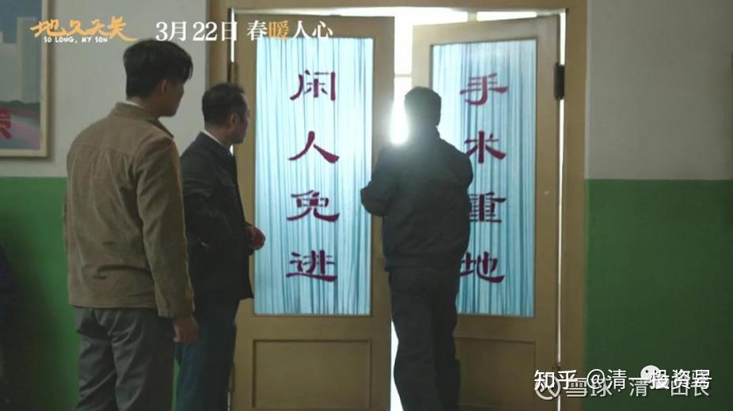
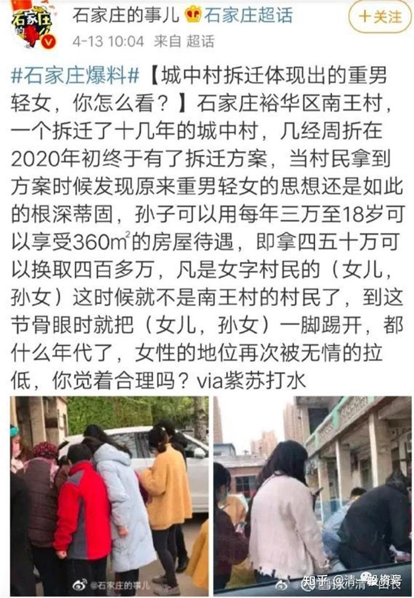
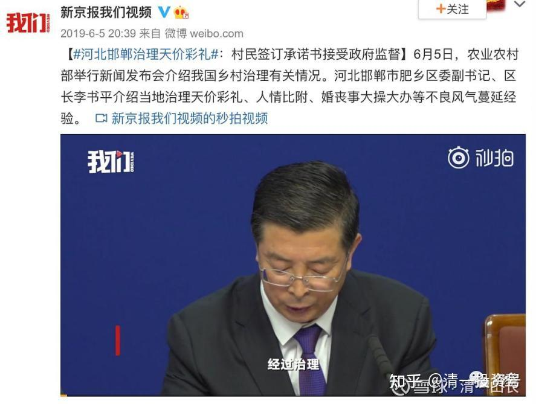

[原雪球专栏](https://zhuanlan.zhihu.com/p/592109504/edit)[215篇.重男轻女给我们社会带来了什么结果？](http://link.zhihu.com/?target=https%3A//xueqiu.com/9310099567/199485659)

[清一山长](http://link.zhihu.com/?target=https%3A//xueqiu.com/9310099567/column) 2021年10月6日

重男轻女的习俗，给你轻视的女生，带来了多大的压力？给你重视的男孩，带来了多大的灾难？**天道的道理，就是平衡。歧视他人，最终导致的是自己被歧视！**这篇文章，太值得一读了——我特别希望我们学堂的家长们，宠男生宠得一塌糊涂的男生家长们，要好好思考你的所作所为了，也许将来最让你打脸的，就是你重男轻女的思维！

引言：我爸妈都是小学老师，在他们从业的这三十余年里，最后能顺利读完高中、考上大学、离开我们县的人几乎都是女生，男生大部分会在小学升初中时流失一批，在初中升高中时再流失一批，等到考大学时，小学里的一个班能最后剩下一到两个男生已经算是罕见。“**以为可以靠自己的生殖器就优越于女生的男生们，最终遭到的居然是这种完全被漠视的打击**”。

转发原文：微信网页链接：[县城里的蝴蝶效应](http://link.zhihu.com/?target=https%3A//mp.weixin.qq.com/s/Sx62F-GroDiI3CnCdWdHew)

[https://mp.weixin.qq.com/s/Sx62F-GroDiI3CnCdWdHew](http://link.zhihu.com/?target=https%3A//mp.weixin.qq.com/s/Sx62F-GroDiI3CnCdWdHew)

梅骁 2020-10-26 11:42

最近，我回了趟老家，在和我妈聊天时，得知现在在老家正发生着一个很奇特的现象。

那就是在近几年里，老家出现了大量单亲家庭，而且这些单亲家庭几乎无一例外都是由一个年轻的爸爸加一个年幼的孩子所组成，其数量已经远超过正常范围，大有成为县城家庭构成的一支中坚力量的趋势。

因为对这个现象的疑惑，我在老家四处走了走，和老友、亲戚聊了聊这件事，没想到一聊之下，竟发现了一个跨越三十余年的、严丝合缝又曲折离奇的蝴蝶效应。

我的老家新河县是石家庄和邢台交界处的一个县城，面积小，人口少，历史上曾经多次被并入周边县城，后又多次被独立出来，也因此在经济发展上始终没有能跟上时代的脚步。

在很长一段时间里，我们县的经济发展水平都在河北省排名倒数第一，直到2019年，新河县才被正式批准退出国家级贫困县的名单。

来自百度百科

经济发展的落后导致了很多政策执行和意识形态上的滞后，比如，计划生育，比如，重男轻女。

1982年，计划生育正式成为我国的基本国策，从上世纪八十年代到九十年代，计划生育政策的执行是非常严格的，电影《地久天长》里那种妇女干部苦口婆心、连恐吓带威胁地劝说已婚已育妇女去做流产，不然就会被开除公职，是极为常见的事情。

可政策执行到下属县城、下属农村时，就遇到了相当大的阻碍，因为这里的人们都还是想要生儿子，很多非公职家庭宁愿交罚款，也要继续生，直到生出儿子为止，或者在明知政策已经不允许的情况下，依然要找关系提早知道胎儿性别，如果是女儿，就会去做流产手术。

到九十年代初，在我老家就已经出现了“如果第一胎是女儿就允许再生一胎”这样的对策，当然，如果第二胎仍然是女儿，那就不可以继续生了。

这就导致了一个后来我们很常见的现象，就是每个家庭里，要么就只有一个儿子，要么就有几个女儿和一个儿子。

所以，在进入2000年后的县城婚恋市场上，男性都还是占据着绝对的主导地位的，甚至直到2010年前后，情况都依然是如此，因为适婚女性的数量事实上是高于适婚男性数量的。

毕竟从理论上来讲，在“要么只生一个儿子，要么连生几个女儿，直到生出儿子”这种生育观念和生育现实下，县城里是不会出现我们后来都知道的“女少男多、比例失衡、以致出现大量单身汉”这一现象的，或者，至少不会这么快就出现。

但一个从河北这个省份的地域性格而来的原因，导致这个现象加速出现了，那就是“中庸”，那就是不走极端。

男女比例失衡的首要原因，当然是“都想生儿子”这一理念，导致下一代的男女比重已经开始了缓慢的失衡，但还有一个几乎同样重要的原因，那就是新河县乃至河北省“一定程度上重男轻女却又不是极端重男轻女”的思想现状。

如果是极端重男轻女地区，那女性根本就不会有接受教育的机会，更不要说考上大学、离开老家，她们一开始就会被困在老家。

如果是完全不重男轻女的地区，那男女接受教育的机会是均等的，考学离开和留守老家的概率也是均等，那也就会减缓男女比例失衡的出现。

可我的老家这两样都不是，它和河北这个省份一样，维持着一以贯之的“中庸”。

平心而论，新河县绝不能算是一个极端重男轻女的地区，新闻报道和影视剧集里常出现的那种疯狂压榨女儿以资助儿子的情况在这里是几乎没有的。

而且即便经济发展落后，但毕竟地处平原，靠务农也是可以保证基本的收入和生活的，那种因为没钱就决定不供养女儿继续升学念书的情况，也是很少见的。

可新河县、河北省也绝对不能算是一个男女平等的地区，直到今年上半年，石家庄周边的农村都还会出现“拆迁后只给男性分房、不给女性分房”这类新闻。

它有重男轻女的陋习，同时又接受一部分现代思想，某种程度也认为不应该重男轻女，所以就出现了这种“一定程度上的重男轻女”。

不要小看这个微小的区别，就是这个区别导致了后来发生的剧烈变化。

这种“中庸”而纠结的重男轻女体现到具体生活中，就是虽然不会有激烈的差别对待，但**对家中儿子的宠爱程度和培养程度是要明显高于女儿的。**

儿子要念书、要升学，家庭是绝对要支持的；女儿要念书、要升学，家庭虽然会有犹豫，会有些不心甘情愿，可大部分家庭也都是愿意出钱供的，大部分家庭所抱持的态度都是“既然你愿意上，那我就尽量供”。

虽然我们总说“论迹不论心，论心无完人”，可这种心态上和行动上细微的差别对待，却直接导致了一个家里儿子和女儿对待“念书、升学、考大学”这件事的态度是完全不一样的。

女儿们深知自己家庭地位不如儿子们，为了能拥有一个更好的前程和人生，大部分女生都会选择竭尽自己所能地好好读书，因为她们知道这几乎就是她们唯一、也是最好的选择，如若不然，她们就只能留在这个国家级贫困县里，早早结婚生子，早早为人妻、为人母。

我爸妈都是小学老师，在他们从业的这三十余年里，最后能顺利读完高中、考上大学、离开我们县的人几乎都是女生，男生大部分会在小学升初中时流失一批，在初中升高中时再流失一批，等到考大学时，小学里的一个班能最后剩下一到两个男生已经算是罕见。

因为对于家中的儿子来说，“念书、升学、上大学、离开这里”并不能算是最好的选择。

在那种虽不极端但渗透到生活各处的重男轻女氛围里，**大部分家庭的儿子都是在有意无意中被宠爱长大的**，那是一种不显山、不露水，但又切实存在的宠爱氛围。

比如，婚丧嫁娶的很多环节都只有家中男丁可以参加，比如，至今为止，都还有“家产不必分给女性”的陋习。

于是，在这种氛围里长大的男性的眼中，不升学、不念书也一样可以活得很舒服，考大学、离开老家并不是一个很有诱惑力的选项，相反，在父母长辈的庇佑下，留在县城里生活，反倒成了一个自然而然的舒服选项。

就这样，进入2010年以后，随着年轻一辈里大量女性的考学离开，选择留在县城里生活的适婚男性发现婚恋市场的天平开始倒向另一边了，他们不仅越来越难娶到妻子，而且即便有合适的人选，女方所要求的彩礼也开始一年高过一年，从几万到十几万，甚至二十万、三十万，都成了被摆到桌面之上的数字。

去年，我们县一个镇小学的未婚女老师出车祸去世了，葬礼一周后，就有一户人家找上门来说亲，要给他家去世的儿子配冥婚，当时给出的彩礼是二十万。

冥婚尚且如此，更不要说普通活人的婚事。

因为计划生育政策，导致很多家庭只生儿子、不生女儿，导致了县城男女比例的失衡，又因为潜移默化的重男轻女氛围，导致大量女性都拥有了奋发努力、念书考学、离开这里的觉悟和动力，这进一步加剧了这种失调。

于是，适龄单身男性的数量开始远高于适龄单身女性，也因此，结婚所需彩礼也开始随之水涨船高。

事情发展到这一步，依然没有超出我们的想象，这终归是一个被报道过很多次的男女比例失衡、单身男性增多问题。

但接下来的发展，却超出了所有人的预料。

当一个县里出现了大量适龄单身男性，他们二十岁出头，却找不到适龄单身女性来谈恋爱，更不要说结婚，他们不甘心于一直单身，却只能一次又一次地在相亲市场上受挫，他们会怎么办？

他们把目光投向了已婚女性，在长期的荷尔蒙的冲动和压抑里，道德与否、出轨与否，都成了无关紧要的东西，他们开始拼命寻找机会去追求已婚女性，其程度之热烈、态度之诚挚远超出了人们的想象。

一边是热情似火的年轻男性，一边是相看两厌的自家老公，对于这些女人们来说，这并不是一个很难做出的选择。

她们中大部分都是那些没能考上大学、离开老家的女生，有的高中毕业，有的初中毕业，她们早早就出来打工赚钱，然后在家庭的催促下，还没有认清自己真正想要什么样的人生，就稀里糊涂地早早进入了婚姻，生下了孩子。

她们有的在超市做收银员，有的在眼镜盒厂糊眼镜盒，有的在纺织厂做工人，有的在服装店卖衣服，她们几乎从来没有被如此热烈诚挚地追求过，用她们的话说，那是她们人生头一次知道被热烈地爱着是什么滋味。

虽然这热烈的爱其实来自一个并不健康的源头，但那又有什么大不了的，爱终究还是爱。

于是，开始有大量已婚女性选择了离婚或者私奔，有的还留在本地，有的则直接跑去远在天边的外地，让你连人都再也见不到。

在这种态势下，有不少丈夫开始紧紧看着自己的妻子，上下班都要跟着，散步买菜也都要跟着，外出打工更是要跟着，他们生怕自己好不容易娶到的老婆会被哪个年轻男人拐跑，可即便如此，也依然没能挡住更多妻子的出走。

于是，在经历了大面积的离婚后，就出现了这么一个奇特的现象：年轻一辈里的完整家庭开始迅速减少，大量家庭都由一个单亲爸爸和一个孩子组成，而妈妈早已经离开，甚至跟着男友远走他乡。

这是一个所有人都没料到的走向。

因为计划生育，大家又都想要生儿子，所以男女比例开始失调。

**因为重视男性、轻视女性，导致男性在娇惯中选择留在县城，女性则奋发图强地走向城市，所以男女比例进一步失调。**

因为男女比例失调越发严重，所以适龄单身男性找不到适龄单身女性恋爱结婚，于是他们就开始热烈地追求已婚女性。

因为在重男轻女的氛围中长大，所以已婚女性大多也都并没有真正感受过被爱、被珍惜，所以当面对热情似火的年轻男性和相看两厌的自家老公时，不用多么艰难地纠结，她们就做出了自己的选择。

于是，大量女性选择了离开。

而离婚后独自带娃的男性在如今的县城婚恋市场上就更没有了任何优势，于是，他们就只能继续单身。

这样一环一环地扣过来，就导致了“一个单亲爸爸加一个孩子这类家庭的规模开始越发壮大”这一奇特现象在县城中的出现。

当年执行计划生育政策时，当年决定流掉女胎、保留男胎时，当年决定宠爱儿子超过宠爱女儿时，那些人一定想不到这种种选择和决定，最后导致了如今的离婚率飙升和单亲爸爸家庭的大量出现。

一个又一个选择和决定，最终导出了一个完全没人料想到的未来。

那现在这个“大量由单亲爸爸抚养长大的孩子”的现状又将会导向一个什么样子的未来呢？

没人知道，也没人能预料，这也就是人性的微妙之处了。

因为这一定程度上的重男轻女氛围，所以导致了一群女性以考大学的方式决绝地离开了老家，也是因为重男轻女，导致了另一群没能通过考大学离开老家的女性，以另一种方式离开了无爱的家庭，甚至也离开了老家。

**而“重男轻女”里被重视的那个“男”，却反而因家中宠爱而自觉或不自觉地只能大量困守在老家，因曾经被不健康地重视，而导致如今大量地失去妻子，并且再难娶到妻子。**

这不得不说，实在很讽刺。

在制定政策时，在遵循陋习时，在自觉不自觉地做出有偏有向的选择时，在以为自己可以操控其他人的人生时，却不知道人性里永远存在着人无法预测的缝隙，那是光照出来的地方。

在命运这条线上，开局不利的女性们，以不同的方式找回了自己的人生，而一开始就占尽了优势的男性们，却最终纷纷掉进了命运的陷阱。

命运与人性的吊诡之处，正在于此了。

（以下内容为编者收录）

**评论回复：**

**[ellhll李华丽](http://link.zhihu.com/?target=http%3A//xueqiu.com/n/ellhll%25E6%259D%258E%25E5%258D%258E%25E4%25B8%25BD)回复[清一山长](http://link.zhihu.com/?target=http%3A//xueqiu.com/n/%25E6%25B8%2585%25E4%25B8%2580%25E5%25B1%25B1%25E9%2595%25BF)：**

谢谢山长分享。看了心里唏嘘不已。虽然是河北，但和我出生地潮汕地区重男轻女的氛围很像，和我的成长经历很像。

潮汕地处粤东，有很强的地方色彩，代代相传的地方习俗和节日，让重男轻女的观念始终保留毫不动摇。祭神、婚嫁、丧葬、宴请、扫墓、族谱，这些是每家每年甚至每月都在反复参与的事情，全部是以男为贵，甚至规定部分女子不得参与。在家乡，没有儿子，就是矮人半截，因为没有后继男丁可以参与这些需要男士参与的活动。

爷爷有三个儿子，三个女儿，年轻时在家乡是有名望的人。爷爷的六个子女全部要生到有儿子为止，包括我的父母。我一直记得妈妈说的场景：爸爸看到二妹出生时，坐在门口抱头痛哭。二妹已经是这样，更别说，我还有三妹、四妹。

我看到爸妈的不易，也和爸妈承担起这样的不易。4岁会烧柴火煮饭，几个妹妹由我带大，我的童年没有玩乐，只有责任，没有周末假期，十岁不到就开始做手工赚钱补贴家用。最开心的是奶奶偶尔心情大好，能松绑了我背着妹妹的肩带让我歇一歇；最害怕的是和伙伴在外面玩晚回家妈妈的板子；最无奈的是冬天里三餐一家人的碗筷锅铲。

很小很小的时候，我就在心里下决心，我要出去，一定要出去，所以很用心读书。初中的时候，我的窗口5点多就有灯光，那是在学英语，邻居赶早市卖菜的叔叔说，我比他起得还早。我是拼了命地学习的，哪里需要爸妈监督！哪里需要老师激励！学会了书本的还担心掌握不好，课外练习做了一本又一本；自己对哪科成绩一般，想破脑袋地去找科任老师的优点，看怎么能喜欢上这个老师，然后学好这一科。

后来我终于如愿地考上了理想的学校，离开了家乡；三个妹妹，也都一样，虽然她们责任没有老大的多，但重男轻女的氛围，农村人的闭塞，姐姐的示范，让她们也竭尽所能读好书，然后离开。最终，我们都做到了。

最小的是弟弟，从小集四个姐姐、爸爸妈妈、爷爷奶奶宠爱于一身，想什么有什么，别人有的他一定有，别人没有的我们也尽量去给他，就是觉得，我们小时候没能有的东西，让他有了，就好像是对我们自己童年的补偿一样。

结果如何？我们几姐妹学业都好、事业有成、家庭不错，弟弟初中都没读完，实在读不会。出到社会，让社会教育吧！什么结果？当然很多问题，最后都是找了爸妈给他兜底，爸妈兜不了的，就来找我们几姐妹。

四个女儿自懂事就在回报爸妈，弟弟一直到现在都在索取。爸爸一谈及弟弟就生气，妈妈一谈及弟弟就掉眼泪。我和妹妹都曾问爸爸：“现在对比我们和弟弟，还会想一定要生儿子吗？”爸爸说：“哎，就算是这样，也是要儿子的，你不懂，这是周围的实际，必须要的。”

这样现实，还是这样的观念！可想整个环境的情况。

爸妈重男轻女，在我很小的时候把过多的东西让我承担，我没有童年的自由，不管对不对，弟妹挨打我一定有份；弟妹受伤跌疼哭了，我也要受罚，就更别说分到一些爸妈温情的疼爱。

前几年和妹妹说起小时候爸妈的一些做法，还会难过。所以，以前我跟爸妈是不亲的，有怨，有评判。上了慧心课，在刘老师的引导下，慢慢地疗愈自己，也疗愈了和爸妈的关系。

现在想起爸妈，是爱和感谢。没有这些经历，我就不是现在的我：有学问，有能力，财务自由，更重要的是心的自由。所以，就像这篇文章写的一样**“在命运这条线上，开局不利的女性们，以不同的方式找回了自己的人生”**，这样的环境，就像淤泥，让女儿能长成美丽的莲花。

**清一山长[2021-10-07 21:59](http://link.zhihu.com/?target=https%3A//xueqiu.com/9310099567/199542487)回复[ellhll李华丽](http://link.zhihu.com/?target=http%3A//xueqiu.com/n/ellhll%25E6%259D%258E%25E5%258D%258E%25E4%25B8%25BD)：**

原来你是潮州人。我20多年前，做企业的时候，去过潮汕的潮阳镇做生意。当年在潮汕的老板家里吃饭，发现只有男人才能上桌。女人们要做好饭，先给男人吃，要等男人们都吃完了，才能坐上桌吃剩饭。男人们喝茶、聊天、玩，啥事不干。很多事情都是女人在干的。生意上，女生做的事情也不少，收货、理货、发货啥的。男人们似乎只管喝茶、交朋友。但实际上的事情，做得很少。地位似乎是皇帝一样，天生的。但潮州的男人们都很自豪，说潮州的女人最好。当然，这些老板如果没有做生意，闯出一片天地，也会被人瞧不起，我知道的潮州老板还是外出到处拼搏的，老乡也很团结。

你家的故事，非常的典型。现在很多父母，爱儿女就跟你们家宠儿子一样，把孩子全宠变废物了。其实，**真爱孩子，就是要对他/她狠一点**。你父母无意中做到了**我的新教育要求**。**现在的家长，就要学当后母、后爸，才能把孩子培养出来**。把孩子当爷，将来培养出来的，就都是你弟弟一样的人了。不怪你弟弟天生就不成器，实在是父母和家人，从小把他宠坏了，让他变得无能的。

**[ellhll李华丽](http://link.zhihu.com/?target=http%3A//xueqiu.com/n/ellhll%25E6%259D%258E%25E5%258D%258E%25E4%25B8%25BD)回复[清一山长](http://link.zhihu.com/?target=http%3A//xueqiu.com/n/%25E6%25B8%2585%25E4%25B8%2580%25E5%25B1%25B1%25E9%2595%25BF)：**

感谢山长为民族文化的复兴立下如此的大愿。新教育圈里的人都是被这样的愿心所吸引，跟随山长建设属于中国人自己的文化平台，去振兴中华传统文化。虽然知道自己的能力很有限，但是一点点也是大于零，有山长和刘老师在前面引导着，我们有希望，有底气，这个愿望是可以实现的。

关于潮汕人的务实、重金钱、轻文化，我写一些现象，冒昧请求山长指导一下分析的方向是否对。

1.拼男丁——爷爷奶奶的年代，脸上有光、腰板挺直的是家里生的男丁多，像爷爷有几个兄弟，堂兄弟也有几个，爷爷奶奶有三个儿子，所以这一个家族很是自豪。

2.拼养家——爸爸妈妈的年代，能养活一个大家庭，能盖一个宽敞的房子，还能有小余款，那这一家就是大家眼里很不错的家庭。

3.拼读书——到我这一代，不知为何，整个大氛围都认可考上好高中，好师范大学，那样在大家眼里是中状元的光荣。我记得我考上省师范的时候，爸爸宴请了宗族的亲朋，在我家乡，为女儿设宴一生只有两次：一次十五岁成人礼，一次是出嫁。不单我家，其他也一样。爸爸6个兄弟姐妹都在比谁家的孩子成绩更好，考上的更多。可见在家乡人的眼里，能有好成绩，考上好学校是多荣耀的事。包括底下有帖子提到的，潮阳的一个很出名的私立中学，我有同学在里面做老师，每次高考，都是捷报多少高考状元的，各种红头喜报。

4.拼心气——潮汕人外出，很多是团队里的负责人，不喜欢为人打工，不愿居人之下，受人指派，宁可辛苦自己守着小生意，自己做主。

5.拼赚钱——出外的人最能展示成功的是财富，最快得到财富的是生意。不只是泰国，以前生意上的伙伴是智利的，他说智利最有钱的是一个潮汕人，在智利很出名。

6.宗族最大——家乡外出打拼的，做了多大的生意，每逢大型的祭神，或是重要族人离世，多忙都回来参与。

所以，我想，是不是因为潮汕这种代代相传的宗族观念，敬鬼神，重祖先，深入骨髓的荣耀宗族的渴望，让这个区域的人，随着时代的价值观的变迁，重视的、拼搏的也不同呢？高考状元，清华、北大，是这个时代的荣耀标志，所以拼出了潮阳这个小地方却出了全省名中学；财富是无论哪个时代都会有一定地位的，表现出来拼财富的最多，形成了重金钱的印象。所以，关键是哪个能让他们觉得是荣耀祖先了，他们就能像创造出财富成就那样创造其他领域的成就呢？

假设，新教育的文化圈子成了这个社会的荣耀标志，那是不是也可能拼新教育了，不再是轻文化的现象呢？

这样请问很是冒昧，再次向山长致歉。实在是很想知道。感谢山长。

**清一山长[2021-10-08 22:03](http://link.zhihu.com/?target=https%3A//xueqiu.com/9310099567/199645813)回复[ellhll李华丽](http://link.zhihu.com/?target=http%3A//xueqiu.com/n/ellhll%25E6%259D%258E%25E5%258D%258E%25E4%25B8%25BD)：**

潮汕人民风强悍，跟温州类似。地少人多，所以必须拼搏才会赢。重商主义传统很强，很早就闯天下，下南洋等。只是，财富提升之后要做什么，其实他们没概念的。没有想到可以认真做发展高端文化事业。而是用来摆面子，撑场面的很多。李嘉诚这方面好一些，也支持办大学。但更多的是慈善性质，还没有见到建立文化上层高地的潮州人。当然，与中国的历史关系很大。**文化上层，在中国已经消失了两千年，秦朝以后就没有了**。所以，**未来需要更多的有心人来建设文化上层。西方社会，一直都有富贵双全的文化、政治、经济上层。中国千年来就只有政治、经济的上层。文化只是点缀**。**潮州**更惨，**似乎主要集中在财富上层。政治、文化，都隔得很远。有“边民”的特征，专心过日子。**

未来，在美国和西方封锁高端教育的环境下，中国人对于精英教育的需求是很强大的，可能会催生中国教育文化上层的产生。

**[ellhll李华丽](http://link.zhihu.com/?target=https%3A//xueqiu.com/3931532042)**[2021-10-09 07:59](http://link.zhihu.com/?target=https%3A//xueqiu.com/3931532042/199659706)**[清一山长：](http://link.zhihu.com/?target=https%3A//xueqiu.com/9310099567)**

感谢山长的分享。**“未来，在美国和西方封锁高端教育的环境下，中国人对于精英教育的需求是很强大的，可能会催生中国教育文化上层的产生”**这样的愿景很是振奋人心。**巨大的变动有大危机，也有大机会，我们每一个人都要好好想想，自己想得到的是危机，还是机会？当机会来临的时候，自己是否配得上。**

参考链接：

[215篇 重男轻女给我们社会带来了什么结果？](http://link.zhihu.com/?target=https%3A//www.ximalaya.com/sound/461074286)（喜马拉雅音频）

[215篇.重男轻女给我们社会带来了什么结果？](http://link.zhihu.com/?target=https%3A//www.bilibili.com/audio/au2627001)（B站音频）

[县城里的蝴蝶效应](http://link.zhihu.com/?target=https%3A//mp.weixin.qq.com/s/Sx62F-GroDiI3CnCdWdHew)

[清一投资号：32篇.重男轻女，潮汕文化，世界的尊重](https://zhuanlan.zhihu.com/p/531650588)
