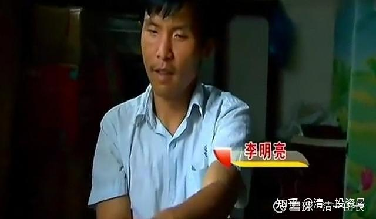
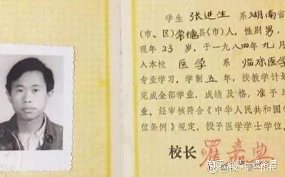

原雪球专栏[217篇.如何整治用“寻死觅活”来胁迫你的熊孩子？](http://link.zhihu.com/?target=https%3A//xueqiu.com/9310099567/200253969)

清一山长 2021年10月15日

**现在的孩子，都不得了。一个个都是主子一样的，把他们的爸爸妈妈、爷爷奶奶都当奴隶一样，呼来喝去的。**十一假期，我听说我们一个远亲的孩子，进精神病院去了，大概20岁出头吧！我看她小时候，还是蛮可爱的。长大以后，就越来越不可爱了，脸越拉越长。前几年，上了高中，就不好好读书，估计是青春期逆反。可能受了挫折，就回家去，不肯读书，也不肯做事。就在家关起门来闹情绪。家人曾经向我求教过一次，我说：换了我，**赶出去，自谋生路就行了。自己面对生活，哪敢有这么多的情绪，很快就会恢复正常了。**可父母说她要死要活的，都怕她出事，所以全家好好地哄着、生怕她不高兴。我摇摇头：**“这种人，这样伺候下去，一辈子的废物。还真不如死了大家更自在。”**现在，结果就出来了，直接送精神病院去了。我很惋惜：这就是中国的家长们，一辈子呕心沥血，精心培养出来的活宝，废物一堆。

**现在的家长，只要孩子肯读书，就谢天谢地了。基本生活能力教育，啥都没有。这种人，就算读完书了，也是一个废物**。请看一个博士啃老的故事。

转：

李明亮的父亲对媒体介绍：他曾经在外劳动时晕倒在田里，被邻居送到家里，当时李明亮袖手旁观，连上前扶一把都没有扶。对于父亲的抱怨，李明亮解释说：“我现在不可能有精力去关心别的事。”李明亮有个妹妹，已经结婚成家。据他妹妹介绍，李明亮读博士的时候，她资助了哥哥四万多元，现在她家里还欠着三万八千块钱的债务。面对哥哥的境况，她忧心忡忡地说：“再这样下去，一个家就毁了。”

**点评：如果您以后居然养出这种儿子，你养他作甚？自找苦吃吗？还不如不读书。**

昨天早上，小女因为没有去运动（规定早上起来，每天要先跑5公里），就被我赶出家门不许回家，流浪12小时，晚上8点才准回家，我在家长群公布了此事。不少家长担心：“丢了咋办？万一出事了咋办？死了咋办？”我说：“如果真丢了，就是她的命。我认命。”

其实，孩子妈妈有点担心，白天开车去找了两圈，她以为孩子会很郁闷地躲在路边的某个地方，苦苦地等待回家。结果没有发现。我说：“我给的命令是不能回家，没说可以干啥，不能干啥。所以她们才不会傻傻地呆在院子门外等着晚上回家的。”虽然两个孩子一分钱没有，但我不担心她们没饭吃，她们会有很多种方法找到饭吃的。而且，我认为她们正好去周边地方游玩去了，高高兴兴地玩，找吃的。只要到点回来就行。夫人也有担心：“晚上8:00没回来咋办？你去不去找？”我说：“我就只能报警了。晚上8:00没回家，肯定就出事了。”

结果，晚上8:00刚过，孩子就回来了。我问她学会什么智慧了？她说觉得自己很傻。我说：“傻一点没关系，傻女儿我也要。但是，**懒才是我不能容忍的**。懒人我就丢掉不要了。”所以，每天早上的运动不可少，每周至少一天是工作日，我家孩子必须要会干活。读不读书无所谓。今天就罚她们额外的多工作一天，要满8小时才算数。现在孩子们还在干活呢！忙着种树、砍草，都是农民工的活儿。

她妈生怕孩子饿着了，结果一问：两个孩子都说吃得饱饱的，没饿着，还去逛了农村的集市。我原以为俩孩子会去给泰国人打工混饭吃（原来就做过的），要饭吃也很容易，泰国人很友好的。没想到她们现在更会偷懒了——直接去找我们根本就不认识的泰国人，借了20元钱（100B泰铢)。自己精心安排买了食物，舒舒服服地在外面过了一天。唯一不太开心的，就是野外的蚊子太多，不敢停下来不动，就一直在走动，所以有点累。（她妈妈以为会在路边某个公园的亭子里面，傻傻地等晚上回家的镜头，是不可能出现的）。

我把这个真实的调整孩子的故事，发到家长群里。我认为：**现在这样做，第一是锻炼了孩子的生存能力，第二是防止孩子青春期逆反。**结果引起家长的讨论，还讨论了现在经常遇到的：孩子用死亡来威胁父母的案子，极为头痛，不知道咋处理。

比如一个办学的家长，就分享了一个很狗血的真实故事。

乃中妈妈：

前几天学堂来了孩子，真是演出一番好戏，面试的时候乖巧伶俐，第一天上午也听话，到下午的时候就开始发作，嚷着要回去，不管不顾地到老师办公室拿手机给家长打电话，说：“我现在给你们三条路选择，第一条现在接我回去；第二条我在这里搞破坏，让老师开除我；第三条我死给你们看。”家长在电话那头好话说尽，孩子无动于衷。我们立刻让家长来接孩子，家长知道孩子秉性，但心不甘，拖着迟迟不肯来，后面拖了两天终于把孩子接回去了。

**我的回复是**：这种孩子，家长很好处理的。就淡淡地一句：想回家呀？就自己回来吧。路上走丢了，就算了。老妈自己再生一个懂事听话的去。就放下电话，再也不管了。傻眼的是孩子。如果孩子在学堂想闹事，学堂就往外赶他，让他走路回家。你看他一分钟马上就老实了，马上就会讨好老师，马上就会讨好家长。但家长现在这样窝囊相，这辈子生死情结，相爱相杀，愁苦无限的人生，就开启了！

孩子内心深处，其实很鄙视这样的家长。**被孩子轻易搞定的家长，会让孩子失去模仿的榜样，让孩子对家长很失望的。内心深处，孩子只崇拜和跟随强者。**

**我敢判定**：这孩子将来是考不上大学的，大约中学就会出问题。现在大把的孩子，高中就开始在家啃老了。结局？肯定很惨，一家人愁云惨淡地过吧！我的远亲，就有一个我的同辈人，高中就啃老的，年龄现在也50左右了吧？他父母，是我们的长辈，快80了，退休工人。据说现在见到亲戚们，就到处求人托孤，求我们这些表哥们、表姐们，替他继续照看孩子——**50岁的孩子，**您说可笑不可笑？我当然不会干的，因为我连自己的孩子，18岁就赶出家门，凭啥替你养50岁的儿子？真是笑话！想好好地养儿子？就自己养呀？你们当爹当妈的，就好好锻炼身体，有本事活150岁呀？替你的宝贝儿子养老送终之后，你们再死吧！

今天中午，小女特意跑回来家里吃饭（平时是跟小朋友在一起吃饭的，估计是跑回来看我的脸色如何？因为我昨天很生气地收拾了她一顿。）

我就把今天这个家长遇到的事情说给她听，告诉她：干嘛不用这种方式来对付我？结果孩子说：她才不会犯傻，这样干，肯定自找倒霉，爸爸会有一千种方式来整她的。

我笑：倒也是。我就考她：这孩子说要死给家长看。她是家长，该怎么办？我女儿就说：“你想死就死好了，妈妈再去生一个！”

我说：“你比家长处理得好多了。要换我会怎么说呢？孩子好奇。”我就说：“你想死给我看吗？真是太好了。我还从来没看过真人咋真死的呢！你就好好去死一回吧！我让老师把你死的镜头全都拍下来，留着纪念，将来去吓别的小孩子。‘瞧，死就是这样的，一点也不可怕！’谢谢你要用生命来让我看热闹，专门地死给我看！你会气死还是笑死？”

女儿说：“我就知道，我要敢对爸爸妈妈说这种话，我会很倒霉的！”

乃中妈妈：

山长的智慧开示让我想起一件往事，说来供大家一乐。乃天小时候在登机前弄丢了一次，后来他们经常会在超市或者外出时失踪，在加拿大、美国、中国都莫名其妙找不着，每次把我吓得心惊肉跳，后来有一次我终于用上了山长这招，在疯狂找了三兄弟半小时后，发现他们在小区门口无聊地等我，我见到他们笑了一下什么也没说，回到家里乃天紧紧盯着我，探究地看着我，我慢悠悠地说：妈妈只是在想，好歹你们没丢，正盘算着丢了就再生一个。乃天莞尔一笑。后来就再也没发生过类似事情了。

2021/10/14 10:24:13

孩子与父母之间的相爱相杀真的太微妙，后来我才想明白其中的因果。乃天5、6岁那次在机场走丢后，有段时间经常做梦梦见自己被丢了，妈妈坐飞机走了。后来他就用时不时“消失”来试探妈妈，每次家长紧张得不得了的时候，又似乎漫不经心地出现了。而山长教的那句话就破了孩子潜意识里捉弄家长的心。

我的总结性回复：**现在要趁小时候，就把孩子赶出去，自己面对生活，就是防止将来长大了，青春期心情郁闷，就会这样来要挟家长的。从小被赶出去的孩子，绝对知道不能拿家长开这种玩笑。你想死就自己死，别告诉我。告诉我的意思，就是让我心疼你，求你不要死，说明你不想死。从小教孩子这些东西，面对、放下，不跟孩子玩情感游戏，长大了才顺利。**你们看我们家的孩子乖乖的，不捣蛋。因为从小捣蛋，知道自己付出的代价很高，跟爸爸妈妈斗心眼，都是自己吃亏，孩子以后就习惯了别惹我。

你们不一样，从小就会宠孩子，孩子已经吃死了你们。自然长大后就管不住，家长一副窝囊相。你们记住一件事情就够了——**你不收拾自己的孩子，不教训自己的孩子，长大了，社会会教训他的。而且教训严厉得多；你从小不打孩子的脸，孩子长大就被别人打脸。你们喜欢什么答案，就自己做去。反正人生就要打脸，不如我来打。从小被我打脸的孩子，长大后别人才会给脸，才会争气。**

转几个案例和故事，看你们想自己去体验不？[49岁的名校博士表哥，啃老20年自杀](http://link.zhihu.com/?target=https%3A//www.163.com/dy/article/G18P1DIP0548RVJH.html)【**表哥死后，亲戚朋友、邻居都在背后议论，我听到他们小声说：“唉，死了好，死了就解脱了，就不用再啃老了。”**】。

**[48岁名校博士“啃老20年”后自杀：被父母掌控的他，自由了](http://link.zhihu.com/?target=https%3A//www.163.com/dy/article/G18P1DIP0548RVJH.html)**

[网页链接](http://link.zhihu.com/?target=https%3A//www.163.com/dy/article/G18P1DIP0548RVJH.html)：[https://www.163.com/dy/article/G18P1DIP0548RVJH.html](http://link.zhihu.com/?target=https%3A//www.163.com/dy/article/G18P1DIP0548RVJH.html)

[54岁的北大医学博士啃老18年，拿低保过日子](http://link.zhihu.com/?target=https%3A//www.163.com/dy/article/HAKUP2VJ055369F5.html)

[网页链接](http://link.zhihu.com/?target=https%3A//xw.qq.com/cmsid/20210711A0327700)：[http://news.sohu.com/a/578387847_121164085](http://link.zhihu.com/?target=http%3A//news.sohu.com/a/578387847_121164085)

这些博士、大学生啃老，媒体还报道一下，更大量的，中学没毕业的人，啃老被认为很正常，连报道价值都没有。家长们，你要啥孩子？一个扶不起来的阿斗吗？这么多的教训看不见，非要自己去写一个你们家的故事出来吗？恐怕以后都多到没人看的。

家长们最好学我，**早早就把孩子赶出去，历练社会，学会生存。读书读不读，没啥重要的，做人，做事第一。这样肯定不会出现废物。真的培养出了废物，你会很苦，但孩子其实比你更苦，更无助。甚至他的死亡，还让所有人的人都松了一口气，大家都解脱了。**

我的孩子被赶出去，她居然开开心心地过了一天的流浪生活，而不是愁眉苦脸地过了一天的 “无助苦难之日”，我一点也不觉得她 “没心没肺”，没有沉痛思过反省。我反而觉得：我很成功地培养了一个能够独立生存的孩子。当然，我想不用说任何话语，她也知道：回家，比外面挨蚊虫咬，要舒服得多。

（以下内容为编者收录）

**评论回复：**

**[徐jin霞](http://link.zhihu.com/?target=http%3A//xueqiu.com/n/%25E5%25BE%2590jin%25E9%259C%259E)回复[清一山长](http://link.zhihu.com/?target=http%3A//xueqiu.com/n/%25E6%25B8%2585%25E4%25B8%2580%25E5%25B1%25B1%25E9%2595%25BF):**

今年暑假，女儿10岁被退学回家，被我整顿，也以自杀和离家出走方式来要挟我，还说了几次，最后那两次，一次关于自杀，我直接递给她一把水果刀，她说刀太小，自杀不了。我说你可以用这把小刀把自己大腿一点点割断，最后就会流干血而死掉的。她马上认怂，说还是等自己大些攒到钱买把大刀再自杀。关于离家出走，我特意选在晚上，她说我不是她亲妈，要去外面找亲妈妈，不想回这个家。我说好，送你行李箱，收好衣服马上走人。她人不动，嘴一直嚷嚷，我发火了，硬把她抱起，往楼下走，她一直扯着楼梯扶手不放，我弄开后，把她拖到门外，关上门，结果她也只在门外哭叫，最后被狠狠揍了一顿才放她进来。现在不敢再用这两招了。

**清一山长[2021-10-15 21:49](http://link.zhihu.com/?target=https%3A//xueqiu.com/9310099567/200267110)回复[徐jin霞](http://link.zhihu.com/?target=http%3A//xueqiu.com/n/%25E5%25BE%2590jin%25E9%259C%259E)：**

[很赞]。聪明的妈。**真想死的孩子，是不会嚷嚷要死的，这些都是一些最流氓、最无赖的孩子，恶意地滥用家长最善良的爱心，反过来控制和驾驭家长的手段罢了。这种孩子超级自私，他才舍不得自己受伤呢！家长必须坚决地把孩子的流氓行为打回去。国际社会不能容忍无赖国家，家庭也不能容忍无赖孩子。**

关于“等我长大了买把大点的刀再自杀”，你可以直接怼回去：**“我买给你，友情赞助，要多大的刀才够？马上死给我看？这种给老子丢脸的孩子，早点死了更好，养你也白养了，一点家庭责任都不尽，养来干啥？你死了大家都省心，就不用养废物了。你要不敢下手，老娘帮你下手割。从大腿开始，还是从脸上开始？先绑起来，防止你乱动！一刀一刀的慢慢割。”**——看你还嘴巴硬。

**对付这些熊孩子，家长不狠一点，就被控制了。家庭战争，孩子一直在争夺控制权。家长却用“我有无限的爱心”来应对，其实就是找抽的。**

但是，你现在狠，最奇怪的就是：**长大了，这孩子最孝顺你，最尊重你。相反，从小惯着孩子的家长，孩子大了最不孝。**

结论：**所有的结果，都是家长自己造作的。坏孩子、好孩子，都是家长培养的。家长只会玩幻想的情感爱心游戏，就自己来收拾悲惨的残局。**比如48岁在家养老的博士、高中生、初中生的残局。**你用80岁的残躯来诉苦，最该骂的不是孩子，是这老蠢妈！只会生，不会教！**

**[袁端](http://link.zhihu.com/?target=http%3A//xueqiu.com/n/%25E8%25A2%2581%25E7%25AB%25AF)回复[清一山长](http://link.zhihu.com/?target=http%3A//xueqiu.com/n/%25E6%25B8%2585%25E4%25B8%2580%25E5%25B1%25B1%25E9%2595%25BF)：**

看到山长发这篇文章，我想到了自己的儿子在十岁的时候说过要去死，我和先生亲身经历了孩子拿死来威胁我们。已经过去了两年，回想起来还是心有余悸，又感恩先生没有被孩子的寻死觅活左右而妥协。

2019年3月31日，先生清心课回到昆明，4月2号开始，先生带着两个孩子（儿子10岁，女儿7岁）开始跑半马，一天一个，先生他自己也跑，全程陪同孩子跑完，我自己则要买菜，要回家做饭等理由，跑完十公里就不跑了。对我来说，跑半马是我不愿意的，是身体上痛苦的。在跑半马的过程中，从开始有半根黄瓜，或一根香蕉，一瓶水等补给到后面无任何补给；从两兄妹出现各种耍小聪明；从妹妹摔破膝盖还得继续跑，再跑几个月也好，我都可以接受，因为先生在泰国上课的时候，就看到黄校长、宋老师、马老师他们的孩子都在跑，他们能跑，我们也能跑。

但是就在跑了一个月的时候，先生计划半马改全马，一天一个。我受不了了，极力反对。（在我的观念里，跑全马那是电视里专业长跑者做的事。现在让一个十岁、一个七岁孩子跑全马，还一天一个，我身边没有见过这样的。超出了我的底线。)先生和孩子们讲好后，在跑完三十七天半马后，改为跑全马了。我开始思想上很痛苦，我怕一天一个全马孩子承受不了，出事。并和先生商量，能不能先半马加到三十公里？再三十五公里慢慢加上去，不要直接升到全马。不行。眼看孩子们本来就比较瘦小个，现在跑全马，更加的瘦，几天下来就更瘦了，我心疼，我着急，我无奈出了个下策，第一次提出离婚。孩子不是你一个人了，你硬要这样做，就离婚，孩子一人一个，选择你的孩子，你继续带他跑全马，选择我的孩子，我带走。谁料，先生果断同意，并说把所有资产给我，但有一个事，你带走的孩子出了问题，不要来找我。我本也是无奈气话，看着离婚也不能阻止先生的跑全马行动。我彻底没办法了。每天同孩子们一起出去跑步，一边给他们加油、鼓励，一边继续同先生协商，希望先生能“回心转意”。

家里的奶奶同我们住在一起，她也是非常的反对，有时看到孩子们晒得脸通红，头发全被汗水湿透，下午还要赶三公里到运动中心游泳三公里。奶奶哭了几次，弄得老人家每天难过。先生见状，总这样不行，便带着孩子们搬到了当时心学家塾在另一处地方租的房子做学堂，在那里住，不让老人家看见，省得老人家操心念叨。搬过去，是少了老人家的念叨了，可又到了昆明的雨季的季节，跑马的路面，是凹凸不平的泥土路，连夜的下雨，使得路面有很多很大处的积水，路面的泥巴还会粘到鞋子上，确实跑起步来不是很方便，但都还能克服。

跑全马一段时间后，有规定时间，早上6点开始跑，到中午十二点的时候，要准时回到家并跑完，赶上吃中饭，如果十二点没有跑完，就不能吃中饭，直至后面什么时候跑完，才能吃晚饭。一次，女儿在十二点的时候，没有回到家，在十二点零一分多的时候，跑完42公里出现在我们面前，晚了一分多钟。我觉得晚一分多钟没什么，示意让女儿吃饭，可是先生不同意，我看着孩子泪水满眶，我心软了。在先生吃完饭离开后，我偷偷地塞给女儿一个馒头，让她吃了，女儿也吃了。可是瞒不过先生，他问女儿，你有没有吃东西？女儿不会也不敢撒慌，承认她吃了馒头。结果就是先生让女儿又跑了十公里。之后，孩子没有在十二点跑完，我再拿东西给儿子、女儿吃，女儿也不敢接东西吃。我和女儿的痛苦都在升华。（事实是，饿过一两次后，女儿就很少再饿过了。每天在规定时间内跑完，有中午饭吃，会高兴得跳起来，只要有饭吃是最开心的事情。如果不饿她几次，她下次就会晚三分钟、晚五分钟。同时，**我也意识到，我表面上看是在做好人，爱心妈妈，拿东西给他们吃，实则是在害他们，纵容孩子不按规则行事。**）

一天，儿子也没有吃到中午饭，第二天，也不愿意跑，哭着跑，他向先生说，我不跑了，先生问，你不跑了你要干嘛！儿子说我要回老家去体制上学读书。先生知道儿子是在逃避，但是答应了儿子，让他回老家去，和儿子说：“这是你的选择，读书也是你自己的事情，你要自己从昆明回江西上饶，回去后也要自己去找原来的学校的校长和老师谈你要回到学校上学，校长、老师会不会同意，这都是你的事情。你自己解决。”给了儿子500元现金，收拾了简单的衣服，儿子自己当天就坐车到了昆明火车站，没有成人陪同也没有成人买票，儿子想办法跟随年轻的阿姨混上了火车，在火车上儿子补了票，回到老家。一个人在老家半个月，半个月过去了，儿子并没有去学校找校长和老师进学校上学。儿子又一个人返回了昆明（事实证明，儿子并非真的想回体制上学，而是在逃避跑全马）。

这半个月，女儿一直在跑全马。儿子返回后，要继续跑全马，没跑几天，儿子在跑步路上又对先生说：“爸爸，我不要再跑全马了，我要去死。”先生当即停下。回答儿子：“可以，你想好怎么死吗？”儿子一直无语。先生说：“这里就有一个坡，你从上面跳下去，练习死。”儿子不敢，先生就在原地不断鼓励儿子，鼓励儿子跳下去，许久，儿子终于跳了下去，大概两米高，下面是长满近一米高的杂草，儿子只是压倒了几根杂草。先生又让儿子自己爬上来，再跳下去，儿子犹豫了许久，又跳了下去，再爬上来，又鼓励他跳下去，又爬上来，直到儿子不再害怕，一分都不耽误，爬上来就跳下去。接着，就带着儿子回到了心学家塾的学堂，直奔三楼，打开窗户。对儿子说：“你不是要去死吗？跳下去就能死了，就像刚才跳坡那样。”我过去想和儿子讲道理，先生拉开我，让我不要在这里，离开现场，不用我管。（当时对儿子来说，跑全马是比死还要痛苦的事情）儿子不敢跳，怎么说也不跳。先生便让儿子去找一个啤酒瓶来，不知在哪真找着了一个空的啤酒瓶。先生让儿子把啤酒瓶从三楼窗户往下扔，儿子扔了下来，啤酒瓶落地瞬间就摔得破碎。儿子一看，就哇哇哭起来了，先生开始拉着儿子身体往窗户上靠，儿子逃脱，先生抱起儿子双臂到窗户外，悬在空中，儿子吓得边大哭边说：“爸爸，我不死了，我不死了。”先生说，你今天不死，明天就还得继续跑全马。儿子说，跑全马。

第二天，儿子跑的时候，又说，还是要去死，先生说，那好，回去从三楼跳下来，先生和儿子回来了，我当时不在。儿子对爸爸说，要等妈妈回来，看下妈妈再去死。后面，我回来了，先生对我说，儿子说见你一面就去死。我知道儿子在上次经历了要回老家体制上学成功逃避了跑全马的事情后，这次没有别的招了，并用死来威胁先生，想让先生再次妥协。先生也明白，这次如果妥协了，以后孩子还会用无数次死来逃避所有不愿面对克服的事情。先生对儿子说，现在妈妈回来了，你看到了，你可以跳下去了。儿子开始哭起来，这次我和先生把儿子拉到桌子边，三个人坐下来。给儿子讲述了跳下去的情形。一种情形是你跳下去，当场就死了，这样就再也没有你了。第二种情形是你跳下去，没有死，但摔断了两条腿，或摔坏了脑子，你以后将要坐在轮椅，或躺在床上一辈子，爸爸妈妈会难过，但终会接受事实，或者再生个孩子来替补你，而你只能看着外面，却一辈子不能出去了，你那时想要跑全马，却跑不了了。我们知道，跑全马是非常的辛苦，但又有哪件事是容易的？你不是要死吗？现在你知道了，连死也不是那么容易的。

第三天，当然还得继续跑全马，我还是会比较不安，万一儿子还要反复说去死怎么办？但是令我万万没有想到的是，第三天，十二点不到，十一点多一点就回来了，高兴地给我看42公里记录，这个完成时间超过了前面所有跑全马的时间记录，状态也非常的好。并喜悦地对我说：“妈妈，我发现跑全马太容易了。”我瞬间放下了心中的大石头，回答儿子：“是吧！还好没死吧！不然你就跑不了。”之后的一段跑全马日子，没有再听说过儿子说要去死。女儿、儿子各种抗拒，去死的风波终于平息了下来。7月底，昆明雨季旺季，不但晚上下，白天也下个不停，持续下雨没有办法跑全马，于是先生带着两个孩子回老家江西上饶跑，我去玉溪上课了。

回到江西老家，接着跑全马，接着又一个问题来了，雨水是没有昆明多了，但是7月的江西正是酷暑炎烈的时候，上午9点，太阳出来后，气温就开始上升，一直要跑到十一二点，中午的时候气温达到三十几度，地面温度达到40度。在玉溪上课的我，心又开始纠结，痛苦起来了。为了避免孩子们中暑，先生便带着孩子们零晨4点起来跑，提前两个小时跑，就能提前结束，在9～10点的时候，太阳、气温还不至于那么晒、那么高。先生带着孩子回老家，又每天跑一个全马，这件事被邻居，然后亲戚们知道，特别是家里的伯伯，伯伯也是强烈反对，最后还找街道办，妇女主任，还报了警。然后来了满满一车人员到老家，一进家门，就气势汹汹地谴责、各种以法说教先生，说先生是在虐待儿童，不让孩子读书，要告先生。先生也不是吃素的，自己家的孩子自己管，反问：“你们有没有教育好自己的孩子？”先生一人抵一车人，最终一车人发现先生也不是好捏的柿子，就走了，先生继续带着孩子在老家跑全马。

一天，先生告诉孩子们，要去看望老奶奶，所以今天只需跑一个半马就行了，孩子们高兴得不得了，说，跑半马就跟放假休息一样，很快就跑完。后来，儿子和我说起：一次，他跑完了全马，回到家里，什么事情不对，爸爸又让他跑了个半马，他那天就一共跑了63公里，还没有饭吃。我听后真的恨先生，认为先生太狠了，比后爸还要狠。但也是那次，儿子就觉得跑全马不是什么难事。在这个跑全马的过程中，先生会看孩子们的状态，**状态比能力重要，当孩子们不再害怕，不再抗拒跑全马，不再投机取巧的时候，好好的跑完每天的全马时，就差不多达到了调整的目地了**。当告诉孩子们，你们这段时间，跑全马状态不错，奖励你们9月去西藏徒步。孩子们便天天倒数还有几天几天就可以去徒步了，对他们来说，出去背包徒步是他们期待的。至此，半马+全马+超半马，近5个月的跑马调整结束。

**山长说过，快乐的童年不是吃好喝好穿好玩好，而是帮助孩子突破自己，成长。在突破的过程中身体、精神会有痛苦，但突破后，自己灵魂是快乐的。当时孩子会恨你，但以后孩子会感激你。**（这个例子我和孩子在事前、事中是痛苦的，事前，我认为自己跑半马身体会很痛苦；我认为让孩子一天跑一个全马让我精神无比痛苦；孩子自己也觉得一天跑一个全马身体和精神都痛苦，**痛苦指的是自己从来没有做过的，认为不可能做到，超过了身心以往承受的范围，内心恐惧。**但事后现在是快乐的。事后和现在的我在经历过这段跑马调整后不需要喝一口水、吃一口食物，也没有一点心理负担，随时随地都可以跑半马。**现在的孩子，也不会再投机取巧、耍小聪明，不会再畏难痛苦，跑半马或全马都可以平和接受。**结合老师这次的答疑，原来**痛苦的事情是没有全力以赴去做，原来快乐就是一件事没有轻易放弃，没被各种障碍阻拦，全力以赴后超越突破了自己的限制性信念。**

**清一山长[2021-10-15 22:12](http://link.zhihu.com/?target=https%3A//xueqiu.com/9310099567/200268676)回复[袁端](http://link.zhihu.com/?target=http%3A//xueqiu.com/n/%25E8%25A2%2581%25E7%25AB%25AF)：**

[很赞]你老公学习力真强，学了就做出来了。估计这两个孩子，现在老实多了吧？不会为了读书而觉得苦了吧？有机会上学的话，肯定觉得太幸福了。

你老公的手段真狠，比我还狠。我都下不了手，这么狠的。天天跑全马，都创纪录了。我建议还是温和一点，马老师的孩子现在是搬砖。每天挪位置，从东搬到西，每天700块砖的任务，分上、下午干活。现在孩子已经好转多了，天天盼望能够进教室读书学习。但往往读书学习没几天，又犯规重新搬砖。原因只是跟人讲话、互动，犯了规。家长就拿来继续搬砖。因为家长认为——**改掉这孩子浮躁的毛病，比多读几本书更有价值。而且不让孩子读英文，只读《弟子规》，儒家书籍。因为就不打算让孩子去上大学，学会打工就行了**。家长认为这孩子的心性不佳，投机取巧的心很严重，上大学，只会更糟糕，对家族没好处。所以，不如老老实实地学儒家的思想，做个好人更重要。家长亲自带孩子执行，也算态度坚决了。

**[lclee888](http://link.zhihu.com/?target=http%3A//xueqiu.com/n/lclee888)回复[袁端](http://link.zhihu.com/?target=http%3A//xueqiu.com/n/%25E8%25A2%2581%25E7%25AB%25AF)：**

看了后真是觉得触目惊心。用这样严苛甚至残酷的方式对待孩子，不知道您是否想过后果和代价。儿童成长的一个公认规律是，孩子小时候如何被对待，成人后就会以相同方式对待他人。严以律己，宽以待人是不存在的。即使您的孩子长大后能自立，挣钱多，但他会以同样冷酷、严苛的方式对待自己的朋友、同事、配偶、孩子（就像爸爸现在对待他的方式一样），您觉得他的人际关系能融洽吗，他的婚姻能幸福吗，他的亲子关系能和谐吗？

**清一山长[2021-10-20 08:44](https://zhuanlan.zhihu.com/p/593715041/h%3C/b%3Et%3Cb%3Etps://xueqiu.com%3C/b%3E/9310099567/200571212)回复[lclee888](http://link.zhihu.com/?target=http%3A//xueqiu.com/n/lclee888)：**

原来，根据您说的**“公认的理论”**，这个在网络上[骂母亲是猪的留学女生](http://link.zhihu.com/?target=https%3A//xueqiu.com/9310099567/200335137)，小时候受到的是严苛的待遇[大笑]。希望您家里能拿出一个榜样来给大家学习[很赞]。[https://view.inews.qq.com/k/20220420A040MW00](http://link.zhihu.com/?target=https%3A//view.inews.qq.com/k/20220420A040MW00)

**[仁天明](http://link.zhihu.com/?target=http%3A//xueqiu.com/n/%25E4%25BB%2581%25E5%25A4%25A9%25E6%2598%258E)回复[清一山长](http://link.zhihu.com/?target=http%3A//xueqiu.com/n/%25E6%25B8%2585%25E4%25B8%2580%25E5%25B1%25B1%25E9%2595%25BF)：**

假设“此留学女生，小时候受到的是严苛的待遇”推理为真，那李天一、杨锁从小是万千宠爱一身，为何长大后不是反过来万千宠爱其家长[斜眼]。

**清一山长[2021-10-20 09:22](https://zhuanlan.zhihu.com/p/593715041/h%3C/b%3Et%3Cb%3Etps://xueqi%3C/b%3Eu.com/9310099567/200575237)回复[仁天明](http://link.zhihu.com/?target=http%3A//xueqiu.com/n/%25E4%25BB%2581%25E5%25A4%25A9%25E6%2598%258E)：**

**有些家长的脑瓜，不知道咋设计的。天下的事实摆在面前，依然一厢情愿地创造自己头脑中的“完美理论”。很奇葩！但是这种人真的很多，影响面很广。有些人，养废了孩子一生都不会悔改的，依然固执地认为是别人错了**。李天一的妈，你们认为真的后悔、反省了吗？[捂脸]

**[Bluetear2018](http://link.zhihu.com/?target=http%3A//xueqiu.com/n/Bluetear2018)回复[清一山长](http://link.zhihu.com/?target=http%3A//xueqiu.com/n/%25E6%25B8%2585%25E4%25B8%2580%25E5%25B1%25B1%25E9%2595%25BF)：**

为什么10岁的孩子会寻思觅活？很不理解？之前家长对孩子的成长参与的非常少还是方法根本就不对？

**清一山长[2021-10-15 23:00](http://link.zhihu.com/?target=https%3A//xueqiu.com/9310099567/200271620)回复[Bluetear2018](http://link.zhihu.com/?target=http%3A//xueqiu.com/n/Bluetear2018)：**

**为什么10岁的孩子会寻思觅活？看电视学的。中国的电视剧，最喜欢玩这些东西。孩子学好不容易。学坏分分钟！所以，新教育的孩子，还有一个绝招，就是隔离电视，并严格监控网络。**

**[君子如玉03z](http://link.zhihu.com/?target=http%3A//xueqiu.com/n/%25E5%2590%259B%25E5%25AD%2590%25E5%25A6%2582%25E7%258E%258903z)：回复[清一山长](http://link.zhihu.com/?target=http%3A//xueqiu.com/n/%25E6%25B8%2585%25E4%25B8%2580%25E5%25B1%25B1%25E9%2595%25BF)：**

山长，您这还帮着孩子自杀[滴汗]您够狠，孩子遇到您这样的爹也是无语无招了[可怜]

**清一山长[2021-10-16 08:47](http://link.zhihu.com/?target=https%3A//xueqiu.com/9310099567/200282980)回复[君子如玉03z](http://link.zhihu.com/?target=http%3A//xueqiu.com/n/%25E5%2590%259B%25E5%25AD%2590%25E5%25A6%2582%25E7%258E%258903z)：**

您这是瞎说：我**这叫“反威胁”！**不是帮自杀。**是“以其人之道，还治其人之身”。你怎么来威胁我，我怎么还给你。直到你求饶，以后再不敢用这一套来威胁我。因为，真想自杀的孩子，不用你帮，说都不跟你说，会悄悄的去死的。**

**[米老鼠爱钱](http://link.zhihu.com/?target=http%3A//xueqiu.com/n/%25E7%25B1%25B3%25E8%2580%2581%25E9%25BC%25A0%25E7%2588%25B1%25E9%2592%25B1)回复[宋建广](http://link.zhihu.com/?target=http%3A//xueqiu.com/n/%25E5%25AE%258B%25E5%25BB%25BA%25E5%25B9%25BF)：**

说得对！[很赞]但是你了解10岁8岁的孩子跑半马对膝盖的伤害吗？我们要陪伴孩子克服学习生活上的困难，但是我更相信科学教育的方法。

**清一山长[2021-10-16 12:45](http://link.zhihu.com/?target=https%3A//xueqiu.com/9310099567/200292417)回复[米老鼠爱钱](http://link.zhihu.com/?target=http%3A//xueqiu.com/n/%25E7%25B1%25B3%25E8%2580%2581%25E9%25BC%25A0%25E7%2588%25B1%25E9%2592%25B1)：**

“但是你了解10岁8岁的孩子跑半马对膝盖的伤害吗？”。

你以为你就了解了吗？不了解的事情，别出来乱说，好像你已经掌握了真理一样。

我知道有家长让不到十岁的孩子，天天跑半马，但孩子壮实得超越一般人，身体啥毛病都没有；我还知道有家长让孩子徒步西藏，每天超过全马的距离，身体也很壮实。你没有经过验证，就乱说跑半马伤膝盖，起码是不严谨。

另外，孩子与孩子之间，差距巨大。有些孩子，别说半马，让她跑1000米都会猝死的。这种事情，发生多起了。不信你搜索网络去看看“跑步猝死证据”。您要不要因此说：跑半马的孩子，死亡风险是跑1000米的几十倍？这些孩子，估计都是奉行**“跑步会死教派”**的家庭培养出来的“精致人才”，事实也证明：她们的宗教信仰的确没错。所以，据说很多大学，都赶快取消掉1500米运动项目了——但有人跑800米就死了。只好都不动了。

结论：**别以为你自己认为的就是真相。每个人都喜欢维护自己的立场。**你认为跑马不对，你就别跑。但别站出来，攻击别的跑马家长是错的。孩子是他们自己的，想怎么练，自己练。练死了，也是她们自己生的。你看不上别人的练法，就把你自己的孩子培养好就行。别站出来要别人跟你一样“精心保护孩子”。

顺便说一句：我女儿不做跑马训练。我不是为跑马的家长辩护。只是出来说个公道话**。各有所爱，各行其是就好。虽然小女跑马完全没有问题，她只是偶尔跑跑玩。她不到五岁，姐姐就陪她用大半天时间，徒步走了快四十公里。她天天运动，也没见她膝盖不好。**偶尔受伤我们也不当回事情。她前两天被赶出去流浪，算她走路的总距离，至少也有30公里左右。除非小女调皮捣蛋，我管不住，才会强制跑马。但她大多数时候都很乖，我没理由拿她来跑马罢了。**我不认为跑马会伤害她，我知道宠溺才是对她人生最大的伤害。**

**[王美静](http://link.zhihu.com/?target=http%3A//xueqiu.com/n/%25E7%258E%258B%25E7%25BE%258E%25E9%259D%2599)回复清一山长：**

限随山长学习后，知道了孩子抑郁的原因，也知道调整方法，难的是家长的改变。多年前就用山长教的方法调整过，建议一对父母领孩子晒太阳、做户外活动，两个星期后孩子恢复正常返校上课。这个孩子（初三）偷吃安眠药自杀被救，母亲和家里亲戚没招了才听了建议这么做，没想到效果明显，我也很吃惊，这是第一次用山长教的方法调整抑郁症孩子。当时另有一个症状轻很多的女孩，没听建议，被父母保护在家里，一年后来办退学时见到她，整个人白胖胖，目光呆滞，完全不与人交流，唉！一年多后，第一个女孩考上重点高中，家长放心了故态复萌（生活中啥也不让孩子做，几步远的出门也以车代步，在家饭来张口，孩子只做一件事——写作业），很快孩子又抑郁了。这件事中看到这个家长的执着：即使知道应该放手锻炼孩子，但还是放不下自已对学习的焦虑[吐血]。

**清一山长[2021-10-16 12:52](http://link.zhihu.com/?target=https%3A//xueqiu.com/9310099567/200292643)回复[王美静](http://link.zhihu.com/?target=http%3A//xueqiu.com/n/%25E7%258E%258B%25E7%25BE%258E%25E9%259D%2599)：**

第一个女孩，将来肯定出事。基本上，死亡是必然的。第二个女孩，是现在就已经完蛋了。因为所谓的现代医学，就认为抑郁症是想多了。所以吃的**药物，是神经抑制类的药物。说简单一点，就是让你脑子笨一点，不多想，就好了。**我觉得不如把脑袋割掉，就真的啥都不用想了。**如果想一辈子养一头猪的家长，可以找“现代医学”这样去治疗抑郁症；如果相信古传道家智慧的，就用我的方式：野外、阳光、散步，锻炼身体去。不相信？随你**。我教你这招古传医学智慧，谁给我钱了？对我有啥好处？ 除非我来卖你个“清一大力反抑郁丸”，一千元一颗[吐血]。

**所谓的“现代精神病医院”，我看都是卖大力丸的，穿得像是神一样，干的全是神经病的事情。把好好的人，弄成个猪的样子，就假装“科学治疗”了，实在是笑话！**

**[大众空间](http://link.zhihu.com/?target=http%3A//xueqiu.com/n/%25E5%25A4%25A7%25E4%25BC%2597%25E7%25A9%25BA%25E9%2597%25B4)回复[清一山长](http://link.zhihu.com/?target=http%3A//xueqiu.com/n/%25E6%25B8%2585%25E4%25B8%2580%25E5%25B1%25B1%25E9%2595%25BF)：**

这个方法在心理治疗里面就是其中一个方法，但是在实际接触的过程中，还是有很多小孩根本不愿意走出户外，家长什么招都用了，小孩就是要死要活，就是不出去！

**清一山长[2021-10-16 14:01](http://link.zhihu.com/?target=https%3A//xueqiu.com/9310099567/200294824)回复[大众空间](http://link.zhihu.com/?target=http%3A//xueqiu.com/n/%25E5%25A4%25A7%25E4%25BC%2597%25E7%25A9%25BA%25E9%2597%25B4)：**

说什么“家长啥招都用了”。都是骗子！[大笑]停电，家长搬家，玩消失。去旅游。你看小孩出不出来？至于来硬的——叫两个有力气的人，把孩子弄出来，扔出去。行不行？玩消失是其中最温柔的一招。让孩子自己来面对和处理【属于他的一切】，留点粮食啥的。等他会处理了，大约人也恢复正常了。

**[NETC](http://link.zhihu.com/?target=http%3A//xueqiu.com/n/NETC)回复[清一山长](http://link.zhihu.com/?target=http%3A//xueqiu.com/n/%25E6%25B8%2585%25E4%25B8%2580%25E5%25B1%25B1%25E9%2595%25BF)：**

我来自嘲一下。两年多前，儿子上初一，从小也是被他妈和姥姥、姥爷娇生惯养，每天沉迷游戏，学习不好。我看这样下去肯定不行，当时我也没有太好的办法，我和她妈妈献爱心、犯贱的价值观不一样。后来看到清一山长的天使之翼招生，我感觉是一个机会，和儿子一商量，他还挺愿意去，接下来就准备一些列的申请报名工作，最后录取通知也收到了，机票都定好了。

临走的前一天，孩子他姥爷正好从老家来北京住，听说明天要去外地上学，当场被他姥爷拦住，坚定地说:“不去，正常上高中，上大学。”，我说，按他目前的状态连考高中都不可能考上，还谈什么上大学。他姥爷还扯些没用的，说北京大学好考，考高中没问题，儿子也打退堂鼓了，他妈从小也是一路听她姥爷安排，倒戈了，也不同意了。最后都只是轻飘飘地对儿子说：“好好学”。他们根本没看到儿子被他们培养的好吃懒做，好逸恶劳，根本就没有学习的心性。最后天使之翼体验班就没去成[加油]一晃2年多过去，今天儿子中考，高中没考上。以我的意见，既然不想学习就别上高中了，上个职高，早走上社会，自己去养活自己。结果他妈妈和姥爷还不死心，死要面子，花钱上了一个私立高中，我看最后也是花钱找抽。我现在只是干看着，看着他妈和他姥爷在那乱献爱心、犯贱，整天就知道问儿子吃什么，这个好吃，那个好吃，整个一个“养猪”专业户。我也是一点招也没有。

**清一山长[2021-10-16 18:04](http://link.zhihu.com/?target=https%3A//xueqiu.com/9310099567/200302893)回复[NETC](http://link.zhihu.com/?target=http%3A//xueqiu.com/n/NETC)：**

真是一个悲伤的故事，虽然有比你更悲伤的家长——他们的孩子已经送来了，然后又用各种理由走掉了——不好玩、不好吃、没意思等等。**现在，留下来的天使班的学生，已经完全融入高中了，一些学生的作业排名，偶尔可以排高中前十了。**虽然总体来说，还是比不过正规高中生，但比他们原来，已经不知道提高多少了。而且——**天使班停招了，绝版了。我就是示范给你们看的，做完这期，就没有下一期了。虽然知道如果开下一期天使班，会很火的**[加油]。特别明年天使班的大学录取通知书出来后。

你们家，看来是女人当家[俏皮]。孩子妈和孩子姥爷，一起把不愿意爬树的“猪”，弄上树去坐着，以为家长只要花钱把孩子弄上一颗叫做“树”的地方，就自动变小鸟了。你们认为：只要花钱把孩子送去上大学，就自动变学霸了？自动可以去找好工作了？自动可以赚钱养家了？不知道**要让孩子上树，真不是你花钱弄上树就行了，而是要让孩子装上一个“想飞的心”。**你的未来，现在才刚开始罢了，还远远不是终点，**你会比这些啃老的名校博士家长更惨的。因为你只是一个野鸡大学的啃老族的家长。别人连惋惜的声音都没有。**看你老婆这架势，还要10年可能才会觉得有点不对劲，她感觉太迟钝了。

也好，**你们都是中国的有价值的消费者，没有你们的努力，中国的GDP没有这么高的**[加油]

[NETC](http://link.zhihu.com/?target=http%3A//xueqiu.com/n/NETC)回复[清一山长](http://link.zhihu.com/?target=http%3A//xueqiu.com/n/%25E6%25B8%2585%25E4%25B8%2580%25E5%25B1%25B1%25E9%2595%25BF)：

在管孩子、教育孩子这件事儿上，我还真当不了家，人性都是趋利避害，孩子更是，哪边容易就往哪边走，儿子和他妈妈显然站在一起，只能说我和他妈妈在孩子教育上价值观方向是相反的。我不能说孩子身上的不好，即使我说的是对的，一说，他妈妈就护犊子，不是一般的护，在管孩子的事情上和他妈妈也吵过很多架，搞得关系很紧张。开始还希望他妈妈一家能有所觉悟，但随着时间的推移，孩子越来越大。我也想清楚了，我不是神，改变不了别人，有些人一辈子可能都不会觉悟。我现在所能做的就是再尽最后几年的义务和责任，出点学费供他到18岁，18岁之后我也没责任和义务来管他了。

**清一山长[2021-10-16 20:23](http://link.zhihu.com/?target=https%3A//xueqiu.com/9310099567/200306992)回复[NETC](http://link.zhihu.com/?target=http%3A//xueqiu.com/n/NETC)：**

你也只能管好自己，做好自己的家庭防火墙就行，别被一个坏孩子毁了一个家，至少不要把全家人都拖下水。照她妈这架势，18岁之后，你想脱手是无望的。她是一定要继续养的，到了80岁，都要养的，到她死为止，死不瞑目的架势。我亲眼见过这种人：死都要捍卫自己的亲情权。

**[土地丰收](http://link.zhihu.com/?target=http%3A//xueqiu.com/n/%25E5%259C%259F%25E5%259C%25B0%25E4%25B8%25B0%25E6%2594%25B6)回复[清一山长](http://link.zhihu.com/?target=http%3A//xueqiu.com/n/%25E6%25B8%2585%25E4%25B8%2580%25E5%25B1%25B1%25E9%2595%25BF)：**

我叫潘土丰，就是大家说的那个狼爸[笑]，跟大家简单点介绍一下家庭情况。

2014年我偶然机会从云南徒步到拉萨，当时有事没有去尼泊尔，尼泊尔那次大雪崩死了一百多人，有几个朋友永远呆在那洁白无瑕的圣地[合十]。

2015年我们夫妻开始带6岁儿子和3岁女儿在中国、老挝、越南等地方采悬崖蜂蜜，被蜜蜂蛰，遇蚂蝗、蛇，吃野菜、睡帐篷，穿越原始森林一个多月。

2016年带孩子穿越中、老、越原始森林，暑假雨季带孩子们徒步加搭车到拉萨，从吉隆口岸到尼泊尔，连续的雨季塌方、滚石、泥石流、车祸、雪崩、失温、高反都碰到过，特别遇到尼泊尔境内160公里全面塌方，我们是连滚带爬出来的，看到有人被泥石流冲走……我们看到的是机遇——老天送的礼物，没有去抱怨。如果这次死在外面也是有价值的，去西藏、尼泊尔徒步就是因为死了很多人，背包客才去，更有挑战，后来被新华社报道被网友称为《中国最小背包客》！红遍大江南北，[网页链接](http://link.zhihu.com/?target=http%3A//www.chinanews.com/m/shipin/2016/09-19/news667763.shtml)还被央视地方邀请分享！2017年18年徒步滇藏线再到新疆，到老挝穿越原始森林。

2019年1-2月丽江徒步到拉萨1800公里，3月上完山长的清心课，看到还有那么狠的家长还在跑半马，因为我儿子从小奶奶、妈妈、姑姑带就是废物，还好自己做背包客通过几年训练才变正常，刚好借这次机会练练孩子的极限，就跑半马、全马5个月，游泳三公里，身体素质经过考验通过，9月开始徒步青藏线，平均海拔4500米，再到甘孜色达，徒步中经常几百公里无人区，每天吃得很少，在唐古拉山碰到暴风雪，差点失温9人全军覆没，经历沙尘暴、狼、熊的攻击，带孩子们到色达近距离看天葬几天。

2020年从藏区徒步到云南碰到疫情，一级戒备，没东西吃，讨饭、偷东西、躲到山上，后来在玉溪普洱墨江县交界点被堵在那，再后来通过央视的朋友找到关系，2月7日用救护车送回昆明隔离，没这个网红身份，我们会被流浪到死。

4月份我们开始徒步到普洱江城碰到境外疫情又被赶到西藏，7月份到新疆又碰到乌鲁木齐疫情，天天被赶被隔离，**我们一直把危险当成训练自己的礼物**，6月5日儿子回昆明备考今日，到今年结业回家，没怎么徒步。

2021年带突破班部分孩子徒步到广西，现在孩子被分流在大理野外攀岩、高山远足、荒野生存，带队的闻小明曾在藏北无人区，到最后是爬出来得救，身体半边瘫痪，靠意志力强才恢复过来。曾做攻略二年穿越缅甸无人区二个月，带工具进去荒野生存；在湖北恩施穿越时从悬崖上摔下几十米的地方，靠自己爬了出来，成功的背后是要付出汗、血、命的。这次闻小明说孩子们变化很大，学东西很快，一学就会，思维很清晰，愿意服务他人，跟其它孩子不一样。没有户外运动我们的孩子们人生使命是不一样的，因为选择了走一条荒野之路，首先选择面对的就是死亡，跑个半马又有什么关系[大笑]。

我母亲39岁时，父亲突然去世，当时奶奶直接疯掉，母亲神经错乱，就是从来没考虑过死亡，我们在外面徒步，看到电视有雪崩、雨灾、车祸，她都会打电话问我们有事没，担心得很，现在忙得没空理我们，72岁的母亲2019年上了刘老师的慧心课，通过二年学习现在学会写字、看书，会背《心经》，讲山长的《六祖坛经》，现在3个小时读一遍《道德经》，经常说走路睡觉都会笑，因为找到了自身的价值，有老师智慧的引领！感恩山长刘老师智慧的引领改变了家族三代人[心心]。

上次冬季在藏区比较寒冷，我们就冬天不去藏区，感恩山长[心心]这次在关键点给出那么好的礼物我们收到了！天气好就在大理攀岩，这几天下雨上午9:30到图书馆看书到下午4:30分,孩子能静下心来，这个进步是原来没想到过的，孩子现在暂时失去到今日的机会，有那么好的价值伙伴，今日氛围，榜样老师，内心是非常渴望再回去，说三年后考三语高中，进武道馆打世界冠军去，我说如果能严格按照武道馆训练自己，万事都不难，祝福孩子！

**清一山长[2021-10-16 22:24](http://link.zhihu.com/?target=https%3A//xueqiu.com/9310099567/200311102)回复[土地丰收](http://link.zhihu.com/?target=http%3A//xueqiu.com/n/%25E5%259C%259F%25E5%259C%25B0%25E4%25B8%25B0%25E6%2594%25B6)：**

你们玩极限运动的，我学不了，先认怂。我还是练练我的太极拳算了，不想与天斗，与地斗的，看着都吓人。我一个已经快60岁的老头，可以把年轻人打得满地滚，很满足了。不想去西藏，弄得自己满地滚，我怕就回不来了[捂脸]

**俞贞-赣州2021-10-16 16:14回复[清一山长](http://link.zhihu.com/?target=http%3A//xueqiu.com/n/%25E6%25B8%2585%25E4%25B8%2580%25E5%25B1%25B1%25E9%2595%25BF)：**

我也分享一下我们家那个小屁孩5岁时就说要离开我们的经历，当时挖地挖了大概2个月，觉得有点累，决定不当我们的孩子了。于是决定去爷爷家生活，因爷爷家离学堂不远，不到10分钟路程，当时我有点小紧张。后面想起来曾经宋晓莉老师分享女儿的案例，说有一次在学堂嫌运动太累，在妈妈面前说想自杀，宋老师当即替给她一把刀，这孩子看妈妈挺当真，就给吓回去了。我也灵机一动，首先，做好爷爷这边的防范，故意在爷爷面前诉苦，说孩子不喜欢读书，于是让他去干农活，可他又嫌累，说还是爷爷家比较舒服，有的吃，不用干活也不用读书，我故意跟孩子爷爷说这个年代孩子不读书怎么行呢？并问孩子爷爷，我该如何是好啊？爷爷一听，没多想，并向我保证，如果他敢来就把他赶回去，不给饭吃，不读书怎么行！（我当时看爷爷说的挺认真的！[大笑]）接下来，开始“整”孩子。当小屁孩子提出要离开的时候，我装着很开心，太好了，刚好弟弟没长大，需要时间与精力照顾，这样你走了，我也就更省心了，在走之前，让他把衣服/鞋子、裤子全脱下来，这些都是爸爸妈妈买的，现在，你不要爸爸妈妈了，我们也不想让你拿走我们的东西，衣服什么的弟弟长大了还可以穿！于是在一翻较量之下，小屁孩只剩一条小裤叉，并把他赶出学堂。后面，孩子当然后悔了，没走几步就乖乖回来了，于是我们跟他约法三章，他也重新老老实实去挖地挣饭吃了！现在有时违规要赶他出去，他说：“你们不可以赶我出去，我还没有到18岁呢！”[笑]心甘情愿地接受违规惩罚。当时，在现场的老师，我们都偷笑喷了！当然也对孩子在家长面前的表演有了更深入的认识！感叹：山长教我们的智慧，真好用！

参考链接：

[清一投资号：134篇.37岁博士回家养老，会是你家孩子的未来吗？](https://zhuanlan.zhihu.com/p/580530679)

[清一投资号：141篇.怎样才能为女儿创造一个比我们生活的世界更好的世界？](https://zhuanlan.zhihu.com/p/584730874)

[清一投资号：148篇.把天使变成废材的“疯妈妈”！](https://zhuanlan.zhihu.com/p/589999422)

[清一投资号：166篇.骂母亲是160斤肥猪的留学生女儿](https://zhuanlan.zhihu.com/p/593716566)
