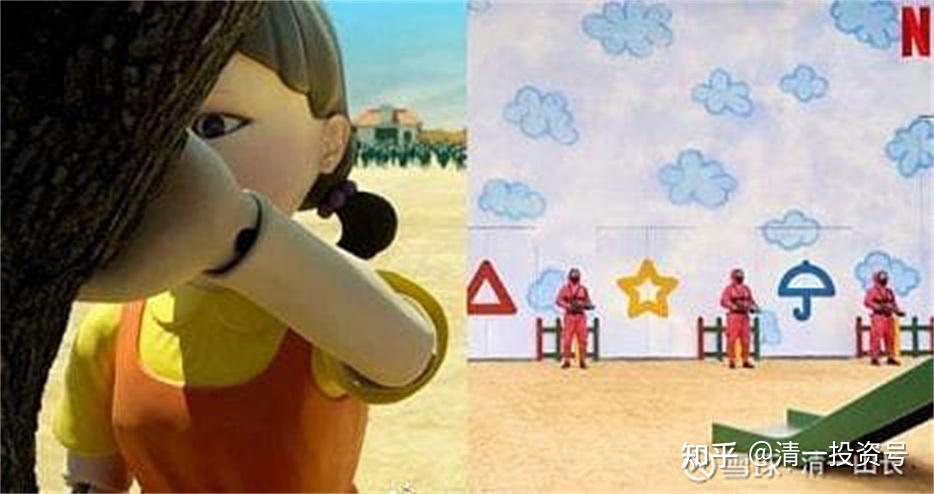

原雪球专栏[218篇.清一大学“职场生涯及社会现状研究”课程！](http://link.zhihu.com/?target=https%3A//xueqiu.com/9310099567/200294604)

清一山长 2021年10月16日

上周和本周，都是清一大学的“**职场和社会研究课程项目**”的学习，上周研究了进入职场的理由。本周采用了现在热播的《鱿鱼游戏》，作为辅助学习材料之一。

一、如果把“鱿鱼游戏”定义为，1、**“参与者所做的事情，并不创造真正的价值，只代表判定输赢的标志和结果，所以只是游戏”**。定义2、**“参与者为了得到钱，而不惜牺牲生命和尊严的游戏”**。

请你举出身边一个现实中的职业案例，符合上述的定义（可以只符合其中一种定义），请详细说明为什么你认为这个行业、职业，就是“现实版的鱿鱼游戏”？

二、你认为为什么第二集中，已经知道游戏的代价是生命，为啥还纷纷要回来参加后续的游戏？核心原因是什么逻辑？他们认为自己是什么状态，才愿意回来继续参加游戏？你能够找出不同核心理由的几类人？并把其中你理解最深刻的一类人，作为人类社会的实际角色，进行一下对比？

三、你认为这个“鱿鱼游戏”，最终赢了比赛的人，拿到了所有奖金的人，他会有什么样的生活感觉？这些大笔的钱财，对他来说意味着什么？设法体会最终赢家的感受。

四、剧中的故事情节，虽然是虚假的故事，很夸张。但影片却真实地反应了职场和社会的残酷。赢家得到一切，输家献出一切。不管你努力还是不努力，优秀不优秀，很多运气的成分决定了你的输赢。**大家都是为了钱，为了赢，不择手段，没有道德，没有信任，没有温情。但赢家，最终也是输家。这就是现代工业化社会的缩影**。你认为怎样才能不玩这种“鱿鱼游戏”？逃脱工业化社会的控制？

五、如果你必须成为电影中的一个角色，你选谁？如果你必须和电影中的一个角色交朋友，你选谁做朋友？请说出你的理由？

六、请找出你在现实中找到的现代职业、现代企业中，有什么职业，不是属于“鱿鱼游戏”——拿命，甚至拿人生所拥有的一切，用来换钱的职业和企业？

规则与上次作业一样，通过抽签方式，来选出本次作业PK的五份卷子，每个班五份。男生女生，分别担任判卷的助教，负责评定对方被抽选出来的五份卷子的成绩，每个人给对方的成绩负责打分，评定出最终的成绩，并公布在班级群。我的助教团队，则负责选出作业水平最高的一方，作为本次作业的优胜方。上次的作业，是女生班输了，这一回不知道女生班能否板回来？

看了以上的课程内容和作业，以及作业评定方式，您认为有谁会不喜欢清一大学的课程安排？欢迎吐槽。
