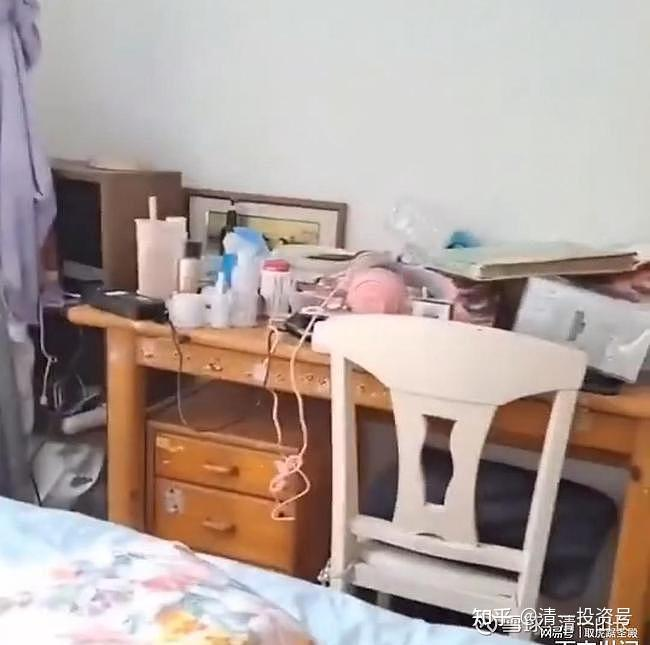

原雪球专栏[219篇.骂母亲是160斤肥猪的留学生女儿](http://link.zhihu.com/?target=https%3A//xueqiu.com/9310099567/200335137)

清一山长2021年10月17日

新闻链接：[网页链接](http://link.zhihu.com/?target=https%3A//www.163.com/dy/article/GMGR267D055270Y1.html)上海23岁女留学生嫌每月1万元生活费少，发帖辱骂父亲，对话曝光

网易网页链接[https://www.163.com/dy/article/GMGR267D055270Y1.html](http://link.zhihu.com/?target=https%3A//www.163.com/dy/article/GMGR267D055270Y1.html)

一个留学欧洲的23岁上海女孩火了：因为公开在网上怼父母、骂父母，邀网友去收拾父母。就因为父亲要求她：每月的花费不要超过1万元，他工资低，负担不起；就公开在网上，朋友圈，指名道姓地骂父亲“死妈的祁某某”，还公布父亲的地址，电话等信息，让网友去收拾她爸。她爹发图给她，说自己每天就吃一碗玉米粥，一份青菜。就为了省下钱来给她。但她骂老爸作秀，卖惨。一点也不同情。自己透支信用卡打车回家，极其浪费，还说她赶时间。超市大买，说自己要营养平衡。但老爸连菜都不敢买，她一点也不觉得不好意思。

下图是她爸原来批评她自己的书桌都不好好收拾，她自己不服气，说父亲管教他完全没有道理。还晒出自己的书桌的照片，意思就是：我自己的书桌，已经收拾得好好的，父亲居然还有意见，实在是太过分了！你们看看她收拾的书桌如何？似乎还是收拾得很漂亮对吧？就是怎么都不像一个读书人的桌子。

此女还把父亲的照片，P上字张贴，到处乱说：北大毕业的父亲，不愿意供她上学！试图羞辱父母。（这父亲51岁，比我小几岁，北大毕业，比我高几个名次，当看他每天的生活，惨不忍睹。我吃稀饭是自愿，他吃稀饭是被迫；我是住别墅，养泳池，吃稀饭。他是省下每一分钱来养女儿，还被女儿骂死。北大毕业的上海人，居然活出了这个格局，真的还是别活了。我怀疑，这父亲，当年是不是到上海企业工作的某个外地穷小子，却娶了一个上海女人，就一辈子，沦为上海女人奴隶了？所以，**我要求儿子，绝不能娶比他出生的城市更大城市的女孩**，是有先见之明的。他最终找了同城的女孩，谁都不嫌弃谁了。

我想：怎么就没有人说我：武大毕业的父亲，居然不让子女上大学？[大笑]。这可是实锤呢！

**中国人，有一种非常奇怪的思维模式——总认为孩子就是“弱势群体”，就是需要父母无尽的爱护。**父母对孩子一句重话都不能说。实际上，根据我的观察，**现代很多家庭，真正弱势的一方是父母**。像这种23岁还有理八道，到处数说父母，想让父母丢人的孩子，内心深处，已经强大到了无敌的地步：只要父母无力满足她的要求，她就要让父母“社会死亡”。所以。把父母的名字和照片，到处在网络上公布，想“整死父母”。难说总有一天，她觉得让父母彻底丢人，让父母“社会死"，已经不足以让她解恨了，可能会自己拿起刀来主持“正义”，把父母砍死算了。

这不是我故意说了吓人的，新闻：[浙江绍兴一中学女生杀害母亲，案发动机，系因母亲不同意其谈恋爱。](http://link.zhihu.com/?target=https%3A//www.163.com/dy/article/GME08NA5055270Y1.html)（年龄才14～16岁。）

网易[网页链接](http://link.zhihu.com/?target=https%3A//www.163.com/dy/article/GME08NA5055270Y1.html)：

[https://www.163.com/dy/article/GME08NA5055270Y1.html](http://link.zhihu.com/?target=https%3A//www.163.com/dy/article/GME08NA5055270Y1.html)

**现在的世界，真的是五浊恶世。黑白颠倒，善恶不分。家长变成了孙子，儿女成了皇上、太后！一个孩子也会拿起屠刀来杀害父母。谁制造的这种恶局？**

我估计：在我的帖子中发言，批评我太狠心的家长，就是希望我像上面的这些“孝子孝女”的家长学习，尽心尽力的去孝顺自己女儿吗？我才没这么弱智呢！起码我知道**我是爹，你要我养，就得听我的。**

今日学堂现在有一个亿万富翁的女儿，在我指导下进行专门的调教。这孩子从小娇养，有点小脾气，送来不久，就闹着想家，想回家跟妈妈在一起。还对我指派给她的老师唧唧歪歪的，挑剔不已。结果我让老师，替她爹，问她三个问题，让她第二天联通电话，跟父母回答这三个问题，她立马就无话可说了：

第一：她**这一生，对世界做了什么贡献？有何种价值？**

第二：她**这一生，对自己的家庭做了什么贡献？对自家有何价值？**

第三：她**这一生，对自己做了什么样的贡献？有何价值？**

让她想好之后，让她跟她爸汇报和回答这三个问题。还提示她：公主班的孩子，年龄跟她一样大，别的啥社会贡献先不说，起码这些公主的爸妈，每天很开心，为自己的女儿很自豪。别的家长也很羡慕他们家长。这也算她们对家庭做的贡献——荣誉的贡献。至于为自己做的贡献，就是这些小公主们，每天都在成为比别人更优秀的人，每一天都在努力的进步。问她：父母一样花钱养她，甚至花更多的钱来养她。她消费比别人多，但创造了什么价值吗？她这一生，为她的父母，提供了什么样的有价值的贡献？是让父母自豪，还是生气？丢人的女儿？

这孩子还有点良心，立马不哭闹了。晚上给父亲打电话，父亲的态度很严厉，就让她不好好学习，以后就别上学了，去上打工学堂去，每天搬砖700块，搬完后还不让看书，只让发呆，让她去吃生活的苦，书就别读了。以后大了，起码可以去打工！这几天，听说搬砖很老实的，每天按时完成任务。也不哭闹了。

这孩子如果现在不抓紧好好教育，父亲的态度，如果不坚决打回去，而是一副老好人的样，很愚昧，一切都逆来顺受，就是愿意被孩子无限奴役，无限供养的样子，我们就没法帮忙了。这孩子现在才13岁。未来，长到23岁，还会老老实实的去搬砖吗？难说媒体上就会出现新闻报道：某留学女说：狗妈养的某某某爹，自己有亿万资产，给我买辆豪车都不爽快。我把这昧良心的爹的电话给你们，地址给你们，欢迎你们去绑我爸去，让他破产就好。谁让他不给我买豪车的（富二代的脾气，肯定要比上海的工二代要大一点，对吧？[大笑]）。

我今天接了一个咨询的单子，是一个工二代的孩子，17岁了，不上学，跟父母家里斗。我问他：不会读书没关系，他会不会做事？会不会做运动？有没有朋友？有没有本事闯天下？他想干啥？他很茫然，说自己啥都不会做。我告诉他：小女13岁，我赶出去，她也会活得好好的，三国语言都达到母语水平，去当家教，也很受欢迎。还告诉他：我怎样从3-4岁，就要她走30多公里的路，只给一瓶水，一个馒头。每天都要跑5公里晨跑，还要干活，不然就会被我赶出去。问他受过这些磨练没有？知不知道，这就是亿万家产的富二代的每天生活？比常人更苦？他对此很吃惊，说如果：他来我们家的话，肯定就活不下去了。我说他小看自己了，他不会做的比我女儿差的。他只是从小被家里人宠着，削弱了他的能力罢了。因为他父母以为自己当“太监”，好好伺候着他，长大了，他就能当“皇上”，他们自己就升级了。这游戏，其实只在家里有用，外面没人认他做“皇上”的。

这孩子还算懂事，就说：不能让家里这样养下去了，必须自己找出路。要自我负责了，但他从来就没运动，不可能跑5公里的，我让他每天走五公里就行了。先把身体弄好，我再教他别的方法。告诉他未来一年要做什么。做到了，一年后他还可以找我一次，指导他怎样出国，上大学，找一个好工作。如果这一年没做到这些事情，就别找我了，想干啥就干啥去！

这孩子，如果家长不醒悟，未来五年后，也就是上面故事的男版演义了。**如果家长觉得就该为他们承担一切后果，这孩子是永远也长不大的**。别以为“孩子长大之后就好了”！**好孩子，长大之后会越来越好。但坏孩子，长大之后，也会越来越坏。谁说会自然好的？坏孩子，会把他遇到的所有的人生的失败、挫折、无能，等等，都全归咎于你，让你来承担她人生失败的后果，甚至要杀死你**。很不幸的是：他们的直觉真的是对的：**人生失败的儿女，最大的罪魁祸首，就是父母！坏孩子，就是这些愚爸蠢妈们，一步一步精心培养出来的毒龙害虫！**

网上的舆论，都在一致的谴责这个女儿，都在同情这对可怜的，被女儿骂成猪的爸妈。其实，我从更高一点来看，这种毫无廉耻之心的女儿，不正是中国古人教诲的——**“国之四维，礼义廉耻”**，连一条也不符合的大混蛋吗？她就是社会的害虫。**是谁培养出来的这种害虫？不就是这对混蛋爹妈吗？别以为他们俩可怜，他们才是制造“毒龙”，制造社会垃圾的罪人！我是不会同情这种父母的。**

**评论回复：**

**[清一山长](http://link.zhihu.com/?target=http%3A//xueqiu.com/n/%25E6%25B8%2585%25E4%25B8%2580%25E5%25B1%25B1%25E9%2595%25BF)[2021-10-17 17:42](http://link.zhihu.com/?target=https%3A//xueqiu.com/9310099567/200336200)回复：**

这孩子在西班牙留学，每月一万元生活费够不够？我查了一下网页：结论是500欧衣食住行就够了。当然，如果要耍酷，估计5000欧都不够吧！西班牙留学费用相对来说比较低，生活水平也不是很高，所以去西班牙留学一个月的费用并不是很多，除去西班牙大学学费，500欧元左右就够了。
西班牙每个城市的消费水平是不一样的，大城市在马德里和巴塞罗那物价比较高，租房的费用也较高，每个月衣食住行费用总共约500欧左右。

**土地丰收回复[清一山长](http://link.zhihu.com/?target=http%3A//xueqiu.com/n/%25E6%25B8%2585%25E4%25B8%2580%25E5%25B1%25B1%25E9%2595%25BF)：**

请教山长个问题？

一、12岁潘柏如，孩子想留在今日自立学堂继续学习，
第一、我说行，但要说服我帮你交学费？（因为在今日没有全力以赴）
第二、说服今日自立学堂老师让你欠费学习以后打工赚钱还，要么委培或者让老师免费收你也行！

二、要么爸爸每天给你20元钱从昆明徒步去拉萨，再去外面流浪，或者回藏区放牦牛去，还能赚钱养活自己，再把工资拿回来，到时候给妹妹交学费[笑]

三、在家跟示范班学习，原来没进今日前，每天是武道馆标准训练时间八小时，一日二餐素食，自己做饭、内务，赵老师说你主要问题是原来父母不重视学习，爸爸主要带你徒步去了四年，没看书学习，还有就是伙伴价值，但是如果慢慢抓起来还是行的，对你几年在野外徒步收获给予肯定，意志力、沉稳、魄力、身体素质、吃苦耐劳、图像记忆都很强，想想在家肯定比在外流浪强，最起码还有住，还管吃不用风餐露宿街头、乞讨。所以**他自己出了个计划表，每天6点起，晚上9:30分睡，早上15公里跑步，阅读学习做饭、内务、休息，下午垫上运动二小时或动物爬行二小时，再学习英语或示范课做饭卫生，晚上拳击或摔跤一小时，信念打卡阅读，每天保证5小时左右运动，照顾我们的生活**，坚持了快一个多月，还挺好，这次到大理攀岩还很开心。给孩子足够的选择权力，自己选的都严格的去执行，我们家长就成长好自己。

1.孩子按现在的流程走运动加学习两手抓。

2.今日自立学堂每天搬700块砖。

3.组团打工或去登封武校，去一年。

通过一年坚持努力再回今日，哪种选择更好些？

**清一山长[2021-10-18 11:41](http://link.zhihu.com/?target=https%3A//xueqiu.com/9310099567/200386924)回复土地丰收：**

按你现在的流程走好一些。不需要去自立学堂搬砖体验，这都是一些娇养的富家孩子需要的体验，对你们孩子来说小菜一碟，根本就不算啥。**跟上示范班的学习，强化日常的武道基本功训练就好。**

**如果你们的目标是考清一武道馆。建议你们日常的运动练习，不要练拳击，更不要练实战，你现在练歪了，将来是矫正不过来的。建议你们平时练练巴西战舞——卡波耶拉（Capoeira）。倒不是实战力多强，而是这种像游戏一样玩，身体的协调性好，将来学实战太极就容易了。你要学了拳击，改学太极难度太高，原理完全不一样，一般人做不到的。学这个也简单，拿个视频来模仿，玩一样，正宗不正宗的不管，玩得开心就行了。**

参考链接：

[清一投资号：134篇.37岁博士回家养老，会是你家孩子的未来吗？](https://zhuanlan.zhihu.com/p/580530679)

[清一投资号：141篇.怎样才能为女儿创造一个比我们生活的世界更好的世界？](https://zhuanlan.zhihu.com/p/584730874)

[清一投资号：148篇.把天使变成废材的“疯妈妈”！](https://zhuanlan.zhihu.com/p/589999422)

[清一投资号：164篇.如何整治用“寻死觅活”来胁迫你的熊孩子？](https://zhuanlan.zhihu.com/p/593715041)
