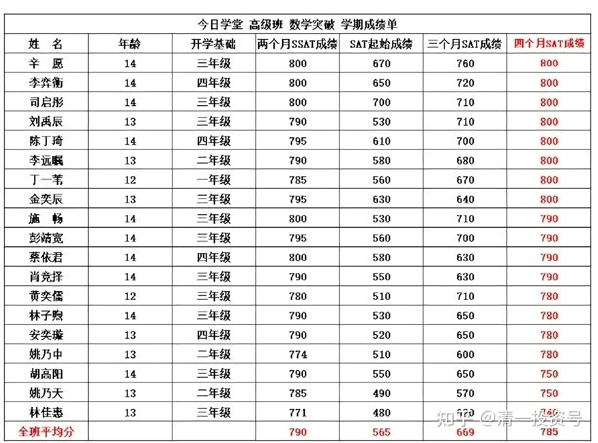
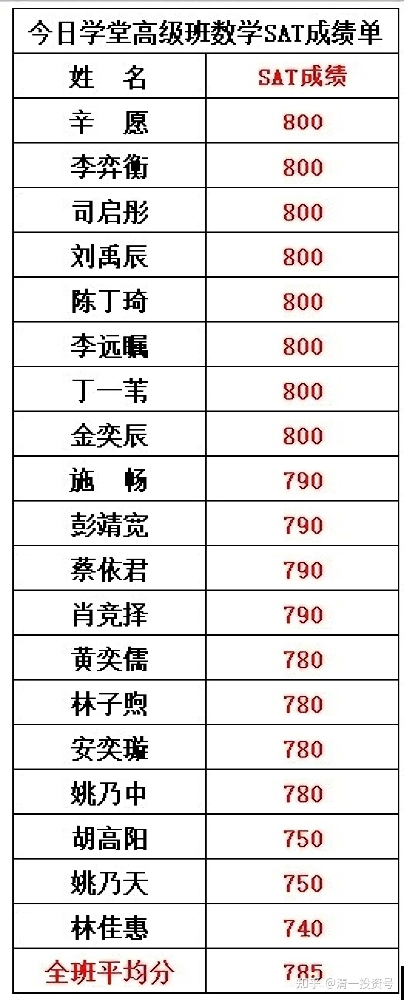
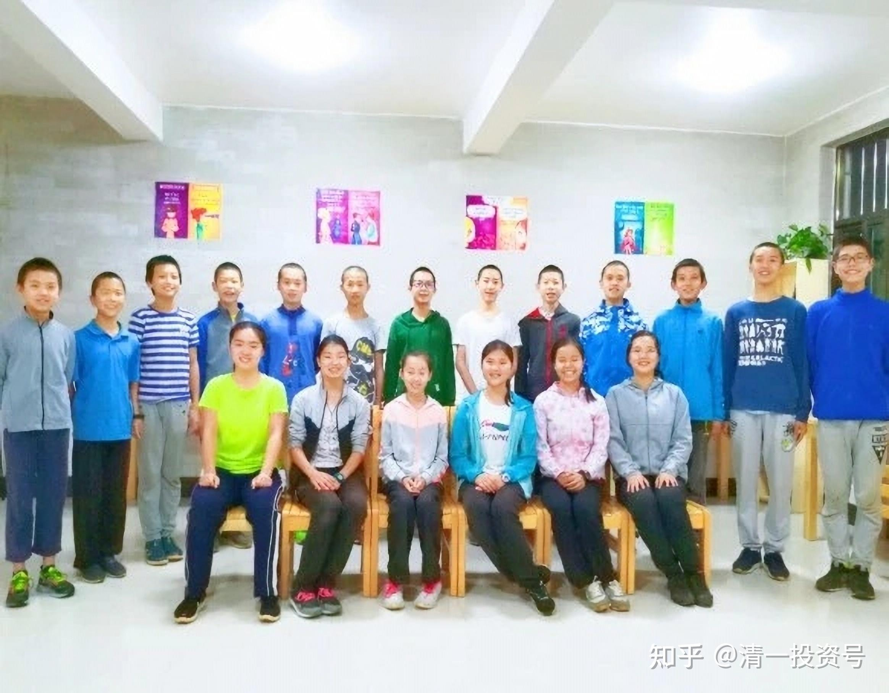

原雪球专栏[41篇.千元打赏一个大赚美金的点子](http://link.zhihu.com/?target=https%3A//xueqiu.com/9310099567/111333014)

清一山长 2018年8月1日

美国高考——SAT的全国高中生平均成绩，只有505分。这还是美国的高中生中，一大批学习太差的人，已经大量弃考后的“优选平均结果”，因为只有真正想上大学的学生，才参与SAT考试。个别要求全体学生尽量参加考试的州，平均成绩还不到480分。所以，美国排名前100名大学的入学平均成绩（SAT考分），也只是600分左右。前10名大学的平均入学成绩，是730分左右。可是，在中国，却有一批年龄只有12～14岁的“外国孩子”（相对美国人），采用了先进的互联网+教育模式，利用AI智能教学模式，仅仅用了四个半月的时间，就实现了从小学到高中数学的跨越：参加教学试验的全班学生，取得了785分的平均成绩，更有8人获得了满分的优异成绩。媒体已经报道了此事。新闻链接：

腾讯网：[爬藤第一步：四个月拿下SAT数学](http://link.zhihu.com/?target=https%3A//new.qq.com/cmsn/20180730/20180730038446.html)

[网页链接](http://link.zhihu.com/?target=https%3A//new.qq.com/cmsn/20180730/20180730038446.html)：[https://new.qq.com/cmsn/20180730/20180730038446.html](http://link.zhihu.com/?target=https%3A//new.qq.com/cmsn/20180730/20180730038446.html)

除了数学，还有英文的突破，仅需四个月就学会一门外语

原版高清视频链接：[首届国际今日内部突破班结业视频](http://link.zhihu.com/?target=https%3A//v.qq.com/x/page/r0738sevkwq.html)

[网页链接](http://link.zhihu.com/?target=https%3A//v.qq.com/x/page/r0738sevkwq.html)：[https://v.qq.com/x/page/r0738sevkwq.html](http://link.zhihu.com/?target=https%3A//v.qq.com/x/page/r0738sevkwq.html)

美国高考SAT成绩的一些信息。“SAT的全美平均分：阅读494分，数学508分，写作482分，总分1484分（相当于新SAT 1090）”

网页链接：[https://www.sohu.com/a/127886719_611605](http://link.zhihu.com/?target=https%3A//www.sohu.com/a/127886719_611605)天啊，SAT美国本土平均分居然这么低

美国平均总分最低：哥伦比亚州1285分（新SAT 950分），平均到数学上只有475分左右。

平均总分最高的州：伊利诺斯州1819分（新SAT 1300分），平均到数学上也就650分左右。

现在特悬赏千元，询问最聪明的雪球人：

一：如何才能让这种先进的教育经验和方法，普及到我们的国民教育，提高全民教育素质，获得最佳的普及教育效果？

二：**中国人**是制造业产品输出大国，却**每年花费450亿美元购买海外教育。我们国家赚的是苦力的钱**，**外国人不仅轻松体面地赚我们的大钱，顺便还鄙视了一把我们的教育和文化**。如果我们中国人发现了这个突破口，我们应该怎样做，才能向全世界输出“中国先进教育”？用更轻松的、更有尊严的方式，来赚取大量的外汇？

三：有无可能采用金融资本的运作模式，快速复制和推广这种新教育模式？希望有PE玩家提供专业的建议。

特别说明：

**一：这种教育模式，不是仅仅局限于英文教育。**这种教育模式，既然能够让中国学生用外语来击败国外的母语学生，也就可以用于任何国家的母语教育模式，当然包括我们国家的母语——中文高考模式。也就是说，我们也可以用最短的时间，来突破中国高考的全部内容。“我们完全可以只用3年左右的时间，从零开始学习，就全部覆盖掉12年的中国高考教学内容，并取得优秀的成绩。但目前我们没有去玩中国高考的原因，是我们的家长和学生们都很不愿参加与中国高考接轨的教学实验，他们更希望我们“与世界教育接轨”。由于教学实验的投资，以及人员（学生）均来自于家长，我们必须尊重家长的选择”。

**二：本教学试验项目，经过多次检验。**其中四个月突破英语，已经经过了五届学生的实地教学检验，目前已经进入了大量普及和推广的教育阶段。四个月数学突破项目，是在突破外语的基础上进行了的，教学难度远低于零起点的外语突破。成绩已经由权威的SAT考试机构和家长全程参与验证和考试，证明是真实无虚的结果。请见到什么好东西都喜欢跑来喷点粪的喷子们远离。

因为，一、如果本实验教学的结果是假的，您并不会受到任何伤害。真正受伤害的，是参与实验的学生家长。他们出钱出力，还付出了信任，来参与这个新教育的实验项目，却得到了主办人员编造出来的一个“虚假结果”，最应该愤怒、伤心，并骂人的是他们，而不是无知的您！

二、如果本教学试验的结果是真的，您就是不肯相信的话，您反而很危险。因为，您“坚持传统教育模式”的儿女和孙辈，未来很可能面对一群您从来不相信会存在的强劲对手的竞争，你子孙的教育失败就是注定的了！我相信这是每一个负责任的家长都不愿意看到的局面。

所以，请各位大胆地假设，小心地求证！不要不动脑子张口就胡说八道！坏了你的好福气。

本次的千元大赏，将在结束前分给认真回答了此问题的人。您只需要认真回答其中的一个问题即可。如果回答的问题不足奖金的分配，我也会把奖金分给积极参与的朋友——无论您的回答水平高不高，正能量参与就有奖！钱拿出来，就是要用完的！希望见者有份。

