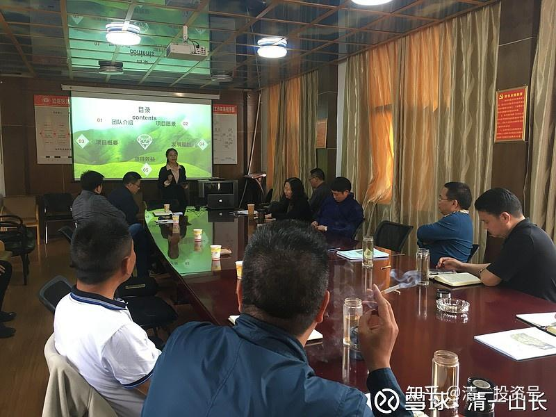

原雪球专栏46篇.总裁班的有钱人，最想学什么课程？

清一山长 2018年12月16日

*（题图为黄校长在介绍三语学校项目）*

转发上课学员的课后总结：

作为首期清心总裁班学员，上课之前我做了功课，看了不少清心学员的日记与总结。我以为是类似的内容，所以先预习以图更好的吸收。虽然预料到山长不断地在更新自己，每次讲的内容都会有所不同。但这次总裁班依然给我很大的意外，**这些课程看来都是山长精心挑选的，专门为各位“总裁”量身定做的内容。**以往的清心课，主要对象是想做新教育的，所以以破除乱元思维，清心醒脑，及办学实务指导（如表演课、辩论课、演讲课、历史课、音乐课的示范）等课程为主。

而总裁班受众，多数是忙于事业，经济基础比较好的人群，这群人可能更关心自己及后代如何守住现有成果，维护阶层不掉落，当然能继续提升阶层就更好。因此山长这7天的课程全围绕这一主线进行了全面深入细致的讲解，从各个角度进行新思维的“轰炸”以助我们对阶层有全方位的认识，知道努力的方向，了解注意的事项及成果展示，让我们对未来有更准确的参照标准。

**[清心总裁班大总结——让一代代都成为总裁的上上策](http://link.zhihu.com/?target=https%3A//mp.weixin.qq.com/s/vRWvd2ZmRi2qa24XMKznLg)**

[微信网页链接](http://link.zhihu.com/?target=https%3A//mp.weixin.qq.com/s/vRWvd2ZmRi2qa24XMKznLg)：[https://mp.weixin.qq.com/s/vRWvd2ZmRi2qa24XMKznLg](http://link.zhihu.com/?target=https%3A//mp.weixin.qq.com/s/vRWvd2ZmRi2qa24XMKznLg)

（申明：虽然第一期清心总裁班的效果很好，但我目前没有继续开第二期的计划。我觉得教总裁们的投入回报比太低了，不如教年轻的学生们，他们吸收会更多一些。）

**附录：**

**清心总裁班大总结——让一代代都成为总裁的上上策**

陈健传 2018年11月16日

作为首期清心总裁班学员，上课之前我做了功课，看了不少清心学员的日记与总结。我以为是类似的内容，所以先预习以图更好的吸收。虽然预料到山长不断的在更新自己，每次讲的内容都会有所不同。但这次总裁班依然给我很大的意外，这些**课程看来都是山长精心挑选的，专门为各位“总裁”量身定做的内容。**以往的清心课主要对象是想做新教育的，所以以破除乱元思维，清心醒脑，及办学实务指导（如表演课、辩论课、演讲课、历史课、音乐课的示范）等课程为主。

而总裁班受众多数是忙于事业，经济基础比较好的人群，这群人可能**更关心自己及后代如何守住现有的成果，维护阶层不掉落，当然能继续提升阶层就更好。**因此山长这7天的课程全围绕这一主线进行全面深入细致的讲解，从各个角度进行新思维的“轰炸”以助我们对阶层有全方位的认识，知道努力的方向，了解注意的事项及成果展示让我们对未来有更准确的参照标准。

**一、阶层与提升方向**

成功不是靠努力，靠能力就足够的。**阶层意味着圈子、资源、人脉、能量、影响力，而这些对成功起着更巨大的决定因素。**

以经济阶层为例，社会大致为分5个阶层：

**1、底层。**马克思说资本家是剥削阶层，无产阶段是被剥削的对象。而底层的悲哀在于，他们求着被剥削却没有人愿意给机会，他们找不到工作，每天都为怎样解决一日三餐而发愁。也根本没有学习与提升的机会，看不到希望，没有未来。只能渴望奇迹改变命运。

**2、下层。**靠身体来赚钱，叫“身本家”。如快递员、流水线工人等等。他们不愿意思考和学习，只能靠身体赚钱，活得很累，一旦老了干不动了，将变得不值钱。所以为何中国有养儿防老的传统？为何更喜欢男丁？跟“身本家”思维有很大的关系。

**3、中层。**靠知识改变命运，叫“知本家”。他们主要靠知识和经验的脑力劳动。工作往往是动动嘴巴、笔头或鼠标键盘，像教师、白领、企业家、公司高层等等。往往越老越值钱，因为知识与经验越来越丰富。

**4、中上层。**靠资金的分配和运用来赚钱，叫“资本家”，如投资家、天使投资人。这个阶层靠的是钱生钱或资产生钱的被动收入，人睡觉了一点也不影响资产的增值。身体完全被解放出来，可以自由选择自己喜欢的事情做。而且因为已经实现了财富自由，所以他们不再为金钱而活，而是有着更高的追求。

**5、上层与看不见的上层**。他们是游戏规则的制定者，平台与标准的创建者。

“总裁们”多数属于“身本家”加“知本家”的层级。虽然班里不乏亿万身家的大老板，但始终还得靠身体去拼搏，时间都很宝贵，抽不出21天的空参加完整的清心课，山长才为我们这些身不由已但又渴望“开慧”的人群特别开办的总裁班。除了身体上的不自由，“总裁们”的意志也是不够自由的，比如让人头疼的政府关系与不得不参与的各种商务应酬，很多时候得看人脸色，给人面子而不得不做自己不喜欢的事情。大家都很羡慕与向往更高的自由度，渴望往中上以上层级走。

**如何才能提升层级？通过精英教育赋予更强的素质与能力，并分享这个平台的资源与影响力，这是最容易走的路线。**体制教育以培养合格的打工仔为目标，强调知识与技能。国学班、读经班基本以儒家思想为核心，而儒家思想与西方普世价值观是相冲突的。比如儒家的核心——礼与三纲五常的等级秩序，与西方人人平等的基本观念是冲突的。所以儒家思想培养出来的学生很难得到目前最强势的西方文化的尊重。

在这个重视生命，重视感觉的时代，显然西方已经走进了死胡同。如西方医学根本意识不到气、经络、五脏六腑的整体联动关系，只会头痛医头，脚痛医脚，虽然集齐了全世界最优秀的人才与集合了最高端的科技，医疗成本高昂但对慢性病却始终没有很好的解决方法。以《黄帝内经》为基本指导原则的道医，能更好地解决生命健康的问题，并且能节省大量的医药成本。

另一方面，**西方文化不断鼓舞人的欲望，倡导消费主义与享乐主义，这是条不归路，欲望是填不满的，人不断抢夺资源，挤压其他物种的生存空间，迟早会把整个地球带向毁灭**。道家和佛家主张清心寡欲，消除欲望，看破幻象，减少焦虑，明显更能提升幸福度，更容易知足常乐。而且减少物质的消耗能使地球获得可循环的发展。所以道佛两家的文化是西方非常需要的。

今日学堂就是以佛道文化为核心指导思想的精英教育，**当今日学堂的学生批量考上常春藤名校并退学回今日大学读书以后，今日大学将一下子被全世界所关注与认可。**而今日大学背后的文化根源：道学与佛学也会成为引领未来世界文化的潮流。今日大学背后的一批人，也会成为新文化的阐释者与标准制订者，从而踏上文化的上层。

上层是可以相互流通的，成为文化上层以后很容易打通政治上层与经济上层的门路。在今日学堂门槛还不太高，还没有全部完成文化上层晋升之路时，在此之前就加入并跟随，这会轻松很多。因为当今日大学成为文化上层的时候，你或你的孩子已然成为里面的一员，从而分享今日大学的能量迅速提升自己的阶层。就如阿里巴巴创业的18罗汉，他们很多最早也并非很有能力之人，就如彭蕾，以前只是一个小前台而已。正是他们跟紧了未来的上层，所以相对轻松就获得了成功。

**二、破除“总裁们”的安乐意识**

上完第一天的课，很多总裁们可能紧迫感还不强，因为他们的经济地位现在退休就可以让他的家庭获得财富自由，过得像中上层一样自由的生活。山长很了解我们的心思，通过电影课《教父2》进一步掐灭了我们的幻想。第一代教父的父母处于社会的底层，没有尊严，求做奴才而不得，甚至连生存机会都会被轻易剥夺，很小的一点权益可能都只能拿命去换，因为除此之外他们一无所有。相同的问题，上层只需要一两句话就能摆平。

看到底层的悲惨，让我们不敢不维护与提升阶层。但**不想是一回事，能不能做到又是一回事。**连柯里昂家族经过九死一生的艰辛幸运地混到了经济上层，但依然面临重重危机，尤其是第二代教父麦克的哥哥姐姐为代表的家族成员毫无家族意识，只会吃喝玩乐，甚至不惜一再出卖家族利益来换取个人的私利，这种内部的敌人是最可怕的，防不胜防。就算麦克守住了第一代教父的成果，万一自己的后代也只会吃喝玩乐，那祖辈用鲜血打下来的根基将会被断送。

所以**说到底，还是要靠教育，锻造后代的素质与能力，并让他们有家族观念，以家族利益优先才能获得长久的发展。**这个教育，不仅是指学校教育，家庭教育也相当关键。如何避免培养出只会吃喝玩乐的孩子，山长给出了具体的指导措施。如不给看电视，不带孩子随便去旅游，因为这些都在刺激孩子的欲望。不送体制学校，要给孩子找好的伙伴。因为家里的防火墙做好了，还得考虑外部的防火墙。从小要穷养等等。

山长还分享了他是怎么收拾孩子的很多故事，其目的都是为了让孩子学会自我负责，自我管理，当一名创造者而非享乐主义者，如18岁以后必须自己养活自己，家族的财产不会留给他们享受。引导他们从小树立家族整体观，他们的事业、伙伴、婚姻伴侣的选择都必须获得家族的认同，否则得不到家族的支持，甚至有可能会被逐出家门。

反观我们自己，多数家庭由于不懂教育，培养了一大堆不良品性的孩子，如果让他们以这种趋势下去，做接班人是相当危险的事。更由于我们自己本身的家族观念就不强，家长不会有意树立权威，无法获得或在西方爱与自由观念的主导下不要求后代的跟随与认同，导致家族没有向心力，往往随心所欲各做各的，无法团结一致，后代往往不愿意接班。但阶层的维护与提升往往得经过数代人的共同努力才能完成，所以这是摆在我们面前的一大难题。

**三、家族传承详解**

**阶层的维护与提升既然要经过数代人的共同努力，则家族传承机制是必须要考虑完备的。那家族传承具体该怎样布局与落地呢？到底传些什么？怎么传？后代怎么才能或才愿意接住，并一代代传承下去呢？**山长给出了完美的示范。参考博文：春节礼物：给一百年后张氏家族子孙的信。

[http://blog.sina.com.cn/s/blog_4f7cd6a10102v3be.html](http://link.zhihu.com/?target=http%3A//blog.sina.com.cn/s/blog_4f7cd6a10102v3be.html)

[https://mp.weixin.qq.com/s/Bry60j2bg1ZSGMQXmIWjMw](http://link.zhihu.com/?target=https%3A//mp.weixin.qq.com/s/Bry60j2bg1ZSGMQXmIWjMw)

虽然我早已看过数次博文，但经过山长详细讲解以后有了更深入、更清晰的了解，以及思考该如何做出自己的家族传承来。

**第一点：从自我教育与提升做起。**作为百年家族传承创始人，你必须首先要是明智的，这是所有环节当中的核心。如果自己能成为精英，就能给后代更大的支持，让他们起步更高。如果做不到，至少要理解后代，全力支持后代，不障碍他们，不成为他们的天花板。这就是自**己要先成为有深度文明和良好教养的父母，才能做好榜样、基石，与做好家庭教育。**

**第二点：给孩子选择优质的教育。**目前来看，自创或加入新教育学堂是最佳的选择。

**第三点：创建或加入一个拥有共同价值观的社区**。比如联合资深清粉，山长课程学员，孩子同学的家长等，建立家族传承大联合的线下社区。这个社区往往同时解决了教育、事业、伙伴、婚姻、医疗、养老的需求。

**第四点：财务上从投资与管理做起**。自己不懂的就跟随“国王”散步，增加被动收入，解放身心用于提升自己。生活上遵循道家清心寡欲的原则，并不需要多少开支，节省“弹药”用于更有意义的事情上。

**四、道法自然的生活智慧课**

山长一上来就笑眯眯地讲今天教我们如何省钱。省钱与阶层有何关系呢？首先，身体是革命的本钱。因为生活观念的不正确，往往是越有钱，越会糟蹋自己的身体，身体越不健康。比如贵得离谱的乳胶床、塑身衣、海边别墅等都不利于健康，大部分病都是吃出来的。没钱人反而有幸躲过这些东西的伤害。

其次，钱是拿来买机会的，是用来铺路的。就如教父麦克，成为经济上层之后大力做慈善，捐助大学，还是通过议员之手，就是期望同时打通政治上层与文化上层的关系，为后代子孙的发展铺路。因此要养成不浪费的习惯，把好钢用在刀刃上。不浪费并不是因为小气、吝啬，降低生活品质，而是因为看透了物质的本质，明白没有支出的必要。

山长从道法自然的角度逐一仔细分析我们的衣食住行，颠覆了我们很多固化的观念。包括如何穿衣，选择家具，选住宅，什么月份生孩子，怎么走路及跑步，烟、酒、糖、茶对我们到底有什么危害，如何正确的素食等一系列非常贴近生活的指导。对我冲击最大的主要是肉食的危害。因为在生活当中为融入社会无可避免要吃些肉。

**1、肉食更难以消化且毒害更大。**克林顿起初也是肉食主义者，无肉不欢，身体出现严重问题以后，开始反思饮食方式，开始不吃肉，不吃奶制品，不吃鸡蛋，而且几乎滴油不占。改吃蔬菜、水果、豆类等东西，避免摄入任何有可能损害他血管的食物。后来他的身体状态有了极大的改善。

**2、肉食是伤害大脑的食物。**素食能让人更聪明。参考文章：

四岁入学! 师生全部菇素, 全世界最聪明的孩子聚集的学校!

[https://www.sohu.com/a/404191834_120724266](http://link.zhihu.com/?target=https%3A//www.sohu.com/a/404191834_120724266)

全世界最聪明的孩子全部吃素!

[http://www.360doc.com/content/17/0620/21/41047226_664988226.shtml](http://link.zhihu.com/?target=http%3A//www.360doc.com/content/17/0620/21/41047226_664988226.shtml)

**3、肉里面含有大量的激素，鱼虾基本都是避孕药喂大的。**这些激素会导致早熟。此外，对女性会导致不孕。对男性因为雌性激素的增加，会让男性失去阳刚之气，变成一个伪娘、娘炮。所以为何社会上的男生越来越多娘里娘气的呢，跟这个有一定的关系。

**4、在轮回的角度和环保，食物供应的角度。**据统计，人一辈子平均吃掉3只羊，11头牛，43头猪，1100只鸡，鱼虾无数。假如相信轮回，那你得花多少辈子才能还清这个债？想想都恐怖。另外，目前全世界每年喂养牲畜的谷物足以供20亿人食用。吃素可节省7亿吨谷物（全球粮食的一半），那么只需30%的土地，就足以喂养我们的所有人口，从此远离饥饿之苦，土地无需化肥将得以再度喘息，再生，恢复。

**5、食物与情绪是有能量的。**回族不吃猪肉并不是因为回族人认为猪是他们的祖先，而是认为猪又懒，又脏，又贪吃，能量值非常低，吃猪会拉低他们的能量值。另外，动物被杀的时候是什么感觉？是不是悲伤、愤怒、仇恨等负面情绪？情绪也是有力量的，这种垃圾能量会融入血液污染肉质。假如一个母亲的情绪非常糟糕，她的奶也是不适合喂养孩子的，这种奶会变成毒奶。所以古代伊斯兰教宰杀动物时，会有个仪式，先安抚动物的情绪。但现代哪管这些？因此我们吃的肉基本是带着垃圾能量的。

**五、德需配位**

《泰坦尼克号》中，贵族阶层对爆发户的新兴贵族是非常不屑的。中国虽然这几十年经济建设取得巨大的进步，中国人开启了全世界范围的买买买，但送钱给他国的同时却没有得到别人的欢迎与尊重，反而**因为不懂得自尊尊人的中国人越来越多到外面丢脸，引起了外国人对全体中国人的反感与鄙视**。就像香港，即使是同胞，依然很看不起大陆人，把大陆人比喻为蝗虫，非常抵制大陆人的进入。可见，**有钱并不代表就能得到相应阶层的尊重，主要取决于与之相匹配的素质。**

今天的**课程，就如照妖镜一样，照出我们身上诸多的问题，如不珍惜生命，不珍惜生活。**很爱浪费时间：打牌、聚餐吃饭、喝茶、逛街等等，但同时特别怕死；出门虽会穿西装，但身形缺乏锻炼，随意懒散，随地坐卧，边走路边吐痰，说话声音像打雷又旁若无人；习惯抢路、挡道，缺乏素养又浑然不知，好像世界只有他们存在，目光相对时，总是凶巴巴的，好像时刻防范着周围人；去旅游时只在意“到此一游”，具体艺术本身价值如何，却不怎么关心，只是为面子，为感觉而游，思想极其浅薄。

知耻而后勇，发现问题是改正问题的第一步。从自我做起，从一言一行做起，做一个有荣誉，有素养，被欢迎的中国人。

接着，山长还分析了中国女人和日本女人的12大区别，指出中国女人身上的劣根性。如中国女人常常教育他们的小朋友，遇到邪恶势力要善于躲避，说老天会收拾他们；中国女人通常认为外国的月亮会更圆一点，一般认为嫁给外国人是一种“荣誉”；中国女人大多宽容自己的出轨，中国是世界上婚外恋最为泛滥的国家。对丈夫埋怨、呵斥，在结束一天的劳累很晚回到家中后，妻子会吼到“你又死到哪去了”，喜欢以奚落男人作为自己“不凡身份”的体现。对自己的婆婆则巴不得她快点挂掉；中国女人很爱财，会找一个有钱的“老”男人，哪怕当他的N奶也不介意；中国的母亲教育她出嫁的女儿一定要控制好男人，以及所有的财产。

为何山长似乎对女人的缺点更不客气呢？中国自古最常用骂人的话是“他妈的”。不管男人女人都是“他妈”生的，而且由**于男女分工的原因，女人承担着更多教育的责任**。所以可以说，**中国人的素质是由中国女人所主导的。因此，女人尤其要注重自身的教养及对子女的教育方式，这是提升整个家庭素质的关键。**

**六、佛道文化的展示**

第一天提到以佛道两家文化为核心指导思想的精英教育是用于提升阶层的最佳方式。**那佛道两家具体讲的是什么？对我们有何实际指导意义？**接下来山长给我们讲了佛道两家的智慧。虽然仅仅是开了扇窗，让我们得以窥见一点点真正的佛家道家智慧，更重要的是给我们指明了方向与树立了信心，佛道两家的智慧并没有想像中的难懂，并且是与生活密切相关的，而不是如空中楼阁般的学术象牙塔。

**佛家认为，有情来下种，人来到世上是带着灵魂使命的。**找到自己的灵魂使命，并尽全力去完成，活好每一天，珍惜每一个当下，时刻奔着使命前进，不留一丝遗憾，则无情亦无种，不虚此生。无论任务是否完成心中都再无挂碍，得以解脱，灵魂将升华至更高的层次世界中去。

即使未能解脱，依然又落入轮回中，也要努力当一个经营者、建设者。比如努力建设你的家族，那你跟这家族是很有缘的，后世你很有可能轮回到这个家族里，那你今日的建设成果很可能是造福于你自己。即使你不投生于此，如果大家都在积极建设家园，社会与国家的环境就会提升，你的来世也跟着受益。就如国家现在越来越强大了，你随便投身哪个家庭，一般而言都比以往的时代要好些。

**而以《道德经》为代表的道家文化是人生成功的指南。**历朝历代均成为统治者私下研究学习的秘密。“道可道，非恒道”。道是指在这世界上，你可以用无限的方法来实现自己的目标，因此不要固定和局限自己的思维和行动空间。道家提倡的无为，并不是不做为，不是消极避世，老子、庄子等道家高人“不做事”的原因，是因时机不对，世道不行而远离或者尊重因缘，不妄为。不是他们没这能耐，而是不想违背自己的价值观，更不想因自己的做为而生灵涂炭。或者盛世不需要折腾，没事找事，如汉初黄老之治。他们是不敢乱为，“豫呵其若冬涉水”，非常理性和谨慎。一旦需要的时候会积极入世，把事情做得非常漂亮。做完以后，他们又会归于一，归于无为守静的状态。

今日学堂短期内就能取得这样高的成就，与道家智慧的指导分不开。如**奉行少思而寡欲的极简主义，就能做到专注于目标，减少不必要的干扰**。我们在学堂时，看到很多男生是剪光头的，头发被很多孩子判断为无用之物。可见，他们连每天用于洗头、梳头的时间都省下来做更有价值的事情去了。

如“因其无私故能成其私”，山长的家族传承方案就是无私的，**法脉大于血脉，只传给最有出息的，不管是子女还是弟子一视同仁**。如此，反而激发了每个人的斗志，让他们都不敢松懈，积极成长自己以争抢这一荣誉。

如“执今之道,以御今之有”。虽然今日学堂以中国传统文化为根基，但非常懂得运用今天最先进的科技与资源，如孩子们都用iPad、电脑，各种实用的APP，可汗学院等来帮助学习，因此学习效率非常高，成为与世界完全接轨的现代人。

如“祸莫大于无敌”，今日学堂在新教育领域甩了第二名几十条街。这种无敌状态是很危险的，很容易懈怠。所以**山长又创造出清一学塾来，让两家学堂保持良性竞争的状态，其结果必然是两家学堂同时飞速进步，谁也不甘心丧失荣誉。**

**七、成果展示**

今日学堂的精英教育到底是吹牛，还是真的可以实现描绘的目标呢？用这种方式教育出来的孩子，能否帮家长维护好阶层，甚至是超越家长，进一步提升家族的阶层呢？是骡子是马，拉出来溜溜。

山长弟子明仪，孩子张钟瑞、小明慧都分别上台秀了一把。他们的表现毫不疑问征服了在场所有“总裁们”。若自己的孩子能培养能这样，相信我们花多少钱都愿意。尤其是**明仪讲的面子课程示范课，其深度、广度、细度给我们的冲击极其震撼，原来书是这么读的，非常受益。**可以说她的授课水平已经不亚于高校博导的水平。

我在大学时也听过不少名气很大的教授的课程，但远没有这个的深度。由明仪作为带班老师的清一学塾，可预见其未来的教学质量是如何的，这真是我们所有家长的福气，不仅多一个选择，而且两家学堂的质量必然是同时飞跃的。另外，像明仪这样的孩子不是一个，是一批。小明慧因为年龄太小，但据其深厚的根基，很可能将来远超明仪这帮孩子。这些成果的展示，无疑是对前几天课程如何提升阶层，解决麦克式家族内患难题，做好家族传承，做一个受人尊敬的中国人的力证。

**八、刘老师的大礼包**

最后，山长还额外送我们一个大礼包——刘老师的现场答疑。刘老师不仅当场解决了许多同学困扰多时的问题，她对家排、心理学、灵性学炉火纯青的运用更让我们大开眼界。刚上过“慧心课”的同学眼神都不一样了，透出更多的祥和与幸福。

**最后，感谢山长、刘老师、助教元宵老师与黄校长给我们的精神洗礼**。我们此生是多么幸运，山长不仅指明了方向，让我们不再迷茫，而且更是无论教学上还是做人做事上都给出一步步具体的示范，手把手教我们。阶层的维护与提升的任务任重而道远，从自我提升做起，从孩子教育做起，从搭建与加入并共同建设优质平台做起，或许这就是我们让一代代都成为总裁的上上策。
