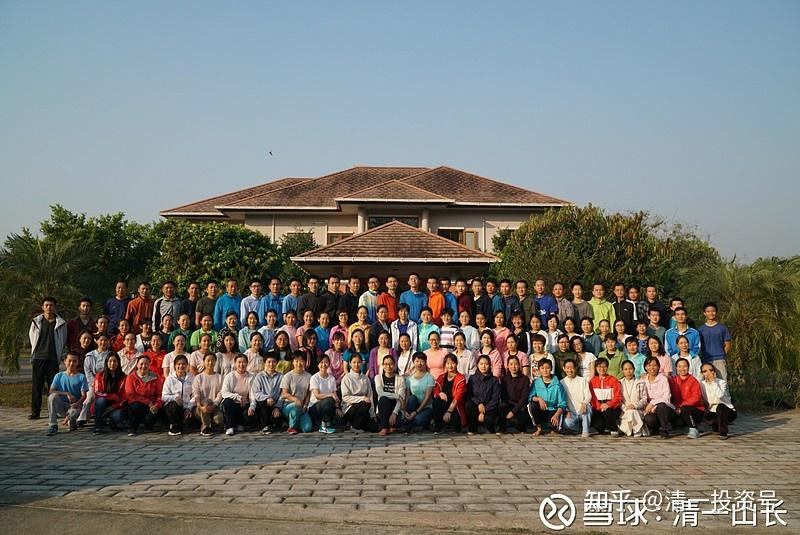
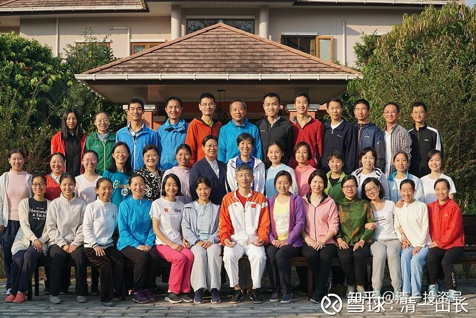

原雪球专栏49篇.心理思维和行为课：到底是什么东东？

清一山长 2019年3月6日

这段时间，我在上课。全部时间都占满了，没有时间上雪球。反正雪球也只是业余爱好玩玩的。

利用寒假期间举办的，为期21天的首届**“思维和心理行为学”课程**，昨天刚刚结束。举办地点是在泰国清迈我的“清一府”中，总共有来自全国各地的130余人参与。由于现在的房子还不够大，建筑物只有两千多平方，来的人超过预期，所以大家住得很拥挤。今年年底，会落成一栋2000平方的新公寓楼，有28套一室一厅，专供来访者住宿使用。所以，明年朋友们再来的话，就可以住得宽松一些了。

说明：本课程是全免费课，只接待新教育圈的朋友们参加。我不仅要义务负责上课，还要供吃供喝，每周花费不低于十万泰铢。幸亏股市上赚的钱还算丰厚，除了用来广交天下朋友外，多盖几栋新楼也毫无问题。我还在设计两栋小一点的楼，每栋450平方，希望明年这个时候就能完成，可以让更多朋友来清迈度假，做做“文化教育旅游”。

发两张培训完成后的学员集体照上来，有图有真相：

*照片一：清心三年级合照*

*照片二：清心三年级合照*

**学员课程总结（部分）**

**明仪：**如果不上这次课程，我一辈子都看不懂，更做不了真正的清一新教育。

因为，真正的清一新教育，是改命的教育。但若没有这次课，我永远不知道孩子的命原来是这样被改的。永远无法知道我听过、讲过无数次的“心理行为教育”，在我看到的冰山一角下面原来是这样一座大山。永远只能在孩子的顽固问题下焦头烂额，最后低头认输。

更重要的是：我也不会知道我自己的命是如何被创化出来的。**永远只是做一个木偶一样的局中人，被牵着过完人生，然而不知道：牵我的人是谁。**

你的人生被谁牵着？孩子表面的言行背后是谁在推动？

找不到这个“谁”，你和孩子就不可能掌握命运的主动权，不可能去主动地创造你想要的命。

**刘灿：**《思维和心理行为学课程》总结

上过山长课的人都有一种感受：山长的课非常有价值，无论什么课每上一次就颠覆一次我们的认知。的确是这样，但我现在认为这些课真的只是开了个门而已。没有对比就不知道差距，这次清福三年级的《思维与心理行为学课程》让我真切体会到山长思维的高度与深邃的智慧。每一个行为背后的驱动力是什么？核心信念是什么？如何认识自己，了解自己？

当我们真的看懂这些，无论夫妻关系，孩子教育，做新教育老师，我们都得到了一个全新的高度和视角，我们的生命厚度也将不同，其价值不是金钱可以衡量的。现在山长免费赠送给清友们上课，祝福每一个有缘参加学习的伙伴们！

**耿宁静** 心理行为学是读心术

“知人知面不知心”，当我们在人际交往中吃亏时，常常会发一句这样的感慨。这句话表达了两层意思，一是知人知面又知心是非常困难的，二是大家都想懂点读心术，做人做事成功率更高一些。

神奇的21天课程之后，我们发现其实我们竟然连自己都读不懂，读懂自己的那一刻，竟然是一场完美的疗愈！一旦读懂别人的心，我们被自己的无知震憾到的那一刻，竟然不是紧张，而是深深的喜悦，因为，我们终于拿到了一把开启自己和他人美好人生的金钥匙！

**马心学** 清心三年级 心理行为学 读心术班课后总结

作为家长最大的希望就是能够教好自己的孩子，可面对孩子的问题常常束手无策，不知道怎样读懂他的心？

清福三年级就是解读“读心术”的奥秘，让您可以**从一句话中就足以知道这个孩子的性格特征，人际交往模式，经历特征，心理因素等等，从而改心改命。**

遗憾的是，大多数人因为不懂得这个原理，不得不为自己的无知付出相当大的代价，让孩子的人生饱尝失败和苦难，让希望之门紧闭，让机运之神远去了。

**康茜婷**：我们用自己的想法创造生活，却没有思考过自己的想法来自何方；我们以为自己不会因为某些不正当的理由做事，或许事实是**我们不曾真正洞察自己行为背后的动机是什么。**

如果把这些问题看透彻了，会发现无论何种不如意的情况，都是我们内心那个不了解的深处，真正的选择。不禁竦然：谁控制了我的思想？之前我在为谁而活？

现在的我照常训练，脑中却摆脱了烦人的思绪；习性依旧，却能够多一分觉察，少一分纠结。我不再简单地用“做了什么”来评判我自己，而**更多地关注“我为了什么而做”**。现在，生活在我眼中已经改变，接着我才能真正改变生活。

什么是读心术？能识己，方能察人，因为我们都有一样的困扰。

转变如何发生？人生导师+高能量的团队，21天才只是一个开始。

**周荣敏**：21天的《思维和心理行为》课程，解密了山长的滴水藏海读心术，如何从别人简单的话语里推导出TA的所思所想；解析了一个人从自大自恋的小人物变为圣人的心路历程；解读了父母信念模式在孩子身上的复制如何处理、家庭关系中的怨妇情结如何修正；揭示了怎样安装“快乐-痛苦按钮”；让行为成瘾症孩子完美转身为优秀学生……。如果你也想掌握读心术，学会改造一个人的信念体系，装上“导航动力系统”，走向人生觉醒之路，“心理行为学课程”是你的不二之选。

**雨晴**：教育能够对一个人产生多大的影响？足以改命！但当自己做了老师，却发现自己能做的极其有限，连学生的小毛病都难以去除。

原因在于：我和学生一样，**不知道行为背后代表什么信念，才会流于表面的教学和改进，才会有“道理都懂我做不到”的郁闷**。但道理真的懂了吗？课程之后我才发现，我从未如此透彻地看到驱动行为的原因，从未如此了解自己和他人。

命运就此改变：学会清晰地做出自己真心乐意的选择。

**何宗武**：今日新教育可以实现英语、数学、泰语、太极比赛的短期大突破，是全世界绝无仅有的教育奇迹！奇迹背后的心理行为教育，堪称教育绝世法宝！

谁能真正拥有和掌握此法宝，就可以像今日老师一样，点石成金，赢得教育奇迹，成为极受欢迎的新教育名师！也可以成为受人羡慕的优秀家长！

**过俊杰**：这次清福二三年级，是改命的课程。**绝大多数中国人，都被植入了导致人生痛苦和失败的各种信念。**所幸这次课程帮我们系统清理了这些信念，否则我们的人生还将在无意识中不断轮回，不断经历痛苦和失败。

这套心理行为高级课程，也是山长首次系统地揭示今日学堂“压箱底”的秘密，非常实用。如果用到自己的孩子和学生身上，能够帮他们装上“导航仪”，通向人生的成功和幸福。非常有幸参加这次课程。

**龙水英**：终于明白为什么有的孩子从天使沦为了问题孩子，有的孩子到了顶级的学校，状态同样是不如意？为什么很多人苦苦寻觅亲密关系的解决之道都无益？明白多年努力工作，总是充满失意……那是因为我们的核心信念出了问题。

**张鑫毅**：课程感受 回顾人生45载，从一无所有到财富自由，日子过得好像还没有以前开心，为了追求财富徒生不少烦恼。来到泰国清福二年级后，给了我柳暗花明又一重境界的感受。早上突破21公里半马成绩庆祝课程结束，以实际行动感谢山长再造之恩！

李彩盈：**“思维和心理行为学课程”总结 **驱动汽车前进的是发动机，而驱动我们人生的发动机就是**信念系统**，这就是新教育的核心——“心”的教育。如何能透过孩子的行为，掌握其心理？如何用孩子喜欢的方式，为他们装上积极而强大的信念系统？有了正确强大的“发动机”，孩子厌学、网瘾、贪吃、早恋等等都不再是问题，问题孩子也可以变成精英！本次课程就是学习如何为自己以及孩子的人生装上真正的“发动机”，即便对今日学堂的全体老师，也是山长首次系统地讲解，并使用案例实战的学习方式，让我们对“心”的教育有了真正的实操能力。相信这次培训将改变整个新教育包括今日学堂教师的师资素质！
