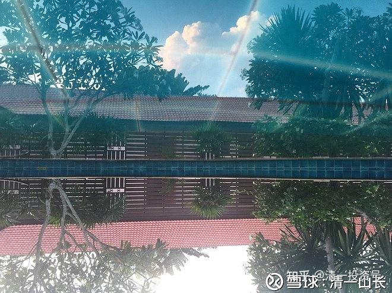
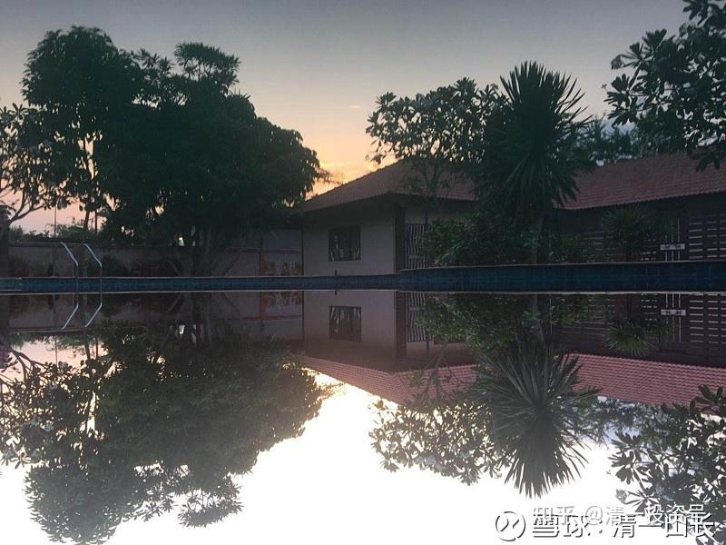

[原雪球专栏](https://zhuanlan.zhihu.com/p/541457282/edit)51篇.清迈三月好辰光 清心一年级课程总结

[清一山长](http://link.zhihu.com/?target=https%3A//xueqiu.com/9310099567/column) 2019年4月10日

泰国清一府 内景

整个的三月份，我在专心上课中度过。因为我的主业是教育，副业才是炒股。一周多前才刚结束课程，才有机会打理一下我的股票账户。春节以来行情如火如荼，但我只打开过两次账户。也正因为平时根本不看账户，涨翻天了我也没感觉。所以金融市场收获多少，真的与你盯不盯账户没关系。并不是每天数几遍账户上的资产，就可以稳定赚钱了。有可能越数越少，还不如不数。

发三篇学员总结上来大家看看。也许对你有用。

下面转发的课程总结，主体部份是一个广东白手起家的亿万富姐的课程总结，她也是被学员选出来的本班的班长。她的先生，上个月刚刚上完二年级课程回去了，她这一次来泰国补一年级的课。她写的课程总结很踏实，就跟她的家族企业一样，是靠踏踏实实一步一步干出来的企业。只有这种踏实的人，才走得长远。所以她的课程体会，我特别发上来，作为一个代表给大家看看。

再次申明——我目前并不接受球友的上课申请，别误会我要推课。我的课程向来是不对外提供的，而且今年的课程早就满员了。我一年也上不了几次课，实在没时间。我还有武道弟子们要带，我带的几个武术弟子，正在学习太极实战技术。他们将在两个月后，要当擂主：一天之内打一百场实战擂台赛。之后还要去与专业拳手实战对抗，看中国的古太极是不是真的上不了台面。目前他们正在苦苦练习中。五月份打完后，我传视频上来给大家看看。

**一：佛山 雪婷**

上完课程后，我才知道我原来是那么的无知愚昧，过去的我原来是一直活在别人的世界里，为别人而奋斗。目前我们所看到的是一个虚拟的世界，它处处充满着陷阱，如果我们无法清醒的面对现实的生活，将会一生被利益集团们所捆绑，无法得到自由。

本次的清心课，课程的信息量巨大、内容非常丰富，每一堂课程对于我来说都价值上百万，我如何能够拿到手。其实这如同一个自助餐厅，全部东西都摆在那里，每个人的机会都是平等的。吃多少选多少取决于自己，选择的部分它是否可以吸收进入我们的身体，还需要一定的时间。如果我要把清心课21天的内容完全吸收，按照山长所说的至少要花2年的时间去消化，并且**在生活中时刻做出来。**

**二：玉萍 深圳 清心课一年级大总结 2019年4月9日**

21天的清心课结束了，回国后每天脑子里都会像放电影似的重复着上课的情景。每次听到别人说话，我脑子里就不由自主的思考，他说这话的背后是什么信念系统，话的背后真正的想表达的是什么？而自己呢，不再让话轻易从口出了，每次说话之前，先问自己，你说这句话想表达什么？或是你想表达的如何用最简洁的语言说出来让别人听得懂？每当看到外面的世界，看到别人做的事，自己做事，都不自禁地问自己：“你看清楚这个世界了吗？看懂这些被表面隐藏的本质了吗？你今天被商业洗脑了吗？你心清醒了吗？”

21天，21门课，21个小窗，21道光照亮了自己的世界，信息量太大了，每门课对于我来说都是超高价值的，每一门课都必需要细细深入学习，不但要弄懂，还要会使用出来。

**三：广东：少金 清心课大总结**

人生总会有一些相遇是：相见恨晚！这清迈的清心课就让我有相见恨晚的感觉。上完清心课后觉得自己之前迟迟不来上清心课的理由真的很可笑和荒谬！核心原因就是自己自以为是和思维不够！之前我认为清心课是新教育老师的培训课，我暂时没有打算做一线的新教育老师，认为自己暂时还用不上，所以先推荐老师参加清心课。可是，当我上完清心课后感叹：我真的太迟来上课了，这就是我需要的！但也觉得自己又是幸运的！世界之大，人数之多，但能来上清心课的人仅是极少数的幸运儿！因为我认为清心课是山长帮助我们打开自由而清醒地行走在这个星球上的一扇门！它适合于希望能清醒地活着和提升自我的所有人！而我之前居然不愿拿出21天的时间来上清心课，却愿意过着一年又一年的愚味无知的生活！这是多么可笑！如果没有清心课的洗礼，让自己更加清醒，走的路越多，错得越多，回头再走，花的时间更多！这次清心课信息量很大，我的总结仅仅分享自己最有感触的收获。

**（一）、信念系统对命运的重要性**

信念系统是每个行为的背后都有一个让人坚信不疑的观念。耶鲁大学教授罗伯特·埃布尔先生说：“信念是一种动力，而强烈的信念显然具有价值更大的动力，它能促使一个人持久不衰的努力，以完成或大、或小的目标、项目、心愿和理想。”

**不同的信念系统就会造就不同的人生模式。我们想要成为怎样的人就要修改自己的信念系统。**

**1、精英的信念系统：热爱运动，不怕苦，不断超越自己。**美国就是一个拥护运动精神的国家，所以全民素质和竞争力是世界第一。精英还是阅读爱好者，终身学习者，他们拥有经营者的思维，在被别人需要时，并不断超越自己的局限，让自己拥有更多的能力服务于别人。反之，平庸者的信念系统里有着许多人性的弱点：贪婪、懦弱、胆小、不负责，抱怨。今日学堂就是培养精英的地方，通过电影课、主题课、表演课、运动、做事等培养孩子的精英信念系统。

**2、一个人的社会阶层也是由信念系统决定的。“**身本家**”**的信念系统就认为只有努力工作才能赚钱，因此他们一辈子靠大量的劳动维持生计，也就是以身为本。“知本家”的信念系统：通过知识改变命运，通过知识的运用可以帮助自己和孩子完全脱离原有的社会层级，他们开始可以拥有“晋升之路”，“知本家”可以通过良好的教育，以及学习、勤奋——超人的勤奋来实现晋升。“资本家”，就是以资金为本，他们的信念系统是：赚钱不是靠身体，而是靠脑子；工作不是用来拿工资的，而是要用来做自己最喜欢的事情；成功不是靠运气、靠别人，要靠精心的谋划；成功不是靠等靠要，而是靠自己去创造。例如：乔布斯、拉里·埃里森、马克·扎克伯格，谷歌创始人等。还有一个是看不见的上层，即是规则制定者，平台建造者（看不见的人，游戏规则的创造者）。

从以上的阶层的不同的信念系统也可以看到，有些穷人为什么能够普升阶层，是因为从小的教育是更高阶层的信念。最明显的例子就是以前的地主后代为什么在祖辈的财产被没收后，仍然能够富裕起来。而一些富人的后代却变成穷人，因为教育输入的信念系统就是穷人的信念系统。一些社会上成功人士不知道自己成功的信念是从何而来，也不会把这些成功的信念传递给孩子，所以中国普遍是“富不过三代”的现象。每个阶层背后都有一个信念系统,想要改变你的社会阶层，就先要改变你的信念系统。

**3、信念系统对一个人影响如此之大，当我们没有足够的思维分辨的时候，往往就被利益集团控制。**例如：商业陷阱、医疗陷阱、青春期陷阱，甚至连音乐都成为控制你的工具。天啊！想到这些，觉得真的很恐惧！如果不是因为有山长的清心课帮助我们看清这一切，我的生命还是自己的吗？一切都在别人的掌控当中,这是多么可怕的一件事情！

学习信念系统后让我发生的改变：

（1）我与孩子的沟通方式、语言和心态发生了非常大的改变，每次沟通或在孩子面前，我都会思考：我在传递怎样的信念给孩子？这样的信念会带来怎样的后果？并且我在说话和做事时会思考一下：我这样做背后的信念是什么？带着一份觉知说话和做事。

（2）我打破了从小父母和身边人输入给我的一个信念。从小父母就说我的体能不行，长大以后如果靠体力吃饭，一定会饿死！所以一直以来只要遇到需要体能的运动和事情，我就会害怕，不敢去突破，内心总有一个声音告诉我不行的。这次清心课回家后我突破了21公里的半马。有了这次突破原来固有的信念的体验，我开始对突破自己的局限越来越有信心了！同时把自己亲身的体验分享给孩子，不要为自己设限，敢于不断突破自己！

（3）对于外界带给我负能量的信念系统的信息进行屏蔽，包括商业广告、音乐、书籍等。或者是带着觉知地了解一下这些现状情况而接触，而不被影响。

（二）、思维强大的力量

这次清心课山长通过表演课、电影课、音乐课、教育理念课等课程分析每一个人行为背后的信念系统和思维模式。我在思考：山长是如何做到可以从别人一个表情、一句话、一个动作、一个服装等细节的信息解读别人的心理模式等信息？山长是如何能读懂电影画面一些非常细微的细节所表达的意思和潜台词？山长为什么能精通古今中外的历史和未来的发展趋势？还有普通人一生能在一个行业做到极致已经非常厉害了。但是山长却能在教育、金融、武术、医疗、佛道等诸多方面都有不俗的研究成果。山长是如何做到的？这也是由综合的因素决定的，我仅分享自己在清心课上看到的两点因素，就是山长精英的信念系统和强大的思维力！前面已经分享过信念系统了，接下来我总结一下我在这次清心课上对于思维的理解和收获。

1、**乱元思维，是我们所做的事常常和想达到的目标不一致，前后矛盾，心口不一。没有逻辑、没有最基本的理性，凭感觉说话和做事、没有因果依据的思考方式。**以前我对乱元思维的理解仅是目标感不强，在找感觉，思维不够清晰而已。也没有意识到乱元思维会给自己的人生带来多么严重的后果。这次的清心课让我从不同的角度看到乱元思维给自己的人生带来的可怕的后果。

（1）乱元思维，没有独立的思考能力，处处在各种洗脑当中而不自知！只是跟风、随大众的心态，自己及自己的后代都会成为被人控制的工具！

（2）乱元思维，人生没有目标或者目标不清晰。

一个人没有目标导致的人生十大亏：读书亏，不知道教育的目的和意义；工作亏，当工作是你的主人，你就是为了获取一份收入而服务于它的时候，你就是奴仆。你把自己的生命和时间出售给“主人”，服务于别人的生命目标，当然是亏。只有你把工作、职业，当成你人生的舞台来尽情表演，来向世界展现你的美好身份时，你才有可能是“赢家”，你才可以满意地离开这个世界；结婚亏，不明白婚姻的目的和意义，过着互相索取的生活，只会越来越痛苦，只有真心为对方付出的心态才能幸福；出行亏，不明白出行的目的，浪费时间和资源，而没有意义；吃饭亏，为什么吃饭？什么样的东西才是身体需要的食物？之后才是怎样用最简单的手段实现这个目标。吃饭仅是满足身体的需要就行；睡觉亏，不睡觉的时候，省下时间来，要干些什么事情？不明白“睡觉”的意义和目的，你连“睡不睡”都很困惑。了解“生命的奥秘”。**把“不睡，少睡”当成珍惜时间的标志，就是不懂生命的表现**。**睡觉是灵魂在学习的时间，就是在让大脑更聪明地工作。**起码有一元思维以上才能做到；穿衣服的亏，你觉得“逛商场”是一种享受吗？上帝给每个人一生的资源都是一样的，花在不一样的事情上就会得到不一样的结果。衣服简单适合就可以轻松实现；事故的亏，不明白事故的原因，下等人：受害者模式，别人为此负责；上等人：自己为此承担责任；人际关系的亏，被动接受还是主动地选择，是否有目标和有原则地建立自己的人际关系？“万物皆备于我”——你周围的一切都是你人生的资源。

错误的人际关系，①没有选择的交往，当你往所有方向前进的时候，你就被困在原地。花费的精力、时间无穷，却没有效果和收益。②“混脸熟”是人际关系的陷阱。人，并不是认识的人越多就越好，而是**喜欢你、尊重你的人越多越好。**“万物皆备于我”，主动式人际交往——积极建立符合自己人生目标的人脉圈。被动式人际交往——赠人玫瑰手留余香，展示自己良好的形象；人生理想的亏，理想代表一个人的核心价值观，如果是乱元思维，我不知道自己究竟有什么值得用生命来捍卫的理想，人生又有何意义？我正在一步一步地在做事当中理清自己的思维，找到自己的人生理想。

**（3）乱元思维，愚昧而又乱作非为**，人生如此不堪而又不自知！不仅浪费了此生，还要不断轮回在愚昧中而不自省！体现在**中国人的劣根性上。比如，非常聪明，但非常相信传言；凡事喜欢抢，从出生抢床位，到临终抢坟地，从头抢到尾；在大事上能忍气吞声，但在小事上却斤斤计较；能通过关系办成的事，绝不通过正当途径解决；计较不是认为不公平，而是自己不是受益者；动辄批判外界，却很少反思自己；自己爽不爽没关系，反正不能让别人爽；不为朋友的成功欢呼，却愿为陌生人的悲惨捐助；不为强者的坚持伸手，却愿为弱者的妥协流泪；不愿为执行规则所累，宁愿为适应潜规则受罪；不为大家的利益奋斗，宁愿为大家的不幸怒骂；不为长远未来谋福，愿为眼前小利冒险**等等。

这些行为背后都是“疯子”的**乱元思维逻辑，不符合正常理性的逻辑，自己所做的事常常和想达到的目标不一致。**

**2、一元思维，目标清晰，思维逻辑一环扣一环，条理清唽，知行合一**。清心课上老师通过一个旅居日本25年的人和一个中国记者的访谈来了解日本人的一元思维。一位日本大学生可以为美味的三鲜茄子潸然泪下，毅然决定创业种茄子。还有一位日本著名的出版界巨子见城彻，为赢得日本大作家五木宽之的交往和信任，他每读完一本书就用书信的形式写读后感，写到第二十五本的时候，五木宽之就写了一张明信片给他，说谢谢你常年读我的作品，我非常高兴。见城彻潸然泪下，然后继续写，又写了25封信，写到第五十封信的时候，五木宽之说，好，我要见你一面。多年的奋斗之后，见城彻成为了日本首屈一指的大出版商，这也体现了见城彻的一元思维的知行合一和做事做到极致的精神。

可见拥有极致一元思维的人，人生成功的可能性远远高于乱元思维的人，乱元思维的人的人生没有目的地乱转。而一元思维的人，目标清晰，考虑问题环环相扣，逻辑严谨，而且知行合一，在行动上做到极致。

如何训练一元思维？①制定自己的人生目标和规划。②用佛式辩论的方式训练我们的思维逻辑。③为实现自己人生目标制定计划方案，在知行合一的行动做事中提升自己的思维。④在日常说话和做事中，时刻提醒自己是否是围绕着自己的目标，逻辑是否合理。⑤阅读提升思维的书籍，或找到志同道合的朋友以小组讨论或辩论的方式提升思维。⑥练武和运动，在身体的体验中提升思维。

**3、二元思维，让我们看到这个“一元”的方向上，思考任何选择就会有阴阳两种结果，爱与恨同体，有多少爱就有多少恨；欢喜与痛苦同体，有多欢喜也就有多痛苦**。这样，让我们就不敢“妄动”。比如很多人想拥有伟大的爱情，却没有思考过怎么样才是伟大的爱情？比如梁山伯与祝英台、罗密欧与朱丽叶，这些伟大的爱情的代表，会通过痛苦、分离来体验什么叫伟大的爱情。情痴，千年轮回就在这一念之中过去了。**这些都是找感觉的结果**，所以**找感觉的人永远找不到感觉**。这些例子不仅让我看到了事物的阴阳两面，也对学堂一直所说的感觉型的人和目标型的人有了更深一步的了解。原来这两种不同的类型的人不仅会有不一样的人生，甚至一念千年，执着一念，反复轮回。

清心课还有很多很有价值的内容，我需要一点一点地消化学习和应用。以前我对老师所说的一门深入了解得不透彻，只是认为孩子在适当的年龄一门深入地学习适当的内容。这次清心课真的让我大开眼界，惊叹于道家智慧的深邃！惊叹于山长的学识渊博和家国天下的理想情怀！我发现在清一新教育里、在山长这里，有我一辈子都学不完的东西，我不要再到处求学了，一门深入地在清一新教育里学习，这已经够我一辈子用了！这次清心课也让我进一步了解清一新教育的教学理念、清一新教育和道家文化对国家和世界的意义！这更加坚定了自己的选择，我的个人理想仅是沧海中的一滴水，需要汇入大海，才能不枯竭！所以我成为新教育平台的一分子，参与平台建设也是在为实现自己的理想而努力！

感恩山长的智慧引领和对我的“除笨扶愚”的帮助；感恩钟老师每天带领我们梳理课程的思维线和指导我们通过辩论的方式理解课程的疑问，也解答了我们很多的提问；感恩同学们积极地讨论和辩论帮助我理解课程；感恩所有为此次课程服务的老师和学生们，因为你们的付出，才有我们如此安心地上课！感恩让我来上清心课的所有因缘！

参考链接：

[51篇．清迈三月好辰光 清心一年级课程总结](http://link.zhihu.com/?target=https%3A//www.ximalaya.com/sound/470026620)（音频）
