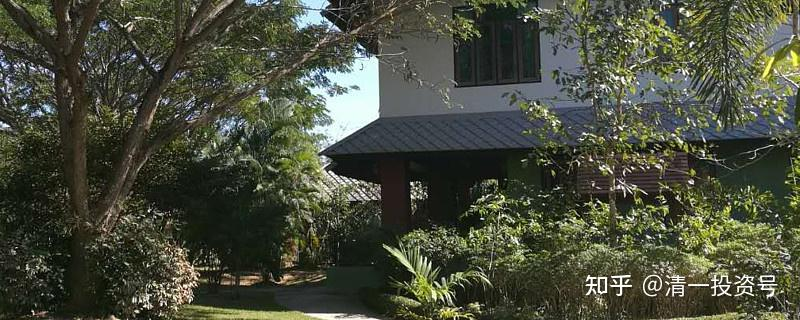
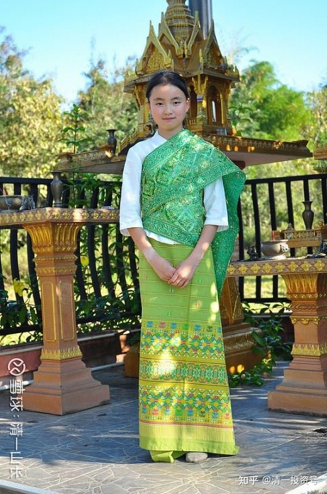

[原雪球专栏](https://zhuanlan.zhihu.com/p/541457282/edit)58篇.网络教育是笑话吗？中国教育该提速了！

[清一山长](http://link.zhihu.com/?target=https%3A//xueqiu.com/9310099567/column)2020年3月2日

导读：本文核心，要解决几个问题。

1：怎样学习，效率最高，效果最好？怎样才能轻松当学霸？

2：真想读世界顶尖名校，怎样的路线图才是最轻松，最省事的路径？

3：要找个好工作，该去什么地方读大学？要学什么专业，才最有前途？

本学期开学，政府通知学校暂停开学，上网进行教学。刚开始我认为政府还是很明智的。网络时代了，还用100年前的古老的老师讲课，学生听课，记笔记，看课本，考试卷的传统方法来教学，多笨呀！多想想，又觉得：体制的教师，其实不懂网络教学的原则，可能只会“对着摄像头，上跟原来一样的课，更乏味”。体制内的学生也和我们的学生不一样，厌学情绪严重。老师不监督，可能根本就不会好好学习的。因此，似乎体制学校谈“网络学习”，理想很好，但执行很难到位。不知道各位家长，是怎样看你们孩子的“网络教学情况”的。估计是千奇百怪的场景吧？

新教育是怎么做的呢？本学期，由于肺炎的影响，当地政府通知我们不能正常开学。于是今日学堂就“无缝链接”，按照正常的时间正常开学，全面进入了网上教学模式。我们去年9月新招的突破班新生，平均年龄11岁，上个学期总共学习了两部电影剧本，达到了熟练的程度（我们学习英语，不讲基础的，直接让学生上硬通货——用欧美电影脚本直接学习，是大学级的内容，体制内学生大学毕业都看不懂原版电影）。我们的规划，是用一个学期时间，打好语言学习基础，**学会英语思维模式，实现英语的零突破，英语词汇量要达到2000-3000词左右的基础词汇，并可以熟练进行对话与交流。**

**第二学期**，本学期就要开始“**阅读量，词汇量提速**”了，需要学生快速提高阅读力和词汇量，以及强化英文的理解速度和深度。本学期末要实现的英语教学考核目标，是20天就要完全背诵完一部新电影的全部台词。这个任务，其实是连大学英语专业的学生，也很难完成的（不信试试看？）。但我们的老师们并不焦虑，因为班上好的学生，现在就可以实现这个目标了。本学期开学以来，网上教学进展顺利。老师们发现，除了个别同学（每个班总会有一些不上路的学生的），整体学生的学习能力、进度和速度，都比上学期有明显提高，学生的学习积极性也很高。教师们也很拼，我看每天的时间比正常教学还忙！大家都非常的充实。这说明：新教育的教学灵活性，可以在网络条件下快速跟进。家长们主要的不满就是：运动的时间太少了。不像正常学习时，每天学生们都有大量的运动时间。现在都在家里，动不了。我们的教师团队在清迈，每天都有大量的运动活动时间。

**突破英语第二年的任务**，是“科学课程学习”，**用英语作为工具，来学习海外的科学教育的课程，也借此把词汇量扩大到6000～8000左右**。

**突破英语第三年的主要任务**，是进入“人文课程学习阶段”，**用英语作为语言工具，全面学习英美文学、历史、哲学、演讲、辩论**等。同时会让学生学习一部分美国K12加州教材，熟悉一点美国的教学方式，词汇量应该可以达到1.2万以上。这些词汇量，与“新东方小红书”强行背出来的“死词汇”还不一样，都是可以用的活词汇，跟英美的母语认识者掌握的一样。

等第三年的课程学习结束之后，学生就达到美国高中毕业的程度了，而且成绩优良。如果去参加SAT考试，就可以通过美国前100名大学的录取线！这就是我说的“三年全部学完英美12年课程”的基本规划。目前我们已经完成了28个教学班的学习，现有15岁的学生，已经完美实现了三年规划，成绩优秀。他们就等18岁正式入读海外知名大学了。

现在的新突破班，是采用改进过的版本来学习的。学习效果、进度和深度，都会比原来的突破班模式效果更好，可以实现远超欧美学校12年的教学效果，剩余时间，还可以学习更多、更丰富有趣的内容。这些课程，理论上，都是可以在网上进行的。我们计划5月份，找一个免费班的学生来做视频直播的教学示范，有兴趣者可以完全跟踪她的学习步骤，我们会完全分享，示范我们的学习方式和学习内容，让跟随者可以全面跟随她示范的学习过程。（注意关注相关的微信号就行了）

疫情考验之下的体制教育，与现代化的“网络教学接轨”情况怎么样呢？最近，我们学校接到省教育厅的通知文件，我们都要笑破肚子了：核心是要求小学生的网络学习，每节课不能超过20分钟，中学不超过30分钟。每天的学习量，中学不能超过2小时，高中3小时。剩下的时间干嘛？我猜学生们肯定就是玩游戏了！反正家长也看不见，管不着。最最搞怪的，就是要求学生和教师，“开学后要从零开始学习！”。这就是说：现在学习，都是搞了玩的，大家都不必认真，等正式开学了再好好学一遍！我看这种通知，让传统的教师们也全都松了一口气，不用担心网上教师会抢饭碗了。于是全体学生和教师，以后没回校上课的时间，就“假装网络教学”好了。中国这一次被疫情强迫进行的网络教育改革，效果就被全体教师、学生和教育管理部门，以“经实践检验，网络教育是不可行的”为名，放弃了迎接教育现代化的可能！这对于保护体制教育的“现有权利”很有好处，但很遗憾，中国学生又一次失去了用新时代的网络教育突破传统教育的机会！我们也失去了一次全面地快速赶超欧美教育的机会。只好让我们这些新教育探索者继续慢慢地做了。直到有一天中国教育完全玩不转了，它才会停止采用原来的老方法吧？

与新教育相比，传统教育有多落后呢？我认为就像是义和团和现代军队PK一样，不是一个级别的。我原来的新教育口号，是“三年学完英美K12年课程”（没提中国，是因为中国体制教育，没啥可比性，说了还容易得罪人）。结果呢？结果是我太保守了。其实新教育认真的学三年，就可以学完别人辛苦学习16年，甚至20年的体制教育课程了。

最近在泰国，就发生了一件事，让我感到不可思议：一个泰国朋友，带她快大学毕业的儿子和同学来访。一个是英语系的，一个是中文系的。但中文系的学生，却无法与我正常的中文交流和翻译，只能说一点很简单的句子。就让我女儿的小学伴艾拉同学来当翻译，她可以熟练地用泰语来交流和翻译，比大学泰语系的大学生强得多。英语更不用说，显然比这个泰国英文专业的大学生英语好得多，这个学生只能用结结巴巴的英语说话，词汇量也很低。两个泰国大学生目瞪口呆，好奇地问这个女孩：她是哪个大学毕业的？学泰语学了多久？女孩挺奇怪的，说“我才13岁多，来今日学堂只学习了三年多，学泰语也只学了一年左右，是她目前最差的语言”。但是，作为三语学生，她的泰语已经超过了很多中国泰语专业的大学生。她的英语显然超过了面前的英语专业大学生。中文水平更是“秒杀”泰国大学的中文专业大学生。两个大学生有点不好意思，就说自己的外语是通过书本学习的，主要对付考试用。还问她的外语，能不能去对付考试？意思就是，这种快速学的外语是只会交流，不会考试的。结果艾拉同学告诉泰国人：我们学校的考试，都不用自己出题的，都是直接参加国际权威机构的考试，拿了国际成绩才能毕业的。比如她15岁的学姐，去参加了英国的雅思考试，取得了8分的成绩，参加SAT考试，取得了1500分的成绩。两个泰国大学生吃惊之下，一致同意：她是一个天才学生，才有可能这么小就拥有熟练的三语能力了。可她回答说：她们全班同学都是这样的，都具备很好的三语能力，她并不是其中最好的学生！没错，她是今日三语学校原泰语班的学生。她现在正在录制一个对泰国人介绍我们学校的视频，过几天发送出来后，我把链接给大家看看。

这个小孩像是大学毕业的样子吗？

客人走后，艾拉跟我说：“大学生就是这样水平呀？真的什么都没学到的样子。”她才不想去上这样的大学呢！太浪费生命了。我说，她以后长大了，18岁以后，可以去玩“上大学游戏”，每个国家的知名大学，都去上一年。四年去四个不同国家的大学上学，去做大学的学霸，去交交新朋友，去长长见识，然后就可以走了。真想要学什么专业知识，的确不必指望大学，网上的资源就足够学习了（当然，我指的大学文科，不谈理工科。小女生显然不想上理工科大学）。其实，我们学生学理工科，也是很强的，比如4个半月就可以学完12年的数学，并达到优等生的程度，并不是新教育不能学习理工科。但这个小女孩只想学文科，现在跟我的小女儿在一起，学习中文的深度阅读，学习生活和实践课程，给小班的学生讲讲故事，编编剧本等。可以说每天就像玩一样“学习”，很轻松、很快乐。周末我会带她们两人去古城的公园，让她们跟外国人聊天、交流，用外语去介绍新教育等。她很开心，说比原来在学校学语言的时候要好玩多了。

的确，如果两门外语的能力，都已经达到和超过大学专业毕业生的水平，我们干嘛不把时间用来玩，用来丰富自己的人生？用来培养自己广泛的阅读能力、思维能力，以及生活能力呢？我们干嘛要苦巴巴的学习16年甚至20年时间呢？（问题是花了时间还没学好，两位已经学习了16年的大学毕业生还输给了她）。

中国的家长，真的没必要把教育弄得这么神圣，需要牺牲生命和健康来换取（您的孩子22岁大学毕业的时候，专业能力和见识很可能还比不过一个十几岁的孩子，因为你的孩子除了教科书，其他啥书都没读。你说这是不是浪费了生命？）。而他的对手读的中文书、外文书都是他的几倍，甚至几十倍。教育和生活，都更丰富、更有趣。没必要学蜗牛爬得这么辛苦的！

中国的教育部门，也没必要把教育弄得这么变态。每天把教师和学生都累死了，其实最终盘点一下，12年的辛苦学习，真没学啥有用的东西。

“中国教育”的核心，中国教育变态的原因，就是都围绕“上大学”、要文凭来开展教育的。我支持你们上大学，拿文凭，可是真没必要牺牲这么大，去拿个没啥技术含量的文凭。首先，真有水平，你上任何好大学都很容易（其实没水平也可以上一般的大学）。我相信艾拉和我的孩子，全世界的好大学是随便上的，看她喜欢去哪儿了。只要你愿意出学费，谁都欢迎这样的优秀学生入学。

第二：中国高考很变态，就算是考上了以后，毕业也注定很难找一份像样的工作（别忘了中美贸易战的打击焦点是什么？未来就别按老经验办事了）。可是，你可以去考不那么变态的高考呀？美国高考、英国高考、东南亚高考，都不变态，不需要你牺牲生命来应试，更不需要牺牲健康和思维，来换取一张不值钱的大学文凭。**这些世界知名大学，只要你外语过关了，就可以上大学，上好大学**。因为全世界大学，都认为只要学好外语就是好学生。比如泰国排名第一的大学，招收中国留学生的条件，居然只是雅思6.5分。这个成绩，说实话你只要用新教育的方式去学，一年就可以达到这个成绩要求了。三语高中一个15岁的学生，今年也没有特别的准备，玩一样去考了一下雅思，居然得了8分（满分9分）。

你非要说：俺家穷，出国留学太贵，伤不起！好吧，我就告诉你：您出国留学，一流的大学，还免费入学呢！比如西班牙的一流大学，就是免费入读的。您只要负担生活费就够了，前提条件是你必须通过西语B2的考试，这个西语学习和考试，中国大学需要用四年来完成，今日学堂只需要用一年来完成。很多国家的大学，学费都很便宜。如泰国的大学，一年留学生的学费，与中国大学差不多——两万左右。学费高，主要是英美的大学。而且，我负责地告诉你：英美大学毕业后，您还不太容易找到工作。因为这是“全球热点”，你必须与全世界的毕业生去竞争职位。而市场对英语人才的市场需求很不足。如果你的上大学目标，只是找个好工作。**只有脑子进水的人，才去考英美大学**。**英美老牌大学，是有钱人用来镀金的摆设品。好看，但未必真的实用！**未来就业前途好的大学，一定是小语种大学，以及实验室很多的理工科大学。中国的大学，未来职场竞争力都不太行。未来的大学生，很多会找不到工作的！今年7月份，你去国内看看市场情况就知道了：很多大学生一毕业就失业！目前世界经济局势的巨变，一定会导致过去40年的“读书、考大学、找工作”的经念不下去了。而必须靠“人生转轨新教育”。

就算家长有雄心壮志，非要上耶鲁、哈佛、清华、北大这样的顶尖名校镀个金，你也可以轻轻松松的去考上这些世界名校，不用拼命，也不需要拼钱。告诉你一个方法吧！很简单，比如你本科去读了西班牙排名第一的大学，获得了优等生的成绩（你知道对新教育学生，学霸是很容易实现的目标）。你作为优等生，很容易获得大学的特别推荐，去这些世界名校继续学习。因为世界各国的一流大学之间，都是有“交换学习”项目的。你的独特学习经历，会成为这些名校招收你最强大的理由。还有，就算没有得到推荐，你要去考这些第一流名校的研究生，比直接考本科容易得多。干嘛非要从小就开始死拼华山一条路呢？把用于对付考试的大量时间，用来让我们孩子的生活更充实一些，更有趣一些（比如去国外生活一段时间），让他们多读读书，多读读社会现实，多做做事，让我们孩子的素质更全面一些，不是更好吗？12年的K12课程，如果你可以用三年就达到优秀的水准，干嘛不把其他9年用来玩点有价值的事情？学点有价值的东西？甚至去打两年工，或者带本《沉思录》，当背包客，到处去走两年的路，我觉得都比傻傻的在教室呆12年、16年要好得多。前者注定是开启了你精彩的一生，后者得到的最好结局，也只是庸庸碌碌的一生！最坏的结局，就是读不好书，也做不了事情的废物一个！

**参考链接：**

**[这就是今日学堂](http://link.zhihu.com/?target=https%3A//space.bilibili.com/487498588/channel/series)**

**[2012年的今日学堂](http://link.zhihu.com/?target=https%3A//www.bilibili.com/video/BV193411178W)**
