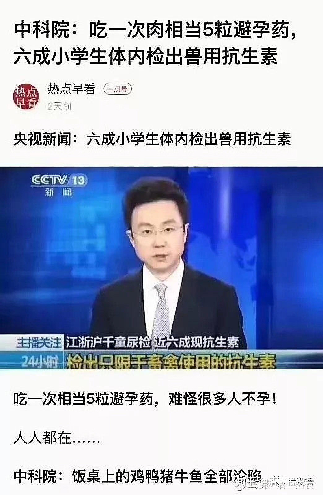
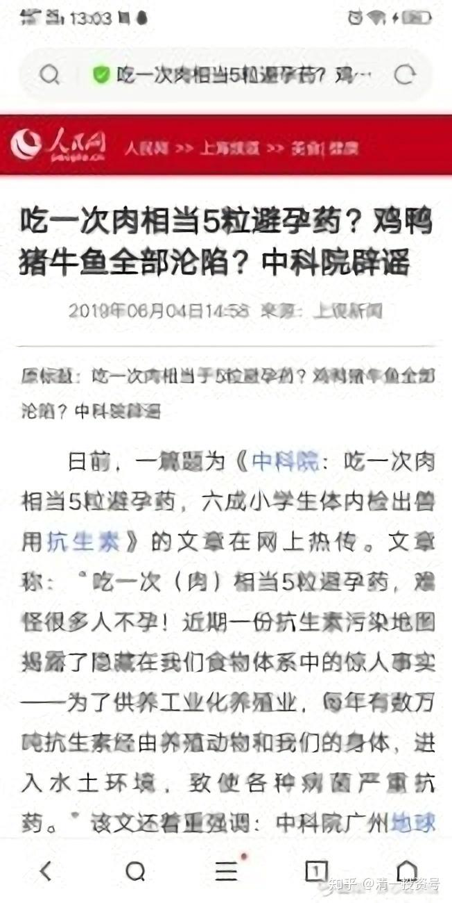

[原雪球专栏](https://zhuanlan.zhihu.com/p/541457282/edit)[59篇.家长为啥每天都要给孩子吃避孕药、抗生素](http://link.zhihu.com/?target=https%3A//xueqiu.com/9310099567/143183714)？

清一山长 2020年3月7日

美国农业部实验中心曾拿3000只小白鼠做过35年的实验，以验证转基因食物是否对人体有害。在美国孟山都公司推广转基因种子开始，美国就拿三组各一千只小白鼠做实验。第一组小白鼠只吃传统粮食，第二组则是吃传统粮食和转基因食物各一半，第三组小白鼠只吃转基因食物。35年过去，在这期间，小白鼠也是经历了多次繁殖、死亡等生生死死、死死生生的过程。在第35年，第一组小白鼠达到了近4千只，第二组还有不到1千只，而第三组百分之百吃转基因食物的最后一只小白鼠死掉。

在中国，我们其实根本就不知道自己买的食物有没有转基因。据说连云南的土豆都有转基因品种了，产量特别大。

说明：大家渐渐明白了。我为什么选泰国生活。这个国家，真的关心民众的利益。这里的土豆都小小的，真的没有云南的大个。大陆基本上像是养猪一样，想吃就给你吃。还做得特别丰富。但最终吃死人自己负责。

中国人太贪吃了，就只能拿转基因给你吃了。另外，转基因也是动物的主要饲料，吃动物也等于被动吃转基因。而且动物还要打很多抗生素。因此，家长们想要断子绝孙，就多吃转基因吧！包括各种豆腐，植物油等（原料大豆，大多数都是转基因的进口货，美国大豆）。还有各种大棚菜，各种药物栽培出来的。

清粉的生活方式，是简单朴素的生活。最简单的食物，带来最健康的身体和精神。泰国国际经济政策委员会起草了一份转基因作物的指导文件，禁止引进任何商业用途的转基因生物（GMO）品种；但用于实验室或小范围研究的转基因种子不在此列。任何实验室试验或小规模田间试验，都必须经过国家农合部安全委员会审核同意。

售卖转基因种子在泰国是非法的。我怀疑，国内的疫情，核心原因是免疫力，抵抗力差。我看也跟国人的食物不健康有很大的关系。

**评论回复：**

静心区块链 ：本来想转发，看到下面截图，不知道信谁了。

**[清一山长](http://link.zhihu.com/?target=https%3A//xueqiu.com/9310099567)**[2020-03-07 14:15](http://link.zhihu.com/?target=https%3A//xueqiu.com/9310099567/143188971)回复静心区块链：

我转发的这种消息，当然官方要出来辟谣了。如果大家都不吃这些激素和转基因的肉蛋奶了，你自己该省多少钱呀？国家要损失多少GDP呀？相关的利益集团，愿意放手吗？东西就是他们弄的，怎么能让你们不用呢？这不亏了大本了。

你愿意相信人民网很好。国家媒体，怎么能不相信呢！中国农业部已经说了：转基因食品很安全，他们当然要出面辟谣了。中国这个大国的专家学者，当然比泰国人更懂鉴赏什么才是有益于人民的好食品了。只是怪异的是；他们自己是不吃转基因的。你们爱吃，更喜欢吃被动物二次转手的转基因食物，很好[大笑]。

您觉得转基因好，激素、抗生素都很好，OK，你们自己继续吃，反正花的是你的钱，伤的是你的身，关我屁事。

我觉得这些东西不好，我就全家都搬到泰国住，躲开你们这些吃货就行了。**我告诉你们吃传统农产品，我也分不到你一分钱。大路朝天，大家各选各的路就行了。你们愿意出钱买罪受，没什么不好的。**

对了，泰国非转基因的自然大米，超市最普及的大路货，卖77泰铢五公斤。大概就是1.5元一斤。据说国内不知真假的“有机大米”比这贵十倍。泰国老品种，低产量的糯米，也才3～4元一斤。**别以为非转基因很贵，是骗子很贵。因为中国的傻子太多！**

静心区块链回复**[清一山长](http://link.zhihu.com/?target=https%3A//xueqiu.com/9310099567)**：

谢谢山长回复，像我这样的小民，庆幸接触到了说真话的人，向您学习了很多。愿自己的家人也能认识到。

**参考链接：**

[央视发声：近六成孩子尿液中检测出抗生素_腾讯视频](http://link.zhihu.com/?target=https%3A//v.qq.com/x/page/n1344n6pg31.html)

[转基因](http://link.zhihu.com/?target=https%3A//www.iqiyi.com/v_19rr9bofl0.html) [https://www.iqiyi.com/v_19rr9bofl0.html](http://link.zhihu.com/?target=https%3A//www.iqiyi.com/v_19rr9bofl0.html)

[人人都在吃：中国大部分都是转基因饲料](http://link.zhihu.com/?target=https%3A//www.yicai.com/news/3757237.html)

[小学生体内检出兽用抗生素](http://link.zhihu.com/?target=http%3A//m.news.cntv.cn/2015/04/18/ARTI1429371280036719.shtml)

[复旦历时三年取样调查发现 江浙沪儿童体内普遍存在兽用抗生素 -浙江新闻-浙江在线](http://link.zhihu.com/?target=https%3A//zjnews.zjol.com.cn/system/2016/02/23/021032101.shtml)

**[第2篇.当亿万企业家走进清一武道馆（1）](https://zhuanlan.zhihu.com/p/354387957)**

**[https://zhuanlan.zhihu.com/p/354387957](https://zhuanlan.zhihu.com/p/354387957)**

**[第21篇.走进武道馆（9）：成为世界冠军，是笑话还是神话？20210427](https://zhuanlan.zhihu.com/p/367585242)**

**[https://zhuanlan.zhihu.com/p/367585242](https://zhuanlan.zhihu.com/p/367585242)**

**[第83篇.日本武士的传统食物是什么？](https://zhuanlan.zhihu.com/p/510535004)**

**[https://zhuanlan.zhihu.com/p/510535004](https://zhuanlan.zhihu.com/p/510535004)**

**[第89篇.吃肉才是科学，吃谷物就是不科学吗？20220516](https://zhuanlan.zhihu.com/p/514940531)**

**[https://zhuanlan.zhihu.com/p/514940531](https://zhuanlan.zhihu.com/p/514940531)**

**[105篇.法萨李总的武道馆记录9：武当高手来踢馆了？](https://zhuanlan.zhihu.com/p/571033043)**

**[https://zhuanlan.zhihu.com/p/571033043](https://zhuanlan.zhihu.com/p/571033043)**

**[第183篇.简单生活，让自己和世界更健康20221020](https://zhuanlan.zhihu.com/p/575677198)**

**[https://zhuanlan.zhihu.com/p/575677198](https://zhuanlan.zhihu.com/p/575677198)**

**[第204篇.吃素的清一武士今晚首秀VS美国可不是吃素的！](https://zhuanlan.zhihu.com/p/583925499)**

**[https://zhuanlan.zhihu.com/p/583925499](https://zhuanlan.zhihu.com/p/583925499)**

**[第223篇.张伟丽：碳水化合物是永远的敌人？20221206](https://zhuanlan.zhihu.com/p/586465443)**

**[https://zhuanlan.zhihu.com/p/586465443](https://zhuanlan.zhihu.com/p/586465443)**

**[33篇.家长为啥每天都要给孩子吃避孕药、抗生素？](https://zhuanlan.zhihu.com/p/543096364)**

**[https://zhuanlan.zhihu.com/p/543096364](https://zhuanlan.zhihu.com/p/543096364)**

**[83篇.为何东亚文化圈为以白为美？以胖为福？以懒为贵？以无能为尊？](https://zhuanlan.zhihu.com/p/563607298)**

**[https://zhuanlan.zhihu.com/p/563607298](https://zhuanlan.zhihu.com/p/563607298)**

**[118篇.不懂医学，就用生命来支付无知的代价](https://zhuanlan.zhihu.com/p/577040263)**

**[https://zhuanlan.zhihu.com/p/577040263](https://zhuanlan.zhihu.com/p/577040263)**

**[171篇.中医西医？谁是骗子？江湖水深，敢不谨慎？](https://zhuanlan.zhihu.com/p/595570991)**

**[https://zhuanlan.zhihu.com/p/595570991](https://zhuanlan.zhihu.com/p/595570991)**

**[1篇.身体健康的三个因素：心态、运动、食物](https://zhuanlan.zhihu.com/p/513184686)**

**[https://zhuanlan.zhihu.com/p/513184686](https://zhuanlan.zhihu.com/p/513184686)**

**[3篇.素食与肉食，养生与医疗，古人与今人](https://zhuanlan.zhihu.com/p/518352472)**

**[https://zhuanlan.zhihu.com/p/518352472](https://zhuanlan.zhihu.com/p/518352472)**

**[29篇.食物还是毒物](https://zhuanlan.zhihu.com/p/529676979)**

**[https://zhuanlan.zhihu.com/p/529676979](https://zhuanlan.zhihu.com/p/529676979)**

**[30篇.中医与健康](https://zhuanlan.zhihu.com/p/529688759)**

**[https://zhuanlan.zhihu.com/p/529688759](https://zhuanlan.zhihu.com/p/529688759)**

**[49 VS 0 清一素食拳手与肉食拳手的百战对抗优胜记录！20230311](http://link.zhihu.com/?target=https%3A//www.bilibili.com/video/BV1bY411z7NH/)**

**[https://www.bilibili.com/video/BV1bY411z7NH/](http://link.zhihu.com/?target=https%3A//www.bilibili.com/video/BV1bY411z7NH/)**

**[42篇.清一太极征泰记录：百战无败，创新历史](https://zhuanlan.zhihu.com/p/611989433)**

**[https://zhuanlan.zhihu.com/p/611989433](https://zhuanlan.zhihu.com/p/611989433)**

[8篇.国际武术比赛：清一书院首日参赛夺得金牌12面！](https://zhuanlan.zhihu.com/p/535445784)

[122篇 为何东亚文化圈为以白为美？以胖为福？以懒为贵？以无能为尊？](http://link.zhihu.com/?target=https%3A//www.ximalaya.com/sound/485885449)（音频）

[春节中国人干啥？大吃大喝对身体真的有益吗？](https://zhuanlan.zhihu.com/p/681229973)

[《新教育天书》饮食起居篇第四问：性早熟是什么原因导致的？](https://zhuanlan.zhihu.com/p/702851750)
