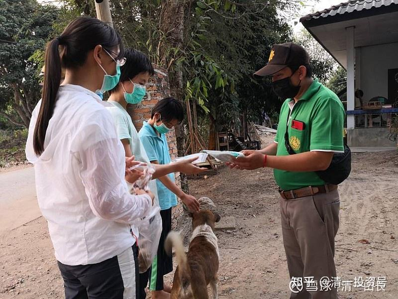
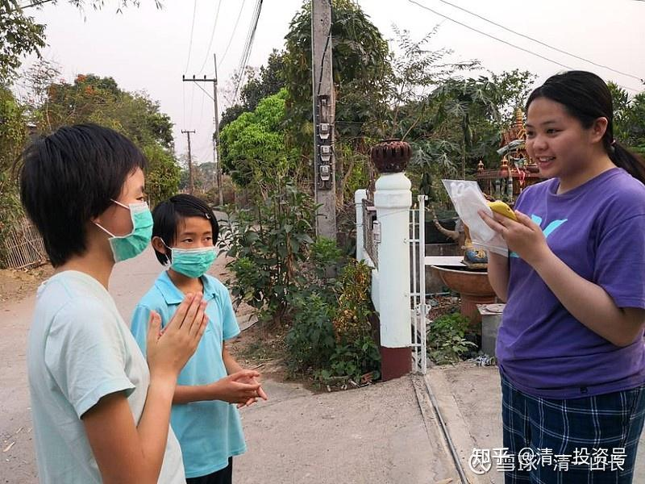
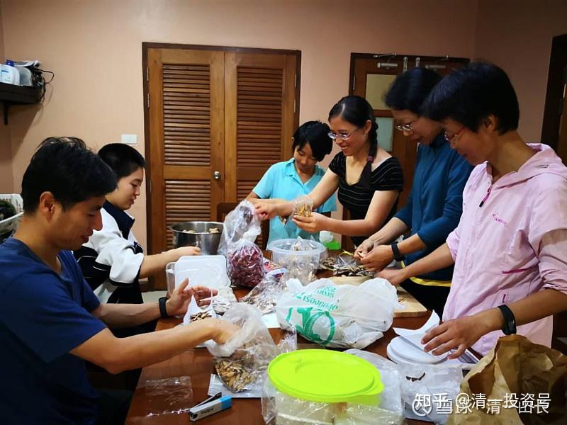
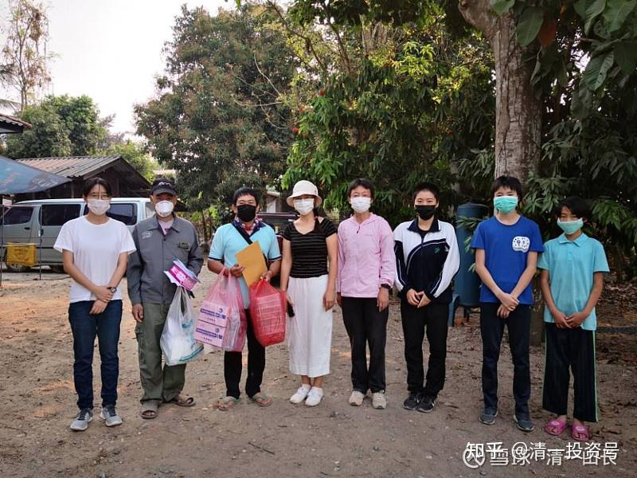
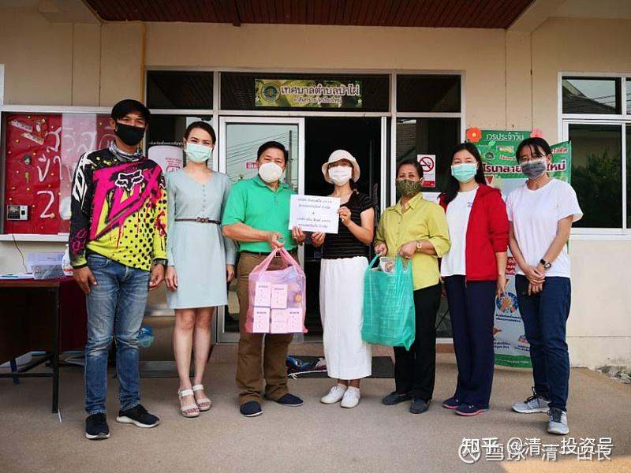
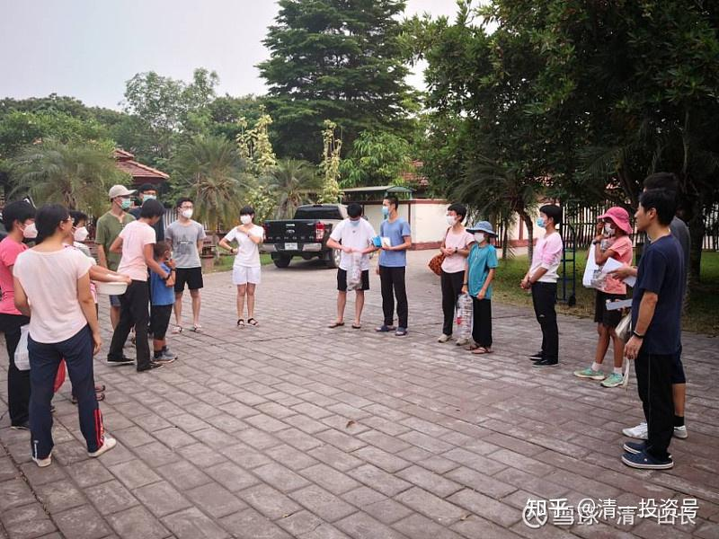
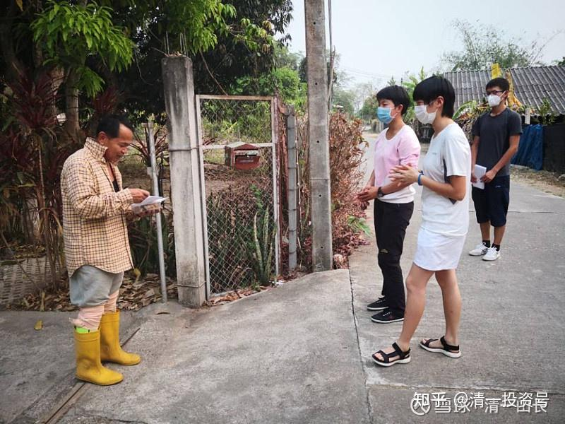
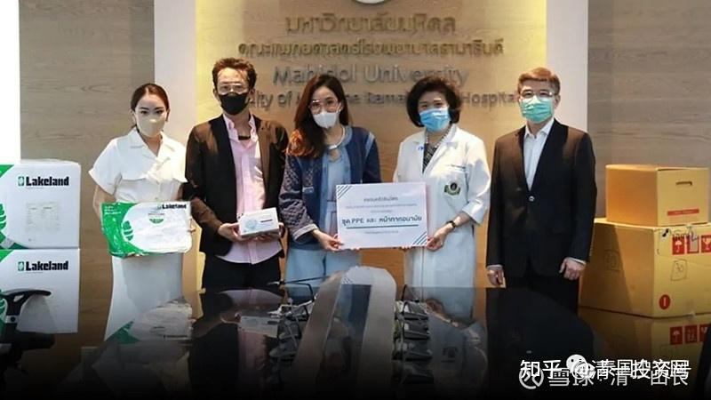

[原雪球专栏](https://zhuanlan.zhihu.com/p/543118784/edit)61篇.在泰国送口罩和中药给当地人

[清一山长](http://link.zhihu.com/?target=https%3A//xueqiu.com/9310099567/column) 2020年4月9日

泰国已经开始实行宵禁了，管控措施越来越严格。我们在泰国，收到了国内家长捐给我们的数百只口罩，包括N95口罩，为了让这些宝贵的防疫物资发挥应有的作用，我就让小女儿和她的伙伴，一起去给当地的泰国居民送口罩。今日新教育培养学生帮助他人，做经营者，这些行为都要从小培养。我们希望孩子们**到任何地方，都要成为当地人的礼物，而不只是一个冷漠的消费者。仅仅有钱，是不会赢得尊重的，只有愿意去关心和帮助他人的人，才是真正有价值的人**。这就是我们的**核心教育理念**。孩子妈妈还准备了一批预防流感的中药，配好后也正在让孩子们送给当地的泰国居民。让孩子们教泰国人如何使用。孩子们学会了泰语，不仅仅用于自己的生活，更要学会用自己的技能来增进中泰的友好交流。现在泰国人已经有不少人知道“中国中药”比“西方神药”更管用了。

大家正在根据中国的经方配中药给泰国人，刘老师已经配了数百付药，疫情期间治愈了十几个感冒发烧的病人。有四个泰国人，直接感受了中国药物的高效快速。一对泰国母女前几天发烧、咳嗽、乏力，吓得不得了。吃了刘老师配的药后，一天就好了。

这是今天上午，把配好的药和中国医用口罩，KN95口罩，送给泰国当地的政府和村长，让他们送给需要的人，送出超一千副的口罩。都是国内的家长捐助的物资。

当地镇政府工作人拿到了我们赠送的KN95口罩和药材等。

这是外出送礼物的师生们正准备出发！

泰国人正在阅读我们送的礼物附上的已经翻译成泰语的信，告诉泰国邻居礼物是用来做什么的？以及如何使用中药的方法。

参考对比——他信家族的孩子们在做什么？

4月3日，泰国前总理他信的3个孩子（2个女儿和1个儿子）前往曼谷拉玛医院、诗丽叻医院、朱拉隆功医院，分别捐赠了一批防护服、N95口罩和普通医用口罩等防疫物资。

中国想让孩子“当总统”的家长，别以为请一堆人伺候你家孩子，让孩子一身名牌，吃好喝好玩好，自我中心，就是“总统相”了。**当总理的家庭，都是从小培养服务他人的素质。**泰国他信家族，商业上，政治上，教育上都很成功，就是家长从小就教“付出”的概念导致的结果——贵族是这样培养的。
