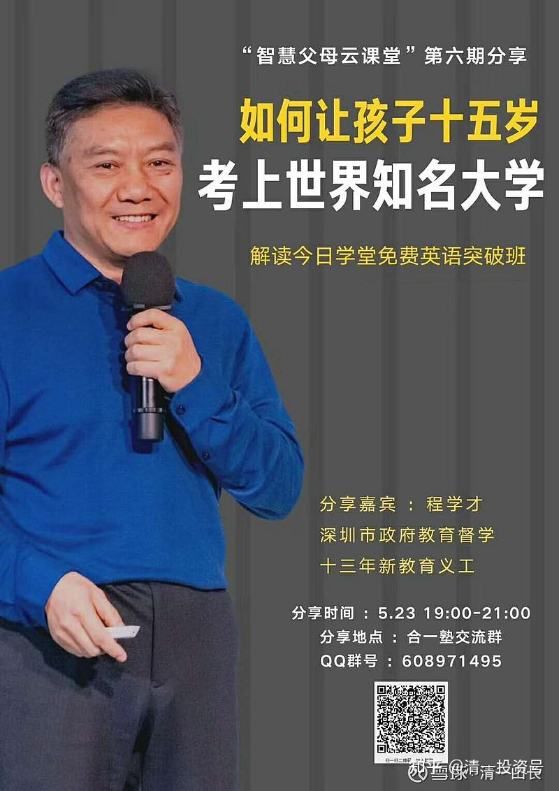
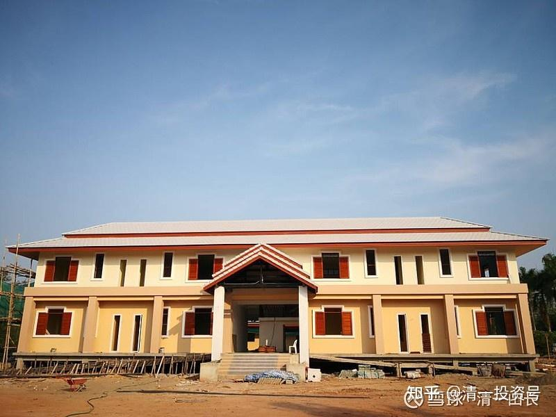
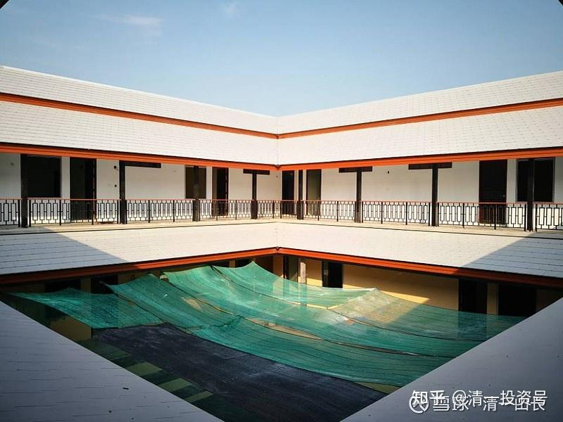
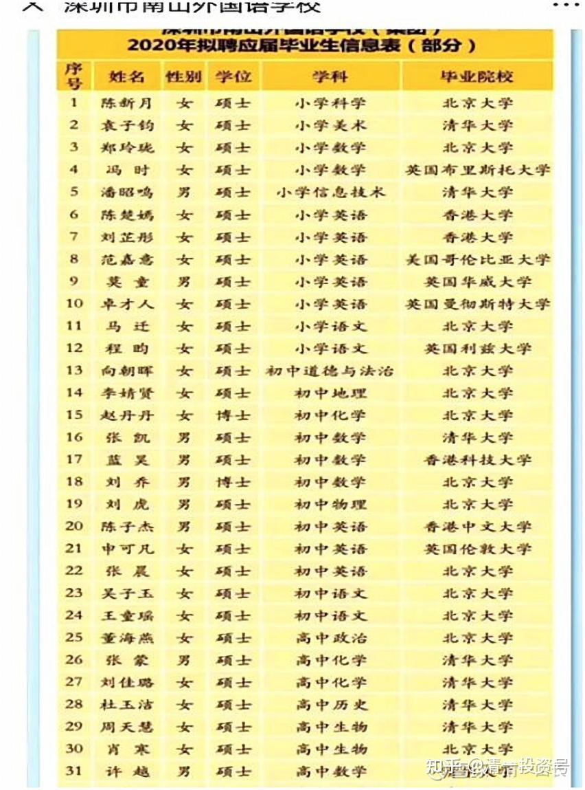

[原雪球专栏](https://zhuanlan.zhihu.com/p/543135963/edit)65篇.15岁上名牌大学 VS 99%的大学都不值得上！

[清一山长](http://link.zhihu.com/?target=https%3A//xueqiu.com/9310099567/column) 2020年5月20日

家长们送孩子去上学，往往把“考大学”作为一个目标，其实完全不懂投资教育是干嘛的！**如果教育的投资，无法提升教育对象原本所在的社会级别和地位，就是失败的！**这才是核心！什么是原本的社会级别？这孩子生下来，在同龄人中的排名地位，就是他的“原始地位”。通过正确的教育，他得以战胜80%、90%，甚至99%的同龄对手，这就是提升了他的社会级别和地位，提升了他在社会上的竞争力。**如果他上了16年的学（中小学加上大学），依然是跟周围的人一样的竞争力，不得不一起争抢相同的岗位，这种教育就是失败的，你的教育投资全浪费了！**

如果说，基础教育是公民社会必须的标配，让你不要脱离社会文化。大学教育，就不再是所有人必须的教育了。**大学是阶层地位的标志**，通过大学教育，你获得了一个成年标志——这是你走上**社会的分等级通道**。**如果你通过上大学，成功地跻身进入社会1%的优秀公民行列，这才是成功的大学教育**。如果实现不了这个目标，你上大学就没有意义。因为既然你拿到的大学标志就是平庸，还要花钱，就太没脑子了。您愿意花钱找机构买个“次品证书”回家挂起来吗？

如果你认为上大学的目的是要谋生，找个工作，你就错了。不上大学，也一样找工作，一样赚钱，还能省下很多无谓的资本投资、生命投资（浪费生命去读傻书的时间），你可以十几岁就开始去赚钱。想读书，想进步，就自己去读一些真正有价值的书，没必要去考大学，更没必要交学费。

潮州人就是这样想的，这样做的。我也是这样想的。我的两个大孩子，就是不考大学的。可他们都读书，什么书有用，就读什么书！根本不考虑考大学的问题。成年的大孩子，十几岁就开始工作赚钱了。一个孩子做股票投资，没有人管他要文凭才能买卖股票。另一个孩子，在泰国开公司，做建筑商合伙人。也没有人说她必须有大学文凭才能当老板。她去考了雅思，成绩可以上泰国的清北——朱拉隆功大学了。但她不愿去，说浪费四年拿个无聊的文凭，不如多盖几栋楼有用。当然，她公司聘用的工程师、技术人员、工程监理等，全都要求是“持证人员”，都必须是工程大学毕业的专业人员，否则连干活的资格都没有。工程师的工资也一般般，人民币四千元左右而已。下面就是她的公司起步盖的第一栋楼！一栋两千平方的大型中泰结合的四合院。

我家小女就没这么幸运了，她的家族任务，就是必须要去读大学。她还必须在23岁之前，完成读四个不同国家四所大学的任务！级别要求必须是四个国家前三名的大学。美国的大学可以放宽一点，TOP1%就够了。因为我的观点，就是99%的大学都不能读。要么就上1%的顶尖大学。考不上，就证明你不是读书的料。要么就上技术学校，学干活的本事去！没必要上普通的大学。就像练武术的人，练武就要一门心思当冠军，当不上，就送外卖去！学武术就以为是顶个名家弟子的“身份”混资格，就是欺人自欺！

为什么这样说？

因为，18岁上大学，是你人生的第一个“市场标签”，而且是终身有效的标签。它确定了你给自己贴上的，是“人生赢家”，还是“人生输家”的标志。对你一生的职业发展、社会地位、心理个性，以及婚姻家庭等等，都是影响最大的标签。这个影响，甚至比你父母是谁都更重要。想想看，一个打上了“清华、北大毕业”符号的人，与一个“杭州师范”毕业的人相比。比介绍“他们爹妈是谁”，都更能说明他们的“社会级别地位”。前者如果混得不好，就是“可惜了，意外”，后者就算人生成功，也是“侥幸，运气好”！你说，这大学能随便上吗？你敢随便给自己贴个“不入流”的标志吗？不是每一个人，都能像马云一样“逆袭名校成功”的，你们看看现在的高新技术企业，高管们几乎全都是名校毕业的。杭州师范的学生，现在想要来资本市场拿创投资金，光他的学历身份，就会让资本方疑心重重，望而却步的。几十年前，资本会找马云，是因为当年他选择的市场是低竞争度的市场，没有人注意到这个领域，被他捡了个漏。今天完全不一样了，完全竞争的市场，拼的就是人才。非985名校毕业，去创业连起步都成问题。

18岁，人生已经开始明显的分化，被贴上了各种社会标签。但每个孩子起步的时候，彼此的差别并不大。虽然每个家长都以为自己的孩子是天才，其实**多数孩子都是属于90%的平常人而已。只有3%的孩子，比正常人的竞争力更强悍一些。**

**基础教育的任务，就是要把90%的庸人，提升成top10%的优秀人**。或者把10%的人选出来，通过教育，让他们成为1%，甚至千分之一，万分之一的人。如果无法实现这一任务的所谓教育机构，就是骗子！

**如果所谓的教育，不但没提升孩子的社会竞争力，还削弱了孩子的竞争力，就是混蛋学校！**现在很多的所谓高价国际学校，就是骗子加混蛋！以糊弄人的方式，培养出很多毫无社会竞争力的学生，连体制学校的学生都拼不赢。除了花钱去外国上个不入流的大学，什么出路都没有。

大学的核心任务，不再是人才产品的“炼金场”，而是承担对前段完成基础教育的初级产品进行“分类，包装，推销”的部门。在经过了12年基础教育“锻造”后，大学会自动选出1%的“金子”，让他们入读顶尖名校，社会会给这批人最好的人生发展机会。剩下数量最多的“铜、铁、钢”人才们，比较实用，但市场不会给溢价。正好普通企业可以用于干一些技术含量不高的活儿。至于炼了16年都没炼出啥水平的废铜烂铁们，就直接交回收部门（家庭）去处理了（回家养老去）。这就是现在**工业化社会的运行逻辑**，这就是**现代大学的真相**！**社会的现实**！**虽然他们用了很多包装来美化这种本质，但事实就是这样残酷的。**

简单一点说：您的孩子18岁时，通过他考上的大学，就给自己贴上一个跟随他终身的“人生赢家还是人生输家”的标签。如果他考上了清华、北大，他就是千分之一的人生赢家！就读985大学，他就是1%的人才！考上211大学，他就是3%的优胜者。如果你只能就读“其他大学”——你就是80%的普通人！社会没啥特别的机会给你，大量的社会基础工作，脏活、累活、苦活，你没挑的空间。你不干，别人也会抢着干的。跟没上过大学的人相比，其实也没啥优势。

上985之外的“其他大学”，原来能够证明什么？现在不能证明什么？

中国每一代人，大约是1500万人左右。40年前，我考大学的时候，全国大学每年总共录取30-35万学生。所以，只要你是“大学生”，就证明你赢过了98%的同龄人。所以，这批没有扩招之前的大学生，称为“天之骄子”。就算不是名校生，只要顶个大学生的名，在过去几十年的中国社会，就可以获得最多的发展机会，成为现在社会的主力结构群体。但这是不正常历史情况下的历史经验，未来不再有效果了。但现在的中国家长，依然会误以为：只要考上大学就OK！却忘了现在的大学，每年招生人数，扩招了30倍，每年已经是900万人了。现在如果你只是**“考上大学”，只能证明你是“平常人”而已，没啥好的发展机会。**普通大学毕业后的工资，可能连没上学的民工都赶不上，甚至可能根本就找不到工作。现在，稍微像样一点的单位，好一点的岗位，都明文规定：只招985大学的毕业生。上普通大学，你一生就被标上了“没档次”的标签！您甘心吗？

我想对家长说：同样是花钱，你让孩子辛辛苦苦地学了12年，干嘛不给他贴上一个“人生赢家”的标志？好大学和烂大学的学费都差不多，你干嘛要去读烂大学给人送钱？你居然让孩子去上个烂大学，就是要让他这一辈子，对身边的人都宣告——你家的产品，就是个地摊货！便宜、实惠，经久耐用！还随时可以丢掉换一个！您还是花钱去做的广告。

大家都知道，日本、韩国、美国这些国家，都叫做“学历社会”，意思并不是你想象的，必须有大学学历才能活下去的社会。而是这些国家，90%以上的高层职位，都被两三所大学垄断了。所谓的“东大系”、“首尔系”成为唯一的“上流标志”。别的普通大学毕业生，进入社会根本就没啥机会！给人打小工的机会，都要拼命来争取。

泰国也一样。我买泰股，看公司背景资料上，很多高管都是朱拉隆功大学（泰国人的清北）毕业。所以，这些国家基础教育的竞争，学生不是要上大学，而是要上第一流的大学。要给自己孩子贴上“我是top1%”的人才标志，拿到上流社会的入门证。

美国的教育界，SAT成绩，都很干脆地标明：你获得本次考试的成绩，是属于1%还是10%的成绩。让你去评估，自己应该选择什么档次的大学去搭配！当然，不是死的条件。如果你的考试分数不太够，你就必须在校外活动或者其他更难的方面，拿出证明你有超过了99%对手的事实来证明自己。拿不出来证明的，别想入门！这就是美国1%的牛大学录取学生的机制！他们是很有效的考选机器，负责从全世界选出1%的优等生，同时防止一些不合格的次品混进来。

至于您想上其他的普通美国大学？很容易，根本不需要成绩和证明，有钱就能读。反正上了也没啥用处。专骗傻瓜上当，尤其是中国来的傻瓜！

这世界就这么残酷的，玩法就这么现实。18岁，是一个人生的分水岭！之前家长必须拼命为孩子找到一条超越同龄人的道路，用自己的金钱、地位、智慧和谋略去为孩子安排最有机会的比赛通道。而**18岁以前，孩子也必须配合家庭的设计，努力去杀出一条路，在自己18岁的时候，拿到“赢家标志，成功者”的标签，为自己的一生开启光明的大道。**18岁如果输了，他这一生，都别想意气风发，一展宏图之类的了。只能辛辛苦苦的去“淘生活，拼世界”，为一些微不足道的机会，都要付出更大的代价！这就是：**卓越固然不易，但平庸的代价更高！**

18岁要实现top1%的目标，战胜99%的对手，家长该怎样才可能实现？很简单，就是**家长必须找到能够提升你孩子竞争力的教育机构，用家长的资源来买下道路通行证。错过了这个年龄，谈啥都晚了**。其次，**学生必须想赢，想超越他人，想成为1%的人生赢家。**如果你家孩子平时的舒服日子过美了，你们家从小就把孩子当“老人，病人”来伺候，养老一样的养起来了，就完了。你们家就等着18岁的废人loser报应吧！

三语高中的“国际大学直通车”项目，就是帮助学生实现TOP1%卓越人才的目标。这个特殊教育项目，每年招收12岁的学生入学，让他们用三年时间，学完美国12年的全部课程，并参加美国高考SAT。要求每个学生都必须取得美国前100名大学的录取成绩，才算达到我们的毕业要求。我们将送这批15岁的学生，正式进入国际大学学习。我们的教师还同步跟进，与国际大学一起合作教学，让他们未来四年，取得两个大学专业毕业的成绩水准，成为世界级的卓越三语人才。19岁，他们将考进世界一流大学读研究生，中国的清华、北大，985大学，也是他们考研的对象。如果要在中国工作，一个中国985大学的资格，是必须的！

这不是未来的规划，而是今天已经实现的事实。今年我们学校的第一批15岁学生，已经获得了泰国名牌公立大学的入学许可，9月份正式入读国际大学。因为我们带去的年仅15岁学生，三语水平已经超过了这些大学外语专业的毕业生，甚至超过接待我们的主管国际教育的博士主任，我们的15岁孩子承担了全场的翻译任务。泰国大学从来没有遇到这么优秀的中国学生来申请入学。朱拉隆功大学的入学成绩要求，居然只是SAT 940分。我们的学生，起步就拿出了超过SAT1300的官方分数，当然入学申请就一路绿灯了！

四年后，19岁的他们，将会是中国985大学，或者是西方最顶尖大学中一批最年轻卓越的研究生！他们在12岁，以10%优胜者的身份，考入了三语高中。15岁击败了99%的同龄人，考入国际大学，成为1%的人才。19岁更是成为千分之一的卓越者，获得三个不同国家的大学证书。您认为这样来开启他们的人生，会比随大流，拼华山一条路的体制学生们更差吗？利用各级优质教育资源来搭配，很容易就让一个孩子在15岁就实现了别的学生18岁都无法实现的目标！获得“一流人才”的社会标志和心理优势！这对于这个孩子一生的成就和发展来说，取得“我是人生赢家”的心理优势，在现实上，未来的发展空间上，都是非常有价值的投资！

**卓越人生的道路，是家长设计出来的！超越99%，是孩子努力出来的。两者缺一不可！在错误的方向上努力，事倍功半！在正确的方向上努力，平庸可以化身神奇！**

转发下图证明我上述的观点：

今年的实况——您的孩子如果没有清华、北大的文凭，来深圳想教个小学，都拿不到职位的。美国的藤校、哥大的研究生，来申请的只是个“小学英语教师”职位。您还上啥普通大学？

**参考链接：**

**[这就是今日学堂](http://link.zhihu.com/?target=https%3A//space.bilibili.com/487498588/channel/series)**

**[2012年的今日学堂](http://link.zhihu.com/?target=https%3A//www.bilibili.com/video/BV193411178W)**
