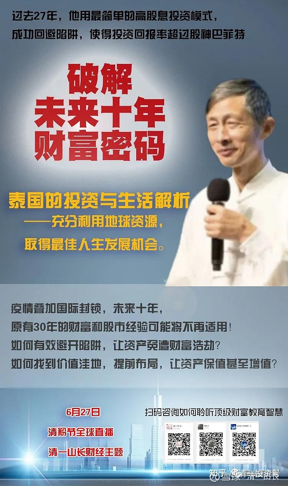
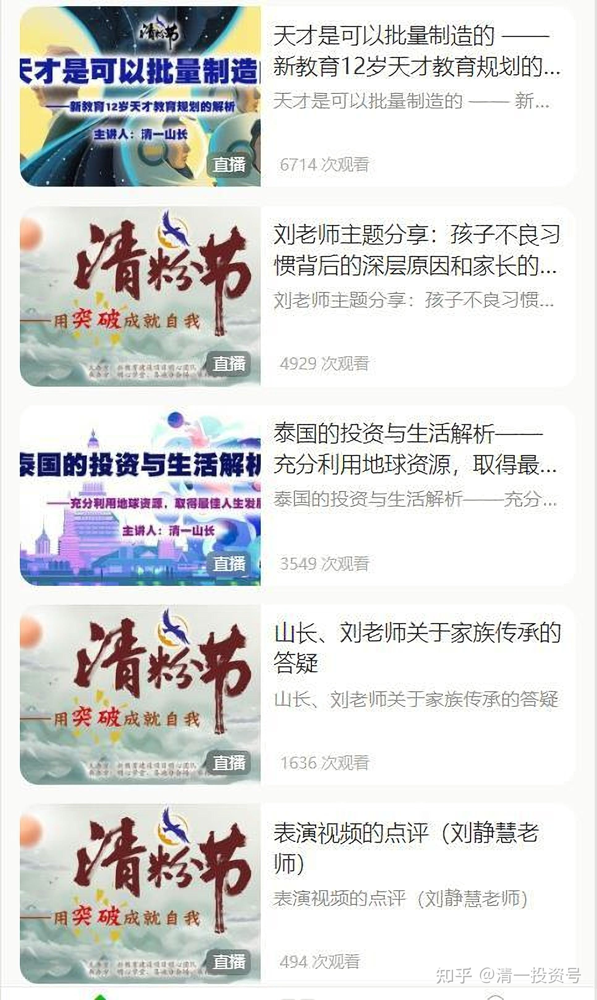

[原雪球专栏](https://zhuanlan.zhihu.com/p/545439129/edit)69篇.明天，我的财富主题讲座。公开，免费！

[清一山长](http://link.zhihu.com/?target=https%3A//xueqiu.com/9310099567/column) 2020年6月24日

讲座主题1：未来世界财富走向，天才教育要干啥？（6月25日开讲）

讲座主题2：中国人的世界生存，泰国股票市场介绍与经验分享（6月27日开讲，外加观众互动，提问答问项目）

有兴趣就自己去关注微信号。不是我的，是主办方的。我没开公众号。微信网页链接：

[https://mp.weixin.qq.com/s/jlz5-WHeSs459v4J7ecAdw](http://link.zhihu.com/?target=https%3A//mp.weixin.qq.com/s/jlz5-WHeSs459v4J7ecAdw)

本次讲座，是一年前就预定好的。本来是线下主讲的，已经有两千人报名参加。但因为疫情原因，我无法正常回国（泰国要到7-8月才开放国际航线），就改到线上直播了。主办方也因此可以与更多的朋友分享内容。

参考链接：

[2020年清粉节视频目录](http://link.zhihu.com/?target=https%3A//app8q9fauhp6709.h5.xiaoeknow.com/p/decorate/homepage)

[20200627天才是可以批量制造的—新教育12岁天才教育规划的解析](http://link.zhihu.com/?target=https%3A//app8q9fauhp6709.h5.xiaoeknow.com/v2/course/alive/l_5eebfbdd46602_O4s3KZYE%3Ftype%3D2%26app_id%3Dapp8q9FAuhp6709)

[20200627泰国的投资与生活解析——充分利用地球资源，取得最佳人生发展机会](http://link.zhihu.com/?target=https%3A//app8q9fauhp6709.h5.xiaoeknow.com/v2/course/alive/l_5eec0599ce200_9wIZl6Hm%3Ftype%3D2%26app_id%3Dapp8q9FAuhp6709)

[20200625刘老师主题分享：孩子不良习惯背后的深层原因和家长的修行方向](http://link.zhihu.com/?target=https%3A//app8q9fauhp6709.h5.xiaoeknow.com/v2/course/alive/l_5eebfc95999e9_LGnAuxyO%3Ftype%3D2%26app_id%3Dapp8q9FAuhp6709)

[20200627山长、刘老师关于家族传承的答疑](http://link.zhihu.com/?target=https%3A//app8q9fauhp6709.h5.xiaoeknow.com/v2/course/alive/l_5eeda280d7cb7_y11z5iGn%3Ftype%3D2%26app_id%3Dapp8q9FAuhp6709)

[20200627用突破成就自我——今日学堂PK清一塾](http://link.zhihu.com/?target=https%3A//app8q9fauhp6709.h5.xiaoeknow.com/v2/course/alive/l_5eec7b757417c_bKeeKp6N%3Fapp_id%3Dapp8q9FAuhp6709%26from_multi_course%3D1%26is_redirect%3D1%26pro_id%3Dp_5eeda3194bf83_8KhzsTFU%26type%3D2)

[2020年答疑（清一山长）](http://link.zhihu.com/?target=https%3A//www.bilibili.com/audio/am32904755%3Ftype%3D7)（音频）
