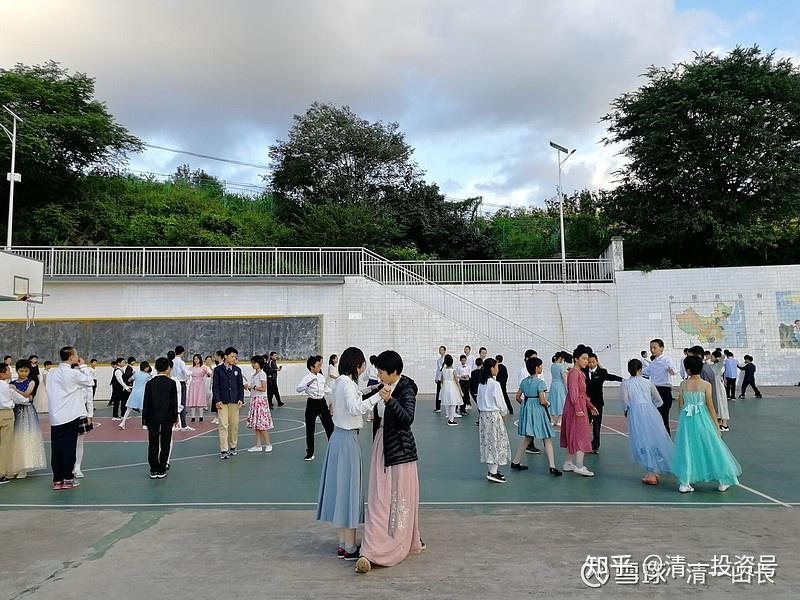
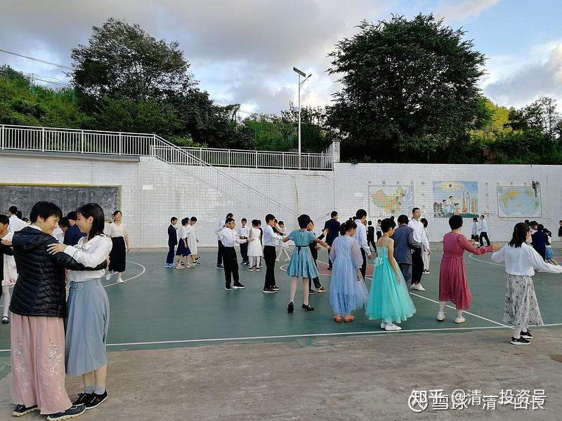

[原雪球专栏](https://zhuanlan.zhihu.com/p/545608877/edit)76篇.一份与众不同的入职简历，决定了您人生起步的高度！

[清一山长](http://link.zhihu.com/?target=https%3A//xueqiu.com/9310099567/column)2020年8月24日

（照片中，是刚过去的周末，我们的三语高中学生在举行“周末球场舞会”，他们是学霸不假，但并不是书呆子，还天天练武的。文武双全，中西结合！文理跨越的三语学生）

现在我们的三语高中家长们，正在为孩子上什么大学，选什么专业而操心。我却要家长们认真去考虑和安排“大学毕业求职书”：知道如何用最短的时间，获取一份最独特的求职简历。家长们有点蒙：现在做这个干吗？我说，等你真求职的时候再做简历，就晚了。只能随波逐流了！

我作了一个示范模板，并让学生和家长，按照这个类似的规划去实施教育，锁定培养的方向和目标。今天，我就完善一下，拿出未来的一种，可能出现的面试版本。这一份是泰国班的。以后，还会有西班牙语班的，法语班的，德语班的不同版本，大致上类似。您看拥有这份简历，是否会让你想要进的任何知名企业拒绝、忽略您？

您也可以从这份简历看出来，我们的培养方向是什么。您就知道，我为什么坚持认为，今日大学，会是未来的世界名校了？因为她培养出来的学生，就是其他任何大学不知道如何培养的世界级的“牛学生”！

未来，您的孩子大学毕业了，要申请竞争最激烈的，世界通讯业排名第一的华为公司的高级技术职务。您遇到了面试官，该怎样介绍自己呢？场景设计！

**三语高中（大学）学生，未来版的求职简历示范模板。**

面试官您好！

介绍一下我自己：我是###，今年23岁。我已经在三个不同的国家，上了三个不同的大学，都达到了优秀毕业生的水平。现在，我刚从排名世界第11名的新加坡国立大学，电子专业毕业，希望在华为贡献自己的力量！

面试官：等等，你这么年轻，怎么可能读完三所大学？怎么读的？

学员：只有一所大学没有读完。但我的大学同学可以作证，我当时是全班成绩最好的学生。没有读完的原因，是我一年就达到了毕业水平，然后就退学离开了。

详细地介绍一下我的学习经历：我15岁就上了第一个大学，是中国的“今日三语大学”。我学习的专业是“教育科学与哲学”。这个专业是全世界独一无二的专业，是一个中西综合的课程，该大学主要培养新教育中小学教师。这个大学，采用案例教学方式，课程特别实用。由于这个大学，专门设置有“三语天才少年班”，从全世界招收三语学生。所以，虽然这是一个中国的大学，用中文学习中国独有的“教育哲学”专业，但入学考试要求，是按照国际考试标准来考的。要用美国的高考SAT成绩申请入学，外国考生还要加试汉语能力考试。我当年的SAT考分是1450分，虽然比其他优秀同学的分数差一些，但还是顺利入读了这所竞争激烈的大学，并获得了该大学的全奖。并顺利毕业！

（ “**点评：今日大学的课程设置，以心理学，思维与行为学、管理学、人际交往学、语言表达艺术。还有哲学、历史、文化基础课程为主，强调课程的现实性、实用性，不玩虚浮的理论。目标是让学生们了解人、了解社会，做好走向世界的准备”。** ）

今日大学毕业后，我读的第二所大学，是泰国排名第一的朱拉隆功大学，学习泰语专业。但我在这个大学，只呆了一年时间就离开了，所以没拿到毕业文凭。原因是：由于我上的第一个大学，传授了专门的外语学习法，我学习泰语专业，就比其他同学轻松得多，一年就学完了这个大学安排的四年泰语专业课程，成绩还超过了这个大学已经学三四年的学长们。我觉得泰国大学的专业课程太简单了，为了不浪费时间，我就把剩下的时间，用来博览群书，增长知识。还有就是用来自由地旁听其他泰国大学专业的课程，有没有学分无所谓，开阔眼界就好。我还发现，泰语过关后，对我在泰国留学的好处很大。我可以不像其他外国学生一样，被限制在自己的小族群中，被限制在小小的国际学院里面。我可以深入地了解本土大学生的学习状况，与泰国大学生们进行无障碍的交流，交了很多泰国朋友。由于我的第一个大学是教育学，我还懂得教学方式的重要性，我会教泰国的大学生用最好的学习方法来学习，所以赢得了很多泰国学生和教师的尊重和好评。我也有机会参与了更多的泰国大学课外活动。与其他国际留学生相比，我获得了完全不一样的大学体验，具有更广阔的世界和国际文化交流体验，也交到了很多有价值的泰国朋友。

虽然这段海外留学时光很快乐，也很轻松，很有成就感。我可以毫不费力的混到大学毕业，拿一个优等生的文凭。但我决定要挑战一下高难度的学习任务，去攻读一个大学的理工科课程。所以，虽然我在泰国大学学习的泰语专业已经达到了毕业水准，但学分积累不够，就没拿到毕业文凭，第二年我就去上第三所大学了。

（**点评：悄悄告诉各位一个谜底，能够实现这个优质的大学专业学习的原因，是因为我们的学生，在15岁考三语高中之前，就已经提前学了一年的泰语课程。到了18岁去上泰国大学，并不是要从泰国大学学习什么专业技能，而是要展现中国教育的实力，去震撼一下一贯只崇拜西方教育的泰国大学，打出今日三语大学的名望。用实力来吸引泰国的学生们申请今日大学入学。这就是今日大学第四年的毕业季课程安排——用一年时间，去真实地体验社会，进行“社会实习课程”，学生在此过程中，依然能够得到教师的辅导、指点，以及完善他们的大学体验。只有在海外大学表现良好，受到广泛欢迎的学生，才能在最后一年度过后，获得今日的优等生毕业证。否则就是“普通生毕业证”。也许，今日大学的毕业证，才是以后最难拿的大学文凭。同时，学生还可以趁机用这一年的“空闲”时间，补习一些学习理工科需要的预备基础课程，准备下一年度，去考优秀的理工科大学。也在大学里面，借机锻炼自己人际关系和影响力，以学霸身份，影响其他同学，成为大学的明星学生。）**

经过一年的海外大学求学经历，以及旁听课程后，我认为即使是泰国排名第一的大学，我在其中，也学不到什么有价值的东西，特别是在大学学文科，是很没意义的，纯是浪费时间和金钱。我们自学都比上学强。上这种大学，就是花钱买个合法的文凭。我认为：可能现代大学，就只有理工科有点实际的东西。就开始计划转学更实在的理工科大学了。我看到了新加坡国立大学的牌子很硬，理工科的学科具有世界级的地位。该校排名世界第11名，比清北排名强多了。所以，我就放弃了泰国大学的专业，直接申请去考新加坡国立大学了。我考上了电子专业，据说这个专业，排名是世界前十名，我想可以在这个大学经历不一样的学习体验，学一点大学的真本事。

**考官提问：你上的第一个大学，相当于师范专业。说明你有准备去当教师的。但你为什么不继续学习师范专业，继续读其他名牌大学的教育学的研究生、博士生，毕业后当教师呢？**

学生回答：我的第一个大学规定，只有最优秀的学生，才能在毕业后申请教师实习生资格。我们只有班级排名前三名的学生，有机会申请去三语大学附中做教师。只有在附中带好班，培养出了优秀的三语学生，才有可能升级进入大学做讲师、实习研究生。三语大学的教育学硕士和博士专业学生，并不是在课堂上学习考试获得的，而是跟随最优秀的大学教师当助教，这样跟班进行实际的教学工作多年，才能获得更高的教育学硕士和博士学位。不是通过书面考试来拿学位。所以，这个大学每年获得教育硕士、博士的人很少。因为这个大学的教育理念，是高层次的教师资格，并不是读书考试读出来的，而是带班带出来的。所以，这所大学录取大学教师的方式，就是**从中小学带班成绩最好的优秀教师中，选出人来进大学当优秀教授的年轻助教，获得“教育科学与哲学”的博士学位，最后才能成为该大学的教师**。其他大学的教育学硕士和博士学位，在这个大学是没用的。我也很想留校当老师，但是很遗憾，由于我的班级排名没有进入前三名。所以我就只能去其他大学继续学习了。如果不能去新教育学校当教师，我也没计划去其他普通学校当教师。因为两种学校的教学原则很不一样。我没有兴趣去上普通大学的教育学研究生，我发现传统大学的教育学研究生，并没有去教学生如何成为卓越的教师，而是灌输一大堆谁也不知道怎样去实现的教育理论。培养出来的，都是不会教育的书生，往往只会夸夸其谈，教学能力并不比一般的本科生强。这种方式，并不符合现代教育的需要。所以，我只能放弃学习教育专业，去其他大学学习一些实在的，有价值的科目，不想去拿一些自欺欺人的学位。

就这样，我以中学文科生，大学文科、师范生的身份，去上了第三所大学，学习理工科专业。我在这所大学认真学习了四年电子工程专业，也成为了优秀的毕业生。大学期间，我不仅仅认真地学习专业知识，也积极参加大学的社会活动，组织同学做一些公益事业等。

**（批注说明：文科生考理工科大学，全世界都没有这种记录。因为，很多人学文科的原因，就是从小理工科学习成绩就不好，学不懂，才被迫去学文科的。文科转学理工科，就是学霸级的牛人，是教育界的奇迹。所以，这种独特的学历背景，比单纯的理工科学生，更容易得到企业和社会的青睐。毕业后，会很快提升到高级的技术管理职位工作，提升的速度，远远超过普通的工科学生，所以，这种学历背景，是最好的学业准备，是更佳的职业设计安排）**

今天，我已经从新加坡国立大学毕业了。我认为，我是可以胜任您交给我的专业工作的，只要是其他大学生能做的事情，我也都能做。也许他们不会做的事情，我也会做。不会的，我也会很快学习和掌握。技术、管理、培训，都是我的长项。

希望您给我留下这个申请的职位！
学生，某某

**各位看官：如果您是这个华为的招聘官，您会如何表现呢？**

我猜，您会大张着嘴巴发呆，然后赶快说：“没问题，不用看资料了，我们直接签下你了，你就不用去其他单位求职了。”

然后，你回去后，一定会跟公司的老总和同事吹——，今天，你遇到了学神，一个大学毕业生！23岁，就读完了三个大学，三个专业，去了三个国家，还跨了文理科。关键是：他们会到处去查找资料——这个世界排名榜上没见过的“**今日三语大学**”，到底是什么来头？为啥毕业出来的学生，会这么厉害？

如果您的孩子，拥有这样的简历，他想申请去什么企业，什么岗位，会去不了呢？

上面这种招聘的事情，如果不断在世界顶尖的企业界发生，持续进行10年，20年，您认为未来，这些一流的企业界精英们，认为真正的，世界第一流的文科大学是谁？这些世界第一流的企业管理职员们，难道不想自己的孩子，也去混个一样的简历出来吗？这个新大学的入学申请，会没有人吗？还是会爆满？我认为：**只要是想出人头地的优等生，都会挤破头的要申请这所大学。只有自知平庸的学生，才会放弃申请**。

您还是会说：我上面说的这一切，这只是幻想，太脱落现实。根本不可能有这种学生存在。事实是什么呢？去年，我们三语高中的第一届学生就已经入学了。您已经看到上面的照片了，人数还不少。不是一个，两个人。

我们说是一所高中，但却按照大学的教育标准来进行教学。从入学考试到课程设置。并不是一所高中，而是**挂高中牌子的大学，很快会升级为真正的大学**。这一届学生，参加了去年的SAT官方考试的成绩，平均分在1400分以上。不少学生还抱怨——模拟考试成绩都是1500以上的。今年由于疫情原因，SAT停考，所以今年的考试成绩还没有出来。但——肯定不会比去年差。未来每一年，都有SAT考分超过1400分的学生入读今日大学。他们，正走在我上面说的道路上，正在用自己的青春，刷一道靓丽的光彩履历，一个其他普通大学生，一生都无法超越的履历。您不信，就等着在职场和他们直接竞争职位好了。只要他们想要的职位，恐怕你就是赢不了！您只能去找他们不要的职位。如果将来这种人越来越多，您的机会就越来越少了。因为，您的学历履历太平庸了。全世界每年生产数千万个类似的履历出来。而我们的学生履历，就像是“限量定制”一样稀缺，受欢迎。

现在，这些学生正在开始学习“教育科学与哲学专业”——各种心理学、行为学、文学、语言表达课程。唯一有争议的，就是还没有“今日三语大学”，我们现在只能发给他们“三语高中”的文凭。但几年之后，就一定会有“今日三语大学”的。我们会让这些原来拿到了“三语高中”毕业文凭的学生，回校来换“三语大学毕业文凭”的。

今日三语大学，其实不教三语，或者教育课程不以三语教学为核心，而是以教国学、教育学、心理学、哲学、社会学为主。她之所以叫做“三语大学”的原因，是因为考生都必须具备三语能力才能够考进来，她是**新教育学生的最高学府**。当然，我们一定会安排外语课程的，但对象，就是外国的普通学生了。新教育学生，15岁就结束三语学习任务了。他们进校后，看到身边的中国三语学生牛人，都是一大群，会怀疑自己原来上过学没有。而这些正规的中国三语学生，都在学中国的高级课程，思维行为课程。他们只好乖乖的学外语，争取在研究生阶段，再去继续三语大学，学更高级的中国智慧课程了。

总结：**在这世界上，要获得所谓顶尖的结果，不仅仅需要拼实力，更重要的拼智力——你安排、规划的智慧！**我们的学生，与体制学校的学生相比，不见得有多大的智力与能力的差异。但是，一个优秀的学生，认真努力的学生，只要多了这么一点点的设计和品牌包装之后，就会变成卓越的超级学生，学习背景显得特别的靓丽。就像是茅台与茅台酱酒一样，工艺实力都是差不多的，培养成本也是差不多的。但结果差距有多大？真实的品质差距只有一点点，甚至，可能两者只是一张纸的差别（商标）。但身价就完全不一样了。您的茅台酱酒，可以卖多少钱呢？我买过，几十元。品酒人说：还真跟茅台差不多，真实惠。所以哟，关键看这酒，是谁卖的。拿给正规的茅台公司。装上正规的包装，帮你卖出来，一样的酒，差价就是50倍，100倍了。

所以，提醒各位家长们：您如果只会苦苦地跟着主流走，跟着大众走，跟着每年700万的中国大学生去死拼华山一条路，您一路学习的路上，也一点都不轻松。最终，您也只能拿到一个每年出品数百万的培养大路货标准的文凭，自然只能得到“社会平均回报”，不可能得到“超额回报”。**只有善于利用这个社会提供的资源，进行良好的策划安排，获得“超常教育优势”，您才可以获得超额人生收益。**就像是同样品质的高粱米，经历完全一样的、差别极少的品质和工艺流程，但是，选择进入茅台公司去酿造的高粱米，和选择去“茅台酱酒”公司的作坊去酿制的高粱米，它们的命运是很不一样的。能够摆上来的餐桌档次，也是很不一样的。高粱米没有选择的机会，完全碰运气。但您是人，您是可以自己来选择和规划您的人生的。

请别误会：我写这个文章给您看，不是要您送孩子来上今日大学（我们申请人已经足够多，不缺您这一份。没上过新教育的学生，想考三语大学基本没戏。上过新教育的学生，不需要我来宣传介绍。所以您放心，您不是我想要忽悠的对象，就别自恋了）。我只是好心，想告诉你一个道理——**教育策划的价值。**

要知道：**人生是需要策划的！**如果您怕我占了您的小便宜，您过于聪明，就千万别相信我这一套设计。您就按您的想法去做好了，我没有意见。

**本文表达的核心，就是案例中，并非顶级人才。仅仅是一个中等资质以上，愿意努力学习和上进的学生（比如SAT1450分，并不算什么顶尖的学霸，很多人都可以做到），换到正常情况下，他也就是一个不太可能考取清北名校，但有可能考取985/211的普通一员，每年有数十万他这样的学生毕业。但他经过我们这样的教育规划后，最终大学毕业后达到的素质、水平，以及结果，绝对会比清北的毕业生，更受业界的欢迎，更容易让人眼睛一亮。这就是“中马抵上马”的兵法智慧。仅仅是华山一条路的拼命下去，也只能获得正常的收益，还错过了很多提升人生素质的机会，知识能力圈很有限。我们这种利用全世界教育资源进行的错位竞争，就获得了超额收益。这，就是新教育，以及三语大学的最大价值和礼物，我们做成了教育的价值放大器！这才是真正的教育——提升了学生竞争力的教育。**

**我再补充一下说明，这份简历规划设计的优势，就是让一个实力上，本来只能上二流大学的学生，可以得到一流大学的录取通知书。**让一个只能上一流大学的学生，可以得到超一流大学的录取机会。因为，学生上的前面两个大学，可以说是成为申请第三个大学，也就是我们学生的真正的目标——世界顶级大学的“热身项目”，成为最适当的跳板。比单纯的去刷分，提高成绩，这种特别的简历，更加吸引名校的录取官员。因为国外的大学，对于入学申请的审核，是比较全面考核的，强调学生的素质和综合竞争力，并不完全靠刷分上线。单纯刷分还容易被视为书呆子。第三所大学的招生人员，面对这种申请入学的学生，会想：哇，这学生一年就把泰国大学四年的语言专业学通了，太牛了！还是少年大学生？太牛了！所以，假如别的正常的考生，要申请上这种世界名校，SAT成绩非得1500分不可的话。您去申请，可能就只需1400分就够了。甚至可以拿朱拉的成绩单来直接入读！这就是“名校申请设计规划的价值”，降低了难度，提高了学习的有效度，以及得到了更多的体验机会。

**附录：新教育的培养规划**

**3～10岁**，主题是：养正教育。核心是心理教育、行为教育、信念教育、生活教育。核心课程是体育运动、做事、做人的教育，语言基础教育为核心。科目是国学，加一些自然学习法的外语课程。

**11岁**：考英语突破班，用一年时间，彻底突破英语。

**12岁**：三语学习，用一年时间，彻底突破第三语言。（泰语、西语、法语，德语、日语等）

**13～14岁**：科学课程学习，共两年时间。用于提升外语学术能力，彻底学完美国12年的中小学全部课程（如有困难，可以缓一年，用三年学完，目前看，是没有问题的）。

**15岁，最迟16岁**，参加SAT考试。通过者，直接升入三语大学，学习文科综合课程，如“教育科学和哲学专业”。未通过SAT考试者，继续补课，学习美国K12教程！提高英语水平能力。

**18～19岁**，考取海外国家级一流大学学习（如朱拉隆功），兼三语大学的毕业实习，两不误。一年时间（如上述）

**19～23岁**，考取海外世界级一流大学（如世界排名前50名大学），四年，理工类专业！完成“文理合一”的教育培养计划！（如上述）

**23岁，**获得三个国家，三个大学，三个专业的学业成绩，拿到两个大学文凭。正式毕业，进入职场，开始工作！

**参考链接：**

[这就是今日学堂](http://link.zhihu.com/?target=https%3A//space.bilibili.com/487498588/channel/series)

[2012年今日学堂](http://link.zhihu.com/?target=https%3A//www.bilibili.com/video/BV193411178W)

[成功的人生，是规划出来的（附 明颖明蓝的子女人生规划设计方案）](http://link.zhihu.com/?target=http%3A//www.360doc.com/content/17/1117/15/49764989_704657017.shtml)
