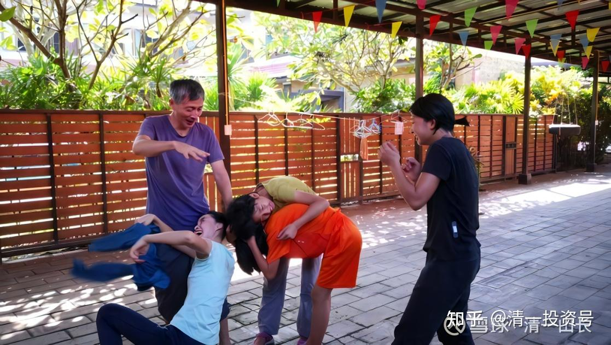

[原雪球专栏](https://zhuanlan.zhihu.com/p/545608877/edit)[77篇.祝你生日快乐！这碗世界最毒的鸡汤！](http://link.zhihu.com/?target=https%3A//xueqiu.com/9310099567/157928593)

[清一山长](http://link.zhihu.com/?target=https%3A//xueqiu.com/9310099567/column) 2020年8月28日

今天是我的生日。我对女儿说：今天爸爸送你一份礼物，她可以“点菜”，我来满足她。结果，小女儿就要求我要跳“兔子舞”给她们看，还要跟她的几个小伙伴，一起来玩“抓兔子”的游戏。因为我是一只老兔子（我属兔），她们四个人，要一起来抓我。不过，虽然小丫头们也练过一点武功，但要抓住我这只老兔子，还是有点不容易，瞧：她们反而被兔子反抓了！

（图片时间地点说明：今天早上运动时间，我家里后院的凉棚。栏杆后面，就是小姑娘们天天游泳嬉闹的地方。这四个小女孩，全都是三语全优生，水平超过外语专业的大学生，正在我的“私人家馆”里学习成长）

看来，在**小女儿的心中，最好的礼物，就是爸爸陪她玩游戏**。而不是去商场买个啥宝贝的东西。她说，去商场，最快乐的，就是发现：原来世界上有这么多的东西，她都根本不需要，其实也是没用的，但是很漂亮。我们去商场后，给她钱，去自由选择自己要吃的中饭，**每次都是买一份简单的蛋炒饭，也没有“换口味”的要求，花费30～40泰铢**。甚至她更可能去超市里面，**买一盒煎蛋饭——因为只要19泰铢，比在餐厅里面吃更便宜。**

她的**物质欲望很淡**。对于她来说，将来要去企业打工赚钱，用工资和奖金来激励她，有点难[大笑]。因为她**基本上就没有赚钱的愿望，她也没有啥花钱的欲望，所以，将来不太可能是企业的好员工。**

我也一样。她这种**消费观念，就是从小跟我学的**。在这个世界上，能够摆脱物欲对我们的控制，真心很不容易。我没有消费的愿望。但还有赚钱的欲望——我喜欢赚钱，所以喜欢炒股，喜欢投资，总想低买，高卖，赚点差价啥的。赢了就很开心。但我们的孩子，可能花钱和赚钱的愿望都没有了。她们只有“玩”的愿望——把一件事“玩”漂亮了就开心。我想，这就是我们家庭的能量提升吧？**穷怕了的中国人，一直把自己绑在物欲的战车上，无法脱离**。所以我们也创造不出什么像样的精神产品。目前，**影响世界的精神产品，主要来自于西方。因为西方早就有一大群没有物质欲望，只想体验人生的“财务自由人”。**

中午，大家一起吃饭。做了素馅包子、稀饭吃。太太告诉大家说，今天是我的生日，大家才知道，今天是个“特别的日子”，赶快给我祝福生日。还要小姑娘们一起给我唱生日歌，祝我生日快乐！

结果，我告诉她们：千万别唱。这个歌，**是全世界最傻的歌。唱多了，自己就变傻了！**让他们觉得：我是不是今天过生日过傻了？

我还让她们猜：哪一首歌，是全世界最赚钱的歌？对了，就是这一首歌“祝你生日快乐”。美国华纳音乐集团，在1990年以1500万美元的价格买下了这首歌的版权。而今天，这首歌依然带来了每天5000美元，每年200万美元的版税，总价值高达5000万美元。假如您写了这首歌，您就每天等着5000美金掉进你家里，想咋花就咋花。因为每天都有钱灌进来。

这样看来，这个歌，不傻呀？挺赚钱的。

我说：写这首歌的人不傻，但是唱这首歌的人，就太傻了。因为这个歌，**会让你变成一个傻瓜，变成“消费者”，变成“穷人”“奴仆”，而且是“不快乐的人”**。大家全傻了。怎么会这样？

我说：“根据行为心理学的信念系统理论，**这首歌传递的信念，潜意识中就是：这一年，你都不快乐，至少不够快乐。所以生日这天，你需要‘得到’快乐**，我们大家，都愿意在这一天，一起给你快乐，祝你的生日快乐。”瞧——你这不是完蛋了吗？我干嘛只能“生日快乐”，就不能“天天快乐”？所以，这种暗示，就是直接的告诉你：你今天，每天都不快乐，除非今天是你的生日。这显然，这种小祝福和信念，就造成了我们的命运。每天活得真累！真没劲。

除了“祝你生日快乐”，我们还有“祝你新年快乐”，祝你“各种节日快乐”，这些东西，其实还有一个要命的潜在信念，把我们的快乐，弄得非常的“不快乐”。**这个潜在的信念，就是：“我的快乐，是依赖于他人祝福的。如果没有人祝福我快乐，我就得不到快乐。如果有越多的人祝福我快乐，我就越快乐”**。让你忘记了：**你一个人也可以很快乐**。所以，一旦过生日，很多拥有这个信念的人，就眼巴巴地等着别人来祝福自己“快乐”。如果觉得该祝福自己的人，居然没有理自己，就会生气。女人特别明显——你居然敢忘记我的生日，节日！[哭泣]本来快乐的日子，也变得不快乐了！

因为有了这种心结，各种攀比，各种期待，各种怨念，就统统产生了。这样，你真得不快乐了。种种的计较、不满、怨恨、期待。干嘛不理性地想：**我的快乐，完全取决于我自己。我想快乐，我就是快乐的。我干嘛要去期待别人的祝福，才能够快乐？**这很弱智的喔！

更糟糕的是：这种期待，已经成了“国民文化”。它不仅仅把当事人局限起来，还把他身边所有的亲朋好友都一起“捆绑”起来了。如果你居然不懂得给身边的好友去“祝贺生日快乐”，你就不是他的好朋友。真正的好朋友，不仅仅要祝贺，还要用实际行动来精心挑选“生日礼物”，让当事人“感到快乐”，至少你要拿出时间，来参加当事人举办的“生日庆典”，很多人一起吃饭，并送礼。如果你居然敢忘记了领导的生日宴会，忘了给领导送生日礼物，你在单位里面，绝对别想得到什么好的提升机会了。特别是有点身份的人，认为自己的生日，来的人越多，收到的礼物越多，他就“越快乐”，否则，就“不够快乐”。中国的人情社会，就是这样运作的。

结果：**很多人把宝贵的生命和时间，都消耗在到处搞关系、做关系上了。**我发现，我的中学同学中：**社交圈越是活跃的人，成就越少。越是很少参加这种活动的人，专心做事的人，社会成就越大。**

我很幸运，17岁就离开家乡，去武汉读书。毕业后也没有回家乡，留在大学工作。这是一个“人情淡漠”的地方，结果，我有机会做了很多事情。当然，也造成了我被身边朋友笑话为：不会吃喝玩乐，不会过日子的傻家伙，白活了一生(在我看来，**他们才是白活了一生，每天除了赚钱拿工资，就是吃喝玩乐，啥事都没做，也没啥追求和理想。世界有他不多，无他也不少**[大笑]）。

我毕业30年，才跟原来的校友取得联系，但去了几次校友聚会，就实在受不了。**除了在一起吃一堆损害身体的食物，就是说一堆毫无意义的废话**。后来，我就能溜就溜了。现在出国生活，就自然脱离了原来的朋友圈，觉得很自在。当然，回国偶尔也会参加一下亲友聚会、同学聚会。但生日聚会，我基本上不到场。我觉得太无聊。

当然，我现在也算个“人物”，我从不关心别人的生日，但关心我生日的人，也特别多。今天一大早就开始有人祝我生日快乐了。老婆看到了我社交账号上发来的信息，就说：“喔，我都忘了，原来今天是你的生日。今天想要点什么吧？我陪你去逛商场？”

当然，不需要的。我今天没去商场。如果我需要啥东西，随时想买就买，干嘛要到生日才买？何况我基本上没啥想买的东西。我想要的，是建造一个大学。谁愿意送给我这个礼物？我就太高兴了。别的东西，有啥好要的。我的名言是：**凡是用钱能够买到的东西，都不值钱！**

其实，说到这里，你们已经发现了奥秘：**“祝你生日快乐”，原来也是商家的阴谋诡计。他们用各种媒体、电影、广告，以及各种温柔的手段，来不断输入你信息，告诉你：生日，你一定要买一个“高贵的”，配得上你的礼物，来让你“快乐”。而找到快乐的方法，就是大把花钱！**平时不花的钱，你一定要花。结果，很多人生日，往往去买一些自己根本不需要的东西。装饰品、金银、艺术品、摆设等等。大约没有人会说：今天生日，我买个盒饭给你吧？多没情调。就算要吃，生日餐也一定要吃一点“特别的”东西，其实就是如果平时25泰铢就可以一餐（泰国的基本标准），生日你要至少花2000泰铢吃一餐，去日式餐厅优雅地花一笔钱。否则，生日怎么对得起自己？

仔细想想：你中毒了，这是严重的毒鸡汤！！因为，**快乐无处不在，无处不有。跟商家有啥关系？**我带小女儿找快乐，看看蚂蚁搬家，很快乐；看看明月经天，很快乐；看看小鸟歌唱，也很快乐；带上鱼食去池塘边喂喂小鱼，去光脚走走路，去草地上滚一滚，去郊外野营，这些全都很快乐。而且——跟商家买的东西根本就没有关系。但**如果你接受了这种商家的逻辑，把快乐跟“买东西”、“买礼物”结合在一起，就惨了。你变得找不到快乐了。除了更快地花钱外，你无法寻找自己的快乐。**我看到**很多人，就被这样轻易地剥夺了快乐的权利！**

所以，我说**“祝你生日快乐”是一碗毒鸡汤**。它**夺走了你快乐的权利，注入了不快乐的因子，更重要的是：它是商家的阴谋，让你成为商品的奴隶。**

**为了防止孩子被世俗的观念所毒化，我会利用一切机会，告诉孩子看透世界的真相。**我会带孩子去吃麦当劳、肯德基，然后告诉他们商家的诡计。让她们兴奋以及不好意思，然后被嘲笑一顿她们当了商家宣传的傻瓜。我会请她们吃冰激凌，然后祝福她们：以后会变胖妇人，以及月经疼痛，还要得骨质疏松症等等。嘲笑她们“只要嘴巴”，不要身体的傻瓜体验；我会带她和小伙伴，一整天去逛商场，作为一天的学习项目。作业题目是让她们找出来，什么是不需要的东西。结果，她们自己发现：99.99%的东西，都是她们不需要的。而她们发现真正需要的东西，都是很便宜的。她们发现最不需要的东西，反而是最贵的——黄金、珠宝、化妆品！

当孩子具有了这种眼光，就不容易被商家骗了，她们会生活得更自在，更轻松、更快乐。所以，孩子们很喜欢我。因为，这就是教育。教他们建立正常的思维，而不是被毒鸡汤牵着鼻子走。

所以，我说，**“祝你生日快乐”，就是培养消费者思维的温床。要尽量避免。**

还有：**“祝你生日快乐”，还是培养无脑感觉型人的温床**。因为，**它设定了一种前提——似乎，人生下来，就是要寻找快乐的，找乐子的。似乎这就是人生的意义和目的**。这种口号和人生设定，**会让你忘掉人具有的“本自具足”的本性，而迷失在“找快乐”的人生道路中，成为迷途的羔羊**。

每天沉迷于打游戏的人，吃喝玩乐的人，黄赌毒的人，他们内在深处最深的驱动力，其实就是“找快乐”。所以惨了，你从小给孩子唱歌“祝你生日快乐”，你把感觉型人格就传授给了他。结果你和她，一生都要为此买单。成为这个信念的奴隶！

而**目标型人，是没有“找快乐”的信念系统的。**他们的核心信念是如何实现自己的目标。他们**是行动者、经营者，是世界的创造者。**他们是追梦人，以及造梦人。“让世界因我而不同”，是目标型人的特征。他们奋斗、流汗、流血，都为了实现一个理想，一个梦想。他们**不会想什么失败、痛苦、累和辛苦，不去想怎样快乐**。但**他们专注于目标，每天都在想和做自己的目标。**

**小女儿的人生目标，是要成为一个超过爸爸妈妈的教师**（指的是要学会爸爸和妈妈的全部本事），**我们也鼓励她学习我们的优点**。所以，小家伙从小就善于挑战我们，只要能够超过我和她妈妈，就特别地快乐。比如她懂三语，我们不懂。她会做一些事情，劈叉、下腰等等，我们就是不会，她就很得意。这样不断地发展自己的能力，得到了不断地发展和提高的机会。试想：一个小孩子，持有这种“我要实现某某目标”的信念，根本就不去想快乐，不快乐，更不去想吃喝玩乐，您认为将来长大，她会平庸吗？

另外，她会不快乐吗？我认为，她会天天快乐的。**如果成功了，她会很开心；如果做事失败了，她会发现一种不会成功的方法，然后去寻找新的方法。她不会被沮丧和失落击倒，也不会被成功冲昏头。因为，她永远在实现目标的路上。因为，她是目标型人。**

**真正的教育**，就是这样的：**不是知识，不是课程，不是考试，而是小心你置入孩子的信念是什么：美好人生的一切，从“拒绝祝你生日快乐”开始！**

谢谢大家，这是我在今天，我的生日这一天，送给大家的一份“生日礼物”。您喜欢，就收下，不喜欢，就走开，把我拉黑。您是自由的！您有选择的权利。当然，我也有！祝福一切正直，善良的人!

【**QQ群发言**

@全体成员 谢谢大家的祝福。很抱歉，今天消费大家的注意力了。为了补偿大家的损失和付出，我赶着写了一篇解析“生日祝福信念系统”的文章，转发给你们看看。这是目前正在给高中孩子们上的课程，教他们如何解析人生信念系统，移除人生的地雷。但我把信念系统解析的内容，尽量简化，写成了普通的文章，供你们阅读。高中的学生们，读不到如此简易的文章。他们玩的全是学术化的分析，把他们累死了。不过，孩子们很兴奋——世界上具有这么高级的课程！前几天解析的内容是：“努力就会成功，付出就有回报”。“祝你生日快乐”，将是下周的解析课程，当然，会比我的文章学术化得多的。祝你生日快乐！这碗世界最毒的鸡汤！】
