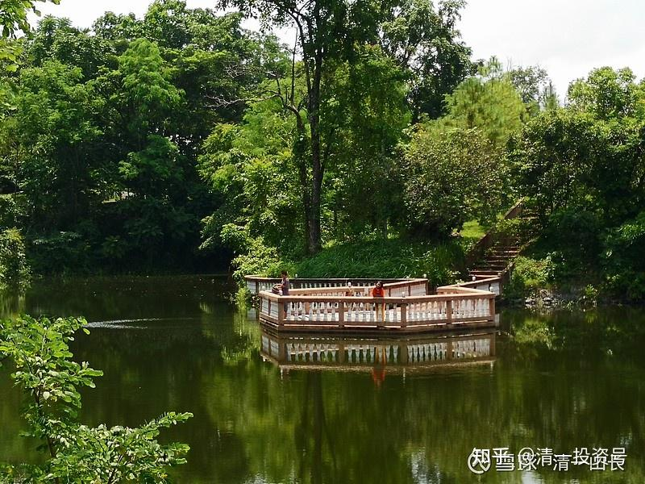
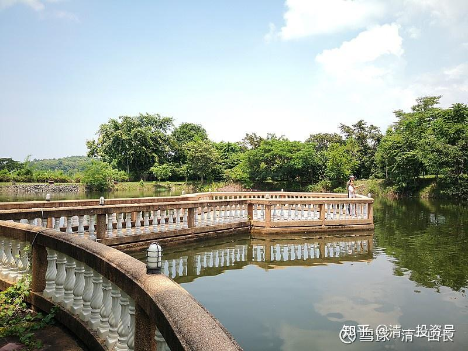
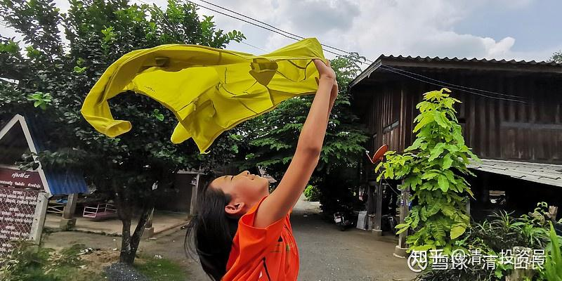

[原雪球专栏](https://zhuanlan.zhihu.com/p/546933970/edit)79篇.小女开始赚泰国人钱了：收天价学费！

[清一山长](http://link.zhihu.com/?target=https%3A//xueqiu.com/9310099567/column) 2020年9月4日

孩子收天价学费：小女告诉我：园丁想要她的几个孩子跟着她和她的小伙伴学英语，并表示要付钱。每天两个小时，每周五次。每月要给她和她的小伙伴学费6000泰铢。

这笔钱，说实话并不高。中国每小时的英语培训费，都要200～400元呢！但，如果我告诉你，这个园丁，每周工作六天，每天工作8小时，月工资仅7000泰铢。您就知道：她愿意支付几乎她全部的工资，请一个中国人的小女孩，做她孩子的家教。这对她来说，是非常慷慨，非常昂贵的一笔投资了。恐怕是小女能够收到的最大比例的教育投资。

小女很困惑，跑来告诉我：为啥园丁一定要给钱？她知道园丁的工资并不高，她并不想要赚这笔钱。本来她告诉园丁，她可以跟原来一样，免费教园丁的孩子。但园丁却一再的坚持：不行，必须收钱。必须的——必须的！小女就不知道该怎么办了。就跑来问我！

我就说：她愿意付钱来学英语，证明你教得好。她很信任你。当然，也是你和小伙伴的表现很好。你就收下吧！然后你再用这些钱，来聘请你的学生帮你做工作，比如施肥、种木瓜树等等，让他们也有赚钱的机会，把钱用另外一种方式，还给他们。这样大家都开心，明年院子里面就有很多木瓜吃了。都算是你种的。小女觉得这个主意真好，就高高兴兴地跑走了。

小女的中、英、泰三语都很好。前一次外出旅游，我有意让她跟泰国人一起玩。目标是如果泰国人没发现她和小伙伴是外国人，就算赢了。结果——泰国人真的没有发现她们是外国人，认为她们是曼谷来旅游的泰国人（我们住在泰国北部，是有方言的。但小女学的是标准泰语，所以像是曼谷话）。没人怀疑她们的外国人身份。最后告诉泰国人，其实自己是中国人后，泰国人表示一点都看不出来。所以，可以说她的泰语，基本上达到了同龄孩子的母语水平。她的英语是最强项，似乎比汉语更好。当然，汉语正在快速成长中，因为最近两年我只让她看中文书，不许看英文书。这说明：她具有的三语能力，均接近母语水平，不是能够结结巴巴说几句话而已。这园丁，肯定是看了她几年，发现这孩子就是语言天才，很想让自己的孩子也能像小女一样。所以很恭敬地请小女来做教师。关键是：她居然愿意给才12岁的小孩子“天价”的学费，按照泰国本地的培训学费行情来支付，完全媲美成人教师，而不是欺负小孩子，按质论价。真的是抬举了。我相信她孩子上学的泰国的英语教师，英语水平肯定不如我家小女，起码语音不纯正，所以她才会想办法让小女来当她孩子的教师。

**泰国人的荣誉和自尊，即使是一个下人，也是很强的。不愿意占人的便宜。**但自己也很有原则，不会因为我是“主人”而给面子，违背了自己的信仰，该不给就是不给[滴汗]。记得我前年让她清除我居住的房子旁树上的蚂蚁窝，结果她就是不肯动手，说她不杀生，害得我只好自己干。这家人虽然穷，但不会贪婪，不搞小偷小摸的，占主人家的便宜。有时候我们走了，离开泰国半年多。她照样把园子管理得好好的。我们回来一看到处都是干干净净的，不因为我们不在而偷懒。我们家大门经常开着，也不见东西被偷。就是偶尔泰国的牛，会闯进院子里面来吃草。反正地方很大，也就让它们逛逛。我自己也买了三只羊来放养，现在变成7只了，每天自己到处去吃草，都见不到在何处。晚上就跑回来了。

下图：小女跟泰国园丁在一起喂鱼。水面上的波纹就是鱼群拉出来的。我们在她的对岸，所以人影很小

“上图是我和太太在看自家庄园里养的鱼。这里的一群鱼，大的有二三十条。每条有十几斤。昨天刚刚放了几十条小锦鲤进去。”

小女原来才10岁不到，我就让她去市场，帮泰国人打工，推销水果。去餐馆做服务生，不要工钱。每天拿回一袋老板送的水果当工钱，每天吃最简单的食物，穿最朴素的衣服。她穿的衣服，是自己去商场挑选的，疯狂打折价，只花了几十泰铢，质量还不错。我们家奉行“穷养”政策。外出之后，衣食住行，跟穷人家小孩差不多。包括我们的车，都是普通的大众车。她打工的时候，与底层的民众一起工作。晚上回家，有超大的房子住（她的卧室大约有80～90平方）。大大的英式花园，还有两个私家游泳池（都是前房主——英国人留下来的），让她和小伙伴一起开心玩。还邀请泰国小朋友来游泳。这样，**心态上养成了富贵不骄的平淡个性，不会犯国人的富贵病**。

中国的父母们从底层打拼上来，从小宠溺子女，孩子无能，只会享受，却一个个自我感觉超级良好，瞧不起穷人，甚至瞧不起一切人。小女更会理解穷人的难处。也不会因为自己的生活简朴，看到富人家的炫富手段，房子、车子，就腿软没骨气。可惜今年疫情封锁了，不然原计划还要带她去看东南亚专门为中国人开设的豪华赌场，里面陈设的纯黄金打造的皇帝宝座，各种奢华的显摆方式。让她去实地看看，中国富人的笑话和愚蠢行为。

**教育不是读几本书，考试拿成绩，就行了。而是要教孩子读懂人生！读懂社会，读懂人心。并提高自我的能力，成为别人喜欢的人。**小姑娘最喜欢上的课，就是我教她的“读心术'，我告诉她：**不同的人，有不同的心。了解这些人心的不同，就更容易知道怎样做事**。比如，我就是因为读懂了K线图背后的人心，才从股市上赚到钱的。她学着搬了一点皮毛，去逗泰国的一个20岁出头的大学生姐姐玩，她是课余来我们家打工赚钱的。小姑娘告诉这个泰国大女生：说她说话的方式，以及想问题的方式，是“穷人思维”，富人不会这样想问题等等。弄得泰国女孩一愣一愣的。这女孩也在跟小女学外语，免费教。小女还用自己的零花钱去买了巧克力，因为这个泰国女生最喜欢吃巧克力。小女用巧克力去激励她完成学习目标[大笑]。这大女孩在她的影响下，改了不少毛病。不再乱吃零食、奶茶等。体重也减轻了。

我告诉小女：“**这样做很好，随时随地帮助别人，你就会跟别人建立一生的友谊。这不是拿钱能够买来的。**”中国人的形象，在我们的身边，是受泰国人尊重的。而**泰国整体，对中国人的印象，是负面的。大致上是“一群有钱的傻瓜，或者没教养的混蛋”**[吐血]。

我认为：现在泰国人愿意支付高价来学习我们的课程，是一个标志性的纪录，代表今日新教育正在迈向国际化。原来的今日学堂2.0教师，树立了国内新教育的标杆。**将来的3.0教师，应该就是国际化的教师，是可以让外国人心甘情愿送钱来的优秀教师，是要比欧美教师更受欢迎的教师**。小女今天的这一步，也许，就是她走向3.0的一小步。

您要问：1.0老师是什么样的？想知道，就看看钱莉校长，她就是我带出来的1.0教师。她上的开学第一课，很多网友直呼：跟央视相比，云泥之别。当然，也许我们是泥巴[大笑]。央视的第一课，戏子一样的表演、娱乐，飘在天上下不来。

2.0老师们，将从下周五开始，陆续出来讲公开课。他们将用自己的方式，来帮助示范班的学生，成为最好的中国人。这些2.0与1.0的不同，就是你可能看不出她们是老师，看上去很像一个学生。太年轻了，有些才十几岁。这就是我们的2.0教师。您想知道我的学生啥水平，就直接看直播吧！未来的3.0教师，看上面园子里面的照片中的小人儿就知道了，暂时没有“公开课”的安排。就算安排了你也看不懂——用泰语来教英语的中国教师。看她跟泰国人在一起说说笑笑的，我都是蒙的。等她们开始执教，**也许您需要再等10年，等她们从18岁开始，用四年读完四个大学后，就会回来，开始直播她们带班了。**

今日新教育示范班直播链接：

这是今日迎新活动的链接，正在进行中……[哔哩哔哩：](http://link.zhihu.com/?target=https%3A//live.bilibili.com/22489198%3Fshare_medium%3Dandroid%26share_source%3Dqq%26bbid%3DXY588D35392CDAD7283659C44FF8F0892ADEE%26ts%3D1599009417967)[https://www.bilibili.com/video/BV1Hf4y1X7T3](http://link.zhihu.com/?target=https%3A//www.bilibili.com/video/BV1Hf4y1X7T3)

**评论回复：**

[@宏哥哥玩投资](http://link.zhihu.com/?target=http%3A//xueqiu.com/n/%25E5%25AE%258F%25E5%2593%25A5%25E5%2593%25A5%25E7%258E%25A9%25E6%258A%2595%25E8%25B5%2584):回复[@清一山长](http://link.zhihu.com/?target=http%3A//xueqiu.com/n/%25E6%25B8%2585%25E4%25B8%2580%25E5%25B1%25B1%25E9%2595%25BF)：

谢谢山长的用心解答[很赞]，看您的文章受益良多，以前不懂，自从出去过几次后，同时也和在国外长期生活过的一些熟人交流后个人认为我们zg（中国）人目前要想在国际上得到尊重很难，国际上外国人歧视zg人就像我们歧视国内一些地域一样，真不是别人的偏见问题，**是自身文化素养的问题**。看您多次提到国人劣根性，当我试图跳出中国人的角度看中国的时候，我把和奥地利回来的朋友向我叙述的西方骑士精神和目前我们文化一对比，天啦！这差距不是一点半点，反思了很多，原来自己身上劣根性也不少。曾经一度觉得自己素养还可以，不知道哪来的自信[捂脸]现在想想不过是迷之自信罢了。心理一直有一个疑问想请教山长：就目前国内现状而言除了依靠优质教育以外还能否依靠社会制度来提升国民素养呢？

[@清一山长](http://link.zhihu.com/?target=http%3A//xueqiu.com/n/%25E6%25B8%2585%25E4%25B8%2580%25E5%25B1%25B1%25E9%2595%25BF)[2020-09-06 11:47](http://link.zhihu.com/?target=https%3A//xueqiu.com/9310099567/158564714)回复[@宏哥哥玩投资](http://link.zhihu.com/?target=http%3A//xueqiu.com/n/%25E5%25AE%258F%25E5%2593%25A5%25E5%2593%25A5%25E7%258E%25A9%25E6%258A%2595%25E8%25B5%2584)：

**有些“皇帝”，或者自认为自己是“皇帝”的人，是很忌讳别人说自己没穿衣服的。我们只是天真的小孩罢了，就让他们以为自己的衣服就是最漂亮的吧！装睡的人是唤不醒的[俏皮]。其实没穿衣服也没关系，找一件来穿上就好了；没文化也没关系，去学点文化就行了。老祖宗留下了这么多的宝贝，就怕没文化的人，偏要装自己文化很高的样子。央视第一课，把戏子的表演，当文化课来上。这就是笑话。**

@巴费格:回复@清一山长：

夫人好年轻啊！

**[清一山长](http://link.zhihu.com/?target=https%3A//xueqiu.com/9310099567)**[2020-09-04 14:19](http://link.zhihu.com/?target=https%3A//xueqiu.com/9310099567/158476487)回复[@巴费格](http://link.zhihu.com/?target=http%3A//xueqiu.com/n/%25E5%25B7%25B4%25E8%25B4%25B9%25E6%25A0%25BC)：

夫人年龄已经奔5了，大孩子已经23岁。所以，您肯定知道她的擅长是什么了？如果想学养生健身，找她就好了。想学内家武术，可以找我！我负责打人，她负责救人。所以她人缘比我好，粉丝比我多！**我的粉丝热爱钱，她的粉丝热爱生命！**[大笑]。

@老金少:回复@清一山长：

我上过刘老师的课，还没有上过山长的课，希望能有机会上山长的课。

**[清一山长](http://link.zhihu.com/?target=https%3A//xueqiu.com/9310099567)**[2020-09-04 14:35](http://link.zhihu.com/?target=https%3A//xueqiu.com/9310099567/158478503)回复@老金少：

[很赞]。祝福你们。**还没有人不喜欢刘老师的课，但有人很恐惧来上我的课**。所以我知道刘老师的粉丝比我多，比我铁杆。

[@盛静美](http://link.zhihu.com/?target=http%3A//xueqiu.com/n/%25E7%259B%259B%25E9%259D%2599%25E7%25BE%258E)回复复@_override：

山长说的是一种未来的趋势。这同时也是3.0受人喜爱和接受的一种开始，是走向国际化的开端。任何事情的开端都是微小的，工业时代的开端就是一台蒸汽机。网络时代的开端是010101的编码出现。您说的整体，泰国成为区域强国，好像和文章意思没有半毛钱关系。

**[清一山长](http://link.zhihu.com/?target=https%3A//xueqiu.com/9310099567)**[2020-09-04 16:48](http://link.zhihu.com/?target=https%3A//xueqiu.com/9310099567/158492273)回复[@盛静美](http://link.zhihu.com/?target=http%3A//xueqiu.com/n/%25E7%259B%259B%25E9%259D%2599%25E7%25BE%258E)：

你可以很有礼貌地回复：**起码你已经看到了，泰国这些下等的仆人，礼貌修养，要比中国一些大学的老师好。这不是别人家素质高的表现吗？当然，您硬要比有钱？自然是中国人更强！说明钱多，国强，跟国民素质提高并无关系**[大笑]

[晕娜](http://link.zhihu.com/?target=https%3A//xueqiu.com/1845773477)2020-09-04 20:52回复[清一山长](http://link.zhihu.com/?target=https%3A//xueqiu.com/9310099567)：

人们都说，男孩穷养，女孩富养。真佩服山兄教女有方，放在我，肯定做不到。我不忍心。我只有一个男孩，大学毕业后，就自立了，没再跟我要过钱。现在工作、理财两不误，比我能挣钱……哈哈

[清一山长](http://link.zhihu.com/?target=https%3A//xueqiu.com/9310099567)2020-09-04 21:12回复[晕娜](http://link.zhihu.com/?target=https%3A//xueqiu.com/n/%25E6%2599%2595%25E5%25A8%259C)：

男孩自立自强，就是最好的教育[很赞]

[晕娜](http://link.zhihu.com/?target=https%3A//xueqiu.com/1845773477)2020-09-04 21:22回复[清一山长](http://link.zhihu.com/?target=https%3A//xueqiu.com/n/%25E6%25B8%2585%25E4%25B8%2580%25E5%25B1%25B1%25E9%2595%25BF)：

三观很重要。人生的长度差异不大。人生的宽度、高度，差异很大。把这个世界尽量看得美好一些，阳光一些，一生受益。

@德明弘毅回复@**[清一山长](http://link.zhihu.com/?target=https%3A//xueqiu.com/9310099567)**：

听山长栽培女儿的故事，听得津津有味，深受启发也学到很多。不过我有个小疑问，按风水学的说法卧室以小为宜，八九十平米的卧室似乎过大了？

**[清一山长](http://link.zhihu.com/?target=https%3A//xueqiu.com/9310099567)**[2020-09-04 21:54](http://link.zhihu.com/?target=https%3A//xueqiu.com/9310099567/158511651)回复@德明弘毅：

[很赞]。你说的对，这是西方式建筑。这个大卧室，是前房主女儿的闺房。西方人喜欢房间大，一栋房子居然有一千多平方，每间房子都超大。他的车库，都可以放25辆车，我拿来做室内运动场了。小女卧室下面的客厅，就拿来做图书馆了，有人可能看过照片，可供20多人阅览、学习用。**中国是客厅要大，但卧室要小，“方丈之室”就够了，聚气**。所以，**小女还另有一间小卧室，十几个平方，是原来的客房，她一个人的时候住**。**大卧室，是小伙伴来清迈的时候，她们一起生活的地方，集体生活。这个大卧室，最多的时候，住了20个人。**

[德明弘毅](http://link.zhihu.com/?target=https%3A//xueqiu.com/4060207734)2020-09-04 22:53回复@**[清一山长](http://link.zhihu.com/?target=https%3A//xueqiu.com/9310099567)**：

我说呢，山长作为一个道家人物，不会不懂这点风水常识的。

[@宏哥哥玩投资](http://link.zhihu.com/?target=http%3A//xueqiu.com/n/%25E5%25AE%258F%25E5%2593%25A5%25E5%2593%25A5%25E7%258E%25A9%25E6%258A%2595%25E8%25B5%2584)回复[@清一山长](http://link.zhihu.com/?target=http%3A//xueqiu.com/n/%25E6%25B8%2585%25E4%25B8%2580%25E5%25B1%25B1%25E9%2595%25BF)：

泰国是我们的邻国，差距咋这么大啊！2014年去过一次曼谷，看到哪些服务员和街边小贩他们的脸上洋溢出来的开心，让我很是羡慕。朋友在曼谷开公司，他说去泰国呆几个月后，发现泰国人的包容度和素质真高，自己学佛多年还不如泰国平常老百姓的心态好，说自己很惭愧。

[清一山长](http://link.zhihu.com/?target=http%3A//xueqiu.com/n/%25E6%25B8%2585%25E4%25B8%2580%25E5%25B1%25B1%25E9%2595%25BF)[2020-09-05 18:29](http://link.zhihu.com/?target=https%3A//xueqiu.com/9310099567/158544661)回复[@宏哥哥玩投资](http://link.zhihu.com/?target=http%3A//xueqiu.com/n/%25E5%25AE%258F%25E5%2593%25A5%25E5%2593%25A5%25E7%258E%25A9%25E6%258A%2595%25E8%25B5%2584)：

**敢于面对有福**[献花花]。原因：**因为我们的教育，是有知识，没文化。这些国家，虽然知识差些，但别人真有文化，有传统。文化以及传统，就是不识字的老百姓，身上自然展现出来的文化素质，这就是长期的“国家文化”熏染的结果。“微笑之国”的吸引力，不是泰国的风景多美，是泰国的人文环境让人很安心！**

**[@今慧](http://link.zhihu.com/?target=https%3A//xueqiu.com/2688493369)**回复**[清一山长](http://link.zhihu.com/?target=https%3A//xueqiu.com/9310099567)**：

山长，您好，我老大在外围学堂备考班，老二两岁五个月，也送到新教育明珠班，但是每天哭得很厉害，害怕上学堂，我想请教山长，强迫这么小的孩子去适应学堂生活会不会有什么副作用啊？这几天我都是在纠结这个问题中度过的，很想知道以山长的高度是怎么看待幼儿离开父母这个问题。谢谢！

**[清一山长](http://link.zhihu.com/?target=https%3A//xueqiu.com/9310099567)**2020-09-07 15:56回复**[@今慧](http://link.zhihu.com/?target=https%3A//xueqiu.com/2688493369)**：

**你最好看其他的孩子是不是也怕上这个学堂？他们在学堂，是开心的，还是不开心的？别眼睛里面只有你家孩子。如果其他的孩子都很好，肯定就是你们家的孩子矫情了，你制造了外面不安全的心理恐惧给他。这样继续下去，你越保护他，他只会越来越怕离开家的。你就成功培养出一个“家里蹲大学”的人才了[大笑]**

[@雯馨6vq](http://link.zhihu.com/?target=http%3A//xueqiu.com/n/%25E9%259B%25AF%25E9%25A6%25A86vq)回复**[清一山长](http://link.zhihu.com/?target=https%3A//xueqiu.com/9310099567)**：

山长您好，我是一个生活在四线城市的大龄未婚女性。我想请教您，您认为女性，应该怎样做才能与时俱进，财务自由呢？人们都说要有理想，为了理想而努力奋斗，我很迷茫，我一直没有找到我的理想，盼望您能指教一二[跪了]。

**[清一山长](http://link.zhihu.com/?target=https%3A//xueqiu.com/9310099567)**[2020-09-08 19:14](http://link.zhihu.com/?target=https%3A//xueqiu.com/9310099567/158755778%3Fpage%3D1)回复[@雯馨6vq](http://link.zhihu.com/?target=http%3A//xueqiu.com/n/%25E9%259B%25AF%25E9%25A6%25A86vq)：

**小城市的人，吃吃喝喝玩玩，没啥志向的。这种环境，要有理想就难过了。理想是每个人自己设定的，要等别人告诉你，就是别人的理想，不是你自己的了。当心被忽悠，比如有人的理想：“成功人生就是要买个汤臣一品的房子”。这就搞不清是你的理想，还是汤臣的理想了。**

**理想是什么？理想就是你不要钱，不要脸，不要命，都要去做的事情。你如果找到了，恭喜你；如果找不到，也没关系。反正大多数国人都是没理想的，他们只是活着罢了，各种活法。**
