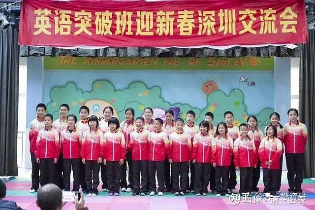

[原雪球专栏](https://zhuanlan.zhihu.com/p/546934508/edit)[82篇.如何用三年学完十二年的课程？](http://link.zhihu.com/?target=https%3A//xueqiu.com/9310099567/161907733)

[清一山长](http://link.zhihu.com/?target=https%3A//xueqiu.com/9310099567/column)2020年10月30日

三年如何学完十二年的课程？**今日学堂的学生，仅需三年，就可以学完12年任何国家的课程，且取得良好成绩。**这个教育成绩，目前是教育界的唯一。教育界没有任何人有这把握做到这一点。我们能，而且已经批量生产成果。现在，今日学生的定位标准，主要是“超越美国”，以美国教育标准为参考，因为它代表全世界的教育标准，是其他国家的模仿学习的榜样。因此，**我们超越了美国教育的标准，就意味着制定了新的，全球的教育标准。而且是中国人创造的。**

这个目标，按道理来说是不可能做到的，母语都很难达到。何况是以外国人的身份，至少要用一年的时间来打好外语基础，起码能听懂国外教师的授课课程吧？然后，只正式学习三年的课程，就要超越本土学生的成绩，完全就是“新教育神话”，或者是“教育骗局”。很多资深教育人，也就依据这个逻辑，简单判断说：我们辛辛苦苦，每天努力奋斗教书育人，花了12年，都达不到的成绩和标准，你凭什么三年就可以达到？肯定是骗子！

可事实上，大批的学生，真的只用了三年的时间，就达到和超过了美国中小学教育12年的教学成绩要求。我们也只需要用一年的时间来学习专业课程，就达到了中国大学相同专业的本科四年教学成果（三语高中的教学成绩）。这些，都已经是批量实现的事实。不断涌现出这样的成果。当看到这些事实的时候，这些教育专家又改口了：说这些都是天才学生，其他普通学生是做不到的。真的吗？

马云花了十年时间，就超过了成立60年的沃尔玛的业绩，成为世界第一大零售商，创了商界纪录。您认为阿里巴巴是骗子吗？还是马云以及他的团队人员，全都是天才的创造？只会这种判断，只能说您太传统，眼光太狭隘。您等于就是一个赶马车的车夫。赶一天的路，走个一百公里，都算是优秀的成绩。别人告诉你：他“赶”汽车，一天可以开1000公里以上，“马儿”（发动机）还不用休息，不用吃草和喝水，还不用花功夫喂粮食给它。你说：这肯定是骗子！您越坚持，只能说明您越老旧，越跟不上形势。注定要被时代淘汰的。

我下面从三个教育学的专业角度，来解读：为啥新教育只需要用三年，就可以学完传统体制教育12年的教学课程！

**首先，两者真实所用的有效学习时间，差距并不是想象的这样大！**

**传统的体制学校**，虽然学生一整天看起来都忙忙碌碌的。其实**大量的时间，都是碎片时间，无法成为真正的有效学习时间**。比如学生浪费在路上、车上，在准备学习的事情上，在无效学习中度过（不理解，消极等待，老师无聊训话，以及维持课堂秩序分神，学生八卦游戏等等）。真正有效的学习时间，学生一天不会超过4小时的。特别是小学阶段的学习浓度极低，浪费时间最严重。还造成了学生不能适应未来大信息量学习的需要。

而清一新教育的学生学习时间，要比传统学校多得多。由于全体采用住校寄宿制度，省掉了每天上学下学奔波的时间，高效利用了每一天。学生们**每天有效学习时间，一般是8小时左右**。而且周末是不休息的，周日有半天用于休息和自我整理。由于每天都保证了学生高注意力的集中学习，所以，同样是学习三年，新教育的学生，在学习时间上，大致上等于体制学校的一倍——相当于6年左右。因此，这个学习浓度是没有问题的，很多智能正常的学生就可以达到这个学习吸收力。

**第二：两种教育的学习内容和学习的浓度不一样。**

同样是给小孩子吃奶粉，双鹿奶粉和能恩奶粉会是一样的结果吗？**传统的体制学校K12学习内容，真实的学习信息量是很少的**。课本只有一点点内容，而且**很浅薄**。特别是小学阶段的课程，简直就是弱智级别的教材，装幼稚。清一新教育的学习内容，则是**选择更有内涵，浓度更丰富，更深入的内容来学习**。甚至12岁小朋友学习的一些课程，会使用大学的一些教学材料。所以，**无论在学习的深度上，还是信息量的广度上，都远远超过了体制学校的正常教学内容**。所以，这样子教学，**学生的成熟度就提高得很快。**学习信息量至少比体制内的学校进度快一倍。所以，从这个角度来说：我们用体制学校相同的学习时间，肯定是可以学完比体制学校多一倍的内容。如果我们用了相当于体制内6年的时间，高营养的内容，最终的成绩，相当于12年的学生，这一点也不奇怪！这并**不需要天才，只需要正常人就可以做到**。如果您不相信：自己去看我们的直播示范课。我看到的直播弹幕，很多人说：我上的是不是假大学？怎么从来没有上过这样的课？还有人说：我活了42岁，都白活了。很羡慕这些11岁的小孩能够上这种课。至于您如何评价我们的课程？请自己看，自己决定！**我相信你不可能在其他任何学校看到这样的课程和教学法！**

**第三：两种教育对于教师的使用方式完全不同。**

传统学校的教师，就是要负责教学内容的提供，是知识的传授者。由于大多数教师的自身素质，学术能力都有限，教学水平境界有限，其实，大多数教师，是达不到最佳的教学内容传递要求的。特别是很多教师有人格缺陷（国家机构的心理学调查评估结果），更影响了教学效果。所以，体制内的家长，特别重视“选择名校”，因为这些名校的教师，相对普通学校的教师，水平会高一点。这种选择，当然还是有用的。但家长的择校成本很高，要去拼学区房，几百万，上千万就砸进去了。但就算上了这种学校，也是远远落后于时代的发展，只是“比下有余”罢了。绝对不是真正有智慧的家长选择。

因为，**现在这个时代，最优秀的教师都已经很容易找到了，他可以同时对数万人，数百万人上课，而且我们需要的支付的成本很低**。由于有了这种选择，我们根本不需要去勉强接受这些二流的，三流的教师来教我们的孩子。我们可以直接选择教学水平最高，能力最强，沟通能力最好的。我们能够找到最优秀的教师，来教我们的孩子。而符合这种要求的教师，在传统学校里，是几乎不可能存在的。就算有，你需要付天价学费才有机会入读。但您却可以只花一点小钱，甚至免费就可以得到这些教师的传授——没错。这就是现在的“网红教师”！这个时代，您在**网上，可以很容易就找到世界级顶尖教师的授课内容**。比如国际中小学课程，**全世界讲授得最好的教师，就是可汗学院的教学内容**了。连比尔·盖兹，都让自己的孩子来跟随可汗学院学习课程：说可汗老师讲的数学课程，比他讲的都好。很遗憾自己小时候，就没有得到这样的老师来上课，没有解决他小时候对数学的一些困惑。别忘了比尔·盖茨上的中学，是学费比哈佛大学还高三倍的，美国顶级私立精英学校。他都认为网上的教师比他的教师更优秀，您还想拿您的学区房换来的、其实教学水平也很一般的学位来比吗？可汗学院，现在已经提供了所有的K12教学内容，甚至还有扩展的中小学教学内容。这也是今日学堂的学生，要考SAT之前，主要学习的内容和教学资源。全世界难道还有任何学校的教师，比他们更牛吗？您还需要到处去拼名校的学位吗？所以，**现在最不缺少的，就是优秀的知识内容提供者，甚至可以免费得到**。现在这种全新局面下，教师的身份必须变化，角色必须改变，新形势下的教师必须变成另外一种教师，就是：新教育教师。

清一新教育的最特别之处，就是：**教师根本不负责提供教学内容，不负责教孩子知识。只负责孩子的心理和行为调整**。我们的教师，**会带领学生学习他们自己也不懂的教学内容**。比如教师们不懂外语，但可以带出优秀的学生，比北外的外语系成绩更好。我们的西语、英语、泰语学生，都很优秀，去了国外都让老外一愣一愣的。但我们的老师，并不需要懂西语、泰语。这一点，让其他的学校教师非常难以理解，总觉得我们不正常，是不是故意忽悠他们。难道是今日老师们太谦虚，假装不懂吗？怎么可能学生这么厉害，老师却根本不懂外语。

实际上，我们的学校学生，是不跟我们的老师学知识的。**学校的教学内容，来自于全球最高端的教师们**。这些教师，要**比任何体制学校的教师都要高明得多，而且耐心好得多。**如果学生不理解，他们会不断重复地讲授，还可以换不同的老师，来讲授相同的内容，让学生彻底地理解课程。而且是一对一授课，根据每个学生的学习进度来制定教学进度，不勉强学生齐步走。这种教师，任何体制学校的教师和班级能做到吗？实际上，传统学校的很多学生，就是因为各种原因，没有听懂老师的某一堂课，结果就惨了，导致后续的课程，都无法消化理解。但也只能每天被动跟随混日子。所以看上去学生跟班级一起学习，但实际上啥都没学到，身子在课堂，心思都不知道在何处，浪费了大量的学习时间。很多学生就这样混了一个学期、一年、数年。成为失败学生。**这种传统课堂集体教学方式，对于大多数学生来说，完全就是浪费时间，效率极差的教育**。所以，学了12年，其实学生真没学到啥有价值的东西。但精力时间，一点也没少费。清一新教育的学习小时利用率要高得多。

**清一新教育的教师**，由于不再承担提供课程教学内容的任务，而**把提供优质教学内容的任务，交给了“网红明师”。我们会选择全世界最优秀的教师，来示范课程和讲授**。但我们的教师也没闲着，他们的**主要工作，就是“协助，鼓励，支持学生去完成学习任务”**。这一点才是重点。**核心要求是让学生建立学习的目标和理想；培养学生学习的积极性；帮助学生改善学习的方法，提高学习的效能，解决学生的心理和学习障碍；并负责监督和检查学生的学习进度，提高学习的效能。**所以，我们的新教育教师，更像是一个个的“知心姐姐，知心哥哥”，而不是传统学校里面，卖弄自己学识的“填鸭教师”。新教育教师不会自恋，高高在上的样子。而更像是学生们的伙伴和朋友。其实，体制的学生，也非常需要这种帮助。可惜体制学校的教师，几乎没有人来做这个工作。而且由于体制的学校往往班级都比较大，特别是名校的班级更大，超过50个学生一个班完全正常，还有一个班80个人的。这种体制名校，再有名，也帮不了你的孩子。因为你的孩子，可能需要个性化的辅导。**新教育学校，一个班20人，除了主班教师，还有一个助教随班协助。老师们随时都在孩子们身边，协助他们学习，解决他们的疑难。这样子的教育，才真正充分地照顾到了每一个孩子。**

这种辅导的价值有多高？某省级师范大学附中的校长，就发现了新教育与传统教育的不同。特别派了教师参加培训，来集中学习我们的教学方式，让教师回去后模仿我们的方式来教学。很快这个学校的教学考核成绩，就成为全省的第一名。校长发现：学生的教学效果，还是不如我们的学生状态好，校长知道核心原因在于：他们的学生学习积极性和目标，远远不如我们的学生。而他们学校的教师难以快速掌握让学生改变学习心理和习惯的方式。短期来培训的教师，难以实现调整学生心理和行为的目标。就干脆让家长们，假期把孩子送过来，到我们学校上夏令营，培养一个月再回去上学。这些学生的学习习惯和积极性，就完全不一样了。回去后，远远超过普通学生。

综合以上三个方面，我相信您已经理解了：我们宣称的，**三年学完十二年课程**，并不是不切实际的口号，而**是科学研究的结果，是踏踏实实做出来的成绩。**这不是什么神话故事，也不是骗子的忽悠，而**是现代教学技术的一次升华和提高。**我们学习了现代工业技术的奥秘——就是不断优化和提高生产过程，大量采用先进的智能和网络辅助教学，大大提升了学习的效率。全世界的体制学校，目前都还在坚持用100年前的传统教学方法来学习，愚昧而且落后。与采用现代学习手段和技术的学生相比，自然会被远远地拉下来。就像是现在的农民，如果还坚持采用原始耕作方式，用锄头挖地，种地的话，与采用大型农业机器的新型农民相比，他们的农业产出，相差一百倍都不止。您怎么跟别人拼？你累死了都没有用的。

如果您的孩子，依然用古老的方式来学习，结果是一样的：累死都没用。与我们这种新教育的学生相比，您的孩子会毫无悬念地输掉的。**我们的学生，会像玩一样，轻松击败体制内的学生，轻松当学霸！轻松考进名牌大学。**

三年学完十二年课程的教学方式、内容，以及进程，我们已经通过网络直播，公开向全国示范了教学方式和内容。基本上，几乎每天都有新的教学内容直播，以及每日课程安排介绍。甚至除了直播，还有一些内容，特别给了视频的回放，让没有参加直播的家长也能看到一部分重要内容。我们将通过面对全中国，全世界的网络，来示范我们如何超越美国教育标准的。三年后，这些学生将达到美国高中毕业的水准，并通过美国高考SAT考试，集体取得远超美国平均学习水平的成绩。这一切教学奇迹，都在您的眼皮底下展开！在全体关注者的监督下进行。这一批新学生，是从零开始进行的教学实验，您只需关注全部过程即可！如果您更有心一些，您可以让孩子完全地模仿和跟进我们的课程和进度。您可以收获完全一样的成绩，您也可以创造神话！在这个网络时代，您有太多的机会去创造奇迹，干嘛不让您自己的孩子成为奇迹呢？

**直播示范链接：哔哩哔哩[网页链接](http://link.zhihu.com/?target=https%3A//www.bilibili.com/video/BV17K411A7Kt)**：

[【示范班今日明师荟#5】明仪老师讲《花木兰》：通往卓越的七大关键信念](http://link.zhihu.com/?target=https%3A//www.bilibili.com/video/BV17K411A7Kt)

[https://www.bilibili.com/video/BV17K411A7Kt](http://link.zhihu.com/?target=https%3A//www.bilibili.com/video/BV17K411A7Kt)

顺便说一句：就算**您在家，跟学我们的课程，您一分钱都没有出，就得到了全国最优秀的教育资源和帮助**。家长们也不需要担心孩子的学籍和文凭问题。如果您认为三年不够用，您也可以用更多的时间来跟随我们学习。比如我们用了三年，您可以用四年、五年来跟随学习。只要您最终的考试，15岁通过了美国高考的平均分，达到了录取标准以上的成绩，即使远远低于我们学生的成绩（我们学生的学习目标是1400分以上）。就可以成为我们的正式学生。我们经过教育部正式批准设立的三语高中，可以发给学生国家承认的高中文凭，您可以去正式就读全世界的大学。

创新教育之路，正在您的面前开展！这种教育，比您在股市上赚多少钱都更重要。您难道真的想等您的孩子，将来教育证明已经失败了，您才会去寻找新的机会吗？决定权，就在您的手上！新教育的示范教学，您一分钱都不用掏，您能损失啥呢？谁又能骗您个啥呢？别太多情了。

哔哩哔哩[网页链接](http://link.zhihu.com/?target=https%3A//www.bilibili.com/video/BV19y4y1y7CT)：

[【示范班今日明师荟#3】赵老师讲《英雄》：我们祖先的理想主义人生](http://link.zhihu.com/?target=https%3A//www.bilibili.com/video/BV19y4y1y7CT)

[https://www.bilibili.com/video/BV19y4y1y7CT](http://link.zhihu.com/?target=https%3A//www.bilibili.com/video/BV19y4y1y7CT)

**参考链接：**

[这就是今日学堂](http://link.zhihu.com/?target=https%3A//space.bilibili.com/487498588/channel/series)

[2012年今日学堂](http://link.zhihu.com/?target=https%3A//www.bilibili.com/video/BV193411178W)
