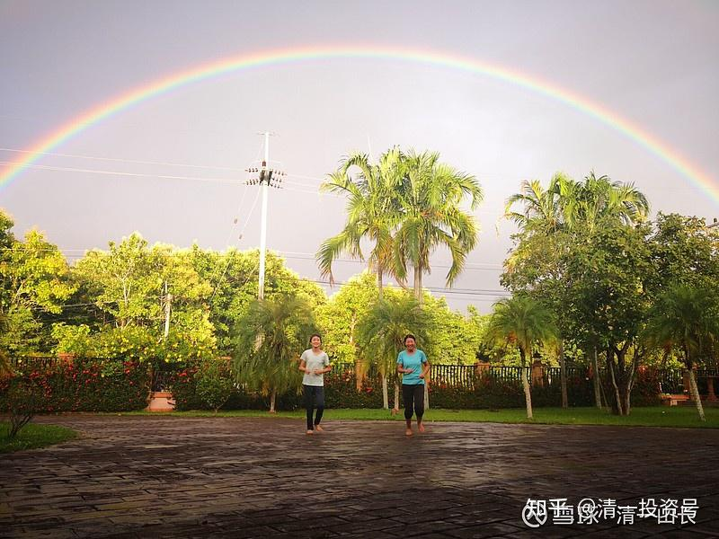

[原雪球专栏](https://zhuanlan.zhihu.com/p/547312901/edit)[84篇.毛姆：我用尽了全力，过着平凡的一生](http://link.zhihu.com/?target=https%3A//xueqiu.com/9310099567/163300530)

[清一山长](http://link.zhihu.com/?target=https%3A//xueqiu.com/9310099567/column)2020年11月14日

什么是成熟社会？就是你看到的这个样子——日本版的《人生七年》。

微信[网页链接](http://link.zhihu.com/?target=https%3A//mp.weixin.qq.com/s%3F__biz%3DMzU1MDM5OTIxMA%3D%3D%26mid%3D2247494281%26idx%3D1%26sn%3D886bbd993ffe2a789ba138d6efc6b4bb%26chksm%3Dfba3970cccd41e1a36b137870c33856ff74e689c478939a90cae3d2da45f68ee7c0473540f25%26scene%3D132%23wechat_redirect)：

[28年追踪13个孩子，结果扎心了: 如果不出意外，你的孩子终将平凡](http://link.zhihu.com/?target=https%3A//mp.weixin.qq.com/s/EMm9ogaICXj3Z70ZrZECdw)

[https://mp.weixin.qq.com/s/EMm9ogaICXj3Z70ZrZECdw](http://link.zhihu.com/?target=https%3A//mp.weixin.qq.com/s/EMm9ogaICXj3Z70ZrZECdw)。

当然，**[原版英国的《人生七年》（《7 up》）](http://link.zhihu.com/?target=https%3A//zhidao.baidu.com/question/182681043881990924.html%3Fqbl)**也一样。这种社会高度成熟化之后，下一代的机会，是很少的，比我们这一代要少很多机会的。跟你过去40年看到的机会不断涌出来，是完全不一样的场景。未来是一个令人窒息的时代。**“机会”对普通人家来说，是一种很难见到的稀有物！**

用一句话可以形容我们下一代必然面临的局面：**“我用尽了全力，过着平凡的一生”。**

我为了让自己的儿女有更多的机会，走了一条少有人走的教育路！以三语突破为标志，短期内实现国际超越。在大多数国人，都在中国华山一条路上，死死打拼中国的高考，以及少数的中国人——他们钱多、人傻，自以为有品味的人，用大把金钱来堆“国际学校梦幻”时，我们开辟了“三国外语教育”和“精英教育”。其实理由很简单：**国内的高考，绝对是红海**。孩子再优秀，再拼命，也显不出你有多少机会来。每年9000万考生，你去跟他们拼命。孩子太可怜了，要玩命才行。这不是傻瓜吗？至于你们**用钱去堆英美名校，说白了，真是钱多人傻！**因为，英美国家的教育，也是红海一片，且机会少少：因为**英美教育是国际红海市场！全世界的学生，都在死拼这个市场，成本巨高，回报超低**。这个市场，你能有多大的胜率考上名校？而且英美留学毕业后，更悲催的是：英美国家自己都没啥工作机会，怎么可能给你这个外国人留岗位？你的孩子，必须比本国人强很多才有机会留下来干一份苦巴巴的工作。你想回中国找事做？面对大把的985名校生，本土文化优势。你一个不洋不土的海龟，现在谁把你当回事呀？以为中企跟你一样崇洋吗？这回夹生了吧？也许，家长只好继续让孩子回家，养起来啃老到底！

但是，你并不是只有两种选择，其实还有第三条道路可以走。机会特别多，而且成本还超低。比国内拼学区房要廉价得多，更比拼国际学校要优惠得多。几万元一年，就可以上三语国家排名前三名的大学了。现在**全世界最急需的人才，就是三国语言人才，善于沟通交流的人才**。我们清迈的几个学生，正在给中国电建的中方人员培训泰语。一大群985名校毕业的项目经理，跟几个14-15岁的小女生学语言，当学生。这镜头，想不到吧？因为他们太缺语言沟通人才了。他们英语人才不缺，一抓一大把。泰语人才也不缺，泰国有大把。可是能够英语、泰语、汉语都通的人，他们最需要，但又实在太缺了。因为根本没有学校培养这种人出来。泰国的泰语专业，培养的中国大学生，他们也不满意。所以，真正的三语人才，在中国的世界五百强企业里，要找个工作，比985大学毕业生要容易得多，还更容易进入管理层。我相信泰国的企业，甚至英美国家的企业，也一样稀缺这种多国语言人才。所以，三语多国语言人才，是可以在全世界很容易找到好工作的群体！就因为这是一个“蓝海教育”项目。**现在全中国可能就只有一家三语学校，就是我们！每年只有几十个学生毕业。**这么少的人，这么多的需求，将来是他们来挑工作，挑岗位。而不是您在日本版《人生七年》中看到的这样子——拼死了力气，也找不到一个适合的工作。其中东京出生，家长助力，上各种培训班，从小一路名校，刻苦学习过来的学生，最终只能去当空姐！过几年，航空公司破产了，还失业了。想当编辑的学生，却只能去当销售员。

您想知道我们是怎样培养三语多国语言特长生，进入世界职场蓝海的吗？请点击链接：

微信[网页链接](http://link.zhihu.com/?target=https%3A//mp.weixin.qq.com/s%3F__biz%3DMzAxNzk5NjIzOA%3D%3D%26mid%3D2247490599%26idx%3D1%26sn%3D4400b38834664b56b233c858ce399ace%26chksm%3D9bdc5c86acabd5900dee8de15b3a83560e599ddf0674245fe27ada9f45404dfec85f1c4ca1ed%26mpshare%3D1%26scene%3D23%26srcid%3D1114FE4uxwdHrcxdBHjxqrk8%26sharer_sharetime%3D1605362439325%26sharer_shareid%3D06adbde58d2d402caf6799da5510cf06%2523rd)：[【示范班今日明师荟】陈静老师主讲：谁希望你成为精英？](http://link.zhihu.com/?target=https%3A//mp.weixin.qq.com/s/NY_nTqzFotO3LRb_P4Ljpg)

[https://mp.weixin.qq.com/s/NY_nTqzFotO3LRb_P4Ljpg](http://link.zhihu.com/?target=https%3A//mp.weixin.qq.com/s/NY_nTqzFotO3LRb_P4Ljpg)

我开设的**示范班直播，只此一家，别无分店。只此一次，示范玩三年就停止示范了**。您最好多关注学习。学的越晚，你失去的机会越多。信不信由你。十年前不信我的人，都亏得恨不得重新再生一回。

三语学校的介绍视频：哔哩哔哩[网页链接](http://link.zhihu.com/?target=https%3A//www.bilibili.com/video/BV17E411p7Eb/%3Fspm_id_from%3D333.788.videocard.0)：

[三语学校【中国第一学校】让普通学生成为天才！](http://link.zhihu.com/?target=https%3A//www.bilibili.com/video/BV17E411p7Eb/)

[https://www.bilibili.com/video/BV17E411p7Eb/](http://link.zhihu.com/?target=https%3A//www.bilibili.com/video/BV17E411p7Eb/)

新的产品，刚推出来，给大家免费品尝。试吃三年都没问题。但各位别真指望我会一直做示范的。不可能连续做十年、二十年示范教育的。各位想要这种最先进的教育，可以自己跟随一起学习。不想要的，就算了，就去你们的红海，参与竞争吧！中国高考、美国高考都可以去参加。我们不玩你们的游戏，但中国的985名校，美国的排名50名之前的名校，我们的学生，都可以随便进的。因为我们选择的跳板不一样。现在就有大学要免试推荐入学。但孩子们瞄准的是世界名校。我们的重点是三语（英语、汉语之外的任何一国的语言，三语均强的学校，您能找到第二所吗？

**参考链接：**

[这就是今日学堂](http://link.zhihu.com/?target=https%3A//space.bilibili.com/487498588/channel/series)

[2012年今日学堂](http://link.zhihu.com/?target=https%3A//www.bilibili.com/video/BV193411178W)

[清一投资号：36篇.15岁上名牌大学 VS 99%的大学都不值得上！](https://zhuanlan.zhihu.com/p/545439129)

[清一投资号：23篇.教育是分层的：底层应试教育，中层素质教育！](https://zhuanlan.zhihu.com/p/537522662)

[清一投资号：14篇.中国人用一年学完美国K12课程，骗子还是疯子？](https://zhuanlan.zhihu.com/p/537055255)
