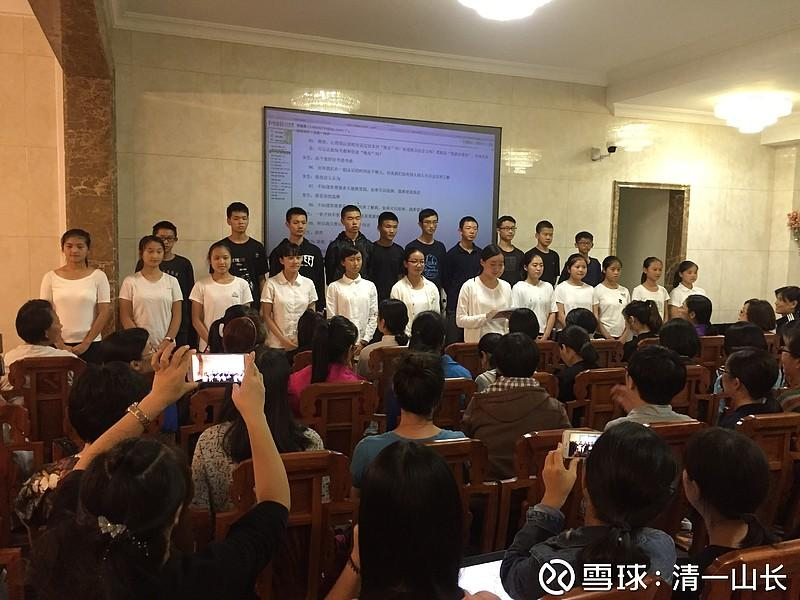
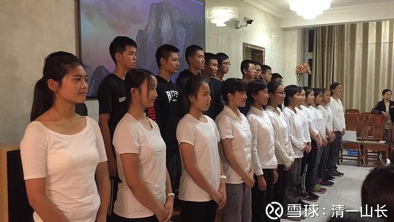
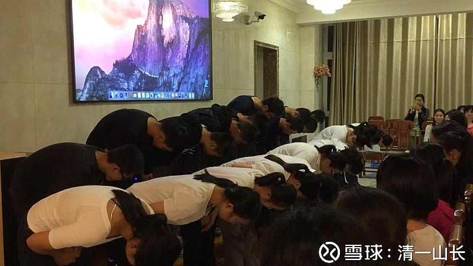

**原雪球专栏4篇.[今天教师节，我公开收礼、索礼！](http://link.zhihu.com/?target=https%3A//xueqiu.com/9310099567/92107434)**

**[山长 清一](https://www.zhihu.com/people/shan-chang-qing-yi)** **2017年10月4日**

[20170912一份特殊的教师节礼单_哔哩哔哩_bilibili](http://link.zhihu.com/?target=https%3A//www.bilibili.com/video/BV1Kq4y1r7u7/)

今天教师节，我收到了一份特别的礼单，也公开向学生索礼了。不知道会不会因为我太贪心，被世人鄙视一通。[大笑]

**

**

照片中站着的这20多个年轻人，是我开的清一书院和清一商学院的学生（是我个人开办的小小私塾，合法的喔！是在工商局正式注册了的非学历教育培训机构，就是不能发文凭，可以发奖状、结业证书等。反正孩子们也不在乎文凭）。最前面的女生，是她们的代表（师姐），正在当众念给我的礼单，“公开行贿”。

家长现场报道小记：今晚，清一山长的成人课程结束的时候已经九点多了，清一书院的学生秘密策划了一份“教师节礼单”，在课程结束时，请山长到台下接受他们的礼物：只见23个孩子齐刷刷站到前台（他们代表着全体29个学生，其他学生正在外地实习），让全体学员见证他们的“公众承诺”：一年的成长计划。

学生们说，“山长......我们想向您表达深深地感谢，但认为仅仅是口头上的表达，并不足以表达我们的感恩。物质上的感谢，也并不是您真正需要的，更不能与您对我们精神上的帮助相匹配......我们决定借助这次机会，公开承诺我们这一年的目标，也请各位学员见证我们的目标实现！”

礼单包括——

1、百人组手战17人（一人作为擂主，要在一天内，接受对手们一百场的实战擂台比赛）；

2、三百人组手战2人（一人当擂主，要在两天内，接受三百场人次的挑战赛，极限运动）；

3、取得正式突破班带班资格，成为合格的2.0老师2人（4个月突破英语课程的带班教师）；

4、学人班团队考入清一书院；

5、成为能够正式指导书院的教师1人（说明：要负责执行相当于研究生导师的工作）；

6、获得实习带班资格8人（说明：英语4个月突破班的实习教师，通过后就可以正式带班做老师）；

7、具有独立投资能力3人（商学院学生的任务）；

8、穷游徒步半年1人（从乌鲁木齐徒步走到云南昆明，每天不超过20元生活费）。

以上是清一书院、清一商学院、学人班全体学生送给山长的教师节礼物。他们也借今晚的场合公开发愿：在接下来的一年里，将会尽自己最大的努力，一步一步实现这些目标！

**

**

我作为教师，居然还想要更多的礼物……也不怕人笑话！

即使我已经收到了孩子们的这份礼物，但我作为教师，贪心更大一些，还嫌她们的“礼单”不够重。就当着来自全国各地的家长们，公开向自己的学生索礼了。我现场对学生提要求，要求她们要在一年内，去参加国家体委举办的全国武术比赛，要定指标，给我拿回两个全国武术比赛的集体一等奖奖牌；还要拿到两个全国个人武术冠军、两个全国个人武术亚军、两个全国武术季军、十个以上的个人一等奖，还有二等奖、三等奖若干，至少要有三人，必须拿到国家颁发的“武术专业教练员资格证”。我问她们拿不拿得出来这份礼单送给我？小家伙们都信心满满地说：“没问题！拿得到！”

我的回话：“小家伙们挺有点子的，给了在场的所有人一个意外的惊喜。”**送礼，就应该送有价值的礼物给值得尊重的人。**

我认为，教师节学生送给教师的礼物，**如果是钱物等，几乎就是对教师的侮辱。这种所谓的“礼物”，把崇高的教师职业荣誉，用这种低级的物质交换活动，把教师贬低成一个精神匮乏的乞丐了。**

**真正的教师，不期待钱物的回报，不期待额外的物质回报，只期待“得英才而教之”；只期待学生们用优异的成绩和表现，来荣耀自己尊重的教师；用不断的超越自我，来表达对老师的真诚热爱。**希望今后清粉、国人都学会真正的“送礼”，不是送一点物质来贿赂自己尊重的老师，也不是说几句空话来哄哄老师开心，而是**用优异的表现，用荣誉自己的老师来作为礼物。这才是真正的送礼。**教师可以大大方方地公开要礼物，学生愿意诚心诚意地送礼物，一切都是“明牌”。这就是我们清一教育圈的教师节礼物单！估计是全国独一无二的教师节礼物。

**

**

**评论回复：**

**[记寞](http://link.zhihu.com/?target=https%3A//xueqiu.com/3220114259)回复[清一山长](http://link.zhihu.com/?target=https%3A//xueqiu.com/9310099567)**

清黑们颤抖吧！你们再黑也阻挡不了山长弟子的强大，不用多久，他们就会像阿里巴巴一样会让很多人睡不着觉，很多的有关部门将发生质的改变。

**[清一山长](http://link.zhihu.com/?target=https%3A//xueqiu.com/9310099567)[2017-09-11 09:15](http://link.zhihu.com/?target=https%3A//xueqiu.com/9310099567/92114135)回复[记寞](http://link.zhihu.com/?target=https%3A//xueqiu.com/3220114259)：**

别紧张，我的学生，没有阿里巴巴们可怕。她们不是让很多人睡不着觉的可怕的“竞争对手”，而是**最优雅的服务家庭和社会的人才。**目前，我有几个年龄大一点的（18岁）的女弟子，因为她们出色的思维和做事的能力，文采、武功均有过人之处，已经获得了外面老板们给予百万年薪来邀约工作。因为她们都可以创造更多的财富和收入，如果愿意去的话。但目前她们都选择了继续学习提高，不去挣钱！所以，老板们只能继续等，然后继续提高薪水的吸引力。

所以，我的学生们不会让人“怕”，只会让人“想”。应该只会成为一些人“思之不得，辗转反侧”的追求对象。

现在已经有很多家长，见到我带的学生后，特别是一些比较自信，家世良好，懂得鉴赏好东西的高端家庭，对自己儿子的要求，是要儿子们一定要把我的女弟子们追上，带回家做老婆。甚至会协助孩子们，愿意用国外留学的学费标准，来申请入读不发文凭的【**清一商学院**】，有家长就告诉我，目的就是离这些优秀的女孩们近一点，方便儿子追上她们。家长会对儿子说：只要追上一个这样的儿媳妇回家，就算完成了家长交给的学业任务。不过这个难度，要比学会价值投资更难[大笑]。我培养的女生，目前身价已经是百万年薪了，她们才不稀罕钱财，更不会喜欢纨绔子弟的，除非这孩子各方面表现都很优秀。

未来**【清一书院】的目标，是培养教育和医学人才，最优秀的学生可免费入读书院，女生居多。**但**【清一商学院】就只收男生，且不提供学费减免**。很多来上夏令营，接触了我带的男生们的女生，原来在体制学校内上学。这些青春期小女生，因此就再也瞧不上周围的小男生了。她们的内心愿望，就是想要嫁给我带的文武双全的男生，她们把我们的男生称为“男神”。估计是这些要求，会让一些人睡不好觉了。但起码是美梦，不是噩梦。[笑]

**[高处看海](http://link.zhihu.com/?target=https%3A//xueqiu.com/4532094386)回复[清一山长](http://link.zhihu.com/?target=https%3A//xueqiu.com/9310099567)**

这个礼收得好。

**[清一山长](http://link.zhihu.com/?target=https%3A//xueqiu.com/9310099567)[2017-09-11 09:21](http://link.zhihu.com/?target=https%3A//xueqiu.com/9310099567/92114678)回复[高处看海](http://link.zhihu.com/?target=https%3A//xueqiu.com/4532094386)**

有机会你来看看这些孩子，给他们一些人生经验的指导。估计你可以在泰国见到她们，今年年底，我给她们的任务是学习和了解泰拳，并用中华太极拳法，与泰拳打几场比赛。

**[明达野老](http://link.zhihu.com/?target=https%3A//xueqiu.com/2029742712)回复[清一山长](http://link.zhihu.com/?target=https%3A//xueqiu.com/9310099567)**

从明师而学之，得英才而教之，天下动心之事莫若之。山长花这么长时间一步步把他们培养到现在，今天收到如此高贵而荣耀的礼物，内心的感动定是无以言表，待到他们功成时，亦是倍感欣慰，也只有用心教好学生的明师，才配得上如此厚礼——买不来的厚礼[很赞]。我花一年时间培养几个优秀的团队成员出来尚且如此，何况山长呢[赞成]。恭喜山长！新教育开始丰收了！硕果累累！

**[清一山长](http://link.zhihu.com/?target=https%3A//xueqiu.com/9310099567)2017-09-11 09:35回复[明达野老](http://link.zhihu.com/?target=https%3A//xueqiu.com/2029742712)**

有机会你来看看这些孩子，给他们一些人生经验的指导。我的商学院学生知道你的[笑]。也许你国庆节可以过来度度假，玩一下。了解一下新教育，也许对你的家庭教育有帮助。

**今年年底，我给我的学生任务，是学习和了解泰拳，并用中华太极拳法，与泰拳打几场比赛。**不知胜负如何，先试试看。[大笑]

**[明达野老](http://link.zhihu.com/?target=https%3A//xueqiu.com/2029742712)2017-09-11 19:29回复[清一山长](http://link.zhihu.com/?target=https%3A//xueqiu.com/9310099567)**

我确实特别喜欢您教的这些孩子，那种朝气和活力是我未曾见过的，尤其是那眼神，我看过照片，比如明蓝，那种从骨子里、心底里渗透出来的能量连我自己都非常艳羡，看一次就让我记住了。之前，我通过一些渠道看过明蓝的一些文章以及百人组手战的集锦视频，文采、武功真是样样了得，这样的教育效果令人佩服！也因此，**我也很希望自己的孩子也能接受到有像您这样的明师带路的新教育，我认为这才是真教育，教人做真人、做强者的教育**，不瞒您说，我从深圳撤出，孩子的教育也是重要因素之一。只是，现在孩子还未满周岁，我暂时脱不开身，等孩子稍大一些，我再找机会去拜访您和您的学生。

BTW：山长总是这样谦虚，有您这样的明师教出来的学生，能力难在我之下，我怕我“招架不住”，交流差不多，指导可不敢。

**[清一山长](http://link.zhihu.com/?target=https%3A//xueqiu.com/9310099567)2017-09-12 22:10回复[明达野老](http://link.zhihu.com/?target=https%3A//xueqiu.com/2029742712)**

你孩子真有福气！未满周岁，你已经足够成熟，在财务上和思想上都做好了充分的准备！[鼓鼓掌]

**[明达野老](http://link.zhihu.com/?target=https%3A//xueqiu.com/2029742712)2017-09-13 08:53回复[清一山长](http://link.zhihu.com/?target=https%3A//xueqiu.com/9310099567)**

山长谬赞。我自己是总觉得不够教孩子的，还得不断精进。庆幸的是，国内还有像您一样拥有先进教育理念的榜样可以借鉴、学习。感恩！

**[StarringLu](http://link.zhihu.com/?target=http%3A//xueqiu.com/n/StarringLu)回复[清一山长](http://link.zhihu.com/?target=https%3A//xueqiu.com/9310099567)**

主讲基本面还是K？

**[清一山长](http://link.zhihu.com/?target=https%3A//xueqiu.com/9310099567)[2017-09-11 09:42](http://link.zhihu.com/?target=https%3A//xueqiu.com/9310099567/92116841)回复[StarringLu](http://link.zhihu.com/?target=http%3A//xueqiu.com/n/StarringLu)**

我的商学院不讲K线，我现在只教V线[大笑]。V比K更容易入门，更容易赚钱。基本上用V线投资，是包赚不赔的。缺点是不够刺激！V线学完，再学PH线。PH线学好，才教K线。直接学K线的，没有V线和PH线基本功的学徒，基本上99.9%的人，只有一个命运：赔钱！[抄底][大笑]

**[一切有道](http://link.zhihu.com/?target=http%3A//xueqiu.com/n/%25E4%25B8%2580%25E5%2588%2587%25E6%259C%2589%25E9%2581%2593)回复[清一山长](http://link.zhihu.com/?target=https%3A//xueqiu.com/9310099567)**

V是value价值线，ph是什么线，没看懂，ph平衡线？[为什么]

**[清一山长](http://link.zhihu.com/?target=https%3A//xueqiu.com/9310099567)[2017-09-11 10:07](http://link.zhihu.com/?target=https%3A//xueqiu.com/9310099567/92119644)回复[一切有道](http://link.zhihu.com/?target=http%3A//xueqiu.com/n/%25E4%25B8%2580%25E5%2588%2587%25E6%259C%2589%25E9%2581%2593)**

Philosophy。it is the core of George Soros我更重视PS线的学习——Psychology[赚大了]

**[念心清净](http://link.zhihu.com/?target=http%3A//xueqiu.com/n/%25E5%25BF%25B5%25E5%25BF%2583%25E6%25B8%2585%25E5%2587%2580)回复[清一山长](http://link.zhihu.com/?target=http%3A//xueqiu.com/n/%25E6%25B8%2585%25E4%25B8%2580%25E5%25B1%25B1%25E9%2595%25BF)**

讲话太过，容易打脸。你宣传学校课程可以，但不可夸大疗效。本来好好的东西经你一说就变味了。

**[清一山长](http://link.zhihu.com/?target=https%3A//xueqiu.com/9310099567)[2017-09-11 13:04](http://link.zhihu.com/?target=https%3A//xueqiu.com/9310099567/92132743)回复[念心清净](http://link.zhihu.com/?target=http%3A//xueqiu.com/n/%25E5%25BF%25B5%25E5%25BF%2583%25E6%25B8%2585%25E5%2587%2580)**

无知才是导致自我打脸的原因。正因为**无知，才会导致你们对自己不知道的东西，就敢于胡乱评价，导致打脸的结果！**因为，在事实面前，被打脸的肯定不是我。

同样，**无知才是某些人账户亏损的原因。**

我培养的18岁学生，就可以拿到有人出价百万的年薪offer，对于你们来说，当然是天方夜谭，所以认为我吹牛。但家长愿意让孩子们不上名牌大学，都拼命要送来我这里读书，难道这些家长比你还傻吗？

如果你们知道，这些学生，是可以去带【**4个月突破任何一门外语**】的学生班，这个培训的价值是多少？你们算得出来吗？告诉你们一个基本的市场价：这个学生四个月10万元培训费。只要每期收20个学生，一年排满后，可以收三个班，一年的学费总收入是600万元。而我的学生，是掌握这种超级突破培训方式的原始“种子老师”，示范老师。不仅可以带班，更可以带一个学校的其他教师跟进这种先进的语言教学法。如果有人给她们一百万元，真的很多吗？聘用她们的老板是傻瓜吗？还是你们更傻？账都不会算？

这些学生还有【**全国武术冠军**】的身份，去给老板当高级保镖也合格；去企业，做培训师也是好手。这些单项（当保镖）等等，可能未必值钱。但是，合在一起，一百万年薪，也没什么稀奇的。

别因为自己无知，就来胡乱判断，胡乱YY（幻想）。**雪球不是我的生源地，我不招雪球上的学生。**想上我的学堂，你们大多数人真付不起学费！可不是给钱就能上的。**我不吹牛，我说到的，就是我做到的。**你们自己吹，吹牛吹马，想吹就自己吹去！

**[念心清净](http://link.zhihu.com/?target=http%3A//xueqiu.com/n/%25E5%25BF%25B5%25E5%25BF%2583%25E6%25B8%2585%25E5%2587%2580)回复[清一山长](http://link.zhihu.com/?target=https%3A//xueqiu.com/9310099567)**

从你讲话的内容看，你的素养差着呢。心浮气躁，看不到什么底蕴。

**[清一山长](http://link.zhihu.com/?target=https%3A//xueqiu.com/9310099567)[2017-09-11 13:44](http://link.zhihu.com/?target=https%3A//xueqiu.com/9310099567/92135796)回复[念心清净](http://link.zhihu.com/?target=http%3A//xueqiu.com/n/%25E5%25BF%25B5%25E5%25BF%2583%25E6%25B8%2585%25E5%2587%2580)**

我刚打赏了这条评论¥1，也推荐给你。您的素养很好[很赞]，您这样说话的水平很高[很赞]，受教了，万分感谢！很抱歉，我素质太差，这里就不留您了，怕污了您眼睛！

**姗雪回复清一山长**

[很赞]顶山长。有太多人，自己过得一塌糊涂，评论别人却头头是道，关键是自己不了解的内容都可以肆意评论。

**[清一山长](http://link.zhihu.com/?target=https%3A//xueqiu.com/9310099567)[2017-09-11 15:54](http://link.zhihu.com/?target=https%3A//xueqiu.com/9310099567/92146919)回复姗雪**

[赞成]。最近这些名字特别高大上的人，叫什么清净、圆融、慈心、喜悦等等，被我拉黑不少。搞不清名字和人怎么差距这么大。**我很讨厌这些表里不一的虚伪之人，让他们离我远点。**不要又要跑来偷偷学我的东西，又要装出一副神圣的样子来教训我。**好东西，不适合给能量级别不够的人。**[大笑]

[http：//blog.sina.com.cn/s/blog_166b3d9790102wnjn.html](http://link.zhihu.com/?target=http%3A//blog.sina.com.cn/s/blog_166b3d9790102wnjn.html)

一份特殊的教师节礼单 此博文包含视频 (2017-09-12 18:23:19)

一份特殊的教师节礼单

这是一份特殊的教师节礼单；

这是一份全国独一无二的教师节礼物！

没有世俗的物质交换；

只有学生对老师的最诚挚的热爱和敬意。

没有华丽的辞藻；

只有平实、朴素的话语，饱含着师生之间最真挚的情感。

没有绚丽的舞台、灯光、服饰；

却演出了感人至深的一幕！

**网友评论摘录：**

[明达野老](http://link.zhihu.com/?target=https%3A//xueqiu.com/2029742712)：

从明师而学之，得英才而教之，天下动心之事莫若之。山长花这么长时间一步步把他们培养到现在，今天收到如此高贵而荣耀的礼物，内心的感动定是无以言表，待到他们功成时，亦是倍感欣慰，也只有用心教好学生的明师，才配得上如此厚礼——买不来的厚礼。我花一年时间培养几个优秀的团队成员出来尚且如此，何况山长呢。恭喜山长！新教育开始丰收了！硕果累累！

我确实特别喜欢您教的这些孩子，那种朝气和活力是我未曾见过的，尤其是那眼神，我看过照片，比如明蓝，那种从骨子里、心底里渗透出来的能量连我自己都非常艳羡，看一次就让我记住了。之前，我通过一些渠道看过明蓝的一些文章以及百人组手战的集锦视频，文采、武功真是样样了得，这样的教育效果令人佩服！也因此，我也很希望自己的孩子也能接受到有像您这样的明师带路的新教育，我认为这才是真教育，教人做真人、做强者的教育。

[寻心归道](http://link.zhihu.com/?target=https%3A//xueqiu.com/5651766814)：

学生送的礼物：不同凡俗，与众不同！山长的索礼，独一无二又风趣幽默：对英才教育用心至深！深深的敬佩，能与这样一群高贵之人生活在同一个时代：非常幸运！

[小朴征波](http://link.zhihu.com/?target=https%3A//xueqiu.com/2266082794)：

读完这篇文章，我突然领悟到什么叫“高贵”和“荣耀”。高就是不断突破自己，贵就是贵的无法用金钱来交换。学生用对自己不断的突破作为给先生的报答和礼物，以使自己配得上作为学生和弟子的称号，留在师门这个平台的伙伴，这就是最大的荣耀。这样的示范，太激励人了！感谢山长和刘老师！感谢这些孩子！

[学徒杉林](http://link.zhihu.com/?target=https%3A//xueqiu.com/1706687072)：

古代徒弟对师父的尊敬，总是让我不太能感觉到。直到遇见山长，这种尊敬和感恩由然而生。才知道遇见真正的老师时，这种感觉是自然和必然的。感恩校长，感恩生命中的明师！

陈静常州：

对老师最好的尊重就是踏踏实实把老师的东西学上身，用不断的自我超越来表达对老师的真诚热爱。百人组手战已经让亲历者十分震撼，这次又让大家震撼了一次，书院的孩子们有太多值得我们学习的地方！

程学才深圳：

在这块精神贫瘠的土地上，一件件只在古代或异域发生过，或只是想象的事情，在清一老师的教导和示范下，一一变成了现实，让我们重新焕发对传统文化和民族的自信心，让我们找到人生的方向和目标。感恩老师，今生无法做老师的弟子，一定做好学生的本分：把老师的东西学到身上并用出来去帮助更多的人。

吴仪英湖州：

昨晚非常荣幸得见证了书院孩子们给山长送与众不同的礼物!非常感动，感动书院学生的自强不息，感动山长对他们的谆谆教导与无私奉献。试问现在社会上还有哪个圈子的老师不会因为家长没打点也同样会尽兴尽职？优秀的体制老师离开学校自办补习班，这又是为何？送礼风已漂洋过海，留学生因为考试不通过，送礼，却遭到唾弃，可怜可悲啊！但至少还有这片净土，还有这么一批用自身成长来回馈老师的学生，还有这么一位为学生成长无私奉献的老师。

严晋业衡水：

看到学生们给山长送的礼物自以及山长“要”的礼物，让我们真正感受到老师的伟大，老师将自己作为学生们成长的基石，无欲无求，只是希望学生比自己站得更高。学生们全力以赴，只为不辜负老师殷切的希望。满满的感动，向令人尊敬的师生们致敬！
