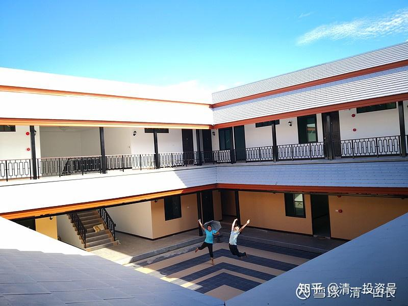

[原雪球专栏](https://zhuanlan.zhihu.com/p/547314723/edit)[86篇.学一门外语：四个月真的够了，还有千万奖学金在等你！](http://link.zhihu.com/?target=https%3A//xueqiu.com/9310099567/163519032%3Fpage%3D8)

[清一山长](http://link.zhihu.com/?target=https%3A//xueqiu.com/9310099567/column) 2020年11月17日

这个视频，四个月学一门外语的成果展示，是一年前发出来的。

哔哩哔哩[网页链接](http://link.zhihu.com/?target=https%3A//www.bilibili.com/video/BV157411e7zY%3Ffrom%3Dsearch%26seid%3D3343009509975071218)：[【今日学堂】第三届免费班结业视频](http://link.zhihu.com/?target=https%3A//www.bilibili.com/video/BV157411e7zY)

[https://www.bilibili.com/video/BV157411e7zY](http://link.zhihu.com/?target=https%3A//www.bilibili.com/video/BV157411e7zY)

当时看了视频，行动起来去积极申请入读的家长，今年，孩子已经坐进了今年的示范班教室里去了，还是全免费的喔！

这些学生，从刚开始的懵懂无知，四个月之后，不仅英语水平大大提升，而且行为举止，精气神，都发生了很大的变化。这就是**新教育——不仅仅给了学生知识和技能，更给了他们健康的身体和积极的心态。**还有其他学校做得更好的吗？希望您能告诉我信息，让我学习进步。

如果你去年放过去了这个宝贵的机会，还有今年的示范班跟读可以选择（为了鼓励孩子们，从今年开始，第四届免费班，改名为“示范班”，因为这个班，对社会全面公开了我们的教学内容和进程。**所有的课程，和学生的学习情况，都通过网络全面直播，传递给全国，甚至全世界**）。

目前，示范班的学生状况，学习进度，是明显的超越了上一届学生的。可能在全国家长们的眼皮底下，他们更努力吧？

示范班网址：哔哩哔哩[网页链接](http://link.zhihu.com/?target=https%3A//space.bilibili.com/487498588/%3Fspm_id_from%3D333.788.b_7265636f5f6c697374.3)

[这就是今日学堂](http://link.zhihu.com/?target=https%3A//space.bilibili.com/487498588)

[https://space.bilibili.com/487498588](http://link.zhihu.com/?target=https%3A//space.bilibili.com/487498588/%3Fspm_id_from%3D333.788.b_7265636f5f6c697374.3)

[这就是今日学堂的个人空间](http://link.zhihu.com/?target=https%3A//space.bilibili.com/487498588/channel/series)

[https://space.bilibili.com/487498588/channel/series](http://link.zhihu.com/?target=https%3A//space.bilibili.com/487498588/channel/series)

如果你继续漫不经心，错过了今年的示范班，你的损失更大了。因为，我将给2021届的示范班学生们，一个超级大的礼物：等他们考上海外知名大学，毕业的时候，就可以用自己的实战成绩，来找我拿一份总价值千万元的奖金（人民币现金）。等这些学生大学毕业了，我每年都拿一份千万奖金出来，奖励其中最优秀的学生。

现在这个时代，孩子们真的太幸运了。只要会读书，不仅仅可以让自己成为优秀生，还可以让自己大学一毕业，就赚到父辈一辈子可能都没赚到的钱。怎样才能得到呢？就不多说了。示范班的学生才应该知道的。你们外围的人，知道了也没用。学生们正在跃跃欲试，都想去争取这个荣誉，还有一笔清北学子都无法想象的“大学毕业奖金”！（现在开始，每一年进入新教育的每一届学生，都有希望喔！预期将连续颁发十年。大家加油）

感谢中国的资本市场，给了我足够多的资本回报，可以让我轻松地来玩这个好玩的教育游戏：我可以豪一把，**用钱来买一些金钱买不到的宝贵东西，为我们国家的教育，买来国际荣誉和尊严，我认为这就是我能够让金钱发挥的，最大的价值所在！**

**评论回复：**

[@北海之心](http://link.zhihu.com/?target=https%3A//xueqiu.com/u/9254745939)回复[@清一山长](http://link.zhihu.com/?target=http%3A//xueqiu.com/n/%25E6%25B8%2585%25E4%25B8%2580%25E5%25B1%25B1%25E9%2595%25BF)：刚从北大毕业，我觉得我可以花几年回去重念一遍，拿这个奖。[加油][加油]

[清一山长](http://link.zhihu.com/?target=https%3A//xueqiu.com/9310099567)[2020-11-17 18:54](http://link.zhihu.com/?target=https%3A//xueqiu.com/9310099567/163519930)回复[@北海之心](http://link.zhihu.com/?target=https%3A//xueqiu.com/u/9254745939)：您去看示范班链接里面。这些出来讲每周一次的“今日明师荟”的年轻教师们，不是校长级的，只是普通的带班老师，20来岁的年轻教师们，如明仪、明颖、雨晴等。只要您的讲课水平、能力，能够超越她们，你有信心获得这些学生们的尊重和喜爱，您能让学生愿意放弃这些年轻的老师带课，而是选您做她们的带班老师，您就有了参赛的希望。我们学校的教师，全都是这样上任的。多少名校毕业生，败在她们的手下！您认为:你已经从北大毕业了。北大教给您的知识储备，够不够你来参与这种教学PK。教学生们一堂能够让孩子们心服口服，积极上进的课程？**教他们看清社会现实，看清社会的游戏规则，成为赢家的道理**？如果您真有信心，欢迎您来试一试！

[@北海之心](http://link.zhihu.com/?target=https%3A//xueqiu.com/u/9254745939)回复[@清一山长](http://link.zhihu.com/?target=http%3A//xueqiu.com/n/%25E6%25B8%2585%25E4%25B8%2580%25E5%25B1%25B1%25E9%2595%25BF)：谢谢前辈的回复，赞赏您的做的事情。术业有专攻，我现在在互联网行业挺好的，对于教学方法也没有研究。我上条回复更多的是开个玩笑，表明您办的活动非常有吸引力[牛][牛][牛]

[@复利极限价值回归](http://link.zhihu.com/?target=http%3A//xueqiu.com/n/%25E5%25A4%258D%25E5%2588%25A9%25E6%259E%2581%25E9%2599%2590%25E4%25BB%25B7%25E5%2580%25BC%25E5%259B%259E%25E5%25BD%2592)回复[@清一山长](http://link.zhihu.com/?target=http%3A//xueqiu.com/n/%25E6%25B8%2585%25E4%25B8%2580%25E5%25B1%25B1%25E9%2595%25BF)：考名校学外语还是不够的。

[@清一山长](http://link.zhihu.com/?target=http%3A//xueqiu.com/n/%25E6%25B8%2585%25E4%25B8%2580%25E5%25B1%25B1%25E9%2595%25BF)2020-11-17 19:17回复[@复利极限价值回归](http://link.zhihu.com/?target=http%3A//xueqiu.com/n/%25E5%25A4%258D%25E5%2588%25A9%25E6%259E%2581%25E9%2599%2590%25E4%25BB%25B7%25E5%2580%25BC%25E5%259B%259E%25E5%25BD%2592)：的确不够。问题是学生18岁之前，还有很多的“四个月”。还可以玩四个月学完12年数学等等（已经玩过了）。中小学，有多少学科来这样玩？似乎您只看“这四个月”了。难道您就只会炒短线吗？您这点认知局限，不够复利原则的。[俏皮]

参考链接：

[清一投资号：2篇.清华钱颖一：人工智能将使中国教育优势荡然无存](https://zhuanlan.zhihu.com/p/535092937)

[清一投资号：14篇.中国人用一年学完美国K12课程，骗子还是疯子？](https://zhuanlan.zhihu.com/p/537055255)

[清一投资号：23篇.教育是分层的：底层应试教育，中层素质教育！](https://zhuanlan.zhihu.com/p/537522662)

[清一投资号：26篇.国际今日——做最好的中国人](https://zhuanlan.zhihu.com/p/537994917)

[清一投资号：41篇.亲历者自述：两种教育模式下的教师与学生的区别](https://zhuanlan.zhihu.com/p/545608877)

[清一投资号：44篇.史上最牛外国语学校：免费课程分享直播开启](https://zhuanlan.zhihu.com/p/546933970)

[清一投资号：46篇.新教育送给中国人的礼物——中国公主](https://zhuanlan.zhihu.com/p/553173076)

[清一投资号：47篇.如何用三年学完十二年的课程？](https://zhuanlan.zhihu.com/p/547313287)
