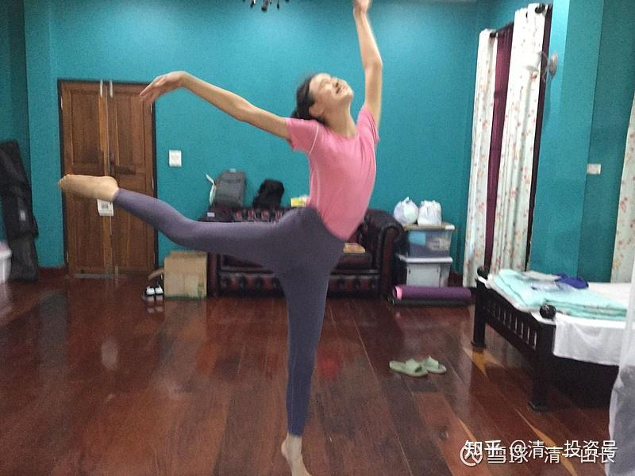

[原雪球专栏](https://zhuanlan.zhihu.com/p/549127495/edit)91篇.两校PK请您裁判：学了三个月的外语能用吗？

清一山长 2020年12月6日

只学了三个多月的外语，是啥水平？能用吗？请您来当裁判！

我创立的[今日学堂](http://link.zhihu.com/?target=https%3A//space.bilibili.com/487498588/channel/series)，成立18年来，一直没有像样的竞争对手。第二名还在用望远镜才能看见的地方苦苦追赶。“一家独秀”的局面，是很多人的追求。但我对此很担忧：祸福相依。**今日的卓越领先，就是明天沉沦落后的诱因！**

老子说：“祸莫大于无敌！”一花独秀的局面，如果继续下去，[今日学堂](http://link.zhihu.com/?target=https%3A//space.bilibili.com/487498588/channel/series)的师生、家长，都会过于骄傲自满，不思进取的。这是新教育最大的灾祸。为了让[新教育的顶级示范学校](http://link.zhihu.com/?target=https%3A//space.bilibili.com/487498588/channel/series)，保持不断进取，自强不息的精神，真正的成为其他学堂的榜样，成为[中国教育](http://link.zhihu.com/?target=https%3A//xueqiu.com/S/CSI931456%3Ffrom%3Dstatus_stock_match)的榜样，我只好在2019年7月，重新创立了一家新的学堂——清一学塾。来和今日正面的竞争。我给两边校长都出主意，帮忙做军师，鼓励他们“内斗”。大家就像牛津、剑桥一样，通过公平的决斗，来让自己变得更优秀。

为了保证新创学堂师资不至于太差，竞争一开始，就处于不利地位，两名今日自己培养出来的学生，后留校任教的2.0教师（其中包括我的弟子明仪在内），决心与自己的母校一决高下！她们将在我原来武汉大学教书时候的老学生——陈静校长的带领下，决心成为[今日学堂](http://link.zhihu.com/?target=https%3A//space.bilibili.com/487498588/channel/series)最强劲的对手（为了让今日不失血过多，其他的原班人马都没有动）。现在的清一学塾，已经拥有与今日相同规模和品质的师资队伍和同样优秀的学生群体，已经成为了今日最强大的竞争对手。学生和教师们，在生源争夺，教学品质，以及教学思维上，全面进行最严酷的竞争。因为我的要求是：**竞争十年为期。如果五年内，连续落败的一方，全员就地解散。由获胜方派出新的校长，从零开始再创新校，继续两校的PK竞争**。也就是说：**失败的一方，所有的教师，连校长在内，全部解散和辞退，无一例外**。由获胜方派遣新校长接管，重新选任教师，重新开始新的一轮竞争。

显然，这是一场“自讨苦吃”的PK，要比牛津、剑桥的PK结果要残酷得多，在中国，这样做的学校，可能没有第二家吧？我相信，**如果我们自己抽自己，别人就抽不了我们。干嘛让社会来抽我们？我们选择自己抽自己！**

两校师生们，除了少数不喜欢这种激烈的PK教育环境，而选择自动退出的教师外，其他学生和教师，都积极投入了这场“看不见硝烟的战争”。特别是两校校长，在“人才战”上，都花费了巨大的心力，试图为本校招募最优秀的教师和学生。目前已经有两届学生，正在参与这种激烈的竞争，双方互有胜负。明年7月，将招收第三批互相竞争的班级。

最新一场的竞争，是创新语言学习方式竞争：我们让学生们用表演电影的方式来学习一门新的语言。本学期，两校的第一批学生，在成功学完英语后，开始第三语言的学习。女塾学生，选择的是泰语（另外两校还有西语班也要参与PK）。学习三个多月后，双方各拍一部小语种微电影，学生们自己写剧本，自己当导演，自己当演员，背台词，自己进行后期的视频编辑。老师仅仅是场外指导。

为了公正，双方教师都不参加评分。双方的PK，请您来当裁判！您认为两校学生，哪一方拍的电影和表演您更喜欢？您就给他们点个赞。我们通过一周内得到点赞的视频的多少，来判定这次双方PK的胜负！[献花花]

国际今日自导自演自编的电影：

[公主小剧场#2：泰语版《海洋奇缘》by国际今日](http://link.zhihu.com/?target=https%3A//www.bilibili.com/video/BV1Vi4y157fB)

哔哩哔哩[网页链接](http://link.zhihu.com/?target=https%3A//www.bilibili.com/video/BV1Vi4y157fB/%3Fspm_id_from%3D333.788.videocard.0)：[https://www.bilibili.com/video/BV1Vi4y157fB](http://link.zhihu.com/?target=https%3A//www.bilibili.com/video/BV1Vi4y157fB)

清一学塾自编自导自演的微电影：

[公主小剧场#1：泰语版《灰姑娘》by清一学塾](http://link.zhihu.com/?target=https%3A//www.bilibili.com/video/BV1vZ4y1g78p)

哔哩哔哩[网页链接](http://link.zhihu.com/?target=https%3A//www.bilibili.com/video/BV1vZ4y1g78p/%3Fspm_id_from%3D333.788.videocard.0)：[https://www.bilibili.com/video/BV1vZ4y1g78p](http://link.zhihu.com/?target=https%3A//www.bilibili.com/video/BV1vZ4y1g78p)

对了，这些学生们，就是“拿千万入职金的未来教师，正在做什么？”一文中的主角。她们18岁以后的去向，是去泰国的一流大学，用泰语弘扬中华教育和文化，用优异的表现，用自己的魅力，征服泰国的上流社会。您看她们会成功吗？会拿到千万大奖吗？

**参考链接：**

[这就是今日学堂](http://link.zhihu.com/?target=https%3A//space.bilibili.com/487498588/channel/series)

[2012年今日学堂](http://link.zhihu.com/?target=https%3A//www.bilibili.com/video/BV193411178W)

[这就是今日学堂的明师荟](http://link.zhihu.com/?target=https%3A//space.bilibili.com/487498588/channel/collectiondetail%3Fsid%3D55359)
