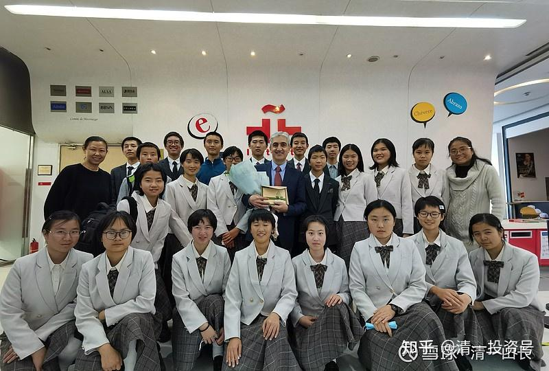

原雪球专栏**98-2篇.2021年度示范班（免费班）招生 入学须知**

清一山长 2021年4月2日

过去的2020年，我拿钱出来，总共支持了87位学生来[今日学堂](http://link.zhihu.com/?target=https%3A//space.bilibili.com/487498588/channel/series)上学。免学费，免生活费，免住宿费、伙食费。这些孩子，在[今日学堂](http://link.zhihu.com/?target=https%3A//space.bilibili.com/487498588/channel/series)获得了不一样的教育体验。为了避免家长们担心，我们会教什么不合适的内容，**我们就把示范班的教学内容，全都公开出来了，面对全社会的检验。绝对是正能量的**。至今没人对我们的教学内容有啥负面评价。有的只是惊叹：孩子们这么小，就学到了很多大人都不知道的知识，很羡慕这批孩子好运气。

其实，我们为每一个中国人都提供了一样的入学机会。我们每年的示范班（免费班）学生，都是公开接受来自全国的申请的，不走后门，不搞关系。今年的入学申请须知，可以直接查看这个链接就行了。[网页链接](http://link.zhihu.com/?target=https%3A//www.bilibili.com/video/BV1xf4y1k7Ld)

[https://www.bilibili.com/video/BV1xf4y1k7Ld](http://link.zhihu.com/?target=https%3A//www.bilibili.com/video/BV1xf4y1k7Ld)

如果您的孩子符合入学要求，欢迎申请入读[今日学堂](http://link.zhihu.com/?target=https%3A//space.bilibili.com/487498588/channel/series)示范班！

另外：

我开办的清一大学，也提供免费供吃、供住、供玩的机会，也同样欢迎您申请入读。难点就是：如果您11岁没有就读[今日学堂](http://link.zhihu.com/?target=https%3A//space.bilibili.com/487498588/channel/series)，没有用新教育的方式来学习的话，到了15岁，您是不太可能**达到美国前30名大学的入学成绩要求**的。而这个成绩标准，**是清一大学最基本的入学要求**。除了成绩标配外，还要外加考察您的运动能力和个人心理素质考评。如果您不是今日系新教育学堂出身，而是靠体制教育来拼的话，拼死了也不太可能符合这些要求。

当然，如果你跟随我们的示范班课程，在家上学来跟随学习，亦步亦趋地跟随不舍，我认为还是很有可能考上的。目前，似乎有很多家长正在这样做。示范班课程公布以来，跟随学习的人越来越多。

幸运的是：清一大学不限学位和人数，符合条件和要求的学生多，我们就多录取一些。人数少，我们就少录取一点。**我们首要任务是保证品质，这是一所一起步就按世界顶尖大学标准来办学的私人大学，维持生源品质，以及教学品质，是必须的。我们必须维持水准，可以不赚钱，但不能降低要求。**

不幸的是：示范班是有人数限制的，每年32个人！（今年老师要求我多给了3个名额，达到了35人，不过有三人退学了，依然是32人）

以下是清一大学的学生展示。你们看这些大学少年班的学生是什么水平的？为什么中国名牌大学的教授，甚至北大的教授，都只能承认：中国顶尖大学相同专业的大学生跟他们相比，“只能被吊打”？奥秘何在？请自行研究，以下是在1400个嘉宾面前的公开展示的直播回放视频，是没法含糊的。

据说，网友们最惊讶的就是：这个才开办一年多的大学，居然就**要求拿到B2证书才能拿清一大学毕业证**？这一条就超过了中国所有的大学。这个证书，很多名牌大学语言专业四年都未必能通过。但这只是标配罢了。我们最优秀的学生，是可以拿到C1甚至C2证书的。这两个证书，甚至对本国人都有难度，一般水平的学生，都考不到这个成绩的。

**一：清一大学少年班学生示范：如何用一年学完大学六年的西语专业课程？并达到优等生程度？**

**[网页链接](http://link.zhihu.com/?target=https%3A//www.bilibili.com/video/BV1vA411H7n3/)：[https://www.bilibili.com/video/BV1vA411H7n3/](http://link.zhihu.com/?target=https%3A//www.bilibili.com/video/BV1vA411H7n3/)**

**二：清一大学的办学特色与未来展望**

**[网页链接](http://link.zhihu.com/?target=https%3A//www.bilibili.com/video/BV13K411u7Sr)：[https://www.bilibili.com/video/BV13K411u7Sr](http://link.zhihu.com/?target=https%3A//www.bilibili.com/video/BV13K411u7Sr)**

**二：清一大学少年班莎士比亚戏剧表演《威尼斯商人》**

**[网页链接](http://link.zhihu.com/?target=https%3A//www.bilibili.com/video/BV1kh41127CC/)：[https://www.bilibili.com/video/BV1kh41127CC/](http://link.zhihu.com/?target=https%3A//www.bilibili.com/video/BV1kh41127CC/)**

**四：清一大学最宝贵的课程是什么？**

**[网页链接](http://link.zhihu.com/?target=https%3A//www.bilibili.com/video/BV1Vr4y1M7KA)：[https://www.bilibili.com/video/BV1Vr4y1M7KA](http://link.zhihu.com/?target=https%3A//www.bilibili.com/video/BV1Vr4y1M7KA)**

**清一大学**首届西语专业本科少年班学生，**平均年龄16岁**，在北京塞万提斯学院的考试现场与院长的集体合照。（成绩说明：**西语班23人，学习13个月后正式参加考试。取得C2证书两名，C1证书8名，12人获得B2证书，一人达到B1水平**），这个班级成绩，绝对秒杀任何中国顶尖外国语言大学。

（以下内容为编者收录）

评论回复：

**aizbfn回复清一山长：**

报名送燕京股票吗？等十年的那种。

**清一山长2021-03-19 10:25回复aizbfn：**

送啤酒多掉档次呀！为了鼓励大家积极申请免费入学国际今日的机会，准备安排让清一教育基金会推出“只要报名申请入学今日，就送一手茅台股票，人人有份”的有奖促学活动。敬请期待[献花花]。（各位起码要先期待我赚到了这笔足够用来发奖金的钱，先把茅台股票买回来了，才能送吧？现在我手上一股（不是一手）茅台都没有，不能放空枪对吧？[俏皮]）

**微笑李海玲回复@清一山长：**

我们家的孩子很幸运，能进入2020的示范班学习，学费全免，还包吃包住，这个班配备最好的师资，给他们进行积极进取的价值观引导，学校有健康乐观的生活环境，还有一群团结互助的伙伴，所有的孩子都发生很大的改变，而我们家的，整个人的状态是上了一个台阶，结业时基金会又送给这批奋进的孩子们，一份大礼包——**星月计划**（聚时一团火，散时满天星），到外围学堂学习的机会，不仅自己继续跟随学习，还能学习如何成为一名经营者，带动引领更多的伙伴一起学习，进入心中最向往的——清一大学，学习如何做最好的中国人。感恩山长、感恩新教育的老师、感恩新教育基金会，让我们大众知道了原来还有一种这样的，以人为本的心教育。[跪了][跪了][跪了]

**清一山长2021-04-02 10:56回复微笑李海玲: **

祝福你们孩子，希望他们15岁都能顺利考上清一大学。

参考链接：

[【清一大学少年班】《威尼斯商人》舞台剧](http://link.zhihu.com/?target=https%3A//www.bilibili.com/video/BV1kh41127CC)

[【清一大学少年班】我们如何在一年中从零突破西语](http://link.zhihu.com/?target=https%3A//www.bilibili.com/video/BV1vA411H7n3/)

[【清一大学少年班】清一大学的办学特色与未来展望](http://link.zhihu.com/?target=https%3A//www.bilibili.com/video/BV13K411u7Sr)

[【清一大学少年班】信念与思维的塑造——清一大学最宝贵的课程](http://link.zhihu.com/?target=https%3A//www.bilibili.com/video/BV1Vr4y1M7KA)

[【清一大学少年班】走进我们的日常生活](http://link.zhihu.com/?target=https%3A//www.bilibili.com/video/BV1Fi4y1F7uK/)
