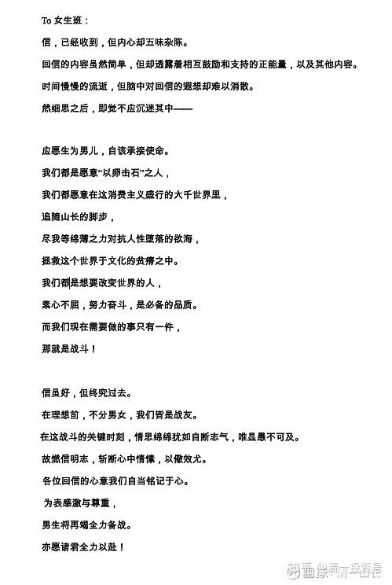

原雪球专栏[102篇.有教“写情书”的学校吗？](http://link.zhihu.com/?target=https%3A//xueqiu.com/9310099567/170240538)

清一山长 2021年1月28日

今天一上午，我都在上课，教学生们“写情书”。示范的教材，是一部汤姆·汉克斯主演的电影《电子情书》。今天已经上第三次了，才上到102分钟。这部电影，是现代版的《傲慢与偏见》，电子时代，媒体和工具变化了，但我们的情感，其实依然是一样的。**我们依然希望在人海中，找到自己心仪的另一半。而能够表达出自己心灵层次的，就是书面文字了。与语言和视频相比，它具有更深的思维层次，也许更能表达我们心灵深处的价值观和身份！**所以，**两性之间，如果能够用文字来传情，将来相处，才不会“无语”。**

现在的人，可惜了，已经不会言语传情了，只会有“吃喝玩乐”交往法。我们也许可以看到你的交际能力，但我们很难窥见你的心灵深度。这对于评判一个人是否可以成为婚姻对象，是远远不够的。婚后的男男女女，往往无趣到各自刷手机、看电视。我们已经失去了“交往互动"的能力，我们已经读不懂别人的心。

**更不幸的是：也许我们自己就没有心！没有心的伴侣，是不可能有幸福的。只有“快感”以及“失落感”，强烈的孤独感**。所以我们都在刷手机去看别人的生活。我们都在寻寻觅觅，凄凄惨惨戚戚，现在的离婚率这么高，为啥？很多人结婚前就没有用过脑子。

现代人类，都是一群自找苦吃的人——大家都是人海中最孤独的沙子！**假如一对恋人，在婚前有较长时间的文字互动、沟通，深度的沟通交流，彼此袒露自己的灵魂和追求**，我相信：这样的伴侣，**离婚率会很低的**。可这个社会太浮躁，什么都追求快餐，于是，传统的婚姻，就已经变成奢侈品了。

太太笑我是个疯老头，带学生们乱玩，居然公开教学生们“写情书”。估计是中国唯一公开教学生们写情书的校长了。发挥了我当年大学时代，做校级文学社社长的才华[笑]。在这群孩子们年仅16～17岁的时候，在其他相应学校的校长们面对高考，“严防死守，禁止早恋”的时候，我们这些也要面对一年后的“国际高考”的学生，让他们面对两性关系，合适吗？会成为当代教育的大笑话吗？会不会严重影响我们的教学成绩？

我还真不知道会不会影响我们学生的毕业成绩。但我认为：如果不在学生们已经进入青春期，很快就要正式谈恋爱之前，我们不教他们如何谈恋爱，如何正常处理两性关系，就等于是让孩子们赤手空拳的上战场，对孩子们是很不负责的。两性关系，是世界上最危险的关系（**刑事案中，杀人比例最高的数据，来自于婚恋的双方**）。**让孩子们学好了两性相处的方式再离开校园，是对孩子们最大的负责和关心**。至于SAT、DELE分数多几分、少几分、高一级、低一级，其实相比起来，真就不那么重要了！如果**[朱海洋](http://link.zhihu.com/?target=https%3A//www.163.com/dy/article/HEA2EDNB055339FF.html)**上过我的这种课程，我相信后来的悲惨故事就不会发生。这都源于我们这个教育体制的僵化、愚昧！（请自行搜索朱海洋案）。

上周布置的作业，就是让清一大学少年班的男生，给少年班的女生们“写情书”。让学生们自己瞄准自己喜欢和欣赏的班上的女同学，写一封情书。有些女生，收到了多封情书。有些女生，一封也没有收到。当然，女生班的带班教师，要教女生们学会优雅地回复男生。不过，为了防止此举导致校园恋情泛滥，本次的情书写作，是采取了“秘密倾慕者"的方式，男生们私密了自己的名字，把信写好后，封在传统的信封里面。让女生班的带班教师转交给信封上注明的女生。如果有多位男生向同一位女生传情，做情书使者的带班教师，就需要标注出ABCD的代号，让女生们有针对性的回复信件。

带班教师告诉我：女生们收到情书高兴了好几天，连其他的老师都跟我说不知道女生这几天为什么这么开心。女生们也一直在跟自己的伙伴一起猜，是谁给自己写的情书。我很高兴地看到这些女生们高高兴兴的样子，**我希望她们在很年轻的时候，就知道自己是值得爱的**。有男生们在远处悄悄地喜欢她们。**将来，她们去国外上大学了，不会对男生的突然求爱而大惊失色，也不会受宠若惊。她们会淡定很多、优雅很多。男生们也能够学会如何表达自己的感情，这对于大多数的中国男人来说，是一个巨大的挑战。**

**写情书，的确是很需要有艺术的，不能心中有啥就说啥。会导致双方没法继续交流的。**我听说一个故事：就是一个女生上大学的时候，倾慕她已久的一个男生，写了一封长长的情书，用一本书做礼物，悄悄送给女生（很久以前的故事，现在应该是送苹果12[大笑]）。这个女生收到一看原来是情书，看都没看完，就把情书上自己的名字撕下来，然后把礼物和信件，当着全班同学的面交回给男生。这下惨了，这男生显然受到重大打击。两人的关系降到冰点。多年之后，女生回想起来，觉得很懊悔：别人对自己有好感，不应该这样“绝情”的，可以不答应求婚，不做女朋友，但不要弄得连做同学都做不了。

其实，就因为我们的学校，没有教学生们如何与异性互相沟通，没有教会她们如何正常的交往，导致本来是很美好的感情，也变成了“敌意”和冷漠。你再喜欢一个异性，也别学阿Q见吴妈一样，上去就说：“我要跟你困觉！”这就是没教养。底层人！

**有修养的人，追女生是很“艺术”和优雅的。他们会慢慢地接近女生，先让女生对自己有好感，等基本上确定不会被拒绝了，才能提出“升级做女朋友”的要求。**我教男生约会女生的方式，绝不是直接上前说：“我要跟你约会。”而是约几个同学朋友一起去玩，让这个心仪女生的同性伙伴邀约他心仪的对象，一起去做一些共同的活动，正常交流。女生如果聪明，自然知道男生的心意，如果下次邀约，女生找理由不肯出来了，就只能放弃了。说明女生委婉地表达不想继续深度的交往，彼此没有公开的表达出来，也不会伤面子。如果女生下一次也愿意一起出来，就说明女生对男主也有好感，愿意进一步交往。等彼此都很熟悉了，也许有一天，你就可以写一封“情书”给她，邀约她升级做女朋友了，以后出去玩，就可以“两人世界”了。

像上面的案例中，男生直接冲上去递交情书，就是找死的货。基本是“直接枪毙”的，还弄得以后连接近的机会都没有。

小女9岁多的时候，去一所泰国学校上学，遇到一个泰国10岁多的同班男生，过节的时候借机给她一封情书和礼物，她有点不知所措，把礼物、信件都带回家来了。我看到了，就恭喜她：“喔，好棒喔！我女儿这么小，就收到男生的情书了，以后你还会收到很多情书的。”小家伙有点恼火：“我才不想理他呢！哼！连我都打不赢。”（刚去上学的时候，这个男生对她有兴趣，跑来“骚扰”她，被她用了一个贴身摔，打倒在地下直叫妈妈。吓得其他调皮的男生，都不敢来惹我们家小姑娘了）。我告诉她：**男生喜欢你，很正常。不是他的罪过，你要优雅的处理。你可以告诉小男生：等你读大学的时候，让他再来追你好了，现在你不想找男朋友。让他先长大再说。**

我相信我女儿上大学的时候，面对异性的追求，会淡定得多。因为她从小就受到了良好的两性关系教育，不会面对这样的处境不知所措、狼狈不堪。没有接受过这种教育的女生，要么傻傻的就答应了第一个追求者，要么对不喜欢的追求者恶言相向。这些不仅仅没有教养，而且会让自己的形象受到打击。因此，男生要学会如何接近自己心仪的女生，女生要学会如何保持距离，不迎不拒。

为了培养清一大学男女生的这种优雅的素质，交流的能力和方法，所以开设了“写情书”课程。以“秘密仰慕者”的身份，写一封信给自己喜欢的女生。这样男生没有公开出来的压力，女生们会在一起跟女伴们讨论这封情书是谁写的。也许等过了几年，他们有一天，真正到了谈婚论嫁的年龄，遇到对方的时候会说：当年的那封情书，是我写的。你猜到了没有？回忆起来。一定是极其浪漫的“少年大学生活”！

可惜的是：**我们的学校，18岁以前，只教他们做考试机器。18岁以后，让他们孤独地面对异性世界，孤独地面对社会，自己孤独的打拼。幸运一些的，有好的结果。更多的人，弄到浑身受伤。更惨的是女子----有些美好的东西，一旦失去就不再回来。**

**年轻时不珍惜的重要的东西，可能以后会给自己带来巨大的妨碍。**现在大都市里面，**很多高级白领女性都变剩女了，不是她们想剩下来，真的是没有人教她们如何处理恋爱、婚姻、家庭、事业、职业！所有的一切，都需要事先规划。K12学到的课本教材内容，对生活来说，基本都是无用的垃圾。**

下面为女生们给男生回信后，男生们讨论的，集体回复女生的信。各位看他们的情书写作水平如何？

上图为女生们给男生回信后，男生们讨论的，集体回复女生的信。各位看他们的情书写作水平如何？[笑]

**To女生班：**

**信，已经收到，但内心却五味杂陈。**

**回信的内容虽然简单，但却透露着相互鼓励和支持的正能量，以及其他内容。时间慢慢的流逝，但脑中对回信的遐想却难以消散。**

**然细思之后，即觉不应沉迷其中——**

**应愿生为男儿，自该承接使命。**

**我们都是愿意“以卵击石”之人，**

**我们都愿意在这消费主义盛行的大千世界里，**

**追随山长的脚步，**

**尽我等绵薄之力对抗人性堕落的欲海，**

**拯救这个世界于文化的贫瘠之中。**

**我们都是想要改变世界的人，**

**素心不屈，努力奋斗，是必备的品质。**

**而我们现在需要做的事只有一件，**

**那就是战斗！**

**信虽好，但终究过去。**

**在理想前，不分男女，我们皆是战友。**

**在这战斗的关键时刻，情思绵绵犹如自断志气，唯显愚不可及。**

**故燃信明志，斩断心中情愫，以儆效尤。**

**各位回信的心意我们自当铭记于心。**

**为表感激与尊重，**

**男生将再竭全力备战。**

**亦愿诸君全力以赴！**

**参考链接：**

[【清一大学少年班】《威尼斯商人》舞台剧](http://link.zhihu.com/?target=https%3A//www.bilibili.com/video/BV1kh41127CC)

[【清一大学少年班】我们如何在一年中从零突破西语](http://link.zhihu.com/?target=https%3A//www.bilibili.com/video/BV1vA411H7n3/)

[【清一大学少年班】清一大学的办学特色与未来展望](http://link.zhihu.com/?target=https%3A//www.bilibili.com/video/BV13K411u7Sr)

[【清一大学少年班】信念与思维的塑造——清一大学最宝贵的课程](http://link.zhihu.com/?target=https%3A//www.bilibili.com/video/BV1Vr4y1M7KA)

[【清一大学少年班】走进我们的日常生活](http://link.zhihu.com/?target=https%3A//www.bilibili.com/video/BV1Fi4y1F7uK/)
