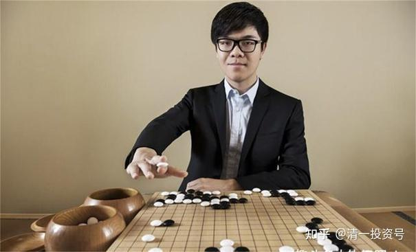

[原雪球专栏](https://zhuanlan.zhihu.com/p/555239151/edit)[106篇.一生的教育规划：用稀缺性原理成为人生赢家！](http://link.zhihu.com/?target=https%3A//xueqiu.com/9310099567/171936396)

清一山长 2021年2月18日

说实话，人与人的天然差别其实很小。**人生的成败，主要在于布局，人生最关键的点，只有几个，走错了，一生就难免平庸了！一旦走错了路，人生就很艰难了。**

**人生**，如同围棋里面的一颗棋子。你的重要性，不是象棋一样，由你的“出身”、职位来决定的，而**是根据你所放的位置是否重要，来决定你的人生地位。**

**人生赢家，就是每一步，都像下围棋一样，要算出这一刻，棋子应该落在何处，才能实现最大价值**。如果你的每一步，都走在当时棋盘上最大价值的地方，最终就一定是棋局的赢家。只有初级玩家，才会忙于跟随对手的步调走，忙于吃棋。高级的赢家，甚至会故意通过弃棋，来获得更大的发展机会。

下棋如此，人生更要“算”。《**孙子兵法**》**有云：“夫未战而庙算胜者，得算多也；未战而庙算不胜者，得算少也。多算胜，少算不胜，而况于无算。”**家长们号称很爱自己的孩子，但你们为孩子算计过未来的发展吗？为您的孩子规划了人生没有？规划少了，都可能失败，何况根本没规划呢？**家长们如果只会盲目地跟随大众，这种父母，就是蠢爹蠢妈！你有多少钱花出去，都买不来好孩子，买不来人生的赢家。**

最近，我每周都在教小女儿下围棋。但我不教她布局、定势、死活等等技术层面的东西，我只让她们跟我很随意的下棋。我让她们9子，然后让她们跟我自由博弈，之后我帮她们总结棋局和人生的道理。她们玩这个游戏很开心，都喜欢跟我玩，自己互相玩，就觉得没劲。跟我玩，虽然很艰难，很危险，但是也很开心。**在玩的过程中，她们懂了很多人生的道理。比如要团队作战，不能孤军深入；要避其锋芒；要乘虚而入；要去对方忽略的地方发展**等等。所以，为了让她们真正地理解围棋，**我刻意的，不去影响她们的下棋思路，不教小女儿围棋技术、定势。不在乎输赢结果，只在乎玩的过程**。不像我当年大学时代，学围棋入门，就是找一堆围棋的书来看，拿高手的棋谱来复盘研究。回想起来很可笑，把自己当专业选手了[滴汗]。

估计全中国，没有人会这样教孩子下棋的。因为我根本就不想培养棋王，更不去吃围棋这碗饭。干嘛去学围棋的技术？我们业余玩家，学学围棋的“道”就好了，玩得开心就行了。老祖宗发明围棋游戏，不是让你们去职场拼搏拿工资和奖金的。走柯洁这条路，太艰难！想学柯洁下好围棋推荐上清华这条路，更艰难，不如直接考清华更容易[俏皮]。他去清华，无非是镀金，我才不相信他要学工商管理专业，是因为将来想去企业发展。估计他毕业之后，还是要吃围棋饭的。办个围棋培训班，都比他去当个项目管理员收入更高吧？去清华，就是刷简历，也是浪费时间。所以，别人去清华镀金玩玩没问题，我们就别学了。

比如，**围棋有一个原则，喜欢往“空”的地方走，不喜欢“人多的地方”，这在投资上，就是冷点落子。**要找到未来最有潜力的股票去买，而不是去买最被热捧的股票，这种股最终的收益是有限的。比如现在的贵州茅台，好是好，但是连地球人都知道了它好，你去买恐怕就没有啥超人的回报的可能了，不如去找别的股更有价值。当然，**要发掘出真正的价值股，也很考验你的眼光和耐心。**

人生也一样，大家现在都在备战高考，你从幼儿园开始就备战，开始买学区房等等。勤奋倒是不得不佩服，但最终的收益么？我看未必好。其实大多数家长的投资，是负收益的。如果算整个市场的回报率，肯定是负数。因为这些如同追涨杀跌的股民一样，都是不动脑子的表现。

**如果采用人生教育规划上的“冷点投资法”，你就很容易成为人生赢家，回报率超高的。**

比如，你算算账：是否一定要参加中国高考？没错，进入中国的985大学，大概率是走上了人生赢家的道路。但是，中国能够进985的学生，只有1%。您如何让自己的孩子，跟同龄人PK中，肯定能赢过这么多人呢？就算是目标锁定了进985，能否换一种更轻松的姿势去进呢？直接拼高考，是否对孩子的要求太高了？你是不是太小瞧这么多的对手了？太高看自己孩子的能耐？你自己击败了身边1%的人吗？自己是，还不能指望孩子也是。何况自己就不是的家长呢？自己做不到的，就别要求孩子。除非你知道如何帮助孩子做到。（如我不懂泰语，但我可以帮孩子学好泰语）。

其实，除了参加高考，的确有其他更轻松的进入985的方式。方法至少有两种。你想进哪一所高校，你就**可以考一所跟中国的985高校搞“2+2联合培养”的海外名校，毕业后可以拿双文凭**，不就成了？

还有一种：你**先去读一个海外的知名大学**，要考上国外，跟985名校相当的海外名校，比直接跟国内1400万同龄人拼一个考场，难度系数要低得多。也就是说，你的成功率大得多。**接下来，考985的研究生，这个难度就低多了**。说实话：本科进入清北不容易，但考研究生进入清北，就要容易得多。考试的科目，也正常得多，不那么变态了。

其实，如果你拥有海外第一流大学的学历，学习的是过硬的专业，国内的职场也把你看成是985一级的大学毕业待遇的，你完全可以轻松获得面试资格，不会连门都摸不到。比如如果你有新加坡国立大学，甚至香港大学的对应专业学历，你收到知名企业录取信的可能性还会大增。因为这些就是世界级的985。但进入的难度，比清北要低。起码入学考试提供SAT就可以了，别人是用国际考试标准招生的。

海外的一流名校，难道就比国内的985好进一些吗？还真是的。因为除了英美这样的国家知名大学，对国际生，特别是对中国留学生的要求，远比本国的考生更高之外，其他绝大多数国家，都是降低了国际生的入学门槛。这就是一个跨国资源分享的好机会。比如，泰国的朱拉隆功大学，是泰国的清华、北大。对于本土泰国人来说，能考上朱拉，就是神一样的存在，它的国际地位也不低，基本相当于中国的985大学一级。但是，考它的国际留学生，入学要求就低得多。基本上，只需要英语成绩好，就可以去上了。三语高中最差的学生，都可以上东南亚最好的学校。

中国也一样，**我们中国人，要学霸中的学霸，才有可能进入清北。如果是外国人要来上清北，只要是中等生就可以考上了，关键是汉语成绩好！**

当然，这种格局，是因为所有的这些海外名校，从教学历史中认识到：外语学习对很多学生来说都是挑战，凡是能把英语学好的学生，一定是受到了良好的教育。所以，跟美国一样，用SAT成绩来作为考察要求，就成为这些大学对海外学生的国际考试要求。相比本国的考生来说，难度可以说低得多。

您是否已经发现了：您完全可以**避开所有的家长都在拼的，国内的“华山一条路”，你可以通过就读海外的知名大学来曲线救国，这样子，是不是相对的竞争系数更低一些？**你孩子取胜的把握更大一些？虽然要成为这些名校的学生也不容易，但总比跟衡水高中、毛坦中学的学生去拼命要容易一些吧？因为你通过“路径选择”的眼光，找到了一条超越他们死拼人生的道路。

接下来，要读海外大学，自然要学好外语。正好外语教育是中国教育的短板，显然你能够学好外语，也就击败了很多外语不好的竞争对手，也可以明显地增加自己的竞争力。因此，我们得出的结论，要获得未来的成功，现在就一定要突破外语！这应该是没有任何疑问的，是教育基础的基础！外语不好，你别想什么985、211。连门都没有。（当然，光外语好，也不太够）。

走中国留学海外这条道路，很多家长也不是不知道。但大多数家长的留学选择，最终是失败的。为啥？因为**语言关没有过。出国去，就是瞎子、聋子，也考不上最优秀的大学。除了白送钱给一些骗子大学，可以说这种留学一无是处**。所以，要真正实现海外留学的弯道超车，一个基础是必不可少的：就是**要获得过硬的，母语一样的外语水平**。

这对于中国的学生来说，也只有学霸能做到。但新教育学校，会利用我们开发的最先进的教学方式，可以轻松地碾压学霸。只有这样，通过海外留学一流名校，成为人生赢家，才有可能成为一种可能的通道！

学什么外语呢？学英语，自然是最有必要的。你要不会英语，等于说你的国际化背景就是假的，想去顶尖的跨国企业，也就没啥机会了。如果你有一口流利的英语，又有海外知名大学的学历，你的职场生涯，肯定比一般外语不好的人，更容易展开一些。更容易获得提升一些。

不过，现在这个时代，只懂英语，其实竞争力也不咋的。英语在中国被每个人都学到“烂大街”了，成为了每个学生的“标配”。你今天不懂英语固然很难堪，但懂英语一点都不稀奇，不冷门。因为，不仅仅每年大学英语专业毕业的学生就很多，更糟糕的是：中国所有专业的大学生，全都在学英语。甚至全世界的优秀学生，全都在学英语。家庭条件好的学生，全都在花大价钱学英语。而且大家的英语水平都不差。如果您只会英语，其实真的没啥了不起的。您的竞争对手依然还是很多、很强！你依然无法突出自己的优势。

比如：今年三语高中的英美班，就灰溜溜的，远远赶不上他们的同学西语班。因为西语班快速通过了B2～C2，获得了很多人的赞誉。英美班学生，虽然一样的努力学习，成绩也很不错。但是——就没人想起他们来，考了SAT 1400分、1500分。别人也没把他们当男神、女神。未来职场也一样的，懂英语，英语好，有啥稀奇的？没多少人会在乎你的。

所以，最终的答案自动就出现了：**为了真正的超越同龄人，获得竞争优势，你必须再学一门小语种。**如果你熟练地掌握了三门语言，我相信你的竞争对手会少得多的！你就大大增强了你的竞争力。

没错，**这就是新教育要开设三语高中的意义：为新教育的学生，铺出一条最宽的成才之路，也服务于国家的一带一路政策。**特别在目前中美竞争无法避免的局面下；在国内的各种职场机会日趋缩小的情况下；在全世界优秀学生都在死拼英语、SAT，抢英美国家留学资源的情况下，我们可以轻松地通过小语种优势，三语优势，实现人生的转轨，快速超过同龄人，拥有比他们更多的成功机会！

这种设计，够不够了？我告诉你？还不够！混一碗饭吃，倒是基本没问题了，**但要成为未来的职场精英，顺利地走上中上层岗位，你还必须拥有更多的实力来证明自己才行！**光有三语优势，还差得远呢！比如，我们来看看未来的竞争压力吧：由于小语种就业优势很明显，最近几年，中国的大学快速地扩展小语种专业的招生。目前中国已经有96所大学，开设了82个西语本科专业，其他是专科的专业。连一些毫无名气的大学，都开启了各种小语种教育。中国国家教育部门，还鼓励在中国的中学也要开设西语、日语、法语等小语种的学习。中国政府领导，已经意识到了掌握三语的重要性，发文件要求现在的外语高校，要在抓好小语种专业水平的同时，抓紧第二外语——英语的学习要求。尽管他们的外语学习效率比我们低很多，但其中学生的基数这么大，总有一些最优秀的学生，会取得跟我们差不多的成绩。特别要考虑到：以后的小语种专业毕业的人越来越多，未来这个专业，会不会供过于求呢？到时候局面翻转，卖家优势变成买家优势了。你依然可能会失业，或者被社会边缘化。毕竟，**语言就是语言，只是一门交流工具，没啥技术含量，你得学点有技术的东西，实实在在的本事才行。**

实际上，现在就有不少西语专业的大学毕业生，就反馈说：目前的就业，已经出现了一些困难。一些毕业生找不到稳定的工作，只能乱打一些零工，教教培训班等等混日子。我估计这些学生是差大学的毕业生，其实成绩并不好，所以不受社会欢迎。另外，当翻译的门槛很低，像样的企业，主流社会，还是不接受他们。当然，也许是这些学生的竞争力差一些。而且，就算是去了500强，去当一个文员、翻译，也没啥发展前途的。**没听说谁家企业会把翻译提升起来做地区经理、总经理的。**

但**有没有一种方法。可以顺利超越全中国所有的小语种学生，让自己的孩子，成为他们眼中的“超人”？也成为高端职场最欢迎的求职者？**其实是有的，就是我们要知道，目前中国这些去海外留学的学生，我们的外语专业的学生，包括去学习西语、法语等小语种专业的大学生，他们的“最大弱点”是什么？最大的空白点是什么？你只要拥有他们没有的东西，你就轻松地击败了他们！在职场上获得更大的晋升机会。

这些外语专业的学生有啥特点？跟他们拼品味，拼海外的见识，恐怕不是对手。因为，就中国而言，这些外语专业的学生，大多数是家境不错，小康以上的小资家庭。甚至很多学生，是从小上国际学校的。所以，上了大学，这些背景的学生，往往也选个文科类的大学专业来混文凭。语言类就是她们喜欢选择的专业，没啥技术难度，不烧脑，怎么都可以混下来，还显得特别有文化、有品味的样子。特别是去学小语种，比如法语、意大利语的，都有点小资情调，跟他们拼情调、拼钱、拼爹，你输掉的可能性很大。

但这些家境优越的学生，学习环境特别良好的学生，也有一个致命的缺点：就是学习不刻苦，思维能力也较差。她们很会过生活，但不太会刻苦学习，也没啥实际的技能和本事。所以——她们往往是学习文科专业，为了避免竞争，而选择的外语专业或者海外学习经历。

没错，**中国很多家长，把孩子送到海外上国际学校，甚至中学就出国的原因，不是要得到“最好的教育资源”，而是要避开国内残酷的高考竞争。**这些学生的学习力，其实是差一点的，学习态度也不够良好。也正因为如此，很多送到国外留学的学生，甚至连外语都没学好，更谈不上扎实的专业基础了。大多数这种家庭的海外留学生，都会去学一个国际贸易、旅游管理、各种语言专业等等。其实职场上，根本就不待见这种专业和学术背景的学生。很多留学生，外语专业学生，反馈找不到工作，没啥稀奇的，因为她们根本就没有工作的能力和实力。另外，很多学生也不是名校毕业，一看专业就是混日子的专业。这种简历投出去，精明的招聘官一看就直接封杀，连面试的机会都没有。

所以，**要胜过这些“文科对手”、“外语专业的对手”，胜过同样学小语种的对手，方法就是：反其道而行之！**我们不要等大学阶段才学习语言专业，这样太浪费生命了。而要在学语言能力更强的初中阶段，最迟高中阶段，就学好外语。在18岁以前，就彻底完成三语的学习和积累，还要达到类母语的水平，熟练交流的水平，才能轻松适应海外的留学生活。然后在18岁以后，去海外的知名大学，最受社会尊重的大学，去读一个实实在在的优质专业。一定要读有真材实料的理工科专业，如知名的工程专业、技术专业、IT专业，特别是未来最热门的专业：人工智能专业。

等你毕业了，你根本就不以啥三语专业能力去企业应聘。这只是你的“底层竞争力”。你还有职场大杀器：**当你秀出英语水平相当于北外英语专业毕业，西语水平相当于北大西语系优等生，本科专业水平是国际顶尖大学的工程专业。这种集三个大学专业实力为一体的综合实力，文理合一的专业背景，您认为招聘官一看简历会不会眼睛一亮？中国有多少学生能够实现这种学霸的奇迹一样的简历？肯定是无敌了！**全世界，恐怕只有新教育出来的学生，才是你的竞争对手！

更不可思议的是：你刷出这种超人一般的简历，并不需要比衡水高中的学生付出更多。无论是时间还是金钱。也许还更少！更轻松！

大学毕业的时候，您发现你比一些笨笨的，只知道学英语，去英美留学的传统思维的家长和学生，花了很多的钱，还只是得到了一个平庸的简历，根本就不是你的对手。而你，不仅简历非常的靓丽，您还获得一个家长们根本想象不到的国家级大奖：如果你考上了欧洲这些福利国家的大学，比如**考上了德国、法国、西班牙、意大利等国的第一流的大学，居然是免费上学的**。因为这些国家，给自己的大学都有教育福利，您进去了，这种教育福利也同样给予了留学生。而**在英美国家，“五眼”国家**，**留学，是一门专门收全世界崇拜者智商税的好生意！**您**去欧洲上学，不仅收获了优秀的教学品质，获得了更强的竞争力，您还得到了欧洲的福利，为中国省下了宝贵的外汇**。何乐而不为呢？

等你走上职场以后，在一带一路国家的世界五百强企业工作、拓展。别的同事，就算是名校出身，可是专业的理工科学生，英语可能还行，但懂得小语种的工程管理人员、企业管理人员，几乎是没有的。他们都需要配上翻译，才能开启正常的工作。而你，可以自由随心地用当地语言，跟当地的员工、合作伙伴一起无缝联结开展工作，你受到当地员工的欢迎难不难？将来要提升职位了，中级管理职位、高级管理职位，您身边这些需要翻译才能正常工作的同事们，尽管专业实力与您不相上下，但最终总部提升的会是谁？起码提升你，可以省一笔翻译费吧？[大笑]。这就是您的竞争优势，而且花了更少的投资，更轻松的途径来得到。
我相信，用这一招，您的工作业绩，一定好过必须要用翻译的同事。你很快就能够成为跟你原来一起入职的同事的上级和领导了。某个国家和区域总经理的位置，将来很可能就是等着你来当了。

那些只知道学外语，不知道啃硬专业的文科生。当年跟你一起招聘，进公司的西语小翻译们。几年之后哪去了？我看就是一年一年换更年轻的人进来当翻译吧？由于级别不高，待遇低下，很多文科出身的小翻译，只能晃悠几年就走了。这些文科背景的语言学生，永远也融不进企业的主流，她们永远只能当看客，当临时工。而您，靠扎实的专业背景，靠综合的优等的实力，用跨界的学历优势，碾压了一切学历背景的竞争对手。有一天，您就成为了海外的区域总经理。

这就是我**为清一大学学生和三语高中学生，设定的“人生赢家职场攻略”！**为了帮助他们未来取得压倒性的优势，过去一年，他们急急忙忙地学完西语，就是为了参加我的特别课程的，如管理能力、人际关系能力的系列课程培训。目标就是培养未来的职场精英、管理人才。**未来的中国，只有技术官僚有可能凭本事打拼上去。其他更轻松的职位，文职官僚，我看只有二代们才有机会。没有背景的你，只能拼实力。而文理合一，中西合璧，成为跨界专业人才，才是你未来最强劲的竞争力！**

看到现在，您是不是还想跟随大众，继续去走华山一条老路？您觉得继续去找抽，很愉快吗？您觉得你的孩子比毛坦中学、衡水高中的学生更精进努力吗？他做不到优胜咋办？赌一把你儿子是超级学霸？其实，您就算是成为了衡水高中的赢家，大学毕业后，你也绝对拼不过三语高中将来培养出来的跨界人才，你在体制内，赢了又如何呢？输了，就更惨了！这种结局，难道不就是必然的结局吗？也许，你正在走的，是一条根本不可能赢的道路。

**如果您想通了，想走我说的这条宽广的新路，很欢迎。而且很容易，您一分钱都不用花，不用给我钱，连咨询费都不用给。您只要现在早一点跟随示范班，就可以得到我多年研究的所有教育成果。**我来雪球分享这些资讯，不是为了挣您几文钱的，忽悠你来收你一点学费的。您真有本事，还可以让我出钱，供养你儿子来上学了。欢迎你来新教育白学、白住、白吃！[俏皮]。我还把多年的职场专业研究结果，商场、职场的竞争研究结果，现在都无偿分享给您！

**[这就是今日学堂](http://link.zhihu.com/?target=https%3A//space.bilibili.com/487498588)** [网页链接](http://link.zhihu.com/?target=https%3A//space.bilibili.com/487498588)：[https://space.bilibili.com/487498588](http://link.zhihu.com/?target=https%3A//space.bilibili.com/487498588)

**一句话：示范班课程，你能跟上，你就能免费入读清一大学。我们每年都招生，你考上就有效，凭成绩说话，非常的公平。**你就算跟不上示范班的进程，也不用担心的，毕竟这些示范班的孩子，都是我们学校的学霸级学生，你跟不上进度，也很正常。也没关系的，只要你正常的走下来，考三语高中肯定是没问题的。我们给您进入三语高中的起点门槛很低，**只要孩子智力正常，愿意学习，就可以实现考进三语高中的成绩**。到了18岁，去读海外的一流大学，也是没问题的。海外上学，只考SAT，比中国高考要轻松多了。

如果您的孩子，居然连这么轻松的道路，专门设计的道路，都走不下来，怎么办？

我告诉你：**如果您的孩子学新教育都不成，都学不好的话，你就别想回去继续读体制学校了，这对你更难，更没希望。**如果新教育这么容易的学习道路都跟不上，只能证明你的孩子，绝对不是学习的料，不是读书的货。就别读书了，练练体力，打工去，做未来的蓝领吧！真心话——比勉强去上个烂大学，读个烂专业出来，要靠谱得多，工资也高得多。而且，心理也正常得多，还省了你很多学费。不要痴心妄想，以为多花钱就能培养出好孩子。千万别把钱丢到什么收钱就可以进入的垃圾大学去。这只会让他的人生简历显得更加的弱智。**只有多用心，才能培养出好孩子。而新教育是心的教育，新教育不行，体制更不行。**

**新教育可以把体制的优等生，变成天才学生，更加的光芒四射；新教育可以把体制的中等生，变成学霸，信心满满；让体制内考不上985的学生，也可以曲线考上985；还可以把体制内的差生，变成中等生，考上基本上相当于211级别的大学**。但**如果是废材生，没有学习力和学习愿望的学生，在体制内是废材，离开体制学校，肯定也是废材学生。这种学生，就只能放弃读书，去学习干活了。**

**人是分层的，家长们也要给孩子分层，别总以为只有读书一条路**。干活也是一条路。你们别拿体制的优等生来跟新教育的废材学生比（这是“清黑”们的惯常做法）。要比，可以同级别去相比。**学新教育没学好的废材学生，起码身体好，动手能力强。但体制内学校的废材学生，身心都毁了！**

**评论回复：**

**[润哥](http://link.zhihu.com/?target=https%3A//xueqiu.com/u/6451611049)：不是说免费么？**
**[小猫学步微博名](http://link.zhihu.com/?target=https%3A//xueqiu.com/u/9961234632)回复润哥：**

润哥，三年前接触山长的新教育，送孩子读了两年，宣传的理念在实际教学中完全另外一回事，花了五十万，浪费时间成本和经济成本，典型的流氓有文化，大骗子一个，要小心哦。

**清一山长2021-02-18** **16:05回复[润哥](http://link.zhihu.com/?target=https%3A//xueqiu.com/u/6451611049)：**

这位猫家长：想要黑人，出来胡乱编造说谎，乱泼污水，也要有点实在的技术和事实吧？在这样一个信息时代，分分钟就可以看到和听到的时代，有人居然还想通过这种完全没技术含量的谎言，乱贴标签，来抹黑新教育？抹黑我？

**免费班（如2020年的示范班），每年一届，2020年已经是第四届**。2020年，我总共为86个学生，提供了全免费的经济支持。学生来上学，包吃包住，免费教学。收过谁一分钱？请去问问免费英语突破班的家长和学生。全都有真名实姓。我们弄的是虚拟人物吗？

这位猫家长号称三年前开始进来学习新教育的，还学了两年。那么，我们这四年干了什么？想知道，各种网上的视频都清清楚楚地呈现了我们的教学过程。这猫人来说：她花了50万元学费？我真的不知道这个数字是咋出现的。黑得也太没有技术含量了。

我们的学生是怎样教学的？我们有什么样的老师？我们每天上什么样的课程？学生成绩情况，精神状态如何？B站上的视频每天都有播报，您只要有眼睛就可以看到。
你可以看到我们的教师教什么内容，也可以看到学生学什么。你甚至可以看到学生结业离校，与他们进校有啥区别？

四年前起步开始学习的学生，突破英语的学生。你们已经看到了，就是**清一大学少年班**。他们的状态，像是地狱中吗？

[网页链接](http://link.zhihu.com/?target=https%3A//www.bilibili.com/video/BV1Hr4y1K769)：[【清一大学少年班】走进我们的日常生活](http://link.zhihu.com/?target=https%3A//www.bilibili.com/video/BV1Hr4y1K769)

[https://www.bilibili.com/video/BV1Hr4y1K769/](http://link.zhihu.com/?target=https%3A//www.bilibili.com/video/BV1Hr4y1K769/)

两年前开始学习的学生，就是今天**新明德女塾**的学生，俗称**“[公主预备班](http://link.zhihu.com/?target=https%3A//space.bilibili.com/644593579)”**，她们的视频，也是公开的，你们看不见吗？这是孩子们春节期间自发制作的感谢信，难道是逼她们做的假？

[网页链接](http://link.zhihu.com/?target=https%3A//www.bilibili.com/video/BV1GU4y1W7aX)：[公主预备班：致山长的感谢信](http://link.zhihu.com/?target=https%3A//www.bilibili.com/video/BV1GU4y1W7aX)

[https://www.bilibili.com/video/BV1GU4y1W7aX](http://link.zhihu.com/?target=https%3A//www.bilibili.com/video/BV1GU4y1W7aX)

一年前开始学习的学生，第四届免费班。他们的结业视频在这里：

[网页链接](http://link.zhihu.com/?target=https%3A//www.bilibili.com/video/BV17f4y1z76w)：[【首届示范班结业】这！就是示范班——镜头背后的我们](http://link.zhihu.com/?target=https%3A//www.bilibili.com/video/BV17f4y1z76w)

[https://www.bilibili.com/video/BV17f4y1z76w](http://link.zhihu.com/?target=https%3A//www.bilibili.com/video/BV17f4y1z76w)

你看到了最后的离校的视频，学生们真情流露，哭成一团。纷纷发誓要重新考回三语高中。难道这些学生是在表演吗？像是被欺负的样子吗？这些才12岁左右的孩子，难道已经学会了被欺负和压抑却假装快乐吗？对老师，对学校，对伙伴的感情是假的吗？她们有你们大人这么虚伪吗？“清黑”一贯就喜欢胡编乱造来黑我，黑新教育，各种很荒诞的指责和“证据”。为啥不看这些活生生的视频？我也不知道这些“清黑”怎么冒出来的，也不知道她们这样做有啥目的？我只知道，我肯定影响了某些利益集团的好事。但**家长们对我的感恩，是最普遍的现象。今年新年，一千多来自全国的家长们，齐聚广东三天，就为了更多地了解新教育，为了在网上跟我互动交流**。这种家长们发自内心的欢迎，难道是假的吗？

这种以家长之名来黑人的某猫家长，水平真的很低下，居心真的很险恶。我只能祝福她走跟我们相反的道路了。

不过，今日学堂有一个教学制度，估计会很得罪一些家长。就是**今日学堂为了保护学生的整体利益，是不搞“老好人”的，不会玩“一个也不放弃”的苦情**。**我们每年，每个学期，都要开除学生的。我们允许学习成绩不太好的学生，只要愿意好好学，可以有机会慢慢地学习，不要求成绩一定出众。但**，**凡是不想好好学习的学生，凡是影响其他学生学习的学生，有坏习惯的学生，欺负其他同学的学生，我们是坚决开除的。不管家长有多大来头，有多大背景，违反此条一定开除。**

我们知道：这种措施，肯定会得罪一些家长。但我们同时保护了其他更多的学生。我们不能因为少数不良学生和家长的存在，就牺牲其他善良学生和家长的利益。我相信懂一点学校潜规则的都知道：体制学校，几乎每个班都有一些学渣，自己不好好学，还影响别人学习，还特别喜欢私下攻击成绩好的学生。严重影响孩子的成长和发展。体制学校对此毫无办法。而今日学堂是坚决开除！不允许校园黑帮的存在。**我们保护善良的学生，好好学习的学生。不保护坏学生。**

这位胡编乱造的小猫家长：如果您的孩子真的来今日学堂上过学，您的孩子为啥没能一路跟下来？能在今日学堂留上两年的学生，绝对全都是学霸级的优等生，是获得了国际直通车班的学生，谁听说过有您这号人物？你的孩子如果居然被退学，到底是干了什么很不得体的事情，而被迫离开的？您可以公开出来说说么？我是一个嫉恶如仇的人，我不怕得罪谁。练武出身的人，就这样的脾气。我就见不得躲在暗处放冷箭的小人。有话直说，别这样藏头露尾的。

想知道今日如何，就去问现在的今日家长。

以为去研究被淘汰学生的家长，就能懂得新教育的真相。就相当于去清华、北大，你专门去问自杀的学生家长：你发现清华、北大，每年都有学生自杀。请问清华、北大，是如何教他们家孩子自杀的？这个问题好像很有逻辑，其实很荒谬。还特别煽情。

如果各位，就是喜欢与这些“清黑”们共振，就愿意相信这些“清黑”们胡扯的鬼话，我不会反对你的。我不会在意你的选择。因为我也没指望从你们身上拿到任何好处。

雪球多年的记录，自己查查看：我推广过啥广告？让你们拿啥钱给我了？

甚至私信找我问如何上课，如何上学的，我统统不理。因为**我来雪球，只是分享。不拿任何好处，不推广任何商品，甚至是根本不接受雪球人的入学申请**。我看到有一些家长，会来这里发发言。但我们另外自己的群，教育的事情，不在这里做。招生的事情，跟我的雪球无关。这是学校招生部门的事情，不是我的事情。我们一贯只接受内部家长的推荐，才不会到处打广告宣传招生的，我们不缺生源。不要误会我在雪球发言的动机。

我希望这里是一个清净之地，当然，总有不清净之人。**我们会接受这个世界，总是有垃圾的。垃圾人，总要说垃圾话。我们只能打扫好自己家的卫生！**

祝福各位善良和不善良的人，你们都能找到自己在这个世界的位置。**天道就是因果，因果报应无虚。做恶事的人，自然有恶报。无需我去在意什么**。我相信天道的公正无欺。也**请一些无良之人，在做恶事之前，多想一想：“人在做，天在看！”**

**顾亮心作心是2021-02-17 18:32回复清一山长：**

感恩山长分享的这篇文章。如果用钱来衡量的话。真的是价值百万千万都不为过，不但指明了方向。连如何去到这个地方的方法都教了。作为普通家庭普通孩子，想要在体制的华山一条路上，达到海外总经理这种职位。恐怕只有百万分之一，甚至千万分之一。但是如果按照山长的方法去做。同样一个普通家庭普通孩子，却可能有50%的成功率。而且所花的心思、费的劲还更少。这等于同样条件下。把我们的成功率成千上万倍地提高了。幸运和欣慰的是，我们现在已经在跟随的路上，即便跟得慢一点，比今日的那些优秀生花的时间多一点。但是可以肯定，未来可期。

**顾亮心作心是2021-02-20 23:46回复清一山长：**

确实是这样的。在新教育圈这根本就不是个案，我们家老二是个男孩。去年上半年正好五周岁多一点。因为疫情没有去学堂。在家里自学。有一段时间闹情绪。不想读书。我和他妈妈就说那不读书，那就运动。本来是每天早晨跑5km的。改成跑10km。连续跑了三天。我和他妈妈选一个人陪着他一起跑。有两天是他妈妈陪的，有一天是我陪的。我陪他跑的那一天，最快的配速达到每公里六分钟。前面6km都是保持在六分钟到七分钟一公里。后面4km，其中有3km。配速比较慢一些八九分钟这样。10km跑下来用时一小时十几分钟。许多不是我们这个圈子的人。总是想当然的用自己以往的认知。对一些自己不理解的事情。做出各种不认同的评判。而不是尝试着去了解。我只能说道不同不相为谋。

**心学家塾-马心学2021-02-17 20:37回复清一山长：**

决定我们一生的，不是我们的能力，而是我们的选择。很多“穷爸爸”给自己孩子安排的教育规划，就是奋斗在高考一线，埋头在书本之间，以为这是帮助孩子实现人生的省力杠杆。结果，孩子即使考过高富帅，走向社会，忽然发现生活只有眼前的苟且。于是惊呼：假的，都是假的，都是假的。

而“富爸爸”非常明白：孩子的重要性不是由出身、职位来决定的，而是根据所放的位置是否重要，来决定他的人生地位。所以，早已经用稀缺性原理，帮助孩子取得压倒性的优势，成为了人生赢家。穷爸爸看到这种情况会不会追悔莫及：如果时间可以停止，如果时间可以倒流，如果记忆可以更改，如果……

人生总会有一些选择，需要用智慧和胆魄做决定。哪怕你真的只是想让孩子在一带一路的世界五百强企业工作和拓展，你也要抓紧最后的时间跟上示范班的免费课程，跟这些学霸在一起呀！

我们先用三年时间帮孩子学完美国十二年的课程，再来免费入读清一大学，提升孩子的竞争优势。人生最关键的点只有几个，走错了，一生难免平庸了。做个“穷爸爸”还是“富爸爸”，您来决定。

**臧燕燕2021-02-19 15:52回复清一山长：**

2013年意外发现山长博客，2015年孩子进入新教育学堂。回顾她一路来的成长，无论是从身心、学业都有巨大的变化。尤其是今年进入公主预备班，更是以超越我们家长预期的速度全面成长，而这些对于我们家庭来说还不是全部。进入新教育的这几年，孩子一人上学，我们全家受益，无论家庭关系还是财富发展，从个人事业到未来规划都越来越顺畅、清晰。

还有更多的受益来自身边的朋友的孩子，因为自己的受益，也带动他们走入了新教育，同样改变了孩子和家庭的命运。可见新教育改命真实不虚，我们家也并非特例。感恩山长和刘老师慈悲大爱创建新教育平台！唯有努力跟随，精进践行，把老师的智慧更好地分享出去帮助更多的家庭！

**本都无我一体136 2021-02-18 12:18回复清一山长：**

寒假发现了新教育示范班直播课，自己先浏览了一些课。真是太好了。我曾在初中教过语文英语，后来进入成人教育，很了解学生和成人缺什么。新教育的电影育人课，无疑把灵性成长课程，把老祖宗的文化精髓，深入浅出地渗透给了孩子们。

我用各种方法组织了全家收看了全部的主题课、明师课，和里面提到的电影和纪录片。第二学期发布的主课已经看完，等着出新课，一直跟着上了。孩子们从开始被动听课，到主动要求听课，外在内在的变化一直在发生着，大人也收获很多。全家也更有共同语言了。

我学习了跟随山长2017年的故事，并且打印出来，送给家族、团队和朋友圈里上进的人。都收获很大。

我自己正在看学员对山长2017年财富课的笔记。准备跟上山长的财富课。看过富爸爸的书，玩过书里提到的现金流游戏，但一直没有进入股票领域，觉得无从下手。终于在新教育里遇见导师，太幸运了。感谢山长多领域持续的大爱播撒。我也将把新教育的理念和课程，分享出去，让更多的人走上成长的生活。再次感谢山长和为新教育付出的老师和学生们！有你们细致系统的把中华文化精髓落地执行，真好！

**何宗武杭州2021-02-18 21:52回复清一山长：**

说下我们家孩子的情况吧！

我的女儿今年16岁，2014年入读今日，去年年底离开，现在在海底捞社会实践已经两个月了。我们家孩子目标是服务新教育，没有打算去考国内外的大学，去海底捞的目的是磨砺心性，了解社会。

最近我们去看望孩子，她很开心告诉我们说，已经存了8千元了，再发一次工资就可以成为“万元户”了，我们都替孩子高兴，小小年纪就可以自己养活自己，不再依赖父母独立生存，这是一个很好的开端。

从两个月的实践来看，孩子三个方面表现不错：

首先，是身体好。

在海底捞打工，每天行走几万步，相当于半马还多，不少新人受不了，干不了几天就离开了，可是我女儿却说不觉得累。

学做捞面，别人甩几分钟就累了，她甩上二十多分钟一点感觉都没有，旁边的师傅多次问：“你不累吗？”对她的体能，大家都非常诧异，从来没有见过这样的员工。

其次，心理成熟。

在这个寒假里，有不少大学生来打工。有的年龄24、25岁了，遇到一些问题，经常是16岁的她去帮助解答开导，在这些年长的大学生和同事面前，年龄最小的她却扮演了知心姐姐的角色。

对待顾客也是如此。前段时间，有一对母女顾客，在店里吃饭时，发生矛盾吵架了，我的孩子巧妙地把母女双方劝和了，妈妈非常感激，过了几天带着女儿一起，再次来店里，直接找她来服务。

第三，工作能力与品行。

有一次有一群老外来，我女儿与老外的沟通非常自然和顺畅。老外告诉她，你不应该做服务员，你应该去办英语培训班。从此以后，只要店里有老外来，都会被带到她这一桌，因为只有她搞得定。

在顾客里，老人和孩子，是比较难办的，来了老人、孩子，同事们都喜欢交给她负责，她会把老人都逗得很开心，孩子们都喜欢跟着这位姐姐身后转。

一位同事有膝盖问题，去了医院几次都没有解决，我女儿用在今日学到的办法，帮同事按摩调理了一下，第二天就恢复正常了。

别的员工对待工作是能少干，就少干，除非领导看见，能闲着就闲着。但我女儿在店里，只要有活，都主动去承担，因此屡次受到领导开会表扬，受到顾客多次点赞。

因为孩子的良好表现，来了一个半月，就让她带徒弟，变成了小“师傅”，并被负责培训的总店看中，希望留她在总店，但孩子告诉他们：因为最初是和新店约好的，只要新店开张了就去新店，我要守信用，不能毁约。婉拒了总店的邀请。

孩子的表现，引发了我的思考：

在我的家族里，有几位和女儿年龄一样大的表姐妹、堂姐妹，我想：如果让那几个孩子也来海底捞打工，有没有同样的效果呢？

首先身体上，她们都较弱，常年在体制内读书的，无法胜任一天12个小时的工作量。

其次在心理上，无法做到独立，更不要说去帮助比自己大7-8岁的同事了。

第三，工作能力与品行，那几个姐妹，在家里都是等父母伺候的小主人，与人沟通交流能力完全不够，更不要指望她们去服务别人和承担更多的任务了。

了解到孩子工作情况和与她的姐妹们对比之后，我不难得出结论：孩子身上的良好的品质和能力，都得益于在今日学堂六年的教育，得益于山长和今日老师们的辛勤教导，我们让孩子在关键的点上走对了路，深感幸运！

我们家的经济条件一般，不是富人家，可是如果您要问我：你愿意为孩子的六年付多少学费？

我的回答是：五十万一年都太便宜了。我愿意为孩子教育倾尽家中所有！

因为好的教育机会太难得了！孩子的成长就那么几年，赚钱的机会很多。

事实上，我们交的学费仅在前几年，孩子一年半前入读武道馆就全免费了，我和妻子很过意不去，向山长申请交学费，可是山长说：“不用了，就算我送给小姑娘的礼物吧！如果你们有愿心，就帮助更多的人学习吧！”

大恩不言谢。我们把对山长的感恩，埋在心里，以自己行动去传播山长的智慧，让更多的人受益于新教育。

现在，我的孩子离开了今日学堂。说实话，我们对于今日学堂，是依依不舍，希望孩子一直在今日就读和待下去。但是转念一想：山长作为老师，教导我们多年，作为学生，我们不能总赖在老师身上吧？

山长的新年演讲提到，**上层人是创造者，下层人是消费者。**

我们要做上层人，要做创造者。我们跟着山长学习多年，创办了自己的学堂，开办了家长学习营，拥有了一批志同道合、积极进取的伙伴，已经赢得了不少家长的信任和支持，他们不仅把自己孩子送进学堂，介绍朋友的孩子进学堂，还主动地想办法帮助学堂找场地、提供各种便利和服务。我们已经不是当年刚进新教育的“小白”了，已经具备了一定的能力和基础了。

我相信，前面有山长和今日学堂的引领示范下，我们可以一点点地去创造、去建设属于自己的平台，这个平台不仅可以帮助到自己的孩子，也可以利益到更多的孩子和家庭，会赢得越来越多的信任和支持。

在创造和建设的过程之中，我们一点点地提升自己的能力、水平、智慧、德行，一点点地往上层迈进。未来，可以期待！

**清一山长2021-02-18 21:57回复何宗武杭州：**

同同是一个很善良的孩子，你们这份报告挺实在的。虽然有点让人误会：新教育培养出来的人只能去海底捞打工[大笑]。我的两个孩子也去海底捞打过工，不过没有这么长时间，他们没有同同这么踏实。同同的理想，是做新教育的教师。但做新教育教师，要接地气，不能脱离社会。所以，**这种社会大学，不在于得到多少工作，而在于得到多少经验。**等到海底捞要提升她职位的时候，就该离开了。这时候，她再去带班，就不是一个傻乎乎的书呆子了。**海底捞是体验社会，了解社会的最佳窗口，但不是职场的最佳入口**。老外说得对：她应该去带班，培训孩子们去。老外有一天会知道：她带出的孩子会很杰出的。[献花花]

现在去读社会大学，是要体验读书之外的世界。她的**清一大学同学们，放假后一样要去参加这样的社会实践的。我希望让这群少年班的学生，将来去海外留学之前，先去中国的底层社会服务几个月，他们会更深入了解这个社会的。**这就是今日的教育：**利用一切社会资源。不拘一格做教育。清一大学，可以把海底捞作为我们的一个实习课堂，不需要付学费，还能赚小费，何乐而不为？**同同先行一步，正好给她的高中同学们树立了良好的榜样。

**何宗武杭州2021-02-20 10:19回复清一山长**：

感谢山长的鼓励和指导！在三语高中、清一大学、武道馆，比同同优秀的孩子太多了！如果说同同可以胜任社会实践的话，那么我相信：其他今日的同学出来，可以做得更好，做得更出色！[很赞]我告诉同同“你升职就可以离开了”，她回答“如果升职的话，我要带一个人出来顶替我才走”，这孩子比较笨，没办法。[笑]

**清一山长2021-02-20 10:54回复何宗武杭州：**

她不是笨，是很**善良。这种难得的美德**，是她的优秀人品。但**如果在底层社会，尔以我诈的环境**，她这个个性，**就很容易成为牺牲者、接盘侠**。所以，她还是去做教师比较好，但多在海底捞呆一段时间，**更多地了解社会的阴暗面**，她才可以做一个更优秀的教师。这就是我说的接地气。**老子说的：“知其黑，守其白。”**

培养人出来，其实不是她的责任。但她愿意承担，就去承担罢了，要培养完全取代她的人，是不太可能的。（起码一个海底捞服务员，要有她的英语水平就是不可能的，大学毕业都不可能）。

**禅修福田789 2021-02-18 21:44回复清一山长：**

[献花花]天下父母都望子成龙，望女成凤，而现实异常残酷，往往是付出心血，愿望落空。山长的长文，如同新年大礼，透彻指明方向，看懂了跟着做，收获的自然是超过预期的喜悦和硕果。作为公主预备班的家长，我们见证了孩子不断呈现喜悦的突破和进步，成为中西合璧、文武双全的新型人才，全身心享受学习乐趣，生命的每一刻都在向理想和目标靠近。感恩山长和全体老师们！

**真一文化杨晓琴2021-02-18 21:53回复清一山长：**

我是一名在职近30年的高中高级语文老师，同时也是一名今日新教育家长，15岁的孩子一直没有上过体制学校。底层教育逻辑完全相反的两种教育体系并存在我的职业和家庭教育中，的确带给我一些“职业痛苦”，却更带给我职业价值的启发。

“职业痛苦”在于：为了高考提分的解题和答题技巧，我必须“把鸡毛当令箭”，再奇葩离奇的备战语文高考题目也要当“圭臬”一样解析；“职业价值的启发”在于：更多的时候在体制教育，在课堂上我有机会用另类方式或多或少地给我的学生留下日后或许可以打开一道通向真正的自我成长的教育之光；同时，我也创造机会通过各种类型的家庭教育讲座对接家长以及用学生体验、教辅的方式表达和展示新教育的理念和实践，以“自助者天助”的方式让很多体制家庭浸润于新教育，很多体制家庭由此“心中有了阳光”，跳出“教育的怪圈”。特别是2020年9月份的示范班网络直播课程，更是越来越广泛的在不同层面、不同程度地带动着更多中国家庭对教育理解的提升和精神面貌的变化，这些体制家庭自动转发、分享新教育文章、信息，有机会或创造机会参加新教育学习讲座、分享会，跟进各种新教育圈内的家长成长课程体系，那么，这些家庭他们到底是体制教育家庭还是践行教育变革的新教育家庭呢——从以上现象，我认为，这就是清一山长已经在“实现促进实现中国教育”的举措。

固然，今日新教育是锻造少数人的精英教育，少数是竞争和发展的必然结果；就如体制内大多数人不在清华、北大、985一样，但是我们不能苛求清北、985扩大模式让人人都进去。教育的过程最终是家庭的经营思维，是判断、选择和行动并收获不同结果的过程！

我非常感恩清一山长创造的新教育，不仅让我的孩子成长收获了我想要的精神成长面貌，更让我的个人生命价值以及家庭因此光明，我想这也代表了众多体制家长的心声。

**清一山长2021-02-18 22:59回复真一文化杨晓琴：**

“我是一名在职近30年的高中高级语文老师，同时也是一名今日新教育家长，15岁的孩子一直没有上过体制学校。底层教育逻辑完全相反的两种教育体系并存在我的职业和家庭教育中，的确带给我一些“职业痛苦”，却更带给我职业价值的启发。“职业痛苦”在于：为了高考提分的解题和答题技巧……”

到底是资深体制教师，此话说得透彻！

这是**“底层教育逻辑完全相反的两种教育体系”**，这评价也很到位[笑]。不过，有一点不同，**清一新教育，**虽然底层逻辑不同，但从兼容性上，**是可以完全兼容体制教育的**。而体制的教育，是无法与我们兼容的。如果我们的学生要去体制学校读书，也会是优等生的。只是他们愿不愿意去的问题了。

就像是今天同同爸报告女儿去海底捞打工。我们的学生，会比任何去海底捞应聘的员工都更适应海底捞的工作。但海底捞能不能长期留住我们培养的学生，就是个大问题（答案是肯定留不住，给他们当店长都不行）。因为底层逻辑很不一样。**如果需要，新教育的学生，可以非常快速地与体制内的任何专业接轨学习。这一点是重点……高版本，当然应该考虑兼容低版本了**[大笑]

还有，特别同情你当高三语文老师，应该是一个很痛苦的工作。除非你忘掉什么是真正的语文，什么是真正的中国文学，只管当考试工匠。**我当过体制内的教师，虽然是大学教师，应该也差不多的，真正的课程都要被“教学大纲”扭曲。我教哲学课，但大纲让我教的，我认为根本就不是哲学，一样很奇葩的怪物。所以——我只好从大学辞职了。**

**龙心ecw2021-02-19 09:04回复清一山长：**

孩子在小升初的节骨眼上偶然接触到了新教育，果断找学堂，当时只知道昭明和同蔚招那个年龄的孩子，最后选择了昭明，但也知道了同蔚，孩子只在昭明学了一年就考上了清一塾突破班，孩子的目标是公主班，向往着能成为山长的弟子，孩子的新教育之路可谓顺风顺水，感觉自己太幸运了，总是在关键的时间节点可以遇到最好的选择，我也要把这份幸运分享给身边的人，希望有这个福分的人可以收到可以改变家族命运的这份大礼！感恩山长！！

**三一学堂李爽2021-02-19 08:25回复清一山长：**

解析同同：

一、一个16岁的女孩，春节期间去海底捞打工，接受非常人待遇，父母支持吗？老人关能过吗？

二、我们的孩子能做到何同同这样积极主动地工作吗？这样的孩子未来不进入中层，乃至高层才是怪事，前途何忧？

三、这样的女孩，谁家娶到了不是三代人的福气，福泽子孙？

同同就是新教育孩子的榜样。武道班一年半的学习，成长得很快。十八岁成长目标“提笔能写，上台能讲，下场能打，进企业能带队，进学校能带班”，在16岁就实现了。山长说，只要正常的孩子和家庭（家庭不障碍孩子成长的），5年时间基本上能够实现18岁成长目标。确实是非常精准的判断。这样的孩子，就是未来中国的希望，家族的希望。看完了不由流泪，感恩新教育，感恩山长和刘老师引领，让我们能够逆天改命，真正活出有价值的人生。

**ellhll李华丽2021-02-19 06:33回复真一文化杨晓琴**

感谢您的分享，体制老师和新教育家长，双重身份的对比，让我们从更多的角度了解真实的新教育。[献花花]

**唐若闲2021-02-19 02:03回复清一山长：**

七年前，儿子四岁多时第一次听到儿子的老师推荐今日学堂，于是关注山长新浪博客，不过由于各种机缘和自己的智慧不够，就只是路过捡了一个最简单的多媒体学习英语法，于是开始照搬执行，每天从看一集《迪斯尼神奇英语》开始，虽然远没有达到山长博文中要求的每天争取两个小时以上的接触量，但我们细水长流，不怕慢只怕站，每天都有在坚持，因为这方法实在太简单了，简则易从，每天儿子从幼儿园一回家，就自己打开电视机，我们家电视机是直接接的两个移动硬盘，一个中文经典的内容，一个今日学堂推荐的英文动画片和电影，他每天自己选择看一集英文动画片，经常一个人看得哈哈大笑，还会模仿迪斯尼动画片中的大象或猴子走路的样子，百看不厌。儿子的英文就是在每天回家看动画片，出门听相对应的音频（他脑中有了画面感）的过程中慢慢积累的。

儿子在体制上到4年级，从没在外上过一天外语补习班，但在他刚到行知一个学期后的新教育分享会上，程校告诉我“杨镇宇可以一天背下一部新电影的台词”时，我难以置信，专门去跟带班的刘兆玲老师确认说是真的！我才敢相信！我们前面几年没有真正走进新教育，只是在门口打望捡了一点最容易被“看见”的宝贝，轻轻松松地拿来用了，就取得了比别的孩子花无数时间精力和金钱去补习英语更纯正更地道也更好的学习成果，这实在是喜出望外。

英语的良好基础会让孩子们终生受益。

真正受益最大、改变我们命运的是我们2018年真正走进新教育之后，在上山长清心课时第一次知道了消费者与经营者的概念，又有缘得到行知程校和后来清一塾陈校更多机会的榜样示范和带领，自己跟随明师一歩步去践行成为一个经营者、付出者、创造者，从过去只为自己的小家和自己的家族利益着想，到现在全心全意为建设清一塾平台服务，从而自己也得到更多锻炼和成长的机会；孩子也从过去的各种被要求、被安排的学奴心态在老师的一步步引领下改变信念成为学师、成为能为他人为团队提供更大价值的人；孩子的身体也从过去跑800米都困难到现在可以在96分钟内跑完半马；更大的变化是10月份陪我陪新生家长到学校去观摩老生迎新生的展示，看到他手掌上破了一道似乎可以看到皮下的肉的比较深的伤口，要是过去，他一定会叫苦叫疼的，可那天他只是轻描淡写地告诉我：身体有自愈能力的，然后还单独给我秀了一段他刚学会的用手掌撑在地上倒立旋转了720度的运动动作，似乎完全忘了手掌上的伤，让我看到儿子从过去的怕苦怕累怕痛的小男生正在变成一个内在越来越刚毅的大男人模样！这也正在我们一直期待的样子！

正式走进新教育三年来，最深的体会就是新教育真的是改命的教育，改变的是我们过去底层的享乐主义、改变的是我们过去的消费者思想，以前是无知者无畏，现在是很后怕，如果照过去的模式走下去，孩子大概率会出现青春期问题、空心病问题，大概率孩子会对自己的未来一片茫然，在体制继续下去成功了也不过是成为一个为精致的享乐主义者，失败了更可能成啃老族，实则都没什么意义！庆幸的是，我们选择了这条少有人走的新教育之路！随着新教育的卓越成果让世人瞩目、山长一个又一个的教育规划都已一一实现，相信会有越来越多的人见证了新教育的奇迹会慢慢了解新教育走进新教育而爱益于新教育！

每一个真正用心跟随的人都会真正受益！都会发自肺腑地感恩山长创建了新教育平台，让我们的孩子才有了质的改变！我们自己的生命也因为有机会加入建设、有机会去付出而活得有价值有意义！由衷地感恩山长！

**清一山长2021-02-19 09:12回复唐若闲：**

**人跟人真的很不一样。你们家的一路无心走来，说明你们家的人心善，一家人积善积德，自然命好，学什么都容易。有些人心恶，送他什么好东西都拿不到的。可怜也可恨！**

就算是圣人，也拯救不了这些罪人。如耶稣如此无私无欲，如此大爱世人。但他并不是被罗马总督彼拉多判死刑的，而是被自己的族人坚决要求罗马总督判他死刑的。**世人总是要用自己的眼光去批判别人，从批判中找到存在感。越是失败的人，越喜欢去攻击、贬低、批判成功的人。这就是社会的现实。**

幸亏**因果不空**。这些人，注定要自己走上自己的十字架的，把自己挂上自己的心灵十字架上接受宇宙的审判。他们的孩子，可能就是“判官”。其实我在想：**新教育都拿自己孩子的优秀表现来说话。**“清黑”们谁的孩子表现好？既然新教育是失败的教育，“清黑”们的教育结果想来很不错吧？所以。未来遇到“主持正义”的“清黑”，请把你们的孩子的本事、能力，都秀给我们看看？让我们好好学习你们的榜样？[大笑]

**唐若闲2021-02-19 14:52回复清一山长：**

感恩山长百忙中的回复和祝福，每一个真正在新教育圈深入学习和了解的家人，都无比珍惜这个平台的价值和能够跟随与加入学习的机会！山长一直无偿地将自己的教育成果贡献给大家，也才有我们家无偿获得快速学习英语法的受益；山长还每年提供示范班包吃包住的全免费教育的机会（这个事实可以随便向示范课的家长核实），并将示范班的教学免费向全网所有人开放！这是多大的胸襟与情怀！真不明白这样无偿为大家指明教育方向、无偿为大家做出最高级的教育规划、还免费把如何教学都演示给大家——只要有心跟随就可以白白享受山长十几年来呕心沥血的教育成果，那些别有用心的人还有什么可攻击的！如果有人觉得不满意，可以转身离开，祝福这些人得到与我们不一样的结果！如果认为自己比山长厉害就拿出自己的教育成果，用事实来让大家去跟随才是真厉害！相信因果不空，人在做，天在看！

**一万年大号2021-02-18 17:20回复清一山长：**

这个是人的特性，不只是国人有哦！

**清一山长2021-02-18 22:10回复一万年大号：**

这个还真不是。我和小女在泰国大学请客吃饭，请大学生吃饭，别人很友好，但邀请他们白吃不容易。给了餐票，高高兴兴地收下了。我们都以为会去，结果结账的时候才发现：真去兑现吃饭的，一半都不到[滴汗]。

**国人不一样，不问自己该不该，有机会就要抢的。**你看股市上也一样的，什么都要抢。好东西总觉得就欠他一份。国民基础素质，真的不一样。估计泰国是佛教国家，因果观点大家还是相信的，所以很和谐。希望中国以后慢慢提高，一个没有信仰的国民，是可怕的。中国大陆，是全世界唯一没有信仰的国家吧？

**环球都护府长史2021-02-18 23:35回复清一山长：**

根子上的区别，但你说全是好处那也未必。内卷不激烈，大家都能讲礼节。但往往成就和进步是要点压力才能逼出来的。

**周旻璐2021-02-19 08:31回复清一山长：**

清一新教育是改命的教育真实不虚，我们家庭和孩子是受益者，自从2017年5月接触新教育，一路走来深有体会。

2020年挑战回到清一塾西语班13岁的女儿邱子洋不再困惑为什么而学习。

2016年4年级的时候她问我：妈妈，我们为什么要学习？当时的我回答不出来，因为我知道学习不是为了考试、不是为了一纸文凭、更不是为了一个好工作。

因为我看到了周围同学当初的高材生毕业后无法适应工作环境与人相处；看到了挚友的女儿深圳重点学校一路学霸走来，却在收到英国帝国理工录取通知书时也收获了严重的神经性饮食障碍，从国外到国内各大医院心理治疗，到全家灵修，三年多已经花费几百万仍然没有痊愈，曾经各方面兴趣爱好丰富的孩子现在全身多处纹身，在英国学校每个月花费不菲的学习生活费用，却无法正常学业；看到了深圳同学1997年生的亲外甥女一路学霸，父母都是985大学毕业生，妈妈专职在家带孩子，孩子因为学习压力高中开始幻听确诊得了抑郁症，可是父母觉得丢脸不愿意让亲人朋友知道，并愚昧的带去上海电击治疗，最终孩子无法继续学业至今已经5年，什么承受能力也没有每天在家刷剧，看来只能一辈子养着，让我认为更绝的是她农村出身复旦大学高材生的父亲，现在为了女儿未来老有所养，在托人帮她寻找父母双亡的男生，准备靠深圳房产为条件招婿上门。真是慎思极恐。

大家也许会说这些只是被我遇到的极端案例。那再说说我在心理咨询方面遇到的，当初2015年拿到国家二级心理咨询师证书，首先是想解决自己的困惑，也期望帮助更多人幸福。后来却发现，走入心理咨询室的除了多数是需要解决两性关系问题的成年男女就是大量的青少年被父母认为有问题。

我在实习过程中发现两个无解的问题：

1.心理咨询各种疗法能做的很有限，十次、二十次、几年的咨询下来，还在绕弯子。

2.孩子的各种青春期问题就是家长的问题，但是家长都希望能像治感冒一样吃几付药或者教一个方法就能解决。

因此当时女儿的问题我无法给她一个我认为满意的答案。我说我愿意跟她一起去寻找答案，这样有缘遇到了新教育。

女儿作为国际今日2018第一批学生一个学期后被分流，经过外围学堂1年半的身心调整，去年终于挑战成功回到了她向往的今日系清一塾。

这几年我也看到了山长和所有今日系老师们，都在用心在做教育，只要孩子不放弃自己，他们就不会放弃孩子。除非是孩子不愿成长，家长不真正支持和给孩子断后路。

今年春节跟她聊到这个话题，又看了她们班同学新年宣誓——少年立志，是新教育帮助孩子们真正找到了理想和方向，我知道她已经没有了“为什么而学习”的困惑。而她当初体制学校的同学们，却早已经开始在朋友圈秀谁又打了耳洞戴了什么耳环，涂什么样的口红更好看，自拍美颜照片......

收获了一个不失正常的儿子。

这么说是因为当初接触新教育的时候，一直在深圳重点学校学业垫底的儿子正在中考，身体肥胖不运动严重厌学状态。我们当时已经规划，让他放弃未来高考，直接走职业中学的路，至少未来不是废人。当时无法说服他进入新教育。我们新教育深圳读书会的诸多伙伴这四年来有目共睹，他的变化之路。

从深圳体制到广州职高，儿子当初一如脱缰野马，周末选择不回家，直到2个月左右才开始自己愿意每周回深圳。

他自己经历体验了，上课多数同学在打游戏、睡觉、吃外卖，宿舍里同学通宵游戏，抽烟、喝酒，他去帮他们打外卖回去，垃圾只有他倒。因为他在青春期，我知道不能去对立，就是坚持做了2件事：

1.每周回来时用山长分享博文里学到的方法，通过他当时喜欢的事物帮他分析和对比，只分析不评判；

2.带他参加新教育分享会，只要有机会就让他一起做深圳读书会组织活动的义工，就算他在旁边打游戏不参与；

3.带他们用新教育电影课的方式学习了解生活中各种等问题。

2019年终于让他答应参加了一次冬令营，也因此走入新教育，走入了山长江湖课的课堂。

不到2年的时间，从一个原来不参与运动的胖子，到现在可以连续每天半马，最好成绩1小时45分左右的成绩，在今年佛山山长新年演讲分享会1000多人的会场上代表合一塾做运动展示，了解他的家长们，跟我说他的眼神已经跟原来不一样了。

从原来觉得自己什么都不行沉迷游戏和网络小说，到发现自己不是没有学习能力，在班级英语学习速度一直处于前三名；从原来不做家务到现在一个人能做几十个师生的饭菜。

这些脱胎换骨的变化不仅仅是表面行为上的，而是孩子们在信念上的改变。

我相信当今也只有新教育，能让我的孩子有如此的变化和成长，让他们首先能成为一个独立自主的人。

对学费，我有发言权，从今日系学堂到外围学堂，也根本不是这里猫人所说两年50w，还什么都没学到，我也想请他具体说一下孩子到底在哪个班级，什么原因离开的。

同时我也不理解在这里谈论新教育今日学堂是否收费问题的人，他们对于孩子的教育到底有什么要求和规划。

会读书不如会做事，会做事不如会做人。

这些能力没有哪一个是可以用金钱买来的。而山长创办的新教育，所有的教学资源都是免费公开的，十几年来一直无私的分享。

我也有幸是今年新年演讲分享会组委会成员之一，在整个的筹备和会议过程中，我看到了无数新教育人的无私，我们的义工都是家长，有亿万富翁、有上市公司股东、有卓越的企业经营者，而且义工也是有人数限制一票难求的，很多人找各种关系想参与都没有办法。因为大家都是受益于新教育，真心愿意为新教育做些力所能及的服务，让更多的家庭了解并走入新教育，让更多困惑迷失的孩子获得真教育。

感恩山长大爱和慈悲，感恩一直为平台付出的老师和读书会伙伴们，祝福走入新教育的每一个家庭和孩子，也同时祝福那些与我们相反选择的人收获与我们相反的人生。

**清一山长2021-02-19 09:34回复周旻璐：**

你是聪明人。别人生病，自己就赶快吃药。因为你不想跟着得病。[很赞]我就是在孩子5岁的时候，看到身边的朋友，亲友的孩子在体制内的表现很恐怖，才下决心“用十年来居于儿子”，不然这孩子毁我一生。我不会自恋到认为：我的孩子一定比别家的孩子好。而是想，可能我的孩子比别家的孩子更糟糕。既然知道送进去是死路一条，只好自己办学。用我认为的方式自己教。因为体制学校的一套，连我都受不了，别说孩子了！

祝福你们一家吉祥如意！突破班被分流了，重新考回来，真正不容易[献花花]

说明一下：今日学堂的学制，与传统理解的都不一样，第一年（原来是第一个学期），是“体验式学习”，都是短训班。到期之后，就全体结业了。没有继续上二年级的安排。

但有一部分学生和家庭，可以申请上更高级的班级。第二年的**“国际直通车班”**，开启3年学完12年的教学任务。这个班，才是今日学堂的长期班，为期三年。相当于国内初中阶段的学习。但由于这个班招生的人数很少。所以，完成了第一阶段体验是学习的学生，大多数是没机会考入这个直通车班的。一旦考入后，基本上就是”学霸，学习的成功者“。（所以我说猫家长宣称在今日学了两年，还学习失败，肯定是鬼扯蛋）。但第一年来上学的人杂，既然是体验学习，什么人都有。难说有一些学渣也混进来了。家长找个人背锅，也可能的。但只来学习了一个学期，甚至只有半年，学习不好，你说是我们教坏的？可能吗？（但我认为猫家长肯定是撒谎，为黑而黑，冒充的家长）

**由于直通车班，只选择有明确的志气，想代表中国人击败美国人的有志气的学生入学，所以，一些没啥志气的学生，是不可能被选中的**。这个班，才是长期班。目标是实现“三年学完美国12年。嘲笑一下美国的教育方式。（发帖家长的孩子，第一年她说被淘汰了，其实是没有考上后来的直通车班，不是淘汰）。

不过，从今年开始，直通车班的规则，又变化了：

由于我们对外开设了网络直播课程，免费的示范班课程。所以，**2021年的招生规则，就是：只有至少通过了示范班一个学期的跟随学习，达到了示范班一个学期的学习效果的学生，才有资格申请和报考。**这个规定，就彻底卡死了一些消费者想来今日混日子的可能性。我们的生源就更纯正了。

因为如果我们提供的免费课程都不要的家长和学生，**我们认为不是我们的教育对象。给钱赚，我们都不要的**。建议这些家长去“清黑”学校上学好了。

由于示范班将延续三年，直到所有的学生都实现了三年学完12年美国课程的任务，所以，理论上，不排除未来的今日学堂，只招收跟随示范班完成了3年学完12年美国任务的学生。今日就只办高中和大学了。

**现在跟随学习的这些学生，三年后，就统统都是“学神”了。秒杀全国的所有同龄人学习成绩。而且一路全是免费示范班跟随学出来的。**我看“清黑”们还如何黑[俏皮]。

**高原85 2021-02-19 22:40回复清一山长：**

我是2019年5月收到朋友赠送的山长博文选集，3天看完就毅然决定送孩子走新教育。这两年来，不只孩子得到了全然的改变，我自己更收获了身心的蜕变。每天跟随昭明学堂的一群家长，运动、学习、亲密关系打卡，生活全方位的改变，而且收获了一群目标远大、胸怀宽广的伙伴一起同行。我知道自己的身心还需要不断的磨练提升，但我坚信已经走在正确的路上，剩下的就只是坚持和积累，每天进步一点点，十年二十年五十年后就会收获复利的人生！感恩山长和刘老师创办新教育，感恩一路同行的伙伴们，感恩今生有机缘遇见新教育！

**宋建广2021-02-19 11:15回复清一山长：**

有幸参与了元旦分享，因为会场只能容纳1400人，内部家长不是每个家庭都有机会参加的（7:1的比例作为代表参加，一百多名义工几乎都是企业家，很多我认识的老朋友并且大屏幕也播放了部分他们的简介（第一天晚上酒店其他活动结束后腾出会场，我也参与体验了一下部分布置工作，1400把椅子座套的拆换和拉线摆放）他们连续几天都是忙到凌晨三点多四点，只休息两三个小时，包括最后一场准备慧心会场，都是趴在地上粘地毯接缝，默默体现了经营着的利他之心。（没票的也不要期望报义工就能听课的，这些义工家长不光是有愿心、有自由时间还需要有专业能力和义工服务经验）

看看现场排队的情况。就知道课程的价值和参与活动积极性了，上午场结束，后排离场还没结束，前排就匆匆吃完饭回来排队了。义工维持秩序都吃不上热乎饭[好失望][跪了]

学习山长的智慧的人如此精进和付出，也难怪孩子变化之大，优秀卓越，这都是源于父母积累的福报。那些阿猫阿狗们乱黑一通你想要得到什么呢？

**宋建广2021-02-18 13:06回复清一山长：**

作为家长我也奇怪这些人，为啥竟然会以家长身份来黑。年年这么多孩子这么多家长会主动来“上当”？我们这么多家长从来没有听说过50w学费的说法，黑的也太不专业了吧。真正的误导人的是商业陷阱，让人花大钱最后转化成垃圾，茅台五粮液脑白金天天做广告说自己好，认为不好，远离就是了呗！教育是让人有脑子有思想，能力再强力量再大技术再高没人心真枉费这辈子来体验做“人”了。不过体制学校不教，也不会教。“清黑”就是典型的吃不到葡萄说葡萄酸。

**ou雅芝2021-02-18 13:11回复清一山长：**

做免费的确实很不容易，以前在免费素食馆和医馆做过几年义工，很多人听说是免费的，都觉得是不是别有用心和不可思议，免费也是比较容易招人黑[哭泣][哭泣][哭泣]。但是真正付出和真正能帮助到需要的人的时候也是最暖心的时候[笑]。

**安老一2021-02-18 12:24回复清一山长：**

实际山长每篇博文都会有很多有用的信息，而作为没赎身的社畜在学习山长每篇博文的过程中已经坚定地走上财富自由之路，$学渣抄清一山长(ZH032450)$，现在离财富自由仅有一步之遥，我这远在几万里之外的学渣只要认头学就能学好新教育演示过的几个领域，这声称花了50万却什么都没学到？别跳出来现眼了，说出来真让人笑掉大牙。这得是人品坏到什么程度才能靠把自己贬低得连普通人都不如来毁灭别人啊！说实在的每个学校都会清理不好好学习还干扰他人的学生，当年就有很多社会人士借学习之名跑到新教育学堂寝室里玩传销的把戏，传销不成反而把自己传销的污名推给新教育学校。天下乌鸦都没这帮人的心黑。被清理走不反思自己，为什么不好好学？为什么不把握机会？为什么去干扰其他同学学习？反而干起构陷污蔑，甚至拿着自己那点什么都学不好的可怜智商出来现眼……这人啊，真是不可接触之人，给了他改命的恩情，回报的却是比杀父仇还可憎的仇恨，对这类人坚决拉黑。

**走上归家路2021-02-18 12:26回复清一山长：**

这两天在用新教育的方法来让小孩学习英语，直播课中的《海洋奇缘》，我的感受是如果一边在体制学校上学，抽时间来上直播课，基本没法跟上进度，如果我们当地有这样的私塾就好了。

**清一山长2021-02-18 12:56回复走上归家路：**

如果没有，干嘛你不自己办一个？[俏皮]

**小柚子_2021-02-18 13:16回复清一山长：**

我是通过姐姐才认识了山长才了解了新教育，虽然只有短短几个月，但是已经把山长当做了我的人生导师，我在兴业银行基层工作了近十年做过柜员、大堂经理，最后在柜员的岗位上我裸辞了，我不想再做这种自认为是浪费生命的工作，最后实在无法忍受那种不自由和每天重复的工作和越来越差的身体和心情，在还没有想好退路且所有人都反对的情况下辞职了，当时我只知道自己不想做什么却不知道自己想做什么，后来学习瑜伽开始锻炼身体，做了一段时间瑜伽代课老师，可还是觉得不是自己想要的，后来就把瑜伽当做了锻炼身体的途径，后来在家陪孩子一起成长学习育儿知识，接着就在去年下半年遇到了山长，开始学习《道德经》、《六祖坛经》、《人生十二讲》等各种山长的讲座，收获价值是无法用文字来表达的，辞职到现在3年了，也知道了自己为什么工作了那么多年一直都待在基层，以前的我会抱怨自己的运气不好遇到的领导不好，而现在我才知道是自己没有智慧。认识山长这半年让我收获最多的是孩子的教育和自己的提升，还有资本市场投资，对山长的感恩之情无法用文字和语言来表达。虽然我现在还是不知道自己将来想要做什么事情，但是当下我知道我想虚心地学习，继续成长和提升自己。我偶尔跟身边的人分享我的收获，可是有些人却只用怀疑的态度客气地敷衍一下，我也只能是叹息无缘罢了。

**爱与感谢11 2021-02-18 13:43回复清一山长：**

本人在澳洲悉尼，约8年前开始在网络上看山长免费的博文，最近三年多开始尽量跟随今日学堂免费发布的各种月总、周总，各种学习资源，有澳洲免费的教学资源也不用，转而尽量模仿新教育方法在家教育自己的孩子。最近大半年，更是跟随今日学堂免费的示范班网络教学教育自己的孩子。虽然我对比山长、今日学堂老师能力相差巨大，但是使用新教育方法后，孩子不但学习成绩、运动能力这些表面上容易看到的方面有很大进步，内里的为人处世、心理行为都成熟了很多，受人喜爱。

我虽然身在海外，但是对山长、刘老师，以及今日学堂的老师们怀有崇高的敬意，以及深深的感恩。新教育是改命的教育，不但改变孩子们的命运，更是改变整个家族的命运。

并且，我们新教育圈里人都很清楚，今日学堂才不需要做广告拉学生呢！我们的孩子要考上今日学堂的竞争是非常激烈的。例如，我孩子已经拿到相当于澳洲高考99分的成绩，但我们一心只想考上今日学堂，还怕考不上。考不上今日学堂，就留在其他的外围新教育学堂，实在不行才勉强去澳洲前三名的大学。

山长、刘老师，以及今日学堂提供这么多免费的宝贵的资源给大家，作为免费受益者之一不得不站出来说实话。这是我的真实情况，清者自清。各位看官自己分辨真假。祝福各位！

**清一山长2021-02-18 14:27回复爱与感谢11：**

[献花花]。祝福你一家。孩子能教成这样，是家长的付出和爱心。**我们只是助缘。**

**心外无理2021-02-18 14:33回复清一山长：**

今年是孩子进入新教育第五个年头，当看到孩子之前体制学校的同伴有的严重逆反、有的沉迷游戏、有的甚至开始抑郁，就连孩子读重点大学四年级的姐姐，也在哭诉生活没有意义，没有真正的朋友，都是互相踩踏等等遇到的各种问题，看到周围这些孩子们，我们更感恩山长。如果不是山长创建了新教育，那我们的孩子不也会遇到这些问题吗？现在社会只是给孩子们灌输知识，根本没有教过孩子们生命、生活的智慧，他们根本不知道如何去面对这个世界，有再高的学历又有什么用？孩子们的感恩视频，说出了我们家长的心声，感恩山长的大爱，感恩山长为孩子、为国家、为世界做出的贡献！也祝愿有更多的孩子们能进入新教育，获得更广阔、自由的成长机会！[献花花][献花花][献花花]

**童丽形2021-02-18 17:10回复清一山长：**

山长的慈悲和大爱，我体会深刻。4年前，儿子成为网瘾少年，孩子爸爸在偶然的机会知道了新教育。当时参加江湖课，后来就从体制出来进入新教育外围学堂。几年下来，我收到了一个正常的孩子，理性对待电子产品，去年年满18周岁，就开始自立的生活。去年他说的一席话：“妈妈，我们00后超越大多数同龄人的方式其实很简单，只要不被电子产品控制就可以做到了。”曾经的网瘾少年真正成长起来了。

我在新教育里不单单收获了一个正常的儿子，还有一个小学时，在学校运动倒数第一、第二的娇弱的女儿，在新教育三年多，从走路不愿意，到突破半马、全马甚至更多。当然不单单突破了运动，突破了英语，最重要的是收获了一个不怕挑战，不怕失败，勇敢突破的孩子。二年前进突破班被淘汰出来，去年再进突破班。

除了这两个孩子外，还有个小女儿，两岁多开始爬山、跑步等各种运动，从在早教中心总是生病的小孩，变成健康的小朋友。她**从4岁能半天突破6000个前滚翻，到5岁10小时突破50公里。现在每天打扫卫生，学习做饭，成为家里的小帮手。**

新教育真的是改命的教育，一个个孩子改变，我们作为家长更是收获另一种生活方式。这种收获只有在新教育里的朋友们才能体会。

感恩山长大爱，祝福山长心想事成。

**清一山长2021-02-18 22:21回复童丽形：**

[献花花]。祝福你全家吉祥，我不跟家长打交道，还真不知道你们家庭的故事，特别是出去后又考进来，很不容易！多谢分享！

**安逸ww2021-02-18 17:15回复清一山长：**

两年50w？不知道你是交给谁了？我们孩子在今日学堂，没有这样的学费。另外朋友的小孩考到示范班，刚刚回家，没有交过1分钱，学校包吃包住包教，不知道这样黑学校，黑山长对你们有什么价值和意义。

**清一山长2021-02-18 22:19回复安逸ww：**

不说学费啥的完全就是鬼扯蛋。只说这猫家长：假如真是三年前来今日上学的，能够在今日呆了两年的学生，您是家长，肯定就应该知道：在今日能够继续留下学习了两年的孩子，是什么水平？什么级别了？在同龄人眼中，都是神一样存在的学神。会比现在的公主班都强（公主班才一年半多呢）。这种猫人，真不知哪里跑来的野种，出来胡言乱语，冒充今日家长，也不怕招因果。“清黑”的鬼把戏，就是做戏做多了，实在的功课不够，完全不了解情况，完全对不上号。来了一个学期短训班就离开，倒是还有可能，算是逻辑合理。但别的家长，如示范班，就算只有一个学期，也是脱胎换骨的变化，感恩都来不及。哪有这种怪猫！[为什么]

**符娆2021-02-18 14:26回复清一山长：**

感恩山长慈悲，又送给家长们一份新年大礼[献花花]孩子进入新教育后，我们全家改变了原来无运动、爱吃荤的生活方式，身体和心态上的变化非常大。孩子一人在学堂上学，我们全家受益。感恩山长创办新教育，感恩遇见新教育。

**清一山长2021-02-18 15:09回复符娆：**[献花花]

**ellhll李华丽2021-02-18 09:13回复清一山长：**

赞叹！如果下棋，山长绝对是顶级高手，从想要的棋盘结果推回第一个落子，步步稳健，攻守密不透风，根本找不到逻辑漏洞。

人生赢家《==世界一流大学理工科专业《==熟练的小语种《==熟练的英语《==曲线救国的985大学《==免费入读的三语高中或清一大学《==免费学习示范班直播课

山长这种人生教育规划的“冷点投资法”，这样严密的规划，如果有人还心存疑虑的话，我想到的四个字是——以史为镜。

历史不必然是以百年、千年为单位的，数日，数月，数年，数十年，已经发生的，都可以作为镜子来借鉴。

1.山长曾经冷点买入的中国银行、招商银行、浦发银行、兴业银行、华夏银行、农业银行、恒大、中建、中国宏桥、珠江啤酒、惠泉啤酒、万华化学，这些股票，有心人可以从山长的雪球帖子和山长的博客里，找到山长谈及时候的价位以及后来山长卖出的价格，无一例外证明了山长的独特眼光，或就只是看这样的事实：山长在股市28年的风雨中越活越好；

2.英语突破的推断，实现了；

3.SAT突破的推断，实现了；

4.西语突破的推断，实现了；

这些全部经受时间考验，变成现实。

现在山长给出的“人生赢家”规划，是一只收益十倍、百倍、千倍的人生股票，它影响的是孩子的一生，甚至是阶层的提升、家族命运的大改变。对于这么重要的一个人生决定，当然要慎重选择，心里存疑，就去查证，从山长的早期博客、山长的雪球文章、山长17年前的文章，认真仔细地考证，以史为镜，一定能得出结论：山长的话是不是金玉良言。

**清一山长2021-02-18 09:41回复ellhll李华丽：**

**验证过往而知今，这就是理性**[献花花]。

**ellhll李华丽2021-02-18 14:01回复润哥：**

先生是关注者4万+的人，按理也是雪球里有一定见解见识的人，应该知道深入了解之后才评价的道理。存在这个世间的人或是事，都不可能得到一边倒的赞扬，但理性的人可以分清善恶真伪。一边是时间跨度十几年的数据，移不动的校区，童真孩子们真心的喜爱，爱子心切家长的感激，全是真实姓名身份；一边是隐瞒身份的昵称，一两句没有根据经不起推敲的抹黑。谁是真君子，谁是真小人？我私以为，越是多人关注，越该谨言慎行，因为善言的效应很大，恶语的效应更大。但愿雪球有更多的理性声音，但愿世间有更多的扬善行为。

**何忠俸2021-02-18 12:37回复清一山长：**

我儿子就是第三届免费班的学生，免学费、包吃、包住、包教！感恩山长大爱，感恩新教育！

**清一山长2021-02-18 12:59回复何忠俸**

有人就是喜欢听假话，相信假话，故意忽视真话[滴汗]。这世界很颠倒，让真正付出的人寒心，让骗子开心。

**宏尚2021-02-18 14:02回复清一山长：**

尊敬的山长，您在驳斥“清黑”的同时，也不忘黑体制教育，虽然您黑的是事实，可多少人不在体制学校呢？真不知道您是怎样的实现促进国家教育的思路，难道体制全部都改成今日模式？您把今日发展壮大起来让更多人享受到好的教育才好。

**清一山长2021-02-18 16:41回复宏尚：**

奇文共欣赏：“ 宏尚：尊敬的山长，您在驳斥“清黑”的同时，也不忘黑体制教育，虽然您黑的是事实，可多少人不在体制学校呢？真不知道您是怎样的实现促进国家教育的思路，难道体制全部都改成今日模式？您把今日发展壮大起来让更多人享受到好的教育才好。”

回复：

第一：如果你承认我说体制学校的缺点就是事实，怎么能说我“黑体制教育”呢？事实就是事实，就是理性，就是客观。黑就是抹黑，就是颠倒是非。把白的说成黑的。这才叫黑。这不是理性，是无知和黑暗。

第二：您的意思就是，如果使用的人多，就算是错的也不能说，是吗？相当于很多人都在吃垃圾食品，我就不能说出来，他们吃的其实垃圾食品，您表达的，就是这个意思吗？如果你们活在黑暗中，我也不能告诉你们光明是什么？是吗？这是啥逻辑？

第三：如果我居然傻到说出来了，中国人很多人吃的都是垃圾食品。我还说了，我们家不吃垃圾食品，只吃健康食品。您上面这个逻辑的意思，就是，既然我说出来，让你们感到不爽，因此就要为你们吃不上健康食品负责，我就应该去专门去生产健康食品来送给全中国人的吃。否则我就不是好人，也不该说出来。您就这意思吗？

至于您开口表面上很客气，还称呼我为尊敬的山长，好像你多恭敬我一样。其实，我发现您才是我的主人，您一直都在谆谆教训我，这些地方我全都做错了。是的，您教训的极是。但有一条，您显然是教训错对象了。您关于“**国家教育思路如何改**”这种伟大的事情，这事情是不该我做的，这是大大的事情，不是我的事情。我小民一个，退休老头一个，哪里管得了这么伟大的国家的事业。您却在这里，用教育大大的口气，来好好的教育了我一通，您是不是找错了对象？[大笑]。建议您找大大上书，去陈述您这番远大抱负好了[献花花]

**梅静菲2021-02-18 13:53回复清一山长：**

我们家庭走进新教育三年来最深切的体会是，交一份学费全家老少三代七，人学习成长，现在连我公公婆婆都会说：山长了不起，我们家太幸运了！感恩！

**水火既济g5g 2021-02-18 13:40回复清一山长：**

我好奇怪，为什么有人要纠结山长是否收费？我家孩子才两岁半，如果有可能，我也希望有机会让他接触新教育。因为我觉得好，如果真的因为没有钱上不起，或者孩子不优秀考不上，我觉得能学一点是一点，还是要感谢山长分享，他做的越好，分享的越多，我学的越多，对我肯定越有好处啊！我为什么要攻击他呢？护法还来不及。

你们看到好的教育平台，哪个是不收费的？不收费，一路靠爱发电吗？我在武汉，公立优质学区武汉小学边上的老破小学区房，比不带学区的房子贵3万左右每平，一套下来贵百把两百万很常见，难道武汉小学教的比山长这里教的好？**武汉的三牛中美、枫叶国际、华一寄宿，哪家读下来K12不在百万以上？**不谈海外的好一点的学校。“清黑”怎么不去投诉它们呢？

如果山长教的好，有人愿意出钱学，这是山长和学生的事，市场经济，你觉得有价值你就买，你觉得没价值你可以不买，你可以不买，你可以不关注，别人做冤大头关你什么事？山长教的不好，自然有人找他扯皮，误人子弟，天打雷劈，也轮不到您做雷公啊！

我想的清楚他们要的唯一逻辑就是，他们看到好的东西，贪心想要，而且不是只要一点点，是要最好的，不想要法，却想要名闻供养，可是懒，所以一不愿意付出努力，二不愿意付出金钱，巴不得大家一起都学不到，大家一起无知一起烂最好，反正你不能比我好！我没有你也不能有，这种想法好可怕啊！

**清一山长2021-02-18 14:54回复水火既济g5g：**

**很多国人，就是希望别人都是观世音菩萨，一分钱都不要，吃一点香火，甚至连香火都不给，就既然当圣人，就理所应当要替他们完成升官发财的愿望。他们根本就枉顾市场经济。公平交易的基本常识。以为自己是大爷，等着别人来服侍自己。**

你们圈内人都知道的简单事实：今日学堂的学位，多年来一向都是供不应求的，花钱都买不到的学位。但我们为啥每年依然把最宝贵的教育资源，不去用来赚钱，而是用来供养免费生？绝对不是我们招不到学生。所以“只好玩免费”。我们为啥这样做？就是**试图让我们这种真正的高端教育，精英教育，更公平一点，让普通人家也有机会得到精英教育，让普通人家的孩子也能获得机会。超越体制，为国家的未来发展培养更多的人才。**

我们甚至把我们的核心课程，通过直播公开出来，让更多的人免费就可以得到，这些课程，加入我们藏起来，只有收费才得到，我们可以多赚多少钱？难道算不出来吗？我们是傻子吗？这种账都算不出来？

但有人，依然认为我们做的还不够。我们还没有送上门去求他们上学。

就是有人，想要最好的东西，还想要不给钱。这些想也都不是问题，我们不缺钱，可以满足你的要求。但他们还想不努力，就得到这一切好处，想要我们当老天，普降天下馅饼，满足他们所有的需求。如果自己居然得不到，就要出来黑我们，让所有人都得不到才好。这就是他们的心机，这就是“清黑”背后，最黑暗的国民劣根性！

**自己得不到，就宁肯毁掉也不留给别人。国人如此热衷破坏，自然多灾多难。**

佛家的教育，**凡是看到好的东西，就要“随喜赞叹”。虽然好处不是自己的，但自己内心富足，一切好事就会到来**。“清黑”们，这样恶毒刻薄的心地，我看他们的人生，恐怕真的要艰难万分了。

**总有一天，今日学堂会成为“看不见的上层”。大多数人是无缘见到的。**就算是今天，由于今日学堂不开放参观，很多人也是见不到的，也从来看不到今日学堂的招生广告。名校不需要做广告。你只能在网上看到而我们的示范班。但今日学堂，绝不仅仅示范班这么简单。三年的示范班，给你三年的视角，但新教育的核心，不是三年，可能是30年。

今天，如果你们居然能见到今日，**有机会进入今日，请珍惜。以后这种机会，只会越来越少的。**因为我不会扩大办学规模的，我只做精英教育，只招收最优秀的学生。2021年，我们的入学申请的生源，至少已经扩大了一倍多。但我们录取的名额，将与去年完全一样。意味着今年有更多的家长和学生会失望。

明年呢？你可以猜想好了，难道希望我们明年就没人来读了吗[笑]？可能不？你傻，别人可不傻。增长的需求，明年依然是不断倍增的趋势。相对来说，今日的录取率越来越低。这符合我的要求：我们正走在世界名校的路上。世界名校，不是有大楼，甚至不是有大师，而是有最优秀的学生。我相信：**未来中国最优秀的学生，一定出在今日系学校！我们现在只需要精心维护我们的教学品质，一年一年，拿出更卓越的学生。**不然，拿什么去跟美国人的精英学生拼？**中国的国家大学，没有人来做这种事**，我们做了这件让中国人大快人心的事情，难道还有罪吗？难道“清黑”们就是美国人养的中国狗？专门咬美国人的竞争对手？

**上海yin2021-02-18 15:18回复清一山长：**

某些中国的精致利己主义者的劣根性，确实无耻地让人惊讶。支持清一山长[献花花][献花花][献花花]

**心外无理2021-02-18 15:22回复清一山长：**

我是公主预备班的家长，今年是孩子进入新教育第五个年头，当看到孩子之前体制学校的同伴有的严重逆反、有的沉迷游戏、有的甚至开始抑郁，就连孩子读重点大学四年级的姐姐，也在哭诉生活没有意义，没有真正的朋友，都是互相踩踏等等遇到的各种问题，看到周围这些孩子们，我们更感恩山长，如果不是山长创建了新教育，那我们的孩子不也会遇到这些问题吗？现在社会只是给孩子们灌输知识，根本没有教过孩子们生命、生活的智慧，他们根本不知道如何去面对这个世界，有再高的学历又有什么用？孩子们的感恩视频，说出了我们家长的心声，感恩山长的大爱，感恩山长为孩子、为国家、为世界做出的贡献！也祝愿有更多的孩子们能进入新教育，获得更广阔、自由的成长机会！[保佑][保佑][保佑]

**吕少金佛山2021-02-18 14:55回复清一山长：**

我是今日学堂公主预备班的家长，看到孩子们在新年制作对山长的感恩视频，作为家长也深有同感，孩子们表达对山长的感恩，同时也是我们家长的心声。

这几年也看到孩子在今日学堂的成长变化，而且我们作为家长也一直默默地跟随学习。学习山长的智慧，多年走过来让我们无论在健康养生、家庭关系，还是企业经营上都得到很大的提升！所以无论外界如何评价我们的学校，我们父母和孩子都非常清楚，今日学堂是我们最爱的学校，清一新教育是我遇到过的最好的教育！深深地感恩山长和老师们！

**清一山长2021-02-18 15:06回复吕少金佛山**：[献花花]

**张丹爱新教育2021-02-18 14:57回复清一山长：**

我们家孩子上的是刚刚结束的示范班。学堂没有收一分钱，孩子吃、住、学完全免费，而且获得了极大的收获：不仅树立了自己的目标，能正视自己的问题，还学会了情绪管理。不仅如此，山长还帮助我们对接外围学堂，不仅送上马，还要帮送一程！请问：1.仅仅一个学期，现在哪所学校能达到这样的效果呢？2.哪所学校教完，还考虑学生的后路？

我们就是一般的工薪阶层，如果不是山长给的机会，我们怎么可能享受到如此优质的教育！感恩山长，感恩山长创立了新教育！

**清一山长2021-02-18 14:58回复张丹爱新教育**：[献花花]

**和悦20022021-02-18 20:36回复清一山长：**

我的孩子如果不进新教育，他就是个普通孩子，还可能更差些。自从他在2015年进入了新教育，长到现在我一点儿不需要操心了，从心性、思维、到做事的独立、自律。这都缘于当初迈出的关健一步，因为孩子接受这样的教育，全家人都运动、学习，过本真的生活，充实而快乐。知道这样教育机会的人，真的不多，明师难得，遇到了就好好把握。

**清一山长2021-02-18 22:00回复和悦2002：**[献花花]

**芒果树之家2021-02-18 20:41回复清一山长：**

哪里能看到清一大学的免费学习资源呢？

**清一山长2021-02-18 22:00回复芒果树之家：**

清一大学免费，跟清一大学提供免费的网络公开课，是两个概念吧？

清一大学的课程，是不对外开放的。您就别找了！网上，只有示范班的课程，这已经够你们学了。**清一大学的课程，不是新教育的优等生，是没资格学的**[俏皮]。**也许以后会慢慢地公开吧！**

**清净如我心2021-02-18 13:30回复清一山长：**

我两个亲戚家的孩子都是免费上的2020年秋季的免费英语突破班，其中一个排名前十的孩子新学年继续免费。我自己家今年20岁的大孩子也在今日免费上了几年，吃住都全包。不了解的可以给您讲讲。今日全免费直播课已经播出了半年了，不出家门就可以学到最优质的教育。

**合一家塾李明义2021-02-18 15:27回复清一山长：**

这些自毁形人格的人，如果这个世界一旦平安祥和，他们就会觉得不舒服、不快乐，“清黑”们，如果你认为新教育的结果不是你想要了，那就祝福你心想事成得到与新教育孩子相反的结果！

**风雅0213** **2021-02-18 15:15回复清一山长：**

比起创造和建设，毁灭真是太容易了，不需要任何成本。我们是五年前接触新教育的，当时也有很多人黑新教育，对于跟自己固有的观念相差太大的东西，还是有点不敢接受的。好在我们幸运，看到了我的老师用新教育教育出来的孩子那么优秀，就开始去学习。

新教育一定是影响到某些人的利益吧！那么多免费的学习资源，教育的理念和实操。特别是语言学习，我们不花一分钱，在家跟随学习，都收获很大。

示范课很能走到孩子的心里，比如听了明瑞老师的财富课，孩子说：“我的时间就是我的财富，它能为我创造价值。”所以他很会安排自己的时间，不会像其他孩子刷抖音玩游戏。

孩子九岁，突破了英语。西语学了一年，现在也进入状态了。还在学魔方，每天都在突破自己，目标是要在12岁前打破世界纪录。村里人也从原来的质疑和不解转化为赞叹。但是大家都说是他比较聪明，才可以在家上学。还说成绩这么好不去学校可惜了。只有我们知道，我们很普通，改变我们的是新教育，哪怕只学到一点，都收获满满。孩子经常说的是：“妈妈，真的很谢谢你没有把我送到学校，我真的很喜欢我自己——我们很幸运能接受新教育。”

我和孩子一样，对新教育充满了感恩。我们的胸怀没有那么宽广无私，不见得这世上就没有伟大的人。做不到去建设和创造，也最好不要不负责任的乱黑吧！

**清一山长2021-02-18 16:38回复风雅0213：**

**“妈妈，真的很谢谢你没有把我送到学校”**

我相信，这绝对是孩子的心声。是很多很多孩子的心声。只是其他孩子，认为自己根本没有机会选择学习的方式，所以他们没机会说出来罢了。这些孩子的要求真不高，就是“**妈妈，爸爸，请别用教育我的名义来残害我”**。这要求，高吗？很实在的要求。

我家孩子也一样会说：“爸爸实在太好了，没有送她去学校上学。”因为她看到身边很多孩子去上学的苦难和无奈。她自己也去上过一个星期的泰国学校，就坚决不肯去了，自己退学了。说在学校就是浪费时间，什么都学不到。但我交了一个学期的学费[哭泣]，只好由她了。

但孩子对父母这种感激的背后，打脸的是谁？**真的不是我们的孩子不爱学习，而是现在的学校，现在的教育，真的很变态，很不正常。孩子们希望得到真正的教育，而不是被一群自称为老师的人愚弄。**

我对小女的威胁，就是：“如果你在家不好好学习，我就送你去学校。”中国学校、泰国学校，对她来说，都是一样的恐怖存在。

她唯一能接受的学校，就是清一塾、新明德女塾。

当然，18岁，她必须服从我的安排，必须去读一个顶尖的泰国大学。幸运的是：她可以与女塾的伙伴们一起，玩一样地去朱拉隆功大学（Chulalongkorn University），玩四年的大学。

**ellhll李华丽2021-02-19 06:39回复风雅0213：**

谢谢您的分享，只是自助教育地学习新教育都能有这样的收获，一叶知秋，新教育的核心该是怎样的价值！[献花花]我们都是有福之人，有明师指路，有志同道合的伙伴同行。[献花花]

**风雅0213 2021-02-19 14:16回复ellhll李华丽：**

[笑]是的，新教育没有固定的形式，只要我们想，总能得到自己需要的。自助教育最难的就是做出不上学的决定。用家人的话说，就是全中国十几亿人都是去上学校，凭什么你们家孩子那么特殊？就是这种害怕跟别人不一样的心理，阻碍了很多人。但是一旦决定好自己来承担这个责任，后面的事情就顺利多了。孩子的成长也会遇到问题，我们就多看博文，跟圈内朋友沟通，总会找到解决的思路。

强大的新教育，它改变的是孩子的整个精神状态，一旦地基打好了，想学什么都很厉害。我从孩子学魔方这事情上，看到了山长说的互联网时代的学习方式。孩子全部都是网上自己找视频学习的，从初级到高级到提速各种玩法，研究魔方高手，为什么他们能得冠军，也会对自己的一些步骤进行测试，制作表格认识自己的水平，找自己的弱点，遇到困难时候的坚持……孩子的创造和学习力，真心让我佩服。清一新教育一定是代表未来的教育，我们太幸运！[献花花][献花花][献花花]

**朱久月2021-02-19 11:53回复清一山长：**

山长大人真心说到孩子心坎里去了，我家女儿（8周岁）也是一样想法，说学校连运动都不让（教室在楼上下课短短十分钟怕孩子出安全意外除了上厕所都不许孩子下楼）都是统一要求孩子乖乖听话，女儿虽然成绩还可以但内心一点也不想去的，相反特别渴望能像示范班里的孩子一样学习。可我没太多时间管她和帮助她（因为还有2周岁小弟弟我自己一个人带两个孩子比较忙）怕她一直在家没有伙伴今年上半学期在老师的催促下暂时就没打算继续请假，迷茫中……我女儿8周岁，跟随了半年示范班（自己在家网络跟随）后变的目标清晰，懂得自律。运动和玩耍时间都增加还能帮我带小弟弟。

**风雅02132021-02-19 13:51回复朱久月：**

如果去上学只是为了找伙伴，我觉得太划不来了。很难想象一个班级五六十个学生乖乖坐着听老师一个人讲，能发展出什么社交能力，而且伙伴凑一起，基本都是刷抖音玩游戏。过去的一年多，我们处于半闭关状态，孩子就周末偶尔跟村里的孩子玩，大部分时间都是自己安排时间学习，运动，阅读。我现在更发觉，一群人的狂欢容易，享受一个人的独处不易。从孩子身上，我看到了时间的价值，想起山长说的，孩子最重要的教育在小时候，他们的学习能力如此强，错过了太可惜了。

补充，我家孩子没有变成我当时害怕的孤僻，反而还很健康阳光。因为看到自己的进步，他很自信。伙伴们也很喜欢跟他玩，因为新教育教孩子的是要把自己变成礼物，学会理解别人等等。而且没有被折腾过的孩子，总会想出很多玩法。

**李战青2021-02-19 16:13回复清一山长：**

我是去年第一届免费示范班李灵析的家长李战青，我原来在教育局工作，爱人在体制学校当老师，我们作为体制教育系统的人，深深地了解体制教育的痼病，2014年爱人接触了觉得新教育，我们一起学习山长教育博文，进一步了解山长的教育理念，随着对新教育的深入了解，我们越发觉得新教育才是当今社会真正的教育。2016年，我果断辞掉了教育局的工作，全身心地投入到新教育的学习和自我提升当中，这五六年来，我们亲眼见证了新教育所创造的一个又一个的成果。去年我女儿很荣幸被录取到免费示范班学习一学期，**所有的费用全部免费，就连孩子们用的电脑，也是学堂给配的最好的电脑，学堂调动了全校最好的教育资源来支持示范班，让孩子们得到最大的提升**。孩子们结业的时候，为了能够最大程度帮助到这些孩子，学堂还启动了星月计划，让孩子们分别去到了外围最好的9家学堂，继续跟随今日网络课程学习，未来每年还会有一个月到今日学堂回炉学习的机会。这些外围学堂仍然同样给予了示范班前十名的学生免费的机会，其他的学生也享受到了极大的优惠。最主要的是，通过一学期的学习，孩子们不仅建立了良好的学习和运动习惯，还在11、12岁这样的年纪找到自己的人生目标，并收获了卓越人士的一些信念系统。纵观古今中外的教育，我实在找不出还有哪家教育能够做到这些？有人说：教育的本质是提升阶层。对于我们这样的工薪家庭来说，我不知道还有哪个教育能够帮助我们实现这点？这么好的教育，能够让我们在此生有机会遇到，并跟随学习，而且让孩子享受到，实在是难得至极。居然还有人跑出来诋毁和毁谤，来扰乱大家的视听，为了维护新教育良好的环境，捍卫新教育的荣誉，让更多的人能够享受到新教育的利益，不被这些垃圾人所影响，我们要团结起来，积极发声亮剑，一起扫除垃圾人，不给这些蟑螂留任何生存空间！为了维护新教育的良好环境，我自愿做一名新教育的宣传员，在此实名发声，为新教育正名，希望新教育能够利益更多家庭！

**清一山长2021-02-19 16:53回复李战青：**

[献花花]。原来我们的示范班，还收了在教育局工作的人员的孩子？真不知道这些。祝福你们一家吉祥如意[赞成]。

**新教育黄剑珍2021-02-19 18:11回复清一山长：**

感恩山长给予我们普通家庭进入今日学堂的机会，我是首届示范班谢昕艺的妈妈黄剑珍。上面李战青老师的发言完全是我们全体受益于新教育和清一基金会家长的共同心声。

我对新教育有相见恨晚的感觉，之前不习惯玩博客，错失了早期发现和跟随山长学习的机会。2018年有机缘接触新教育，得益于一位家长朋友的推荐，后来把同样喜欢的工作辞掉，和三个朋友在一起做新教育自助家馆，女儿就在家馆备考，幸运地被今日学堂首届示范班录取，在女儿备考中，除了朋友们的帮助，也得到了新教育学堂行知学校和博睿书轩老师们的在线支持。

如果大家在此看到山长的文章，或者身边有人热心推荐新教育，请您为了孩子的未来，花点时间来了解什么是新教育，若您了解后发现与您家的教育目标不同，也请您不要诋毁，您的口下留情，说不定给了需要新教育的家庭一个莫大的机会，您无形中也在积善积德。

**尤永福2021-02-19 13:37回复清一山长：**

作为公主预备班的家长，深深的感恩山长创立的新教育！孩子这几年一路走来，成长了许多，无论是心性，做事，运动，待人接物各方面都有了质的飞跃！特别是进入公主预备班，按她自己的话说：“这一年的成长比前面十几年的都多！”看孩子们拍的新年对山长的感恩词，这也是家长们内心真实的表达！感恩山长，感恩新教育！为孩子们开启了一条全新之路！

**清一山长2021-02-19 13:38回复尤永福：**[献花花]

**王巧珍2102-19 17:20回复清一山长：**

看到别有用心的人这样污蔑攻击恩师清一山长，作为一名今日学堂的家长，深感心痛。恩师每日不分昼夜为新教育付出巨大的心力和财力，为学堂的孩子们呕心沥血，为孩子们谋划前途，为提高新教育的教学品质孜孜不倦，这一切只是为了给中国人在世界上创办一所名校，让世界看到中国人其实并不弱！但有些人的内心竟然如此不堪。

女儿尤雯慧现在在今日学堂公主预备班，他们班级在这个春节期间自发给山长录制了一份感恩视频（网页链接），孩子们讲的话语都是真实的心理话，也是我们家长们共同的心声。女儿在很多次周末通话里，都对我和先生说：她感到非常幸运能够进入今日系清一塾，公主预备班学习，她说这个学习机会太宝贵了，每周日还有山长亲自上课，她一定要好好珍惜，为自己的目标“成为中国女性的榜样”而不懈努力。如果由于自己不努力而失去了这次学习机会，她一定不会原谅自己的。

如果没有遇到新教育，如果没有进入清一塾，女儿的人生大概率就是一只“小母鸡”，小学、初中、大学、工作、结婚、养娃…再让娃重复她的一生。当然这个过程也许不会这么顺利，毕竟在各个人生阶段其实都充满着无数的“陷阱”，比如青春期叛逆，早恋早孕，骗婚骗色等，现代社会对于女孩来说，陷阱太多了，细思极恐。

女儿2019年9月份进入清一塾后，开始学习有关生命，有关人生价值的高级课程，她开始懂得追求卓越需要付出很大的努力，但是堕入平庸的生活会付出更大的代价；她开始懂得人活在世上，不能只是为了吃喝玩乐，而应该为理想而奋斗；她开始懂得周围同学并不是“敌人”，而是通过互助合作，通过良性竞争彼此成就的有价值的伙伴；她还懂得一定要敬师，爱师，才能学到老师身上的宝贵品质，而且向老师表达感恩的方式就是超越老师……

一份新教育学费，全家发生蜕变！

感恩山长创办了新教育，唤醒了孩子内心沉睡的“雄狮”，让孩子看到原来自己有这么大的潜力，原来更有意义的人生是为理想而活。在孩子蜕变的过程中，先生也从原来的旁观者转变为积极的参与者，内敛的他竟然申请做了家委班长，带领家长们为建设成“强者父母”班级而努力，为老师分忧，为家长解惑。我现在全身心投入清一塾平台的建设，作为清一塾自立学堂的老师，我深感自己责任重大，但为了把清一塾建设成为名校，我甘愿付出自己的全部！

无比感恩山长，改变了我们全家的命运，让我们的人生彻底转轨。这样的教育是否是你的家庭需要的？你决定。

**清一山长2102-19 17:33回复王巧珍：**

原来你是公主班的家长。公主预备班的女生们表现很好，相信她们会成为中国人女性的榜样。你的女儿参演的《灰姑娘》视频，泰国的大学生表示很喜欢。说几乎看不出她们是外国人。口语很地道。泰国大学生一致最喜欢的角色是“后妈”，让我们觉得很有趣[大笑]。希望疫情结束后，她们就可以早日来泰国长期学习了[献花花]。我联系好的，帮她们办留学签证的泰国中学的校长，一直在问她们什么时候才能来泰国！（放心，小公主们来之后不需要去泰国学校上学的，只是解决签证问题。最多一个月去学校报道一次就够了。反正泰语过关的。正好去泰国学校练练实战，其他时间都在我们的泰国清一书院学习。[笑]）

**王巧珍21 2021-19 17:40回复清一山长：**

无比感恩山长提供给孩子们的宝贵成长机会！作为父母，我们精进成长，竭力做好自己的人生事业。对于孩子，我们全力支持她去实现她的人生理想。感恩！

**慎勇扬2021-02-19 17:36回复清一山长：**

感恩清一山长[献花花][献花花]小女就是清一新教育的受益者，想当年小女三年级，开始厌学，我们邀请班主任来辅导作业，也无法阻止孩子成绩的下降，最后，我和小女的关系发展到了不可沟通状态。2018年，经同学介绍，非常幸运的接触到了新教育，听完湖州分享会，回来和孩子妈妈一商量，就决定把小女送新教育“同蔚学堂”。没想到小女一去就很喜欢，一点都没有厌学的意思。第二年入读突破班，现在正在突破西语，以前是求着孩子学习，现在是孩子自己要学习，效果简直是天壤之别。我们家庭要继续跟随山长，也非常确信孩子一定会成为“人生赢家”。再次感恩山长和老师们[献花花][献花花][献花花][献花花][献花花][献花花]

**杜天霞2021-02-19 16:09回复清一山长：**

走进新教育，源于四年前认识一个在家上学的孩子，他头脑灵光，基本考试前半个月学习体制内课本，就能达到98分左右的成绩，打听后才知道，这个家庭一直跟着新教育的思路走孩子才有了这样一个结果，了解后，我们家庭立刻行动起来，把孩子送到新教育学堂，转眼间四年过去了，这四年间我们收货太大了，尤其进入清一塾这两年，在陈校的带领下，孩子从跑两步就气喘到现在，跑了一个五十公里孩子不满意他的成绩，一直心心念念要再来一次，孩子也越来越开朗，有思想。接触了新教育，我们家庭也有了翻天覆地的变化，我们不再被一些世俗观念束缚，孩子爸爸励志要做一个合格的新教育老师，我们家庭也更和睦融洽，感恩山长，感恩新教育给了一个让我们改命的机会。

山长一次一次的教育规划，都实现了，节省了太多我们家长应该给孩子做的事情，昨天去朋友家做客，朋友拿出两百万教育出来的孩子，是从美国回来没拿到毕业证的，现在窝在家里天天玩游戏，因为家里有钱，这孩子长到30岁，没有理想，没有目标，不会扫地，不去洗碗，不洗澡，胖到180斤，每天吃垃圾食品，连她妈妈也说，这样的女孩子有谁敢娶，教育不好孩子的后果实在太可怕了，我们家庭何其有幸，能接触到新教育！

**行知张玉霞2021-02-19 15:47回复清一山长：**

我是2013年在山长第一次在深圳的分享会上了解到了新教育，便毫不犹豫的为当时6岁的儿子选择了新教育，成为了行知的第一批学生，刚开始对新教育的理解不是很深刻，也可能有一些业力的原因，开始几年孩子走得不是很顺，但由于上天的眷顾，一直在新教育这条路上坚持下来，通过这么多年孩子在新教育的浸泡，孩子的一些优秀品质逐渐显现出来。我家孩子在2018年上学期进入今日突破班，一年半后分流出来，分流后对孩子的震撼非常大，在彷徨了几个月之后励志要考回去，回到之前的伙伴身边，一年之后考回清一塾挑战班，进入挑战班几个月来，孩子的信念有了非常大的变化，知道自己想要什么，知道哪些信念阻碍了他的成长、如何提升自己等等。

在我孩子走新教育这么多年我最大的感慨是：**不论是家长还是孩子，只要你不放弃新教育，新教育就不会放弃你，只要坚持在这条路上走，一定会收获到一个优秀的孩子（有一个前提是孩子有对新教育的认同意愿，而不是家长强加给孩子的意愿）**。我看到很多在这条路上走散的家长和孩子，都不如在新教育这条路上坚持下来的孩子，哪怕是天资不错的孩子都不如资质平平在新教育坚持下来的孩子。因为我这样的体会很深，我经常跟行知的老师说，只要家长坚持和认同新教育，虽然有一些孩子有些毛病，但通过长时间的影响熏染，孩子绝对会有翻天覆地的变化！因为新教育是心的教育！是改变信念、提升思维的教育，是真正能够改命的教育！感恩山长和刘老师创办了新教育！感恩所有为新教育付出的人！愿所有进入新教育的家庭坚持在这条路上走下去，这样你才知道什么是真教育！

**Guxibaoben** **2021-02-18 19:55回复清一山长：**

请问三语高中和清一大学少年班，有区别吗？还是两者是同一个？另外个人有个疑惑，对11岁甚至更小的孩子，示范班的思维课程，对他们会太早吗？

**菠萝小牛2021-02-19 15:03回复guxibaoben：**

我的理解，三语高中和清一大学少年班区别是很大的，入学要求、学习内容，授课老师、毕业证书都是不一样的。三语高中是高中，孩子只要达到入学标准，都可以上，实地线下、远程线下或线上跟学，学习内容主要是除英语以外的第二门外语。达到毕业要求，可以颁发国家承认的高中毕业证书。这些孩子中最优秀的、胸怀天下有使命感的、愿意学习中华优秀文化的，才有机会进入清一大学少年班学习。清一大学少年班主要是清一山长授课，学习更深入的人学课程，毕业由清一山长颁发毕业证。三语高中以后估计会开放网课，但清一大学少年班估计在相当长的时间内不会开放示范课程。

我认为，9～11岁的孩子学习示范课程是没有问题的，示范班孩子年龄的中位数是11岁，课程就是为这么大的孩子设计的。您说的思维课大概就是指明师荟的主题课吧？我家孩子开始跟学时是10岁半多一点，圈里有9岁孩子跟学也全无压力，再小可能孩子的思考和理解力没有达到，跟学的效果会不太好。以我的孩子来说，问她为什么一直反复听明师荟课程，她说，讲的内容都是她想了解的，她觉得学到了很多东西，而且老师们讲得很有趣。我自己跟学的感受是，一堂两个小时的主题课信息量极大，很多课程是在层层破除大家认识中的误区，然后建立正确的观念。家长就算平时有时间有能力陪着孩子聊天，也不太可能就某一个主题进行如此深入的分析。所以即使孩子是在传统学校上学，学习一下相关主题课，对孩子开拓视野，理清思路也是很有帮助的。

**周河川2021-02-19 20:40回复清一山长：**

作为现在的示范班学生周星宇家长，简述一下我家孩子的真实变化：两年前孩子在体制上四年级，据妈妈说，孩子每天放学都不开心（后来知道是孩子回答问题说话着急吐字不清，老师后来就不点名让他回答问题了，感觉被忽视），在家也不爱学习写作业，不让看电视玩游戏就把“没意思”这句话当成口头禅，日日抱怨，看到孩子这种情况，实在是担忧，但是心里又不知道如何解决。偶然的机会有个要好朋友告诉我们有个新教育你们感兴趣可以关注一下，爱人就去网上百度，观看山长博文，如获至宝，山长的教育理念不但解决了我对孩子教育的各种困扰，甚至把我没有看到没有想到的问题都阐述的清清白白，于是2019年果断脱离体制进入新教育外围学堂，并于2020年考入国际今日突破班，今年孩子进入示范班2期，越来越自信阳光，原来说话着急不清楚的问题也改变很大，最近的示范班竞选和日常的“阿拉丁小故事”演讲，据他自己讲都取得了不错的效果，这两年我们家庭变化很大，目标坚定明确，新教育是改变人生命运的教育，感恩新教育，感恩山长！不管小人如何黑，白的黑不了，黑的也白不了。有些人人心坏透了.

**清一山长202102-19 23:46回复周河川：**[献花花]

**广州王栋荣2021-02-19 20:36回复清一山长：**

感恩山长送的大礼[献花花]，孩子进入国际今日后，全家都发生了改变。亮杰在国际今日从初级班、中级班、高级班到现在的西语挑战班，孩子是发生了非常大的变化，从一个爱玩游戏、无目标的大胖子，到现在身体素质棒棒的，轻松跑半马并顺利完成凤凰涅槃训练，同时为了要成为文化大师而精进努力。这都源于山长的智慧引领和国际今日老师们的用心付出。而我们家庭也从不爱运动的土豆，爱上了运动，饮食也是清淡素食为主。非常感恩山长创建了新教育，造福了这么多的孩子和家庭。[献花花][献花花]

**黄蓉ral 2021-02-19 20:32回复清一山长：**

做为我们家庭，2016年接触新教育，是新教育的受益者。想当年大儿子在体制学习期间厌学、判逆。家庭有幸接触到了新教育，才使得大儿子从厌学中走向懂得为自己承担责任，为自己的目标而学习。见证了新教育是心的教育，是唤醒灵魂的教育。可谓一人读书，全家受益。去年小儿子莫安邦也很幸运考入了示范班，示范班全部的学生不光所有的费用全免，还享受了最好的教育资源。我的孩子一学期下来的自我管理能力、学习愿心和学习动力大大得到了提升，身体也更灵活更健康了。孩子一学期下来的成长和蜕变让人惊叹。我们家庭曾为孩子选择过多种不同的教育。但只有新教育在短时间内能才能实现这样的教育成果，如果把时间拉长，效果更是登峰造极。相信全中国乃至全球难以再找到这么优质教育了。感恩清一山长开创了新教育，并无私的把多年研发的教育理念和方法分享给有缘人，祝福新教育能惠及更多的家庭和孩子[献花花][献花花][献花花]。

**欧阳小燕2021-02-19 19:17回复清一山长：**

2018年7月接触新教育到现在，总是听到有人说新教育是改命的教育，新教育是一人上学，全家受益，甚至全家族受益。刚开始听着是听着，没什么特别的感受。但随着在新教育圈浸泡的时间越来越长，已经是我自己的亲身经历和感受了。首先是女儿先进新教育，现在女儿在清一塾西语班，一年后，儿子也顺利进入新教育，儿子进新教育前，刚好被保送上一所广东省重点高中。当时他虽然很会考试，在班上成绩都是首一首二，但由于我不懂培养孩子，孩子就是典型的消费者，回到家什么家务都不做，经常打游戏或看玄幻小说到凌晨，对父母是一脸的嫌弃，和父母基本上没什么话讲。在学校经常违纪，老师认为他太难管教，我和孩子爸爸经常被老师请到学校。看到孩子的状况，我和孩子爸爸是很焦虑和心慌的。一个偶然的机会知道有“天使之翼试读营”以后，费尽心思，好不容易把他说服去试读，结果被淘汰。我仍然没有放弃，说服他去合一塾调整了一学期，重新挑战回天使班。现在的他，越来越阳光，眼神都不同了。已经有一年多没有玩过游戏和看过玄幻小说了，疫情假期期间连续为家庭做了一个月的饭，对父母有很深的感恩之心，和我们父母的关系越来越和谐，周末通电话，都是他在引领我和孩子爸爸。爸爸说，儿子和女儿现在就是我们身边最好的老师。他在去年10月份给自己列了一份梦想清单：

“隽熙梦想清单（2020年10月22日）

考上泰国朱拉隆功大学和政法大学

学习山长课程

成为新教育老师

SAT1400

了解这个世界

培养出至少上千名对世界做出杰出贡献的学生

天使班全体考上理想大学

天使班全体成为一个完全自治的班级

天使班全体都有极强的责任和荣誉意识

摆脱对物质的欲望（吃喝玩乐）

分享我的改命经验

学出英语

突破第三门语言

养成公主经中的7大信念

成为沟通大师

一生都在为理想奋斗

去南极

挑战极限运动

拥有我理想中的伴侣和家庭。”

从这份梦想清单可以看出，他自己都觉得是改命了，所以他的梦想清单里有一项是“分享他的改命经验”。

他还在学期末的个人总结里写到，他希望他的存在能成为照亮这个世界的光！当时我和孩子爸爸看到这句话时，不约而同地流下了喜悦的泪水，从之前一个消费者转变成“想成为照亮这个世界的光”，这就是新教育的魔力。

从小学到初中，每次开家长会，都需要孩子给家长写一封信，我记得有一次他写了一封稍微长一点的信，是想我答应给他养小狗，后来写信的字数越来越少，到后来就只剩下一句话“我无话可说”，到最后连“无话可说”这句话也没有了，就一张空白的信纸放在信封里。直到这个春节收到他的家书，被他的信惊到了，他现在思想的成熟度让我们觉得新教育老师太厉害了。他对自己未来目标的规划以及未来人生伴侣的规划都非常清晰落地。其中家书中有一段话他是这样写的：“我身上最大的问题就是完美主义——我在平时的生活中都不太自信，经常会显得比较自卑、无力。这其实不是真正的我，而是我为了‘保护自己’不被伤害，为了不被人发现自身问题而带上的一层面具。只有当我面对你们时，我才敢展现出自大的一面，释放我心中的压抑与愤怒。所以我经常会表现出对你们不屑、轻蔑的态度，有时甚至会指责你们。说到这里，我必须向你们说声：‘抱歉。’平时我对你们的态度不好，并不是你们做错了什么，而是我自己心中还有道未跨越的坎。从今以后，我会慢慢地解开我的心结，以更加自信、合一的姿态来拥抱这个世界，也以更加阳光积极的态度来面对你们。在平时的生活中，我会大胆地表达心中所想，也会尽可能地理解、帮助他人；而与你们通话时，我也会更多地与你们沟通、交流，而不是自顾自地表达自己、秀自己。”他能有这样深度地认识，要是放在之前，我们想都不敢想。如果没有新教育，凭他当时的状况，我想想都后怕，幸好及时遇到了山长您创办的新教育，才让我的孩子有如此喜悦的改命经历。孩子现在17岁，后面的路还很长，我们家庭会紧紧跟随新教育，怀着一颗感恩的心，共创新教育平台，使越来越多的家庭受益于新教育，让世界因为新教育而美好！感恩山长和刘老师，感恩新教育的所有老师，以及为新教育平台付出的所有人。

**清一山长2021-02-19 20:11回复欧阳小燕：**[献花花]

**安老一2021-02-19 19:57回复大树底下等兔子：**

敢于尝试的人已经开始了，B站那些孩子家里都是敢吃螃蟹的人。我也是跟着公开信息学习的人，为了证实投资这一块所言不虚还特地建了个组合$学渣抄清一山长(ZH032450)$，最近忙疏于打理已经跟不上最近的变化了，但是收益情况在那摆着。所以某些人说花了很多钱还什么都没学到这种事肯定不是老师教的不好。[呵呵]

**安老一2021-02-19 22:18回复清一山长：**

这个“稳定坚持20年”，2月13号建号没几天就拿出来黑，知道为了让人信服，新注册账号，还特意等了几天，我知道黑粉群里有几个搞代练游戏工作室的，搞教育让孩子有崇高的人生目的远离游戏惹着你们了是吧？群控技术玩得很溜么。有这闲心多学点东西不行么，非得干这种把自己的无耻无能宣扬得满世界都是的事。也真有心了，希望他们的孩子喜欢他们代练的游戏。

**安老一2021-02-19 19:34回复清一山长：**

现在教学视频发出来供所有人观看效果好不好大家评议，结果现在出来黑的都是些小号，连自己大号都不敢拿出来用了。这些人有组织地建了个黑粉群全都一致行动，四处编造黑料挑拨大V骚扰的事不止干过一次了，ruibeier、释老毛都被这些人挑拨怂恿过。现在看着这些人撒的谎我都想笑[大笑]B站上有教学视频。视频是不会造假的。这些人有的因为是同行自己开的学校不行被家长抛弃，看这边教的好就眼红；有的是因为孩子上学因为孩子不好好学骚扰他人被开除；还有的是因为2015年为了获得炒股消息硬加进圈子非得去抄2014年的作业亏光的。总之一言难尽，事业干好了总会有黑粉，就是当年开恩为了演示教育理论效果收了一批问题孩子，结果家长总想指点学校按他们的方法教育，指点不成就恼羞成怒了……结果最后鸡飞狗跳，想想也是问题孩子并不都是孩子的问题……

**清一山长2021-02-20 00:14回复安老一：**

其实所谓的“清黑组织”，就是几个闲人成天没事干，到处弄小号，胡编乱造，网上乱发东西，装的好像阵容强大的样子罢了。也不怕因果[捂脸]。

“想想也是，问题孩子并不都是孩子的问题”——的确如此。所以，好人也别乱做。我做示范班，也是见好就收（**一年就给一次，多结善缘，不给某个人的恩惠太低，很多人，可能没有福气来接受太多的福报**），好像是**无论什么好东西，无私地给多了，难说就成仇人了**。当年的“清黑”总指挥，孩子原来就是个渣，家里“大闹天宫”的这种。但我看在他们家算是富裕人家，有人来请托的。所以我帮忙调整。一年多就变化很大，家长一直都感恩不尽，说了多少感恩的话，对新教育多少的感激。此人2014年跟我买招商银行，赚了7千万，更是感恩不尽，要送车送房啥的，我都拒绝了。2015年自己追券商股，还上满杠杆干。我明告诉他，我都撤掉融资了，还笑话我胆小。结果后来自己炒股票亏光了，就反手来攻击我，以为只要攻击我，我倒霉了，他就能转运了。结果，这样只会越来越糟糕——我猜现在的疫情，导致他已经破产了吧？因为他家的生意，几乎就是全在机场，全国的很多机场。机场的流量，据我所知下降了8-9成。当年劝他，做实体生意，未来很危险，有机会就收。他反而扩大生意规模，自以为他才是对的。现在，只能感叹了：一个亿万级的富豪，就此倒下！我相信再也爬不起来了。

**自作孽，谁都救不了**。这些“清黑”，一句话就可以问死了：你们既然反新教育，肯定是高明，比新教育更牛呀？你们就拿出你们的孩子来看看，是不是比新教育教的更好？[大笑]

**陈宝钱2021-02-19 19:40回复清一山长：**

我是2020年示范班的家长，陈美睿妈妈，我的孩子是前十名其中一名，我们是普通阶层家庭，但不代表我们普通，我们有心有眼可以看，可以做，可以去见证，我的孩子从体制初一出来的，孩子说，妈妈我爱今日，我喜欢这里的每一位老师，她们很有智慧，我崇拜山长，我的目标是做一名新教育老师，我想做最好的中国人。短短几个月，孩子的转变，目标清晰，逻辑清晰，行动强，这就是最后的见证，我喜欢用事实说话，我们家族全部赞叹新教育也一起走新教育，感恩山长（孩子示范班包吃，包住，包教，前十名三年免费。）我们是受益者，我用事实说话，我捍卫新教育[献花花][献花花][献花花]

**清一山长2021-02-19 19:52回复陈宝钱：**[献花花]

**潘静a 2021-02-19 19:34回复清一山长：**

感恩山长又给我们送出价值千万的新年大礼包！从那么多人看不懂山长的文章来看，我忽然发现我的慧心还是不错的哦！想起当年，因为坚定带着孩子走新教育路，身边无数人特别是家里人反对，但我只要想想身边那些青春期孩子厌学、自杀，迷茫的状态，我就觉得再多的反对都是无效滴！我知道我非常需要新教育，因为这里才有人生的教育。现在孩子进入了清一塾突破班，短短一学期就从一个特别爱惜身体的小女生向着铿锵玫瑰的方向在发展，看到孩子积极努力、又能吃苦耐劳，让我这个当妈的特别有安全感，焦虑症也早就不翼而飞了！不仅如此，如今我们全家都是山长粉丝，每天的生活从原来的吃喝玩乐到运动读书，日子过得充实美满，感恩山长带给我们全家的幸福生活！实话实说，没有山长的指导，我肯定还在堕落生活中而不自知，每天怨天尤人焦虑恐惧，哪里会有现在的踏实和幸福？此生最大的幸运就是遇见了山长！是山长给了我们慧命！这是无法言表的感恩之情。

**清一山长2021-02-19 20:08回复潘静a：**[献花花]

**钟已凡2021-02-19 20:53回复清一山长：**

人生如棋，一直都在选择前行。2014年在人生迷茫中遇见清一新教育，犹如在黑暗中看见一盏明灯，我们夫妇放弃外企高薪，持续学习今日学堂的教学理念，学习山长和刘老师的智慧来做事做人，并创办了自己的学堂。大女儿8岁起进入今日学习，至今5年多了，10岁获国际武术大赛银奖，11岁达到英语大学六级，12岁突破泰语成为三语学生，能文能武，目标感，意志品质，学习力，做人做事远超周围同龄人，有幸成为公主预备班的一员。我们深深感恩清一新教育带给我们家庭和家族命运的改变，在物欲横流的时代让我们保持了清醒的头脑，拥有教育、医疗、财富上的高度自由，专注为自己的理想而活。

那些“清黑”，本质上是不愿意为自己行为承担责任的人。同样的学习课程内容，同样的老师教，为何你投资失败？关键还是贪心太重，德不配位。今生全家能接受山长和刘老师的引领和教导，无比感恩！

**清一山长2021-02-19 23:44回复钟已凡：**

祝福您和您的家人，你女儿一直很努力用功，祝福她成为中国女子的榜样[献花花]。

**武洛奇2021-02-19 20:55回复清一山长：**

看到比较用心的人这样说话真的让我觉得不可思议，只知道有人地方就有江湖，但没想到江湖之中竟然有如此之人。

哪里可以想象得到，都2021年了，早已经不是100多年前的封建王朝时代了，竟然还有这种颠倒黑白，是非不分，以处是攻击别人，污蔑别人取乐的无耻之徒。真的是忘记了礼义廉耻，忘记了自己到底是人还是狗！真的弄不懂，这样干对自己能有什么好处。不过有一点，我真的非常感谢你们，“清黑”们，请听好了。

在2016年的时候，因为你们的大力宣传让我对山长感到好奇，清一山长到底是一个什么样的人，能够让人讨厌到如此地步？难道真的是那种过街老鼠，坑蒙拐骗偷，吃喝嫖赌娼，不学无术，毫无廉耻之徒？？

为什么你们这么多人，不分黑夜白天，甚至动用自己的各种关系来打击一个人，一种教育？最终我还是在你们的影响下，近距离观察，学习，走进来了。我真心的感谢你们[大笑][大笑][大笑]

这几年，我一直在学习，慢慢的也影响身边的人接触，走进新教育，粗略统计来看，至少超过20人直接受益，甚至成为铁粉[大笑][大笑]

当然最大的受益者还是我自己，经过这几年的学习，自己的处事能力、思维、运动、阅读、人际关系等各方面都有了一定的成长。

特别是今年过春节期间，将自己这几年学到的内容讲给爸妈听。常常晚餐后开始聊天，一不小心就聊天到凌晨。聊的内容其实也很简单，就是新教育里面这些内容。就是山长的《六祖坛经》、《道德经》，山长推荐的书籍，刘老师的博文等等。

用我自己的话，把自己的理解讲出来，讲给他们，结合爸妈生活中遇到的案例，换一种角度来看待，是否还有更好的选择？行为背后的思维模式是什么？

爸妈看到我的变化，自己也很开心。这也改变了我们家过春节的方式，也因此做了很多的改变，往年都会在过年期间大吃大喝，今年更多的是阅读、运动、谈心。交流顺畅多了……

**清一山长2021-02-19 23:42回复武洛奇：**

有意思，“清黑”引进门，修行靠个人[很赞]。

**“清黑”是新教育的功臣，没有他们，就没有今天的新教育成就，也没有家长们的团结一致。也迫使我痛下决定改革教育模式**，**把末位淘汰制改成了短训班制度，一年一换**。证明效果很好。还让更多的人体验了新教育，想黑也黑不了。因为离开的学生，都是恋恋不舍的[笑]。所以，不多给，点到为止就好

**俊杰7 2021-02-19 21:18回复清一山长：**

我是本期示范班学生吴宇轩的家长吴俊杰。我们夫妻两都是体制内的公务员，自从2016年接触新教育后，特别是看到肖泽喜老师，以15岁的年龄带领一班孩子4个月突破英语，那时候自己一个信念就是“要是我的孩子到15岁能有这个能力，还要考什么大学啊”，自此一路走来，行知学堂3年国际今日1年，越来越坚定当初的选择，庆幸当初的选择，感恩山长！

当初的选择，就是这么一个信念，没有过多的考虑，山长您的这篇文章“一生的教育规划：用稀缺性原理成为人生赢家！”，回头看看这几年自己家庭的变化和孩子的变化，在身边人看来，完全可以称得上是“人生赢家”。

走在新教育路上，我现在对于孩子的规划，不是规划孩子考上一个好大学、找份好工作，我认为这个太狭隘了。我的想法是，18岁之前跟随新教育，打好基础，拥有“上台能讲、提笔能写、下台能打、进学校能带班、进工厂能带队”的能力，18岁之后拥有自己喜爱的事业并为之奋斗，为这个世界贡献自己的力量。

在雪球，特别感谢山长赠送的“财富”，2018年上了山长的财富课，坚定的做一个“傻猫”，孩子的学费都是山长“送的”[献花花]感恩山长！感恩新教育！

**清一山长2021-02-19 23:34回复俊杰7：**

**你的观点正确。上学不是为了找工作，不是为了当官发财。不过，我不这样说，别人以为我们的学生就找不到工作[捂脸]。肖泽喜她们班的培养模式，我认为是最成功的，15岁能带班还不成功？**但我们因此被黑的最惨。说她们班的学生都没文凭[捂脸]，不上大学所以没水平。所以，不如15岁去学西语，考SAT算了。很多家长认为这些成绩比能够带班更有价值。所以——现在就只能顺着家长去做了。你是明白人，就自己鼓励孩子好了。不一定走我文章中说的路，起码我自己的孩子，并不想去当技术官僚，只想当个小教师。

**197315Py 2021-02-19 23:27回复清一山长：**

“三年前接触山长的新教育，送孩子读了两年，宣传的理念在实际教学中完全另外一回事，花了五十万，浪费时间成本和经济成本，典型的流氓有文化，大骗子一个，要小心哦”

看到这个猫家长发的恶语中伤山长，抵毁今日学堂的做法我最有发言权

对于你说的五十万两年，你如果说的是人话就请拿出清单，今日这么有价值的教育不光没有你说的这么高的学费，反而每年送出很多免费名额，我们家很惭愧，从2019年开始这一学年就没有交一分钱给今日学堂，老师的工资和教材费都没付，连吃住山长都为我们承担了，如果猫家长和不明真相的人想进一步了解真实情况，可以给我留言我把电话号码给你详细核实，现在的预备公主班（也叫泰语班）有四个男生，我们孩子闫喜杰是四个之一的男生。我经常给孩子通电话都告诉他什么都是山长承担了，你要付出比别人多一倍的努力才对得起山长和老师，我们全家感恩不尽，免费的不能贪多，下一学年一定得付清费用才行。事实与猫家长所说相反，感谢猫家长的恶语警醒我不要像你一样做忘恩负义的卑鄙小人。

猫家长所说宣传与实际教学，什么大骗子等，我们也是最有发言权，我们孩子以前在重庆中华路小学是出了名的调皮捣蛋，经常请家长的学渣，英语负基础，我们家曾经因教育失败付出过惨痛的代价，如果猫家长有兴趣给你聊聊我们如何失败的事故，只有痛的足够深才会醒悟，才会寻找什么是真正的教育。孩子进入新教育二年半，成长变化超乎我的想象，他们班的集体照挨着老师的右边男生就是他，自信、从容、坚定的眼神和状态，与进校之前的白白胖胖、庸懒的状态，呆滞的眼神比较完全认不出是一个人，他现在能为自己承担起责任，比较自律，懂得付出，时刻心里装着为建设世界上最好的大学的目标，这才是真正的落实到行动的爱国教育，在这里能看到世界文明在东方崛起，不是你说的只是宣传，今日老师从不需做宣传，他们只做公益分享，你能看到的视频转发是学生自拍的真实情况，孩子通过学习成长，一下就能悟到事物的本质，他问我春节中了几招？其中他说放鞭炮就是最快速度的撒钱，细思极恐，我们大人活了大半辈子都不能悟出的道理，孩子们能辩别真相，孩子现在爱学习，春节不愿回家因为不想堕落于吃喝玩乐，拉低能量，这样的教育难道不是每一个真正爱孩子的父母想提供给孩子们最好的教育机会吗？请问猫家长是孩子入读二年变化太大了舍不得离开？又因犯了同学们无法容忍的错误不得不离开吗？因而吃不到葡萄嫌葡萄苦，中国人的底层信念尽显，自毁型人格。奉劝猫家长，**父母是原件也是榜样，如果你一生不改变自己，始终是这样双输的心态，那孩子也输了**，人在做天在看，因果真实不虚，你的胡编乱造会误导很多不明真相的人，离经叛道，毁谤正法，造孽深重，必将自食其果！猫家长这样做就不考虑殃及后世吗？你还能安心睡觉吗？我们这些真实的案例在打脸的同时，希望你觉醒觉悟！

**黄海溱2021-02-19 22:09回复清一山长：**

非常感恩山长大爱，创办新教育平台，我们家庭也是受益者，妹妹2018年9月进入突破班，一学期后进入中级班，晋升高级班时分流到合一，失去了才懂得珍惜，回到合一的目标就是要挑战回今日，在去年下半年成功挑战回到清一塾挑战班。在清一塾老师的引导下，每天都过的很充实，目标清晰，被梦想叫醒。特别感恩能在这个年龄能得到这么好的教育。

特别幸运的是姐姐渝清在进入高二时遇到山长特招天使班，感觉这就是送给我们家庭的特大礼物，在16岁时抓住机会进入，感恩一切缘分。现在姐姐一年后的变化，运动从800米恐惧到现在轻松完成15公里。写作刚开始——体制模式好词好句凑不齐一篇满意的文章，没有思维逻辑，到现在的春节家书的深度，还只是这个冬令营一个多月的收获就写了十几篇，思维清晰，深度是看不出是出自孩子写的，分享给朋友，名校大学生姐姐看了直说受益非浅。两性关系课，对恋爱婚姻的理性思考，这都是对人生影响深远的，这一切都是受益于老师的教导，山长的培育，万分感恩！我们家庭坚信这就是最好的教育，这是改命的教育，继续跟随老师，努力精进！

**清一山长2021-02-19 23:26回复黄海溱：**

你姐姐在天使班，你不是更小吗？写的内容挺成熟的嘛！像个小大人[笑]。谢谢你的表达。祝福你们一家幸福吉祥。[献花花]

**周霖灵Bounty 2021-02-20 09:58回复清一山长：**

现实中的喷子很多，不管和自己有没有利益关系都喜欢到处打嘴炮。一些“清黑”善于抓住这些喜欢八卦又缺少逻辑分析的群众特性，为自己带来流量，从而产生利益。所以，在网络上早就有人故意用扮丑、没有底线来博得眼球，这一招早已烂大街了，2021年还在用，看来真是屡试不爽。

这次“清黑”假装成可怜的受害者——1.孩子没教好；2.花了巨额学费。看起来有理有据，嗯，公众一看，哦，这个人是挺可怜的，并且跟随其认为今日新教育表面的光鲜是假的，也开始加入“嫉恶如仇”的队伍。但真的有必要提醒一下，装可怜的策略和真实的诉求之间是技巧和事实的区别，不管“清黑”装不装可怜，事实胜于雄辩。

我和上述真家长们一样，孩子耿伟宸2019年入读国际今日，是货真价实的2年家长周霖灵，和上述“清黑”在读时间一样，但结果好像完全不同。在这期间内，孩子从家庭乃至小区有名的“小霸王”，到现在开始学会承担责任，踏实努力和为别人多做好事，虽然和其他优秀孩子相比还有很大的距离，但我们家长感恩和自我鞭策之心无时不在，特别是大字不识的农村婆婆从原来的强烈反对，到现在到处和别人说到孙子的变化，以至于我们家附近的重点学校的老师一直打听耿伟宸何时能回家来给同龄孩子做分享，希望看看曾经熊孩子的蜕变结果。至于学费，从来没有“50万”的说法，若是“清黑”的孩子把即将产生的孩子教育投资（比如各种补课费用、国际学校费用、出国费用、专人车接车送、好吃好喝消费等）是极有可能甚至大大不够的。我妈妈从小就告诫我，小孩子家就会瞎夸张是很蠢的事。回想小的时候，的确会说一些自己都不清楚的上万、上亿、无数......之类的词，若真是如此，权当小孩子不懂事的童言无忌之语。

在此，也拜托“清黑”们提前做好功课，让混淆视听的技巧高明一点，比方说罗列出您质疑的事实依据、分析出质疑对象的动机、预测接下来质疑对象的做法等，这样才能具有更大的煽动性，也让您更加的理直气壮，否则看起来很像一场过过嘴瘾的碰瓷都碰不着的闹剧。

**邓文莉2021-02-20 09:47回复清一山长：**

我孩子三年级从体制出来，只是在外围学堂跟着新教育分享的学习理念学了两年，这两年孩子就由抑郁变到开朗，由体制里的差生转变为“别人家的孩子”，如果继续留在体制，孩子会变什么样结果我都不敢想像。所以新教育就是改命的教育，感恩山长创办的新教育[献花花]

**至爱钱敏2021-02-20 09:05回复清一山长：**

最早2010年底偶然一次机会网络上读到山长的一篇博文（当时山长还是原名）开始了解新教育，到今天十年不止了。8年多以前，我个人面临着巨大的危机，婚姻解体生活限于困顿，身边两个幼小的孩子……如果说2010年网上邂逅的那篇博文如同一道闪电，启发了我对人生对教育的全面思考，2013年以后面对人生重创时，今日新教育已成为我个人的精神家园。无数个暗夜，山长和刘老师的博文帮助我一步步破除迷茫，看破各种幻想，找回真实的力量。最终在老师智慧的召唤下，成为一名新教育人，携手伙伴创办新教育学堂。不仅自己两个孩子身心健康，成长很好，也帮助了一些有缘的孩子和家庭走进了今日。

无法想象此生有多大的福报能结缘新教育，更无法想象如果不是山长和刘老师，我会不会抑郁？会不会自杀？会不会堕落？我的孩子们会不会成为问题一大堆的孩子？网上不是常有类似单亲妈妈精神崩溃携子跳楼的新闻么？会不会我们也成为其中一员？不敢想！深深感恩！

**耿宁静2021-02-20 08:39回复清一山长：**

山长在这篇文章里所说的全都真实不虚的会发生在您的身上。我们学堂就有一个13岁女生，之前在体制学习还不错，就是数学学不好，一直属于中下水平。通过调整，一个月的时间就把可汗数学全部刷完，两个月的时间，数学就达到了750以上，现在长期稳定在800，成了名副其实的数学学霸。她自己觉得非常感慨，认为这在她自己的认知里是不可能的事情。现在他的模考成绩都稳定在1580，已经开始学西语了，计划明年拿着SAT官考1500和西语C1的成绩单考上清一大学。

像他这样的学生也不止一个，而是一批，，虽然成绩没有达到1580那么高，但他们个个都对自己的学习能力信心满满，因为新教育教会了他们最科学的学习方法，让他们的学习信心不断增加。而在体制里，他们是越学越没有信心的。因此，按照山长长所指明的道路，这帮孩子对于自己成为文理合一，中西合璧的优秀人才是充满信心的，他们的家庭也同样如此。

感恩山长为天下学子指路，让无数的家庭对未来充满信心。

**溢_满也2021-02-20 12:41回复清一山长**

玩教育，做广告的？

**宋建广2021-02-20 17:22回复溢_满也：**

溢_满也：玩教育，做广告的？

你看到广告电话和地址了吗？我不用猜就知道你连门都找不到[抠鼻]最多羡慕一下而已，然后再说不稀罕，用吃不着葡萄说葡萄酸踩别人一下，顺便安慰一下自己[大笑]。

**清一山长2021-02-20 11:06回复耿宁静：**

外围备考班还有成绩这么好的学生？[献花花]。明年14-15岁进清一大学肯定是没问题的。如果拿到了B2以上的成绩，进校就可以直接学“人学课程”，没必要学没啥技术含量的外语。

**和合杨老师2021-02-20 10:49回复清一山长：**

自从2014年一路跟随山长，今日平台成长，见证了“清黑”、路人、建设者三种身份的不同结果。“清黑”们往往一开始满腔热情地把孩子送往新教育，但又不愿意踏实学习、改变、行动，孩子成长或家庭发展不如意就归因于清一新教育，攻击新教育，本质上是不愿意为自己负责的行为，拥有这种心智模式的父母，孩子成长不好是必然的，不愿意承担责任的父母和孩子如何进步？

一种是路人，怀疑观望犹豫等待，其中一部分往往等到自己孩子进入青春期出现问题就会找到新教育寻求解救之道。这类家长的孩子往往错过了语言学习黄金期和心理行为构建关键期，即便进来成长也一般，因为这类家长往往也缺乏判断的眼光和行动力。办学过程中接触不少家长咨询，一问接触新教育时间比我还长，孩子很小就接触了，一直没下定决心进来，孩子出问题了，终于下定决心了。

最后一种是建设者，接触新教育后就坚定相信和并采取行动跟随或建设，中间哪怕自己孩子成长出现波动也会找自己原因，改进自己。只要踏实跟随山长和新教育五年以上的家庭，哪怕当初孩子资质平平，现在孩子往往也成为别人眼中的优秀孩子，不说是天才，至少是学霸级别。相信大家现在看到新教育圈活跃的很多长期经营者都是如此。

拿我们家来说，进入新教育六年半，大女儿进入今日四年半，10岁拿到厦门国际武术比赛银牌，12岁已掌握三语，目标感强，目前在公主预备班一心想要成为中国公主。小女儿9岁，双语超越同龄人，懂事，自律。当初进入新教育我只期待两个女儿语言能力超越我这个体制六级，但没想到资质平平的女儿居然成了“三语人才”，还有诸多意外中的福利，我们夫妇找到了我们愿意为之奋斗一生的事业，帮助越来越多的家庭走上新教育，女儿们自律懂事，很少让我操心她们的学业，生活，家庭越来越幸福和谐。

要说做到这些的秘诀其实很简单，就是听进去了清心课上山长一句话：先踏实跟随我五年，五年内不要质疑，五年后再质疑。我当初判断山长各方面水平超越我很多，跟随山长比我自己思考和规划孩子的教育之路要靠谱得多。跟随五年以后，我想说现在更不会质疑，因为山长的每一个承诺都变成了现实，家庭和孩子的教育之路都越走越宽。**山长不仅给了我们和孩子慧命，也改变了我们家庭乃至家族的命运**。每一次想起山长刘老师都是深深的感恩，对这个来之不易平台的珍惜以及建设这个平台的愿望。

每年看着熙熙攘攘的人从新教育进进出出，只想说我们有什么样的心决定了什么样的选择，什么样的选择又决定了不同的命运。面对新教育这种走在时代前列，帮助中国人真正崛起的教育，我们是破坏者、建设者还是路人之心？不同的心会带来不同发结果。

最后我想说只要我们拥有一颗建设者的心，为自己全然负责的态度，踏实跟随新教育五年以上，任何进入新教育的孩子和家庭都能收获到意料或意外中的成功与幸福。

**雨荷dhx 2021-02-20 10:31回复清一山长：**

带着惊喜不断回看这篇文章，我是一名大学老师，曾经困惑我的学生到了大学就没有了学习的动力，人生迷茫，为此我考取了职业规划指导师，想更好地指导他们未来的人生之路，后来发现根源在于心，又考取了国家二级心理咨询师，但是收效甚微，现在看完山长的文章才明白，也许他们在体制教育中早就失去了学习的动力和热情，全部目标就是考一个大学完成任务，就连他们的高中老师也是这么鼓励，考上大学就好了，一切人生目标就完成了。学生们到了大学无目标无规划，毕业就失业了。

山长的新教育已经在路上，通过通盘布局，冷点制胜培养出掌握三语，中西合璧，文理兼修，有着关键能力的未来稀缺人才，才是人才培养的根本解决之道。莫愁前路无工作，天下谁人不识君。[献花花][献花花][献花花]

**清一山长202102-20 10:48回复雨荷dhx：**

作为大学老师，想方设法帮助学生，已经是良心教师了[很赞]。可惜，你学职业规划没用的，学心理学也是没用的，不是这些真没用，而是你学的没用。因为中国的高校，是没有文科的。等你有机会接触真正的心理学，你学了行为心理学，你就知道为啥你的二级心理咨询师没用了。我的主贴，发过一个海归的重度抑郁症，来我这里被治好的故事。我对她的辅导时间，只用了大约半个多小时，还是像讲课一样，就完成了疗愈。这就是真正的心理学。

其实，职业规划，并不是人生规划。**人生只为了谋取一个好职业，好工作，其实有点悲哀**[滴汗]。我们的优秀学生，是不走这条技术官僚的路的。她们的理想，是为中国人创建一所世界名校。

**雨过天更蓝2021-02-20 15:00回复清一山长：**

感恩山长！感恩新教育平台！感恩引荐我们认识新教育的朋友！在孩子8岁左右我们就一直在寻找不同于体制内的教育，但身边的朋友都是学传统文化的，介绍来介绍去总没有我们想要的，包括孩子从小学3年级开始每年暑期都要去传统文化学校上40天夏令营，也一直没让我和他爸下定决心让孩子从体制内走出来。直到2018年12月17日我和孩子他爸帮完朋友一个忙后无意中聊起来，他说他的孩子现在在新教育，孩子的变化很大，家长改变也很大。我俩一听来了兴趣，好像黑夜里的一盏明灯，这种教育模式不就是我们寻找已久的嘛！朋友看我俩有兴趣就介绍12月19～22日杭州的分享会，在分享会中看到孩子们那种充满阳光、活力四射的状态一下子就把我征服了。后来再带孩子一起又参加了一次分享会，半天下来孩子就喜欢上了，于是12月31日带着孩子去学堂面试，2019年2月24日正式从体制内出来走进新教育。真应了那句话一人走进新教育，全家人都受益，孩子很幸运，走进新教育一个学期，正好碰上2019年暑期体验营，非常幸运体验营结束后收到了清一塾第一届突破班的录取通知书，全家人非常感恩，也非常喜悦！在清一塾一年孩子成长很大，在清一塾所有师生的引领激励与帮助下孩子进入了挑战班，这一路走来真的非常感恩山长！感恩陈校！感恩清一塾所有师生！虽然孩子在清一塾伙伴中不是特别优秀，但我们绝不放弃，只要跟对平台、跟对良师、跟对团队、跟对环境，我们前进的方向就绝对不会错。从2019年到现在，我觉得受益最大的是我们家长，从以前只顾忙自己的工作，到重心渐渐放到孩子教育和自身成长身上；从以前在企业里觉得少了自己企业转不了到现在离开熟悉的生活环境到自立班做助教老师，这半年来我觉得是自己活了40几年来过得最充实最有收获也最喜悦的半年！就连孩子他爸今年来学堂陪我过年，我们用不同于往常的方式过年（除夕跨年跑、过年桌上简单一菜一饭）他爸说这好像是记事起从没有过的方式，就是这种简单的生活方式让他爸初八回去的时候都说这里真好！要不是有公司在，他都想在这静下心来好好沉淀沉淀。所以说什么是好？我们内心深处灵魂喜欢的东西才是真的好！感恩山长！让我们找到了自己真正想要的生活方式，找到了自己人生前行的方向，更找到了我们可以安放灵魂的活法。

**清一山长2021-02-20 15:23回复雨过天更蓝：**[献花花]

**心学家塾-马心学2021-02-20 12:58回复清一山长：**

一些“假家长”装成阿猫阿猫的，故意抹黑今日学堂，连他们在做什么都不知道，假装学习了两年，结果一出来就露馅了。

我很奇怪啥样的人才会相信“清黑”的这种鬼话？我从2011年接触到新教育，与大家不同的是，我并没有组建家庭，是为了孩子走进来，而是为了改变自己命运做出的选择。

在接触到新教育之前，我的工作在外人看来很光鲜，但经常为日常开支生活而焦虑，总觉得钱不够花。接触到新教育后，我知道了财富之源，到一个大湖里舀出来一碗水，就解决了财务问题。

用一元钱参加了山长的财富课，理解了：财富课不是教你赚钱的，而是教财富自由的。从此实现财富自由。今年我开始把自己领悟到的财富真谛，分享给我身边的朋友，大家收获都很大，也走在了财富自由的路上。

我看一些“清黑”，可能是炒股亏了钱，要找个出气背锅的对象，他们从来不会反省为啥要与清粉反着操作，只会把嫉妒和愤怒转成黑别人，心中看到别人倒霉了，就会想当然认为，自己重新站起来了。

另外一些可能是自己的孩子离开了新教育，但几年后发现留下来的孩子越来越优秀，特别是原来一些孩子还是同学，再次相见就觉得自己被打脸了。

所以自己得不到也不希望别人得到，就要用各种下三滥的手段来毁掉这个让他们特别丢脸的学校。这种“清黑”的思维行为模式，说出来很可笑的，但真的让他们超级有行动力。

18年来新教育成果的呈现，已经让无数人看到了光明，知道太阳已经升起来了。可是清黑还非要告诉别人现在黑夜正浓，点根蜡烛来唬人。

新教育人光明磊落，清黑们确躲在暗处，在网上不断造谣，到处污蔑我们的荣誉，有意的造成别人对我们的误解，其心可诛。对于这种行为，让我想到在中国，文明一向被野蛮灭杀。

两千多年前，全世界最文明的齐国，被野蛮的秦国灭杀，让中华文化倒退千年。崇尚文明的宋朝，被野蛮的元人所灭杀。

原因就是：所谓的文明人，往往不团结，往往以为野蛮人也一样懂理性，懂文明。直到自己被灭。甚至耶稣这样的圣人，也被野蛮所灭杀。他只能说：原谅他们吧。但我很怀疑，他的原谅，不但没有唤起野蛮人的良心，可能会让野蛮人更疯狂。

所以，有良知的家人都会在做新教育学习和分享的同时，抽出时间来“打扫一下卫生”，给新教育的发展清除一些垃圾。

关于“清黑”的一些逻辑和上了“清黑”纪念碑的有哪些人，大家可以点击下面的文章了解，周围遇到了这些人，大家可以有个辨别力。另外，这份榜单我们也会持续更新，用来记录人类的丑陋与光明。传播正能量，我们一起祝福吧！

**阴阳两面杀手2021-02-20 14:38回复心学家塾-马心学：**

[很赞]垃圾不扫会污染环境，甚至会危及人类的生存。试想一下城市没有环卫工作者，人类还能够在城市生存吗？那可以肯定是细菌和病毒繁殖的天堂，所以清粉们有必要及时认清垃圾，每天打扫垃圾，才能维护新教育健康发展的环境。物以类聚，人以群分。清粉们都行动起来，团结起来，我们的家园才会清洁。认识到垃圾不会自动离开，垃圾不扫危害大，我们知道了打扫卫生的必要性和重要性。感谢马老师的倡议，第一步做到让垃圾暴露在阳光，让大家知道有哪些垃圾最恶心？为什么这些垃圾有危害？第二步做到垃圾分类，严重污染环境的怎么处理，哪些可以回收？第三步做到垃圾利用，例如有些垃圾是有机肥可以种植庄稼，有些垃圾可以工业循环利用，当然也有危害性极大的需要特殊处理，但大多数是无用垃圾需要焚烧和填埋。以上是一点垃圾打扫常识，还望大家把它丰富发展起来，共同建立咱们的清粉家园。

**雅居士LRZ 2021-02-20 11:37回复清一山长：**

我的孩子冯月茹今年14岁，2017年年初入读今日学堂，目前在山长身边学习。我们夫妻都是体制大学老师，看到体制大学生绝大部分在玩游戏或看剧混日子。春节期间碰到表哥以前很为自豪的儿子，入读了211的大学，可他现沉迷于玩电子游戏，说他们一个寝室8人都玩游戏，看到孩子的状况，表哥表嫂都不愿与孩子交流，看着他都烦。我们不想孩子为了混个文凭浪费生命，很幸运有缘结识并选择了今日学堂。通过这几年在今日学堂学习，月茹在做人、做事、心胸格局等诸方面，都有令人惊讶的成长，每天过得很开心。我们家庭认为清一新教育才是我们想要的教育，全家都践行新教育的生活方式，希望成为新教育平台的建设者和传承者。感恩山长和刘老师创建了新教育平台！

**清一山长2021-02-20 12:37回复雅居士LRZ：**

**你家的小公主人很善良，待人友好。她很容易相信别人的话，也很容易被人骗。她是很需要特别保护的孩子，正在教她学会识别骗子。不然，去险恶的社会混，很容易被人骗的。**现在正在教她们了解社会，孩子们都很惊讶，也很庆幸自己不用体验这么悲惨，被愚弄摧残的生活。**孩子对父母特别感恩，认为父母对她很宽容，给了她最好的学习机会**。[献花花]

**QZLOL 2021-02-20 14:32回复清一山长：**

小时候就是没上江湖课，太善良了，长大吃了不少亏，被坑得不要不要的。好在活下来了，还慢慢的有了更多的收获，真的是感恩上天，也很遗憾没有儿时就接受到山长的教诲。

**庄娜平-济正2021-02-20 14:12回复清一山长：**

我是国际今日挑战西语班陈诗旻家长，我们家是2016年接触新教育，两个孩子一起进入新教育，老大2017年从行知考到第一届国际今日，从初级班、飞跃班、中级班、高级班、到现在挑战西语班，我们家的孩子可以说改变巨大，想当初在行知试读因为不爱运动，不和人沟通交流，第一个星期通话就威胁我不去接她就死给我看，多亏新教育的老师她们用心来开导孩子，用心走入孩子的内心，改变从心开始，第二星期的状态就一路高升，最后通过自己的努力争取到了入学资格，并且在同一个学期在国际今日试读，在国际今日试读第一星期通话就直接说我不回去了，我一定要呆在今日学堂，真的如她所愿3年多来一直在今日，是什么魔力让孩子们都如此迷恋今日，**用孩子的话说老师很懂我们，知道我们心里想要什么，老师更像是知心姐姐，在我们遇到困难时帮助和引导我们，帮助我们达成目标，让我们在成长路上不断的突破，成为最好的自己**。这3年多来孩子的目标越来越清晰，成长愿心很大，很有动力。同样这几年我们家庭因为学习新教育改变也很大，打破了传统观念，不管是饮食、健康、思维、投资理念整个都换了一遍，建立了新的信念系统，真的是应验了一人读新教育全家都受益。都说新教育是改命的教育，确实是真实不虚的，真心感谢山长开创的新教育。[献花花][献花花][献花花]

**俞贞-弘信家馆2021-02-20 21:52回复清一山长：**

我们家庭2013年接触新教育，2014年女儿佳惠9岁入读今日学堂至今，不到16岁，精通三语（中英泰），又有幸在山长身边学做人做事学做管理，她现在远远全方位地超越于同龄人，完全得益于山长开创的新教育及全体今日新教育老师的培养；如果换成是在新教育之外，她不可能有现在的知识与能力，更不可能有现在的思维、心性与品格。估计跟大部分的青春少女已经出现的青春期问题，什么爱打扮、早恋等等，作为家长估计都在急火攻心，但又无能为力。

上次山长在群里说佳惠还赢得了泰国男大学生的爱慕表达，看后我们特别的感动。

感恩山长开创的新教育，让我们这种普通的家庭能享受这么优质的教育，当别的家长这个时候都在为孩子教育奔波的时候，而我们可以如此心安走地在新教育路上，并引导我们全家走上了改命之旅。也感恩山长在孩子青春期时给了她们一生中最重要的两性关系课程，让她们能正确看待两性的行为本质。

这也估计是全世界唯一的平台、唯一的老师，在人生的每一个阶段设计出孩子最适合、价值最大化的生命成长与生活教育。比如还有其他的表演课、江湖课、策论课、思维课等等。

对于“清黑”的行为，真想问一下：还配当中国人吗？这些人挺无聊的，有这些时间多干点实事多好！

**刘松景2021-02-20 19:07回复清一山长：**

说一下我们家孩子的情况，我们家是“今日大户”，4个孩子都在今日，不知道我家祖宗先人修了多少福德，才有了4个孩子如此大的福报，当然更要感谢山长创办今日新教育，并慈悲大爱给我们机会。2017年底儿子正面临小学毕业不知如何选择初中，姐姐选的一所国际高中，并没有理想的结果，儿子的英语烂得要命，身体胖胖的，懒得回家就往地上躺，当然孩子的问题一定是家长的问题，从小包办太多，原来对新教育了解不深，正在这个节点，微信群里看到明三班在北京办帮扶活动，就是参加了，自然没有被选上，但新教育的种子却种下了，首先是孩子非常喜欢这种形式的学习，我们也看到明三班的孩子的优秀表现，回来后一直寻找其他进新教育的途径，经人介绍去了心一塾，因为年龄偏大心一塾也是给了试读的机会，入学三个月就变化非常大，不和别人比和自己比，姐姐也看了感觉很神奇，几次通话让姐姐也动了心，我们又开始了解寻找适合的学堂，机缘巧合去了仁青学堂，经过半年的备考三个姐姐去了三语高中，儿子进了今日突破班，一年学完七部英文电影，背诵加表演，运动半马不是事，现在在西语班学习西语，总算在今日最差的与原来的同学比也是三语学霸。三个女儿正值青春期，三语高中的课堂，让她们看清了两性关系，有了未来自己择偶标准，明白当下什么最重要，有了做大医和新教育的梦想。父亲一直不理解我们的选择，假期里和孩子上了一期明仪老师的电影，爷爷对孩子说，你爸的选择没有错，这才是真教育，把你们教成人的教育，而不是训练成听话的机器。七十岁的老人都能看明白的事，我不知道“清黑”们都什么智商？有没有脑子？要不要脸？懂不懂“子不教父之过”？到处乱喷的结果就是背上更大的因果报应？

**葭伊宝宝2021-02-20 18:30回复清一山长：**

山长的教育机构在国内有吗？

**清一山长2021-02-20 18:43回复葭伊宝宝：**

现在是网络时代，不分国内国外。您问这种话，太“老外”了。全球华人，都有跟学示范班课程的。未来，我们还有泰语班的、西语版的、法语班的示范班。我们在何处，真这么重要吗？您只会问这种明显有各种答案，对您却没啥价值的问题，说明你离新教育还很远[大笑]。

**刘海清昆明2021-02-20 17:15回复清一山长：**

我是2020届国际今日突破班黄冠程家长。

我们家庭是在孩子2岁半左右，一次偶然的机会，在网上读到了清一山长的博客，得遇明师，觉得新教育就是自己想要的最好教育。此后，认真学习山长的博文并开始用自然英语学习法来帮助孩子学习英语。期间，我们家庭的生活发生了翻天覆地的改变，全家人开始清淡饮食，不吃垃圾食品、不看电视、养成了运动和读书的习惯。从原来随大流浑浑噩噩的生活转变为知道自己要什么，每天都在积极进取的学习成长。

目前学习新教育已经将近9年的时间，新教育不仅给了我慧命，也改变了我自己、孩子以及家族的命运。在学习新教育之前，我是一名体制内的老师，内心有强烈的自卑和不安全感，总觉得自己不配做一名教师，因为自己知道自己没有真本事，也给不了学生有智慧的东西，所以内心分裂。

学习新教育之后，尤其是上了山长的成人培训课程，改变了我很多旧有的观念，并破除了我很多限制性的信念，让我有了比较清晰的思维，拓宽了眼界和格局。同时，刘老师的慧心课程让我清理了很多身心垃圾，恢复了与父母家族的链接，让我们亲人之间越来越和谐幸福。可以说，是新教育给了我第二次生命，让我懂得很多做人做事的智慧，拥有了喜悦幸福的人生，找到了自己愿意一生为之付出的事业，做新教育义工，把山长和刘老师的智慧传播给需要的人，帮助更多家庭和孩子了解新教育，践行新教育，受益新教育。

孩子7岁开始入读新教育学堂，养成了良好的学习、运动和生活习惯。

2020年8月孩子从行知学堂考入国际今日突破班，经过一个学期的学习，孩子各方面进步都很大。孩子获得成长的同时，我们家长也获得了很大的突破和成长！

先生完成2次8小时50公里徒步、一年跑步2020公里；我自己完成1次8小时43公里徒步、3小时完成半马等。通过这些运动突破，让我们看到了自己无限的潜能，树立了“我行、我能、我可以”的信念。

2021年春节，孩子跟同学和老师在学校度过，并精心给我们制作了新春贺卡，贺卡部分内容表达了孩子真实的心声——

爸爸、妈妈：

感谢你们把我送进国际今日。在这里我获得了一个可以让我成为最好中国人的机会。现在，中国人在国际上的地位非常低，新教育的目标就是要改变这一事实。

感谢你们让我成为新教育的一员，让我可以成为改写中国人国际地位的一员！谢谢你们！

在这一学期中，我提高了很多：

1、英语：我的听力、英文学习和表演能力有了很大的提升！以前很难听懂的电影，现在听懂已经很轻松了。学习速度也有了很大的提高，学习越来越踏实认真。

2、运动：我的运动心态和能力都有很大的进步，现在越来越喜欢运动了，比如，在讨论春节计划时，我提出了要做“涅槃”，而且我在平时运动时也会做到全力以赴！

3、伙评：我也有很大的进步，第一个学期末是12名。

……

孩子也给自己制定了2021年的目标。

作为父母，看到孩子的快速成长，我们感到很欣慰。

我们全家感恩山长、刘老师，感谢新教育平台，改变了我们自己、孩子以及家族的命运！

我们衷心希望越来越多的孩子和家庭都能受益于新教育，成为最好的中国人！帮助中国人获得全世界的尊重和喜爱！

**丁显峰2021-02-20 17:02回复清一山长：**

我50岁了，退休大妈。如果在2013年7月，没有读山长博客，我大概率会是一个自艾自怜、歇斯底里的妇人。现在每天跟着示范班学习英语、上电影课，还学习中医、练武道，我的人生开始了新的篇章。我改命了！我了解新教育的时候孩子已经大了，错过了这么好的教育。我的家庭不如加入的家庭有福报。当然一分耕耘一分收获，我跟随学习七年多，没有花过一分钱去建设这个平台，还参加了好多次免费的线上线下的分享会。而这些能进入新教育的家庭，主动付出时间精力举办各种活动助力我们这些普通人受益。他们收获学霸孩子是应当应分的。而一些曾经受益于新教育现在却诋毁山长的人，真要好好合计一下，离开后，生活是变好还是变差了？

**程门立雪2018 2021-02-20 16:44回复清一山长：**

作为公主预备班家长，我们真诚的感恩清一山长，感恩新教育！新教育是真教育，是入心的教育！

女儿2018年9月份入读新教育，2019年9月入读国际今日突破班，2020年8月份入读公主预备班，在近3年的时间中不断的运动、学习、做事儿，磨练，她发生了蜕变，由自我设限，不自信，一步步的突破自我，她曾被明莉校长称为一匹黑马和逆袭之人。现在公主预备班更是得益于山长的亲自授课，目标和信念更加坚定，更加乐于付出和服务团队，在喜悦中学习和成长！我们深深体会到了新教育带来的福气，一人入读，全家受益！现在小女儿也入读了新教育，三年来我们全家一直坚持紧紧跟随学习，从未有放松和间断，只要有分享会和学习的机会一定参加！家庭团结和睦，其乐融融！我们也非常愿意让更多的家庭受益，不断将自己的收获分享出去！坚持不断的在学习和做事儿中训练和提升自己，以自己的实际行动服务和维护新教育平台建设。

**李玉琳2021-02-20 16:33回复清一山长：**

我是清一塾挑战班陆孝家长，我们全家是新教育的受益者，非常感恩清一山长创建新教育。

2018年8月朋友发给我一个新教育孩子展示视频，看到视频里孩子们自信阳光的样子状态念念不忘。而对比看着楼下邻居的孩子，大学毕业后宅在家打游戏，每天外公外婆上门做饭给他吃；看着自己的亲戚，都已经成年生孩子了，还在问父母要钱养自己的孩子，看着这些现象，不得不思考自己孩子的教育，于是我义无反顾的走上了新教育之路。

在新教育老师智慧的引导下，孩子的生命有了质的改变：做人方面，懂得感恩；做事方面，过去连自己的房间不想打理，到现在成为内务小老师；学习方面，从厌学到每天主动不断突破自己；最神奇的是进入西语挑战班后，没有语言天赋的他从零基础还曾经到西语第一名，成为同学的小老师；运动方面，从一个以前走路都不想走的孩子转变成到现在轻松突破半马。

家长通过学习新教育，现在我们不止是亲子关系沟通顺畅，连带夫妻关系，和公婆关系都和谐了，因为孩子的变化太巨大了，公公婆婆老人们都支持我们夫妻学习新教育，上个月外婆临终时还特地说她很放心因为孩子找到了一个好教育，孩子的改变也让曾经不理解新教育的先生毅然辞职，并去泰国参加了山长的财富课。

现在我们夫妻俩一起参加了清一塾自立学堂的建设，和伙伴们策划组织并参加了去年的清一塾长征行，又非常幸运的成为了自立学堂的助教老师。

现在我们全家财富自由心灵自由，我们全家命运得以改变，非常感恩山长刘老师创建清一新教育，我们会全力以赴全身心的投入新教育平台的建设。

新教育是改变家族命运的教育，愿国家和世界更美好，愿更多的孩子得到新教育，得到幸福快乐的人生！感恩山长！[合十][合十][合十]

**育智儿--爱运动2021-02-20 15:58回复清一山长：**

我的孩子安奕璇进入新教育四年半了，作为一名老家长，我想说，的确不是所有人都适合走这条路。为什么呢？我帮您捋一捋：

1.如果您的孩子是在体制内学校按部就班地上学，那您需要操的心主要是和考分有关的，比如带孩子上各种课外班，英语、奥数、作文等，当然，为了提高素质也需要学钢琴、舞蹈、国画、跆拳道等，不过这些都报个班找个老师就OK了，家长主要负责接送就好了。但在新教育就不一样了，你**不需要给孩子报任何班，但是你需要和孩子同步成长。因为孩子身上的问题经常是家长的问题，家长意识不到，只要求孩子，就像你脸上有泥巴，只去擦镜子，是没用的。**但如果你不愿意在自己身上下功夫，肯定不适合走新教育，或者即使进来也走不长。因为新教育是一条内求之路。

2.**新教育培养孩子有理想，负责任、爱付出、惜荣誉。**为了培养孩子们的做事能力，不但让他们自己洗衣服做卫生，有时还会让他们做饭给全校师生供餐等。即使学习也经常要赋予一个意义，比如为了打败美国人，为了传播中国传统优秀文化等。如果您只想让自己的孩子享乐，不受罪，不受苦，估计不适合进入新教育。进去估计也待不长，因为可能会被小伙伴们价值伙伴评选给淘汰。

3.**新教育的孩子都是运动达人**，为了培养他们的精神毅力，每天运动时间不少于3小时，跑半马（马拉松比赛）经常是小菜一碟。还经常搞极限突破，哔哩哔哩上有很多视频。家长们也熏陶成了运动达人，过年过节的，别人在吃吃喝喝，这帮人在徒步、在跑马，在别人眼里有点神经。

4.**新教育圈子里的人热爱学习**，经常自己搞活动、分享会等，介绍讨论孩子们成长的经验，或者通过讲座、电影课来分享如何育儿，如何投资，如何调理夫妻关系，如何调理身体健康等，如果你不爱学习，甚至讨厌学习，也不会喜欢这个圈子的，这里也不适合您。

5.**新教育圈子里的人崇尚简单生活，不贪吃，不贪玩。**很多人喜爱少食素食，因为觉得肉食、多食会给身体带来很大负担。如果您受不了这些，特别爱美食，还特别喜欢给孩子做美食，秀妈妈的爱心，也不会喜欢这个圈子的。

6.**新教育圈子里的人敬师睦友。**因为他们觉得明师难求，有明师指路，是人生难得的幸事。圈子里的人因为经常在一起学习，很多人成为了很好的朋友。新教育圈子里流行说感恩，但这是从心而发，觉得对老师和帮助自己的朋友就应该心怀感恩。如果您不喜欢这种文化，也不适合进这个圈子。

您看，新教育圈就是这样一种氛围，这几条，很多人是不愿意做也不喜欢做的，很多人还讨厌做。哦，对了新教育圈子里人，还经常会反思，自己身上还有哪些做得不好的地方。你看，多讨人厌。所以，我说了这么多，您是得琢磨琢磨，如果不适合，那还是离得远点。如果想清楚了，想为孩子的教育早日布局，欢迎一起交流学习！

**质真如渝2021-02-20 22:40回复清一山长：**

可能是女儿的缘份，七年前女儿出生就接触到新教育，不说我们家庭在健康财富方面的受益，仅就女儿的成长也是同龄体制孩子中的佼佼者，从来不看电视（家里没装网，全家从来也不看，没环境[捂脸]），要看也是我们选择好的视频资料，在家就是看书、运动或者家务，要不就是陪弟弟玩，三岁多就出去多家学堂游学，四岁开始寄宿学习，四岁开始每年远足登山一次，六岁生日跑半马送妈妈，感恩妈妈带她来到这个世界，同年六一儿童节挑战秦岭第四峰野外露营，秒杀一众驴友，一路深得驴友赞叹，那一次差一点把我累瘫，她跟没事人一样。这不，明天又要出发回学校了，今天兴奋了一天，我就在想这学校得有多大魔力呀！[大笑]一年也就见两次，她回来我觉得更多的是看她弟弟来了，那天她妈妈问她：“再有五天就上学了，你有什么感受？”她说：“我回我们南方了，我高兴你也高兴。”我媳妇也是瞬间崩溃，这妈当的得有多不称职呀[吐血]期待到年龄了考入今日[献花花][献花花][献花花]

**清一山长2021-02-21 11:03回复质真如渝修：**

“我媳妇也是瞬间崩溃，这妈当的得有多不称职呀”[大笑]。你们别伤心，这种孩子，现在小时候很开心离开家去学堂，把学堂当家一样，好像忘了爹妈。但其实长大了，这种学生会越来越爱爹妈的。越长大，越孝顺，亲子关系越好。我们办学这么久，知道这种变化。家长千万别感情失落，就学“清黑”，去黑你们女儿的学堂，学堂不会跟你抢女儿的。但体制内的学生，小时候看起来亲子关系还不错，但到了13岁以后，就开始疏远父母。15岁以上，双方几乎是敌人。跟新教育的孩子普遍和父母关系亲密来比，差别太大。

其实这种现象是必然的。因为**新教育给孩子的是“心教育”。孩子成长了，感恩之心自然就有了。而且她跟周围的学生比较，觉得自己的幸运都出父母带给她的，更会感恩，知道父母不容易，起码比别的父母更爱孩子，才给她选了另外的路。**

但体**制教育，骨子里面是压抑孩子，残害孩子的。孩子骨子里面，对于送自己去被这种教育折磨，是非常反感的，所以越是长大，特别青春期，是很逆反的**。大约更大一些，更成熟了，知道父母也是受害者，不是故意害她的，才会重新恢复感情。中间15～20岁以前这段时间，是中国家庭最严峻的时间，孩子也不肯学习，不愿意继续体制教育。很多家长在这段时间才想送孩子来新教育“挽救”，但很多孩子已经很难融入了。孩子们对于家长的选择，是故意挑战逆反的。所以，零起点15岁进入今日，基本上没可能了。只有少数特别的家庭才给机会。所幸外围学堂有一些会提供这个服务的。

你要**为现在孩子喜欢学堂，放飞自己感到高兴**（虽然我不知道你们的孩子是去的哪一家学堂，肯定不是今日学堂），但孩子喜欢，就一定是一家负责的好学堂[献花花]。

**清爽傻猫2021-02-21 05:04回复清一山长：**

我是商学院及2020级突破班的家长，是清一新教育的受益家庭。我2016年通过朋友介绍，了解新教育，当时老二正在美国读私立高中，即我认为当时最好的学校，2016年暑假我连哄带骗地让他参加了二个月的夏令营，回来后发生了很多变化。2017年他自己主动申请要再参加夏令营，8月份孩子坚定的同我们说不去美国读书了，他说在山长这儿找到了他认为最好的教育，同时强烈推荐妹妹也去新教育读。当时美国的学费在5月份就己交了，来回机票都买好了，但我们通过多方了解，认为新教育是真正的素质教育，很符合我们家庭的，所以我们同意了孩子的愿望及申请，在2017年我们家老二、老三都去了新教育学堂读书。非常感恩这个机缘，今天看来，这就是我们家族命运的转折点！将两个骄傲、自负，不愿付出的孩子，转变成有责任心，敢拼搏，懂感恩的孩子。看到孩子们一天天的向上成长，内心有一种股票涨停的喜悦！感恩山长！感恩为新教育付出的所有老师，朋友！

**清一山长2021-02-21 10:16回复清爽傻猫：**[献花花]

**[保持觉知放大格局](http://link.zhihu.com/?target=http%3A//xueqiu.com/n/%25E4%25BF%259D%25E6%258C%2581%25E8%25A7%2589%25E7%259F%25A5%25E6%2594%25BE%25E5%25A4%25A7%25E6%25A0%25BC%25E5%25B1%2580)回复[清一山长](http://link.zhihu.com/?target=http%3A//xueqiu.com/n/%25E6%25B8%2585%25E4%25B8%2580%25E5%25B1%25B1%25E9%2595%25BF)：**

山长所言极是，这些小老师们15、6岁就已经开始成功地一届一届带班了。反而让我们这些家长佩服得五体投地的，在她们面前像个小孩子[滴汗]（包括好多亿万富豪家长[大笑]）。这些老师可都是有理想、有抱负和情怀的人，这可不是花钱就可以挖走的人。他们清心寡欲，学识修养不缺，真实、内心富足的精神也不缺，包括现在双方的老师，彼此都是承载着荣誉和责任，带领自己的学生成为世界上最好的中国人……别看年龄不大，但她们做任何事、任何行业都可以是“霸”[牛]！都是受您真传吧！一通百通。

**清一山长2021-02-20 11:24回复保持觉知放大格局：**

**这些小教师，其实都不是完人，一样有很多不足之处。只是他们更愿意学习和提高**，两校师生都在认真学习提高中。内部培训，我一直都在指出她们的各种毛病，大家都在不断改进中。谢谢您的支持！[献花花]
