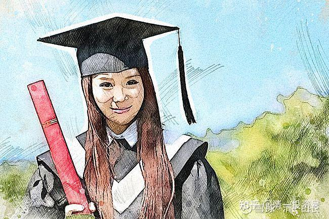

原雪球专栏[107篇.我以为考上了985，就不愁找工作！](http://link.zhihu.com/?target=https%3A//mp.weixin.qq.com/s/T-VqC3P3WETHit3O0ggqNQ)

清一山长2021年2月20日

文凭快速贬值的情况下的教育攻略：越早越好！

我为了研究学生就业前途的问题，搜索了与我本文题目同名的网页，突然发现：现在文凭贬值情况，远超我的预期：连985毕业生，找工作都有困难了。坐标北京，想找一份8000元月薪的工作都不可得（8000元在北京怎么活？想想都觉得苦恼）。

“我用了20多年时间，终于弄清楚了一件事，那就是这个世界不需要我。”。985毕业生说出来话，多么的苦涩。也多么的失落。这个985学生的家长，怎么想这个问题？

“原来，考上985就是我的人生顶点。”

年初，小风的朋友圈由考研时的英语期刊阅读，变成了一场又一场的宣讲会。三个月时间，她投出了70多份简历，面试了10来家公司，只拿到过一个offer，但又错过了。

她的求职路还在继续。

作者：[一个看客匆匆路过](http://link.zhihu.com/?target=https%3A//www.bilibili.com/read/cv3854562/)

点击查看参考链接：**[我以为考上了985，就不愁找工作](http://link.zhihu.com/?target=https%3A//mp.weixin.qq.com/s/FeEt7gz8QWprxXKhtWbdFQ)**

[https://mp.weixin.qq.com/s/FeEt7gz8QWprxXKhtWbdFQ](http://link.zhihu.com/?target=https%3A//mp.weixin.qq.com/s/FeEt7gz8QWprxXKhtWbdFQ)

让我们延伸一下思维：现在孩子还小的家长们，满心就以为：现在家长努力去拼学区房，孩子努力去拼课外辅导。将来考个好大学，人生就OK了。

但是，**如果全中国的家长，都是这样来拼的，你又有啥胜算？真以为您家孩子就是神童？**

现在，读大学已经不是啥门槛了。我上大学的1980年，2000多万同龄人中，只有28万人考上了大学。从1977年直到1981年，中国大学每年的招生数，就是28万左右。算起来，考上大学，就成了1%的人才，就战胜了99%的同龄人。这个时代的大学毕业生，真的只要凭一个文凭，就可以相对不错地混一生。本事有没有，真不重要。文凭学历显得很重要。

而现在：中国的大学，每年大约会录取900万左右的大学生，比当年扩招了几十倍。而每年的人口基数，甚至只有当年的一半多一点。算起来等于扩招快100倍了。因此，现在去上大学？真谈不上有啥竞争优势（当然，如果现在连大学都考不上，就更没有优势了，只有锻炼好身体去打工去算了）

我原来还天真地想：也许您考上985大学，就可以像我当年的同学们一样，都容易找到一份好工作了。估计大多数家长，也是跟我一样想的，所以，拼命累孩子，上重点小学，初中，上衡水高中，考上一个每年招大约接近20万学生的985大学，就可以放心了。

的确，现在很多勉强像样一点的企业、单位，去大学校招，都是打出：只接受985、211的学生投递简历。双非学生一概不接收简历。这样子，就证明：如果你进不了985、211。你就直接被扔进了“不入流”的档次。只有一些很烂的企业，也许几年后就会倒闭的企业，才会去双非大学招生。您如果只能上双非大学，你的人生，从此就低人一等了。各种各样的机会——就业机会、婚姻机会、创业机会，等等，都只能去捡别人不要的货。

**中国未来的就业竞争，随着中国经济规模的萎缩，内循环的启动，找到一个好工作的机会，只会越来越小的。竞争会越来越激烈的。**

简单一点说：考不上大学，固然与主流社会无缘。但考上了大学，恐怕90%的大学生，依然是被视为“二等公民”，将来的人生机会，注定要比一等公民们低得多！当然，可以安慰的是：也许比底层的农民工们还是强一些？[大笑]

该怎么办：家长们现在不为孩子去思考，计议长远的未来规划，将来注定要困守围城的！现在，去好好研读我的未来职业规划的长文吧：（点击查看）**[“一生的教育规划：用稀缺性原理成为人生赢家！”](http://link.zhihu.com/?target=https%3A//mp.weixin.qq.com/s/-PmX-tocppI22J-JVbK7KQ)**[。](http://link.zhihu.com/?target=http%3A//mp.weixin.qq.com/s%3F__biz%3DMzAxNzk5NjIzOA%3D%3D%26mid%3D2247491764%26idx%3D1%26sn%3Daf79ebe6295033e8f003f09e8314d06d%26chksm%3D9bdfa015aca82903c5472a65f0022c209923cee65cda70024d5f729a6555abebfa20b3ce5171%26scene%3D21%23wechat_redirect)**真的价值百万，千万都不为过。认真研究，去贯彻执行下来。否则希望渺茫，就是赌运气好不好了。**

**总结一下基本思路：**

**1、未来要读什么大学，学什么专业，才最有职业发展前途呢？**

**答案：由于人工智能的冲击，由于中国“中等收入陷阱”的到来，未来大多数中层级别，很多的专业和职位都会消失。**所以，你要我帮你去传统大学里面，选出一个“未来最有前途的专业”，是很不靠谱的。想学一个专业，就终身吃这碗饭，我看未来基本上没有这种希望了。所以，各位家长，就不能继续抱着“读一个名校，选一个好专业就没事了”的心态自己骗自己。这个传统的教育规划策略，已经无效了。

2、**中国，海外大学的文科专业，冷门专业，一定要尽量避免去读！**

除非你真心喜欢，比如什么文学、艺术课程，历史、文化学等等，甚至地球天文学之类的。读了别指望找工作，喜欢就好。**想要找工作，你就得去考企业需要的技能。不能让企业来为您的爱好买单**吧？

文科专业不能读，有两个主要的原因：

**第一个是中国就没真正的文科，学出来也没啥技术含量。**而且长期以来，文科各专业的出路都很差，要不就是靠父母的关系去一些不太要求专业技能的岗位，或者去考个公务员啥的。大多数没家庭背景的文科生，主要的出路，一直就是去当个老师，做做培训班啥的。很多当外卖员的大学生、研究生，其实去看看专业——大多数是文科生。根本找不到工作，所以只能去当美团送货的小二了。未来各位的孩子，学完文科专业后，想要去当一个普通的中小学教师，我看都是很难的。因为未来的教师，一定是“减量博弈”的，也就是说竞争最激烈残酷的。

因为，中国未来20年人口崩塌，未来很多学校，都必须兼并，或者倒闭。民办大学、中小学的倒闭潮，现在刚刚开始。官办学校都吃不饱，哪有饭给你们这些民办学校吃？所以，哪有现在这么多的教师职位，等你来选择的？这个进程，其实已经开始了。原来很多地方大建希望学校，现在是大量的地区，学校空置无人读。都在集中到少数学校去。而且，原来清北的大学生，去当教师的人很少。现在深圳的中小学招聘，赫然看到一色的清华、北大、海外知名大学的毕业生去应聘。所以，想要去当中小学教师，连普通院校的学生都受到名校生强烈的挤压效应，文科生受到的边缘化，将来只会更严重。

**3、清一大学开办文科专业课程的目的是什么？**

上面我说到这里，也许您会反唇相讥：既然我明知文科没出路，为啥我把清一大学定位为文科大学？这不是害孩子们吗？

**我不得不澄清一下：清一大学的文科，与中国大学的文科是很不一样的。我们是强调知行合一的真文科，强调学用合一。是孩子们最需要的课程。**虽然未必是能够赚钱的专业和技术，但对孩子们的人生成长很重要。比如现在上的**两性关系课程、社交课程、心理学课程**等等，其实**对孩子们的一生关系很大**。但您别指望用这些文科去赚钱。您去跟招聘官说：我是两性关系课程的第一名。你看他会给你工作吗？企业根本就没这职位。但你自己特别需要这种知识储备。

所以，**清一大学的文科，是人生素质教育，不是专业技能教育，是不可比的。文科，其实根本上不是为了就业而学的，而是为了提高自己的精神层面而学习的**。不能把文科当做一种专业技能。语言专业也如此。

另外，清一大学就算是开设的小语种专业，表面上与其他大学一样，其实内里还是不一样的。我们的学生与北大等西语系的学生最主要的差别，就是**我们更强调语言的实际应用能力，不是把语言当学术、学问来研究的。**所以，虽然我们的考试成绩秒杀北大西语系等毕业生，但是最重要的专业素质差别，是我们的学生口头交流能力很强，交谈、演讲、辩论等。这一点任何大学外语专业，文科专业，都是比不上的。

**4、怎样才能成为适应未来社会需要的人才？不至于学错专业被市场抛弃？**

未来社会，“专业”这个传统的工业社会教育系统，用来进行社会分工，把人分割成一个个的机器零件，用来大批量地提高工作效率的手段，会受到严重的挑战。**未来会有很多工作，是要求具备跨专业的技能的。所以，我认为未来是跨界人才的天下。**

比如说，中国的一带一路政策，有很多中国的跨国企业，世界500强企业，正在加入和布局。他们就特别需要各种人才，但最需要还是跨界人才。假如华为海外分部拓展海外市场，需要招聘员工。显然这些员工必须拥有专业的通信专业技术知识结构，拥有专业能力。

但是，由于在海外工作，很多都是小语种国家，因此，也需要小语种能力。同时，这些工作，需要中外双方的合作，需要跨文化交流的能力，因此需要懂得文科背景的，具有双方的文化背景知识的人来工作。而且，中方企业去海外布局，派出的中方员工，工资待遇不可能是当地员工的水平，否则不如直接使用海外的专业员工。自然要求中方员工，也不能仅仅有当地员工的能力专业就行了。中方一定是要求这个中方员工，具有一定的管理能力，不能只是拥有一点技术能力，只能当基层员工。**因此，他应该具有管理专业的一些常识和水平，具有一定的领导力、团队协作能力。**

这种人才，传统的工业化大学，需要学四个专业，比如：

1、需要通信技术专业。电子专业毕业的人才。

2、需要中国的外国语大学毕业的小语种专业的人才。

3、需要懂得跨文化沟通能力的文科人才，避免文化冲突。

4、需要有工商管理学院专业毕业的人才，有领导力、管理力，项目策划、安排能力的人才。

而且，这四个专业，都必须真材实料，不能是骗子的专业，都得上名校才行。这样子，你就知道：为了完成一个工作任务，就需要这四个专业的人才一起协同工作，才能实现目标。

你是否觉得，这太荒谬了。就算是苟且一下，你起码也需要两至三个人一起工作，派一个任务，至少需要配个翻译去工作吧？这就是中资企业目前遇到的最大困境。所以，一方面是大学毕业的人没有办法找到工作。一方面是中国的很多跨国企业，急需人才却找不到人。

解决方式，说起来也很简单：就是把这四个专业，都集中一个人学了就行了。
不过，说起来是简单，但世界上，现在还没有一个大学，能够完成这个任务。这种跨界人才，根本超过了传统大学的传统教育理念，超过了他们的分科教育的思维模式。所以，这些大学，拼死了都培养不出来这种人才的。

您能想象中国最顶尖的，如北京大学外国语学院的西语专业毕业生，学完西语毕业后，再去读一个理工科的大学本科专业来“完善自己的职业素养”吗？或者，您能够想象中国科大通信技术专业的毕业生，毕业后去读一个“中西方比较文化”专业的研究生吗？或者考一个西语专业的大学专业？读完后拿到C1证书，再去求职吗？

要求中国的文科生去读理工科专业很荒谬，几乎是不可能。要求中国的理工科学生去读文科，写文章，也几乎是不太可能的（当然有极少数学生可以实现，就像我——理工科本科专业，文科研究生，当年就跨界了）。

我知道有少数理工科学生，文科也不差，可以去考文科研究生，专业学习也不比正牌的文科生差。但至今为止，我从来没发现有文科大学生，去考了理工类研究生的。这说明中国文理科的分野很严重。中学开始，就分开了。特别是外语专业。可能初中就分开了。**所以，外语很好，特别是小语种专业学生，基本上都是完全的“科盲”。这就造成了中国企业在一带一路进程上的极度缺乏人才。**

实话是：就算是学生的素质上能够适应，用传统大学的低效率培养方式，以上四种专业的跨界能力掌握，需要上16年的大学，还未必能学好。（很多西语专业大学生，毕业的时候都通不过专四考试，更别说专八了。通过率低得可怜）。

**清一大学就瞄准了这个跨界的教育优势：如果心中有数，早一点就开始按照跨界人才的方向来培养，就可以在普通大学生毕业的年龄，掌握上述四个专业的能力和素质。用传统大学一个本科专业的时间，就学完四个大学本科专业的内容。**

**核心的方法就是：**

1、11岁以前，双语学习，重点是汉语和思维，行动、能量的培养。英语学不学都无所谓。

2、11岁开始，用一年的时间，完全的突破第一外语，成为双语学生。

3、12岁开始，用三年的时间，学完美国K12的基础教材，不分文理科，综合学习，全科发展。打好学习基础。

4、15岁的时候，开始学习第三语言。用一年的时间，完成中国的外语国大学四年的课程内容，达到大学毕业水平。

5、16岁开始，学习管理学、中西文化对比、人际关系、两性关系、心理学、策论等等课程。由于考上清一大学的学生，都是实现了3年学完12年任务的学生，都是学霸。所以，这些学生两年内，达到一个管理类文科大学生毕业的水平，是毫无困难的。

6、**18岁，清一大学毕业，用优异的SAT成绩，或者三语成绩，去考一个海外知名大学的“通信和人工智能”专业，世界排名前50名的大学。**这个档次，肯定比985高得多。（说明，你们不是也非要读清一大学才行的。跟随示范班，高中部可以网上跟随学习一些课程，基本上，实现这个通道，是没问题的，不花钱，就可考海外大学。欧洲的大学也不要花学费，价廉物美）。

7、22岁大学毕业，开始进入职场。**这个学生，就是新一代的跨界学生：文理跨界，中西跨界，还文武合一。**

**您说，这样的学生，这样的专业教育背景，想去华为等等这样的顶尖的世界级公司应聘求职，是任何大学的毕业生，任何专业的人能够比的吗？**更别说什么西语专业的小语种学生了。这些大学生就算去了华为，恐怕也仅仅是一个小翻译，或者是一个低端的海外客服。

**但我相信具有上述四种背景专业的学生，一旦去了华为，很可能就是“海外总经理助理”、项目经理、项目负责人。他提升的速度，绝对超快！而且谁都没脾气。这种综合素质，既然任何大学都培养不出来，自然占尽天时地利人和。他不成功，谁成功？**

因此，各位家长：放弃一心只考985的梦想吧！为了替孩子负责，您需要认真规划将来的跨界人才的培养了。我说的这一条路，实践起来，比考985更简单、更容易。但最终的效果更好。将来可以当上技术官僚。现在的很多官员，都是500强国企里面出来的。说不定您孩子还可以混个省长、厅长当当呢？[大笑]

当然，**欢迎您为您自己的孩子，找出新的，更有优势的跨界人才的培养方式。如果有，告诉我，我也参考一下？**

（以下内容为编者附录）

**评论回复：**

**安老一2021-02-19 15:20回复@春风化雨润万物 ：**

“卷得太厉害，越来越焦虑。”越来越感觉到成年人好多限制都是自己给自己加的，卷主要是自己卷自己，自己给自己划了很多条条框框，自己给孩子加了很多条条框框。这种卷只能是自己的原因，因为不能突破自己，只好在一个别人设计好的固定路线上层层加码、层层焦虑，一步步把自己压倒。实际上你看文中很多东西也是成年人最需要的东西。这篇文章中的素质列表才是突破内卷的良药。只是成年人突破自己的意愿已经在内卷中磨尽，愿意突破的非常少。但凡有一点突破的意愿，就可以在短短几年内利用自己的资源破圈成功。

**@searness** **2021-02-19 15:20回复清一山长：**

为什么到18岁还需要考一次国外的优秀大学，是为取得融入社会的钥匙吗？还是纯粹增加阅历和见闻？如果是前者，那大部分国内家庭还是有困难，体制内教育很难转过来的。

**清一山长2021-02-19 15:31回复@searness：**

当然可以不读大学呀？我家的大孩子就没读，17岁直接当新教育教师了。因为我们家又不想将来当技术官僚。

您也可以不读呀？比如孩子直接去海底捞，这里不要文凭的，当蓝领，也不需要。没谁逼你您读大学的。

但您孩子将来想当中产阶级，就必须读排在世界大学榜单上的一流大学。至少前一百名吧？

如果缺钱，也不是问题。欧洲的一流大学，不是告诉你不收学费吗？只是生活费依然少不了。

您还是没钱，连读书的生活费都没有，但还是想上大学。这个，就只能——考清一大学了。我来供养您好吧？学费、生活费全包了。

不过，考上清一大学，也不容易，您起码得有考上世界排名前50名大学的本领才有机会入读。[俏皮]

**@searness回复清一山长：**

我这个问题不代表我个人，而是问问清一大学的大学社会融入方面的特色，我想山长若有办学的决心和气魄应该是在这方面下功夫，不然所谓的大学也就是稍有特色的预科而已，当然，大学的社会属性不是光有财力就够的。

**清一山长2021-02-19 18:03回复searness：**

想知道清一大学的学生如何融入社会？**清一大学的学生，兼容任何体制和职业。但反过来恐怕不行。**因为我们的格言是：**只要是人能学的，我们都能学。只要我想学就学！我们是不分科的。**至于是不是这样？真想知道结果如何，自己去看我们的毕业生就行了。你就自己去看示范班直播里面的示范课吧：这些出来讲课的年轻老师，大多数20岁不到，全是清一大学教育专业毕业的。她们像是不能融入社会的样子吗？

告你答案吧——**她们都是其他学堂和一些企业，愿意以几倍的高薪挖走的对象。她们的讲课水平，我相信大学的教授也没几个人能超过的。**

**@芳草无华回复清一山长：**

看了山长的分享，因为条件普通。我们准备通过外围新学堂的自助形式备考示范班。儿子今年8月满10周岁，不知道示范班招生要求满10周岁是按照7月份算还是9月份算？这个12岁开始，用三年的时间，学完美国K12的基础教材，是不是今日的挑战班？这3年的学费大概是多少？国际直通车班又是什么？请指点我们普通家庭的孩子对于示范班后的规划还比较模糊[捂脸][捂脸]

**清一山长2021-02-19 17:49回复@芳草无华：**

**我早说过了：普通家庭，别跟有钱人一样，去玩不普通的教育游戏。有钱人可以用钱来买路，你们用努力来买路，是一样的。只要一路跟随示范班，考上三语高中，再一路考上欧洲大学。一路都是免费上学，没人问找你要钱的。**你跑来问我钱干什么？示范班在一年以内，是“**初级突破班**”的内容。今年9月份开始，示范的就是**“挑战班，国际直通车班”**的教学内容和方法。你们这些，全部都可以在网上看到教学进程和内容。现在问啥也没意义。反正都是免费提供给你们的。

我都不问你跟班有没有钱，你反过来来问我要多少钱？跟我比谁会花钱吗？[大笑]

你们钱不多，人就别犯傻！就要多努力一点。这是基本原则。

**冯冠豪长雄2021-02-19 20:19回复清一山长：**

感谢山长创办了新教育！我是清一家长，大女儿在2020年入读清一突破二班85号，在新教育的影响下我们夫妻也有了十分大的改变，今年的春节与不一样的方式渡过了一个十分有意义时光！脚踏实地，不需要仿文凭！会读书不如会做事，会做事不如会做人！祝新教育越办越好！愿中国有真教育！！！

**@江湖梦留白回复清一山长：**

请教山长，相比国内外其他有名私校，目前新教育毕业生就业是否过于单一，从目前宣传看，多数都是从事新教育平台教师工作或是管理家族财富为主，您今后会更多鼓励学生多元化发展对外输出，还是更侧重于内部建设发展新教育平台？ 宣传方面，可否多介绍一些毕业后的孩子们在新教育平台之外的发展？谢谢。

**清一山长2021-02-20 11:22回复@江湖梦留白：**

新教育的首届高中毕业生，首届清一大学少年班才刚刚冒泡，您就下新教育“出路单一”的结论，是不是太早了一点？您要得到您要的观察结果，没必要问我，你不妨观察追踪我们的这些少年班的学生，看将来毕业后，他们的职业去向吧？至少您还得等五年以后才有初步的结论。如果他们根据个人的自愿，去上了各种各样的世界一流大学，你认为未来什么职业，是他们覆盖不了的？

至于职业选择单一：您干嘛就不说哈佛、耶鲁的学生就业过于单一：都集中在金融，咨询业？这不是耶鲁、哈佛能决定的，而是学生自己决定的。学生就是爱钱，去这两个最赚钱的行业有病吗？清一新教育的优秀学生就是傻一些，就愿意去教书有问题吗？难道让我逼她们去“职业多样化”？这不是教育举办者的事情。这是社会的事情，学生个人的事情。

顺便说一下：**想要留校当今日系教师的学生，的确每年都有。但一定是最优秀的学生。**因为要创建世界名校，怎么可能让差生留校？**公主预备班，就是集体想要当新教育教师的班级。从12岁就开始定向培养。她们都是家庭和个人自愿，学校精选出来的学生，当然，她们会得到更多的“人学课程”培养机会。**其他班，是自由班，未来去全球大学任选专业和职业的班级。**公主班上的是清一大学，其他班是世界大学。**谁的选择更好？就不知道了。个人有个人的评价吧！但随着时间的推移，我相信会有越来越多的人发现：**公主预备班的家长，选择读清一大学的家长，才是最有眼光的家长。**

**江湖梦留白**2021-02-21 04:07**回复清一山长：**

多谢山长回复。首先想说清楚，我没觉得做教师教书不好，相反这是我最希望我女儿将来能选择的职业，当然我也尊重她其他选择。从新教育学堂运营角度看，良性的内循环，优秀学生自己愿意留下来，组建教师梯队，是非常有效保障教学质量的方式，毕竟这些学生知根知底好用，山长、校长们都可以省心，公主班的成立，是个好主意。我之所以这么问是因为看您之前的帖子说有些人质疑学校资质文凭，没有理工科，外语培训班等等之类，这些似乎都是浅层次的问题，我想大家真正想问的是新教育学堂或今后清一大学学生毕业后的落地情况 （这是所有非体制新办学校都会被问到的问题）。 但我也知道这个没有绝对的答案，每个学生家庭背景不同，境遇运气不同，性格不同，选择的路也会不一样，把学生前途完全归结于教育成果是不全面的。但世人都会有世俗的标准衡量，您提到的哈佛大学毕业生大多能被国际顶尖金融和咨询公司录取就是一个能被多数大众普遍接受认可的标准。虽说清一大学刚成立，但这十几年间也有不少学生从今日学堂学成， 听说也有去亚洲大学的，也有重新接轨体制教育做得很好的，也有去企业的等等， 这都是很棒的案例，如果能从这些方面多分享，相信很多圈外人就不会那么纠结文理科文凭之类的问题，对教育理念方式的推广也有帮助。我不是清黑，这些年一直在关注，有些想法和大家、山长交流，请清粉们轻拍。

**@宋建广回复清一山长 @保持觉知放大格局: **

山长所言极是，这些小老师们15、6岁就已经开始成功一届一届的带班了。反而让我们这些家长佩服得五体投地的，在她们面前像个小孩子[滴汗]（包括好多亿万富豪家长[大笑]）这些老师可都是有理想抱负和情怀的人，这可不是花钱就可以挖走的人。他们清心寡欲，现实家庭不缺，真实内心富足精神也不缺，包括现在双方老师，彼此都是承载着荣誉和责任，带领自己的学生成为世界最好的中国人……别看年龄不大，但她们做任何事、任何行业都可以是“霸”[牛]！都是受您真传吧！一通百通[大笑]！

**清一山长2021-02-20 11:24回复@宋建广：**

这些小教师，其实都不是完人，一样有很多不足之处。只是他们更愿意学习和提高，两校师生都在认真学习提高中。内部培训，我一直都在指出她们的各种毛病，大家都在不断改进中。谢谢您的支持[献花花]。

**吕晓全2021-02-20 15:48回复清一山长：**

给予别人慧命，引领别人学习智慧，才是最大的福报！

乔布斯在当代再牛，再有名，再有能力，他创造的智能设备终会被时间淘汰，就象现在，短短的14年过去了，已经没人使用iPhone 1，可能很多人都已经忘记iPhone 1的样子！

而老子留下来的《道德经》，佛祖留下来的《金刚经》，经过几千年的时光洗礼，依然被很多人学习，视为智慧的经典，引领着人类不断的成长。

真正的好工作，其实是引领别人学习智慧，引领别人成为他想成为的人，引领别人成长，这样的老师，才能被人深深的感恩，才会被后人铭记！

圈外的人，总觉得我们对山长是无脑的崇拜，是无脑粉，根本就不知道我们通过学习山长的智慧后，收获了个人的成长，找到了自己的人生方向，在人生的道路上不再迷茫！收获了孩子的成长，知道孩子在学堂老师的教育下，在山长的引领下，也会找到他的人生方向，成为他想成为的人！收获了家庭幸福，幸福——目前社会上很多人不是在追着吗，但我们已经找到！

我们获得了那么多的好处，我们自然是希望身边的亲人、朋友、同事也能够获得这样的幸福，推荐山长和刘老师的智慧学说也是很正常的事情，但我从来就不强求别人一定要学习，因为可能他们有他们的老师，我只是祝福他们早日找到他们的老师，毕竟有求皆苦！

对山长和刘老师的感恩，是出于我们的肺腑，旁观者又怎能体会得到！
