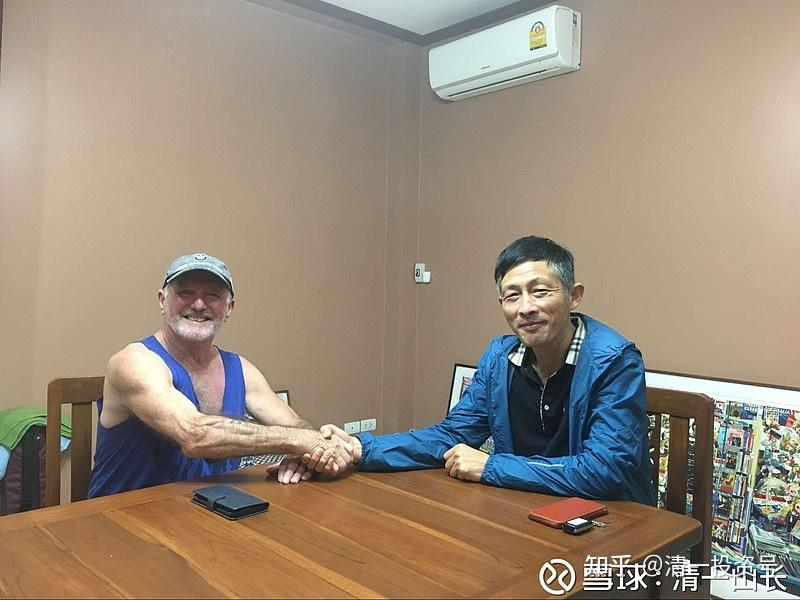

原雪球专栏14篇.我与前英国拳击冠军在一起

清一山长 2017年11月6日

这几天中国宏桥涨得很好，我没事可干，账户都没打开，就说说废话玩吧！

下面的这张照片，是两个分别玩中西武术的老头子在一起，也许看起来有点意思。

拍摄的地点，是我清迈家中的小书房。英国人一看，就是“肌肉男”，非常壮实。我一看就是文弱书生，毫无威胁的样子。不过，现在这个英国人，是绝对不愿意跟我对战的，因为他基本上是赢不了的。不过他年龄比我大，胜之不武。他原来已经看过我跟他20岁的女儿过了招的，刚开始还想“指点”一下我。后来我出了几拳太极快拳、重拳给他看，他根本看不清我出拳。知道跟我打起来没好处，后来就不愿意跟我试手了。他女儿练过拳击、空手道、泰拳等，现在英国的大学读书。

这个英国人，是我泰国房产的“前房东”，我住的房子，就是他亲自设计和建造的。他年轻的时候，是英国的拳击冠军，一直爱好运动。

他是一个真正的绅士，处处以英国绅士来要求自己。

他交房子给我的时候，专门要求迟两天给我房子，因为他要请清洁工来做好清洁。他还特别去检查了所有的房间（他的房间很多），看各种开关功能是否正常。发现有两个房间的热水器不能用，就告诉我，说要请工人来修好后再给我，后来是买了一个新的热水器。我说我可以自己来弄的，他坚持要弄好房子，到100%的最佳状态才交给我。房间里面的灯坏了，他买来42个新灯换上。我们现在用的三星大冰箱，也是原来他家的冰箱。进来的时候是坏的，结果他请公司的人来修好了，后来知道花了五千多泰铢。其实这笔钱他根本就不用花的，因为交房并没有提到任何电器的事情。这也反映了英国人的自尊尊人。

他的孩子已经上大学了，从小也喜欢运动，练武术、空手道、泰拳等。被我用中国功夫秀了一下，就给“镇住”了，想改学中国功夫了，她想试验一下中国功夫是否实用。我就让她出手攻击，出拳、出腿随意。结果她刚一出手，还没看清怎么回事自己就倒地了，而且很安全地倒下，没有受伤（战斗力差距太大，我才可以随意控制；战力相当，我就收不住手了）。直嚷嚷“秒杀泰拳”！很兴奋。英国老头当时也在现场看，很久以后，都跟他的朋友说，我是功夫高手，出拳“非常的快”（very very fast)。

我发现，外国人成功者中，年轻就学武术的比例很大。这个英国老头John在泰国生意顶峰期有1400个员工，钢材、石油、汽车生意都做（爱车的超级迷，他的车库就有20多个车位，刚来看的时候放了十几辆车，现在卖掉一批，我数了数还有十辆车）。

中国人大约是成功后才去学武术的，比如马云、郭广昌等，他们的赚钱本事的确没得说，但是要过招，肯定不是这老头的对手。

过两天我还要去一家泰拳训练馆，跟一个日本的武道高手交流一下。他是拳馆的老板，喜欢泰国的生活，就留下来开了个拳馆。上一次，他的中国籍弟子被我“打晕菜”了。想试手的时候，被我一秒钟左右就出了不同方向的六拳，连拳都没看清，就糊里糊涂地倒地了。他的陪练正好在旁边，看了就一直笑。所以，这个师傅也想见见我。我看他的训练板上，全是中国的拳经要领，写着开合、桩功之类，都是繁体字。据说他的水平很高，是打过国际专业散打比赛的人。据他的徒弟说，他很瞧不起中国的武术，觉得都是骗子。我也有点好奇，准备去看看日本人高明的地方何在。

这件事情的起因，是前几天我们去一个泰拳馆看看别人是怎样训练的。正在训练的拳手正好是一个中国人。开始让我们跟着一起练泰拳，我们说看看就行了。随行的人随口泄露了消息，说我也是练武的。学员很好奇，就问我是练啥的，我说太极。学员也练过太极，陈氏和武式，就表演了他们门派的太极。不过又说，就是因为雷雷，让人觉得中国武术不靠谱，他也没信心继续学了。就跑来泰国学泰拳，准备几个月后，去拳台上实战一下。我说他没看过真正的太极，不能说中国武术不行的。这人就要看看我的太极是啥样的，我就练了几个动作，结果他看了就一直笑，说就是跟跳舞一样的，扭扭身子，全身都动，没什么威风，不像是武术，认为我在开玩笑，还以为谁都会扭呢！学员自己模仿着扭了两下，说原来也学过舞蹈的（言下之意，这种太极没有什么技术含量），说我这太极真的有用吗？能打吗？我就慢慢的用太极做了一个“特别妩媚”的“风摆杨柳”的动作，对学员说，他可以用学到的泰拳功夫，全力来进攻我，无论怎么攻击，我只用这个动作就可以对付了。学员觉得是笑话，就摆好架势试一试。果然一动手，对手就晕掉了，然后下一秒就到地上了。后来说，动手的时候，脑子一片空白，根本看不清我如何攻击的。我就复原，用慢动作告诉他是怎么倒下的。学员很奇怪，为什么这么妩媚的动作，看起来像是跳舞一样，但攻击的力度非常的强大。我告诉他，不是这个动作的问题，而是身体的整体劲和太极力的使用。果然，别人模仿用这个动作，就不灵了。

几天后，这个学员告诉我的同伴，当天试手就受伤了，脸上被击中，几天都没好。其实我当时真没发劲。不然当场就有人爬不起来的。装没事都装不出来的。

**评论回复：**

[@游爽](http://link.zhihu.com/?target=http%3A//xueqiu.com/n/%25E6%25B8%25B8%25E7%2588%25BD):回复[@清一山长](http://link.zhihu.com/?target=http%3A//xueqiu.com/n/%25E6%25B8%2585%25E4%25B8%2580%25E5%25B1%25B1%25E9%2595%25BF):有点难于置信，这个外国老头明显块头大很多，挨你十拳，一拳就能把道长打爬下。毕竟体重不一样。

清一山长[2017-11-06 18:05](http://link.zhihu.com/?target=https%3A//xueqiu.com/9310099567/95057846)回复[@游爽](http://link.zhihu.com/?target=http%3A//xueqiu.com/n/%25E6%25B8%25B8%25E7%2588%25BD): 我也有点难以置信，世界上居然会有被我打十拳而不趴下的人[大笑]。另外，一拳就把我打趴下的人倒是有不少，但是绝对不可能是外国的老头。某些中国的老头倒是有可能。双方一旦交上手后，能够在我的攻击下挺立两秒钟不倒下的人，都算是强人了。不用继续打，我就直接认输了。反正我老输的，打赢我的人也老多的。

[@自由自在hfy](http://link.zhihu.com/?target=http%3A//xueqiu.com/n/%25E8%2587%25AA%25E7%2594%25B1%25E8%2587%25AA%25E5%259C%25A8hfy):回复[@清一山长](http://link.zhihu.com/?target=http%3A//xueqiu.com/n/%25E6%25B8%2585%25E4%25B8%2580%25E5%25B1%25B1%25E9%2595%25BF):我刚打赏了这个帖子 ¥10，也推荐给你。 山长兄不在国内开武馆，实是中国武术界及国内武术爱好者的损失[哭泣]

清一山长[2017-11-06 20:32](http://link.zhihu.com/?target=https%3A//xueqiu.com/9310099567/95066079)回复[@自由自在hfy](http://link.zhihu.com/?target=http%3A//xueqiu.com/n/%25E8%2587%25AA%25E7%2594%25B1%25E8%2587%25AA%25E5%259C%25A8hfy): 我就是开武馆的呀[大笑]！我的学生弟子，目前都是国内的，还培养出了全国太极冠军。两周后估计还有一批全国冠亚军要拿（我的学生弟子们正在备战全国传统武术比赛）。另外，我还有学生是全国散打冠军呢！我们是实战派太极。我不行，可我的学生还行[牛]

[@远方吹来的风](http://link.zhihu.com/?target=http%3A//xueqiu.com/n/%25E8%25BF%259C%25E6%2596%25B9%25E5%2590%25B9%25E6%259D%25A5%25E7%259A%2584%25E9%25A3%258E):回复[@清一山长](http://link.zhihu.com/?target=http%3A//xueqiu.com/n/%25E6%25B8%2585%25E4%25B8%2580%25E5%25B1%25B1%25E9%2595%25BF):英国老头怕不小心把你打趴了要赔钱，太极成色几何，今年发生在武林界揭露的还不够多吗？

清一山长[2017-11-06 20:42](http://link.zhihu.com/?target=https%3A//xueqiu.com/9310099567/95066748)回复[@远方吹来的风](http://link.zhihu.com/?target=http%3A//xueqiu.com/n/%25E8%25BF%259C%25E6%2596%25B9%25E5%2590%25B9%25E6%259D%25A5%25E7%259A%2584%25E9%25A3%258E): 恭喜：**您已经跟日本拳师一个认知水平了（他的徒弟说，他很瞧不起中国的武术，觉得都是骗子）。可惜，连这个日本人，都知道要读中国的拳书，他写出来的要领，就是我们中华武术的要领。可不是西方拳术的要领。反而是一些根本就不懂拳的人，喜欢乱咬，好像比谁都懂武术似的。中华文化，就是你们这种人败掉的！自己不学，还一副奴才相，只知道外国的月亮圆！**

[@黑貂裘](http://link.zhihu.com/?target=http%3A//xueqiu.com/n/%25E9%25BB%2591%25E8%25B2%2582%25E8%25A3%2598):回复[@清一山长](http://link.zhihu.com/?target=http%3A//xueqiu.com/n/%25E6%25B8%2585%25E4%25B8%2580%25E5%25B1%25B1%25E9%2595%25BF):谈谈一龙吧！

清一山长[2017-11-06 20:52](http://link.zhihu.com/?target=https%3A//xueqiu.com/9310099567/95067338)回复[@黑貂裘](http://link.zhihu.com/?target=http%3A//xueqiu.com/n/%25E9%25BB%2591%25E8%25B2%2582%25E8%25A3%2598): 一龙学的是散打，不是正宗的中华武术。水平还行吧！打娱乐性的商业比赛，已经很不错了。

[@Tiger虎](http://link.zhihu.com/?target=http%3A//xueqiu.com/n/Tiger%25E8%2599%258E):回复[@清一山长](http://link.zhihu.com/?target=http%3A//xueqiu.com/n/%25E6%25B8%2585%25E4%25B8%2580%25E5%25B1%25B1%25E9%2595%25BF):叫别人汉奸有点上纲上线了。

清一山长[2017-11-06 23:12](http://link.zhihu.com/?target=https%3A//xueqiu.com/9310099567/95068268)回复[@Tiger虎](http://link.zhihu.com/?target=http%3A//xueqiu.com/n/Tiger%25E8%2599%258E): **徐某为MMA闯天下，搞商业炒作，这可以理解。但他不惜用专门黑中华武术，黑太极等等，来创MMA的名头。不是汉奸是什么！他打假好，打雷雷，打各种大师，都是应该的。只是他骂所有练太极的都是骗子，骂所有相信中国传统武术有实战能力的人都是傻瓜，这就是太过份了。就是数典忘祖，欺师灭祖，就是崇洋媚外的汉奸行为！**
