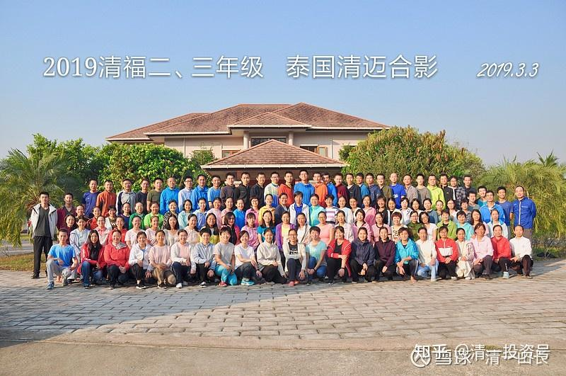

原雪球专栏[109.今日学堂的海外执照，今天发下来了！](http://link.zhihu.com/?target=https%3A//xueqiu.com/9310099567/172396869)

清一山长 2021年2月22日

给大家通报一个好消息：我们这几年，一直在申办海外的、正式的国际学校资质。由于涉及国外教育部门的审批，我们很多法律手续也不懂，只能摸着石头过河，慢慢地去弄。今天，我们的正式执照，已经审批下来了。某国教育部，今天正式发给我们可以营业的、正式开办国际学校的执照。不过我看不懂外国的执照，都是弯弯的文字。只看懂了有**“今日国际学校”**的中文，以及**英文名TODAY ACADEMY**字样，以及明燕是校长和法人的照片，祝贺这个历史性的进程！

今日学堂，从此不再是一个网上的“幽灵”。今日学堂今天在海外，正式落地了。目前，我们正在投入校园的建设工作中。我计划多盖一些宿舍，如果国内的监管严格，导致办学困难的话，我计划让新教育的学堂，今后都可以搬过来“避难”，我们来发统一的，国际通行的中、小学文凭给新教育的学生，发9年义务教育阶段的文凭。还可以让新教育学堂大家在一起互相切磋。这是继三语高中之后，清一新教育正式取得义务教育阶段办学的正式国际资质，而且是拥有办学自主权的国际学校资格，今日学堂我们拥有100%的主权。不是跟外国人合作的股份制企业，也不会受到当地教育部门的教学约束（只要给他们交税就行了）。因此，与国内的国际学校相比，我们得到了更多的办学自由。

这个未来的国际学校，我考虑到了让家长们跟随、居住、养老的可能性。所以，我特别地选择了一个很容易办长期居留签证的海外永久基地。由于后续建设尚未全面开展，疫情影响也很严重，所以，具体的地点，就不公布了。只是告知一下：交通特别的方便，比你想象的更方便。等以后建设好了，欢迎家长们前来国际今日的新校园参观。目前我已经委托了一个亿万富翁的老板，来负责帮我们盖今日校园，做各种开办的建设工作。交换条件是：今日学堂帮他带小孩。

预期今日国际学校，两年后，也就是2023年就会接待学生正式入住了，目前正在抓紧各种建设工作。我今天也特别为各位新教育家长承诺：**你们真的不需要为学籍问题操心，如果你没有学籍，我送给你学籍，还是国际学校的学籍。所有的新教育学生，即使是在家上学的学生，单打独斗的家庭，我们都保障会送一个学籍给你。如果您需要新教育的初中毕业证，可以来找我们申请；您需要高中毕业证，也可以找我们申请。只要是新教育的学生，不管你进新教育多久，是不是我们教出来的学生。只要经过一定的成绩考核后，就可以发给你们教育部门正式认可的文凭，还是“海外国际名校”的文凭。**

现在别急于来申请啥学籍，有机会天天跟随示范班学习，就是您的“学籍保证”了。您的孩子到了15岁的毕业年龄，再来找我们拿证书。我保证会给您发一个的，不就一张纸吗？别看得比天还重要似的，孩子的成长才是最重要的。所以，所有的新教育家长，就算孩子在家上学，跟学示范班，您也可以理直气壮地说：“我们家孩子，上的是海外的国际名校。”没错，您**跟示范班，就是跟随同步的国际学校。**无论您上的网络班还是寄宿班，都给一样的文凭。（就是清一大学的文凭，你们不能自己来要，要凭本事来拿。我个人签发的私人文凭，私人学籍，要比这些国家政府部门签发的国际“标准文凭”、“国际证书”更难拿一些）。

所以，各位家长只管大胆跟随新教育，现在最好的方式，最没有门槛的方式，就是跟随示范班学习，在家学习。学习门槛，仅仅是一根网线，也照样可以得到我们的国际学校文凭学籍，不用花钱。成绩要求也很低，SAT考试，只要超过1000分，我们就送给你一个国际学校的高中毕业证，比三语高中的入学要求低得多。不过，如果您的孩子，学新教育几年，连1000分都过不了（甚至过不了1200分都没价值）。我的建议就是别读书了，更别去读啥海外大学了。您拿任何学籍，就算是拿到大学文凭，都是没用的。除了浪费钱财外，没有任何的价值。

当然，如果您要，我告诉您：一样的很容易，海外有很多专门发大学文凭给您的“政府部门批准的正规大学”，给钱就能拿到大学毕业证，还可以拿博士学位。真的不骗你，太容易了。只是拿这种博士文凭干啥？只能骗家长开心，实际上是无用的。职场拿出来求职，还丢人现眼。高级的职场，是没人认这种明显不入流大学文凭的，尽管在法律上，是“国家承认”的文凭，至于低级的职业——没文凭也一样干活。只有家庭背景硬，可以靠这种文凭考公务员用。

我认为：世界上，多数人就是不应该读书上大学的。有点文化基础就行了，基本的书写算计过得去就行了。有些人就是读不进书，读不好书。这种人，应该让他干活去。所以，锻炼好身体，就是未来的资本，将击败未来很多的“大学生”。未来能干活的蓝领工人、服务员，还是很需要的。工资收入会比很多大学生强，何必去死拼读书一条路？读书的事情，交给考清一大学的人去干吧！

圈内发送这个消息后，清粉们都很高兴。也有个教育局的中级干部，资深老清粉，表示心中有点难过。他在群内发言：昨天还在给家长解释不用担心义务教育学籍和学历，今天好消息就来了。有点激动又有点悲伤，这么好的教育为什么不能在家门口举办？相信会出现“出口转内销”，有眼光的地方会通过引进国际优秀学校把**“TODAY ACADEMY”**引进国内，作为政绩工程的。

我的回复“这么好的教育为什么不能在家门口举办”：我很理解你的感情，**原来，我跟你一样，也是一直希望，把新教育这个美好的礼物，送给中国，用来荣耀我的祖国，为祖国争光。**但是，某些部门的人，对我的所作所为，实在太令人寒心了。这是一个监管狂人，自己看不懂的东西，就全都要灭掉，比清黑的嘴炮攻击要强大得多。所以，我只能避居海外了。心中一直对此有些难过，为啥这么好的礼物就不要？有点像送和氏璧给楚王的卞和，送好东西都要被砍掉双腿。我的新教育，自以为比和氏璧更宝贵，难道要砍我的脑袋，才能感动楚王吗？

但现在，我已经彻底想通了：**我是为了所有的华人，来办的中华新教育，不是为了某个机构来装面子，办的“大陆新教育”**。华人，是跨国生存的，华人本身就是国际人、世界人。全世界什么角落里面，都有华人。我干嘛要局限于非在大陆办学呢？其实，在海外办学，最大的好处就是：我们更容易国际化。如果是大陆办学，难免会遇到海外国家的有色眼镜，他们都怕被大陆政府进行文化侵略，我们自己也说不清身份的。如果我们出来，自己开办自己的海外学校，就不用担心这个问题了。

钱敏回复：记得早年山长[有篇博文](http://link.zhihu.com/?target=https%3A//www.doc88.com/p-5466119325226.html)，“**我的条件符合最苛刻国家的移民要求，但我不选择移民。祖国如同母亲，我知道她病了，而且病得很严重，但我愿意陪着她，哪怕什么都不能做，陪着她静静地死去也是一种无悔的选择**。”
……

此刻想到到这句，想到后来清黑，再看今天今日学堂落户泰国……更加体会什么是“眼含泪水，爱得深沉”。

山长说的对，全球都有华人。新教育在全球遍地开花可喜可贺。**“天道无亲，恒与善人”**。

**参考链接：**

[2012年今日学堂张健柏校长给温总理的一封信](http://link.zhihu.com/?target=https%3A//www.doc88.com/p-5466119325226.html)

[这就是今日学堂](http://link.zhihu.com/?target=https%3A//space.bilibili.com/487498588/channel/series)（视频）

[2012年的今日学堂](http://link.zhihu.com/?target=https%3A//www.bilibili.com/video/BV193411178W)（视频）
