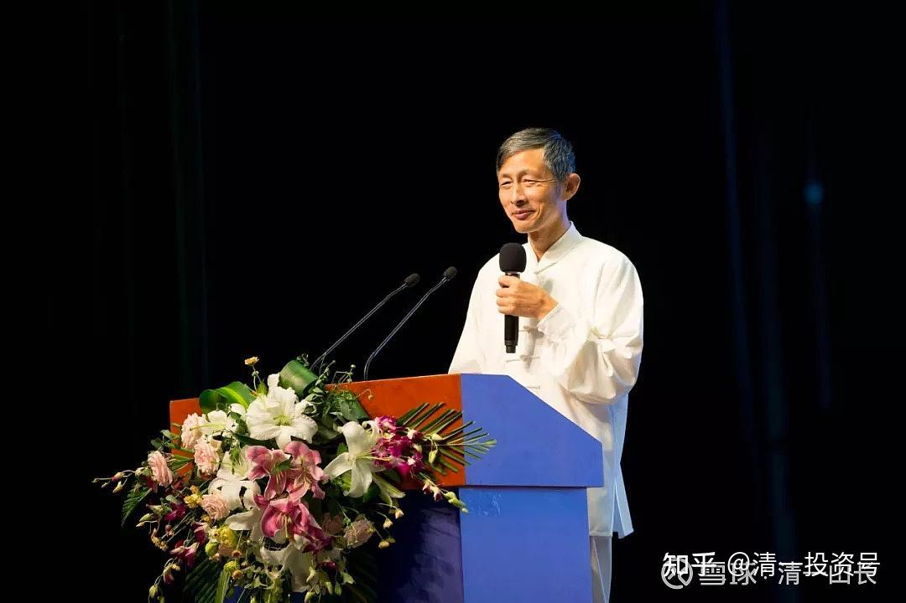

原雪球专栏[110篇.清一大学，可以发国际认证的文凭吗？](http://link.zhihu.com/?target=https%3A//xueqiu.com/9310099567/172477642)

清一山长 2021年02月23日

[昨天发布今日学堂已经取得海外某国的教育证书](http://link.zhihu.com/?target=https%3A//xueqiu.com/9310099567/172396869)，获得正式的办学许可，成为一个真正的国际学校的消息出来后，很多家长都很开心。这可以理解，家长都希望自己的孩子有个“正规身份”。一些家长就进一步提出了：既然新教育，已经有了从小学到高中毕业的正规文凭，那么，清一大学，能不能也一样，去海外某国，取得一样的资格认证？可以发国际认证的教育证书？这样，我们的学生，不就是也有国际承认的大学文凭了？

实话实说：从技术上是不难的。当然，在中国大陆，要去申请一所大学资格，等于找抽。没批准，是找抽。批准了，实际来办学，被官员们种种的监管，更是花钱找抽。在中国，个人想办啥世界名校，ZF（政府）这一关就不许你过的。**中国的民办学校，只能是官办学校的附庸和补充**，做他们不屑一做的教育。怎么会让你成为教育的主角，去藐视官办的学校呢？

其实，去海外大学直接申请一所新大学的话，也是很不容易的。种种的审查、条件，光律师费都要花你几百万。

不过，有一种方式，却很容易拿到一个大学资质：就是去买一所现在就办不下去的老大学，还有几十年的创校历史呢！因为现在各国，私立大学的生存都很艰难，因为没啥办学特色，没有优秀的生源，跟不差钱的公立大学相比，没有任何的优势。所以，**这些私立大学活得都很艰难，基本上只能靠收学渣度日**。别以为所有的私立大学，都像哈佛、耶鲁一样比公立大学还牛。偏偏**政府官办大学生源也不足，也开始收学渣来拿政府补贴了**，自然这些私立大学就更加的没法活了。现在，这些大学愿意以极其低的价格，转让给我们。如果只是要转让一个大学办学资质的话，只需五百万就可以了。校园也可以低价租给我们用（他们求之不得），想买他们的校园，就更高兴了，长期的负担，正好脱手换一笔钱。

而且，更好的是：这些私立大学的名字，还可以根据我们的要求更名。也就是说：我们可以把买来的老大学，直接更名为**“清一大学”**，去所在国的教育部备案就可以了。清一大学就可以发世界教育界认证的正规文凭了。因为，这些大学，都是所在国的国家教育部门正式认证过的。中国跟这些国家，都有学历互认的协议，这种大学的文凭，自然也就得到了中国教育部门的“双向认可”，也就是国际认可。这岂不是一件好事吗？

我在股市上，光啤酒仓位，带给我一天的涨跌，都可能不止500万呢！拿出这一笔小钱，就解决了这种大事，岂不是华人教育之幸？

实际上，一直有东南亚的私立大学找我，希望被收购，或者合作，什么都行。因为他们都快死了，疫情更加让他们活不下去，原来招了的学生都不来了，发的文凭也没人要。这些大学还可以发博士学位呢！如泰国的一所私立大学，曾经还是泰国私立大学的榜样，上周我还专门看了他们的校园，了解了他们的生源。非常漂亮的校园，非常多的宿舍，几百间宿舍，却都是空的。晚餐时间，我们去食堂看看，却没几个学生吃饭。可以知道萧条到什么程度了。可这所大学，原来排列过泰国私立大学的前五名，据说还是泰国北部最早的私立大学。现在萧条至极。这是不是一个好机会？

不过，我认为：我花钱去弄一个中小学，K12的官方许可，必要性还是很大的。因为新教育要与世界教育接轨，没有官办许可的中学教育证书，很多事情靠能力来说明，不容易说清楚。有个毕业文凭，就好办很多。虽然也没啥实际的用途。您去就业，拿一张中学毕业文凭出来，有啥用？我以为唯一的用途，就是作为我们的学生直接入读世界各级大学的跳板吧？所以，中小学阶段的国际认证文凭，作为接轨的跳板，还是很有必要的。

不过，大学文凭，我再去找这种途径，就有点没事找事了。**“清一大学”**的学生，有两种：

第一种人是只想在清一教育圈发展职业的，比如当教师啥的，这种人，要什么国际认证的文凭？他们什么文凭都不要，持有我个人签发的私人文凭，照样受人尊重。如我们的2.0教师们。

第二种学生，是要去闯世界的，去接轨世界大学的人。我拿一张**“清一大学”**的官府许可文凭来给他们，也帮不了啥忙的。我认为大多数大学，从来不知道这个没听说的**“清一大学”**。如果是我们买的老大学改名的，肯定是个圈内评价很低的大学。因此，拿这种大学的文凭出来，反而会让这些传统的好大学，把我的学生当做“低等学生”来看。可能要用很长的时间来转变他们的负面评价。还不如直接拿一张“新创国际高中文凭”，别人对此啥也不说了，反而会认为这个高中的学生很牛。

关键是：我们的学生，如果外出是要去海外大学的，都是要上本科大学，不是要上研究生大学的。因为我支持他们上理工科专业，怎么可能直接上研究生呢？所以，拿不拿**“清一大学”**文凭，对他们是差不多的。何必多此一举？他们不需要一个大学学历来做跳板的，特别是少年班的学生。至于清一硕士学位、清一博士学位，都是圈内的荣誉学位。就像“弟子身份”一样，不是拿来换钱的证书。

相反：如果他们告诉别人，他们其实上了一个私人的新型大学，学业水平，已经达到了顶尖大学毕业的成绩。只是由于这个是私人大学，没法提供国际认可的文凭。所以，只好降级，用高中文凭来读他们的传统大学。一旦这个大学的师生，发现这些学生真的比其他普通大学生都厉害，这些大学的师生，就慢慢会认可这所新型的私人大学，比官办大学厉害多了。干嘛要费尽心血，去捧红一所办学历史不佳的低端大学呢？我想要利用这些大学的资源，最好的办法，只是租用他们的大学校园，自己办我自己的**“清一大学”**。您认不认可，我才不在意呢！**我只在意学生的品质高不高！**

这就是我想做的事情：**用一个人的力量来办一所新型大学。**很多年前，我说过：未来的趋势，因为互联网的存在，传统的大学会受到严重的冲击，将来会出现“一个人办的大学”，小而精。办学的专业水平，会远远超越现在的传统大学。学生的水平和质量，学科的能力，都比现在大而全的大学要好，而且办学成本要低得多。很多平庸的传统大学，将在这种私人精英大学的冲击下，垮掉很多。现在很多人上大学的理由，都会改变的。这种看起来不可能的事情，将来会出现的。不是只有我一所大学，会有很多私人大学出现的。可能我只是**“私人大学第一人”**罢了！

特别是很有专业特色的大学，私人来办比官府来办更有吸引力。未来将重新恢复古代私学的荣光，未来是真正的大师来办大学，而不是大官来办大学。这些大学的举办者、创校者，将用自己的学术声誉，行业影响力来办学。会比官办大学品质更高，学术质量更好，学生品质更优，更能得到行业的认同。甚至这些大学的学科，可能会比传统的大学更齐全，转换热门专业更容易。只要社会需要什么，学生想学什么，大学就可以教什么给学生。比如，**“清一大学”**，**就可以开出比中国任何一所大学都广泛的专业课程来。只要学生想学，我们就能开这个本科专业，还可以保障专业品质优于传统大学。**比如，我们仅仅用一个外语教师，都可以覆盖北京外国语大学的所有语言专业。这种优势，是传统大学不可能具备的。

小而美、个性化，就是互联网必然带来的东西。**“清一大学”**，永远不会是一所“传统大学”的模仿品。我希望的**“清一大学”，会是传统大学的颠覆者，**而不是跟随者。**是他们最羡慕、敬佩，又自愧不如的学神一样的存在**。

**我希望的“清一大学”，就是清一教育流派，是中国传统文化和教育的旗舰和象征。这个流派，将比任何政权的寿命都长远。就像孔子的儒家学派。**哪一个国家的政权，比他更长命的？当年的孔子，虽然官府不待见，如丧家之犬一样游走列国。但，哪一个官府政权，长过儒家流派的历史生命？这就是文化和教育的生命力，远超官府的生命力。

**“清一大学”，将是全世界第一所道家文化的传承教育机构，教学的是经世致用的中国传统文化智慧，采用的是“四两拨千金”的道家智慧来办学，实现的是吃力不讨好的“外家拳大学”拼死也拼不出来的优异成绩。我们能够让学生热爱学习、快乐学习、高速进步；还用不可思议的低成本，以及高水平，让人才培养效率远超传统大学；**我们可以来开传统大学一个大大的玩笑，让他们照照镜子来对比结果；**我们的学生，也秉持道家淡泊宁静的生活，少私寡欲、志存高远，个人能力素质超强，乐于服务他人。**与红尘滚滚的格式化培养的体制人，自私自利的利己主义者，就是不一样。

我认为**这所大学，将流传百年，甚至更久。**

难道，您真的认为：要我的**“清一大学”**，降低身份，去乞求几个办事的行政人员们开恩，发给我一个“正式的办学资格证书”吗？是不是有点降低我们的文化档次了？

官府批准建立的新正规大学、硕士、博士等恐怕都不值钱，现在用钱都能买到真文凭。清华、北大，这种大学，不是找官府认证批准出来的大学文凭，才有真价值。可这些大学，都是官府巴巴的去追认的。难道您想的是北大校长当年天天追着小官员的屁股去求批准办学？太丢人了吧？哪里还有一流学府的尊严？官府，历史上，从来对真正的士人必须礼遇，对知识分子是分庭抗礼！这是古代的传统。现代么：**多数的读书人，就是一群孔乙己，是官府的帮闲文人，是到处投靠主子赏饭吃的书生，哪里还有啥知识分子的骨气。**

**我心中的理想**：就是**恢复一下古代的文化传统，培养一批有气节的知识分子。清一大学的文凭，任你用多少钱买不来。我私人签发的文凭，将比啥清北的文凭更有权威、更有地位、更受尊重，这就是我要实现的目标！**

如果您不同意我上面的理由。您有您的理由，欢迎在下面留言。只有言之成理，就有打赏，我愿意为反对我观点的人打赏！还用支持我的人给我的赏金来发。

**评论回复：**

**[@平常心投资](http://link.zhihu.com/?target=http%3A//xueqiu.com/n/%25E5%25B9%25B3%25E5%25B8%25B8%25E5%25BF%2583%25E6%258A%2595%25E8%25B5%2584)回复[@清一山长](http://link.zhihu.com/?target=http%3A//xueqiu.com/n/%25E6%25B8%2585%25E4%25B8%2580%25E5%25B1%25B1%25E9%2595%25BF)：**

清一先生可能忽略了一个问题，想不到更合适的说法，就直接说了，唐突勿怪。我想说的是清一大学的存续性对清一大学的2.0、3.0教师未来身份的影响。清一先生说的好，在清一体制内，有清一先生的签字认证，清一的教师在清一大学不会有身份问题。但是如果清一要长期做，身份问题就是很长远的事，最终避免不了继承这个命题。万一若干年后清一体系维系不下去了，那么这些教师怎么办呢？我这样说，不是否定清一，我也很欣赏清一的努力和探索，我也希望它永存。但是，身份问题涉及到长远，如果清一有很多年轻教师，他们全仰仗清一先生领导的清一体系提供的身份，那么对于一代又一代的年轻清一教师而言，这种依靠能持续他们的整个职业人生吗？万一不能，他们以后用什么身份在社会立足呢？这种身份困惑会不会最终影响到年轻教师们的心境？清一先生是一位导师，是不是要考虑一下身后事，给这些忠实追随者一个长期有效的社会公开身份呢？

**清一山长2021-02-23 15:19回复[@平常心投资](http://link.zhihu.com/?target=http%3A//xueqiu.com/n/%25E5%25B9%25B3%25E5%25B8%25B8%25E5%25BF%2583%25E6%258A%2595%25E8%25B5%2584)：**

“万一若干年后清一体系维系不下去了，那么这些教师怎么办呢？”

如果真是这样的，更简单了：清一教育维持不下去，说明这世界不需要清一教育。就该干啥干啥去。既然我的弟子，没本事继续玩清一教育，也没本事去干别的事情，他们都很无能。我说啥保证不就是空话吗？这就证明我的教育是失败的，清一大学就是活该倒闭。不如大家就一起放下当教师的面子，大家都去工地搬砖好了。还要啥文凭[大笑]。

有本事，他们干啥都行。想干啥，就干啥。要啥文凭？现在的家长送学生来上学，是因为我有武汉大学的文凭吗？你们看过的我的文凭才跟我说话吗？才看我文章吗？我毕业后就根本没用过这文凭，对我来说，就是一张没用的纸罢了。
**如果没本事，就啥事都干，都必须干。去工地搬砖也可以干！**干嘛要弄个可靠的文凭来忽悠人养你？这是啥德行？还让我安排后事？[俏皮]

**[@攸而宁](http://link.zhihu.com/?target=http%3A//xueqiu.com/n/%25E6%2594%25B8%25E8%2580%258C%25E5%25AE%2581)回复[@清一山长](http://link.zhihu.com/?target=http%3A//xueqiu.com/n/%25E6%25B8%2585%25E4%25B8%2580%25E5%25B1%25B1%25E9%2595%25BF)：**

清一老师，如果清一大学以后做成了百年老店，如何保证您的继任校长一样坚持您的办学理念呢？如何把清一的精神传承下去呢？

**清一山长[2021-02-23 15:33](http://link.zhihu.com/?target=https%3A//xueqiu.com/9310099567/172496509%3Fpage%3D2)回复[@攸而宁](http://link.zhihu.com/?target=http%3A//xueqiu.com/n/%25E6%2594%25B8%25E8%2580%258C%25E5%25AE%2581)：**

道家讲：顺时，应变。强调不泥古，不死搬硬套。老子说：**“执今之道，以御今之有”。这就是清一的精神，有这精神，**清一大学就是有竞争力的大学。

我的传人没学到这道家的真精神，不会顺时应变，只会照搬我的老套，一百年之后还在学西语，玩外语突破班。就活该他们倒闭掉，让路给懂“道”的人。

老子说：“天道无亲，恒与善人”。我干嘛要把顶着清一大学的名，不学道家精神的后代当做“自己人”？什么好东西都要留给他们？我不是傻吗？这些人，**不学道的人，如果号称我的传人，就是不肖子孙。**不如让清一大学倒闭，让路给其他学道学得好的人就是了。好狗不拦路！

您让我现在就弄一套一百年不变的规矩出来，让后代们“遵照执行，永世不改”，您就是“心怀不轨”，存心让我们的后代去找死！是让清一大学破产的路[俏皮]“道可道，非恒道”。就是这个意思！你们好好学学。

**[@寻求背后真相](http://link.zhihu.com/?target=http%3A//xueqiu.com/n/%25E5%25AF%25BB%25E6%25B1%2582%25E8%2583%258C%25E5%2590%258E%25E7%259C%259F%25E7%259B%25B8)回复[@平常心投资](http://link.zhihu.com/?target=http%3A//xueqiu.com/n/%25E5%25B9%25B3%25E5%25B8%25B8%25E5%25BF%2583%25E6%258A%2595%25E8%25B5%2584)：**

这些问题肯定是解决不了的。我一朋友，过去非常喜欢传统文化，把孩子送去私塾，后来对接不了中学，找他同学又转学到公办小学，留了一级。成年人是自己考虑得失，未成年人有他的监护人替他考虑，一般考虑这些的人我觉得是不会随便去的，想去也不一定收。道观、教堂，一直有年青的修道士和教士，只不过在当今社会，这也相当于是公办大学。

**清一山长[2021-02-23 15:53](http://link.zhihu.com/?target=https%3A//xueqiu.com/9310099567/172498553%3Fpage%3D2)回复[@寻求背后真相](http://link.zhihu.com/?target=http%3A//xueqiu.com/n/%25E5%25AF%25BB%25E6%25B1%2582%25E8%2583%258C%25E5%2590%258E%25E7%259C%259F%25E7%259B%25B8)：**

**学传统文化，却无法适应社会的，肯定是假的传统文化。就像是学传统武术，却无法跟现代格斗同台竞技的，肯定是假传武。**天底下，叶公好龙的人很多！别看顶着个“传统文化”的名，穿个汉服，读几句古文，就是学传统文化了。

清一大学，看起来在玩时髦的国际学校，玩外语教学。但我们骨子里面，才是真的在做**“中国传统文化”**的人。目前似乎是唯一真在做的人！

**清一文学院，在教真文！**

**清一医学院，在学真医！**

**清一武道馆，在练真武！**

说起武术来，更丢人。居然连传统的中华武术，这么多吃传统武术饭的人，居然只有我们一家，在认真做传承中华武术的事情。这实在太丢人了，是中国这么多这些玩传武的人丢人！不是我们。（现在别问我练得咋样了。一年后，你们铁定会看到我的弟子们出来打实战擂台的。不是一个人，是一批人。在武当山练了十几年的小伙子，输给跟我练了一年半的武道馆学生。这不是这个小伙子的耻辱，是教他的师父的耻辱，绝对是跟了武骗子无疑）。

**[@柯里昂](http://link.zhihu.com/?target=https%3A//xueqiu.com/magicvalue)回复[@清一山长](http://link.zhihu.com/?target=http%3A//xueqiu.com/n/%25E6%25B8%2585%25E4%25B8%2580%25E5%25B1%25B1%25E9%2595%25BF)：**

把优秀的毕业生，各行各业的精英，名字一列，比什么广告效果都明显。

**清一山长2021-02-23 17:39回复[@柯里昂](http://link.zhihu.com/?target=https%3A//xueqiu.com/magicvalue)：**

用您的话来说：有啥好出来喊的。您好好养生，慢慢等着数人不就行了？[俏皮]。现在清一大学才首届，还是少年班呢！你可以耐心慢慢的等着数人头。过了20年、30年、50年的，您慢慢的来整理您认可的名单好了。正好也缺个这么爱整理名单的人。您喜欢做这事，就去做吧！祝您延年益寿，幸福快乐到永远！[俏皮]

**@学者类型回复@清一山长：**

对您办学的伟大目标感到钦佩，不知道您的学校教授的文科人才还是理工科人才。如果要教授理工科课程，那么教师是非常重要。科学的思维方式，科学的方式方法都是很重要的东西，这些东西可能和道家的思维方式不太一样。

**清一山长[2021-02-23 20:00](h</b>t<b>tps://xueqiu.</b>com/9310099567/172514636)回复[@学者类型](http://link.zhihu.com/?target=https%3A//xueqiu.com/u/8929436814)：**

您说这话，真的很外行！[捂脸]好好去补补世界科技史的课程吧！您的简介，居然连外国人都不如，您居然不知道中国的道家，就是古代的科学家！介绍一个人，您学习一下，**李约瑟——剑桥大学的教授，中科院外籍院士**。他的著作最有名的，就是**《中国科学技术历史》**。他的发现和结论就是：中国如果没有道家，就是一颗烂掉了根的大树（随时会倒下）！大清帝国，靠道家而创立。但创立之后，为了统治搞愚民，学儒家。还排斥道家，斥为“外道”，非“正学”。这王朝的结果如何？真如李约瑟之言，大清，就是一颗看上去很茂盛，但根子烂掉了的大树。今天呢？我看也不好说。**没人知道真道家学问的时候，华夏民族就要倒霉了！**您知道：科学昌明的德国，发行量超过《圣经》的书，就是老子《道德经》吗？**我亲眼见过一群德国人，来今日学堂参观，看到学生在背《道德经》，他们随口跟着就背了出来！我还真没见过这样的中国家长和团队。**

**参考链接：**

[【清一大学少年班】走进我们的日常生活](http://link.zhihu.com/?target=https%3A//www.bilibili.com/video/BV1Hr4y1K769)

[这就是今日学堂](http://link.zhihu.com/?target=https%3A//space.bilibili.com/487498588/channel/detail%3Fcid%3D149241)

[今日明师荟](http://link.zhihu.com/?target=https%3A//space.bilibili.com/487498588/channel/collectiondetail%3Fsid%3D55359)

[清一武道馆](https://www.zhihu.com/people/mkaga)
