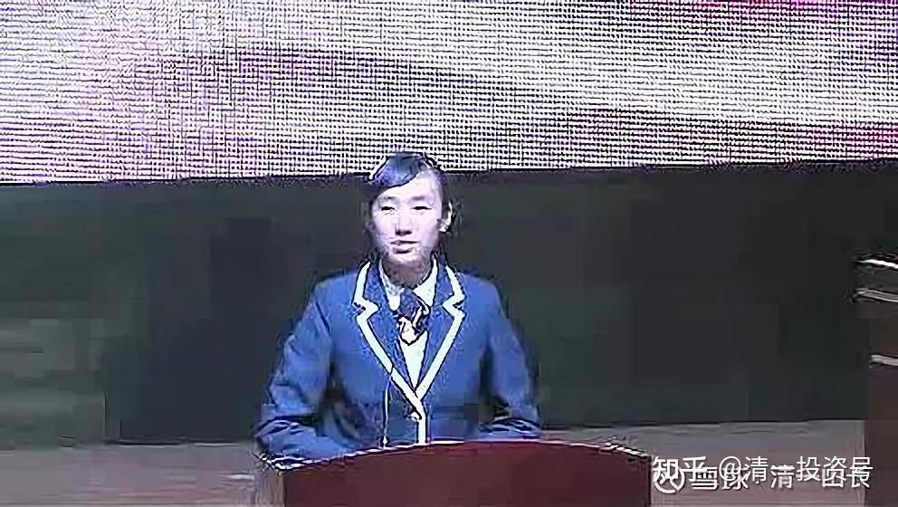

原雪球专栏[112篇.赢不了的大学校队，输不起的牛博士！](http://link.zhihu.com/?target=https%3A//xueqiu.com/9310099567/172654234)

清一山长 2021年2月25日

七年前，中国大学的精英辩手们，号称“专业辩手”，与今日学堂明一班一群平均年龄不到14岁的小辩手，进行了三场公开的辩论赛。这其实是北师大的牛博士蓄意挑起的一场辩论赛，他看不惯我捧明一班的学生很优秀，就想要用大学生们善于耍嘴皮子的辩论队优势，嘲弄打击一下当时声名鹊起的明一班小女生们。这也没啥，不服气的人多得是了。但以博士身份，以大学优秀辩手身份来挑战十几岁的小孩子，我不说他以大欺小，我不怪他用自己的最强项目，最炫技的拿手本事，来糊弄他自己都瞧不起的对手，就已经是一种修养了。没想到他带队输掉辩论赛之后，居然找一堆理由来黑，说他被潜规则了，被我们玩小动作了。他多么的冤枉，实在令人叹息。不就是想出名，想刷眼球吗？我帮您好了。

当年的赛制问题，我们采用美国中小学、大学都一直在用的辩论模式，用美国总统的辩论模式，代替了偏于表演、煽情，辩有余而论不足的“中国大专辩论赛模式”，就被他说成是我“专门设计来坑他们的古怪辩论方式”。我们是用规则来赢了他，不是本事。这，真的很像雷雷跟徐晓冬的比赛，认为输掉是因为他不能用内功、气功，怕伤人！玩辩论的人，居然不懂美国的大学辩论赛模式，你玩啥辩论？混日子的吗？

结果如何？谁输，谁赢？其实根本不重要。谁赢了都不奇怪，谁输了都正常。只是一场辩论的游戏罢了。重要的是：从中我们学会了什么？懂得了什么？今天我们能做什么，才能让我们赢得未来的人生。

至于有人如果真想知道当年是怎样比赛的？好奇双方表现如何？其实很简单：视频全程都放在优酷上，别人想看就看，别人想怎么说，就怎么说。自己作为当事人，作为一段历史，愿意的话，可以反省，找到自己进步的方法。不愿意回顾历史，也可以忽略掉，继续努力自己今天的人生。这就是正常人。其实，现在已经没几个人，去关心这件过去了七年的事情，到底发生了什么。也许只有某些无事的闲人，才会不断沉浸在过去的回忆中吧？一般是没事干的老人。

深圳场现场回放视频录像：[网页链接](http://link.zhihu.com/?target=https%3A//v.youku.com/v_show/id_XNjU1MzU2OTE2.html)

浙江大学辩论赛视频录像：[网页链接](http://link.zhihu.com/?target=https%3A//v.youku.com/v_show/id_XNjU3OTM4MDMy.html)

双方孰强孰弱，谁真谁假？谁胜，谁败？有没有潜规则？各位一望便知。自己做结论，自己判断好了。

可有人就是不甘寂寞，居心不良，挑起纷争。依然是这个当年挑起这场辩论赛的当事人，原北师大的牛博士，一直就念念不忘当年的辩论败绩，居然跳出来用实名在知乎以“当事人”的身份，乱说一堆很不负责人的黑话，极尽造谣污蔑之能事。想要把赛场上得不到的东西，用谎言，装无辜，装被潜规则，用情感煽动，来为自己扳回一局。在网上，刷到新的成就感，继续消费一回今日学堂的名气，为寂寂无名的自己脸上添点光彩。因为，现在关注今日学堂的人越来越多了，跑来踩踏今日，碰瓷今日，好像是一门可以捞取更多眼球的资本生意，看起来，这策略还蛮有效的。居然这个假话连篇，大耍矫情的牛博网贴，还成为知乎相关提问的最高赞。不知道收到了多少打赏，够发多久的工资了？

这个帖子，让很多不明真相的人，真以为牛博士被今日学堂“精心算计了”、“潜规则”了？到底当年谁在算计谁呢？谁挑起的战争呢？当年牛博就是想出名想疯了，看今日的小朋友都受到人们的广泛赞扬，就想借踩踏今日学堂的这些学生而出名。没想到反而成就了今日小辩手更大的名声。现在，牛博死性不改，继续来乱编谎言，踩踏今日，难道您现在更有胜算吗？本来，一场比赛而已。只要同意参加，你就承认是公平的。你认为不公平，就不必参加。我没有认为以博士的资历来欺负14岁的小孩子是不公平的，愿意平等迎战，我就不能事后输了，去黑牛博以大欺小。我真认为他以大欺小，我就不应战。这就是自尊尊人。

如果是大家事前一致同意的比赛方式，就没有事后叽歪的必要。比赛结果无论胜负，大家都可以自尊尊人，可以继续做朋友，毕竟难得有交集的机会。相互看不上，可以相忘于江湖。可是，这种出尔反尔的小人行径，极其不负责的编造言论，哗众取宠，煽情蛊惑受众的方式，枉顾真相，不顾事实的特点，倒是很符合**大学辩手们一贯的思维风格**：**只是为辩论而辩论，为赢而赢。根本不考虑自己说了什么，不考虑事实和真相是什么？也从不为自己原来说过的言论负责。嘴巴一歪，可以随便倒向任何一方。**但，这种行为，用在赛场之外，不仅仅是极度的侮辱对手，也是在侮辱您自己吧？您输给一群小孩就算了，还非要出来秀自己的委屈，找各种理由来辩护自己不该输？似乎自己多委屈一样。您难道是在当三岁的儿童，找妈妈出来保护自己吗？秀惨，就能赢得粉丝了？这种造谣污蔑的恶劣行径，只能让当年的小辩手们，忍不住要出来澄清一下真正的事实了。于是，双方七年后，再次开始了新的辩论。但今天的辩论，双方已经不再是一个学术的讨论。恐怕已经变成了对**一个人的人格、道德和修养的评鉴**，比对了。这是牛博当年的对方辩手——明颖的回忆和记录：**[网页链接](https://www.zhihu.com/people/elsa-86-60/answers)**。

还有才12岁的最小辩手徐心蕙的最新发言：**[网页链接](https://www.zhihu.com/question/28056160/answer/1745306170)**

今日学堂的今天，其实没啥好说嘴子的，是好还是歹，都让看的人自己判断去。也没啥好辩论的，一切都公示在网上。我们的一切教学的过程、教学的结果，大家都可以在网上看见。喜欢就喜欢，不喜欢就走人。当年的小辩手们，现在都成为了新教育的小明师，她们的讲课，在网络示范班明师荟都能看见，她们已经成为拥有众多粉丝的小网红了。至于当年的辩论结果，网上有视频作对照。今日学堂的培养结果，七年前是咋样的成绩？现在是咋样的成长？我们的教育是成功的？还是失败的？您在网上，都能清晰地看得到。有啥好出来黑的？一个牛博士，跳出来用一张歪嘴，一些谎话，就能蒙蔽天下人的眼睛吗？就能抹去这些真实视频留下来的历史记忆吗？实在是太高看了自己！

**用踩踏别人的方式，并不能让自己显得更高。只能让自己显得人品更低劣。**公道自在人心！

有兴趣者，自己可以去看相关的网页。当年的小辩手已经成年了，这是她们当老师的示范课展示：[网页链接](http://link.zhihu.com/?target=https%3A//space.bilibili.com/487498588/channel/collectiondetail%3Fsid%3D55359)

下面，我尽力还原了一些7年前的记忆。还转发了七年前现场参与过的朋友的现场回忆。算是为我们的新教育历史，留一点资料吧！也为我们了解人性，了解“清黑”的思维方式，多一点现实的，真实的资料！这就是中国的现实生活——一场真假说不清的现实！

转发一：“ [转自知乎网络：Lucy](https://www.zhihu.com/people/lucy-21-15-48)02-22

当年牛博士可是在新浪博客上号令天下去组团参加辨论的，怎么就变成了只在朋友圈发发信息了？当时还说因为要参加辩论，缺资金，黄晓燕校长还留言问缺多少，她愿意全力支持。事隔多年牛博士还为当初的败北耿耿于怀。我记得浙江的辩论赛的第一主辩其实是浙大的教师，也是辩论队的指导老师，那位老师下场时，还有学生找他签名。这样的事实，牛博士怎么不说了？”

转发二：“ [见素yy：](http://link.zhihu.com/?target=https%3A//xueqiu.com/5364231679)几年之前和牛博士一起参加过山长的暑期清心短训课，牛博士当时说，如果今日学堂愿意收下他，让他去厨房做饭他都愿意。”

还有这事吗？我没印象了。看样子，和其他“清黑”一样，并不是真的不知道今日学堂的好，而是知道实在是太好的，但就是自己没得到，得不到，就要跳出来，毁掉今日学堂才甘心。怪不得，“清黑”的口号是：灭掉今日呢！我真正知道咋得罪了他们，原来是利益相关呀？真是可怕的劣根性！金庸小说里面讲的“马夫人”就是这么狠的人，我看“清黑”差不多都这模式。不过，“清黑”们，台面上拿出来说的话，都是啥要主持正义、公平之类的东西，关心学子，怕别人上当啥啥啥的。真是一群欺世盗名的家伙。

牛某想来今日学堂，是很容易的，我们入职是没有任何潜规则的，全凭自己的本事实力就可以了：就像公主班的刘灿老师一样，公开参与今日的带班PK就可以进来。只要学生喜欢，愿意选她，就能上岗。选不上，当然只能回去。

牛博从来没有提出过正式的申请，我也不知道这回事情。不过，我猜他也知道自己的这水平，前几年就来PK教学带班的话，恐怕赢不了当年的小辩手吧？所以没正式的申请，希望“私下表达衷心，说点漂亮话”，我们谁感动之下，给牛博一个好位置？谁知道今日不玩感情游戏。所以——愤恨之下，他就去黑今日了。

未来的带班竞争“难度降低”了，因为他只需要跟更小的孩子去PK了。他的对手，是当年的小辩手们带出来的新一代学生，不知道面对这些更小的小孩子，他是否更有信心来“证实自己”吗？

公主班、武道馆，志向都是未来的新教育教师。他能赢过不？

**记忆回放：**

清一山长回复[林镪](http://link.zhihu.com/?target=http%3A//xueqiu.com/n/%25E6%259E%2597%25E9%2595%25AA)：“大学辩论队这一方神态懒散，没什么精气神，坐姿也是千奇百怪”。您当年的当事人，出来说话，很到点。从您的话语，看得出来当年的确是真实的经历。

没错，对方的身体姿势，让我很诧异。我知道大学生，文科生的思维很差，辩手也好不到哪里去。但没想到连基本的面子都没有。坐姿、站姿难看至极。特别是牛博本人，站在讲台上辩论，就是大虾米一般趴着，用两手撑在讲台上辩论，台风极差。跟我们的小孩子赛前训练，要求演讲的时候，要学习宋美龄、米希尔的演讲气质，身姿完全就不是一个等级。可以说有天上地下之别。

这次比赛，其实是牛博恶意的、主动的挑战。想故意找机会羞辱我们的。因为听说我们明一班的孩子做清心助教，佛式论辩，让清心学员们都完败。他认为是吹牛的。要公开与孩子们进行进行一场辩论比赛，目标就是让我们公开丢脸。揭露我们吹牛骗人的本色。

对方也很托大：其实就是听说今日的学生厉害，来故意挑战我们，想出出我们的丑。他认为：别说今日的学生厉害，就算是今日的老师组队上场，都不是他们这群久经沙场的专业辩手的对手。孩子更不可能是对手。认为家长们说今日孩子们的各种能力都强，是假的。要出来戳穿我们的神话，让今日丢人现眼。

牛某开始找的是家长，表达他要跟我们的学生辩论的意思。家长其实是心虚的，认为跟大学生专业辩手论辩，孩子们肯定比不赢。知道牛博不怀好意，就尽量地劝说他们，不要计较我们说了什么。不要来跟今日挑战。说今日新教育刚刚发展起来，这样比并没啥意义，让他们罢手算了。但这个牛博士，得理不让人，就直接跑来找我摊牌：意思就是家长不希望让学生参加比赛，我的意思到底如何？如果我也不想比，当然他就算了。不能强求我们上场了，给他个理由就行（其实，以此人的小人德行，我找任何理由，只要说不比的话，他都会大肆宣扬：我们水平不行，怕了他，不敢出来公开比试，只敢私下吹牛骗人）。

我心想：你真是脑子生锈了。也不知道天高地厚。你真以为一个自高自大的蠢材博士，就可以把今日单挑了？太小看今日了吧！别忘了孩子们背后的老师是谁。我要教她们辩论，大学生就没赢的机会。谁怕谁呀？比就比。我就很客气的回复牛博，大意是：

我们愿意接受挑战，给我们两个月的时间来训练，在深圳正式公开的比一场。我们的学生，跟大学生哥哥姐姐们同台比赛，是我们的荣幸。孩子们就算比输了，也是一个宝贵的学习机会（其实我暗含的意思，就是：如果大学生比赢了，也没啥稀奇的，理所应当，不过是大人欺负小孩，专业队欺负业余队，也没啥好吹牛的。你愿意冒这个名誉风险来玩，我有啥不敢奉陪的）。

其实，赛前我就知道大学生队必败。因为逻辑上，他们就没有可以胜的机会。首先，他们**都是文科生，思维力根本就不行**。脑子都是乱的，根本不懂啥是“论”，只会瞎辩，玩语言技巧。他们是不懂聆听和反击的，只会抓一点碎片化的资料，瞎显耀口才，用气势、表情来唬人，场上表演过于论辩。只要我们的孩子心态稳定，不被带偏，他们其实根本就说不清啥东西的，只会瞎胡闹，堆砌空洞的语言，说一堆自己也不懂的东西磨时间。我的结论：大学生肯定输。

第二：大学生还有一个重大的缺点，是**散沙思维，习惯单兵作战，各自为战。**名义上是一个队，其实就是几艘小船绑在一起冒充大船罢了，彼此基本上没有啥有机的配合。各位回看视频，看他们的场上表现，是不是就是这样的？可我对孩子们的针对性训练，就是您看到的场景：**每个人守住自己的论点，互相配合，团队作战，互相弥补辩论的角度，层层递进攻击，全面布防。不进入大学们故意编制的辩论陷阱，不跟他们打口水战，去纠结词汇。这样就迫使大学生们处于守势，自己就会乱套，自然就输了。**我相信这种打法，国内肯定是没对手的。（这是工程思维设计模式的辩论）。美国的大学辩论、中学辩论，以及总统式辩论，也是这种打法的。但中国的大学生，根本就缺乏思维训练，不懂真正的论辩。我看来，什么大专辩论赛，在我看来就是乱吵架、表演、秀口才性质，没啥深度和实际价值，我是根本看不上的。所以，我内心知道：跟大学生比论辩的功力，孩子们不会输的。

但，今日学堂的教师，没有一个人大学时期参加过辩论赛，我也没有参加过。我大学毕业之后，才有这玩意的。所以，他们都不相信孩子们会赢，几个孩子，也不相信她们会赢。我就只好告诉她们：根本别去想啥输赢的问题。输了很正常，赢了算意外。你们根本不要有比赛负担，大学生们有负担才正常呢！以大欺小，输了又咋的？只要你们拿出最佳的状态，输了也光荣。

就这样，把一群根本没信心的小孩，朱老师带领训练两个月后推上台了。结果赢了，她们也像梦里一样，自己都不敢相信。过了一周才调整过来，斗志更强，在杭州大败实力更强的浙江大学的校队。

这可不是我赢了之后，要面子出来说的事后诸葛的话。别忘了道家、兵家是一家。孙子说：“**先胜而后战**”。我要没把握，才不出来拿学生献丑，赌博呢！我宁肯提前认输都行。人要有自知之明。

正是由于我有十足的信心会赢，所以，我提前做了两件事情：

第一是：让现场的观众来投票。这让我们内部的家长们当年又着急起来了，很不理解我为啥这样做。他们原来是请了专职评委的，由于是家长们请的评委，所以，家长们认为，至少可以让局面输得不太难看，比分接近一些。我让现场的观众投票，输了就是输了，一点搬回的机会都没有的。而且当时的很多家长是来看热闹的，是打酱油的，想看看清一吹大牛，抬自己的学生，是怎样被大学生击破的。对我们并不像现在这样友好（各位看明颖写的辩论回忆，的确很多家长明明知道是孩子们表现远远优于大学生，却偏偏投票故意选大学生队赢的，还写出来理由，故意气我们。因为每张选票，都要写他们认为投票谁胜的理由，有的家长们写：（反正我的孩子也上不了今日，当然投大学生赢）。当时今日的学生很少，自然家长也很少，成不了气候。现场的大头，全都是体制的家长和学生。所以让现场观众投票，显然对我们不利。

我的想法却是：如果评委判我们赢了，但现场的家长们、大学生们就会不服气，就会造谣说是我们潜规则，私下买通评委，有意打压大学生的。所以，用评委，输了我会认的。但赢了，别人肯定不认，我还是输了。所以，我不如大方一点，让观众来评判好了。实际上，当年深圳场的比分，虽然赢了，但双方的差距不是特别的大。您现在去看当年的视频，客观一点来看比赛，您就知道：其实我们是完胜的。大学生们根本就没有任何胜的理由。当年给他们几十票，都是没道理的。面对这种有视频的全记录历史，牛博几年后，居然还能找理由来黑，以当事人的身份，来黑我们对他搞潜规则，玩阴谋论，当受害人？似乎他们像是中了我的暗算一样。真是输不起的牛博。这种行为，我只能说太不可救药了，实在是太不要什么了！忘了啥东西。

我做得的第二件事，就是扩大范围：反正人也训练出来了。我知道：北京这几个大学的辩手，其实不是当时最强的对手，北京师范大学的辩论队，其实在中国的大学里面，是排不上号的。我要选中国辩论最强的大学，去真正的比赛一回。结果我就选了武汉大学，常年的全国大学辩论赛的第一名。还有就是浙江大学的辩论队。总共比赛三场。

如果我认为我们的辩手会输的，我会这样费力不讨好的来到处献丑吗？我才不会像某些人，明明自己长得丑，还到处出来秀自己呢！生怕别人不知道。

其实，我当初还有一个想法：就是想要找媒体来参与，出钱做广告，用一年去全国24个省都打一遍，扩大影响，看谁还不服新教育！但被我的老师及时阻止了，让我“点到即止”，玩玩就算了。不要到处张扬，否则会惹大祸的。因为被我打脸的人太多，就会树敌太多的（后来想想，我去打脸某个大学的辩论队，几乎就是打脸这个大学的所有学生和全部的校友，的确很找抽）。所以，大家知道，这一次我亲自带队出来的展示，就成了最后一届，后来我们自己教师带队学生出来展示，就几乎没有了。都是家长让自己的孩子自由展示的。今日学堂有组织的出来展示，主要就是这次辩论赛。

当年是朱老师带这群学生的。朱老师的观点，就是虽然这一次，孩子们的基础还不扎实，我们是靠集体作战，靠组合拳，集体智慧，让大学生们落败的。但只需2年后，孩子们思维进一步发展后，就可以在没有准备的情况下，个人自由作战，随意起论辩题目，我们的学生，都会轻易赢过大学生的。因为思维水准和训练就不在一个层次上。大家看知乎上，两位当年的辩手的发言，跟所谓的最牛博士的胡言乱语相比，根本不是一个层次。这只能说明中国文科教育的失败！

牛博当年就想黑我们，闹了个没脸。不过不打不相识，他其实有机会学习今日的优势，发现自己的弱点，他也好好打地学习改进七年，现在应该也会是个很不错的人才吧？可是，我们并没有看到他比当年进步了多少，还更恶心人了。所以被我们的明颖嘲弄了一通，问他这七年做了啥成绩出来。我听有人说：这牛博士，现在也没啥正经的职业，到处混吃混喝的，闲人一个。也许别人是造谣的，污蔑了我们牛博的光辉形象。但他在网上到处摆弄闲话，在“清黑”群里面积极参与，表演积极，看起来，的确也不像有啥正经职业的样子，比我这退休老头还闲得慌。而他当年的小辩手，已成为广泛获得家长们赞誉的2.0教师，网上粉丝无数的明颖、心蕙等小名人相比。牛博的职业之路，恐怕还真谈不上有多风光吧！当年的小辩手，已成为了明师荟的讲师（去年的示范课，有三个当年的小辩手讲了明师荟的主题课，讲课的水平、内容，让众多的大学硕士、博士都汗颜吧？）。还有几个当年的小辩手，并没有参加知乎的辩论。她们其实都挺忙的，没空来理睬这些闲人，觉得有明颖代表她们就行了。的确，成天没事干闹的“清黑”，我看就是闲出来的毛病。

这七年，牛博不进反退，原因就是：中国大学，就没教啥正经的东西给他吧？教出来一个小题大做，故步自封的烂脾气！牛博这种人，内心意识，就是以为死不认输就不会输！万一输了，就到处找理由，啥被潜规则了。赢了就自吹自擂，当代的孔乙己一个！奉劝现在的大学生，还别去大学玩啥辩论赛了，光玩虚的，误人前程。早说过了：“千万不要读文科！”

当年最小辩手徐心蕙的知乎回复：有人要找抽，假装当事人。这些真正的当事人就只好出来说说了：[网页链接](http://link.zhihu.com/?target=https%3A//www.meipian.cn/3fipf00v)

[https://www.zhihu.com/question/28056160/answer/1742290119](https://www.zhihu.com/question/28056160/answer/1742290119)

知情网友的回复：[林镪](http://link.zhihu.com/?target=http%3A//xueqiu.com/n/%25E6%259E%2597%25E9%2595%25AA)回复[清一山长](http://link.zhihu.com/?target=http%3A//xueqiu.com/n/%25E6%25B8%2585%25E4%25B8%2580%25E5%25B1%25B1%25E9%2595%25BF):我是林镪，2013年的深圳辩论赛我是亲历者，当时担任现场义工，就自己观察的几个细节，供大家做参考和判断：

1、大学辩论队这一方神态懒散，没什么精气神，坐姿也是千奇百怪，与之鲜明对比的是，今日学堂的学生们，坐姿端正，精神抖擞。我想着这跟学堂的孩子平时很注重自己的礼仪，注重自己的运动有很大的关系。

2、台上展现出来的状态上进行对比：今日学堂虽然都只是十几岁的孩子，但是表现出来超乎年龄的淡定从容让我印象非常的深刻。相反我们大学生辩论队的队员虽然都是久经沙场的辩论高手，但是在场上的表现还是比较焦急，想着急于去证明自己。

3、辩论内容上：今日学堂的孩子作为反方辩论，一步步的在论证自己的观点，前后的逻辑非常的清晰。大学辩论队这边表面上看起来气势很足，言语也很激烈，实际上，自己阐述的观点经常是自相矛盾，而不自知。举个例子：当时大学辩论队有位女辩手在分享自己的经历的时候提到，虽然当时考大学的时候碰到很多困难差点放弃，后来还是通过自己的努力考上了名牌大学，当时在台上她和队友非常满意她的表现，殊不知这个观点反而是在论证了反方的观点（个人要取得社会化的成功与能否接受现代的精英教育没有本质上的关系），可见逻辑是比较不严密的。

4、当时也有今日学堂的家长在做分享，让我感触最深就是家长们分享的时候，发自内心的喜悦，这种喜悦主要来自于孩子的成长和变化，这种喜悦是装不出来的。

由于时间比较久远，很多细节虽有点遗忘，但是对新教育的孩子脱俗出众的表现印象是非常深的，也是因为这次分享会，在我心里埋下一颗教育的种子。从2013年到2019年我是一直从事教育培训行业，在深圳摸爬滚打了7年，经历了不少社会上的磨练，也从一个普通机器人培训老师成为总校的教务校长，带领学生也去了八九个国家参加世界顶级的青少年机器人总决赛，随着自己阅历的增加，越来越发觉市场化利益为导向下的教育，根本不是自己想要的教育，内心对新教育也是越来越向往，希望能够在自己有限的生命去做更多有价值的事情。终于在2019年毅然选择离开原来奋斗多年的平台来到新教育，选择做一名新教育老师。在加入新教育平台以后，个人和家庭呈现出来的状态是，现在我们家庭饮食清淡、每日坚持运动、孩子懂事（每天家务、运动、热爱学习和阅读等等）、夫妻关系和谐、内心非常宁静喜悦。

我在此支持新教育，为新教育正名，希望大家多看看这些实名的留言，不要偏听偏信，理性看待今日学堂。

非常感恩山长、刘老师以及其他新教育平台建设者们，正是有了他们的用心的建设才有了如今的新教育平台，祝福清一新教育惠及越来越多的家庭和孩子。

*腾讯视讯中，当年14岁的明颖的现场辩论的照片*

**（以下内容为编者收录）**

**评论回复：**

**[ellhll李华丽](http://link.zhihu.com/?target=https%3A//xueqiu.com/3931532042)回复清一山长：**

唉！看完山长的分享回忆，觉得牛博士这类人可怜又可悲！俗话说“欲知前生事，今生受者是；欲知来生事，今生做者是”。今生如何看？前半生你做了什么，后半生就会收到什么。

山长在前几天的帖子里提到，雪球里有两种人是自己的学习对象：一种是山长主动关注学习的；一种是粉丝比山长多的，身上一定有值得学习的地方。山长的成就公布出来的已经这样辉煌——今日电器、万倍收益的投资，清一新教育等，但仍谦虚地看待这些粉丝比他多的人。反观这个牛博士，反观雪球上常看到的一些球友，粉丝连山长的粉丝零头都不到，有的甚至是0位数，却口出狂言，不恭不敬，胡乱攻击，真是为他们汗颜。

如果说“谦”卦是六爻皆吉的全吉卦，那狂妄自大就是六爻皆凶的全凶卦。命由心造，一个人在心态上把自己过成了凶卦，他怎么可能在现实生活中有好的结果？当然可以预想，以这样对待输赢、毁谤他人的态度，牛博士不可能有一帆风顺、意气风发的现状。

同样的，雪球上的球友们，关注了山长，就是来学习的，对于师长的话，是全然相信、半信半疑、还是极度怀疑？对应的就是吉卦、半吉半凶卦、凶卦。这的状态，呈现在财富和生活上也就是它对样的状态了。我学习山长的东西有5年，但是进入股市雪球只有一年多，我的账户收益6位数，实在是微不足道，不足以例证；但是，之前看过一些发言的球友，从2014年，甚至更早的，跟着山长学习投资收益丰厚，但也有收益千万之后全吐了出来甚至大亏，区别在哪里？山长一直很慈悲，大操作大风险都会提醒，为什么有人守住了收益，有人亏空？最根本就是信师，就是谦恭。

我想关注新教育的人，很多会和我一样设想：自己学生时期能有新教育就好了；自己能像山长的学生弟子新教育的老师一样在山长身边学习就好了；自己能像李小虎李总一样有机会去武道馆学习一年就好了。但其实，我们和这些“就好了”相比，所接受的山长的教导一点都不少，甚至更多。山长只有一个，今日学堂、清一塾、示范班、武道馆、公主班、老师、学生，加起来这么多，山长每天分给他们面授的时间能有多少？可是山长在雪球上的分享常常更新，有时候一天还不止一篇长文。

南怀瑾老师曾经说过，古今之人有个共同的毛病：重难而轻易，重远而轻近，重死而轻生。经历九九八十一难取得的经书才珍贵，随时可以阅读的长文就不珍贵吗？国外寻访的名师才是明师，而电脑前啪嗒啪嗒打字分享的山长就不是明师吗？已经作古的先贤是贤人，活生生给我们实时分析投资、教育、人生的山长不是贤人吗？

示范班的孩子们用一个学期137天的时间突破英语，效果惊人；坐在电脑前的我们，对着雪球学习山长智慧，是不是另一个意义上的示范班？示范班学得的不仅仅是英语，雪球上我们学得的也不仅仅是投资，我们都一样，最根本的是英语和投资背后的价值观升级，信念的重构。

示范班的孩子，不会对着钱莉校长说：老师，你给我们分析英语词汇语法吧！主题课的价值观信念话题不要讲了。他们信任老师啊！所以他们突破了，成长了。雪球上却有人说：山长，你给我们还是讲投资吧！其他的不说了。真是不分轻重的可怜人！

山长说，能在今日学堂学两年以上的学生，都是学神一样的存在，我在想，我要做雪球上学习山长东西两年以上的学神。不单是阅读、学习，还要用出来，还要写出来。看雪球上山长的东西，去尝试，去践行，去表达出自己的理解。如果理解的方向没有大错误表达出来就加深领悟转化成自己的东西；如果理解方向有问题，被人看出来，棍子打下来了，那就痛定思通，不想挨打只能不断提高。我不能想象，示范班的学生只是听着老师上课他们不开口不参与就能突破英语；我也不能想象，武道馆的学生只是看老师练武自己不上场不挨打就能成为世界冠军；否则，世界上那些百年千年的古树、石头，以它们千百年来的见识早就得道成佛了。

我的起步很晚，我的资质平平，可我就想：明仪老师12岁才开始进入今日学堂学习，在班上的排名还是倒数第二，但她最大的优点就是诚敬谦恭地学习山长的东西，后来成为山长最优秀的弟子之一。所晚不怕，资质一般没关系，诚敬谦恭最重要。

雪球上关注山长、尊敬老师，谦恭学习老师的人，一起认真吸收老师的文字，分享自己的收益、自己理解，我们就和示范班的学生一样，是共同学习的同修，岁月流逝，初心不改，经过时间沉淀之后，成长为更好自己的我们，到时候也骄傲地说：我是**“清一雪球大学”**的学生。这个**“清一雪球大学”**，没有特定的校区，没有国界，只要有网络，就有学习，就有同学，就有老师，就有智慧的传播和无私的分享。

**[清一山长](http://link.zhihu.com/?target=https%3A//xueqiu.com/9310099567)2021-02-25** **09:20回复ellhll李华丽：**

自助者天助。

**三一学堂李爽2021-02-25 05:58回复清一山长：**

仔细一听辩论，就发现武大辩论队的辩论所体现出来的思维就像筛子一样都是漏洞，不知所云。经常出现的以偏概全的错误。比如当今日的孩子们说到教师的因素，精英大学的大多数老师主要精力花费在学术上，对于代课并不热衷，甚至请很多助教来代课。武大的辩手就表示自己的老师某某很有责任心，所以对方辩友的观点不成立。类似的错误比比皆是。连起码的逻辑也不通，令人感叹！

**合一塾成偉2021-02-25 05:30回复清一山长：**

本人当年是现场义工，辩论现场给人的总体感觉。今日学堂辩论队学生很有优雅，说话很淡定，思路很清晰，让人很愿意细听。而牛博士辩论队这边，不知道为什么就听不下去。

跟牛博士也有过一面之交，整个人感觉就很怪，打出来的拳也很搞笑，后面看见他与一群年轻人，要去清心短训，当时觉得可能是自己见识太少，人家可能是奇才吧！

后面发现真是“奇才”，从2016年“清黑”事件起，就拿辩论说事，说山长这边搞阴谋论之类的，当时还吸引了很多不知情的人起哄，直到今日还在持续……让我见识了什么叫小人之心，明白什么叫相由心生了。

**宋建广2021-02-25 10:02回复清一山长**

不用将来，现在他也赢不了，孩子们的公开示范课大家都能看到，本来孩子们就受的毒害不多，再加上学堂的调整和引导，心胸格局与志向都很大，而那个牛博中毒太深（就像电脑系统，用的越久越不清理，垃圾信念越多），再加上学术界的不良之风，更何况有明显的心术不正，因此不用PK，作为家长我是不会把孩子交给这样人的（不是吃不到葡萄说葡萄酸，我们很多家庭所在的国际学校也有博士老师的，但选择放弃体制）。我可不选有博士学位“名”师，我还是选没文凭的“明”师。日久见真心，什么博士、院士，心坏了再大的本事有啥用。盐如果失去了咸味，还有啥能使它再咸呢？就像特蕾莎修女一辈子都在奉献，居然都有人喷是装是做秀，不知道那些嘴炮们是否能像特蕾莎修女那样装一辈子？

参考链接：

[这就是今日学堂](http://link.zhihu.com/?target=https%3A//space.bilibili.com/487498588/channel/series)

[2012年今日学堂](http://link.zhihu.com/?target=https%3A//www.bilibili.com/video/BV193411178W)
