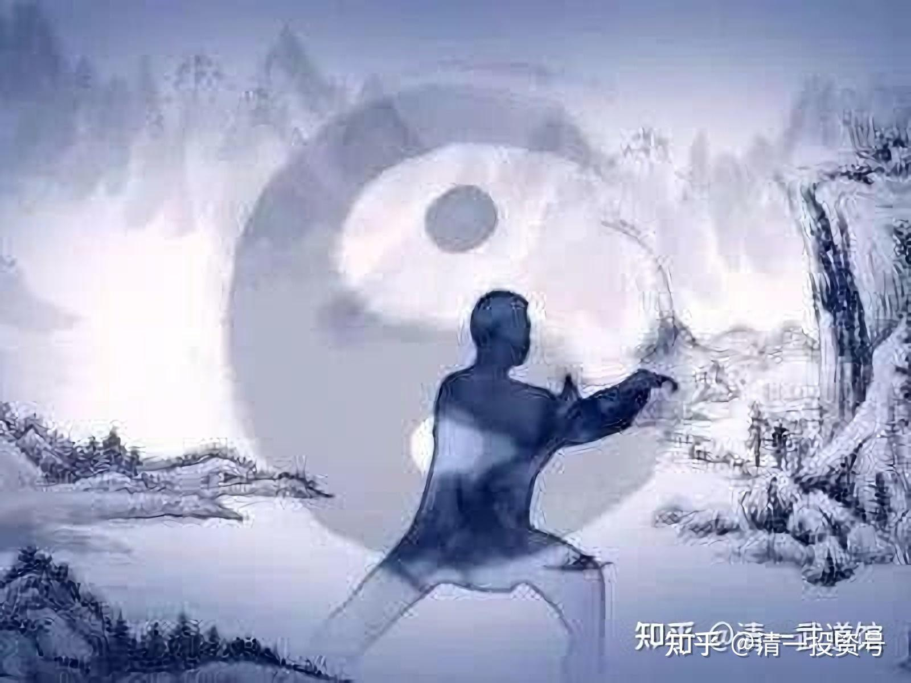
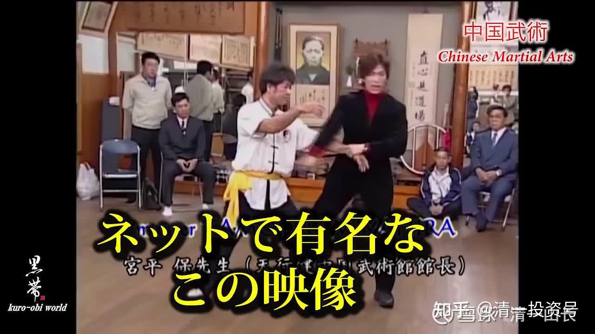
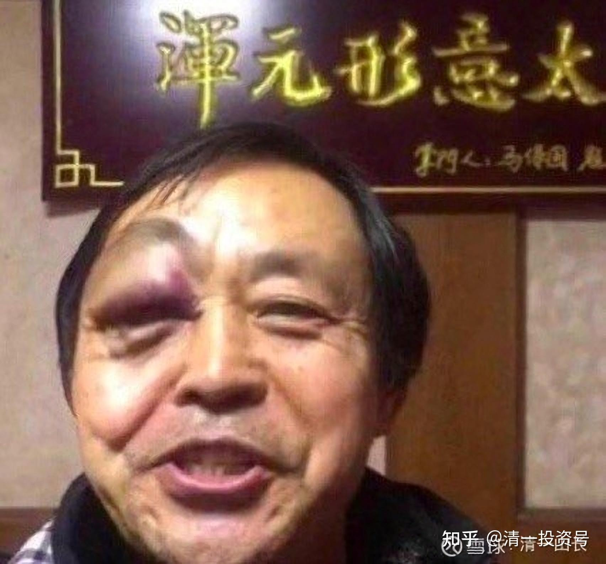

[原雪球专栏](https://zhuanlan.zhihu.com/p/562264164/edit)[117篇.传武杀人技？太极不出门？](http://link.zhihu.com/?target=https%3A//xueqiu.com/9310099567/173385749)

[清一山长](http://link.zhihu.com/?target=https%3A//xueqiu.com/9310099567/column) 2021年3月3日

传武是杀人技，不能用于擂台？所以打不赢现代搏击？

太极十年不出门，所以太极打不赢现代格斗？上不了擂台？

我告诉你们吧！**这些，都是传武骗子们用来忽悠你的话，用来掩饰自己不会真武术的忽悠话**，真相根本就不是这么回事。

下面我先破“太极十年不出门”被人故意误读的假话，再谈真传武杀人技的问题。

太极门，现在是玩得最假的传武，基本上市场上就没真的。一大堆的“雷雷们”跑出来雷人，“保国们”跑出来现眼。很多太极大师们，出来教拳，虽然根本就不懂啥实战，但对付一般没学过的人，还是没问题的。他们常常用擒拿手法，来代替格斗，演示太极的“格斗术”。格斗是格斗，擒拿是擒拿，这就是两个专业。擂台上，你去拿人试试？就是找打的。这就是忽悠人。你若较真，问到太极能不能跟其他拳派实战？老师其实根本就教不出来。就忽悠你说：“太极十年不出门”。所以，要练十年才能去打。你就以为，把老师教的擒拿术，练十年，你就自动会格斗了。这就是骗子，根本就不懂格斗是啥？这是两种完全不同的技术。很多人，连自己都骗过了。比如雷雷！

问题是：建国都70多年了，多少个十年过去了，也没见什么真正的太极高手出来呀？某人打假，把太极门都骂死了，也没人出来接招。只有几个雷人的保国宝贝们出来献丑；号称神功无数的大师们，根本就躲着不见人。这不是高深，而是故作高深。因为这些人学的是太极套路，要玩表演，以及程序格斗，套路一下人，倒是没问题。要在擂台上，与现代格斗实战一下，就没人了。不客气地说：“这些人，不管练了多少年，连入门都没有入。不是我说的，古书上说的。”

古书上咋说的？真正的内家拳，是“得其一二，则足以胜少林”。这是明朝末年实际练武的亲历者，自己记录的历史，比当代的骗子太极大师可靠得多。意思就是：只要学到初级的内家拳，就可以轻松克制外家拳了。你见过谁，练太极入门就能打赢外家拳的？没见过，都不是真的太极拳。别去听现在什么大师乱说，要练十年才入门。古书上说的记录，才是真的。

什么意思呢？大致上就是，**如果你遇到真正的太极传人，你也诚心练武。好好的练上3～5年的样子，你就可以与外家拳一决胜负了**。普通的外家拳手，根本就不是你的对手。估计要外家拳的顶尖高手，才能跟你一较高低。

用现在的标准来看，就是：**练太极三年左右，你就可以走上擂台，与一般的拳手对抗，而不落下风。胜率要比练了同样时间的外家拳手更高。这才是真太极。**

**如果你练了5年的真太极，你差不多就可以跟外家拳手的顶尖高手决战了，差不多可以去争夺世界搏击冠军了。**

**如果你认认真真的练了十年真太极，外家拳手，几乎就没人能和你过招了。连打都不知道该怎么打了，一出手就挨打，就像没练过拳一样。这才是真太极！**

那么，**这些人练套路吗？明给你说，不练。练套路的太极，全是骗你的。**

那么，套路是什么呢？

**太极的套路，是太极宗师练成后，编出来玩的体操。练成后，可以平时练练套路，就算练拳，复习太极功夫了，也是提高太极功夫的很好的方式。**但是没练成太极功夫，不会实战格斗之前，去练太极套路，就是瞎闹！就是浪费时间。你练得再多，都没有格斗的本领。你也不会真正的太极。套路别说十年，你练六十年都没用的。

**真练太极，是练太极的基本功。几个简单的动作，刻苦地练千遍万遍，根本不能练套路。**

一句话你就明白了：你练套路，怎么知道你练对了？如果是错的，你练一千遍、一万遍就能变成正确的吗？一个姿势，如“野马分鬃”你都没练好，你练一套一百零八式，就好了？骗人不是？

**真练拳，就是把如“野马分鬃”（不是你们看的套路上的样子）、云手等，每天好好地练，练上一千遍、一万遍。到了你一出手，这一招就能击败对手，攻防合一，打得对方没脾气，这就是“太极入门”了。**

我的弟子，就没人能接住我的一招“野马分鬃”。双方的手一挨上就要挨打！每次动作看上去都一样，就是没脾气，没办法接，躲也躲不掉。这才是练成一招了。这时候，你再去练别的招式，再练第二招、第三招。这样，五年、八年，你也没学几招。不过十年左右，你就基本上都学完了，还会自己创造很多新招出来。这就是“练成”了。

你们用这个标准，去看外面练太极拳的人，谁是这样练的？**不是，就是假的！当体操可以，别当真功夫。**

不过，说实话，这样练拳，是收不到学费的。你来学拳，我每天教你就一招“野马分鬃”，一年、两年都这样，我咋收钱呢？怪不得我的武道馆不收费，因为真没法收钱。我就只收心——想拿冠军的人，可以跟我学，不要钱，我还出钱供养。不想当冠军的，就滚蛋！

想收钱，我至少变个花样，明天教你“手挥琵琶”；后天教你“如封似闭”。这样，学生学得高兴，“这段时间学了不少！”老师也高兴，“今年收了不少学费。”

所以，中国最高深、最优雅、最实战的太极，就这样成了江湖卖艺的杂耍把戏！这种江湖卖艺表演的功夫，怎么可能去和世界格斗真打实战呢？所以，全体太极人，全都躲在一边不吭气了。我是实在看不过去，才出来做点事情的。有点多管闲事了。

本来，**我一个文人，搞教育的，居然来管武术的事情，真是天大的笑话！但中国，就是一个专门闹笑话的地方**。中国这么多的外语专家，我算啥？连外语都很差。但现在新教育4个月突破一门外语的教学法，就是我发明出来的。我一个外行，做到了内行做不到的事情。

难道武术上，也要再闹一个国际笑话吗？一个上了大学才对着书本练武的书生，从来没上过擂台，没打过擂台，没进过武林圈子，却来“振兴中华武术”，肯定是大骗子。

不过，我这个骗子没赚钱，还赔钱。武道馆一直是我花钱来经营，没有产生任何利润。将来估计还要继续赔钱。

太极真功夫，真的只要三五年就能练成？嘴巴说不算。两年前（2019年），我说过要训练传武的拳手来跟外家拳打的。我就成立了**清一武道馆**，招了十几个年轻人来练真太极。到现在两年过去了，孩子们刚刚练完一招太极防守式。目前正在练习太极攻击法，就是“野马分鬃”。练法跟你们知道的不一样，要练得真的像是马踏出去一样，对手一碰到你的手，就站不住，非要后退不可。他们就天天傻傻地练这一招，外形不变，内心却要不断去体验变化。

武道馆的拳手们，接受了两个外来拳手的实战比赛：一个是拿过青少年全国搏击冠军的年轻人，小伙子一直都很热爱武术，热爱练拳，从来不知道啥是内家拳。但跟我的弟子过招，完全被动挨打，毫无取胜的机会。

另一个是从小在武当山练拳，练了十几年的年轻人。身手很灵活，打起来也很凶猛，只是没章法。一看就知道没有经过高人点拨，练的根本就不是武术，而是体操！可惜了。跟我才练了两年的拳手对战，完全没有还手的机会。一接手就站不住，不断后退。

您要说，你没看见。当然你不可能看见了。为啥我的拳手不出来打？

因为疫情导致国内的搏击赛事都取消了，我们预定参加的，是“最干净”的赛事：世界拳击比赛。中国的武术界，很黑的，很多潜规则，用钱就可以买来胜利，甚至可以击败播求。只要告诉他：“这场比赛，场上不许KO我们的选手。KO了，就一点奖金都不给。如果打输了，给你发100万参赛费。如果打赢了，就只给50万。”你认为播求这一场，会怎么打？

我看过这场比赛，特别搞笑。播求的表现很滑稽，特别怕打伤对手，可对手得理不让人，弄得他有点不知所措的样子。播求就在清迈，他的老师，是我认识的一个泰国人。如果我想出名，花一百万，这样来请播求跟我打，今年的疫情他们的日子也特别的难过，正好缺钱呢！我就可以拿了一个“传武战胜播求”的名誉回国吹嘘了。只是我认为这样做太没意思了，玩这些东西干嘛？**道家求真，玩假打，天理不容，羞辱师门的。**

那么，我既然说太极很厉害？我和播求比，到底谁厉害？我问你：干嘛要比这个？我要出来跟你们表演杂耍吗？我希望永远不知道结果。因为真有了结果，根本就不是啥好事。想看比赛，将来看我的弟子们的赛事好了。中国的古训，老人要像个老人的样子，我60岁了，别学年轻人到处瞎玩，要庄重一点，跳上擂台不像个傻瓜吗？我又不是保国同志，这老伙计，估计穷疯了，想出台捞点本钱，招弟子，收学费。结果……更收不到学费了。保国真有本事，让弟子出来打呀？可见他门下真的无人[大笑]，连骗自家的弟子都骗不到的人，还想出来骗专业选手？笑话！

好了，不多说了，多说惹人嫌。我只是告诉大家：**你亲眼看到的，都不一定是事实。**所以，为了替中国武术正名，我们选的是最干净的赛事：世界正规的拳击比赛。一旦疫情开禁，我们的选手就要上场了。行家一眼就会看到：与传统的拳击很不一样。但傻瓜是看不出差别的，以为反正都是两个人在对打，都用拳击套，因此是一样的[捂脸]。

这只是告诉你：**真太极，真的三年内就可以练成初步的实战能力，能够跟外家拳一拼高下了；五年就明显胜过外家拳手了；真练十年，双方就别比了，就像大人跟小孩玩一样了。**

**“太极十年不出门”，意思就是：太极练了十年，就别跟人比了**。第一是没意思了，大多数人都无法跟你一战，因为双方没法比！另外，此时的功力已经很高，高手对战，一比就容易伤人，不是好事。所以，还是别出门惹事罢了。

我跟弟子说，练了太极，如真有十年的功力，双方打架，绝对不是慢悠悠地跟人推手，这是演电影。真实场景，是一见面，一动手，就有人趴下，双方的手挨上后，不超过两秒钟就决出胜负了。古人说的“犯者立仆”，不是骗人的。

**没想到吧？太极十年不出门的意思，居然是：太极出门要趁早！**

想见识一下十年的太极？你们就再等八年吧！因为我的弟子才教了两年。

想见我的功夫？你们还没这福气。上面已经说了“不出门”的。**太极的门规是：“不许公开演武卖艺”。**只有我的弟子才能见到我的功夫。当然，他们都是用身体见到的。有人就被我击倒，闭气半天动不了的人。还有人跟我场上对招，我一动手就哇哇大哭。但我根本没打上人。为啥？势太吓人，当场吓坏了[哭泣]。这种人不止一个！

前述的青少年搏击冠军，以及武当山的练武人，现在都在我的拳馆当学生，正在学改拳。难度极高——练拳容易改拳难，教完全不会武术的新人更容易。因为他们见到了更高明的武术——从未想象过的格斗方式，就是再费劲，也想改过来。毕竟是真心爱武的人。我就给他们一个机会慢慢改吧！能否改拳成功？不知道了，看他们的造化吧！

附录：有关传武的武术对话录

[国学中医黎天焕:](http://link.zhihu.com/?target=https%3A//xueqiu.com/3055265319)

传武没见过的，我认为应该是有两个原因：第一是真传武不能用来表演，师傅靠表演赚不了生活费。第二个是真传武是杀人技，在这人心浮躁的国家，教那些看金钱太重的人太危险。对比一下正宗的泰拳王功夫与中国人去仿制的泰拳，能看出那差距有多大的就明白了。

**[我的回答](http://link.zhihu.com/?target=https%3A//xueqiu.com/3055265319)**

至于传武，杀人技的说法，是传武的拳师们找的借口。啥杀人技？就不能用于擂台？西方的格斗术，当初就不是杀人技？拳击就不能杀人？想杀，一样杀！

**真正的原因，是吃传武饭的中国人不成器。**只喜欢到处骗钱，不愿意踏实钻研传武技术在现代格斗中的运用。太极古代也是杀人技，古书说的“犯者立仆”。现在谁会？只要是真本事，可用于杀人，也可以用于擂台比赛。当然，必须做一些改造，针对性的训练，适应擂台的需要。但骨子里面，必须是真传武。

**真传武的特点，就是比现代格斗难学得多。费体力，还要费脑子。**我的弟子都发现练太极脑子特别累，身体也要跟上现代格斗的体能要求，脑子也必须跟上。只有做到这些，才是真传武。

中国武林人士，谁去做了这件事情？实话实说，一个也没有。我就没发现一个这样的人。

日本有，一个叫宫平保的日本人，来武汉体院学了中国武术，在日本闯出了一片江山，成为了日本的中华武术代表。一生认真钻研中华传武，赢得了日本武术界的赞誉和尊重。他比当时一起学的中国武术同学强得多。

我的一个专业体育大学当武术教练的朋友，学的是传统武术，武痴一个。**他说，他每天只能“认认真真的混日子”，官方武林人士是这样。民间更糟糕，到处玩门派游戏，拜师收徒弟，比赛谁给的钱多！都成了金钱的奴隶，还是骗钱的把戏，既然骗钱比去真打更赚钱，谁还去真打？**费力不讨好？这就是中国传武的现状！有钱的“徒弟们”，花几十万拜个名师，也不是真想学啥功夫，就是图个名声，跟大款们买个包包、手表，是差不多的意思。**太极大师，也就是有钱人的装点和门面**，说起来个个门派宏大，师传有名，一个个名利场而已。不是啥真正的玩传武的圈。

巴西格蕾西家族的柔术，世界擂台赛上，多次击败MMA的选手，号称无败绩。它的来源是何处？就是日本传入巴西的柔术。而日本柔术来自何处？是明朝，中国的一个武术人士到日本教给日本人的，被日本发扬光大了。

而中国自己呢？现在到处追捧“巴柔”，以为是进口货。因为本土已经绝版了！当然只能学外国人了。

其他传武也一样，也面临绝版后“海外进口中华武术”的问题。说真的，就是中国的武术人士太没出息了。徐某人打假打的没错。

真太极格斗，最多等一年，我的弟子们就会出山，开始跟现代格斗打正式的擂台赛了。输，还是赢？是不是真传武？你们再等一年看吧！现在，你们还真看不到真太极，我也没看到谁会玩这东西的。

好奇想了解清一武道馆的，可以看这里：[网页链接](https://zhuanlan.zhihu.com/p/354387957)清一武道馆

[https://zhuanlan.zhihu.com/p/354387957](https://zhuanlan.zhihu.com/p/354387957)

**清一山长2021-03-03 23:52**

见识一下，中国玩传武的人，都是一群什么品种的存在。可以有这么没底线的，输赢不是问题，武无第二。但败军不敢言勇。可是输了，输得还很惨，还这么洋洋得意的人，真没见过！把自己的一副烂脸，拿到自己武馆招牌前拍照，是黑谁？马不知脸长。

比赛后马保国苏醒，面部肿胀，回应媒体更是语出惊人。马保国为了维护自己的面子打起了嘴炮，攻击年轻人缺乏武德。他认为功夫以点到为止，自己右拳放到对手的鼻子上没有去打他，自己就准备收拳了，如果这一拳自己发力，一拳就把对手鼻子打骨折了。

马保国曾在网上一顿吹牛，说自己一根手指就能撂倒两百斤的大汉，接、发、化可以打败世界上任何功夫，他甚至还找人拍摄影片，声称自己打败过欧洲MMA冠军皮特，也击败过黑人搏击冠军等等。

马保国还约战张伟丽，还叫嚣与UFC冠军连续大战，到底什么样的勇气支撑了“大师”的狂傲？

参考链接：

[清一投资号：实战太极与现代格斗之谜一：发力技术](https://zhuanlan.zhihu.com/p/567532235)（专栏文）

[清一投资号：实战太极与传武高级黑！是实话，可真相是这样吗？](https://zhuanlan.zhihu.com/p/563538316)（专栏文）

[清一投资号：真被“武术界、国术界”给恶心到了!](https://zhuanlan.zhihu.com/p/563695431)（专栏文）

[清一投资号：11篇.武道论之一：武林遗事](https://zhuanlan.zhihu.com/p/562801583)（整理文）

[清一投资号：14篇.武道论之二：真比武是什么样的？](https://zhuanlan.zhihu.com/p/523056291)（整理文）

[清一投资号：15篇.武道论之三：拜错老师误终身](https://zhuanlan.zhihu.com/p/522738920)（整理文）

[清一投资号：16篇.武道论之四：文武合一，道术合一，不忘初心](https://zhuanlan.zhihu.com/p/522751539)

[清一投资号：17篇.武道论之五：太极的低级、中级、高级境界](https://zhuanlan.zhihu.com/p/522768387)（整理文）

[清一投资号：18篇.武道论之六：武功无秘密唯有苦练](https://zhuanlan.zhihu.com/p/522789501)（整理文）

[清一投资号：26篇.解答大家对真太极的误解](https://zhuanlan.zhihu.com/p/527851327)（整理文）

[清一投资号：33篇.观真太极，现众生相](https://zhuanlan.zhihu.com/p/529770512)（整理文）

[山长 清一：当代传武人画像！传武毁于"传武人“！](https://zhuanlan.zhihu.com/p/561047657)

[山长 清一：中国百年来“传武人”的丑陋暴露无遗](https://zhuanlan.zhihu.com/p/467233067)

[山长 清一：中华武林和泰拳交战的历史记录](https://zhuanlan.zhihu.com/p/495443356)

[山长 清一：泰拳500年不败神话，正被清一太极终结](https://zhuanlan.zhihu.com/p/488027181)（第一、二场）

[山长 清一：昨天决战结果：拿了一条金腰带；另一条泰国人死活不给](https://zhuanlan.zhihu.com/p/505089200)（第三、四场）

[山长 清一：太极征泰第五战视频及点评：太极和泰拳的不同](https://zhuanlan.zhihu.com/p/533876532)

[山长 清一：太极征泰第6，7，8场战报：明晓一对二获胜](https://zhuanlan.zhihu.com/p/537753601)

[山长 清一：清一木兰第九战：明晓越级挑战50公斤级对手](https://zhuanlan.zhihu.com/p/544183017)

[山长 清一：太极征泰第10场比赛：木兰明晓 VS 帕卡（pancake）](https://zhuanlan.zhihu.com/p/555150182)

[山长 清一：太极征泰第11战：木兰佳惠第5战 KO胜](https://zhuanlan.zhihu.com/p/557345876)

[山长 清一：太极征泰第12战：明晓第七战VS男职业拳手](https://zhuanlan.zhihu.com/p/557820557)

[山长 清一：太极征泰第13场：佳惠第6战 KO胜（最怪异的比赛）](https://zhuanlan.zhihu.com/p/560524655)

[山长 清一：太极征泰第14，第15场比赛！](https://zhuanlan.zhihu.com/p/562359802)

[山长 清一：太极征泰16战：明晓第9战，点数胜。原版无点评](https://www.zhihu.com/zvideo/1552263008361082880)

[山长清一：太极征泰第17战 木兰佳惠二番战KO胜](https://www.zhihu.com/zvideo/1553014525674364928)
